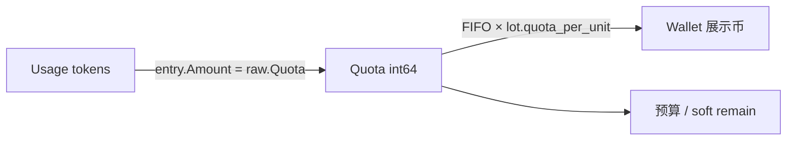
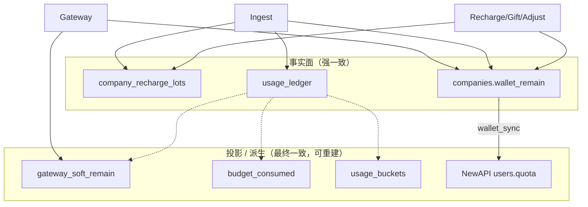
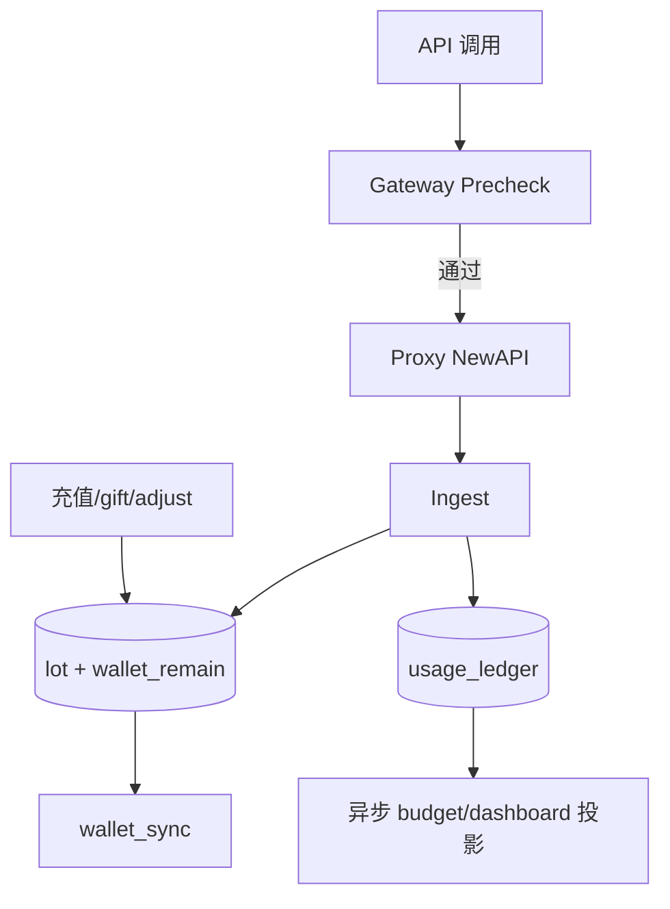
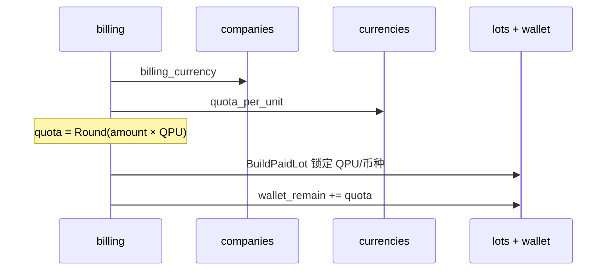
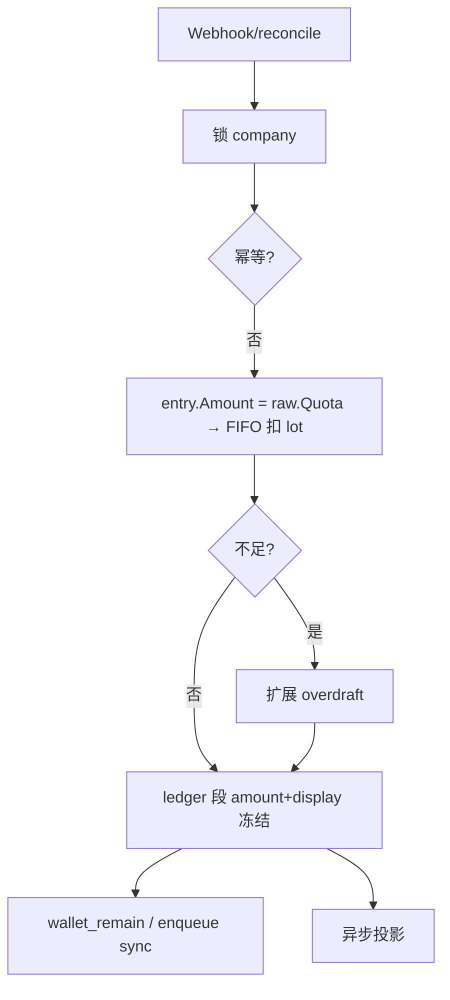
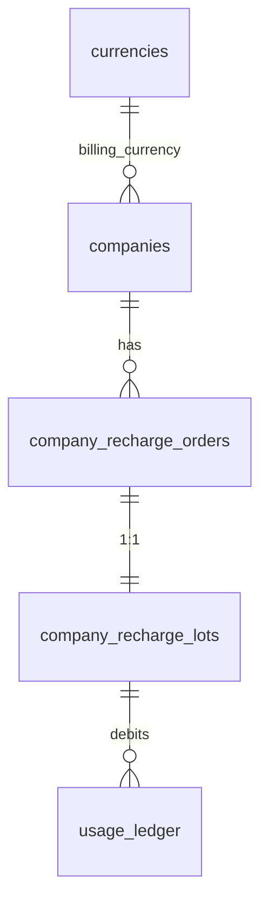

# Backend 计费模式

**一句话：** 内部统一 **point** 计量；钱包 / CallLog / 看板 Spend 以 **lot 冻结展示币** 为 SSOT；NewAPI `users.quota` 仅为 **派生通道配额**（可重建、非资金真相）。

**相关：** [Backend-预算.md](./Backend-预算.md) · [Backend-存储架构.md](./Backend-存储架构.md) · [Backend-架构.md](./Backend-架构.md) · [Backend-退款与冲正.md](./plan/Backend-退款与冲正.md)（设计 only） · [Frontend.md](./Frontend.md)

**阅读路径：**

| 章节 | 适合谁 | 内容 |
| --- | --- | --- |
| §1–2 | 产品 / 新同学 | 两套金额、三世界、币种配置 |
| §3–4 | 后端开发 | 权威边界、事实/投影、端到端流程 |
| §5–7 | 实现 / Review | 数据模型、公式、代码地图 |
| §8–9 | 联调 / 运维 | API 契约、部署 |
| §10 | 架构演进 | 风险、已收口项、待做 |

---

## 1. 产品视角：两套数，别混读

| 指标 | 用户看到 | 后端字段 | 用途 |
| --- | --- | --- | --- |
| **展示币** | 钱包余额、CallLog 费用、看板 Spend | `balances[]`、`ledger.display_amount`、`buckets.display_cost` | 财务闭合；**入账时冻结** |
| **Quota** | 预算/Key 额度（UI 常再换算成「元」） | `wallet_remain`、`budget_*`、`key.budget` | Gateway、预算、ingest |

默认：`1 CNY = 500000 quota`（`DefaultQuotaPerUnit`，与 `currencies` seed 对齐，等于 NewAPI 的 `QuotaPerUnit`）。

```text
钱包 / CallLog / Spend     预算 / Key 额度 UI
   已是展示币                   用户填展示额
   formatMoney                  quotaToDisplay / displayToQuota
        │                              │
        ▼                              ▼
   lot 单价冻结                 API 只存 quota (int64)
        └──────── quota 世界（Gateway / ingest）────────┘
```

**文案：** 「账户余额」= lot 闭合；「预算额度」= 组织额度（按**当前**公司 QPU 近似展示，≠ 历史 CallLog 单价）。

易错：**量纲混用**（填 ¥ 当 quota 提交 → ~500000×）、**二次换算**（对已是展示币再 ÷QPU）。

---

## 2. 三个世界与币种配置



| 世界 | 含义 | 典型字段 | 改公司币后现算？ |
| --- | --- | --- | --- |
| Usage | token / 次数 | `input_tokens` / `output_tokens` | — |
| Quota | 内部统一货币 (int64) | `wallet_remain`、`ledger.amount`、`budget_*` | 额度本身不换币 |
| Wallet | lot 成本价 + 冻结展示 | `ledger.display_amount`、`buckets.display_cost` | **否** |

### 2.1 币种 / QPU SSOT

| 位置 | 作用 |
| --- | --- |
| `common.DefaultBillingCurrency`（`CNY`） | 唯一硬编码默认币码 |
| `common.ResolveBillingCurrency` | 空 → 默认 |
| `currencies.quota_per_unit` | **QPU 表级 SSOT** |
| `companies.billing_currency` | 公司**当前**计费币（只影响**新**充值 / overdraft） |
| Session `billingCurrency` + `quotaPerUnit` | FE 写边界注入（`ResolveCompanyChargeRate`） |

### 2.2 冻结规则（已实现）

1. 订单：落 `currency` + `quota_per_unit` + `quota_granted`。  
2. Lot：`display_amount = quota / lot.quota_per_unit`（paid/adjust）；gift/overdraft AmountDisplay=0。  
3. 消耗：`display_amount = take / lot.quota_per_unit`，币种 = **lot.billing_currency**。  
4. 改 `companies.billing_currency`：历史 lot / ledger **不回写**。

---

## 3. 系统边界：谁说了算



| 面 | 代表 | Gateway |
| --- | --- | --- |
| 事实 | lots、ledger、`wallet_remain` | `wallet_remain` 可读；**禁止**热路径 `SUM(ledger)` |
| 投影 | soft / consumed / buckets | soft 可用（带 lag） |

与 [架构终态设计.md](./架构终态设计.md) 一致：**摘要列是投影，不是事实。**

### 3.1 权威矩阵

| 能力 | SSOT | 派生 |
| --- | --- | --- |
| 企业可用 point | `wallet_remain` / Σ lot remaining | — |
| 展示币钱包 | `company_recharge_lots`（paid+adjust） | — |
| 单笔消耗 | `usage_ledger`（amount + display） | — |
| 组织 consumed | — | `budget_consumed`（point） |
| 看板 Spend | — | `usage_buckets.display_cost`（展示币） |
| Gateway 挡单 | `wallet_remain` + soft | NewAPI 不挡预检 |
| NewAPI wallet | — | `wallet_sync` |

**不变量：** 禁止用 NewAPI quota 反算对外钱包；漂移以 Postgres 为准。

### 3.2 写 / 读边界（量纲纪律）

```text
写边界（仅此换算）：表单展示→point（session.PPU）｜充值币→point（currencies.PPU）｜quota→point（CostFromQuota）
事实面：lots + ledger + wallet_remain
投影面：consumed / soft / buckets（不重计价）
读边界：已结算钱 → formatMoney｜额度 point → formatDisplayCurrency
```

### 3.3 设计约束

1. Schema 以 `schema.sql` 为准；本地 wipe + seed。  
2. 生产路径 `NEW_API_GATEWAY_ENABLED=true`；禁止旁路消费。  
3. lot = 充值批次；每笔 lot 1:1 `company_recharge_orders`。

---

## 4. 核心流程

### 4.1 总览



入账同事务：**lot + ledger + wallet_remain**。  
`budget_consumed` / `gateway_soft_*` / `usage_buckets`：**异步投影**（非同事务；有 soft lag）。

### 4.2 充值



| 场景 | `lot_kind` | 展示币 |
| --- | --- | --- |
| 自助/平台充值 | `paid` | `quota / QPU`，锁 QPU |
| 赠送 | `gift` | 0 |
| 调账 | `adjust` | 显式写入 |
| ingest 透支 | `overdraft`（每企业至多一个 active） | 0 |

新企业 `wallet_remain=0`，无初始 lot。

### 4.3 消耗：FIFO + overdraft



- 跨 lot → 多段 ledger；gift/overdraft 段 `display_amount=0`。  
- lot 不足**不得**让 webhook 永久失败 → overdraft（应可观测告警，见 §10）。

### 4.4 Gateway 预检

单位均为 **point**。不读 NewAPI；读 `wallet_remain` + `gateway_soft_remain`。

| # | 检查 |
| --- | --- |
| 1 | 企业 active |
| 2 | `wallet_remain ≥ minEstimate`（当前固定 `0.01×DefaultPPU`） |
| 3 | soft remain > 0（有配置时） |
| 4 | Key active / 未过期 |
| 5 | 模型白名单 |

**不做：** 动态 estimate；热路径扫 ledger；ingest 同事务重投影。  
soft lag：见 [Backend-v1-Ingest链路优化.md](./Backend-v1-Ingest链路优化.md) §10。

### 4.5 wallet_sync

Postgres 扣 point 与 NewAPI 扣 quota 有取整差：`Unique 5s` debounce → `ToNewAPIUnits` → `TopUp(delta)`；漂移超 ε 入队校准。Gateway **不因** pending sync 拒单。

---

## 5. 数据模型精要

### 5.1 表关系



### 5.2 展示币闭合（paid + adjust）

```text
display = quota / lot.quota_per_unit                         (单条)
balance(c) = Σ (quota_remaining × amount_display / NULLIF(quota_granted,0))  WHERE currency=c AND kind∈{paid,adjust}
totalTopup − totalConsumed = balance
```

### 5.3 Quota 守恒

```text
Σ quota_granted − Σ ledger.amount = Σ quota_remaining
wallet_remain = Σ quota_remaining
```

### 5.4 lot_kind

| kind | 可花 | 计 totalTopup | 消耗 display |
| --- | --- | --- | --- |
| paid / adjust | ✅ | ✅ | `take / lot.quota_per_unit` |
| gift / overdraft | ✅ | ❌ | 等价金额（同公式） |

预算 limit / consumed、key.budget 均为 **int64 quota**。

---

## 6. 公式与一致性

### 6.1 换算

```text
entry.Amount = raw.Quota                              (NewAPI 日志直通，零转换)
display_amount = take / lot.quota_per_unit            (FIFO 冻结)
quota_granted = Round(amount_display × QPU(currency))
```

| 常量 | 值 |
| --- | --- |
| `DefaultQuotaPerUnit` | 500000 |

### 6.2 闭环

| # | 验证 |
| --- | --- |
| 1 | quota 守恒：授予 − ledger = remaining |
| 2 | 展示币闭合：`wallet_closure_test` |
| 3 | `display_amount = amount / lot.quota_per_unit` |
| 4 | 幂等 `(company_id, idempotency_key, lot_id, …)` |
| 5 | FIFO 与 ledger / wallet 同事务 |
| 6 | NewAPI token unlimited_quota=true，无需同步 |
| 7 | 投影终态：`Σ ledger.amount ≈ budget_consumed`（可 reconcile） |

### 6.3 边界行为

| 场景 | 行为 |
| --- | --- |
| 预检不足 | 拒绝，不 proxy |
| lot 不足 | overdraft |
| 改币种 | 旧 lot/CallLog 不变；新充值用新币 |
| 退款 | **未实现** → [Backend-退款与冲正.md](./plan/Backend-退款与冲正.md) |

---

## 7. 代码地图

```text
pkg/common/constants.go          DefaultBillingCurrency / DefaultQuotaPerUnit
pkg/newapiunits/quota.go         NewAPIGroupForDepartment

domain/billing/currency.go       ResolveCompanyChargeRate / resolveQuotaPerUnit
domain/billing/lot*.go           BuildPaidLot / Confirm / ConsumeLots
domain/billing/wallet_*.go       AggregateWallet / lifetimeRequestCount

domain/usage/ingest.go           入账事务（entry.Amount = raw.Quota）
domain/usage/ledger_audit.go     CallLog.cost = DisplayAmount

identity/authz/service.go        Session 下发 billingCurrency + quotaPerUnit
domain/gateway/evaluate.go       预检（wallet_remain + combined_key_remain）

apps/frontend/src/lib/quota-display.ts  createBillingExchange / setActive（session 同步）
                                        formatMoney(展示币) vs formatDisplayCurrency(quota)
```

**HTTP：** `GET /billing/wallet` · `GET /session`（含币种/QPU）· `POST /platform/.../recharge|gift|adjust`

---

## 8. API 与前端契约

### 8.1 Session（写边界）

```json
{ "billingCurrency": "CNY", "quotaPerUnit": 500000, "...": "..." }
```

FE：`AuthSessionProvider` → `setActiveBillingExchange`；表单 `displayToQuota` / `quotaToDisplay`。

### 8.2 钱包

```json
{
  "billingCurrency": "CNY",
  "balances": [{ "currency": "CNY", "balance": 37.5, "totalTopup": 100, "totalConsumed": 62.5 }],
  "walletRemain": 18750000,
  "giftQuota": 0,
  "overdraftQuota": 0
}
```

### 8.3 读侧 helper

| 数据 | Helper |
| --- | --- |
| CallLog / Spend / 钱包余额 | `formatMoney`（禁止再 ÷PPU） |
| 预算 / Key remaining | `formatDisplayCurrency` |

预算/Key API **只收发 point**。

---

## 9. 部署与运维

```bash
pnpm start:postgres   # schema 变更：wipe + seed
cd apps/backend && make test-unit
go test -tags=testhook ./tests/domain/billing/... -run WalletClosure
go test -tags=testhook ./tests/identity/authz/...
```

| 场景 | 读哪 |
| --- | --- |
| Gateway | `wallet_remain` + soft |
| 看板 Spend | `usage_buckets.display_cost` |
| 钱包 | lots 聚合 |
| 财务时段 | `ledger.display_amount` |

---

## 10. 风险、收口与演进

### 10.1 已收口（量纲）

| 项 | 状态 |
| --- | --- |
| Session 下发币种+QPU | ✅ |
| Key/审批 display↔quota | ✅ |
| CallLog/看板 `formatMoney` | ✅ |
| Ingest 直通 raw.Quota | ✅ |
| 充值 QPU 查表 + FIFO 冻结 display | ✅ |

### 10.2 接受中的风险

| 风险 | 缓解 |
| --- | --- |
| soft lag | 投影加速 + `budget_reconcile`；不扫 ledger |
| sync 取整 | ε + debounce |
| 固定 minEstimate | 故意保持粗闸门 |
| float64 | NUMERIC 落库 |
| 无退款 | 设计见退款文，未实现 |

### 10.3 待做

| 优先级 | 项 |
| --- | --- |
| P1 | overdraft 告警/打点 |
| P2 | 退款/冲正（[设计文档](./plan/Backend-退款与冲正.md)） |
| P2 | gift/adjust 运营 UI |
| P3 | 多币种充值业务 / 改币种产品流程 / decimal / lot 归档 |

### 10.4 红线

- 不用 NewAPI quota 反算钱包  
- 不 UPDATE 历史 `display_amount` 用新汇率  
- 不以旁路直连 NewAPI 为主消费路径  
- 不做 Gateway 动态 estimate（除非产品另开需求）  
