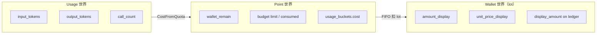
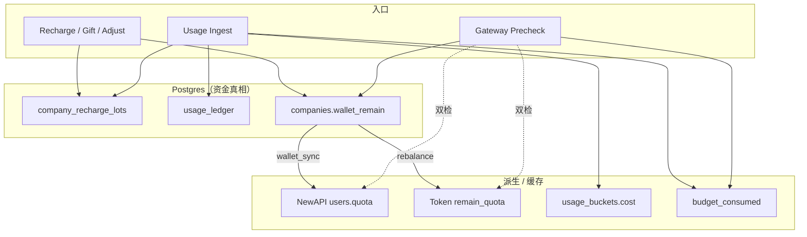
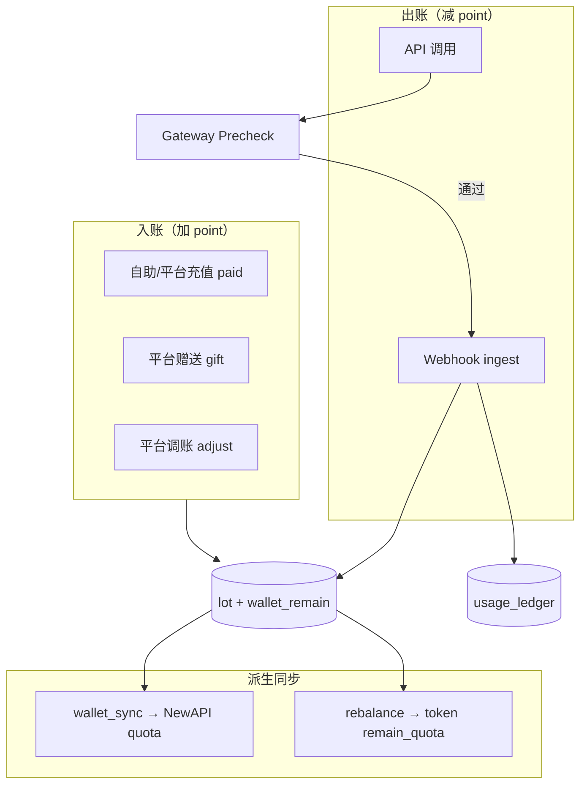
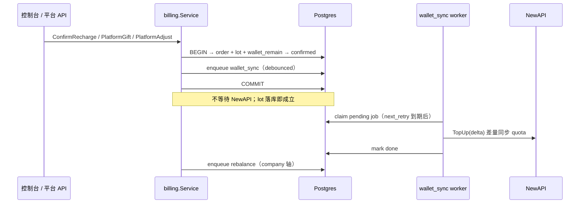
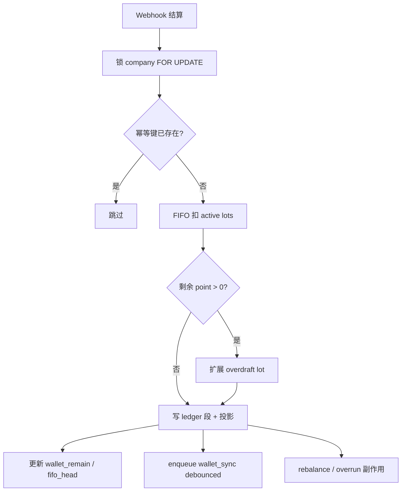
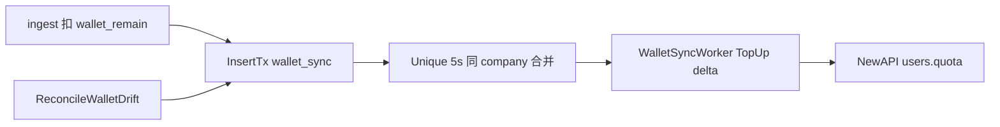
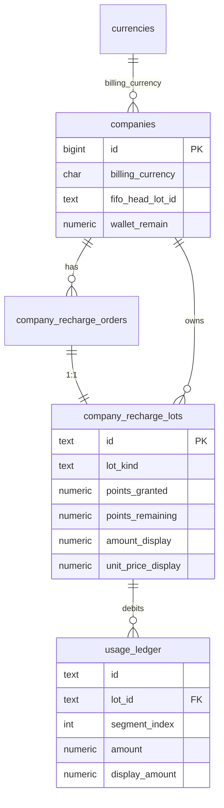

# Backend 计费模式

**一句话：** 内部统一 **point** 计量；钱包展示币以 **lot 成本价** 为 SSOT；NewAPI `users.quota` 仅为 **派生通道配额**（可重建、非资金真相）。

**相关：** [Backend-预算.md](./Backend-预算.md) · [Backend-存储架构.md](./Backend-存储架构.md) · [Backend-架构.md](./Backend-架构.md) §0 · [Backend.md](./Backend.md) · [Frontend.md](./Frontend.md)

**阅读路径：**

| 章节 | 适合谁 | 内容 |
| --- | --- | --- |
| §1–2 | 产品 / 新同学 | 用户看到什么、钱从哪来去哪 |
| §3–4 | 后端开发 | 权威边界、端到端流程 |
| §5–7 | 实现 / Code Review | 数据模型、公式、代码地图 |
| §8–9 | 联调 / 运维 | API 契约、部署约束 |
| §10 | 架构演进 | 已知风险与未来优化 |

---

## 1. 产品视角：两套数，别混读

用户和管理员会接触两类金额，**量纲不同、用途不同**：

| 指标 | 用户看到 | 后端字段 | 用途 |
| --- | --- | --- | --- |
| **展示币** | 钱包页 ¥ 余额、充值记录 | `balances[].balance` | 财务对账、充值 − 消耗 = 余额 |
| **Point** | 可用 point、赠送 point（技术向） | `walletRemainPoint` | Gateway 挡单、预算 limit、NewAPI 同步 |

换算关系（当前默认）：`1 元 (CNY) = 1000 point`（`DefaultPointsPerUnit`）。

```text
┌─────────────────────────────────────────────────────────┐
│  钱包页（展示币）          预算页（展示币 UI）              │
│  ¥100 余额                ¥50 部门额度                    │
│       │                         │                       │
│       │ ÷ PPU                   │ ÷ PPU 展示 / × PPU 提交│
│       ▼                         ▼                       │
│  lot 成本价闭合              API 存 point                 │
│       │                         │                       │
│       └──────── point 世界 ──────┘                       │
│                    │                                     │
│              Gateway / ingest / 预算 consumed            │
└─────────────────────────────────────────────────────────┘
```

**产品文案建议：** 区分「账户余额」（钱包 lot 闭合）与「预算管理」（组织额度近似，按当前 PPU 换算）。

---

## 2. 三个世界



| 世界 | 含义 | 典型存储 |
| --- | --- | --- |
| **Usage** | token / 次数；审计，不计价 | `usage_ledger.input_tokens` 等 |
| **Point** | 内部统一货币；预算、Gateway、投影 | `wallet_remain`、`usage_ledger.amount`、`usage_buckets.cost` |

HTTP 响应字段为 `walletRemainPoint`（见 [Frontend.md](./Frontend.md) §5.9 · `api/billing.ts`）。
| **Wallet（lot）** | 充值批次 + 展示币成本价 | `company_recharge_lots`、`usage_ledger.display_amount` |

映射链：`Usage → Point →（FIFO 扣 lot）→ display_amount = points × unit_price_display`

---

## 3. 系统边界：谁说了算



### 3.1 权威矩阵

| 能力 | SSOT | 派生 |
| --- | --- | --- |
| 企业可用 point | `Σ lot.points_remaining` / `companies.wallet_remain` | — |
| 展示币钱包闭合 | `company_recharge_lots`（`paid` + `adjust`） | — |
| 单笔消耗 | `usage_ledger`（point + `display_amount`） | — |
| 组织 consumed | `budget_consumed.consumed`（point） | — |
| 看板 cost | `usage_buckets.cost`（point） | 展示币按需聚合 ledger |
| Token 分配 | — | NewAPI `remain_quota`；rebalance 按 `wallet_remain` 封顶 |
| Gateway 挡单 | Postgres `wallet_remain` + 组织预算（`LoadPrecheckContext` + `Evaluate`） | NewAPI 同步（冷路径，不挡预检） |
| NewAPI 企业 wallet | — | `wallet_sync` 从 Postgres 派生 |

**不变量：**

- 禁止用 NewAPI quota 反算对外钱包余额。
- Postgres 与 NewAPI 漂移：**以 Postgres 为准**校准。

### 3.2 设计约束

1. **Schema 即真相**：表结构以 `schema.sql` 为准；部署 wipe + seed，不做增量 `ALTER`/回填。
2. **企业钱包权威**：Postgres `company_recharge_lots` + `wallet_remain`；NewAPI `users.quota` 仅为派生通道配额。
3. **字段量纲**：`usage_ledger.amount`、`usage_buckets.cost`、`budget_consumed.consumed`、组织 `budget` 均为 **point**；钱包 API 展示币由 lot 成本价闭合。
4. **生产路径**：`NEW_API_GATEWAY_ENABLED=true`；禁止旁路直连 NewAPI 消费（否则 overdraft 激增）。

术语：**lot** = 充值批次；每笔 lot 必有 1:1 的 `company_recharge_orders` 行。

---

## 4. 核心流程

### 4.1 总览



### 4.2 充值：订单 → lot → 异步同步



**lot_kind 矩阵：**

| 场景 | `source` | `lot_kind` | 订单 `amount` | 展示币 |
| --- | --- | --- | --- | --- |
| 企业自助充值 | `self` | `paid` | 实付 | `points / PPU` |
| 平台代充 | `platform` | `paid` | 实付 | 公式计算 |
| 平台赠送 | `gift` | `gift` | `0` | `0` |
| 运维补点（有价） | `adjust` | `adjust` | 单据 | 显式写入 |
| 运维补点（无价） | `adjust` | `adjust` | `0` | `0` |
| ingest 透支兜底 | `system` | `overdraft` | `0` | `0` |

规则：

- 每笔 lot 必有 1:1 `company_recharge_orders`。
- **overdraft**：每企业至多一个 active lot；不足时累加 `points_granted/remaining`，不每次新建。
- 新企业 `wallet_remain = 0`，无初始 lot；首笔充值或平台赠送后才有额度。

### 4.3 消耗：FIFO + overdraft



- 单次消耗可跨多个 lot → 多段 `usage_ledger`（`segment_index` + `lot_id`）。
- **禁止**因 lot 不足让 Webhook 永久失败；不足走 overdraft 并应告警。
- `gift` / `overdraft` 消耗时 `display_amount = 0`，不参与钱包展示闭合。

### 4.4 Gateway 预检（纯 Postgres + 纯内存 Evaluate）

全部比较单位为 **point**（展示币不参与挡单）。**不读 NewAPI**；读 `wallet_remain` 与 `platform_keys.gateway_soft_remain` + limit。`wallet_sync` 滞后不挡单；漂移由异步同步消化。

| # | 检查 | 数据源 |
| --- | --- | --- |
| 1 | 企业 active | `LoadPrecheckContext` → `companies.status` |
| 2 | `wallet_remain ≥ estimate` | 同左（投影列 O(1)） |
| 3 | 组织预算 min 轴（dept / key / member / group） | snapshots + limit，一次 SQL 带出 |
| 4 | Key `status = active` | `platform_keys` |
| 5 | 模型白名单（有配置时） | `model_allowlist` + `models.type` |

当前 `estimate` = 固定 `0.01 × PPU`（10 point），非按请求模型动态估价。

实现：`store.GatewayPrecheck.LoadPrecheckContext` → `gateway.Evaluate`。

### 4.5 wallet_sync：双扣与校准

每次 API 调用存在**两套扣费**：

| 侧 | 扣什么 | 量纲 |
| --- | --- | --- |
| Postgres ingest | 实际模型价 | point |
| NewAPI 通道 | quota units | `QuotaPerUnit = 500000` 比例 |

二者必然有取整差。策略：



1. ingest / 充值后 `InsertTx(wallet_sync)`；`Unique ByPeriod: 5s`（等同现网 debounce 语义）。
2. `target = ToNewAPIUnits(wallet_remain, modelPriceUpper)`（溢出饱和到 `MaxInt64`）→ `FreshNewAPIUnits` 读权威 `users.quota` → `QuotaDelta(target,current)` → `TopUp(delta)` → invalidate 缓存。
3. 定时对账：`|FromQuotaUnits(na) − wallet_remain| > ε` → 入队 sync。
4. NewAPI 返回 `bigint out of range`（SQLSTATE 22003）视为不可重试，Worker `JobCancel`，避免刷屏 retry。

> Gateway 预检读 `wallet_remain` 与 `gateway_soft_remain`；不因 pending sync 或漂移拒单。
> 校准 / platformkey 封顶走 `FreshNewAPIUnits`，避免过期钱包缓存导致对近满 quota 再 add。

---

## 5. 数据模型精要

### 5.1 核心表关系



### 5.2 展示币闭合（paid + adjust）

```text
unit_price_display = amount_display / points_granted     -- 创建时锁定

totalTopup(c)     = Σ amount_display
                    WHERE billing_currency = c AND lot_kind IN ('paid','adjust')

balance(c)        = Σ (points_remaining × unit_price_display)
                    WHERE billing_currency = c AND lot_kind IN ('paid','adjust')

totalConsumed(c)  = totalTopup(c) − balance(c)
```

钱包 API 保证：`totalTopup − totalConsumed = balance`（同币种）。

### 5.3 Point 守恒（全 lot）

```text
Σ lot.points_granted − Σ ledger.amount = Σ lot.points_remaining
wallet_remain = Σ lot.points_remaining
```

### 5.4 lot_kind 与展示币

| `lot_kind` | point 可花 | 计入 totalTopup | 消耗 display |
| --- | --- | --- | --- |
| `paid` | ✅ | ✅ | `points × unit_price` |
| `adjust` | ✅ | ✅（含 0 价调账） | 同上 |
| `gift` | ✅ | ❌ | `0` |
| `overdraft` | ✅（兜底） | ❌ | `0` |

### 5.5 投影表（均为 point）

`usage_buckets.cost`、`budget_consumed.consumed`、`org_nodes.budget`、`members.personal_budget`、`projects.budget`、`platform_keys.budget` — 语义均为 point，无 `billing_currency` 拆键。

`models.input_price` / `output_price` 单位为 **point / 模型计价单位**。

---

## 6. 公式与一致性

### 6.1 换算

```go
// NewAPI log quota → point
CostFromQuota(quota, modelPricePoint) = quota / QuotaPerUnit * modelPricePoint

// point → NewAPI quota（sync / rebalance 用上界价，宁少勿超；溢出饱和到 MaxInt64）
ToNewAPIUnits(points, modelPriceUpper) = sat(points / modelPriceUpper * QuotaPerUnit)

// wallet_sync TopUp 增量：保证 current+delta ∈ [0, MaxInt64]
QuotaDelta(target, current) = clamped(target - current)

// rebalance key 封顶：used = AddSat(Σ other remain)；available = SubFloor0(walletUnits, used)；remain = min(allocated, available)

// 展示币 ↔ point（充值时）
points_granted = amount_paid × PPU(currency)
amount_display = points_granted / PPU(billing_currency)   // paid lot
```

常量（`internal/pkg/common`）：

| 常量 | 值 | 用途 |
| --- | --- | --- |
| `DefaultPointsPerUnit` | 1000 | CNY 默认换算 |
| `QuotaPerUnit` | 500000 | NewAPI quota 比例 |
| `WalletSyncDebounceSecs` | 5 | sync 延迟 + Gateway Retry-After |
| `WalletSyncDriftEpsilon` | 10 point | 漂移阈值 |

### 6.2 一致性闭环

| # | 闭环 | 验证 |
| --- | --- | --- |
| 1 | point 守恒 | lot 授予 − ledger 扣减 = lot 剩余 |
| 2 | 展示币闭合 | `wallet_closure_test` |
| 3 | 段成本价 | `ledger.display_amount = amount × lot.unit_price_display` |
| 4 | 投影同事务 | ledger → snapshots / buckets |
| 5 | 幂等 | `(company_id, idempotency_key, lot_id)` |
| 6 | FIFO 原子 | lot 扣减与 ledger 同事务 |
| 7 | 通道校准 | sync 后 NewAPI 与 `wallet_remain` 在 ε 内 |

### 6.3 边界行为

| 场景 | 行为 |
| --- | --- |
| 预检余额不足 | Gateway 拒绝，不 proxy |
| ingest lot 不足 | 扩展 overdraft，告警 |
| 跨 lot 消耗 | 多 ledger 段 |
| 切换 `billing_currency` | 已有 lot 按原币种保留；`balances[]` 分币种展示 |
| 退款 | **未实现** |

---

## 7. 代码模块地图

```text
domain/billing/
  lot.go              BuildPaidLot / Gift / Adjust；PPU 换算
  lot_confirm.go      充值确认 → ConfirmRechargeWithLot
  wallet_view.go      GetWallet → AggregateWallet
  wallet_sync.go      SyncCompanyWallet / ReconcileWalletDrift
  service.go          PlatformRecharge / Gift / Adjust

domain/usage/
  lot_allocate.go     FIFO AllocateConsumptionLots + overdraft
  ingest.go           事务：分配 lot → InsertSegments → 投影 → enqueue sync

domain/gateway/
  precheck.go         LoadPrecheckContext + Evaluate（wallet_remain + 预算 + allowlist）
  gateway_service.go  Retry-After 透传

domain/budget/
  rebalance.go        按 wallet_remain 封顶 NewAPIKey remain_quota

store/postgres/
  billing_repo.go     lot CRUD、AggregateWallet、ExpandOverdraftLot
  ledger_repo.go      InsertSegments

infra/jobs/enqueuer.go        InsertTx(wallet_sync) + Unique 5s
infra/river/                  Client + Workers + Periodic
infra/ingest/worker.go        日志库 pending / reconcile

pkg/newapiunits/quota.go        point ↔ quota units（domain / tests 直接引用）
```

**HTTP：**

- `GET /billing/wallet` — 钱包视图
- `POST /platform/companies/{id}/recharge|gift|adjust` — 平台操作

**前端：**

- `src/lib/points.ts` — `pointsToDisplay` / `displayToPoints`
- 钱包页读 `balances[]` + `walletRemainPoint`；预算页 UI 展示币编辑、API 存 point

---

## 8. API 契约

### 8.1 钱包

```json
{
  "companyId": 2,
  "billingCurrency": "CNY",
  "balances": [
    { "currency": "CNY", "balance": 37.5, "totalTopup": 100.0, "totalConsumed": 62.5 }
  ],
  "walletRemainPoint": 375000,
  "giftPoints": 50000,
  "overdraftPoints": 0,
  "totalRequests": 1234
}
```

充值记录 `status`：`pending` | `confirmed` | `failed`。

### 8.2 预算

- API JSON 读写均为 **point**。
- 前端 `÷ PPU` 展示、`× PPU` 提交。
- 部门真实展示币花费：按时间范围聚合 `usage_ledger.display_amount`。

---

## 9. 部署与运维

```bash
# 改 schema 后：wipe + seed（无增量 migration）
pnpm start:postgres
# down -v && seed

# 回归
cd apps/backend && make test-unit
pnpm -F @tokenjoy/frontend test

# 重点
go test -tags=testhook ./tests/domain/billing/... -run WalletClosure
go test -tags=testhook ./tests/domain/gateway/... -run Wallet
go test -tags=testhook ./tests/store/postgres/... -run WalletSync
```

**性能读路径：**

| 场景 | 数据源 |
| --- | --- |
| Gateway / 超限 | `wallet_remain` + `budget_consumed` |
| 看板 | `usage_buckets.cost` |
| 钱包展示币 | `company_recharge_lots` 聚合 |
| 财务时段 | `usage_ledger.display_amount` + 时间范围 |

优化优先级：`wallet_remain` 缓存 → `fifo_head_lot_id` → lot FIFO 索引 → ledger 分区索引。

---

## 10. 已知风险与未来优化

### 10.1 当前接受的风险

| 风险 | 缓解 | 严重度 |
| --- | --- | --- |
| 预检与 ingest 竞态 | company 行锁；短窗 overdraft | 低 |
| sync 取整差 | ε 对账 + debounce + PlatformSync（Phase 3） | 低 |
| 预算展示 ≠ 钱包财务 | 产品文案区分；财务走 ledger | 中（预期） |
| 固定 minEstimate | 挡住极端零余额；大请求可能预检漏估 | 低 |
| float64 运算 | Postgres `NUMERIC` 落库；大额可换 decimal | 低 |
| 无退款 | Roadmap 冲正单 | 中（产品缺口） |

### 10.2 建议优化（按优先级）

**P1 — 正确性 / 可观测性**

| 项 | 说明 |
| --- | --- |
| overdraft 告警接入 | ingest 扩展 overdraft 时打 metric / 通知运营 |
| sync 审计表 | 记录每次 sync 前后 quota，便于排障（非资金闭环必需） |
| Gateway 动态 estimate | 按请求模型 + 预估 token 算 `estimate`，减少「预检过、实际超」 |

**P2 — 产品能力**

| 项 | 说明 |
| --- | --- |
| 退款 / 冲正 | `lot_kind=refund` 或负向 adjust + ledger 冲正 |
| 平台 gift/adjust 控制台 UI | 后端 API 已有，补运营界面 |
| 预算 API 边界换算 | handler 自动 `point ↔ 展示币`，字段语义对齐钱包 |

**P3 — 规模 / 多币种**

| 项 | 说明 |
| --- | --- |
| 多币种充值路径 | schema 已支持 `currencies` + `balances[]`，补业务与 FX 规则 |
| `billing_currency` 切换流程 | 产品规则 + 已有 lot 按币种保留于 `balances[]` |
| decimal 全链路 | Go 侧 `shopspring/decimal` 替换 float64 |
| lot 归档 | exhausted lot 定期归档，减 FIFO 扫描成本 |

### 10.3 架构红线

- 不用 NewAPI quota 反算钱包余额
- 不以增量 migration / 双写维持多套账本
- 不以旁路直连 NewAPI 作为主消费路径
