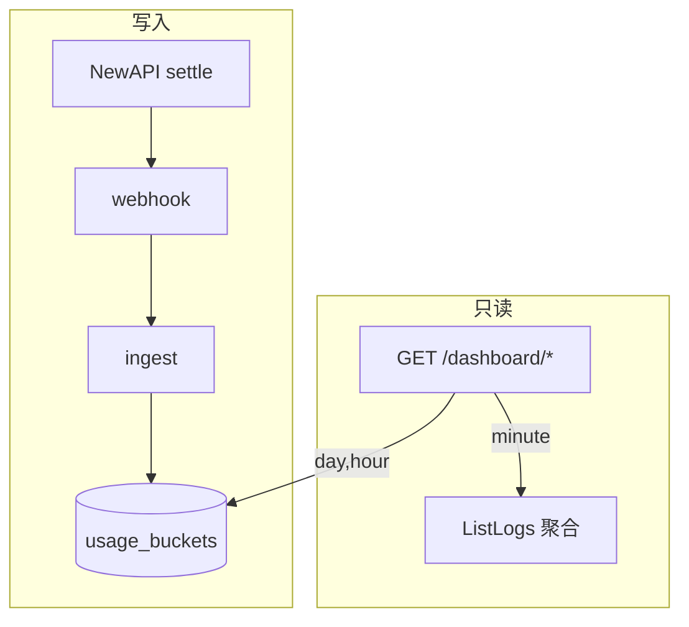

# TokenJoy Backend 设计

`apps/backend/` Go 服务，实现 [Frontend-API契约.md](./Frontend-API契约.md) 企业面 **82** 个端点 + SaaS **11** 个端点。种子数据在 `internal/store/seed/`；运行时持久化于 Postgres；用量事实表 `usage_buckets` + webhook ingest。

**相关文档：** [Frontend-API契约.md](./Frontend-API契约.md) · [Backend-test.md](./Backend-test.md) · [Backend-SaaS多租户架构.md](./Backend-SaaS多租户架构.md) · [Backend-命名规范.md](./Backend-命名规范.md)

---

## 1. 技术选型

| 类别 | 选型                                     |
| ---- | ---------------------------------------- |
| 语言 | Go 1.24                                  |
| HTTP | chi v5 + 标准 `net/http`                 |
| 配置 | `caarlos0/env` 环境变量                  |
| 日志 | `log/slog` JSON                          |
| JSON | `encoding/json`，字段 camelCase 对齐前端 |
| 测试 | `testing` + `httptest`，用例在 `tests/`  |
| DI   | 构造函数注入，组合根 `internal/app/`     |

---

## 2. 项目结构

```
apps/backend/
├── cmd/server/main.go
├── internal/
│   ├── app/                 # DI 组合根（app.go + wiring_*.go + registry.go）
│   ├── config/
│   ├── domain/              # session, org, budget, keys, models, dashboard, audit, usage, relay, company, billing, platform
│   ├── http/
│   │   ├── router.go        # 全局 middleware + /api 挂载；可选 /v1 Relay Gateway
│   │   ├── handler/         # register.go；子包 auth/、org/、budget/、keys/、models/、dashboard/、audit/、billing/、platform/、relay/
│   │   ├── middleware/      # CompanyResolve、Session、PlatformAuth、CompanyGate、CORS、Recover
│   │   └── httputil/、response/、deps/
│   ├── infra/               # platformauth、permission、worker、notification
│   ├── integration/         # newapi、datasource/feishu
│   ├── pkg/                 # budget/、org/、common/、ctxcompany/
│   └── store/               # postgres/（运行时）；memory/（单测）；seed/
├── tests/
└── Makefile
```

域 DTO 统一定义在 `internal/domain/types/`；各 domain 包保留 Service 接口与业务逻辑。

---

## 3. 分层

```
HTTP → middleware (CORS, CompanyResolve, Session, Authz, Recover)
     → handler（解析请求、写状态码）
     → domain.Service（业务规则）
     → store.Store（持久化）
```

**NewAPI（可选）：** `NEW_API_ENABLED=true` 时，`relay.TokenLifecycle` 同步 Token/Channel；`worker.Runner` 消费 outbox；`budget.IngestService` 处理 webhook 入账。`RELAY_GATEWAY_ENABLED=true` 时挂载 `/v1/*` OpenAI 兼容网关。

---

## 4. Store

```go
type Store interface {
    Company() CompanyRepository
    Org() OrgRepository
    Budget() BudgetRepository
    Keys() KeysRepository
    Models() ModelsRepository
    Audit() AuditRepository
    Relay() RelayRepository
    Usage() UsageRepository
    WithTx(ctx context.Context, fn func(Store) error) error
}
```

企业域读写通过 `context` 注入 `company_id`（`pkg/ctxcompany` + `CompanyResolve` middleware）。平台面 `/api/platform/*` 不经 `CompanyResolve`，企业 ID 由路径显式指定。

| 模式     | 条件                          | 说明                                                                              |
| -------- | ----------------------------- | --------------------------------------------------------------------------------- |
| Postgres | 运行时（必填 `DATABASE_URL`） | 共 **44** 张表；demo 空库自动 `seed.ApplyTables`                                  |
| Memory   | 单元/Handler 测试             | `internal/store/memory` + `testutil`；`app.NewWithStore` 仅 `-tags=testhook` 构建 |

Schema 唯一来源：`internal/store/postgres/schema.sql`（`go:embed`）。**不做增量迁移**；改表结构后清空 Postgres volume 重来。

**启动 bootstrap：** `postgres.New` → applySchema → 若 `members` 为空且非 prod → `seed.ApplyTables`；demo profile 下再 `ApplyUsageBuckets` 灌入看板用量。

---

## 5. 鉴权

| Profile | 环境变量                   | GET 读接口          | 写接口               |
| ------- | -------------------------- | ------------------- | -------------------- |
| Demo    | `APP_PROFILE=demo`（默认） | 多数 GET 免 Session | Session + permission |
| Prod    | `APP_PROFILE=prod`         | Session + 读权限    | Session + 写权限     |

- Session：`GET /api/session`；Cookie `tokenjoy_session_member` 或 `Authorization: Bearer`；响应含 `companyId`
- 企业面：`CompanyResolve` 从 Session 解析 `company_id`（私有化固定 `DEFAULT_COMPANY_ID`）
- 平台面：`POST /api/platform/auth/login` + `PlatformAuth`；`SUPPORT_SAAS=false` 时 `/api/platform/*` 返回 404
- 邀请激活：`POST /api/auth/accept-invite` → 写入成员 Session Cookie
- 权限 key 对齐 `apps/frontend/src/lib/permission-keys.ts`
- Webhook：`POST /api/internal/webhooks/newapi-log`，Header `X-Webhook-Secret`

---

## 6. 环境变量

| 变量                                                                  | 默认                    | 说明                                   |
| --------------------------------------------------------------------- | ----------------------- | -------------------------------------- |
| `PORT`                                                                | `8080`                  | HTTP 端口                              |
| `CORS_ORIGINS`                                                        | `http://localhost:5173` | 逗号分隔                               |
| `APP_PROFILE`                                                         | `demo`                  | `demo` / `prod`                        |
| `SIMULATE_DELAY`                                                      | `true`                  | 模拟数据源 test/import 延迟            |
| `DEMO_TODAY`                                                          | `2026-06-19`            | Demo 看板锚定日期                      |
| `DATABASE_URL`                                                        | **必填**                | Postgres 连接串                        |
| `NEW_API_ENABLED`                                                     | `false`                 | Relay + worker                         |
| `NEW_API_BASE_URL` / `NEW_API_ADMIN_TOKEN` / `NEW_API_WEBHOOK_SECRET` | —                       | 启用 NewAPI 时必填                     |
| `NEW_API_PUBLIC_URL`                                                  | —                       | Relay 对外 URL（可选）                 |
| `SYNC_TRIGGER_API_KEY`                                                | —                       | 组织同步触发 API Key（可选）           |
| `DATA_SOURCE_CREDENTIAL_KEY`                                          | —                       | 飞书等凭证 AES-GCM（32 字节 hex）      |
| `FEISHU_BASE_URL`                                                     | 飞书 Open API           | 飞书 API 基址                          |
| `NOTIFY_WEBHOOK_URL`                                                  | —                       | 通知 Webhook（可选）                   |
| `WORKER_POLL_INTERVAL_SEC`                                            | `5`                     | Worker 轮询间隔（秒）                  |
| `WORKER_ORG_SYNC_INTERVAL_SEC`                                        | `60`                    | 组织定时同步间隔（秒）                 |
| `SUPPORT_SAAS`                                                        | `false`                 | `true` 开启 SaaS 多企业                |
| `DEFAULT_COMPANY_ID`                                                  | `1`                     | 私有化隐含企业 ID                      |
| `COMPANY_WALLET_CACHE_TTL_SEC`                                        | `30`                    | 企业钱包预检缓存 TTL（秒）             |
| `PLATFORM_SHARED_RELAY_GROUP`                                         | `platform_shared`       | SaaS Token 分组名                      |
| `RELAY_GATEWAY_ENABLED`                                               | `false`                 | 启用 Relay Gateway（SaaS 建议 `true`） |
| `PLATFORM_BOOTSTRAP_EMAIL` / `PLATFORM_BOOTSTRAP_PASSWORD`            | —                       | 首次创建平台运营账号（可选）           |

完整示例见 [`apps/backend/.env.example`](../apps/backend/.env.example)。

---

## 7. 运行与联调

```bash
pnpm start   # Postgres + backend :8080 + frontend :5173

# 或分别启动
pnpm start:postgres
cd apps/backend && go run ./cmd/server
cd apps/frontend && pnpm start
```

Dev：访问 `/login` 选成员 → cookie → `/api/*` 经 Vite 代理到 Go。

```
Browser → /api/* → apps/backend:8080 → Postgres
                                      ├─ 管理面（org/budget/keys/models/audit）
                                      ├─ usage_buckets / relay / credential
                                      └─ 空库首次启动由 store/seed 初始化
```

生产同域部署：边缘将 `/api/` 反代到 Go，不得把 `/api` 纳入 SPA fallback。参考 [`deploy/nginx.conf.example`](../deploy/nginx.conf.example)。

---

## 8. 错误与状态码

与契约 §2.4 一致：`{ "message": "..." }`。Service 返回 `domain.DomainError`，Handler 映射 400/401/403/404/422/500。

---

## 9. 测试

全部在 `apps/backend/tests/`。`make test-unit`；Postgres 集成 `make test-integration`。详见 [Backend-test.md](./Backend-test.md)。

---

## 10. 看板用量

Dashboard 域**全部 GET、无副作用**；端点见契约 §5.6。



| 决策     | 说明                                                      |
| -------- | --------------------------------------------------------- |
| hour 桶  | 只持久化 hour；day/week/month 查询时 `date_trunc` 聚合    |
| minute   | 不落库；`log_aggregator.go` 代理 NewAPI，窗口 ≤3h         |
| consumed | 看板读 **buckets 周期 SUM**，不读 `budget_nodes.consumed` |
| 时区     | UTC 存桶；展示默认 `Asia/Shanghai`                        |

**minute 语义：** `source: "logs"`、`approximate: true`；NewAPI 不可用 → 503 + `retryAfter`。

月初 budget 重置只清 `budget_nodes.consumed`，buckets 保留；ingest 成本写入后不回溯。

关键代码：`internal/domain/usage/`、`internal/domain/dashboard/`、`usage_buckets` 表。

---

## 11. 维护要点

| 项            | 说明                                                     |
| ------------- | -------------------------------------------------------- |
| HTTP 错误出口 | 收敛到 `httputil`                                        |
| 读鉴权一致性  | prod profile 下各域 GET 挂 Session + 读权限              |
| Context 传递  | domain 内避免 `context.Background()` 滥用                |
| 存储          | 详见 [Backend-存储架构.md](./Backend-存储架构.md)        |
| SaaS          | [Backend-SaaS多租户架构.md](./Backend-SaaS多租户架构.md) |
| Worker 测试   | `app.WithoutWorker()`                                    |

---

## 12. 变更检查清单

- [ ] `apps/frontend/src/api/{domain}.ts` + `api/types/`
- [ ] [Frontend-API契约.md](./Frontend-API契约.md)
- [ ] `apps/backend/internal/domain/{domain}/`
- [ ] `apps/backend/internal/http/handler/`
- [ ] `apps/backend/internal/store/seed/`（若 demo 数据变）
- [ ] `tests/handler/contract_test.go`（新 GET）
- [ ] `features/query/query-keys.ts`（新读操作）
