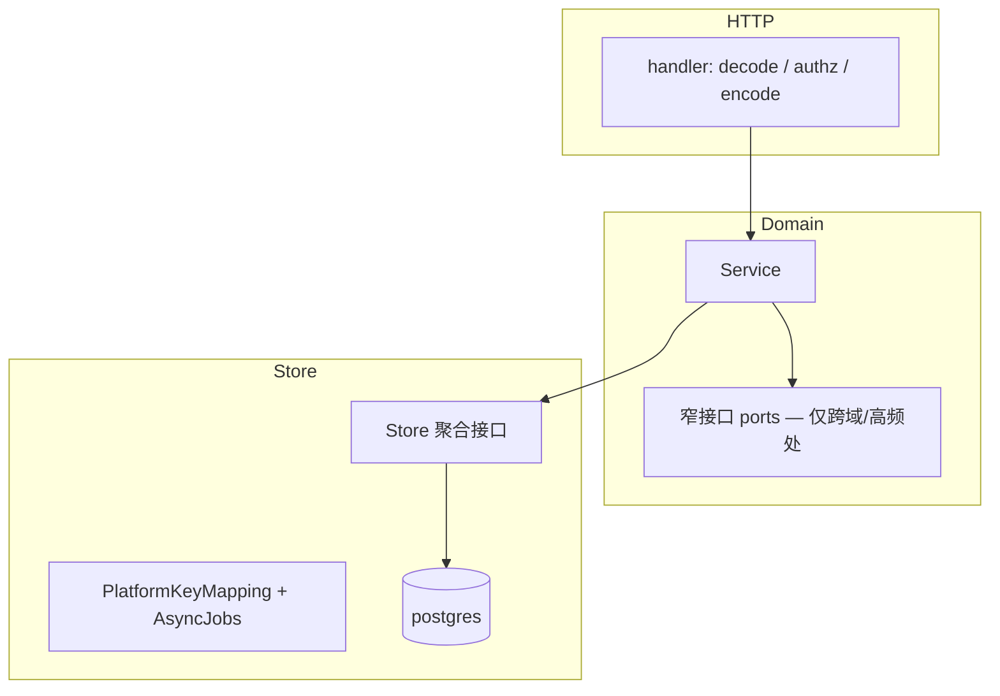

# Backend 重构与收口建议

> 架构现状见 [Backend-架构.md](./Backend-架构.md)。命名约定见 [Backend-命名统一.md](./Backend-命名统一.md) 与架构 §0。  
> 本文只列**仍值得做的收口**——不为架构而架构。

---

## 1. 结论

Backend 是合格的分层单体，**不需要换范式**（不拆微服务、不上 DI 框架）。

仍值得做：

1. **Transport 层零业务规则** — Handler 只做鉴权、编解码、调 Service  
2. **装配层去重复** — wiring 闭包提取辅助函数  

其余（`domain/types` 保留、`store.Store` 按需收窄、`httpdeps.Deps` 保持扁平）维持现状或随域改动顺手优化，不单独立项。

---

## 2. 目标形态

**Handler → Domain → Store** 单体；包结构保持现状，只在边界收紧。



### 2.1 保持不动

| 层级 | 做法 | 理由 |
|------|------|------|
| `cmd/` + `internal/app/` | 组合根 + 构造函数注入 | 无需 DI 框架 |
| `internal/http/` | 现有 router / middleware | 改名 `transport` 无收益 |
| `internal/domain/types/` | API DTO 单一来源 | 与前端 contract 对齐 |
| `httpdeps.Deps` | 扁平 struct | 组合根聚合依赖 |
| `org.Service` 门面 | HTTP 注入一个 `org.Service` | structure / remote 内部分层已够 |
| `tests/` + PostgreSQL | per-schema 真实 DB | 不做内存 store mock |
| `pkg/budget`、`pkg/org` | 共享计算内核 | 跨域复用 |

### 2.2 NewAPISync / Gateway（现状）

```
internal/domain/newapisync/
├── interface.go
├── lifecycle.go
├── lifecycle_*.go
├── channel_policy.go
├── quota.go
└── outbox_*.go

internal/domain/gateway/
├── precheck.go
└── gateway_service.go
```

```go
type Lifecycle interface {
    NewAPIGate
    PlatformKeyLifecycle
    ProviderKeyLifecycle
    ModelLimitsLifecycle
    RebalanceEnqueuer
}

type KeysNewAPISync interface {
    NewAPIGate
    PlatformKeyLifecycle
    ProviderKeyLifecycle
}

type OutboxHandler interface {
    PlatformKeyLifecycle
    ProviderKeyLifecycle
    ModelLimitsLifecycle
    RebalanceEnqueuer
}
```

```go
// store.Store
PlatformKeyMappings() PlatformKeyMappingRepository
AsyncJobs() AsyncJobsRepository
```

Postgres：`platform_key_mapping_repo.go` + `async_jobs_repo.go`。Worker 注入 `AsyncJobsRepository`；NewAPISync 注入 mapping + outbox（`st.AsyncJobs()`）。不拆成 5 个 queue repo——底层一张 `async_jobs` 表。

### 2.3 Domain → Store

默认可用 `store.Store`；仅在以下情况收窄：

| 场景 | 做法 | 范例 |
|------|------|------|
| 跨域编排、需明确边界 | 组合 port 接口 | `usage.EntryBuildReader` |
| 单 service 只用 1–2 个 repo 且无跨表事务 | 注入具体 `XxxRepository` | 新代码优先 |
| 多 repo + `WithTx` | 继续 `store.Store` | budget、keys、billing |

不做：全量把 service 改成窄接口。

### 2.4 HTTP Handler

**Handler 不含业务判断。**

| 泄漏点 | 目标 |
|--------|------|
| `member.go` 自删保护 | 移入 `org.DeleteMembers` |
| `dashboard` 参数必填校验 | 移入 `dashboard.Service` |
| `audit` 直接持 `usage.ReadModel` | `audit.Service` 增加 `ListCalls`，内部委托 reader |

`platform` handler 未用 `ProtectedHandlerBase`——随改动对齐即可。

### 2.5 装配层

新增 `wire_helpers.go`，收口重复闭包：

```go
func enqueueWalletSync(st store.Store) func(context.Context, int64) error { ... }
func enqueueRebalance(st store.Store) func(context.Context, int64) error { ... }
```

`wire_domain_services.go` 与 `tests/testutil/worker` 复用。

不做：scaffold 代码生成、Deps 分组嵌套、registry 反射注册。

### 2.6 Store 大文件

| 文件 | 目标 | 不做 |
|------|------|------|
| `postgres/platform_key_mapping_repo.go` | 已与 jobs 分文件；维持 | 按 channel 建子包 |
| `postgres/keys_repo.go` | 改动频繁时拆 `keys_repo_crud.go` + `keys_repo_query.go` | 拆接口层 |
| `postgres/budget_repo.go` | 维持；超 400 行再拆 | 预防性拆分 |
| `seed/apply/tables.go` | 随 seed 变更按域拆 | 为拆而拆 |

### 2.7 `pkg/` 边界

| 放 `pkg/` | 放 `domain/` |
|-----------|--------------|
| 纯函数、无 I/O | 业务流程、状态机、编排 |
| 2+ 域共用的数据结构变换 | 单域 CRUD + 规则 |
| `ctxcompany` 等 context 原语 | Service 接口与实现 |

---

## 3. 待做差距

| 痛点 | 严重度 | 处理 |
|------|--------|------|
| Handler 业务泄漏（上表 3 处） | 中 | 下沉到 domain |
| `enqueueWalletSync` 重复 | 低 | `wire_helpers.go` |
| 错误构造风格不一 | 低 | 新代码用 `domain.BadRequest` |
| `postgres/keys_repo.go` 偏大 | 低 | 下次大改 keys 时拆文件 |

---

## 4. 实施顺序

1. Handler 三处业务下沉  
2. `wire_helpers.go` 提取闭包  

验收：handler 无业务判断；wiring 无重复 `enqueueWalletSync` 字面量。

---

## 5. 目录一览

```
internal/
├── app/
│   ├── wire_helpers.go          # 待补
│   ├── wire_domain_services.go
│   ├── wire_gateway.go
│   ├── wiring_infra.go
│   └── registry.go
├── domain/
│   ├── types/
│   ├── newapisync/
│   ├── gateway/
│   └── org/                     # structure.LocalService + remote.Service
├── http/handler/                # register.go + 按域子包（含 session/health/ingest）
├── store/
│   ├── platform_key_mapping_repo.go
│   ├── async_jobs_repo.go
│   └── postgres/
│       ├── platform_key_mapping_repo.go
│       └── async_jobs_repo.go
└── pkg/
```

---

## 6. 明确不做

| 不做 | 原因 |
|------|------|
| 微服务 / 模块单体拆分 | 团队规模与部署形态不需要 |
| wire、fx 等 DI 框架 | 构造函数注入已够用 |
| `domain` → `bounded` / `http` → `transport` | 纯改名，零运行时收益 |
| `domain/types` 回迁各域 | 单一 DTO 层更实用 |
| 全量 service 改窄 repo 注入 | 投入大；按 §2.3 渐进 |
| 每域 `types.go` + `api/` 子包 | 现有文件级拆分已够 |
| `keys/platform/` 子包 | 多一层 import，收益不明显 |
| 内存 store mock | PG per-schema 已是标准 |
| scaffold 代码生成 | 域新增频率低 |
| `SimulateDelay` decorator 框架 | 三处调用，提取函数即可 |
| 5 个独立 queue repository | 底层一张 job 表 |
| audit/platform handler 大规模重构 | 顺手对齐，不立项 |

---

## 7. 域级快照

| 子域 | 约行数 | 动作 |
|------|--------|------|
| newapisync / gateway | ~1200 | 随业务改 |
| org | ~2200 | Handler 自删规则下沉 |
| usage | ~1120 | `EntryBuildReader` 作窄接口范例 |
| keys | ~1065 | 保持 `platform_key_*.go` 拆法 |
| types | ~1160 | 保持集中 |
| budget / billing | ~1300 | 保持 `store.Store` |
| 其余 | <600 各 | 维持 |

---

## 8. 相关文档

| 文档 | 说明 |
|------|------|
| [Backend-架构.md](./Backend-架构.md) | §0 命名；NewAPI/Gateway；Worker |
| [Backend-存储架构.md](./Backend-存储架构.md) | PlatformKeyMapping / AsyncJobs |
| [Backend-命名统一.md](./Backend-命名统一.md) | 命名约定 |
| [plan.md](./plan.md) | 工程待办 |

---

## 9. 一句话

**分层单体 + 薄 Handler + wiring 去重。** 不新增强抽象、不迁 types、不全量改 repo 注入。优先：**Handler 业务下沉 + wiring 去重**。
