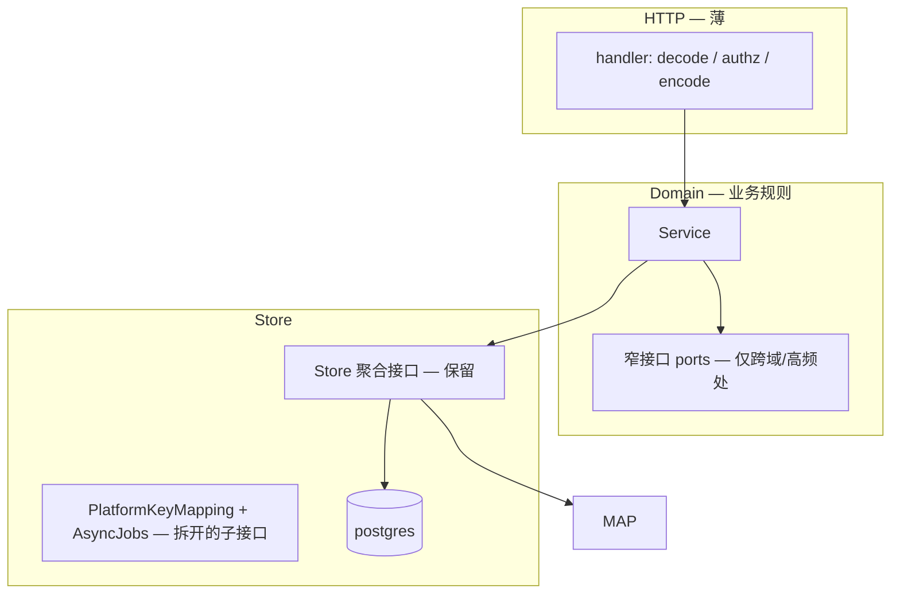

# Backend 重构与收口建议

> 基于 `apps/backend/` 全量代码审查。架构现状见 [Backend-架构.md](./Backend-架构.md)。  
> 本文给出**终态最优形态**与**最小必要改动**——能收口则收口，不为架构而架构。  
> **命名：** 去 Relay / 去领域 Token（指 Key）、保留 PlatformKey 已完成；词汇与包边界见 [Backend-架构.md](./Backend-架构.md) §0。Gateway=`domain/gateway`，管理面同步=`domain/newapisync`；Store=`PlatformKeyMappings()` + `AsyncJobs()`。

---

## 1. 结论

Backend 已是合格的分层单体，**不需要换范式**（不拆微服务、不上 DI 框架）。命名统一与 NewAPISync/Gateway 拆包、lifecycle 按操作拆文件、Store 子接口拆分 **已完成**。

仍值得做的是：

1. **Transport 层零业务规则** — Handler 只做鉴权、编解码、调 Service  
2. **装配层去重复** — wiring 闭包提取辅助函数，新域注册保持现有手工流程即可  

其余（`domain/types` 保留、`store.Store` 按需收窄、`httpdeps.Deps` 保持扁平）**维持现状或随域改动顺手优化**，不单独立项。

---

## 2. 终态架构（目标形态）

终态仍是 **Handler → Domain → Store** 单体，包结构几乎不变，只在边界处收紧。



### 2.1 保留不动的部分

| 层级 | 终态 | 理由 |
|------|------|------|
| `cmd/` + `internal/app/` | 组合根 + 构造函数注入 | 已清晰，无需 DI 框架 |
| `internal/http/` | 包名、router、middleware 模式不变 | rename `transport` 无收益 |
| `internal/domain/types/` | **继续作为 API DTO 单一来源** | 与前端 contract 对齐；拆到各域反而增加 import 噪音 |
| `httpdeps.Deps` | 扁平 struct，一域一字段 | 组合根本就该聚合依赖；字段多不是债 |
| `org.Service` 门面 | HTTP 继续注入一个 `org.Service` | structure/remote 内部分层已够 |
| `tests/` + PostgreSQL | per-schema 真实 DB 测试 | 成熟可靠，不做内存 store mock |
| `internal/pkg/budget`、`pkg/org` | 共享计算内核 | 跨域复用合理，只补放置准则 |

### 2.2 终态要收口的部分

#### NewAPISync / Gateway（domain + store）— **已落地**

**Domain** — lifecycle 按操作拆文件；Gateway 独立包：

```
internal/domain/newapisync/
├── interface.go          # Lifecycle / KeysNewAPISync / OutboxHandler / …
├── lifecycle.go          # NewAPISync 构造与 Enabled
├── lifecycle_create.go
├── lifecycle_update.go
├── lifecycle_revoke.go
├── lifecycle_rotate.go
├── lifecycle_provider.go
├── lifecycle_model_limits.go
├── lifecycle_rebalance.go
├── channel_policy.go
├── quota.go
└── outbox_*.go

internal/domain/gateway/
├── precheck.go
└── gateway_service.go
```

**接口** — 子接口 + 嵌入（已落地）：

```go
type Lifecycle interface {
    NewAPIGate
    PlatformKeyLifecycle
    ProviderKeyLifecycle
    ModelLimitsLifecycle
    RebalanceEnqueuer
}

type KeysNewAPISync interface {
    NewAPIGate
    PlatformKeyLifecycle
    ProviderKeyLifecycle
}

type OutboxHandler interface {
    PlatformKeyLifecycle
    ProviderKeyLifecycle
    ModelLimitsLifecycle
    RebalanceEnqueuer
}
```

**Store** — 已拆为两个访问器（无 `Relay()` / `NewAPI()`）：

```go
// store.Store
PlatformKeyMappings() PlatformKeyMappingRepository
AsyncJobs() AsyncJobsRepository
```

Postgres：`platform_key_mapping.go` + `async_jobs.go`。Worker 注入 `AsyncJobsRepository`；NewAPISync 注入 mapping + outbox（`st.AsyncJobs()`）。**不拆成 5 个 queue repo**——底层本就是一张 `async_jobs` 表。

#### Domain → Store 依赖

**原则：默认可以继续用 `store.Store`；仅在以下情况收窄：**

| 场景 | 终态做法 | 范例 |
|------|----------|------|
| 跨域编排、需明确边界 | 定义组合 port 接口 | `usage.EntryBuildReader` |
| 单 service 只用 1–2 个 repo 且无事务跨表 | 构造函数注入具体 `XxxRepository` | 新代码优先 |
| 多 repo + `WithTx` | 继续 `store.Store` | budget、keys、billing |

**不做：** 全量把 25 个 service 改成窄接口——改动面大、收益递减。

#### HTTP Handler

终态规则只有一条：**Handler 不含业务判断。**

| 现状泄漏 | 终态 |
|----------|------|
| `member.go` 自删保护 | 移入 `org.DeleteMembers` |
| `dashboard` 参数必填校验 | 移入 `dashboard.Service` |
| `audit` 直接持 `usage.ReadModel` | `audit.Service` 增加 `ListCalls`，内部委托 reader |

`platform` handler 未用 `ProtectedHandlerBase`、`internal_ingest_handler.go` 在根包——**顺手对齐即可**，不单独排期。

#### 装配层（`internal/app/`）

终态新增一个文件 `wire_helpers.go`，收口重复闭包：

```go
func enqueueWalletSync(st store.Store) func(context.Context, int64) error { ... }
func enqueueRebalance(st store.Store) func(context.Context, int64) error { ... }
```

`wire_domain_services.go` 调用辅助函数；`tests/testutil/worker` 复用同一辅助或 testutil 薄封装。

**不做：** scaffold 代码生成、Deps 分组嵌套 struct、registry 反射注册。

#### Store 大文件

| 文件 | 终态 | 不做 |
|------|------|------|
| `postgres/platform_key_mapping.go` | 拆 mapping / jobs 两个实现文件 | 按 channel 建子包 |
| `postgres/keys_repo.go` | 若改动频繁，拆 `keys_repo_crud.go` + `keys_repo_query.go` | 拆接口层 |
| `postgres/budget_repo.go` | 维持单文件，超 400 行再拆 | 预防性拆分 |
| `seed/apply/tables.go` | 随 seed 变更顺手按域拆 | 为拆而拆 |

#### `internal/pkg/` 边界（写入 [Backend-架构.md](./Backend-架构.md) 即可）

| 放 `pkg/` | 放 `domain/` |
|-----------|--------------|
| 纯函数、无 I/O（预算树计算、sync diff） | 业务流程、状态机、编排 |
| 2+ 域共用的数据结构变换 | 单域 CRUD + 规则 |
| `ctxcompany` 等 context 原语 | Service 接口与实现 |

---

## 3. 现状痛点（与终态的差距）

### 3.1 NewAPI / Gateway — 命名与拆包已完成

| 项 | 状态 |
|----|------|
| `lifecycle_*.go` 按操作拆分 | 已完成 |
| `PlatformKeyMappings()` + `AsyncJobs()` | 已完成 |
| `domain/gateway` vs `domain/newapisync` | 已完成 |
| `interface.go` 子接口 + 嵌入 | 已完成 |

### 3.2 其余 — 中低优先级，随触达改动

| 痛点 | 严重度 | 终态处理 |
|------|--------|----------|
| Handler 业务泄漏（3 处） | 中 | 下沉到 domain |
| `enqueueWalletSync` 重复 3 次 | 低 | `wire_helpers.go` |
| 空目录 `domain/member/` | 低 | 删除 |
| 错误构造风格不一 | 低 | 新代码用 `domain.BadRequest`，旧代码不改 |
| `postgres/keys_repo.go` 偏大 | 低 | 下次大改 keys 时拆文件 |

---

## 4. 实施顺序

只做 **两个阶段**，无阶段 C「类型大迁移」。

### 阶段 1 — NewAPI / Gateway 收口 — **已完成**

1. ~~拆 `lifecycle_ops.go` → 同包多文件~~  
2. ~~重构 `interface.go` → 子接口 + 嵌入~~  
3. ~~`PlatformKeyMappings()` + `AsyncJobs()`~~  
4. ~~`domain/gateway` + `domain/newapisync`；测试 `tests/domain/gateway|newapisync`~~  

### 阶段 2 — 边界清理（可与业务需求穿插）

1. Handler 三处业务下沉  
2. `wire_helpers.go` 提取闭包  
3. 删除 `domain/member/` 空目录  
4. [Backend-架构.md](./Backend-架构.md) 补 `pkg/` 放置准则 + NewAPI 终态接口说明  

**验收：** grep handler 无 `domain.NewDomainError` 类业务判断；wiring 无重复 `enqueueWalletSync` 字面量。

---

## 5. 终态目录一览

与今天相比，**命名统一与 NewAPI/Gateway 拆包已落地**，其余目录不变：

```
internal/
├── app/
│   ├── wire_helpers.go
│   ├── wire_domain_services.go
│   ├── wire_gateway.go
│   ├── wiring_infra.go       # newapisync.New 内联装配
│   └── registry.go
├── domain/
│   ├── types/                # 保留，不迁出
│   ├── newapisync/           # lifecycle_*.go + interface.go
│   ├── gateway/              # precheck + gateway_service
│   └── org/                  # 保持 structure + remote
├── http/handler/             # 更薄，无业务规则
├── store/
│   ├── platform_key_mapping.go
│   ├── async_jobs.go
│   └── postgres/
│       ├── platform_key_mapping.go
│       └── async_jobs.go
└── pkg/                      # 边界文档化，结构不变
```

---

## 6. 明确不做（防 over-engineering）

| 不做 | 原因 |
|------|------|
| 微服务 / 模块单体拆分 | 团队规模与部署形态不需要 |
| wire、fx 等 DI 框架 | 构造函数注入已够用 |
| `domain` → `bounded` 重命名 | 纯 rename，零运行时收益 |
| `http` → `transport` 重命名 | 同上 |
| `domain/types` 回迁各域 | 与前端 contract 对齐的单一 DTO 层更实用 |
| 全量 service 改窄 repo 注入 | 投入大；按 §2.2 规则渐进即可 |
| 每域 `types.go` + `api/` 子包 | org/keys 现有文件级拆分已够 |
| `keys/platform/` 子包 | 多一层 import，收益不明显 |
| 内存 store mock | PG per-schema 测试已是项目标准 |
| scaffold 代码生成 | 域新增频率低，维护生成器成本更高 |
| `SimulateDelay` decorator 框架 | 三处调用，提取函数即可 |
| 5 个独立 queue repository | 底层一张 job 表，接口过度细分 |
| audit/platform handler 大规模重构 | 顺手对齐，不立项 |

---

## 7. 域级快照（供排期参考）

| 子域 | 约行数 | 终态动作 |
|------|--------|----------|
| newapisync / gateway | ~1200 | **阶段 1 已完成**；后续仅随业务改 |
| org | ~2200 | 保持；Handler 自删规则下沉 |
| usage | ~1120 | 保持；`EntryBuildReader` 作窄接口范例 |
| keys | ~1065 | 保持现有 `platform_key_*.go` 拆法 |
| types | ~1160 | **保持集中**，不迁移 |
| budget / billing | ~1300 | 保持 `store.Store`；大改时再评估窄接口 |
| 其余 | <600 各 | 维持现状 |

---

## 8. 与现有文档

| 文档 | 说明 |
|------|------|
| [Backend-架构.md](./Backend-架构.md) | §0 命名约定；NewAPI/Gateway 接口与 Worker |
| [Backend-存储架构.md](./Backend-存储架构.md) | PlatformKeyMapping / AsyncJobs / 列名终态 |
| [plan.md](./plan.md) | 阶段 2 边界清理可录入工程待办 |

---

## 9. 一句话总结

**终态 = 今天的分层单体 + NewAPI/Gateway 已拆清 + Handler 更薄 + wiring 去重。**  
不新增强抽象层、不迁移 types、不全量改 repo 注入。若只做一件事：**Handler 业务下沉 + wiring 去重**。
