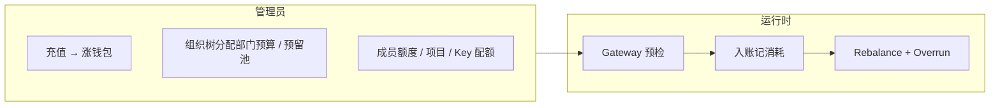
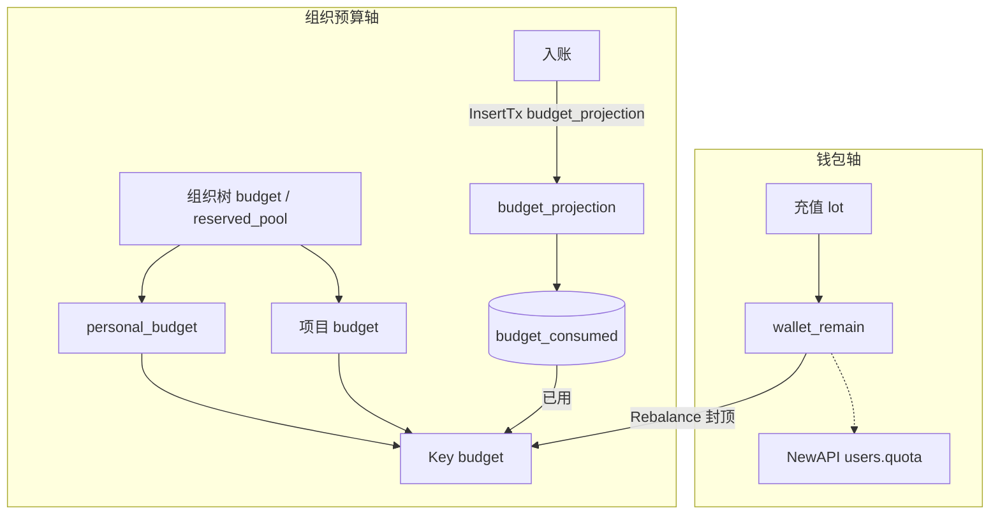
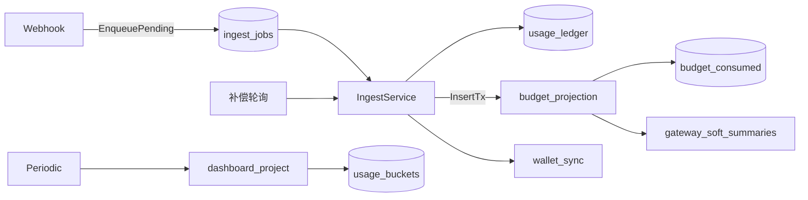
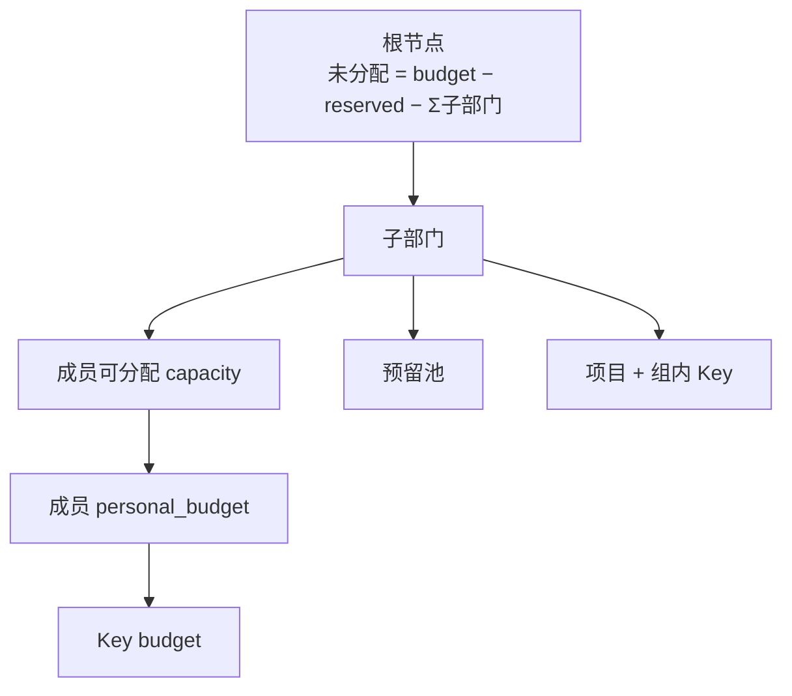
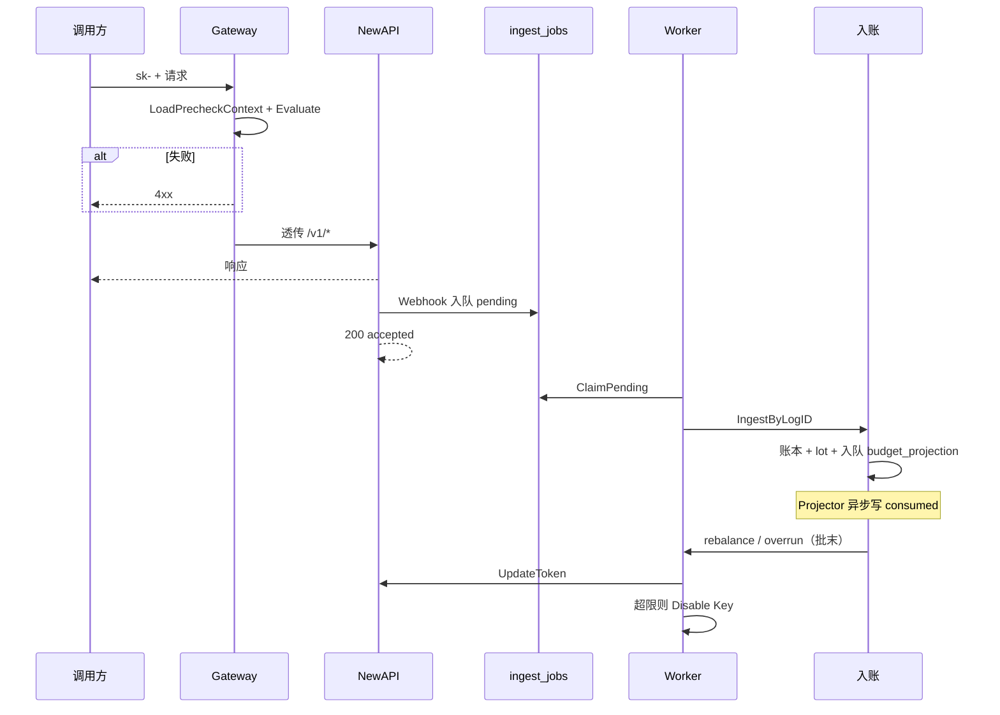
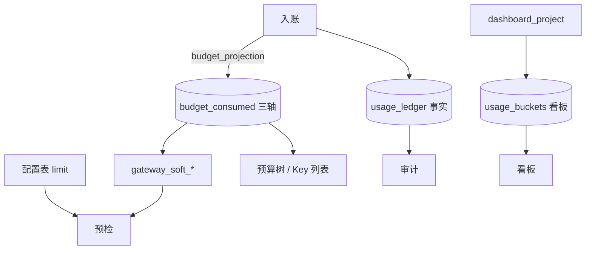
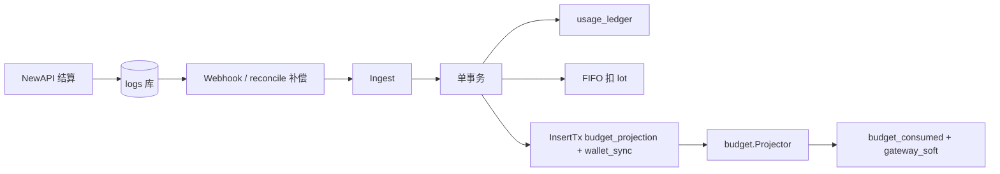
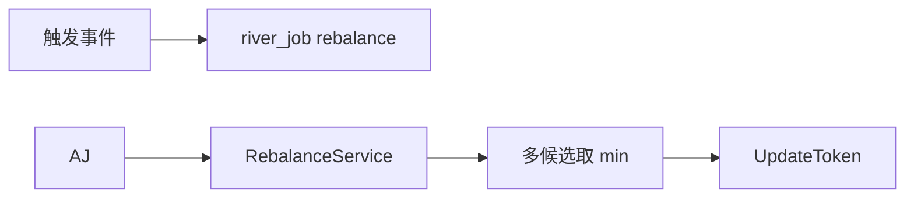
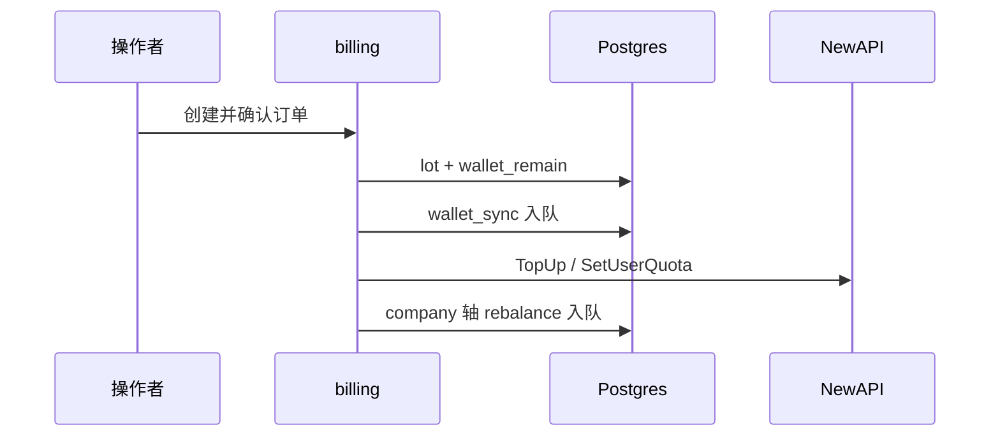

# Backend 预算与消耗

企业钱包与组织预算双轴、入账、配额同步与超限的**当前实现**说明。

**相关：** [Backend.md](./Backend.md) · [Backend-架构.md](./Backend-架构.md) · [Backend-存储架构.md](./Backend-存储架构.md) · [Backend-计费模式.md](./Backend-计费模式.md)

---

## 阅读路径

| 章节 | 适合谁 | 内容 |
| --- | --- | --- |
| §1–2 | 产品 / 新同学 | 预算管什么、两条轴 |
| §3–4 | 前端 / 实施 | 分配规则、管理面 API |
| §5 | 全栈联调 | 一次调用全链路 |
| §6–7 | 后端开发 | 存储与入账 |
| §8–10 | 后端 / 运维 | Rebalance、超限、充值 |
| §11–12 | 查表 | 公式、负责域 |
| §13 | 排期 | 待优化与待修复 |

计量单位：内部统一 **point**；钱包展示币由 lot 成本价闭合；NewAPI `remain_quota` 为派生通道配额。详见 [Backend-计费模式.md](./Backend-计费模式.md)。

---

## 1. 产品视角

管理员配置额度，成员在额度内用 Platform Key 调模型：

| 角色 | 关心什么 |
| --- | --- |
| 企业超管 | 钱包余额、根部门总预算、下级分配 |
| 部门 TL | 本部门预算、预留池、成员额度、项目 |
| 普通成员 | 个人额度、Key 配额、能否继续调用 |
| 审计 / 财务 | 调用花费、归因部门 / 成员 |

**账期：** 分配配置（`budget`、`personal_budget`、Key `budget`）跨月保留；已消耗按开账 `period_key`（通常 `YYYY-MM`，来自业务时钟）写入 `budget_consumed`，新月自动从新账期累计。账本发生月见 [Backend-业务时钟与账期.md](./Backend-业务时钟与账期.md)。

---

## 2. 两条轴

| 轴 | 权威数据 | 管什么 | 谁改 |
| --- | --- | --- | --- |
| **企业钱包** | 充值 lot、`wallet_remain` | 预付资金硬上限（point） | 充值确认 → 异步同步 NewAPI |
| **组织预算** | 组织树 limit + `budget_consumed` | 部门 / 成员 / Key / 组的花费与上限 | 控制台写 limit；Projector 异步累加 consumed |

**约定：**

- 充值**只涨钱包**，不自动涨部门 `budget`。
- **limit** 在组织树、成员、Key、项目；**consumed** 只在 `budget_consumed`（三轴 × 账期；`project_member` sub 已用见 `pkg/budget/chain.go`）。
- API 返回的 `consumed` 为当前账期从快照合并的视图，不是 Key 表上的持久列。

---

## 2. SSOT 与投影

| 层       | 存储                                   | 写入                    | 读方                                  |
| -------- | -------------------------------------- | ----------------------- | ------------------------------------- |
| **事实** | `usage_ledger`                         | `usage.IngestService`   | 审计 `/audit/calls`、minute 看板      |
| **投影** | `budget_consumed` / `usage_buckets`    | `budget.Projector` / `dashboard.Projector`（River 异步） | 超限/Rebalance、hour/day 看板、预算树 |
| **Gateway 缓存** | `platform_keys.gateway_soft_*` | Projector 批末刷新 | Gateway 预检（进程内 `budgetcheck` 缓存） |

### 2.1 入账路径（方案 B）

1. NewAPI settle → 写共享 `logs` 库 → `EnqueueNotify(log_id)` → `POST /api/internal/webhooks/newapi-log` → **入队 pending 并立即 ACK**
2. Worker：`ingest_jobs` 消费入账（含 webhook 快路径与失败重试）+ `reconcile_cursors` 全局水位补洞（均走 `IngestByLogID`）
3. `FindMappingByNewAPIKeyID` → `company_id`、部门/成员/组归因
4. `BuildCallSettledEntry` → `idempotency_key = newapi:{log_id}`
5. `store.WithTx`：ledger `INSERT ON CONFLICT` → FIFO 扣 lot → 同事务入队 `budget_projection` + `wallet_sync`

**Ingest 不同步写 consumed / buckets**；`rebalance` / `overrun` 由 `budget.Projector` 批末入队。

### 2.2 `budget.Projector` 投影顺序

消耗追踪统一在 `budget_consumed` 表，通过 `axis_kind` 区分。各业务表上**没有** `consumed` 列。

**三轴：** `platform_key` · `member` · `project`（**不写** `org_node`）。部门花费读 `usage_ledger` 按 `department_id` 聚合；`usage_ledger.platform_key_scope` 持久化 scope 供写轴。`project_member` 仅写 `platform_key` + `project`；sub 已用 = Σ 该人 project_member Key 的 `platform_key` consumed。Gateway：`GatewayChainRemain`（`pkg/budget/chain.go`）；`gateway_soft_remain IS NULL` 放行；Key 创建 / 启用同步写 soft。

| 步骤 | 写入 | 说明 |
| ---- | ---- | ---- |
| 1 | `budget_consumed` · `platform_key` += cost | Key 已用 |
| 2 | `budget_consumed` · `project` += cost | `project` / `project_member` scope |
| 3 | `budget_consumed` · `member` += cost | 仅 `member` scope |
| — | 无 org_node 轴 | 部门报表：`usage_ledger` 聚合 |
| 批末 | `gateway_soft_*` + rebalance / overrun 入队 | `budget_projector.go` |

父节点 **limit** 来自 `org_nodes.budget`；部门 **consumed 展示**读 `usage_ledger` 聚合，不读 `budget_consumed.org_node`。

看板 hour/day 桶由 `dashboard.Projector` 写 `usage_buckets`（Periodic fanout + 自续）。

### 2.3 读路径分离

| 场景                      | 读什么                                              | 为何                                          |
| ------------------------- | --------------------------------------------------- | --------------------------------------------- |
| Gateway 预检              | `gateway_soft_remain` + limit（`LoadPrecheckContext`） | NULL 放行；≤0 403；PG 权威 |
| 看板 cost / consumed 趋势 | `usage_buckets` SUM                                 | Dashboard 投影                                |
| 预算树展示 limit          | `org_nodes.budget` 等配置                           | 部门 consumed 不读 `budget_consumed`          |
| 部门本月花费              | `usage_ledger` 按 `department_id` 聚合              | 替代 org_node consumed 轴                     |
| 审计调用列表              | `usage_ledger`                                      | SSOT；不查 NewAPI logs                        |
| minute 趋势               | `usage_ledger` 按分钟聚合                           | 窗口 ≤3h                                      |

---

## 3. 分配层级

| 层级 | 配置 | 说明 |
| --- | --- | --- |
| 部门 | `budget`、`reserved_pool` | 子节点之和 + 预留池 ≤ 父节点 |
| 成员 | `personal_budget` | 部门内成员额度之和 ≤ capacity |
| Key | `budget`、模型白名单 | 从成员或项目剩余额度切分 |
| 项目 | `budget` | 挂项目 Key 走项目额度；Overrun 不走成员个人分支 |

**写入校验：**

| 操作 | 规则 |
| --- | --- |
| 改部门预算 | 子级：新 budget ≥ Σ子节点 + 预留池；对父级：新 budget + 兄弟 + 预留池 ≤ 父可用 |
| 改成员额度 | ≥ 已分配给 Key 的配额之和；部门内总和 ≤ capacity |
| 建 Key（成员） | budget ≤ 成员剩余可分配 |
| 建 Key（项目） | budget ≤ 组 budget − 组 consumed − 组内已分配 Key budget（含 `project_member`） |
| 建 Key（项目成员） | roster + `member_budget > 0`；budget ≤ sub 剩余；见 `pkg/budget/scope_validate.go` |
| 改项目成员子额度 | `PUT /api/budget/projects/{id}` · `memberBudgets`；须属于 roster |
| 额度追加审批 | 申请额 ≤ 部门 `reserved_pool`；通过后增加 `personal_budget` |

组织树结构变更与模型白名单同事务提交；预算数字仅经预算域服务修改。

---

## 4. 管理面 API

契约详情见 [Frontend.md](./Frontend.md) §5。

| 能力 | 方法 | 路径 |
| --- | --- | --- |
| 预算树 | GET | `/api/budget/tree` |
| 部门预算 | PUT | `/api/budget/departments/{departmentId}` |
| 成员额度 | GET / PUT | `/api/budget/members/{memberId}` |
| 项目 | CRUD | `/api/budget/projects/*`（含 `memberBudgets` patch） |
| 项目成员已用 | GET | `/api/budget/projects/{id}/member-consumed` |
| 预警规则 | CRUD | `/api/budget/alerts/*` |
| 超限策略 | GET / PUT | `/api/budget/overrun-policy` |
| 预算审批 | GET / PUT | `/api/budget/approvals`、`/api/budget/approvals/{id}` |
| Key / 额度审批 | — | `/api/keys/approvals/*`（密钥域，独立表） |
| 充值 | POST | `/api/billing/recharge`；平台代充见 [Backend.md](./Backend.md) §2 |

---

## 5. 一次调用全链路

生产须开 **Gateway**（`NEW_API_GATEWAY_ENABLED=true`）。

**Gateway 预检（同步）** — 全部通过才代理（单位 point）；1× `LoadPrecheckContext` + 纯内存 `Evaluate`：

| scope | 公式（与 [预算分配与扣减.md](./预算分配与扣减.md) §14 一致） |
| --- | --- |
| `member` | `min(key, personal, wallet)` — **不含**未分配/预留池/部门报表 |
| `project` | `min(key, project, wallet)` |
| `project_member` | `min(key, sub_quota, project, wallet)`；sub 已用 = Σ Key 聚合 |

| 检查 | 数据 |
| --- | --- |
| 企业 active | `companies.status` |
| 钱包 ≥ 预估 | `wallet_remain` |
| Key / personal / 项目未超 | `gateway_soft_remain` + limit（`LoadPrecheckContext`） |
| 模型与 Key 状态 | allowlist、`platform_keys.status` |

NewAPI quota 与 `wallet_sync` **不参与**热路径预检；Gateway 读 Postgres `wallet_remain` 与 `gateway_soft_*`；漂移由异步 `wallet_sync` 与对账消化。

---

## 6. 数据层

| 存储 | 职责 |
| --- | --- |
| `usage_ledger` | 消耗 SSOT；幂等 `newapi:{log_id}` |
| `budget_consumed` | 三轴 `platform_key` · `member` · `project`；部门报表读 `usage_ledger` 聚合 |
| `platform_keys.gateway_soft_*` | Gateway 预检软剩余（Projector 批末刷新） |
| `usage_buckets` | 按小时聚合，供趋势图 |
| 组织树 / 成员 / Key / 组 | 仅存 limit |

| 读场景 | 数据源 |
| --- | --- |
| 预算树 limit、Key 已用 | `org_nodes.budget` 等配置 + `budget_consumed`（三轴） |
| Gateway 预检 | `gateway_soft_remain` + limit |
| 看板趋势 | `usage_buckets` |
| 调用审计 | `usage_ledger` |
| 分钟级短趋势 | `usage_ledger` 聚合 |

部门本月花费读 `usage_ledger` 按 `department_id` 聚合。表结构见 [Backend-存储架构.md](./Backend-存储架构.md) §5–§8。

---

## 7. 入账与投影

1. 结算日志 → Webhook 或 Worker 补洞 → 按 `newapi_key_id` 归因
2. 单事务：账本幂等插入 → 扣 lot → 入队 `budget_projection` + `wallet_sync`
3. `budget.Projector` 异步写 `budget_consumed`、刷新 Gateway 软缓存；批末入队 `rebalance` / `overrun`
4. 失败走 `ingest_jobs` 重试（与 newapi_sync outbox 分离）

**Projector 轴顺序**（开账 `OpenBudgetPeriod`）见 §2.2。`usage_buckets` 由 `dashboard.Projector` 独立维护（OccurredAt 归因）。详见 [Backend-业务时钟与账期.md](./Backend-业务时钟与账期.md)。

---

## 8. Rebalance

在入账、充值、Key 变更后，将组织侧「还能花多少」换算为 NewAPI `remain_quota` 并 `UpdateToken`。

| `axis_kind` | 触发 |
| --- | --- |
| member | 入账带成员（`member` scope） |
| project | 入账命中项目 |
| platform_key | Key 创建 / 变更 / 入账 |
| company | 充值完成 |

（**已移除** `org_node` rebalance 触发；部门触顶仅 notify。）

去重：`dedupe_key = axis_kind:axis_id`。

**候选最小值（point）：** `GatewayChainRemain` 按 key `scope` 计算 remain → 换 NewAPI 单位，并以 `wallet_remain` 作企业硬顶。不再按部门 org_node consumed 封顶。

---

## 9. 超限与预警

**双层封禁：**

| 时机 | 机制 |
| --- | --- |
| 请求前 | Precheck：consumed + 预估 > limit → 4xx |
| 入账后 | Overrun Worker：consumed ≥ limit → Disable Key |

**Overrun 条件（当前账期快照，硬比较 ≥）：**

| 范围 | 条件 | 动作 |
| --- | --- | --- |
| Platform Key | platform_key 轴 consumed ≥ key.budget | disable 该 Key |
| 成员 personal | member 轴 consumed ≥ personal_budget | 禁用该成员 **member** scope Key |
| 部门 | ledger 聚合 ≥ `org_nodes.budget` | **通知 only**；不封 Key |
| 项目 | project 轴 consumed ≥ budget | 禁用该项目 **project** + **project_member** Key |
| project_member sub | Σ Key consumed ≥ `member_budget` | 禁用该人该项目 **project_member** Key |

personal 用尽后的追加路径：**US-10 额度审批**（预留池 → `personal_budget`），不是运行时自动蹭未分配。见 [预算分配与扣减.md](./预算分配与扣减.md)。

**预警配置：** `alert_rules`、`overrun_policy` 可经 API 配置并持久化；超限通知经 `NOTIFY_WEBHOOK_URL` 出站（如 `overrun_blocked`）。

---

## 10. 充值

充值不改 `org_nodes.budget`；钱包闭合见 [Backend-计费模式.md](./Backend-计费模式.md)。

---

## 11. 公式速查

| 名称 | 计算 |
| --- | --- |
| 部门可分给成员 | budget − reserved_pool − Σ子部门 budget |
| 成员可分给 Key | personal_budget − Σ已分配 Key budget |
| 成员本账期已用 | `budget_consumed` member 轴 |
| 组可分给 Key | 组 budget − 组 consumed − Σ组内 Key budget |
| NewAPIKey 可用上限 | 上列候选取 min → 换 NewAPI 单位 |
| 企业硬顶 | Σ NewAPIKey remain ≤ wallet_remain 对应通道配额 |

---

## 12. 负责域

| 职责 | 域 |
| --- | --- |
| 预算树、组、成员额度、预警策略 | `domain/budget` |
| 入账与 ledger | `domain/usage` |
| 预算 / consumed 投影 | `domain/budget`（`budget_projector.go`） |
| 看板 buckets 投影 | `domain/dashboard` |
| Rebalance | `domain/budget/rebalance`（`adminport.Port` 更新 token） |
| NewAPI Admin 边界 | `domain/adminport` + `integration/newapi/admin_port_adapter.go` |
| Quota 换算 | `pkg/newapiunits` |
| Key 额度校验 | `domain/keys` + `pkg/budget` |
| Gateway 软缓存 | `domain/budget/gateway_summary.go` + `infra/budgetcheck` |
| consumed 加载 | `pkg/budget` + `store.BudgetConsumed()` |
| Gateway 预检 | `domain/gateway` |
| 充值 | `domain/billing` |
| 异步任务 | `river_job`（River；见 [Backend-离线任务.md](./Backend-离线任务.md)） |

---

## 13. 待优化与待修复

按优先级归纳；工程细节另见 [plan.md](./plan.md)、产品差距见 [Roadmap.md](./Roadmap.md)。

### 应修复（行为与配置不一致）

| 项 | 现状 | 建议 |
| --- | --- | --- |
| 百分比预警 | `alert_rules` 仅 CRUD，无运行时 Worker | 入账或定时任务按阈值发通知；与 PRD US-08 对齐 |
| 超限文案 | `overrun_policy.blockMessage` 已存库，Precheck 返回通用错误 | Gateway 拒绝时读取并返回配置文案 |
| 预留池扣减 | 额度审批只校验 `reserved_pool` 上限，字段不随审批减少 | 审批通过时扣减预留池或维护「已分配预留」子账，避免重复透支 |

### 应优化（可靠性 / 可观测）

| 项 | 现状 | 建议 |
| --- | --- | --- |
| NewAPI 关闭时 Worker | Rebalance / Overrun 可能空转或静默跳过 | NewAPI 未启用时 job 标记失败或明确 503，避免「以为已同步」 |
| 通知失败 | Webhook 失败常无感知 | 写 `notification_log` 失败态；关键事件告警 |
| 双层封禁窗口 | Precheck 通过后、入账前仍可能短暂超卖 | 评估是否收紧预估或缩短入账延迟；文档化可接受窗口 |
| 入账联调 | 依赖 logs 库、webhook secret、Worker 同时就绪 | 用 `pnpm verify:integration` 断言 Gateway + ledger（plan §1） |

### 可优化（体验 / 结构，非阻断）

| 项 | 说明 |
| --- | --- |
| 两套审批 | `budget_approvals` 与 `key_approvals` 并存，前端需分清入口 |
| 前端账期 | 演示环境仍有固定账期硬编码，应跟随后端 `period_key` |
| 列表规模 | Key 全量加载 + 内存 enrich；超 500 行时需 SQL 筛选与分页（plan §7） |
| 部门管理员 RBAC | 非管理员默认应只能看本部门 Key 与预算（plan §7 #4） |

### 暂不需要改

| 项 | 说明 |
| --- | --- |
| 双轴模型 | 钱包与组织预算分离是当前设计，运行正常 |
| `budget_consumed` 三轴 | consumed SSOT；Gateway 读 `gateway_soft_*`；与 Overrun / UI 一致 |
| 自然月账期 | `period_key` 机制已满足按月清零 |
| 充值不涨部门 budget | 产品约定，非缺陷 |
