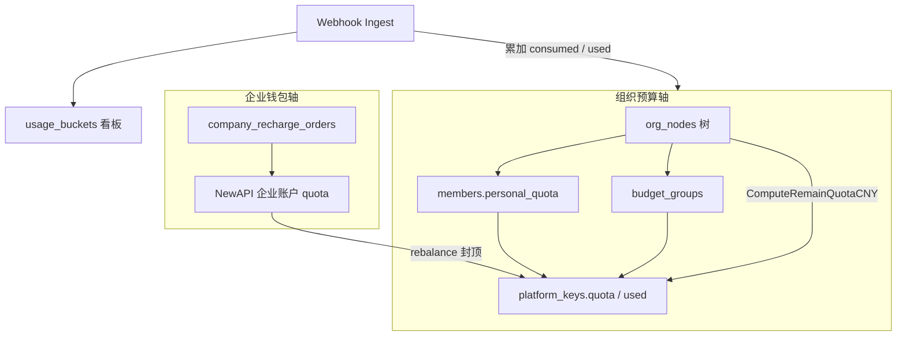
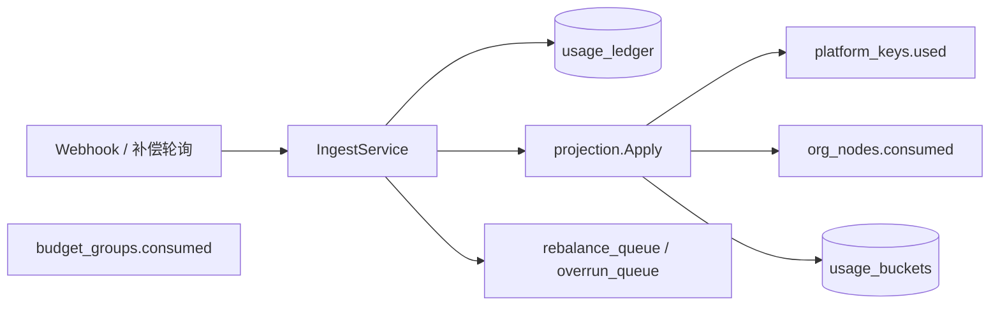
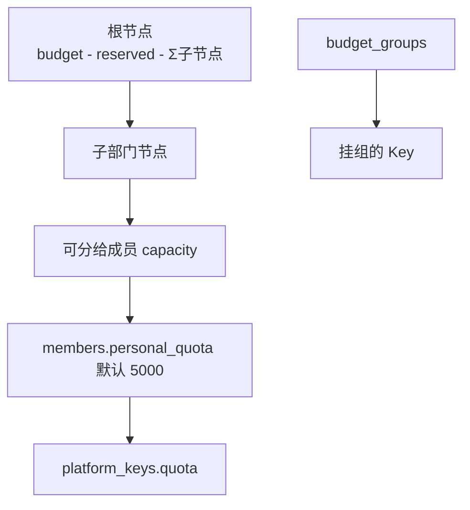
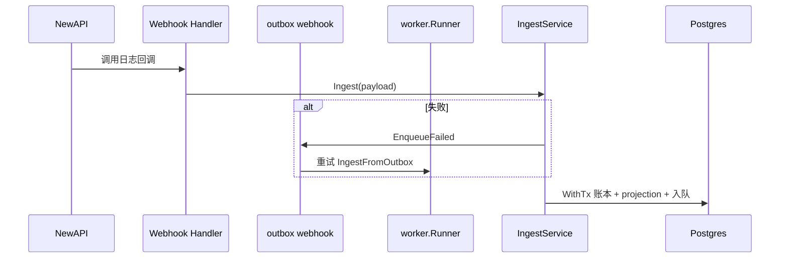
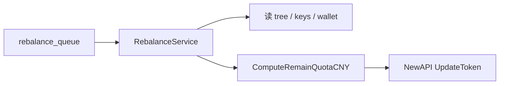
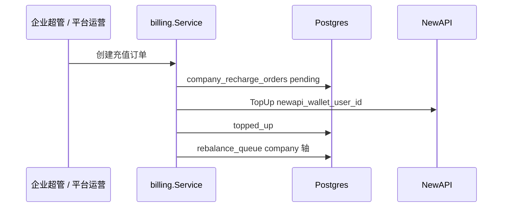
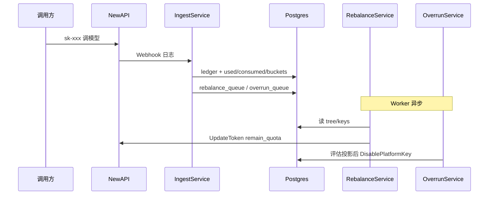

# Backend 预算与消耗

企业钱包 + 组织预算双轴、Ingest SSOT、projection、Rebalance、Overrun 与控制台分配规则。

**相关：** [Backend.md](./Backend.md) · [Backend-架构.md](./Backend-架构.md) · [Backend-存储.md](./Backend-存储.md) · [Roadmap.md](./Roadmap.md)

---

## 1. 两条轴

预算系统不是单一「余额」，而是 **两条独立但会交汇的轴**：

| 轴 | 权威数据源 | 管什么 | 谁改 |
| -- | ---------- | ------ | ---- |
| **企业钱包** | NewAPI `users.quota`（`newapi_wallet_user_id`） | 预付资金硬上限 | 充值 → `billing.Service` TopUp |
| **组织预算** | Postgres `org_nodes` 等 | 部门树额度、成员/Key/组花费 | 控制台 + Ingest 累加 `consumed` |



**充值只涨钱包，不自动涨部门 `budget`。** 超管在控制台分配 `org_nodes.budget`；成员额度、Key 配额、预算组额度从组织预算轴往下切。

### 1.1 Gateway 放行（与双轴交汇）

`RELAY_GATEWAY_ENABLED=true` 时，`PrecheckService` 须全部满足：

| 检查 | 数据源 |
| ---- | ------ |
| 企业 `active` | `companies` |
| 企业钱包 ≥ 预估 | NewAPI `users.quota` |
| 部门 `consumed + estimate ≤ budget` | `org_nodes` 投影 |
| Token `remain_quota` 足够 | NewAPI Token |
| 白名单与 Key 状态 | `model_allowlist` + `platform_keys` |

---

## 2. SSOT 与投影

| 层 | 存储 | 写入 | 读方 |
| -- | ---- | ---- | ---- |
| **事实** | `usage_ledger` | `usage.IngestService` | 审计 `/audit/calls`、minute 看板 |
| **投影** | `used` / `consumed` / `usage_buckets` | `usage.Apply`（同事务） | 超限/Rebalance、hour/day 看板、预算树 |



### 2.1 入账路径

1. NewAPI settle → `POST /api/internal/webhooks/newapi-log`（或 Worker `compensateLogs`）
2. `FindMappingByNewAPITokenID` → `company_id`、部门/成员/组归因
3. `BuildCallSettledEntry` → `idempotency_key = newapi:{log_id}`
4. `store.WithTx`：ledger `INSERT ON CONFLICT` → projection → 副作用入队

### 2.2 `projection.Apply` 顺序

| 步骤 | 写入 | 说明 |
| ---- | ---- | ---- |
| 1 | `platform_keys.used += cost` | Key 已用 |
| 2 | `budget_groups.consumed += cost` | 若挂组 |
| 3 | `org_nodes.consumed` 祖先 rollup | 以 `department_id` 为叶子 |
| 4 | `usage_buckets` Upsert | 小时桶 × 部门 × 成员 × 模型 |

父节点 `consumed` 含整棵子树花费（rollup）。

### 2.3 读路径分离

| 场景 | 读什么 | 为何 |
| ---- | ------ | ---- |
| 看板 cost / consumed 趋势 | `usage_buckets` SUM | 与 Ingest 投影一致；不读 `org_nodes.consumed` |
| 预算树展示 `consumed` | `org_nodes.consumed` | 控制台实时投影 |
| 审计调用列表 | `usage_ledger` | SSOT；不查 NewAPI logs |
| minute 趋势 | `usage_ledger` 按分钟聚合 | 窗口 ≤3h |

---

## 3. 分配层级



### 3.1 节点预算校验

`PUT /api/budget/departments/{departmentId}`：

1. 对子级：`newBudget >= Σ子节点.budget + reservedPool`
2. 对父级：`newBudget + Σ兄弟 + reservedPool <= 父.budget - 父.reservedPool`

### 3.2 成员个人额度

`PUT /api/budget/members/{memberId}`：

- `personalQuota >=` 该成员已分配 Key 的 `quota` 之和
- 同部门成员 `personalQuota` 之和 ≤ `GetMemberQuotaCapacity(部门)`

### 3.3 平台 Key 创建

| Key 归属 | 校验 |
| -------- | ---- |
| 挂成员 | `quota <= GetQuotaRemaining(memberId)` |
| 挂预算组 | `quota <= group.budget - group.consumed - Σ组内 Key.quota` |

组织树变更（`org.provision`）单事务：`SetTree` + `Allowlist().Replace`。预算额度调整**仅**经 `budget.Service.UpdateNode`。

### 3.4 管理面 API 速查

| 能力 | 方法 | 路径 |
| ---- | ---- | ---- |
| 预算树 | GET | `/api/budget/tree` |
| 部门预算 | PUT | `/api/budget/departments/{departmentId}` |
| 成员额度 | GET/PUT | `/api/budget/members/{memberId}` |
| 预算组 CRUD | * | `/api/budget/groups/*` |
| 预警规则 | * | `/api/budget/alerts/*` |
| 超限策略 | GET/PUT | `/api/budget/overrun-policy` |
| 充值 | POST | `/api/billing/recharge`（企业面）/ 平台代充 |

完整契约见 [Frontend.md](./Frontend.md) §5。

---

## 4. Ingest 运行时



Worker 还通过 `relay_sync_cursors` **补偿轮询** NewAPI 日志，同样走 `Ingest`。

**失败重试：** webhook channel outbox；与 relay outbox 分离。

---

## 5. Rebalance

NewAPI 每个 Token 有 `remain_quota`。以下时机把 CNY「还能花多少」换算并 `UpdateToken`：

- Ingest 后（花费变化）
- 充值后（钱包变大）
- Key 创建/更新/启用

### 5.1 队列去重

`rebalance_queue` 按 `(company_id, axis_kind, axis_id)` 去重：

| `axis_kind` | 典型触发 |
| ----------- | -------- |
| `member` | Ingest 有 memberId |
| `department` | 每次 Ingest |
| `budget_group` | Ingest 命中预算组 |
| `company` | 充值完成 |

### 5.2 `ComputeRemainQuotaCNY`

取多候选最小值：

```text
candidates = [
  key.Quota - key.Used,
  (可选) memberCap - memberUsedKeys,
  (可选) group.Budget - group.Consumed,
  dept.Budget - dept.Consumed - reserved,
]
return min(candidates)
```

再经 `newapi.ToNewAPIUnits` 换成 NewAPI 单位；若有 `newapi_wallet_user_id` 则 **Σ Token remain_quota ≤ 企业钱包**。



---

## 6. Overrun（超限封禁）

`OverrunService.evaluateOverrun` 由 Worker 消费 `overrun_queue`（**不在 Ingest 事务内**），硬比较 `>=`：

| 范围 | 条件 | 动作 |
| ---- | ---- | ---- |
| 成员 | Key 未挂组 && 已用 Key 额 ≥ 个人额度 | 禁用该成员非组 Key |
| 部门 | `node.Consumed >= node.Budget` | 禁用该部门下所有 Key |
| 预算组 | `group.Consumed >= group.Budget` | 禁用该组下所有 Key |

`overrun_policy` / `alert_rules` 控制台可配，但运行时**未读取**百分比阈值；详见 [Roadmap.md](./Roadmap.md)。

---

## 7. 充值与钱包



- 订单状态：`pending` → `paid` → `topped_up`。
- 充值**不**改 `org_nodes.budget`；仅涨 NewAPI 钱包。
- 完成后入队 `company` 轴 rebalance，刷新所有 Token `remain_quota` 上限。

SaaS 开户与平台代充见 [Backend.md](./Backend.md) §2。

---

## 8. 端到端：一次调用的预算路径



扣费始终进**企业钱包**；TokenJoy 用 `department_id` / `member_id` / `budget_group_id` 做归因与配额约束。

---

## 9. 公式速查

| 名称 | 公式 / 位置 |
| ---- | ----------- |
| 部门可分给成员 | `budget - reservedPool - Σ子节点.budget` → `GetMemberQuotaCapacity` |
| 成员可分配 Key 额 | `personalQuota - Σ成员 Key.quota` → `GetQuotaRemaining` |
| 成员已消耗 Key 额 | `Σ成员 active Key.used` → `GetUsedKeyQuota` |
| 预算组可分配 Key 额 | `group.budget - group.consumed - Σ组 Key.quota` |
| Relay 可用 CNY | `min(...)` → `ComputeRemainQuotaCNY` |
| NewAPI 单位 | `cny / 最贵模型单价 * QuotaPerUnit` → `ToNewAPIUnits` |

---

## 10. 包边界

| 问题 | 负责包 |
| ---- | ------ |
| 控制台改预算树 / 组 / 成员额度 | `domain/budget` Service |
| 调用后记账 | `domain/usage` IngestService |
| 同步 NewAPI Token 配额 | `domain/budget/rebalance` + `domain/relay` |
| 创建 Key 时校验额度 | `domain/keys` + `pkg/budget` |
| 组织树变更带预算节点 | `domain/org` provision |
| 看板趋势 | `domain/dashboard` → `usage.Reader` |
| 充值涨钱包 | `domain/billing` |

**关键文件：**

| 文件 | 职责 |
| ---- | ---- |
| `usage/ingest.go` | Webhook / 补偿入账 |
| `usage/projection.go` | used / consumed / buckets |
| `budget/rebalance.go` | 队列消费、UpdateToken |
| `budget/overrun.go` | 超限评估、DisableKey |
| `relay/quota.go` | `ComputeRemainQuotaCNY` |

---

## 11. 与 Roadmap 的差距

| 项 | 现状 |
| -- | ---- |
| `alert_rules` 百分比预警 | 表可配；**无 Worker 接线** |
| `overrun_policy` 软阈值 | 表可配；运行时硬 `>=` |
| `billing:*` 细粒度权限 | 部分未挂 Authz |

完整列表见 [Roadmap.md](./Roadmap.md)。
