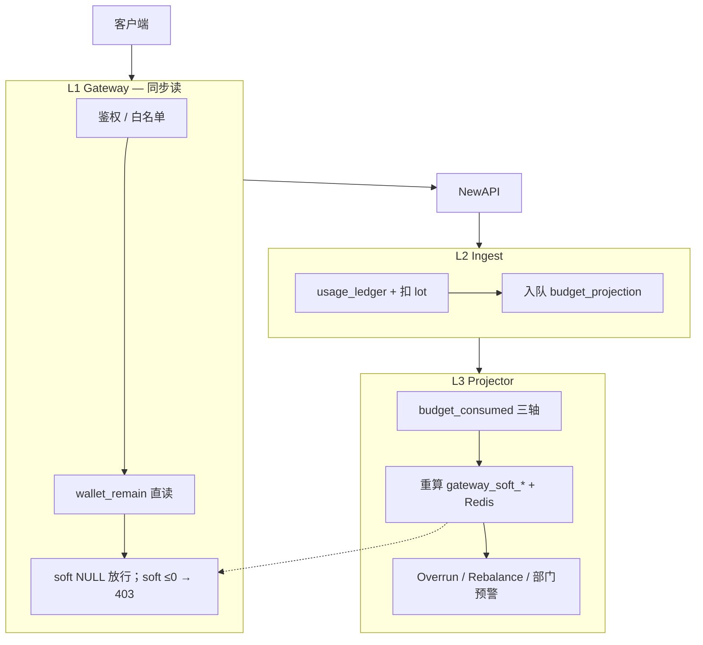

# Backend 预算执法重构（已归档）

> **定位：** 一次性破坏性切换——Gateway 只读 soft 拦截，消耗投影只在 Ingest→Projector 写轴（**三轴**）。对齐 [Platform-Key产品设计.md](./Platform-Key产品设计.md) · [预算分配与扣减.md](./预算分配与扣减.md) · [架构终态设计.md](./架构终态设计.md)。  
> **策略：** **不向后兼容**；删旧路径、改 schema、全量 seed/测试一并切换。  
> **相关：** [Backend-Ingest架构.md](./Backend-Ingest架构.md) · [Backend-预算.md](./Backend-预算.md)  
> **状态：** **已归档**（2026-07-13）— PR1 + PR2 均已落地。本文保留为迁移记录；权威运行时描述见 [Backend-预算.md](./Backend-预算.md)。

**读者速览：** §0 决策 · §1 三层模型 · §2 不变量 · §3 一次性切换范围 · §4 两个 PR（PR1+PR2 ✅） · §5 验收 · §7 落地记录。

---

## 0. 决策摘要

| 问题 | 结论 |
| --- | --- |
| 消费轴 | **三轴**：`platform_key` · `member` · `project`；**停写** `org_node` consumed |
| 部门报表 / 预警 | 读 `usage_ledger`（按 `department_id` + `period_key` 聚合），**不**维护 `budget_consumed.org_node` |
| 预算树 consumed | 部门节点**只展示 limit**；花费看板走 `usage_buckets` / ledger 聚合 |
| Gateway | 读 `gateway_soft_*` + 同步钱包；**不算** BudgetChain、**不扫** consumed |
| `gateway_soft_remain IS NULL` | **放行**（与 [架构终态设计.md](./架构终态设计.md) §6.2 一致）；`≤0` 才 403 |
| Key 创建 / 启用 | **同步**写 `gateway_soft_*`（`GatewayChainRemain` + `UpdateBatch`），不依赖首笔入账 |
| 部门总额顶满 | **通知 only**（ledger 聚合 vs `org_nodes.budget`）；不进预检；**不** bulk disable Key |
| personal 用尽 | Gateway 403 → US-10 审批；**不**蹭未分配 |
| Overrun disable | 保留 `platform_key` / `member` / `project` / `project_member` sub；**仅删** `disableDepartmentKeys` |
| 代码 SSOT | `pkg/budget/chain.go` → `GatewayChainRemain`；**删除**含部门轴的预检路径 |
| Redis | miss / 旧 version **放行**；规则见架构终态 §6.3 |
| 兼容 | **无**；demo seed / contract / 测试随 PR 全量更新 |

BudgetChain 公式 → [Platform-Key §4](./Platform-Key产品设计.md#4-gateway-budgetchain)。

**与 PRD US-08 的裁剪：** 部门 `org_nodes.budget` **不参与** Gateway 100% 阻断；部门触顶仅运营通知。成员 / 项目 / Key / 钱包仍硬拦。百分比阈值预警（`alert_rules` Worker）本重构**不含**，另排期。

---

## 1. 三层模型



| 层 | 写 | 读 |
| --- | --- | --- |
| L1 | 无 | `gateway_soft_*`、钱包、Key 状态 |
| L2 | ledger、lot | NewAPI log |
| L3 | consumed（三轴）、soft、Overrun | ledger |
| 预算树 limit | 无 | `org_nodes.budget` 等配置 |
| 部门花费 / 看板 | 无 | `usage_ledger` · `usage_buckets` |

**L1 分工：** 钱包 **同步直读** `companies.wallet_remain`；组织预算 **只读** L3 预写的 `gateway_soft_remain`（可选 Redis 副本，PG 权威）。二者不混在同一列。

**Evaluate 规则（= 架构终态 §6.2）：**

```text
1. wallet_remain >= ε           → 否则 403
2. key active + allowlist       → 否则 403
3. soft_remain IS NOT NULL AND soft_remain <= 0 → 403
4. [Redis] blocked AND version 有效 → 403（miss / 旧 version 放行）
5. pass
```

**冷启动：** `gateway_soft_remain IS NULL` → **放行**。Key 创建 / 启用路径**必须**同步写入 soft，缩短 NULL 窗口；未写入不阻断，靠 wallet hard cap 兜底。

**Ingest 边界：** L2 **不做**预算 cap 重算；执法只在 L1（同步）+ L3 Overrun（异步 disable）。历史 `enforceBudgetCap` 路径与 fixture **已删除**（PR1）。

---

## 2. 不变量

| # | 规则 |
| --- | --- |
| I1 | L1 never 读 org_node consumed / 未分配 / 预留池 |
| I2 | 业务写 `budget_consumed` **仅** L3 Projector（reconcile repair 除外） |
| I3 | soft 刷新 · NewAPI sync · rebalance · **Key 创建** 同一 `GatewayChainRemain` |
| I4 | 写轴由 **`platform_keys.scope`** 决定（禁止 `MemberID != nil` 启发式） |
| I5 | 部门顶满 → Notifier only；**无** `disableDepartmentKeys` |
| I6 | 三轴 consumed **仅** `budget_consumed`；部门花费 **不**进该表 |
| I7 | Key 创建 / 启用成功 → 同事务或同请求内写 `gateway_soft_*` |

**删除（不保留 deprecated；PR1/PR2 均已落地）：**

- `ComputeRemainBudget` 的 `deptAxis` / 部门树分支  
- `mapping_remain.go` 里构造 `DeptAxisInput` 的预检 / soft 路径  
- `consumed_attrib` 的 `org_node` rollup（`RollupOrgNodeAncestors` 调用；PR2 删 store 接口）  
- `overrun.go` → `disableDepartmentKeys`  
- `gateway_summary.AffectedPlatformKeyIDs` 的 `AxisKindOrgNode` 分支  
- scope enrich 推导（改读 DB 列）  
- `pkg/budget/snapshotload` · `LoadBudgetTreeWithConsumed` · `mergeBudgetTreeConsumed`（PR2）  

---

## 3. 一次性切换范围

### 3.1 Schema（破坏性）

实现见 `apps/backend/internal/store/postgres/schema.sql`（**wipe 策略**，无 migration 回填）：

| 表 / 列 | 定义 |
| --- | --- |
| `platform_keys.scope` | `TEXT NOT NULL` + `CHECK (scope IN ('member','project','project_member'))` |
| `project_members.member_budget` | `DOUBLE PRECISION NOT NULL DEFAULT 0` |
| `budget_consumed.axis_kind` | CHECK 三轴：`project` · `platform_key` · `member`（无 `org_node`） |

测试库模板：`tests/testutil/pg/template.go` 中 `testTemplateVersion` 已 bump（schema 变更须同步递增）。

| 列 | 说明 |
| --- | --- |
| `platform_keys.scope` | 显式三态；非法组合 API 拒绝（`pkg/budget/scope_validate.go`） |
| `project_members.member_budget` | project_member 子额度；0 = 不可发 Key |

### 3.2 代码

| 块 | 动作 |
| --- | --- |
| **新增** `pkg/budget/chain.go` | `GatewayChainRemain` · `SumProjectMemberKeyConsumed` · `ChainInputs` |
| **新增** `pkg/budget/scope_validate.go` | `ValidatePlatformKeyScope` · `ValidateProjectMemberKeyBudget` |
| **改** `pkg/budget/mapping_remain.go` | `ComputeRemainForMapping` → `BuildChainInputs` + `GatewayChainRemain`；删 `DeptAxisInput` |
| **改** `keys/platform_key_create.go` · `platform_key_actions.go` | 创建 / 启用成功后 `RefreshPlatformKeySoft` |
| **改** `keys/platform_key_enrich.go` | 读 DB `scope`；删 enrich 推导 |
| **改** `keys/approval.go` | 审批建 Key 默认 `scope=member` |
| **改** `budget/gateway_summary.go` | `RefreshPlatformKeySoft`；`AffectedPlatformKeyIDs` 删 `org_node` |
| **改** `budget/consumed_attrib.go` | 按 `PlatformKeyScope` 写三轴；删 `RollupOrgNodeAncestors` 调用 |
| **改** `budget/budget_projector.go` | 批末 soft 刷新；`AffectedPlatformKeyIDs` 不含 org_node |
| **保持** `gateway/evaluate.go` | NULL 放行；`≤0` 403；与架构终态 §6.2 一致（PR1 无逻辑变更） |
| **改** `budget/overrun.go` | 删 `disableDepartmentKeys`；`Ledger.SumAmountByDepartment` 部门 notify-only |
| **改** `budget/tree.go` | `GetTree` limit-only；`GetProjectMemberConsumed` 聚合 project_member Key |
| **改** `newapisync/lifecycle_*.go` · `rebalance.go` | remain 走 `ComputeRemainForMapping`；rebalance 后 `RefreshPlatformKeySoft` |
| **改** `store/postgres/keys_repo*.go` · `budget_repo_projects.go` · `ledger_repo.go` | 读写 `scope` / `member_budget`；`SumAmountByDepartment` |
| **删 / 停写** | 预检路径部门轴、`DeptAxisInput`、`consumed_attrib` org_node rollup、`disableDepartmentKeys` |
| **删（PR2）** `store/budget_consumed_repo` · `RollupOrgNodeAncestors` | 接口与 postgres 实现；已无调用方 |
| **删（PR2）** `pkg/budget/snapshotload` · `LoadBudgetTreeWithConsumed` · `mergeBudgetTreeConsumed` | 内部预算上下文改 limit-only |
| **改（PR2）** `pkg/budget/context.go` | `LoadBudgetContext` → `common.LoadBudgetTree`（不 merge org_node consumed） |
| **改（PR2）** `budget/projects.go` · `types/budget.go` | `UpdateProject` / `CreateProject` 合并 `memberBudgets`；roster 校验与非负 |

**Key 创建同步写 soft（I7）：**

```text
SetPlatformKeys + UpsertMapping（+ NewAPI sync 入队）
  → RefreshPlatformKeySoft（内部：ComputeGatewaySummaryUpdates → UpdateBatch）
  → 返回客户端
```

挂载点：`platform_key_create.go`（创建）、`platform_key_actions.go`（启用）、`rebalance.go`（rebalance 完成）。

失败策略：soft 写入失败 → 创建 / 启用整体失败；**不**留「Key 已建但 soft 永 NULL」的中间态（NULL 虽放行，但应尽快有摘要）。

**`AffectedPlatformKeyIDs` 收缩：** 仅 `platform_key` · `member` · `project` 轴修复触发 soft 刷新；**移除** `org_node` 分支（部门轴已退出 BudgetChain）。

### 3.3 scope 与写轴（三轴）

| scope | L1 `min(...)` | L3 写轴 |
| --- | --- | --- |
| `member` | key, personal, wallet | `platform_key` · `member` |
| `project` | key, project, wallet | `platform_key` · `project` |
| `project_member` | key, sub, project, wallet | `platform_key` · `project`（**不写** `member`） |

`sub` = `member_budget − Σ` 该人该项目 `project_member` Key 的 `platform_key` consumed。

部门归因：每笔 `usage_ledger` 仍带 `department_id`（报表 / 预警用），**不**再投影到 `budget_consumed.org_node`。

### 3.4 部门报表与预警（无 org_node 轴）

| 场景 | 读路径 |
| --- | --- |
| 预算树部门 limit | `org_nodes.budget`（配置） |
| 部门本月花费 | `SUM(usage_ledger.amount)` WHERE `department_id` + `period_key` |
| 看板趋势 | `usage_buckets`（现有 Dashboard Projector） |
| 部门触顶通知 | Projector 批末：ledger 聚合 vs `org_nodes.budget` → Notifier（**不** disable Key） |

### 3.5 Overrun（保留 / 删除）

| 轴 / 条件 | 动作 |
| --- | --- |
| `platform_key` consumed ≥ key.budget | disable **该 Key** |
| `member` consumed ≥ personal_budget | disable 该人 **`member` scope** Key |
| `project` consumed ≥ project.budget | disable 该项目 **`project` + `project_member`** Key |
| `project_member` sub 聚合 ≥ `member_budget` | disable 该人该项目 **`project_member`** Key |
| 部门 ledger 聚合 ≥ `org_nodes.budget` | **通知 only**（删 `disableDepartmentKeys`） |

### 3.6 数据 / 测试

**PR1（后端）：**

- `seed/data/platform_keys.json` · `seed/snapshot/{keys,budget}.go` · `seed/apply/*` · `seed/contract/consumption.go` — 三 scope + `member_budget` + 三轴 consumed demo  
- gateway：`TestEvaluateAllowsNullSoftRemain` · `TestPrecheckPassesRegardlessOfDeptConsumed` · `budget_check_test` Redis miss  
- budget：`chain_test` · `consumed_attrib_test` · `gateway_summary_test` · `overrun_test` · `notification_test`  
- usage：`TestIngestIdempotentAndRollup`（member 轴）· `TestIngestOverrunNotifiesDepartmentWithoutDisablingKeys`  
- keys：`TestCreatePlatformKeySuccess`（创建后 soft 非 NULL）  
- 无 migration 回填脚本；开发环境 wipe 后 `BOOTSTRAP_MODE=demo`；CI：`pnpm verify` + `make test-unit`  

**PR2（后端遗留 + API + 前端 + 联调脚本）：**

- budget：`TestUpdateProjectMemberBudgets`（`memberBudgets` 持久化 / roster 校验）  
- gateway fixture：移除误导性 org_node consumed seed（`tests/testutil/gateway/store_setup.go`）  
- 联调：`apps/newapi/scripts/_verify-lib.sh` — 创建 Key 带 `scope`；`verify_platform_key_soft_remain`；`verify_three_axis_consumed_after_ingest`  
- 联调：`apps/newapi/scripts/integration-verify.sh` — ingest 后三轴断言  
- 前端 API：`api/keys.ts` · `api/types/keys.ts` · `api/types/budget.ts` — `scope` 必填；`memberBudgets` 透传  
- 前端页面：`use-platform-keys-page` 三 Tab；`use-my-keys-page` 过滤 member + project_member；`key-form` scope 感知预算提示  
- 前端预算：`project-members-section` 子额度编辑；`project-detail` 签发项目 / 项目成员 Key  
- 前端测试：`use-platform-keys-page` · `use-my-keys-page` · `use-key-form-budget` · `use-budget-page` · `mappers`  

---

## 4. 两个 PR

> 原六步合并为 **PR1 后端切换 + PR2 联调/前端/文档**；破坏性升级，不分阶段灰度。代码与单测已全绿；全栈 `verify:integration` 签字待环境凭据（§7.4）。

### PR1 — 后端终态（唯一功能 PR）✅ 已合并

**含：** §3 全部（schema · domain · 删 legacy · seed · 单测）。

**实施顺序（单 PR 内，已完成）：**

1. migration + `domain/types` + API 校验（三 scope）  
2. `GatewayChainRemain` + 替换所有 remain 调用方（含 `mapping_remain` / newapisync / rebalance）  
3. `consumed_attrib` 三轴 + 删 org_node rollup  
4. Key 创建同步 soft + Projector 批末 soft + `AffectedPlatformKeyIDs` 收缩  
5. overrun：删 dept disable + 补 project_member sub + 部门 ledger 预警  
6. seed / contract / tests 全绿  

**CI 门槛（已通过）：** `pnpm verify` · `cd apps/backend && make test-unit`

**PR 描述检查清单（= §5 行为）：** 复制 §5 行为项为 PR checklist，逐项勾选。

### PR2 — 联调签字 + 文档归档 ✅ 已落地

| 项 | 说明 | 状态 |
| --- | --- | --- |
| 后端遗留清理 | 删 `RollupOrgNodeAncestors`；`LoadBudgetContext` limit-only；删 `LoadBudgetTreeWithConsumed` | ✅ |
| `memberBudgets` API | `UpdateProject` / `CreateProject` 合并子额度；roster + 非负校验 | ✅ |
| 前端三 scope | 平台 Key 三 Tab；`/keys/mine` 过滤；`key-create` 显式 `scope` | ✅ |
| 前端 member_budget | 项目成员子额度编辑；签发项目 / 项目成员 Key 入口 | ✅ |
| 联调脚本断言 | `_verify-lib.sh` soft + 三轴；`integration-verify.sh` ingest 后校验 | ✅ |
| 文档对齐 | [Backend-预算.md](./Backend-预算.md) · [预算分配与扣减.md](./预算分配与扣减.md) · [Backend-Ingest架构.md](./Backend-Ingest架构.md) · [Backend-存储架构.md](./Backend-存储架构.md) · [Frontend.md](./Frontend.md) | ✅ |
| 本文件 | 标 **已归档**；保留迁移记录 | ✅ |
| `pnpm verify` | lint + 前后端测试 + build（PR2 回归） | ✅ |
| `pnpm verify:integration` | 全栈签字（Toggle/Rotate/Revoke + metrics） | ⏸ 需 `NEW_API_ADMIN_TOKEN` + 可用 NewAPI 栈 |
| `pnpm verify:gate` | 通路冒烟 | ⏸ 依赖 Docker 构建 NewAPI 镜像（环境网络） |

**无 PR3–PR6。**

---

## 5. 验收

### 5.1 行为（PR1 单测覆盖）

- [x] member Key：部门 ledger 花费已超 `org_nodes.budget`、personal 有余 → **放行**（L1） — `TestPrecheckPassesRegardlessOfDeptConsumed`  
- [x] personal 用尽 → 403；未分配 **不参与** — `overrun_test` · `TestOverrunMemberAxisWhenOverQuota`  
- [x] project Key：带 `memberId` 负责人 → **不**检 personal 轴 — `TestOverrunSkipsMemberAxisWhenProjectPresent`  
- [x] project_member：sub 卡瓶颈时 soft remain 正确 — `chain_test`（`project_member sub bottleneck`）  
- [x] 部门 ledger 聚合触顶 → 通知；member/project Key **仍可调**（各自池有余） — `TestIngestOverrunNotifiesDepartmentWithoutDisablingKeys` · `notification_test`  
- [x] `gateway_soft_remain NULL` → **放行**；`≤0` → 403 — `TestEvaluateAllowsNullSoftRemain` · `budget_check_test`  
- [x] Key 创建后 `gateway_soft_remain` **已写入**（不必等首笔 ingest） — `TestCreatePlatformKeySuccess`  
- [x] ingest 后 **无** `budget_consumed.org_node` 行增加；三轴正确 — `consumed_attrib_test` · `TestIngestIdempotentAndRollup`  
- [x] Gateway 403 **不**增加 `budget_consumed` — ingest / gateway 分层不变量（L1 不写 consumed）  
- [x] Redis miss / 旧 version → 放行（PG `≤0` 仍拦） — `budget_check_test`  

### 5.2 行为（PR2）

- [x] `POST /api/keys/platform` 无 `scope` → 400；三 scope 创建路径均可用  
- [x] `PUT /budget/projects/:id` 合并 `memberBudgets`；非 roster 成员 → 校验失败 — `TestUpdateProjectMemberBudgets`  
- [x] 预算树 / `LoadBudgetContext` **不** merge org_node consumed（limit-only）  
- [x] 平台 Key 管理页三 Tab 列表按 `scope` 筛选；创建 workflow 传当前 Tab `scope`  
- [x] `/keys/mine` 仅展示 `member` + `project_member`；个人创建固定 `scope: member`  
- [x] 项目详情：成员子额度可编辑；`member_budget ≤ 0` 时禁用「签发项目成员 Key」  
- [x] 联调脚本：创建后断言 `gateway_soft_remain IS NOT NULL`；ingest 后 `platform_key` + `member` consumed > 0  
- [ ] 全栈 `pnpm verify:integration` 签字 — **环境阻塞**（见 §7.4）

### 5.3 命令

| 命令 | PR1 | PR2 |
| --- | --- | --- |
| `pnpm verify` | ✅ | ✅ |
| `cd apps/backend && make test-unit` | ✅ | ✅（经 `pnpm verify`） |
| `pnpm verify:gate` | — | ⏸ Docker / 网络 |
| `pnpm verify:integration` | — | ⏸ `NEW_API_ADMIN_TOKEN` |

```bash
pnpm verify                              # PR1 + PR2 ✅
cd apps/backend && make test-unit        # PR1 + PR2 ✅
pnpm verify:gate                         # PR2 ⏸ 需 Docker 可构建 NewAPI
pnpm verify:integration                  # PR2 ⏸ 需 NEW_API_ADMIN_TOKEN + 全栈
```

### 上线说明（给运营 / 产品）

PR1 起 **部门总额不再参与 Gateway 拦截**；部门超支仅 ledger 报表 + 通知。personal / project / Key / 钱包仍是硬顶。预算树部门节点展示 **配置上限**；实际花费请看部门看板（ledger / buckets）。

PR2 起管理台支持 **三 scope Key**（个人 / 项目 / 项目成员）与项目 **成员子额度** 配置；创建 Key 须显式选择 `scope`。

**部署注意：** 升级须 **wipe DB** 或空库 `BOOTSTRAP_MODE=demo`；存量库无回填脚本。

---

## 6. 非目标

精确 token 预估 · 消除 Projection Lag · US-10 审批 UI · US-08 百分比阈值 Worker · 灰度 / 双写 / deprecated 别名 · 恢复 `budget_consumed.org_node` 四轴。

---

## 7. 进度与落地记录

### 7.1 PR 状态

| PR | 状态 | 说明 |
| --- | --- | --- |
| PR1 后端终态 | ✅ 2026-07-13 | schema · chain SSOT · 三轴 · soft 同步 · overrun · seed/tests · `pnpm verify` 全绿 |
| PR2 联调 + 归档 | ✅ 2026-07-13 | 遗留清理 · `memberBudgets` · 前端三 scope · 联调脚本断言 · 文档对齐 · `pnpm verify` 全绿；全栈 integration 待凭据 |

### 7.2 PR1 核心文件索引

| 域 | 路径 |
| --- | --- |
| Chain SSOT | `internal/pkg/budget/chain.go` · `mapping_remain.go` · `scope_validate.go` |
| Gateway soft | `internal/domain/budget/gateway_summary.go`（`RefreshPlatformKeySoft`） |
| Key 生命周期 | `internal/domain/keys/platform_key_create.go` · `platform_key_actions.go` · `platform_key_enrich.go` |
| Consumed 三轴 | `internal/domain/budget/consumed_attrib.go` |
| Overrun | `internal/domain/budget/overrun.go`（`SumAmountByDepartment` notify-only） |
| 预算树 API | `internal/domain/budget/tree.go`（limit-only） |
| Store | `internal/store/postgres/schema.sql` · `keys_repo*.go` · `budget_repo_projects.go` · `ledger_repo.go` |
| Seed | `seed/data/platform_keys.json` · `seed/snapshot/` · `seed/apply/` · `seed/contract/consumption.go` |
| 测试模板 | `tests/testutil/pg/template.go`（`testTemplateVersion`） |

### 7.3 PR2 核心文件索引

| 域 | 路径 |
| --- | --- |
| 遗留清理 | `internal/store/budget_consumed_repo.go` · `internal/store/postgres/budget_consumed_repo.go`（删 `RollupOrgNodeAncestors`） |
| 预算上下文 | `internal/pkg/budget/context.go` · `snapshotload.go`（limit-only；删 `LoadBudgetTreeWithConsumed`） |
| member_budget API | `internal/domain/budget/projects.go` · `internal/domain/types/budget.go` · `internal/store/postgres/budget_repo_projects.go` |
| 联调脚本 | `apps/newapi/scripts/_verify-lib.sh` · `apps/newapi/scripts/integration-verify.sh` |
| 前端 Keys | `apps/frontend/src/features/keys/hooks/use-platform-keys-page.ts` · `use-my-keys-page.ts` · `platform-keys-toolbar.tsx` · `platform-key-table.tsx` |
| 前端 Key 创建 | `apps/frontend/src/features/workflow/workflows/key-form/index.tsx` · `use-key-form-budget.ts` · `payloads/keys.ts` |
| 前端预算 | `apps/frontend/src/features/budget/components/project-members-section.tsx` · `project-detail.tsx` · `hooks/use-budget-page.ts` |
| 前端测试 | `apps/frontend/tests/features/keys/` · `tests/features/budget/` · `tests/features/workflow/use-key-form-budget.test.ts` |

### 7.4 已知残留（后续可选）

| 项 | 说明 |
| --- | --- |
| `budget_consumed.axis_kind=org_node` | **已移除**（schema CHECK 仅三轴） |
| US-08 百分比阈值 Worker | 部门触顶 notify 已落地；百分比 `alert_rules` Worker 另排期 |
| `pnpm verify:integration` 全栈签字 | 脚本与断言已就绪；运行需 `NEW_API_ADMIN_TOKEN` + NewAPI Admin 可达 |
| `pnpm verify:gate` | 依赖 Docker 构建 NewAPI 上游镜像；CI/本地网络异常时跳过 |

### 7.5 PR2 检查清单

- [x] 删 `RollupOrgNodeAncestors`；`LoadBudgetContext` limit-only  
- [x] `memberBudgets` 更新 API + `TestUpdateProjectMemberBudgets`  
- [x] 前端三 scope Tab + 创建 workflow `scope` + `/keys/mine` 过滤  
- [x] 项目成员子额度编辑 + 项目/成员 Key 签发入口  
- [x] `_verify-lib.sh` / `integration-verify.sh` 断言扩展（scope · soft · 三轴）  
- [x] `pnpm verify` 全绿（PR2 回归）  
- [x] [Backend-预算.md](./Backend-预算.md) · [预算分配与扣减.md](./预算分配与扣减.md) · [Backend-Ingest架构.md](./Backend-Ingest架构.md) · [Backend-存储架构.md](./Backend-存储架构.md) · [Frontend.md](./Frontend.md) 对齐  
- [x] 本文件标 **已归档**  
- [ ] `pnpm verify:integration` 全栈签字（环境凭据 / Docker，见 §7.4）
