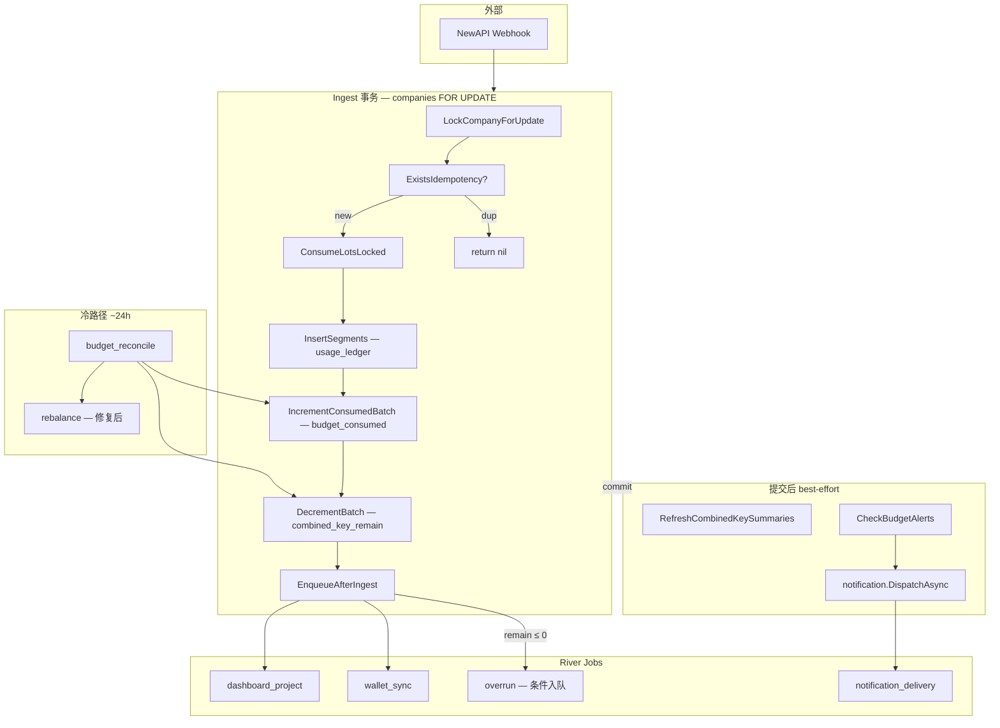
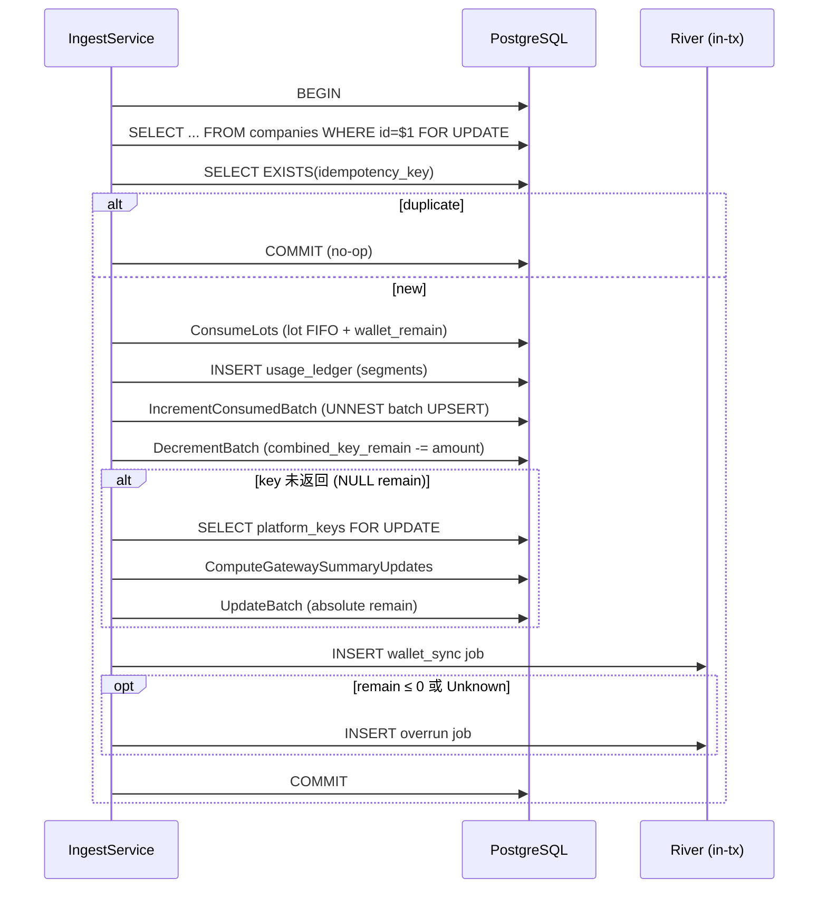
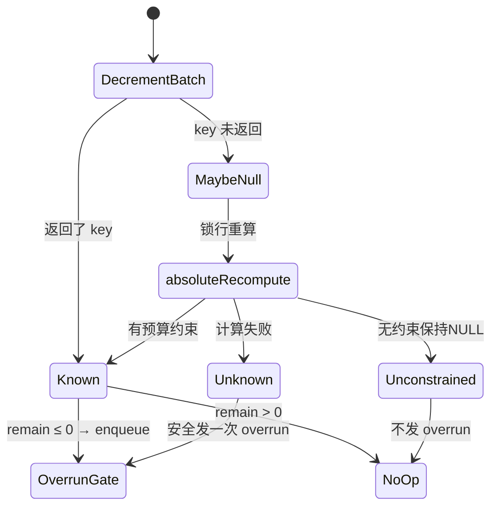
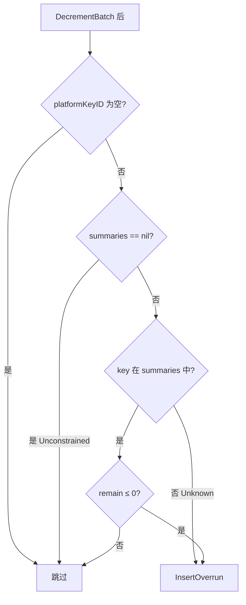
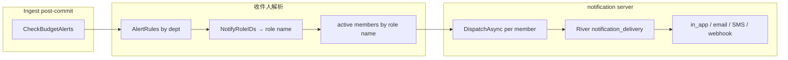
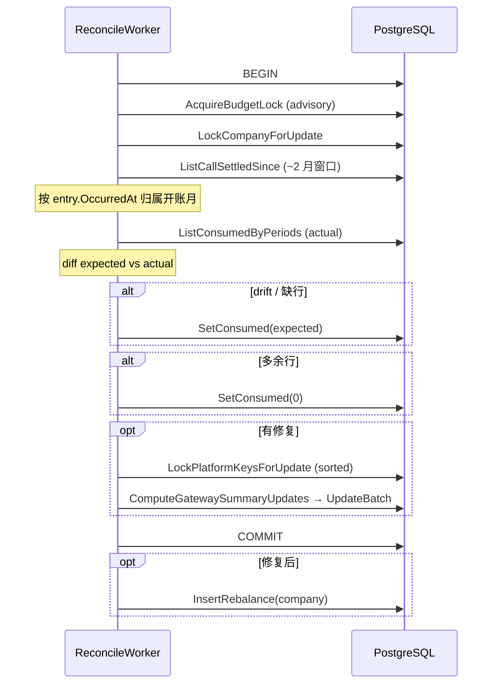

# Backend · 预算累计与 Gateway 预检架构

> 预算累计（`budget_consumed`）和 Gateway 预检余额（`combined_key_remain`）随 Ingest 同事务原子写入。
> 本文描述当前实现状态。

相关：[Backend-预算.md](./Backend-预算.md) · [Backend-离线任务.md](./Backend-离线任务.md) · [Notification.md](./Notification.md)

---

## 1. 架构总览



---

## 2. Ingest 事务

### 2.1 时序



### 2.2 约束

| 约束 | 实现 |
|---|---|
| 公司级串行 | `companies FOR UPDATE` — Ingest 和 reconcile 共用 |
| 幂等在锁后 | 锁后检查 → 重复请求零副作用 |
| consumed 一次写 | `IncrementConsumedBatch` UNNEST 批量 UPSERT，最多 3 轴 |
| combined 原子扣减 | `GREATEST(remain - delta, 0)` |
| 绝对重算仅初始化 | NULL remain → 锁行 → 重算 → UpdateBatch |
| job 失败 = 账务回滚 | River job 在同一事务中插入 |
| 无 advisory lock | Ingest 热路径不拿 budget advisory lock |

### 2.3 combined_key_remain 三态



### 2.4 批量 consumed SQL

```sql
INSERT INTO budget_consumed (company_id, axis_kind, axis_id, period_key, consumed, updated_at)
SELECT $1, axis_kind, axis_id, period_key, amount, NOW()
FROM UNNEST($2::text[], $3::text[], $4::text[], $5::numeric[])
    AS input(axis_kind, axis_id, period_key, amount)
ON CONFLICT (company_id, axis_kind, axis_id, period_key)
DO UPDATE SET consumed = budget_consumed.consumed + EXCLUDED.consumed, updated_at = NOW();
```

---

## 3. Overrun Gate



- Ingest 只做 gate，不执行 Disable/NewAPI
- `OverrunService` worker 做多轴裁决（platform key → member → project → department）
- payload 含 `periodKey`，避免跨月误判

---

## 4. 告警：notification server 集成



| 要素 | 说明 |
|---|---|
| 触发 | Ingest commit 后，仅 touched department |
| 收件人 | `NotifyRoleIDs` → role ID→name → active members |
| 去重键 | `budget-alert:{companyID}:{ruleID}:{threshold}:{periodKey}:{memberID}` |
| 偏好 | notification server 处理（quiet hours / channel / rate limit） |
| 失败 | 只记日志，不影响已提交账务 |

---

## 5. Reconcile（冷路径）



| 约束 | 说明 |
|---|---|
| 并发安全 | advisory 锁 + company 行锁，Ingest 只拿 company 锁 → 无死锁 |
| 账期归属 | `OpenDepartmentPeriodAt(entry.OccurredAt)` 而非当前 Clock |
| 多余行清零 | actual 中不在 expected 中的行 → SetConsumed(0) |
| 硬限 | 单公司 ledger 上限 50000 条，超过 job 失败重试 |
| 频率 | ~24h，scheduler 判定 due 后 enqueue |

---

## 6. 数据写入者

| 数据 | 写入者 | 时机 |
|---|---|---|
| `usage_ledger` | Ingest | 事务内 |
| `budget_consumed` | Ingest (IncrementConsumedBatch) | 事务内 |
| `budget_consumed` | Reconcile (SetConsumed) | 冷路径修复 |
| `combined_key_remain` | Ingest (DecrementBatch) | 事务内 |
| `combined_key_remain` | Ingest (absoluteRecompute) | 事务内 — 仅 NULL 初始化 |
| `combined_key_remain` | Reconcile (UpdateBatch) | 冷路径修复 |
| `combined_key_remain` | Rebalance | 充值/月切后 |
| `notification_log` | notification server | 异步投递 |
| `usage_buckets` | dashboard projector | 异步投影（看门狗每小时触发） |

---

## 7. 代码结构

```text
domain/usage/
├── ingest.go                        # IngestRaw 主路径
├── ports.go                         # IngestJobEnqueuer
└── ingest_overrun_gate_test.go      # ShouldEnqueueOverrun 单测

domain/budget/
├── alert_publisher.go               # AlertPublisher port + CheckBudgetAlerts
├── alert_publisher_test.go          # role 解析单测
├── consumed_attrib.go               # ConsumptionDeltas / ConsumedDrift
├── consumed_attrib_test.go          # delta 计算单测
├── budget_reconcile.go              # ReconcileService.RunCompany
├── budget_reconcile_test.go         # reconcile 工具函数单测
├── combined_key_summary.go          # ComputeGatewaySummaryUpdates
├── overrun.go                       # OverrunService (worker 多轴裁决)
├── rebalance.go                     # RebalanceService
└── ports.go                         # JobEnqueuer (overrun/rebalance/reconcile)

domain/billing/lot/
└── consume.go                       # ConsumeLots / ConsumeLotsLocked

app/
├── port_usage.go                    # EnqueueAfterIngest
├── port_budget.go                   # budget JobEnqueuer adapter
├── port_budget_alert.go             # AlertPublisher → notification.DispatchAsync
└── compose_domain_wire.go           # wireIngestService

infra/
├── jobs/kinds_budget.go             # Overrun / Rebalance / Reconcile args
├── river/client.go                  # Worker 注册（无 BudgetProjector）
├── river/workers/budget_reconcile.go
├── scheduler/due.go                 # NeedsBudgetReconcile
└── notification/                    # DispatchAsync → notification_delivery

store/
├── budget_consumed_repo.go          # ConsumedDelta + IncrementConsumedBatch
├── combined_key_summary.go          # LockPlatformKeysForUpdate
└── postgres/                        # SQL 实现
```

---

## 8. 不存在的组件

以下组件已删除，不在当前代码中：

- `budget_projector.go` / `budget_projector_alerts.go` / `async.go`
- `BudgetProjectionWorker` / `BudgetProjectionArgs` / `KindBudgetProjection`
- `InsertBudgetProjection`
- `budget_projection_progress` 表和 repository
- `NeedsBudgetProject` / projection lag 检查
- `ApplyIncrement` / `ConsumedIncrementWriter` / `ExpectedConsumed`（旧版）
