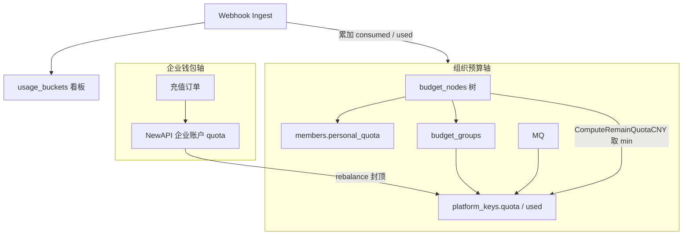
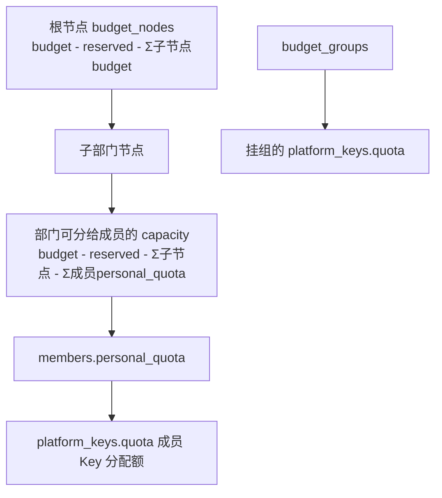
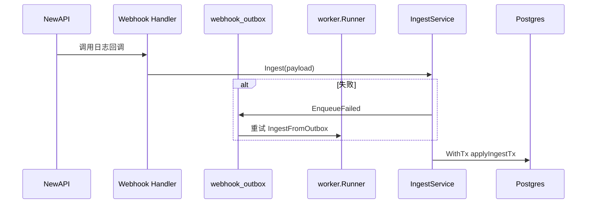
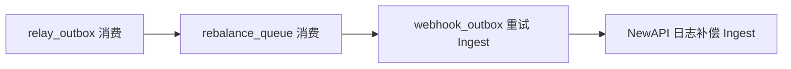
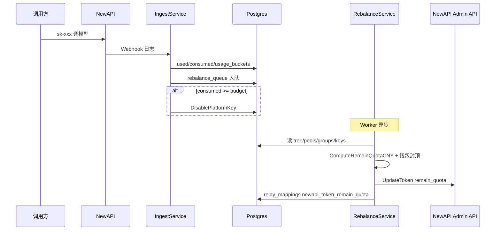

# Backend 预算系统运作说明

本文基于 `apps/backend/` 源码，说明 TokenJoy **预算（Budget）** 如何存储、分配、消耗、同步到 NewAPI，以及与**企业钱包**、**看板用量**的关系。

**相关文档：**

- 实体与表：[Backend-存储架构.md](./Backend-存储架构.md)
- 实体优化方向：[Backend-存储实体优化.md](./Backend-存储实体优化.md)
- 钱包与多企业：[Backend-SaaS多租户架构.md](./Backend-SaaS多租户架构.md)
- 命名规范：[Backend-命名规范.md](./Backend-命名规范.md)

---

## 1. 核心概念：两条轴

预算系统不是单一的「余额」字段，而是 **两条独立但会交汇的轴**（详见 [Backend-SaaS多租户架构.md](./Backend-SaaS多租户架构.md) ADR）：

| 轴           | 权威数据源                                                | 管什么                              | 谁改                            |
| ------------ | --------------------------------------------------------- | ----------------------------------- | ------------------------------- |
| **企业钱包** | NewAPI `users.quota`（`companies.newapi_wallet_user_id`） | 企业预付资金硬上限                  | 充值 → `billing.Service` TopUp  |
| **组织预算** | Postgres `budget_*` 表                                    | 部门树内额度分配、成员/Key/组级花费 | 控制台 + Ingest 累加 `consumed` |



**充值只涨钱包，不自动涨部门 `budget`。** 超管在控制台给 `budget_nodes` 分配额度；成员个人额度、Key 配额、预算组额度都从组织预算轴往下切。

---

## 2. 代码结构

### 2.1 包与职责

| 路径                                       | 职责                                                           |
| ------------------------------------------ | -------------------------------------------------------------- |
| `internal/domain/budget/service.go`        | 控制台 CRUD：预算树、成员额度、预算组、预警规则、超限策略      |
| `internal/domain/budget/ingest.go`         | Webhook 入账入口、幂等、企业上下文                             |
| `internal/domain/budget/ingest_apply.go`   | 单次调用入账：写 `used` / `consumed` / 用量桶 / Rebalance 入队 |
| `internal/domain/budget/ingest_rollup.go`  | 部门树 `consumed` 向祖先累加                                   |
| `internal/domain/budget/ingest_overrun.go` | 花超后禁用 Key + 发通知                                        |
| `internal/domain/budget/rebalance.go`      | 按轴重算 NewAPI Token `remain_quota`                           |
| `internal/pkg/budget/*`                    | 纯函数：树操作、校验、额度计算（无 IO）                        |
| `internal/domain/relay/quota.go`           | `ComputeRemainQuotaCNY`：多约束取最小值                        |
| `internal/http/handler/budget/handler.go`  | `/api/budget/*` HTTP 层                                        |
| `internal/store/budget_repo.go`            | `BudgetRepository` 接口                                        |
| `internal/infra/worker/runner.go`          | 定时消费 Outbox、Rebalance 队列、补偿 Ingest                   |

### 2.2 依赖注入（组合根）

`internal/app/wiring_domain.go` 中：

- `budget.NewService` → 管理面
- `budget.NewIngestService` → 注入 `relay.Lifecycle`、`notification.Notifier`
- `budget.NewRebalanceService` → 注入 `newapi.AdminClient`、`relay.Lifecycle`
- `billing.NewService` → 充值成功后 `EnqueueRebalance(company)` 刷新全企业 Token 配额

---

## 3. 持久化实体

`BudgetRepository` 暴露的存储（`internal/store/budget_repo.go`）：

| 方法                                        | 表                                        | 说明                          |
| ------------------------------------------- | ----------------------------------------- | ----------------------------- |
| `Tree` / `SetTree`                          | `budget_nodes`                            | 预算树；**节点 ID = 部门 ID** |
| `Groups` / `SetGroups`                      | `budget_groups` + 两个关联表              | 跨部门/成员共享池             |
| `Org.Members` / `UpdateMemberPersonalQuota` | `members.personal_quota`                  | 成员个人额度上限              |
| `OverrunPolicy` / `SetOverrunPolicy`        | `overrun_policy`                          | 每企业一行超限策略配置        |
| `AlertRules` / `SetAlertRules`              | `alert_rules` + `alert_rule_notify_roles` | 节点预警规则                  |

与预算强相关、但不在 `BudgetRepository` 的表：

| 表                 | 关系                                                                       |
| ------------------ | -------------------------------------------------------------------------- |
| `platform_keys`    | `quota`（分配额）、`used`（已消耗）；可挂 `member_id` 或 `budget_group_id` |
| `relay_mappings`   | 冗余部门/组 ID；`newapi_token_remain_quota` 缓存 NewAPI 侧剩余             |
| `usage_buckets`    | 看板聚合事实，非预算管控主账                                               |
| `rebalance_queue`  | 异步再平衡待办                                                             |
| `ingested_log_ids` | Ingest 幂等                                                                |

### 3.1 预算节点字段

```go
// internal/domain/types/budget.go
type BudgetNode struct {
    ID           string
    Name         string
    ParentID     *string
    Budget       float64   // 本节点可支配总额度
    Consumed     float64   // 本节点及下级调用累计（Ingest 写入）
    ReservedPool *float64  // 预留池：从本节点扣减、不参与向下分配
    Period       string    // 如 "2026-07"，新建部门时写入
    Children     []BudgetNode
}
```

`Period` 在 `org.department.budgetPeriod()` 生成：demo 用 `DemoToday` 前 7 位，否则当前年月。

---

## 4. 分配层级（自上而下）

预算从企业钱包以下，按 **四层约束** 逐级切分；下层总和不能超过上层可分配额。



### 4.1 节点预算校验

`pkg/budget/validate.ValidateBudgetNodeUpdate` 在 `PUT /api/budget/nodes/{id}` 时执行：

1. **对子级：** `newBudget >= Σ子节点.budget + reservedPool`
2. **对父级：** `newBudget + Σ兄弟.budget + reservedPool <= 父.budget - 父.reservedPool`

失败返回中文业务错误（如「超出上级可分配预算」）。

### 4.2 成员个人额度

- 默认个人额度：`common.DefaultPersonalQuota` = **5000**（`members.personal_quota` 列默认；新建成员显式写入）
- 更新入口：`PUT /api/budget/members/{memberId}`
- 校验 `ValidateMemberQuotaUpdate`：
  - `personalQuota >=` 该成员已分配 Key 的 `quota` 之和
  - 同部门所有成员 `personalQuota` 之和 ≤ `GetMemberQuotaCapacity(部门节点)`

`GetMemberQuotaCapacity` = `节点.budget - reservedPool - Σ子节点.budget`。

### 4.3 平台密钥配额

创建 Key（`keys.CreatePlatformKey`）时：

| Key 归属                         | 校验                                                                                |
| -------------------------------- | ----------------------------------------------------------------------------------- |
| 挂**成员**（无 `budgetGroupId`） | `quota <= GetQuotaRemaining(pools, keys, memberId)`                                 |
| 挂**预算组**                     | `ValidateGroupKeyQuota`：`quota <= group.budget - group.consumed - Σ组内 Key.quota` |

`GetQuotaRemaining` = `personalQuota - Σ该成员 active Key 的 quota`（不含已 consumed，只扣**分配额**）。

### 4.4 预算组

- 扁平池：`budget_groups` + `budget_group_members` + `budget_group_departments`
- Key 可直接 `budget_group_id` 计费，**不走**成员个人额度
- 组内 `consumed` 在 Ingest 时独立累加

---

## 5. 与组织树的联动

部门与预算节点 **同 ID**，不是外键。组织变更必须在事务内联动三份状态：

| 组织操作 | 同步写入                                                           |
| -------- | ------------------------------------------------------------------ |
| 新建部门 | `departments` + `budget_nodes` + `routing_rules`（`provision.go`） |
| 改名     | 三处 `name` / `node_name`                                          |
| 删除     | 三处移除节点                                                       |

预算树本身的 **额度调整** 仅通过 `budget.Service.UpdateNode`，不经过 `org` 包；但读树时 ID 与部门一一对应。

---

## 6. 管理面 API

路由注册：`internal/http/handler/budget/handler.go`

| 方法                | 路径                                             | 权限                   | 行为                        |
| ------------------- | ------------------------------------------------ | ---------------------- | --------------------------- |
| GET                 | `/api/budget/tree`                               | `budget:read`          | 返回嵌套预算树              |
| PUT                 | `/api/budget/nodes/{id}`                         | `budget:allocate`      | 改 `budget`、`reservedPool` |
| GET                 | `/api/budget/departments/{deptId}/member-quotas` | read                   | 部门成员额度一览            |
| PUT                 | `/api/budget/members/{memberId}`                 | allocate               | 改个人额度                  |
| GET/POST/PUT/DELETE | `/api/budget/groups*`                            | read / allocate        | 预算组 CRUD                 |
| GET/PUT             | `/api/budget/overrun-policy`                     | read / `budget:policy` | 超限策略配置                |
| GET/POST/PUT/DELETE | `/api/budget/alerts*`                            | read / policy          | 预警规则 CRUD               |

写操作经 `common.Delayer` 人为延迟 300ms（demo 体感），与业务规则无关。

`budget.Service` **不**直接调用 NewAPI；只读写 Postgres。

---

## 7. 运行时：Webhook Ingest

### 7.1 触发路径



Worker 还会通过 `relay_sync_cursors` **补偿轮询** NewAPI 日志（`org_sync_processor`），同样走 `Ingest`。

### 7.2 Ingest 主流程

`IngestService.Ingest`（`ingest.go`）：

1. `HasIngestedLogID` → 已处理则直接返回（幂等）
2. `FindMappingByNewAPITokenID` → 定位 `relay_mappings` 与 `company_id`
3. 解析模型名、用 `domain/usage.CostCNYFromLog` 算 **costCNY**（基于 NewAPI quota 与模型单价）
4. `store.WithTx` → `applyIngestTx`

### 7.3 单次入账写入了什么

`applyIngestTx`（`ingest_apply.go`）在**同一事务**内顺序执行：

| 步骤 | 写入                                           | 说明                                  |
| ---- | ---------------------------------------------- | ------------------------------------- |
| 1    | `platform_keys.used += costCNY`                | Key 级已用额                          |
| 2    | `budget_nodes.consumed` 向上 rollup            | 成员所在部门及所有祖先节点 += costCNY |
| 3    | `budget_groups.consumed`                       | 若 mapping 有 `budget_group_id`       |
| 4    | `rebalance_queue` 入队                         | member / department / budget_group 轴 |
| 5    | `evaluateOverrun`                              | 见 §9                                 |
| 6    | `usage_buckets` Upsert                         | 按**小时桶** × 部门 × 成员 × 模型聚合 |
| 7    | `ingested_log_ids` + 更新 `relay_sync_cursors` | 幂等与补偿游标                        |

**rollup 逻辑**（`ingest_rollup.go`）：从成员叶子部门开始，`Consumed += cost`，再对 `collectAncestorIDs` 返回的每个祖先同样 `+= cost`。因此父节点 `consumed` 含整棵子树花费。

### 7.4 与看板的关系

| 数据                    | 用途                     | 写入方                  |
| ----------------------- | ------------------------ | ----------------------- |
| `budget_nodes.consumed` | 预算树展示、超限判断     | Ingest                  |
| `usage_buckets`         | Dashboard 趋势、成本汇总 | Ingest                  |
| `call_logs`             | 审计逐条明细             | **独立链路**，非 Ingest |

看板 `dashboard.Service` 读 `usage_buckets`（`UsageSourceBuckets`），**不读** `budget_nodes.consumed`。两者同源事件、不同聚合，短期可能因舍入或重试边界略有差异。

---

## 8. Rebalance：组织预算 → NewAPI Token 配额

### 8.1 为什么需要 Rebalance

NewAPI 每个 Token 有 `remain_quota`（内部单位）。TokenJoy 侧用 CNY 管理预算，需在以下时机把 **「还能花多少 CNY」** 换算成 Token 配额并 `UpdateToken`：

- Ingest 后（花费变化）
- 充值后（钱包变大）
- Key 创建/更新/启用（`relay/lifecycle_*.go`）

### 8.2 入队

`rebalance_queue` 按 `(company_id, axis_kind, axis_id, status)` 去重入队：

| `axis_kind`    | 典型触发                          |
| -------------- | --------------------------------- |
| `member`       | Ingest 有 memberId                |
| `department`   | 每次 Ingest                       |
| `budget_group` | Ingest 命中预算组                 |
| `company`      | 充值完成 `billing.topUpAndFinish` |

Worker `processRebalance` 每次 claim 最多 20 条，调用 `RebalanceService.ProcessAxis`。

### 8.3 剩余额度怎么算

`relay.ComputeRemainQuotaCNY` 对单个 Key 取 **多候选的最小值**：

```text
candidates = [
  key.Quota - key.Used,                    // Key 自身剩余
  (可选) memberCap - memberUsedKeys,      // 成员个人额度轴（Key 未挂组时）
  (可选) group.Budget - group.Consumed,   // 预算组轴（Key 挂组时）
  dept.Budget - dept.Consumed - reserved, // 部门节点轴
]
return min(candidates)
```

再经 `newapi.ToNewAPIUnits(remainCNY, models, effectiveWhitelist)` 换成 NewAPI 单位（按白名单内最贵模型单价折算）。

### 8.4 企业钱包封顶

`rebalanceKey` 中若配置了 `newapi_wallet_user_id`：

1. 读钱包 `GetUserQuota`
2. 减去**同企业其他 Token** 已分配的 `newapi_token_remain_quota` 之和
3. `newRemain = min(组织算出的 allocated, 钱包可用)`

保证 **Σ Token remain_quota ≤ 企业钱包**（与 SaaS ADR 一致）。

最后 `UpdateToken` + `UpdateMappingNewAPITokenRemainQuota` 写回 `relay_mappings`。

---

## 9. 超限（Overrun）处理

### 9.1 实际生效逻辑

`ingest_overrun.evaluateOverrun` 在每次 Ingest **累加 consumed 之后**检查（硬比较 `>=`，**不用** `overrun_policy.thresholds` 百分比）：

| 范围   | 条件                                                | 动作                                          |
| ------ | --------------------------------------------------- | --------------------------------------------- |
| 成员   | Key 未挂组 && `GetUsedKeyQuota >= GetPersonalQuota` | `lifecycle.DisablePlatformKey` 该成员非组 Key |
| 部门   | `node.Consumed >= node.Budget`                      | 禁用该部门下所有 mapping 对应 Key             |
| 预算组 | `group.Consumed >= group.Budget`                    | 禁用该组下所有 Key                            |

每次触发 `notification.Notifier.Send`，事件类型 `overrun_blocked`。

**前提：** `relay.Lifecycle.Enabled()` 为 true（`NEW_API_ENABLED` 等配置）。

### 9.2 配置项 vs 实现差距（阅读代码时需注意）

| 实体             | 控制台可配                     | 运行时是否使用                   |
| ---------------- | ------------------------------ | -------------------------------- |
| `overrun_policy` | 阈值、通知渠道、`blockMessage` | **Ingest 未读取**；仅 CRUD 存储  |
| `alert_rules`    | 节点阈值 %、`notifyRoleIds`    | **无 Worker 评估**；仅 CRUD 存储 |

当前真正执行「花超即封」的是 §9.1 的 **100% 硬门禁**，不是预警规则里的 80%/90% 阶梯通知。

---

## 10. 企业钱包与充值

`billing.Service`（`internal/domain/billing/`）：

1. `GetWallet` → 读 NewAPI `users.quota`，转成 CNY 展示 `balance` / `allocatable`
2. 充值 `topUpAndFinish` → NewAPI `TopUp` → 订单状态 `topped_up`
3. 成功后 `EnqueueRebalance(company)` → 全企业 active mapping 重算 Token 配额

**充值不改变 `budget_nodes.budget`。** 若钱包有钱但部门 budget 为 0，`ComputeRemainQuotaCNY` 仍可能得到 0，API 不可用——产品引导「分配组织预算」。

---

## 11. Worker 一轮做什么

`worker.Runner` 每个周期（`RunOnce`）大致顺序：



与预算直接相关的是 **B**（同步 Token 配额）和 **C/D**（入账写 consumed）。

---

## 12. 端到端：一次 API 调用的预算路径



**花谁的钱（NewAPI 扣费对象）：** 始终进**企业钱包**；TokenJoy 用 `department_id` / `member_id` / `budget_group_id` 做**归因与配额约束**。

---

## 13. 关键公式速查

| 名称                | 公式 / 位置                                                                |
| ------------------- | -------------------------------------------------------------------------- |
| 部门可分给成员      | `budget - reservedPool - Σ子节点.budget` → `GetMemberQuotaCapacity`        |
| 成员可分配 Key 额   | `personalQuota - Σ成员 Key.quota` → `GetQuotaRemaining`                    |
| 成员已消耗 Key 额   | `Σ成员 active Key.used` → `GetUsedKeyQuota`                                |
| 预算组可分配 Key 额 | `group.budget - group.consumed - Σ组 Key.quota` → `GetGroupQuotaRemaining` |
| Relay 可用 CNY      | `min(Key剩余, 成员/组剩余, 部门剩余)` → `ComputeRemainQuotaCNY`            |
| NewAPI 单位         | `cny / 最贵模型单价 * QuotaPerUnit` → `ToNewAPIUnits`                      |
| 入账 CNY            | Webhook `quota` 字段 + 模型单价 → `CostCNYFromLog`                         |

---

## 14. 包边界小结

| 问题                           | 负责包                                            |
| ------------------------------ | ------------------------------------------------- |
| 控制台改预算树 / 组 / 成员额度 | `domain/budget` Service                           |
| 调用后记账                     | `domain/budget` IngestService                     |
| 同步 NewAPI Token 配额         | `domain/budget` RebalanceService + `domain/relay` |
| 创建 Key 时校验额度            | `domain/keys` + `pkg/budget`                      |
| 组织树变更带预算节点           | `domain/org` provision                            |
| 看板趋势                       | `domain/dashboard` → `usage_buckets`              |
| 充值涨钱包                     | `domain/billing`                                  |

---

## 15. 已知限制与演进参考

1. **消耗多写点：** Ingest 同时写 `used`、`consumed`、`usage_buckets`；详见 [Backend-存储实体优化.md](./Backend-存储实体优化.md) §O1。
2. **预警与策略未接线：** `alert_rules`、`overrun_policy` 仅有 API 存储，无定时/Ingest 评估。
3. **部门 consumed rollup：** 祖先节点包含子孙花费，与「仅本节点花费」的 UI 理解需一致。
4. **预算组与成员轴互斥：** Key 挂组时不走成员个人额度超限分支（`ingest_overrun` 中 `BudgetGroupID == nil` 才检查成员）。

---

## 16. 源码索引

| 主题         | 文件                                                                       |
| ------------ | -------------------------------------------------------------------------- |
| 预算 Service | `internal/domain/budget/service.go`                                        |
| Ingest       | `internal/domain/budget/ingest.go`, `ingest_apply.go`                      |
| 超限         | `internal/domain/budget/ingest_overrun.go`                                 |
| Rebalance    | `internal/domain/budget/rebalance.go`                                      |
| 额度合成     | `internal/domain/relay/quota.go`                                           |
| 树校验       | `internal/pkg/budget/validate.go`, `memberbudgetquota.go`, `groupquota.go` |
| HTTP         | `internal/http/handler/budget/handler.go`                                  |
| Worker       | `internal/infra/worker/runner.go`, `rebalance_processor.go`                |
| Schema       | `internal/store/postgres/schema.sql`（`budget_*` 段）                      |
| 测试         | `tests/domain/budget/*`                                                    |
