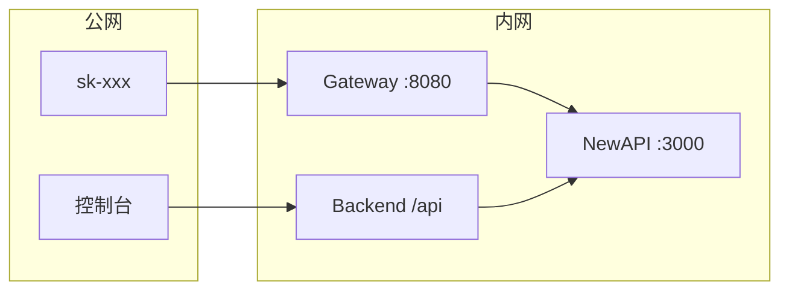

# TokenJoy Backend

`apps/backend/` Go 服务现状：实现 [Frontend.md](./Frontend.md) 企业面 **82** 端点 + SaaS **11** 端点；种子 `internal/store/seed/`；Postgres **36** 表；消耗 SSOT 为 `usage_ledger`。

差距与计划见 [Roadmap.md](./Roadmap.md)；工程待办见 [plan.md](./plan.md)。

---

## 文档地图

| 文档                                       | 内容                                                       |
| ------------------------------------------ | ---------------------------------------------------------- |
| [Backend-架构.md](./Backend-架构.md)       | 分层、请求链、中间件、Store 抽象、Relay/Worker、看板读路径 |
| [Backend-存储.md](./Backend-存储.md)     | 36 表、管理面/运行面、ER、四张合并表、ID 约定              |
| [Backend-预算.md](./Backend-预算.md)     | 双轴、Ingest、projection、Rebalance、Overrun、分配规则     |
| [Backend-测试优化.md](./Backend-测试优化.md) | 测试瘦身、HTTP Client DSL、断言规范、迁移计划            |

---

## 1. 概览

| 类别 | 选型                                    |
| ---- | --------------------------------------- |
| 语言 | Go 1.24                                 |
| HTTP | chi v5 + `net/http`                     |
| 配置 | `caarlos0/env`                          |
| 日志 | `log/slog` JSON                         |
| JSON | camelCase 对齐前端                      |
| 测试 | `testing` + `httptest` + PostgreSQL（`tests/` 外挂；每测独立 schema） |
| DI   | 构造函数注入，组合根 `internal/app/`    |

---

## 2. SaaS 多租户

`SUPPORT_SAAS=true` 开启多企业；私有化 `company_id=1`。

### 2.1 ADR

| 决策                 | 结论                                       |
| -------------------- | ------------------------------------------ |
| NewAPI 企业隔离      | 单集群；每企业一个 `newapi_wallet_user_id` |
| 计费主账             | 企业钱包 `users.quota`；充值只进钱包       |
| Token `remain_quota` | 分配视图；`rebalance` 保证 Σ ≤ 钱包        |
| 双轴                 | 钱包=预付资金；部门 budget=组织内花费配额  |
| Gateway              | 预检后透传 NewAPI                          |

计费双轴与 Ingest 详见 [Backend-预算.md](./Backend-预算.md)。

### 2.2 总体架构

```mermaid
flowchart TB
    subgraph clients [客户端]
        C1[成员 / 企业超管]
        C2[平台运营]
        C3[sk-xxx 调用方]
    end

    subgraph gateway [TokenJoy apps/backend]
        MW[CompanyResolve]
        API[/api 管理面]
        RELAY[/v1 Relay Gateway]
        STORE[(Postgres)]
    end

    subgraph newapi [NewAPI 单集群]
        WA[企业钱包 A]
        WB[企业钱包 B]
        CH[platform_shared Channel]
    end

    C1 --> MW --> API
    C2 --> API
    C3 --> RELAY
    API --> STORE
    RELAY --> STORE
    RELAY --> newapi
    WA --> CH
    WB --> CH
```

### 2.3 部署形态

| 形态   | Channel                  | Token group           |
| ------ | ------------------------ | --------------------- |
| 私有化 | 企业 `provider_keys`     | `dept-{departmentId}` |
| SaaS   | 平台全局 `provider_keys` | `platform_shared`     |

### 2.4 开户与充值

```mermaid
sequenceDiagram
    participant PO as 平台运营
    participant TJ as TokenJoy
    participant PG as Postgres
    participant NA as NewAPI

    PO->>TJ: POST /api/platform/companies
    TJ->>PG: BEGIN; INSERT companies
    TJ->>NA: CreateUser quota=0
    alt CreateUser 失败
        TJ->>PG: ROLLBACK
    else 成功
        NA-->>TJ: newapi_wallet_user_id
        TJ->>PG: 根部门 + company_invites
        TJ->>PG: COMMIT
    end
```

充值 `company_recharge_orders`：`pending` → `paid` → `topped_up` → 企业级 rebalance。平台 API 见 [Frontend.md](./Frontend.md) §5.5。

### 2.5 Keys 域约束（Platform Key / Relay）

实现待办见 [plan.md](./plan.md) §3。

| 约束 | 说明 |
| --- | --- |
| 无增量 migration | 改 `schema.sql` 后 wipe 重建（`docker compose down -v`） |
| 推导字段不入库 | `memberName` / `projectName` 等仅 JSON enrich |
| Platform Key secret | 必须经 Relay 下发；禁止本地 placeholder |
| Rotate 过渡期 | `RotatePlatformKey` → HTTP **501**（非最终态） |
| 错误语义 | 不存在 `404`；Relay 不可用 `503`；未实现 `501` |

**本地开发：** 创建 Platform Key / 审批发 Key 须启用 Relay（`NEW_API_ENABLED` 等）；否则 `503`。

**实现索引：** `domain/keys/platform_key_enrich.go` · `platform_key_relay.go` · `platform_key_actions.go` · `domain/keys/approval.go` · `domain/relay/interface.go`

---

## 3. 环境变量与运行

| 变量                          | 默认               | 说明                                                                          |
| ----------------------------- | ------------------ | ----------------------------------------------------------------------------- |
| `PORT`                        | `8080`             | HTTP                                                                          |
| `DATABASE_URL`                | 必填（测试与生产） | Postgres；测试见 [Backend-测试优化.md](./Backend-测试优化.md) |
| `SESSION_SECRET`              | **必填（目标态）** | 企业面 Session JWT 签名；见 [权限管理.md](./权限管理.md) §10                  |
| `APP_PROFILE`                 | `demo`             | 仅非鉴权用途（如延迟模拟）；**鉴权不再分叉**，见 [权限管理.md](./权限管理.md) |
| `DEMO_TODAY`                  | `2026-06-19`       | Demo 看板锚定                                                                 |
| `NEW_API_ENABLED`             | `false`            | Relay + worker                                                                |
| `RELAY_GATEWAY_ENABLED`       | `false`            | `/v1/*` Gateway                                                               |
| `SUPPORT_SAAS`                | `false`            | SaaS 多企业                                                                   |
| `PLATFORM_SHARED_RELAY_GROUP` | `platform_shared`  | SaaS Token 分组                                                               |

完整列表见 `apps/backend/.env.example`。

```bash
pnpm start          # Postgres + backend :8080 + frontend :5173
pnpm start:relay    # 完整 NewAPI 栈
pnpm gate:verify    # Relay 验证
```

生产：`/api/` 反代到 Go（`deploy/nginx.conf.example`）。错误体：`{ "message": "..." }`。

---

## 4. Relay 与 NewAPI 部署



| 组件     | 说明                                        |
| -------- | ------------------------------------------- |
| NewAPI   | 单集群；按 `newapi_wallet_user_id` 逻辑隔离 |
| Postgres | `tokenjoy` + `newapi` 两库                  |
| Redis    | NewAPI 会话与缓存                           |

**Bootstrap：** `docker compose -f apps/newapi/docker-compose.yml up -d` → NewAPI 根管理员 → `NEW_API_ADMIN_TOKEN` → Webhook secret 对齐 → Channel `group=platform_shared`。

**Token 创建（SaaS）：** `user_id` = `newapi_wallet_user_id`；`group` = `platform_shared`；`remain_quota` = min(分配额, 钱包可分配)。

**安全：** NewAPI 不对公网；Admin Token 仅存 Backend 环境变量。

Relay 架构与 Worker 见 [Backend-架构.md](./Backend-架构.md) §7。

---

## 5. 测试

**所有测试在 `apps/backend/tests/`，`internal/` 禁止 `*_test.go`。**

测试优化方案见 [Backend-测试优化.md](./Backend-测试优化.md)。

测试存储迁移与 PG 隔离实现见 [Backend-测试优化.md](./Backend-测试优化.md)（含 PR 拆分与代码锚点）。

```bash
cd apps/backend
pnpm start:postgres   # 或确保 DATABASE_URL 可用
make test-unit        # go test -tags=testhook ./tests/...
make test-integration # 需 LOG_DATABASE_URL 的 ingest 全链路（可选）
```

| 层       | 目录                   | CI                           |
| -------- | ---------------------- | ---------------------------- |
| 纯函数   | `tests/pkg/*`          | verify                       |
|          | `tests/pkg/org/`       | `remote_ids`、`sync_diff` 等 |
| Domain   | `tests/domain/<域>/`   | verify（Postgres）           |
| Handler  | `tests/handler/<域>/`  | verify（Postgres）           |
| Postgres | `tests/store/postgres` | verify（Postgres）           |

### 5.1 `testutil` 子包

| 子包              | 职责                                                                 |
| ----------------- | -------------------------------------------------------------------- |
| `testutil/`（根） | 通用：`config`、`ctx`、`NewTestStore`、`assert`、`app`、`session`    |
| `testutil/org`    | Org Service、Feishu fixture、预算树持久化                            |
| `testutil/saas`   | SaaS 配置、NewAPI mock、平台 HTTP 开户                               |
| `testutil/http`   | Router、AdminCookie、ServeAuthz、ProdRouter、Client DSL              |
| `testutil/relay`  | Gateway 场景、StubWallet、Mapping                                    |
| `testutil/worker` | Runner 栈、Outbox 断言                                               |

### 5.2 目录约定

- **Domain**：按 bounded context 分子目录；共享 helper 放在 `helpers_test.go`（如 `tests/domain/org/helpers_test.go`）。
- **Handler**：按 API 域分子包（`core/`、`authz/`、`org/`、`billing/`、`platform/`、`gateway/` 等），每目录独立 `package *_test`；HTTP fixture 统一用 `testutil/http` 与 `testutil/saas`。

新 GET 端点追加 `tests/handler/core/contract_test.go`。SaaS 配置：`testutil/saas.ApplyConfig`。

---

## 6. 变更检查清单

- [ ] `apps/frontend/src/api/` + [Frontend.md](./Frontend.md) API 契约
- [ ] `internal/domain/` + `internal/http/handler/`
- [ ] `internal/store/seed/`（demo 数据）
- [ ] `tests/handler/core/contract_test.go`（新 GET）
- [ ] 已实现项从 [Roadmap.md](./Roadmap.md) 移除
