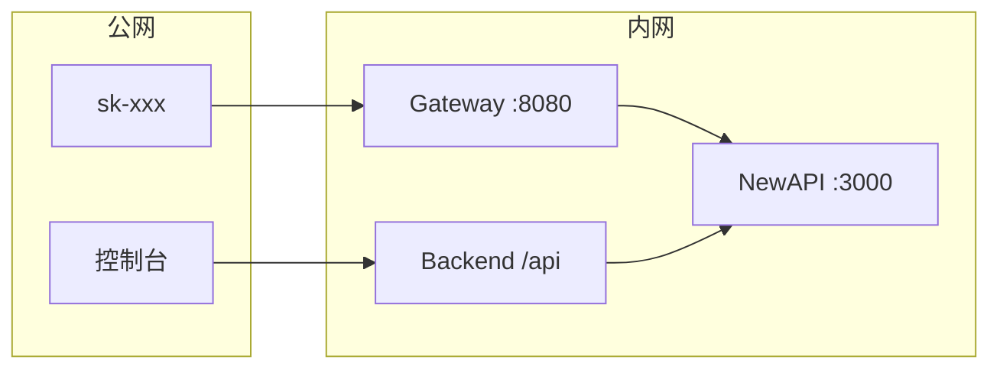

# TokenJoy Backend

`apps/backend/` Go 服务现状：实现 [Frontend.md](./Frontend.md) 企业面 **82** 端点 + SaaS **11** 端点；种子 `internal/store/seed/`；Postgres **36** 表；消耗 SSOT 为 `usage_ledger`。

差距与计划见 [Roadmap.md](./Roadmap.md)。

---

## 文档地图

| 文档 | 内容 |
| ---- | ---- |
| [Backend-架构.md](./Backend-架构.md) | 分层、请求链、中间件、Store 抽象、Relay/Worker、看板读路径 |
| [Backend-存储.md](./Backend-存储.md) | 36 表、管理面/运行面、ER、四张合并表、ID 约定 |
| [Backend-预算.md](./Backend-预算.md) | 双轴、Ingest、projection、Rebalance、Overrun、分配规则 |

---

## 1. 概览

| 类别 | 选型 |
| ---- | ---- |
| 语言 | Go 1.24 |
| HTTP | chi v5 + `net/http` |
| 配置 | `caarlos0/env` |
| 日志 | `log/slog` JSON |
| JSON | camelCase 对齐前端 |
| 测试 | `testing` + `httptest`，用例在 `tests/` |
| DI | 构造函数注入，组合根 `internal/app/` |

---

## 2. SaaS 多租户

`SUPPORT_SAAS=true` 开启多企业；私有化 `company_id=1`。

### 2.1 ADR

| 决策 | 结论 |
| ---- | ---- |
| NewAPI 企业隔离 | 单集群；每企业一个 `newapi_wallet_user_id` |
| 计费主账 | 企业钱包 `users.quota`；充值只进钱包 |
| Token `remain_quota` | 分配视图；`rebalance` 保证 Σ ≤ 钱包 |
| 双轴 | 钱包=预付资金；部门 budget=组织内花费配额 |
| Gateway | 预检后透传 NewAPI |

计费双轴与 Ingest 详见 [Backend-预算.md](./Backend-预算.md)。

### 2.2 总体架构

```mermaid
flowchart TB
    subgraph clients [客户端]
        C1[成员 / 企业超管]
        C2[平台运营]
        C3[sk-xxx 调用方]
    end

    subgraph gateway [TokenJoy apps/backend]
        MW[CompanyResolve]
        API[/api 管理面]
        RELAY[/v1 Relay Gateway]
        STORE[(Postgres)]
    end

    subgraph newapi [NewAPI 单集群]
        WA[企业钱包 A]
        WB[企业钱包 B]
        CH[platform_shared Channel]
    end

    C1 --> MW --> API
    C2 --> API
    C3 --> RELAY
    API --> STORE
    RELAY --> STORE
    RELAY --> newapi
    WA --> CH
    WB --> CH
```

### 2.3 部署形态

| 形态 | Channel | Token group |
| ---- | ------- | ----------- |
| 私有化 | 企业 `provider_keys` | `dept-{departmentId}` |
| SaaS | 平台全局 `provider_keys` | `platform_shared` |

### 2.4 开户与充值

```mermaid
sequenceDiagram
    participant PO as 平台运营
    participant TJ as TokenJoy
    participant PG as Postgres
    participant NA as NewAPI

    PO->>TJ: POST /api/platform/companies
    TJ->>PG: BEGIN; INSERT companies
    TJ->>NA: CreateUser quota=0
    alt CreateUser 失败
        TJ->>PG: ROLLBACK
    else 成功
        NA-->>TJ: newapi_wallet_user_id
        TJ->>PG: 根部门 + company_invites
        TJ->>PG: COMMIT
    end
```

充值 `company_recharge_orders`：`pending` → `paid` → `topped_up` → 企业级 rebalance。平台 API 见 [Frontend.md](./Frontend.md) §5.5。

---

## 3. 环境变量与运行

| 变量 | 默认 | 说明 |
| ---- | ---- | ---- |
| `PORT` | `8080` | HTTP |
| `DATABASE_URL` | **必填** | Postgres |
| `APP_PROFILE` | `demo` | `demo` / `prod` |
| `DEMO_TODAY` | `2026-06-19` | Demo 看板锚定 |
| `NEW_API_ENABLED` | `false` | Relay + worker |
| `RELAY_GATEWAY_ENABLED` | `false` | `/v1/*` Gateway |
| `SUPPORT_SAAS` | `false` | SaaS 多企业 |
| `PLATFORM_SHARED_RELAY_GROUP` | `platform_shared` | SaaS Token 分组 |

完整列表见 `apps/backend/.env.example`。

```bash
pnpm start          # Postgres + backend :8080 + frontend :5173
pnpm start:relay    # 完整 NewAPI 栈
pnpm gate:verify    # Relay 验证
```

生产：`/api/` 反代到 Go（`deploy/nginx.conf.example`）。错误体：`{ "message": "..." }`。

---

## 4. Relay 与 NewAPI 部署



| 组件 | 说明 |
| ---- | ---- |
| NewAPI | 单集群；按 `newapi_wallet_user_id` 逻辑隔离 |
| Postgres | `tokenjoy` + `newapi` 两库 |
| Redis | NewAPI 会话与缓存 |

**Bootstrap：** `docker compose -f apps/newapi/docker-compose.yml up -d` → NewAPI 根管理员 → `NEW_API_ADMIN_TOKEN` → Webhook secret 对齐 → Channel `group=platform_shared`。

**Token 创建（SaaS）：** `user_id` = `newapi_wallet_user_id`；`group` = `platform_shared`；`remain_quota` = min(分配额, 钱包可分配)。

**安全：** NewAPI 不对公网；Admin Token 仅存 Backend 环境变量。

Relay 架构与 Worker 见 [Backend-架构.md](./Backend-架构.md) §7。

---

## 5. 测试

**所有测试在 `apps/backend/tests/`，`internal/` 禁止 `*_test.go`。**

```bash
cd apps/backend
make test-unit          # go test -tags=testhook ./tests/...
make test-integration   # -tags=integration
```

| 层 | 目录 | CI |
| -- | ---- | -- |
| 纯函数 | `tests/pkg/*` | verify |
| Domain | `tests/domain/*` | verify |
| Handler | `tests/handler/*` | verify |
| Postgres | `tests/store/postgres` | backend-integration |

新 GET 端点追加 `contract_test.go`。SaaS：`testutil.ApplySaaSConfig`。

---

## 6. 变更检查清单

- [ ] `apps/frontend/src/api/` + [Frontend.md](./Frontend.md) API 契约
- [ ] `internal/domain/` + `internal/http/handler/`
- [ ] `internal/store/seed/`（demo 数据）
- [ ] `tests/handler/contract_test.go`（新 GET）
- [ ] 已实现项从 [Roadmap.md](./Roadmap.md) 移除
