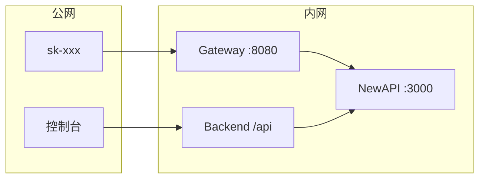

# TokenJoy Backend

`apps/backend/` Go 服务现状：实现 [Frontend.md](./Frontend.md) 企业面 **82** 端点 + SaaS **11** 端点；种子见 `apps/backend/seed/`（[§5.3](#53-seed)）；Postgres 主库 **37** 表（含 `currencies`、`company_recharge_lots`）+ 日志库 **3** 表；消耗 SSOT 为 `usage_ledger`。

差距与计划见 [Roadmap.md](./Roadmap.md)；工程待办见 [plan.md](./plan.md)。

---

## 文档地图

| 文档                                         | 内容                                                       |
| -------------------------------------------- | ---------------------------------------------------------- |
| [Backend-架构.md](./Backend-架构.md)         | 分层、请求链、命名约定、Store、NewAPISync/Gateway/Worker、看板读路径 |
| [Backend-存储架构.md](./Backend-存储架构.md) | 双库 37+3 表、域关系、核心实体、消耗/额度术语、ID 约定     |
| [Backend-计费模式.md](./Backend-计费模式.md) | point + lot 计费架构；钱包 SSOT、展示币闭合、运行时流程 |
| [Backend-预算.md](./Backend-预算.md)         | 双轴、Ingest、projection、Rebalance、Overrun、分配规则     |
| [Backend-Ingest架构.md](./Backend-Ingest架构.md) | 入账全链路：Backend↔NewAPI 通信、日志共享、对齐与优化 |
| [Backend-业务时钟与账期.md](./Backend-业务时钟与账期.md) | 业务时钟、开账/发生双轨 period、护栏 |
| [工程收口.md](./工程收口.md) | 后端、前端、NewAPI 待收口项（按优先级） |
| [Backend-配置架构.md](./Backend-配置架构.md) | 配置加载、生产契约、空库引导、Clock、测试约定 |

**模型目录（现状）：** `models` 同表双角色（平台源 + 租户自有）；管理 API 用 `modelId`，Gateway/审计用 `callType`；见 §2.1 ADR。

Seed 与测试见本文 [§5](#5-测试与-seed)。

## 1. 概览

| 类别 | 选型                                                                  |
| ---- | --------------------------------------------------------------------- |
| 语言 | Go 1.24                                                               |
| HTTP | chi v5 + `net/http`                                                   |
| 配置 | `caarlos0/env`                                                        |
| 日志 | `log/slog` JSON                                                       |
| JSON | camelCase 对齐前端                                                    |
| 测试 | `testing` + `httptest` + PostgreSQL（`tests/` 外挂；每测独立 schema） |
| DI   | 构造函数注入，组合根 `internal/app/`                                  |

---

## 2. SaaS 多租户

`SUPPORT_SAAS=true` 开启多企业；本地化部署为单租户模式。

### 2.1 ADR

| 决策                 | 结论                                       |
| -------------------- | ------------------------------------------ |
| NewAPI 企业隔离      | 单集群；每企业一个 `newapi_wallet_user_id` |
| 计费主账             | Postgres `company_recharge_lots` + ledger；NewAPI `users.quota` 为派生缓存 |
| 模型目录             | `models` 同表双角色：`TOKENJOY_COMPANY_ID` 源 + 租户自有模型；全局内置对租户永远存在、仅平台可禁用；管理 API 用 `modelId`，Gateway 运行时仍用 `callType` |
| NewAPIKey `remain_quota` | 分配视图；`rebalance` 按 Postgres `balance_point` 封顶 |
| 双轴                 | 钱包=预付 point（lot）；部门 budget=组织内 point 配额 |
| Gateway              | 预检（Postgres 优先）后透传 NewAPI         |

计费双轴与 Ingest 详见 [Backend-预算.md](./Backend-预算.md)。

### 2.2 总体架构

```mermaid
flowchart TB
    subgraph clients [客户端]
        C1[成员 / 企业超管]
        C2[平台运营]
        C3[sk-xxx 调用方]
    end

    subgraph gateway [TokenJoy apps/backend]
        MW[CompanyResolve]
        API[/api 管理面]
        GW[/v1 Gateway]
        STORE[(Postgres)]
    end

    subgraph newapi [NewAPI 单集群]
        WA[企业钱包 A]
        WB[企业钱包 B]
        CH[platform_shared Channel]
    end

    C1 --> MW --> API
    C2 --> API
    C3 --> GW
    API --> STORE
    GW --> STORE
    GW --> newapi
    WA --> CH
    WB --> CH
```

### 2.3 部署形态

| 形态   | Channel                  | NewAPI group          |
| ------ | ------------------------ | --------------------- |
| 私有化 | 企业 `provider_keys`     | `dept-{departmentId}` |
| SaaS   | 平台全局 `provider_keys` | `platform_shared`     |

**部署约束：** 单租户与 SaaS 模式不可切换。SaaS 公司 ID 从 `1000000` 起分配；`TOKENJOY_COMPANY_ID`、`LOCAL_COMPANY_ID` 小于 `1000000`。

### 2.4 开户与充值

```mermaid
sequenceDiagram
    participant PO as 平台运营
    participant TJ as TokenJoy
    participant PG as Postgres
    participant NA as NewAPI

    PO->>TJ: POST /api/platform/companies
    TJ->>PG: BEGIN; INSERT companies
    TJ->>NA: CreateUser quota=0
    alt CreateUser 失败
        TJ->>PG: ROLLBACK
    else 成功
        NA-->>TJ: newapi_wallet_user_id
        TJ->>PG: 根部门 + company_invites
        TJ->>PG: COMMIT
    end
```

充值 `company_recharge_orders`：`pending` → `confirmed`（写 lot）→ 异步派生同步 NewAPI → 企业级 rebalance。详情见 [Backend-计费模式.md](./Backend-计费模式.md)。平台 API 见 [Frontend.md](./Frontend.md) §5.5。

### 2.5 Keys 域约束（Platform Key / NewAPI）

实现待办见 [plan.md](./plan.md) §3。

| 约束                | 说明                                                     |
| ------------------- | -------------------------------------------------------- |
| 无增量 migration    | 改 `schema.sql` 后 wipe 重建（`docker compose down -v`） |
| 推导字段不入库      | `memberName` / `projectName` 等仅 JSON enrich            |
| Platform Key secret | 必须经 NewAPISync 下发；禁止本地 placeholder                  |
| Rotate              | `POST .../rotate` → 200 + 一次性 `fullKey`；非 active `409` |
| 错误语义            | 不存在 `404`；NewAPI 不可用 `503`；状态冲突 `409`           |

**本地开发：** 创建 / 审批发 Key / Toggle / Revoke / Rotate 须启用 NewAPI；否则 `503`。

**实现索引：** `domain/keys/platform_key_enrich.go` · `platform_key_newapi.go` · `platform_key_actions.go` · `domain/keys/approval.go` · `domain/newapisync/interface.go`

---

## 3. 环境变量与运行

| 变量                          | 默认               | 说明                                                                          |
| ----------------------------- | ------------------ | ----------------------------------------------------------------------------- |
| `PORT`                        | `8080`             | HTTP                                                                          |
| `DATABASE_URL`                | 必填（测试与生产） | Postgres；测试见 [§5](#5-测试与-seed)                                         |
| `SESSION_SECRET`              | **必填**           | 企业面 Session JWT 签名；见 [权限管理.md](./权限管理.md) §10                  |
| `DATA_SOURCE_CREDENTIAL_KEY`  | **必填**           | 数据源凭证加密密钥（32 字节 hex 或 base64）                                   |
| `DEPLOY_ENV`                  | `local`            | `local` / `staging` / `production`；`production` 触发生产契约校验             |
| `BOOTSTRAP_MODE`              | `none`             | `none` / `minimal` / `demo`；空库引导策略                                     |
| `SECURE_COOKIE`               | `false`            | Set-Cookie Secure 标志；`production` 下必须为 `true`                          |
| `CLOCK_ANCHOR`                | 空                 | 可选 `YYYY-MM-DD`；固定看板「今天」与种子参考日期                             |
| `NEW_API_ENABLED`             | `false`            | NewAPI + worker                                                                |
| `NEW_API_GATEWAY_ENABLED`       | `false`            | `/v1/*` Gateway                                                               |
| `SUPPORT_SAAS`                | `false`            | SaaS 多企业                                                                   |
| `TOKENJOY_COMPANY_ID`         | `1`                | 平台模型源公司 ID（默认模型与默认价格提供方）                                |
| `LOCAL_COMPANY_ID`            | `2`                | 本地化部署业务公司 ID（单租户固定）                                          |
| `PLATFORM_SHARED_NEW_API_GROUP` | `platform_shared`  | SaaS NewAPI group                                                             |

完整列表见 `apps/backend/.env.example`。

部署模式约束：

- `SUPPORT_SAAS=false`：单租户本地化部署，仅 `LOCAL_COMPANY_ID` 生效
- `SUPPORT_SAAS=true`：业务租户 ID 从 `1000000` 开始分配
- 单租户与 SaaS 模式不可切换

```bash
pnpm start          # Postgres + backend :8080 + frontend :5173
pnpm start:newapi    # 完整 NewAPI 栈
pnpm verify:gate          # 通路冒烟（自建 Key + Gateway + webhook）
pnpm verify:integration   # 入账 + lifecycle + metrics
```

生产：nginx 将 `/api/`、`/healthz` 反代到本机 Go（如 `127.0.0.1:8080`），`/api/` 须在 SPA fallback 之前。错误体：`{ "message": "..." }`。

---

## 4. Gateway 与 NewAPI 部署



| 组件     | 说明                                        |
| -------- | ------------------------------------------- |
| NewAPI   | 单集群；按 `newapi_wallet_user_id` 逻辑隔离 |
| Postgres | `tokenjoy` + `newapi` 两库                  |
| Redis    | NewAPI 会话与缓存                           |

**Bootstrap：** `docker compose -f apps/newapi/docker-compose.yml up -d` → NewAPI 根管理员 → `NEW_API_ADMIN_TOKEN` → Webhook secret 对齐 → Channel `group=platform_shared`。

**NewAPIKey 创建（SaaS）：** `user_id` = `newapi_wallet_user_id`；`group` = `platform_shared`；`remain_quota` = min(分配额, 钱包可分配)。

**安全：** NewAPI 不对公网；Admin Token 仅存 Backend 环境变量。

Gateway / NewAPISync 架构与 Worker 见 [Backend-架构.md](./Backend-架构.md) §7。

---

## 5. 测试与 Seed

**所有测试在 `apps/backend/tests/`，`internal/` 禁止 `*_test.go`。**

测试使用 PostgreSQL + 每测独立 schema（`-tags=testhook` 激活 `testutil.NewTestStore` / `NewTestApp`）。

```bash
cd apps/backend
pnpm start:postgres   # 必须
make test-unit        # go test -tags=testhook -p 2 -parallel 8 ./tests/...
```

| 变量 | 默认 | 含义 |
| --- | --- | --- |
| `TEST_PKG_PARALLEL` | `2` | 包级并行 `-p`；过高会与 PostgreSQL 争用，全量变慢 |
| `TEST_PARALLEL` | `8` | 包内 `t.Parallel()` 上限 |

### 5.0 PostgreSQL 隔离与 clone

| 路径 | 何时用 | 行为 |
| --- | --- | --- |
| `OpenCloned` / `NewTestStore`（demo） | 绝大多数 domain/handler 测试 | 进程内一次建 `test_template`（`BootstrapDemo` + `TestPartitionMonths=12`），每测 `CloneSchema` 出新 schema |
| `OpenSlow` / `BootstrapMinimal` | 少数 minimal 路径 | 空 schema + `apply schema.sql` |
| `TestSchemaURL` + `PreparedConfig` | seed / store 直写表 | clone 后 `SchemaPrepared=true`，**不再** `apply partitions` |

**Clone 与生产的差异（有意为之，非 prod bug）：**

- 生产：`schema.sql` + `applyMonthlyPartitions` → `usage_ledger` / `usage_buckets` / `operation_logs` 为真分区表（2024–2032）。
- 测试 clone：只对**父表** `CREATE TABLE … (LIKE … INCLUDING ALL)`，**不**复制 36 个月分区子表；`LIKE` 后父表为**普通表**，任意 `occurred_at` 可写。与优化前行为一致，只是去掉无用子表 DDL（单次 clone ~0.85s → ~0.34s）。
- 全量墙钟：限制 `-p` 后约 **115s**（原 ~290s+）；瓶颈是 schema clone 次数，不是业务断言。

改 `schema.sql` 或分区策略后：升 `tests/testutil/pg/template.go` 的 `testTemplateVersion`，或 `DROP SCHEMA test_template CASCADE` 触发模板重建。`make test-db-clean` 可清理孤儿 `test_*` schema。


| 层       | 目录                   | CI                           |
| -------- | ---------------------- | ---------------------------- |
| 纯函数   | `tests/pkg/*`          | verify                       |
|          | `tests/pkg/org/`       | `remote_ids`、`sync_diff` 等 |
| Domain   | `tests/domain/<域>/`   | verify（Postgres）           |
| Handler  | `tests/handler/<域>/`  | verify（Postgres）           |
| Postgres | `tests/store/postgres` | verify（Postgres）           |

### 5.1 `testutil` 子包

| 子包              | 职责                                                              |
| ----------------- | ----------------------------------------------------------------- |
| `testutil/`（根） | 通用：`config`、`ctx`、`NewTestStore`、`assert`、`app`、`session` |
| `testutil/budget` | Budget overrun fixture：`NewOverrunService`、`SeedDeptOverrun`    |
| `testutil/org`    | Org Service、Feishu fixture、预算树持久化                         |
| `testutil/saas`   | SaaS 配置、NewAPI mock、平台 HTTP 开户                            |
| `testutil/http`   | Router、AdminCookie、ServeAuthz、ProdRouter、Client DSL           |
| `testutil/gateway`  | Gateway 场景、StubWallet、Mapping                                 |
| `testutil/worker` | Runner 栈、Outbox 断言                                            |
| `testutil/pg`     | `test_template`、按测 `CloneSchema`、`OpenCloned` / `OpenSlow`    |

### 5.2 目录约定

- **Domain**：按 bounded context 分子目录；共享 helper 放在 `helpers_test.go`（如 `tests/domain/org/helpers_test.go`）。
- **Handler**：按 API 域分子包（`core/`、`authz/`、`org/`、`billing/`、`platform/`、`gateway/` 等），每目录独立 `package *_test`；HTTP fixture 统一用 `testutil/http` 与 `testutil/saas`。

新 GET 端点追加 `tests/handler/core/contract_test.go`。SaaS 配置：`testutil/saas.ApplyConfig`。

### 5.3 Seed

目录：`apps/backend/seed/`。

| 子目录 / 文件 | 职责 |
| --- | --- |
| `contract/` | 跨测试与 demo 的固定 ID（公司、部门、Key 等） |
| `snapshot/` | 静态 JSON / Go 快照（预算树、模型、充值 lot、usage ledger 等） |
| `points/` | point ↔ 展示币换算辅助 |
| `apply/tables.go` | 将快照写入 Postgres（`ApplyTables`） |
| `runtime/` | 启动时按需写入（`ApplyUsageBuckets`、`ApplyUsageLedger`、充值 lot 等） |

启动流程：`postgres.New` → apply `schema.sql` → 空库按 `BOOTSTRAP_MODE` 引导（`none` 失败、`minimal`/`demo` 写入种子；`demo` 额外 `runtime.ApplyDemo`）；非空库永不覆盖。详见 [Backend-配置架构.md](./Backend-配置架构.md) §5。计费相关 lot / `balance_point` 见 [Backend-计费模式.md](./Backend-计费模式.md)。

---

## 6. 变更检查清单

- [ ] `apps/frontend/src/api/` + [Frontend.md](./Frontend.md) API 契约
- [ ] `internal/domain/` + `internal/http/handler/`
- [ ] `apps/backend/seed/`（demo 数据，见 [§5.3](#53-seed)）
- [ ] `tests/handler/core/contract_test.go`（新 GET）
- [ ] 已实现项从 [Roadmap.md](./Roadmap.md) 移除
