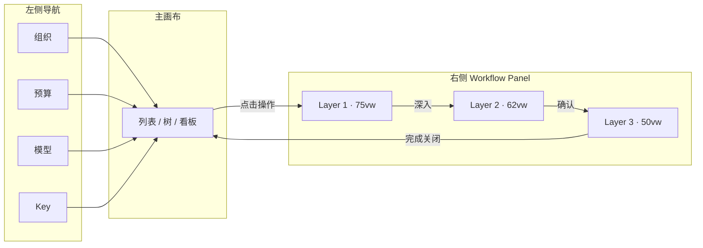

# TokenJoy Demo 交互设计方案

> 角色视角：产品设计师  
> 依据：[TokenJoy-PRD.md](./TokenJoy-PRD.md)、[PRD-vs-Demo差距分析.md](./PRD-vs-Demo差距分析.md)  
> 范围：前端 Demo（P1～P3），不含运营合规与真实后端  
> 核心模式：**列表/看板为主画布 + 右侧 Workflow Panel（可多层嵌套）**  
> 更新日期：2026-06-24（§12～§17 补全）  
> 实施进度见 [§15](#15-实施进度与验收清单)

---

## 1. 设计目标

### 1.1 要解决的问题

当前 Demo 有两类典型问题：

1. **有页面、无流程** — 表格只读，创建/编辑/审批靠跳转或缺失，主线无法走通。
2. **流程碎片化** — 居中 Dialog 承载长表单、每操作一种弹窗样式，上下文断裂；导航项过多，演示路径不清晰。

### 1.2 设计原则

| 原则                     | 说明                                                              |
| ------------------------ | ----------------------------------------------------------------- |
| **主画布稳定**           | 用户始终停留在「当前业务列表/树」，不因操作离开上下文             |
| **Workflow 右出**        | 创建、编辑、审批、配置从右侧拉出 Panel（75/62/50 vw），不打断浏览 |
| **Panel 可嵌套**         | 复杂流程拆成多层 Panel，子层更窄，露出下层边缘示层级              |
| **同一 Workflow 可复用** | 多个入口触发同一 Panel 类型（如「审批详情」）                     |
| **角色可见性分离**       | 左侧导航按角色收敛；Panel 内再做权限禁用                          |
| **Dialog 只做确认**      | 删除、覆盖、未保存关闭等短确认保留 AlertDialog                    |

### 1.3 与 PRD 的对应关系



---

## 2. 核心组件：Workflow Panel

### 2.1 定义

**Workflow Panel**（流程面板）从主内容区**右侧滑入**，承载完整或可嵌套的业务操作，替代现有大部分居中 `Dialog` 大表单。

| 现有                           | 调整策略                               |
| ------------------------------ | -------------------------------------- |
| 左侧 `Sidebar`（导航）         | 保留，收敛菜单项                       |
| 居中 `Dialog` 大表单           | **迁入流程面板 Layer 1**               |
| 居中 `AlertDialog`             | 保留：删除、二次确认、未保存关闭       |
| 独立新路由（如 `/keys/apply`） | **取消**；主画布 + Panel               |
| `window.location.href` 跳转    | 改 `react-router` + Panel / 主画布 Tab |

### 2.2 多层结构与宽度规范

流程面板采用 **栈式多层**（Stack），均**右对齐**，每层独立 Header。子层比父层**更窄**，左侧露出下层边缘，形成嵌套感。

```
┌──────────────────┬────────────────────────────────────────────┐
│                  │▓▓▓▓▓▓▓▓▓▓▓▓▓ Layer 3  50vw ▓▓▓▓▓▓▓▓▓▓▓▓▓▓▓│
│    主画布         │▓▓▓▓▓▓▓▓▓▓▓▓▓▓▓▓ Layer 2  62vw ▓▓▓▓▓▓▓▓▓▓▓▓▓▓▓▓▓▓│
│  （遮罩后可见）    │▓▓▓▓▓▓▓▓▓▓▓▓▓▓▓▓▓▓▓ Layer 1  75vw ▓▓▓▓▓▓▓▓▓▓▓▓▓▓▓▓▓▓▓▓▓│
└──────────────────┴────────────────────────────────────────────┘
```

| 层级        | 宽度     | 定位                   | 典型用途                                                   |
| ----------- | -------- | ---------------------- | ---------------------------------------------------------- |
| **Layer 1** | **75vw** | `right: 0`             | 主流程：凭证配置、创建 Key、预算编辑、审批处理、白名单配置 |
| **Layer 2** | **62vw** | `right: 0`，叠在 L1 上 | 子流程：选人、选模型、导入预览、影响范围、拒绝理由         |
| **Layer 3** | **50vw** | `right: 0`，叠在 L2 上 | 确认、只读详情、一次性展示完整 Key、额度不足说明           |

**宽度实现要点**

- 使用 `vw` 相对视口，不随左侧导航（240px）二次扣减，保证大屏下面板内容区足够宽。
- `max-width` 建议：L1 `1200px`、L2 `960px`、L3 `720px`，避免超宽屏无限拉伸。
- 主画布在 L1 打开后剩余约 **25vw**，仅作上下文预览；列表可横向滚动，**不要求**在 25vw 内可读。
- 小屏（`< 1024px`）：Demo 可仅提示「请使用桌面浏览器」，或 L1 升为 `100vw` 单层模式。

**嵌套规则**

- 最多 3 层；再深改为主画布 Tab 或 L1 内 Stepper。
- `pop` 关闭当前层；关闭 L1 清空整栈。
- Header：**返回**（有上层）/ **标题** / **关闭**。
- 遮罩：仅 L1 出现时 `bg-slate-900/20` dim 主画布；L2/L3 不再加深。
- 栈内每层 `z-index` 递增，左侧露出的下层边缘显示 **1px border + 窄条阴影**。

### 2.3 共享 Workflow 注册表

| Workflow ID                                     | 名称           | 默认层级 | 可嵌套                         |
| ----------------------------------------------- | -------------- | -------- | ------------------------------ |
| `credential-form`                               | 配置凭证       | L1 75vw  | —                              |
| `sync-config`                                   | 同步策略       | L1 75vw  | —                              |
| `member-form`                                   | 添加/编辑成员  | L1 75vw  | —                              |
| `member-invite`                                 | 邀请成员       | L1 75vw  | —                              |
| `member-import`                                 | 批量导入       | L1 → L2  | `import-preview`               |
| `dept-form`                                     | 添加/编辑部门  | L1 75vw  | —                              |
| `budget-node-edit`                              | 编辑节点预算   | L1 75vw  | `budget-impact-preview`        |
| `budget-group-form`                             | 新建预算组     | L1 75vw  | `pick-dept`, `pick-members`    |
| `overrun-policy`                                | 全局超限策略   | L1 75vw  | —                              |
| `model-create`                                  | 添加自定义模型 | L1 75vw  | —                              |
| `whitelist-config`                              | 配置部门白名单 | L1 75vw  | `model-picker`                 |
| `key-create` / `key-edit`                       | 创建/编辑 Key  | L1 75vw  | `model-picker`                 |
| `key-rotate-confirm`                            | 重新生成 Key   | L1 → L2  | `key-reveal`                   |
| `approval-submit`                               | 发起申请       | L1 75vw  | `model-picker`                 |
| `approval-review`                               | 审批处理       | L1 75vw  | `reject-reason`, `quota-check` |
| `role-form`                                     | 创建/编辑角色  | L1 75vw  | `permission-picker`            |
| `role-add-member`                               | 角色添加成员   | L1 75vw  | `member-search`                |
| `provider-key-form`                             | 供应商 Key     | L1 75vw  | —                              |
| `pick-dept` / `pick-members` / `model-picker`   | 通用选择器     | L2 62vw  | —                              |
| `import-preview` / `quota-check` / `key-reveal` | 预览/确认      | L2 或 L3 | L3 用 50vw                     |

### 2.4 面板内标准布局

```
┌──────────────────────────────────────────────────────────────┐
│ ← 返回    标题                                           ✕   │  56px
├──────────────────────────────────────────────────────────────┤
│ 上下文条 · 当前部门「后端组」                                  │
├──────────────────────────────────────────────────────────────┤
│  [ Stepper 可选 ]                                            │
│                                                              │
│  表单 / 双栏布局 / 详情                                        │  flex-1 滚动
│                                                              │
├──────────────────────────────────────────────────────────────┤
│  Banner：校验错误、额度剩余                                    │
├──────────────────────────────────────────────────────────────┤
│                              取消    上一步    主操作          │  64px
└──────────────────────────────────────────────────────────────┘
```

- L1（75vw）表单可采用 **双栏**：左栏字段、右栏只读摘要（额度、父级预算、白名单范围）。
- L2（62vw）选择器：上搜索 + 下可滚动列表，适合选人/选模型。
- L3（50vw）以只读确认、短文案为主，避免再塞大表单。

---

## 3. 现有 Demo 评审与优化清单

> 基于当前代码与页面结构的走查结论；优化项均纳入本方案，按模块列出**现状问题 → 改法 → 面板层级**。

### 3.1 全局壳层（Layout / 导航 / Header）

| #   | 现状问题                                                 | 优化方案                                                                              | 状态 |
| --- | -------------------------------------------------------- | ------------------------------------------------------------------------------------- | ---- |
| G1  | 默认首页 `/dashboard/cost`，偏离 PRD 主线（组织初始化）  | 默认改为 `/org/data-source`；看板类路由降权或移入「更多」                             | ✅   |
| G2  | 左侧 **17 个**菜单项、6 组，演示时找不到主线             | 收敛为 **12 项可见 + 2 项折叠**（共 14 项）；Key 中心合并；「模型路由」改「模型管理」 | ✅   |
| G3  | Header 有标题，部分页面再写 `h2`（如数据源），**双标题** | 页面内去掉重复 `h2`；统一由 Header 展示；主画布顶部改 **工具栏**（筛选 + 主 CTA）     | ✅   |
| G4  | Header 固定「管理员」，无法演示成员/TL 视角              | 增加 **角色切换器**（超管 / TL / 成员），驱动侧栏与行内操作显隐                       | ✅   |
| G5  | 无 Workflow Panel 挂载位                                 | `AdminLayout` 主区域改为 `flex`：主画布 `flex-1` + `<WorkflowPanelStack />`           | ✅   |
| G6  | 无面包屑 / 上下文                                        | 组织架构、预算树选中节点时，Header 副标题展示路径（如 `技术部 / 后端组`）             | ✅   |
| G7  | 页面 `space-y-6` / `space-y-8` 不统一                    | 统一主画布区块间距 `space-y-6`；列表页顶栏 + 表格局部 `space-y-4`                     | ✅   |

**导航收敛方案（改后）**

| 分组             | 菜单                                     | 角色             |
| ---------------- | ---------------------------------------- | ---------------- |
| 组织             | 数据源、组织架构、角色管理               | 管理员           |
| 预算             | 预算总览、预算分配、超限策略             | 管理员/TL        |
| 模型             | 模型列表、模型白名单                     | 管理员/TL        |
| Key 中心         | 我的 Key、审批中心、Key 管理、供应商 Key | 按角色显隐       |
| 数据中心（折叠） | 成本看板、用量分析                       | 超管（演示可选） |
| ~~审计日志~~     | 不在 P1～P3 范围，路由保留、侧栏移除     | —                |

### 3.2 数据源 `/org/data-source`

| #   | 现状问题                                              | 优化方案                                                             | Panel   | 状态 |
| --- | ----------------------------------------------------- | -------------------------------------------------------------------- | ------- | ---- |
| D1  | 四张 Card 纵向堆叠，首屏只看到凭证，**同步/日志沉底** | 主画布：**连接状态 + 导入区 + 同步摘要 + 日志表**；凭证/同步进 Panel | —       | ✅   |
| D2  | `CredentialForm` 嵌在 Card 内，字段多占主画布         | 「配置凭证」按钮 → `credential-form`                                 | L1 75vw | ✅   |
| D3  | `SyncConfigPanel` 整表单调在主画布                    | 摘要卡展示「每 12h · 02:00 起」+「编辑」→ `sync-config`              | L1 75vw | ✅   |
| D4  | 保存同步用 `alert()`                                  | 改 Panel Footer 成功 Toast（sonner）                                 | —       | ✅   |
| D5  | 导入成功用 `window.location.href` 跳组织              | 主画布 Toast + 可选按钮「查看组织架构」`navigate()`                  | —       | ✅   |
| D6  | 未连接时整页仅凭证，**无引导下一步**                  | 空态插画 + 文案「连接后可导入组织」                                  | —       | ✅   |

### 3.3 组织架构 `/org/structure`

| #   | 现状问题                                                                          | 优化方案                                              | Panel      | 状态 |
| --- | --------------------------------------------------------------------------------- | ----------------------------------------------------- | ---------- | ---- |
| O1  | 添加/邀请/转移用居中 Dialog，与后续 Panel 体系不一致                              | 全部迁入 Workflow Panel                               | L1 75vw    | ✅   |
| O2  | Stats「待审批」实际统计的是 `member.status === 'pending'`（**未激活**），语义错误 | 改为「未激活 N 人」；另加「待审批申请 N」链审批中心   | —          | ✅   |
| O3  | 无「待审批 → 去审批」入口                                                         | Stats 条增加链接，打开 `approval-review` 或跳审批中心 | L1 75vw    | ✅   |
| O4  | 部门树操作符 `+ ✎ ✕` 纯文本，可发现性弱                                           | 改 lucide 图标 + Tooltip；删除仍用 AlertDialog        | L1 / Alert | ✅   |
| O5  | 批量操作缺「导入成员」                                                            | 工具栏「导入」→ `member-import` → L2 预览             | L1→L2      | ✅   |
| O6  | 固定 `h-[calc(100vh-120px)]`，Panel 打开后高度未联动                              | 主画布 `min-h-0 flex-1`，树与表各 `overflow-auto`     | —          | ✅   |

### 3.4 角色管理 `/org/roles`

| #   | 现状问题                               | 优化方案                                              | Panel | 状态 |
| --- | -------------------------------------- | ----------------------------------------------------- | ----- | ---- |
| R1  | `RoleForm` Dialog 权限点多，小弹窗局促 | `role-form` + L2 `permission-picker`（62vw 双栏勾选） | L1→L2 | ✅   |
| R2  | `AddMemberDialog` 独立 Dialog          | `role-add-member` + L2 `member-search`                | L1→L2 | ✅   |
| R3  | 左右分栏无选中空态引导                 | 未选角色时右侧 `EmptyState` +「创建角色」CTA          | —     | ✅   |

### 3.5 预算总览 `/budget/overview`

| #   | 现状问题                                                  | 优化方案                                        | Panel   | 状态 |
| --- | --------------------------------------------------------- | ----------------------------------------------- | ------- | ---- |
| B1  | **只读**树表，无行操作                                    | 增加行内「分配」→ `budget-node-edit`            | L1 75vw | ✅   |
| B2  | 展示 `硬拒绝/审批追加/降级路由` 三种策略，**与 PRD 不符** | 移除策略列；脚注链「超限策略」页                | —       | ✅   |
| B3  | 无周期、无 Tenant 总预算摘要                              | 顶栏增加周期标签 + 汇总卡（总预算/已用/未分配） | —       | ✅   |
| B4  | 无预留池、未分配列                                        | 表中增加「预留池」「未分配」列                  | —       | ✅   |

### 3.6 预算分配 `/budget/allocation`

| #   | 现状问题                                           | 优化方案                                  | Panel   | 状态 |
| --- | -------------------------------------------------- | ----------------------------------------- | ------- | ---- |
| BA1 | 仅 Budget Group 列表，与「预算总览」**职责重叠感** | 总览管组织树，本页专注 BG；页头一句话说明 | —       | ✅   |
| BA2 | 新建 BG 用 Dialog，字段少但未选来源部门            | `budget-group-form` L1；L2 选部门/成员    | L1→L2   | ✅   |
| BA3 | 无行内编辑，关联部门/成员仅 Badge 数字             | 行内「管理」打开 L1 编辑态                | L1 75vw | ✅   |

### 3.7 预警规则 `/budget/alerts`

| #   | 现状问题                                       | 优化方案                                   | Panel   | 状态 |
| --- | ---------------------------------------------- | ------------------------------------------ | ------- | ---- |
| AL1 | **按组织节点**的告警表，与 PRD「全局统一」冲突 | 整页改 **摘要卡 + 编辑策略**；废弃节点列表 | —       | ✅   |
| AL2 | 无新增规则入口，`createAlert` 未用             | `overrun-policy` 在 L1 75vw 完整编辑       | L1 75vw | ✅   |
| AL3 | 侧栏名「预警规则」易与用量预警混淆             | 改名为 **「超限策略」**                    | —       | ✅   |

### 3.8 模型列表 `/models/list`

| #   | 现状问题                   | 优化方案                               | Panel   | 状态 |
| --- | -------------------------- | -------------------------------------- | ------- | ---- |
| M1  | 仅启用开关，无「添加模型」 | 工具栏「添加模型」→ `model-create`     | L1 75vw | ✅   |
| M2  | 分组「模型路由」命名技术化 | 导航改 **「模型管理」**：列表 + 白名单 | —       | ✅   |

### 3.9 模型白名单 `/models/routing`

| #   | 现状问题                                      | 优化方案                                        | Panel   | 状态 |
| --- | --------------------------------------------- | ----------------------------------------------- | ------- | ---- |
| MR1 | **只读**表，无配置入口                        | 行内「配置」→ `whitelist-config`                | L1 75vw | ✅   |
| MR2 | 含「默认模型」「降级模型」列，**与 PRD 不符** | 删除两列；仅保留节点、模型列表、继承/自定义     | —       | ✅   |
| MR3 | 侧栏「路由规则」误导                          | 改名为 **「模型白名单」**                       | —       | ✅   |
| MR4 | 模型过多时 Badge 撑开行高                     | 主画布改为「已选 N / 父级 M」+ Panel 内完整列表 | —       | ✅   |

### 3.10 Key 相关页

| #   | 现状问题                                                   | 优化方案                                                      | Panel   | 状态 |
| --- | ---------------------------------------------------------- | ------------------------------------------------------------- | ------- | ---- |
| K1  | **无「我的 Key」**，成员无法演示                           | 新建 `/keys/mine` 主画布 + 额度卡                             | L1 系列 | ✅   |
| K2  | 「平台凭证」命名像 OAuth，实为 Platform Key                | 改名 **「Key 管理」**（全局）                                 | —       | ✅   |
| K3  | `/keys/platform` 只读 + 吊销，无创建                       | 全局视图保留；创建走成员「我的 Key」或管理员「代建 Key」      | —       | ✅   |
| K4  | `/keys/approval` 行内直接通过/拒绝，**无详情、无拒绝理由** | 点行打开 `approval-review` L1；拒绝 → L2 `reject-reason` 50vw | L1→L2   | ✅   |
| K5  | 申请类型未区分 Key / 额度                                  | 列表加类型 Tag；列动态切换                                    | —       | ✅   |
| K6  | `/keys/provider` 新建用 Dialog                             | `provider-key-form` L1 75vw                                   | L1      | ✅   |
| K7  | 审批 Tab 命名「待审批」但无「我的申请」                    | 合审批中心 Tab：待我审批 / 我的申请 / 全部                    | —       | ✅   |

### 3.11 数据看板 / 审计（演示降权）

| #   | 现状问题                            | 优化方案                               | 状态 |
| --- | ----------------------------------- | -------------------------------------- | ---- |
| X1  | 占侧栏 4 项，挤占 P1～P3 演示注意力 | 折叠为「数据中心」一组或 Demo 开关隐藏 | ✅   |
| X2  | 成本看板 5 列 stat 卡在小屏溢出     | 改 `grid-cols-2 lg:grid-cols-5`        | ✅   |
| X3  | 与 Workflow 无关，暂不接 Panel      | 保持主画布只读即可                     | ✅   |

### 3.12 交互与组件一致性

| #   | 现状问题                                         | 优化方案                                       | 状态 |
| --- | ------------------------------------------------ | ---------------------------------------------- | ---- |
| U1  | 列表页有的有页头 CTA、有的没有                   | 统一：**工具栏右对齐主按钮**（创建/导入/配置） | ✅   |
| U2  | 空表无 empty state                               | 每列表增加插图 + 引导 CTA（指向 Panel）        | ✅   |
| U3  | 行内操作风格不一：Button / ghost / dropdown 混用 | 主操作 1 个；次要收 **「⋯」Dropdown**          | ✅   |
| U4  | 成功反馈：`alert` / 无反馈 / 局部刷新 混用       | 统一 **sonner Toast** + 主画布列表刷新         | ✅   |
| U5  | 表格操作列过宽                                   | 操作列 `w-[120px]` 固定，Panel 承载复杂表单    | ✅   |

### 3.13 空态与错误态规范

**列表页空态**（每页统一结构：居中插图 + 标题 + 说明 + 主 CTA）

| 页面           | 空态文案                   | CTA 按钮       | 打开 Workflow       |
| -------------- | -------------------------- | -------------- | ------------------- |
| 数据源         | 尚未连接第三方平台         | 配置凭证       | `credential-form`   |
| 组织架构成员表 | 当前部门暂无成员           | 添加成员       | `member-form`       |
| 角色管理       | 选择左侧角色查看成员       | —              | —                   |
| 预算总览       | 暂无预算数据，请先导入组织 | —              | —                   |
| 预算分配       | 暂无预算组                 | 新建预算组     | `budget-group-form` |
| 模型列表       | 暂无自定义模型             | 添加模型       | `model-create`      |
| 模型白名单     | 暂无部门白名单规则         | —              | —                   |
| 我的 Key       | 你还没有 Platform Key      | 创建 Key       | `key-create`        |
| 审批中心       | 暂无待处理申请             | 发起申请       | `approval-submit`   |
| Key 管理       | 暂无全局 Key               | —              | —                   |
| 供应商 Key     | 暂无上游 Key               | 添加供应商 Key | `provider-key-form` |

**Panel 内 Banner**（位于表单区上方，`bg-amber-50` / `bg-red-50`）

| 场景         | Banner 文案示例                 | 出现位置              |
| ------------ | ------------------------------- | --------------------- |
| 表单校验失败 | 请完善必填项后再提交            | L1 Footer 上方        |
| 额度超出剩余 | 超出可分配额度，当前剩余 ¥{n}   | `budget-node-edit`    |
| 个人额度不足 | 个人剩余额度 ¥{n}，请申请追加   | `key-create` 右栏摘要 |
| 预留池不足   | 预留池剩余 ¥{n}，不足以覆盖申请 | `quota-check` L3      |
| 凭证验证失败 | 凭证验证失败，请检查配置        | `credential-form`     |
| 白名单约束   | 所选模型不在部门白名单内        | `model-picker`        |

**Toast 文案规范**（sonner，统一模式）

| 类型 | 格式示例                             |
| ---- | ------------------------------------ |
| 成功 | `{对象}已{动作}`，如「Key 创建成功」 |
| 失败 | `{动作}失败`，如「保存失败」         |
| 复制 | `Key 已复制到剪贴板`                 |
| 校验 | `请填写拒绝理由`                     |

成功操作后：Toast → `closeAll()` → 主画布 `refresh()` → 目标行 `highlight` 2s。

---

## 4. 信息架构（改后）

### 4.1 左侧导航

> 实现：`src/config/nav.ts` — 共 **14 项**（12 项默认可见 + 2 项折叠在「数据中心」），5 组。审计路由未进侧栏。

| 分组             | 菜单项             | 角色            | 主画布             |
| ---------------- | ------------------ | --------------- | ------------------ |
| 组织             | 数据源             | 超管            | 状态 + 导入 + 日志 |
|                  | 组织架构           | 超管/组织管理员 | 部门树 + 成员表    |
|                  | 角色管理           | 超管/组织管理员 | 角色列表 + 成员表  |
| 预算             | 预算总览           | 超管/TL         | 组织预算树         |
|                  | 预算分配           | 超管/TL         | 预算组列表         |
|                  | 超限策略           | 超管            | 策略摘要卡         |
| 模型             | 模型列表           | 超管            | 模型表             |
|                  | 模型白名单         | 超管/TL         | 部门白名单表       |
| Key 中心         | 我的 Key           | 成员            | 个人 Key + 额度    |
|                  | 审批中心           | TL/成员/管理员  | 申请列表 Tab       |
|                  | Key 管理           | 超管            | 全局 Key 表        |
|                  | 供应商 Key         | 超管            | 上游 Key 表        |
| 数据中心（折叠） | 成本看板、用量分析 | 超管            | 只读图表           |

角色可见性由 `getVisibleNavGroups(role)` 过滤；三角色模拟身份见 `src/config/demo-roles.ts`（超管 `m-admin`、TL `m-2` 李四、成员 `m-1` 张三）。详细行内操作见 [§13](#13-角色权限与操作矩阵)。

### 4.2 主画布 vs 流程面板

| 主画布                     | 流程面板（75/62/50 vw）  |
| -------------------------- | ------------------------ |
| 树、表、摘要卡、日志       | 所有创建/编辑/配置/审批  |
| Tab 筛选                   | 选人、选模型、预览、确认 |
| 图表（若有）               | 一次性 Key 展示          |
| 行内「分配/配置/处理」入口 | 对应 Workflow 内容       |

### 4.3 Dialog 保留场景（不进 Panel）

- 删除成员/部门/角色/Key
- 凭证切换平台、覆盖保存二次确认
- 重新生成 Key 前的破坏性确认（确认后进 Panel `key-reveal`）
- 未保存关闭 Panel 的确认

---

## 5. 分模块 Workflow 触发表

### 5.1 P1 组织

| 页面     | 触发          | Workflow                            | 宽度    |
| -------- | ------------- | ----------------------------------- | ------- |
| 数据源   | 配置凭证      | `credential-form`                   | L1 75vw |
|          | 编辑同步策略  | `sync-config`                       | L1 75vw |
| 组织架构 | 添加/编辑成员 | `member-form`                       | L1 75vw |
|          | 邀请          | `member-invite`                     | L1 75vw |
|          | 导入          | `member-import` → `import-preview`  | L1→L2   |
|          | 添加子部门    | `dept-form`                         | L1 75vw |
|          | 批量转移      | `pick-dept`                         | L2 62vw |
| 角色     | 添加/编辑角色 | `role-form` → `permission-picker`   | L1→L2   |
|          | 添加成员      | `role-add-member` → `member-search` | L1→L2   |

### 5.2 P2 资源

| 页面     | 触发         | Workflow                                     | 宽度    |
| -------- | ------------ | -------------------------------------------- | ------- |
| 预算总览 | 分配         | `budget-node-edit` → `budget-impact-preview` | L1→L2   |
| 预算分配 | 新建/编辑 BG | `budget-group-form` → pick                   | L1→L2   |
| 超限策略 | 编辑策略     | `overrun-policy`                             | L1 75vw |
| 模型列表 | 添加模型     | `model-create`                               | L1 75vw |
| 白名单   | 配置         | `whitelist-config` → `model-picker`          | L1→L2   |

### 5.3 P3 Key

| 页面       | 触发         | Workflow                                            | 宽度     |
| ---------- | ------------ | --------------------------------------------------- | -------- |
| 我的 Key   | 创建/编辑    | `key-create` / `key-edit` → `model-picker`          | L1→L2    |
|            | 重新生成     | `key-rotate-confirm` → `key-reveal`                 | L1→L3    |
|            | 申请额度     | `approval-submit`                                   | L1 75vw  |
| 审批中心   | 发起申请     | `approval-submit`                                   | L1 75vw  |
|            | 处理         | `approval-review` → `reject-reason` / `quota-check` | L1→L2/L3 |
| Key 管理   | 代建（可选） | `key-create` + 成员字段                             | L1 75vw  |
| 供应商 Key | 添加         | `provider-key-form`                                 | L1 75vw  |

---

## 6. 关键用户旅程

### 6.1 管理员配置（P1→P2）

1. **数据源** · 主画布（连接状态 + 导入区）→ L1 `credential-form` 配凭证 → 主画布全量导入
2. **预算总览** · 行内「分配」→ L1 `budget-node-edit` → L2 `budget-impact-preview` 62vw → 保存 `closeAll`
3. **模型白名单** · 行内「配置」→ L1 `whitelist-config`（继承 Switch）→ L2 `model-picker` 62vw → 保存

### 6.2 成员闭环（P3）

1. **我的 Key** · 「创建 Key」→ L1 `key-create` 75vw（Stepper 1 名称/额度 → Stepper 2 选模型）→ L2 `model-picker` 62vw → 创建后 L3 `key-reveal` 50vw 复制
2. **额度追加** · 我的 Key「申请额度」→ L1 `approval-submit` → 切 TL → 审批中心点行 → L1 `approval-review` → 预留池不足时 L3 `quota-check` 50vw

### 6.3 跨页共享 Workflow

| 场景     | 入口 A         | 入口 B   | Workflow             |
| -------- | -------------- | -------- | -------------------- |
| 审批     | 组织架构 Stats | 审批中心 | `approval-review`    |
| 选模型   | 创建 Key       | Key 申请 | `model-picker` L2    |
| 选部门   | 批量转移       | 新建 BG  | `pick-dept` L2       |
| 额度申请 | 我的 Key CTA   | 审批中心 | `approval-submit` L1 |

---

## 7. 流程面板状态与反馈

| 行为    | 规则                                                   |
| ------- | ------------------------------------------------------ |
| 打开    | 右侧 `translateX(100%)→0`，280ms ease-out              |
| 宽度    | L1 `75vw` / L2 `62vw` / L3 `50vw`，含 `max-width` 上限 |
| 关闭 L1 | 清空栈；有脏数据 → AlertDialog                         |
| 成功    | Toast + 关闭 Panel + 主画布行高亮刷新 2s               |
| Esc     | 关闭最顶层                                             |
| 主画布  | L1 打开时遮罩；列表选中态保留                          |

---

## 8. 视觉规范（流程面板）

| 元素        | 规范                                                 |
| ----------- | ---------------------------------------------------- |
| 面板背景    | `#FFFFFF`，左缘 `border-l`                           |
| 层叠露边    | 下层露出的左侧条带 `12px`，`bg-slate-50`，暗示可返回 |
| 遮罩        | `bg-slate-900/20`，仅 L1                             |
| 阴影        | L1 `shadow-sidebar`；L2/L3 递增                      |
| Header      | 56px；标题 `text-base font-semibold`                 |
| 75vw 双栏   | 左 `3/5` 表单，右 `2/5` `bg-slate-50/50` 摘要        |
| 62vw 选择器 | 顶栏搜索 + 全宽列表                                  |
| 50vw 确认   | 居中图标 + 短文案 + 1～2 操作                        |
| 主按钮      | indigo→violet 渐变（与 DESIGN.md 一致）              |

左侧导航深色、流程面板白色，避免双侧深色压迫。Panel 内不再使用 Card 套 Card，减少边距浪费（75vw 应用于内容而非 padding）。

---

## 9. 实施分期

> 详细进度追踪与验收勾选见 [§15](#15-实施进度与验收清单)。

| Phase | 目标                     | 验收要点                                                                   |
| ----- | ------------------------ | -------------------------------------------------------------------------- |
| **A** | Panel 基建 + P3 Key 闭环 | 成员建 Key → 申请额度 → TL Panel 审批，无跳转                              |
| **B** | P2 预算/模型可编辑       | 白名单约束创建 Key 的模型列表                                              |
| **C** | P1 打磨 + 体验一致性     | 角色 Panel、批量导入 L2、空态/Toast 统一；详见 [§17](#17-phase-c-落地规格) |

---

## 10. 明确不做

| 项                     | 原因                |
| ---------------------- | ------------------- |
| 每 Workflow 独立路由   | 破坏主画布稳定      |
| 居中 Dialog 承载长表单 | 迁 75vw Panel       |
| 第 4 层 Panel          | 改 L1 Tab / Stepper |
| 运营合规               | 范围外              |
| 移动端多层 Panel       | Demo 仅桌面         |

---

## 11. 附录

### 11.1 Workflow 与 US 对照

| Workflow                            | US        | 入口     |
| ----------------------------------- | --------- | -------- |
| `credential-form` / `sync-config`   | US-01～03 | 数据源   |
| `member-*` / `dept-form`            | US-04     | 组织架构 |
| `role-form`                         | US-05     | 角色管理 |
| `budget-*`                          | US-07     | 预算     |
| `overrun-policy`                    | US-08     | 超限策略 |
| `model-create` / `whitelist-config` | US-09     | 模型     |
| `approval-*`                        | US-10     | 审批中心 |
| `key-*`                             | US-11     | 我的 Key |

### 11.2 现有 Demo 文件 → 改造指向

| 文件                                        | 改造                                                 | 状态 |
| ------------------------------------------- | ---------------------------------------------------- | ---- |
| `src/components/layout/admin-layout.tsx`    | Panel 槽位 + `WorkflowProvider` + `DemoRoleProvider` | ✅   |
| `src/components/layout/header.tsx`          | 角色切换器                                           | ✅   |
| `src/components/layout/sidebar.tsx`         | `nav.ts` 角色过滤                                    | ✅   |
| `src/config/nav.ts`                         | 导航收敛 14 项                                       | ✅   |
| `src/config/demo-roles.ts`                  | 三角色模拟身份                                       | ✅   |
| `src/features/workflow/*`                   | Panel 栈、注册表、Phase B Workflow 组件              | ✅   |
| `src/routes/keys/mine.tsx`                  | 新建「我的 Key」+ Workflow 接入                      | ✅   |
| `src/routes/keys/approval.tsx`              | 行点击 → Panel；Tab 拆分                             | ✅   |
| `src/routes/keys/provider.tsx`              | Dialog → `provider-key-form` Panel                   | ✅   |
| `src/routes/org/structure.tsx`              | 成员/导入/转移 Panel + Header 副标题                 | ✅   |
| `src/routes/org/data-source.tsx`            | 摘要化 + Panel                                       | ✅   |
| `src/routes/org/roles.tsx`                  | Dialog → `role-form` / `role-add-member` Panel       | ✅   |
| `src/components/org/department-tree.tsx`    | `dept-form` Panel + lucide 图标                      | ✅   |
| `src/routes/budget/overview.tsx`            | 行操作 + 去策略列                                    | ✅   |
| `src/routes/budget/allocation.tsx`          | Workflow 预算组                                      | ✅   |
| `src/routes/budget/alerts.tsx`              | 整页重做超限策略                                     | ✅   |
| `src/routes/models/list.tsx`                | 添加模型 Panel                                       | ✅   |
| `src/routes/models/routing.tsx`             | 删列 + 配置 Panel                                    | ✅   |
| `src/components/org/credential-form.tsx` 等 | 嵌入 Panel body                                      | ✅   |

---

## 12. 各 Workflow 交互规格

> 规格卡模板：**层级** · **布局** · **字段** · **校验** · **嵌套** · **反馈** · **状态**  
> 实现文件：`src/features/workflow/workflows/*.tsx`

### 12.1 P1 组织

#### `credential-form` — 配置凭证

| 项   | 规格                                                                           |
| ---- | ------------------------------------------------------------------------------ |
| 层级 | L1 75vw                                                                        |
| 布局 | 单栏表单 + 右栏连接状态摘要                                                    |
| 字段 | 平台 Select（飞书/钉钉/企微）；按平台动态字段（App ID、App Secret、CorpID 等） |
| 校验 | 必填；「测试连接」成功前保存禁用                                               |
| 嵌套 | —                                                                              |
| 反馈 | 成功 Toast「凭证已保存」→ `closeAll`；失败 Banner「凭证验证失败」              |
| 状态 | ✅ 已实现                                                                      |

#### `sync-config` — 同步策略

| 项   | 规格                                                                                                                                                  |
| ---- | ----------------------------------------------------------------------------------------------------------------------------------------------------- |
| 层级 | L1 75vw                                                                                                                                               |
| 布局 | 单栏表单                                                                                                                                              |
| 字段 | 同步频率（6/12/24h，默认 12）；每日开始时间（默认 02:00）；成员删除保护阈值（默认 10）；部门删除保护阈值（默认 5）；通知方式 Checkbox（手机/邮箱/IM） |
| 校验 | 阈值为正整数                                                                                                                                          |
| 嵌套 | —                                                                                                                                                     |
| 反馈 | 成功 Toast「同步策略已保存」→ `closeAll`                                                                                                              |
| 状态 | ✅ 已实现                                                                                                                                             |

#### `member-form` — 添加/编辑成员

| 项      | 规格                                                  |
| ------- | ----------------------------------------------------- |
| 层级    | L1 75vw                                               |
| 布局    | 单栏 `max-w-md`                                       |
| 字段    | 姓名*、手机号*、邮箱*、部门 Select*（树形缩进）       |
| 校验    | react-hook-form 必填；编辑态预填 `payload.member`     |
| payload | `member?`、`departments`、`defaultDeptId`、`onSubmit` |
| 嵌套    | —                                                     |
| 反馈    | 成功 Toast「成员已添加/已更新」→ `closeAll`           |
| 状态    | ✅ 已实现                                             |

#### `member-invite` — 邀请成员

| 项      | 规格                                 |
| ------- | ------------------------------------ |
| 层级    | L1 75vw                              |
| 布局    | 单栏                                 |
| 字段    | 手机号或邮箱 Input\*                 |
| 校验    | 非空                                 |
| payload | `onSubmit(value)`                    |
| 反馈    | 成功 Toast「邀请已发送」→ `closeAll` |
| 状态    | ✅ 已实现                            |

#### `member-import` — 批量导入

| 项   | 规格                                          |
| ---- | --------------------------------------------- |
| 层级 | L1 → L2                                       |
| 布局 | L1：文件上传区；L2：预览表                    |
| 字段 | CSV 文件上传；L2 展示姓名/手机/部门/状态列    |
| 校验 | 文件格式；重复行标红                          |
| 嵌套 | 上传解析后 `push('import-preview', { rows })` |
| 反馈 | 成功 Toast + 主画布成员表刷新                 |
| 状态 | ✅ 已实现                                     |

#### `dept-form` — 添加/编辑部门

| 项      | 规格                                                 |
| ------- | ---------------------------------------------------- |
| 层级    | L1 75vw                                              |
| 布局    | 单栏                                                 |
| 字段    | 部门名称\*；父部门（只读 contextBar）                |
| 校验    | 名称非空                                             |
| payload | `parentId`、`parentName`、`department?`、`onSuccess` |
| 反馈    | 成功 Toast → `closeAll` → 树刷新                     |
| 状态    | ✅ 已实现                                            |

#### `role-form` — 创建/编辑角色

| 项   | 规格                                                               |
| ---- | ------------------------------------------------------------------ |
| 层级 | L1 → L2                                                            |
| 布局 | L1：名称 +「配置权限」；L2：按 group 分组 Checkbox                 |
| 字段 | 角色名称\*；L2 `permission-picker`                                 |
| 嵌套 | 「配置权限」→ `push('permission-picker', { selected, onConfirm })` |
| 反馈 | 成功 Toast → `closeAll`                                            |
| 状态 | ✅ 已实现                                                          |

#### `role-add-member` — 角色添加成员

| 项   | 规格                                                        |
| ---- | ----------------------------------------------------------- |
| 层级 | L1 → L2                                                     |
| 布局 | L1：已选成员 Badge 列表；L2：搜索 + 多选                    |
| 嵌套 | 「搜索并添加成员」→ `push('member-search', { excludeIds })` |
| 反馈 | 成功 Toast → `closeAll`                                     |
| 状态 | ✅ 已实现                                                   |

#### `pick-dept` — 选择部门

| 项      | 规格                    |
| ------- | ----------------------- |
| 层级    | L2 62vw                 |
| 布局    | 顶栏搜索 + 树形单选列表 |
| 字段    | 部门树可展开；搜索过滤  |
| payload | `onConfirm(deptId)`     |
| 反馈    | 确认后 `pop()` 回传选中 |
| 状态    | ✅ 已实现（简版）       |

#### `pick-members` — 选择成员

| 项      | 规格                                        |
| ------- | ------------------------------------------- |
| 层级    | L2 62vw                                     |
| 布局    | 顶栏搜索 + 多选列表                         |
| payload | `selectedIds`、`onConfirm(ids)`             |
| 反馈    | 确认后 `pop()`                              |
| 状态    | ⬜ 占位（预算组已内嵌 Select，Demo 可延后） |

#### `import-preview` — 导入预览

| 项   | 规格                                    |
| ---- | --------------------------------------- |
| 层级 | L2 62vw                                 |
| 布局 | 全宽可滚动表 + contextBar 统计          |
| 操作 | 确认导入 `memberApi.batchImport` / 取消 |
| 状态 | ✅ 已实现                               |

#### `permission-picker` — 选择权限

| 项      | 规格                                   |
| ------- | -------------------------------------- |
| 层级    | L2 62vw                                |
| 布局    | 按 `group` 分组 Checkbox 列表          |
| payload | `permissions`、`selected`、`onConfirm` |
| 状态    | ✅ 已实现                              |

#### `member-search` — 搜索成员

| 项      | 规格                                        |
| ------- | ------------------------------------------- |
| 层级    | L2 62vw                                     |
| 布局    | 搜索 Input + 多选成员列表                   |
| payload | `excludeIds`、`multi`、`onConfirm(members)` |
| 状态    | ✅ 已实现                                   |

### 12.2 P2 资源

#### `budget-node-edit` — 编辑节点预算

| 项      | 规格                                                                        |
| ------- | --------------------------------------------------------------------------- |
| 层级    | L1 → L2                                                                     |
| 布局    | L1 双栏：左表单、右父节点/兄弟摘要                                          |
| 字段    | 节点名称（只读）；月度预算\*（¥）；预留池（¥）；成员平均额度/人（叶子节点） |
| 校验    | 子节点 budget 之和 + reservedPool ≤ 父节点；超出 Banner 阻断                |
| 嵌套    | 保存前「预览影响」→ `push('budget-impact-preview', { changes })`            |
| payload | `nodeId`、`onSuccess`                                                       |
| 状态    | ✅ 已实现                                                                   |

#### `budget-impact-preview` — 影响范围预览

| 项   | 规格                                            |
| ---- | ----------------------------------------------- |
| 层级 | L2 62vw                                         |
| 布局 | 变更对比表（节点 / 原值 / 新值 / 影响子节点数） |
| 操作 | 确认保存 / 返回修改 `pop()`                     |
| 状态 | ✅ 已实现                                       |

#### `budget-group-form` — 新建/编辑预算组

| 项   | 规格                                                                    |
| ---- | ----------------------------------------------------------------------- |
| 层级 | L1 → L2                                                                 |
| 布局 | L1 双栏                                                                 |
| 字段 | 组名称*；预算额度*；来源部门（`pick-dept`）；关联成员（`pick-members`） |
| 校验 | 创建前校验来源部门剩余可分配额度                                        |
| 嵌套 | 选部门/成员分别 `push` 对应选择器                                       |
| 状态 | ✅ 已实现                                                               |

#### `overrun-policy` — 全局超限策略

| 项   | 规格                                                                                                           |
| ---- | -------------------------------------------------------------------------------------------------------------- |
| 层级 | L1 75vw                                                                                                        |
| 布局 | 单栏表单                                                                                                       |
| 字段 | 预警阈值列表（可增删，如 80%/90%）；通知渠道 Checkbox（邮箱/手机/IM）；超限阻断文案 Textarea（自定义错误提示） |
| 校验 | 阈值 1～100 整数；至少一个通知渠道                                                                             |
| 反馈 | 成功 Toast「策略已保存」→ `closeAll`                                                                           |
| 状态 | ✅ 已实现                                                                                                      |

#### `model-create` — 添加自定义模型

| 项   | 规格                                                                              |
| ---- | --------------------------------------------------------------------------------- |
| 层级 | L1 75vw                                                                           |
| 布局 | 单栏                                                                              |
| 字段 | 模型名称*；Base URL*；API Key\*；输入价格（¥/1M tokens）；输出价格（¥/1M tokens） |
| 校验 | URL 格式；价格为正数                                                              |
| 反馈 | 成功 Toast → `closeAll` → 模型列表刷新                                            |
| 状态 | ✅ 已实现                                                                         |

#### `whitelist-config` — 配置部门白名单

| 项      | 规格                                                                   |
| ------- | ---------------------------------------------------------------------- |
| 层级    | L1 → L2                                                                |
| 布局    | L1 双栏：左继承 Switch + 已选摘要；右父级白名单参考                    |
| 字段    | 继承父级 Switch（开=继承，关=自定义）；自定义时「选择模型」按钮        |
| 校验    | 自定义模式至少选 1 个；所选须在父级白名单内                            |
| 嵌套    | `push('model-picker', { parentWhitelist, selectedModels, onConfirm })` |
| payload | `deptId`、`rule`、`onSuccess`                                          |
| 状态    | ✅ 已实现                                                              |

#### `model-picker` — 选择模型

| 项      | 规格                                               |
| ------- | -------------------------------------------------- |
| 层级    | L2 62vw                                            |
| 布局    | 顶栏搜索 + Checkbox 多选列表（displayName + name） |
| 字段    | 仅展示 `enabled` 模型；搜索过滤 displayName/name   |
| payload | `selectedModels`、`onConfirm(models)`              |
| 操作    | 确认 `onConfirm` + `pop()`；取消 `pop()`           |
| 校验    | 至少选 1 个                                        |
| 状态    | ✅ 已实现（含 `parentWhitelist` 部门约束）         |

### 12.3 P3 Key

#### `key-create` — 创建 Key

| 项      | 规格                                                                                   |
| ------- | -------------------------------------------------------------------------------------- |
| 层级    | L1 → L2 → L3                                                                           |
| 布局    | L1 双栏（左 3/5 Stepper 表单，右 2/5 摘要）                                            |
| Stepper | 步骤 1：Key 名称\*、额度 (¥，默认 5000)；步骤 2：模型白名单（按钮打开 `model-picker`） |
| 校验    | 步骤 1 名称非空；步骤 2 至少 1 个模型                                                  |
| 嵌套    | 选模型 → L2 `model-picker`；创建成功 → L3 `key-reveal`                                 |
| payload | `onSuccess`（主画布 refresh + flashRow）                                               |
| 反馈    | Toast「Key 创建成功」→ `key-reveal` 展示完整 Key                                       |
| 状态    | ✅ 已实现                                                                              |

#### `key-edit` — 编辑 Key

| 项      | 规格                                                 |
| ------- | ---------------------------------------------------- |
| 层级    | L1 → L2                                              |
| 布局    | L1 双栏：左表单、右当前 Key 摘要（prefix、已用额度） |
| 字段    | Key 名称*、额度*、模型白名单（`model-picker`）       |
| payload | `key`、`onSuccess`                                   |
| 反馈    | Toast「Key 已更新」→ `closeAll`                      |
| 状态    | ✅ 已实现                                            |

#### `key-rotate-confirm` — 重新生成 Key

| 项   | 规格                                   |
| ---- | -------------------------------------- |
| 层级 | L2 → L3                                |
| 布局 | 破坏性确认文案 + 警告图标              |
| 操作 | 确认 → `push('key-reveal')` 展示新 Key |
| 状态 | ✅ 已实现（`mine.tsx` 入口）           |

#### `key-reveal` — Key 已生成

| 项   | 规格                                                        |
| ---- | ----------------------------------------------------------- |
| 层级 | L3 50vw                                                     |
| 布局 | 居中图标 + 警告文案 + monospace Key + 复制按钮              |
| 字段 | `fullKey`（仅展示一次）                                     |
| 操作 | 复制 → Toast「Key 已复制」；「完成」→ `closeAll` + `onDone` |
| 状态 | ✅ 已实现                                                   |

#### `approval-submit` — 发起申请

| 项      | 规格                                                                                                    |
| ------- | ------------------------------------------------------------------------------------------------------- |
| 层级    | L1 → L2                                                                                                 |
| 布局    | 单栏 `max-w-lg`                                                                                         |
| 字段    | 申请类型 Select（Key 申请 / 额度追加）；申请理由 Textarea\*；申请额度 Input；申请模型（`model-picker`） |
| payload | `defaultType`（`quota`/`key`）、`onSuccess`                                                             |
| 校验    | 理由必填                                                                                                |
| 反馈    | Toast「申请已提交」→ `closeAll`                                                                         |
| 状态    | ✅ 已实现                                                                                               |

#### `approval-review` — 审批处理

| 项      | 规格                                                                         |
| ------- | ---------------------------------------------------------------------------- |
| 层级    | L1 → L2/L3                                                                   |
| 布局    | L1 双栏：左详情、右申请信息摘要；contextBar 显示申请人/部门                  |
| 字段    | 只读：类型 Tag、状态 Tag、理由、额度、模型列表、拒绝理由（若有）             |
| 操作    | 待审批：拒绝 → L2 `reject-reason`；通过 → 预留池校验 → 可能 L3 `quota-check` |
| payload | `approval`、`onSuccess`                                                      |
| 反馈    | 通过 Toast「已通过」→ `closeAll`                                             |
| 状态    | ✅ 已实现                                                                    |

#### `reject-reason` — 拒绝理由

| 项      | 规格                        |
| ------- | --------------------------- |
| 层级    | L2 62vw                     |
| 布局    | 单栏 Textarea               |
| 字段    | 拒绝理由\*（必填）          |
| payload | `approvalId`、`onSuccess`   |
| 反馈    | Toast「已拒绝」→ `closeAll` |
| 状态    | ✅ 已实现                   |

#### `quota-check` — 额度不足

| 项      | 规格                         |
| ------- | ---------------------------- |
| 层级    | L3 50vw                      |
| 布局    | 居中警告图标 + 短文案        |
| 字段    | 只读：申请额度、预留池剩余   |
| 操作    | 「知道了」→ `pop()` 回审批层 |
| payload | `reservedPool`、`requested`  |
| 状态    | ✅ 已实现                    |

#### `provider-key-form` — 添加供应商 Key

| 项      | 规格                                                                                |
| ------- | ----------------------------------------------------------------------------------- |
| 层级    | L1 75vw                                                                             |
| 布局    | 单栏 `max-w-md`                                                                     |
| 字段    | 供应商 Select（OpenAI/Anthropic/DeepSeek/通义/自定义）；名称*；API Key*（password） |
| 校验    | 名称、Key 非空                                                                      |
| payload | `onSuccess`                                                                         |
| 反馈    | Toast「供应商 Key 已添加」→ `closeAll`                                              |
| 状态    | ✅ 已实现                                                                           |

---

## 13. 角色权限与操作矩阵

### 13.1 三角色定义

| 角色     | 标签 | 模拟成员  | 显示名 | 用途              |
| -------- | ---- | --------- | ------ | ----------------- |
| `admin`  | 超管 | `m-admin` | 管理员 | 全功能演示        |
| `tl`     | TL   | `m-2`     | 李四   | 预算/审批视角     |
| `member` | 成员 | `m-1`     | 张三   | 成员自助 Key/申请 |

切换方式：Header `Select` → `useDemoRole()` 驱动侧栏过滤与 API `memberId`。

### 13.2 侧栏可见性

| 菜单             | admin | tl  | member |
| ---------------- | ----- | --- | ------ |
| 数据源           | ✅    | —   | —      |
| 组织架构         | ✅    | —   | —      |
| 角色管理         | ✅    | —   | —      |
| 预算总览         | ✅    | ✅  | —      |
| 预算分配         | ✅    | ✅  | —      |
| 超限策略         | ✅    | —   | —      |
| 模型列表         | ✅    | ✅  | —      |
| 模型白名单       | ✅    | ✅  | —      |
| 我的 Key         | ✅    | ✅  | ✅     |
| 审批中心         | ✅    | ✅  | ✅     |
| Key 管理         | ✅    | —   | —      |
| 供应商 Key       | ✅    | —   | —      |
| 成本看板（折叠） | ✅    | —   | —      |
| 用量分析（折叠） | ✅    | —   | —      |

### 13.3 页面行内操作

| 页面       | 操作                           | admin | tl   | member |
| ---------- | ------------------------------ | ----- | ---- | ------ |
| 数据源     | 配置凭证、编辑同步、全量导入   | ✅    | —    | —      |
| 组织架构   | 添加/编辑/邀请成员、导入、转移 | ✅    | —    | —      |
| 组织架构   | Stats「去审批」链接            | ✅    | ✅   | —      |
| 角色管理   | 创建/编辑角色、添加成员        | ✅    | —    | —      |
| 预算总览   | 行内「分配」                   | ✅    | ✅   | —      |
| 预算分配   | 新建/编辑 BG                   | ✅    | ✅   | —      |
| 超限策略   | 编辑策略                       | ✅    | —    | —      |
| 模型列表   | 添加模型、启用开关             | ✅    | 只读 | —      |
| 模型白名单 | 行内「配置」                   | ✅    | ✅   | —      |
| 我的 Key   | 创建/编辑/禁用/重新生成/删除   | ✅    | ✅   | ✅     |
| 我的 Key   | 申请额度                       | —     | —    | ✅     |
| 审批中心   | Tab「待我审批」处理            | ✅    | ✅   | —      |
| 审批中心   | Tab「我的申请」查看            | ✅    | ✅   | ✅     |
| 审批中心   | 发起申请                       | ✅    | ✅   | ✅     |
| Key 管理   | 查看/吊销全局 Key              | ✅    | —    | —      |
| Key 管理   | 代建 Key（可选）               | ✅    | —    | —      |
| 供应商 Key | 添加/删除                      | ✅    | —    | —      |

### 13.4 Panel 内权限

- 无权限字段：`disabled` + Tooltip「当前角色无此权限」
- 只读详情（如已审批申请）：Footer 仅「关闭」
- 角色管理权限点：TL 不可编辑系统内置角色

---

## 14. 演示脚本（Demo Script）

### 14.1 管理员初始化（约 8～10 分钟）

**角色**：全程 `admin`（超管）  
**Mock 前提**：初始无凭证连接

| 步骤 | 页面               | 操作                | Panel 层级               | 预期结果                     |
| ---- | ------------------ | ------------------- | ------------------------ | ---------------------------- |
| 1    | `/org/data-source` | 点「配置凭证」      | L1 `credential-form`     | 选飞书，填凭证，测试连接成功 |
| 2    | 数据源             | 点「执行全量导入」  | —（主画布）              | Toast 成功 X 人/Y 部门       |
| 3    | `/org/structure`   | 浏览部门树 + 成员表 | —                        | 导入数据可见                 |
| 4    | `/budget/overview` | 技术部行「分配」    | L1→L2 `budget-node-edit` | 分配子节点 + 预留池          |
| 5    | `/models/list`     | 「添加模型」        | L1 `model-create`        | 自定义模型出现在列表         |
| 6    | `/models/routing`  | 技术部行「配置」    | L1→L2 `whitelist-config` | 自定义勾选 4/6 模型          |
| 7    | `/budget/alerts`   | 「编辑策略」        | L1 `overrun-policy`      | 阈值 80/90 保存成功          |

### 14.2 成员闭环（约 5 分钟）

**Mock 前提**：预算与白名单已配置；成员 `m-1`（张三）有剩余个人额度

| 步骤 | 角色   | 页面            | 操作                          | Panel 层级           | 预期结果            |
| ---- | ------ | --------------- | ----------------------------- | -------------------- | ------------------- |
| 1    | member | `/keys/mine`    | 「创建 Key」                  | L1 `key-create`      | Stepper 填名称/额度 |
| 2    | member | 创建 Key        | 「选择模型」                  | L2 `model-picker`    | 勾选白名单内模型    |
| 3    | member | 创建 Key        | 「创建 Key」                  | L3 `key-reveal`      | 复制完整 Key        |
| 4    | member | `/keys/mine`    | 「申请额度」                  | L1 `approval-submit` | 填理由提交          |
| 5    | tl     | Header 切「TL」 | `/keys/approval` Tab 待我审批 | —                    | 看到张三申请        |
| 6    | tl     | 审批中心        | 点行                          | L1 `approval-review` | 查看详情            |
| 7a   | tl     | 审批            | 点「通过」（额度充足）        | —                    | Toast 已通过        |
| 7b   | tl     | 审批            | 点「通过」（预留池不足）      | L3 `quota-check`     | 拦截并提示剩余额度  |

### 14.3 跨页共享 Workflow（约 2 分钟）

| 场景     | 路径 A                   | 路径 B               | 共享 Workflow        | 验证点                    |
| -------- | ------------------------ | -------------------- | -------------------- | ------------------------- |
| 审批详情 | 组织架构 Stats「去审批」 | 审批中心点行         | `approval-review` L1 | 同一 Panel 组件、同一布局 |
| 选模型   | 我的 Key 创建 Step 2     | 发起 Key 申请        | `model-picker` L2    | 同一搜索/多选交互         |
| 选部门   | 组织架构批量转移         | 新建预算组           | `pick-dept` L2       | 同一树形选择器            |
| 发起申请 | 我的 Key「申请额度」     | 审批中心「发起申请」 | `approval-submit` L1 | `defaultType` 可预选      |

---

## 15. 实施进度与验收清单

### 15.1 Phase A — Panel 基建 + P3

| #   | 任务                                  | 状态 | 说明                                      |
| --- | ------------------------------------- | ---- | ----------------------------------------- |
| A1  | Panel 栈 75/62/50 vw + 常量           | ✅   | `constants.ts`                            |
| A2  | Zustand store + Provider + DI         | ✅   | `workflow-store.ts`、`WorkflowProvider`   |
| A3  | 28 个 Workflow 注册表                 | ✅   | `workflow-definitions.tsx`（28 项全注册） |
| A4  | AdminLayout 挂载 `WorkflowPanelStack` | ✅   | `admin-layout.tsx`                        |
| A5  | Header 角色切换器                     | ✅   | `header.tsx` + `demo-roles.ts`            |
| A6  | 导航收敛 14 项                        | ✅   | `nav.ts`                                  |
| A7  | 我的 Key 页 `/keys/mine`              | ✅   | 额度卡 + Key 表                           |
| A8  | 审批中心增强（Tab + Panel）           | ✅   | `approval.tsx`                            |
| A9  | 成员 form/invite → Panel              | ✅   | `structure.tsx`                           |
| A10 | 供应商 Key → Panel                    | ✅   | `provider.tsx`                            |
| A11 | Phase C Workflow 组件实现             | ✅   | 含 `pick-members` L2                      |
| A12 | `key-rotate-confirm` 流程对齐         | ✅   | L2 确认 → L3 `key-reveal`                 |

**Phase A 验收**：

- [x] 成员创建 Key → L2 选模型 → L3 复制，无路由跳转
- [x] 发起额度申请 → TL 审批中心 Panel 处理
- [x] 拒绝填理由 L2 `reject-reason`
- [x] 预留池不足 L3 `quota-check` 拦截
- [x] 角色切换后侧栏与 `memberId` 数据联动
- [x] 关闭 L1 有脏数据弹出 AlertDialog（表单类 Workflow 已调用 `onSetDirty`；只读/确认类除外）
- [x] `key-rotate-confirm` 走 L2→L3 栈

### 15.2 Phase B — P2 可编辑

| #   | 任务                                             | 状态 |
| --- | ------------------------------------------------ | ---- |
| B1  | 预算总览行操作 + `budget-node-edit`              | ✅   |
| B2  | 预算组 `budget-group-form`                       | ✅   |
| B3  | 超限策略页重做 + `overrun-policy`                | ✅   |
| B4  | 模型添加 `model-create`                          | ✅   |
| B5  | 白名单配置 `whitelist-config`                    | ✅   |
| B6  | 数据源摘要化 + `credential-form` / `sync-config` | ✅   |
| B7  | `model-picker` 读取部门白名单约束                | ✅   |

**Phase B 验收**：

- [x] 预算分配后预留池数值正确
- [x] 白名单配置后，创建 Key 的模型列表受部门约束
- [x] 超限策略保存后总览无策略列

### 15.3 Phase C — P1 打磨

| #   | 任务                                   | 状态 |
| --- | -------------------------------------- | ---- |
| C1  | 角色 `role-form` + `permission-picker` | ✅   |
| C2  | 组织批量导入 L1→L2                     | ✅   |
| C3  | 部门 `dept-form`、转移 `pick-dept`     | ✅   |
| C4  | Stats 语义修正（未激活 vs 待审批）     | ✅   |
| C5  | 各页 empty state（§3.13）              | ✅   |
| C6  | Toast / 间距 / `key-rotate-confirm`    | ✅   |
| C7  | Header 上下文路径 G6                   | ✅   |
| C8  | 看板/审计降权确认                      | ✅   |

**Phase C 验收**：

- [x] 角色创建/编辑走 L1→L2 `permission-picker`
- [x] 组织架构「导入」CSV → L2 预览 → 成员表刷新
- [x] 部门树添加走 `dept-form`；批量转移走 `pick-dept`
- [x] 列表空态有 CTA 打开对应 Panel
- [x] Header 在组织架构页显示部门路径
- [x] 重新生成 Key 走 `key-rotate-confirm` → `key-reveal`

---

## 16. 技术实现附录

### 16.1 目录结构

```
src/features/workflow/
├── constants.ts              # 宽度、动画、最大深度
├── types.ts                  # WorkflowId、WorkflowComponentProps
├── workflow-store.ts         # Zustand vanilla store
├── workflow-store-context.ts # DI context
├── workflow-context.tsx      # WorkflowProvider
├── use-workflow.ts           # hook
├── workflow-definitions.tsx  # 注册表 + getWorkflowDefinition
├── components/
│   ├── workflow-panel-stack.tsx   # 栈渲染、遮罩、Esc、未保存确认
│   ├── workflow-panel-layer.tsx   # 单层滑入 + peek 边缘
│   ├── workflow-panel-chrome.tsx  # Header + Footer 标准壳
│   └── workflow-unsaved-dialog.tsx
└── workflows/                # 各 Workflow 组件

src/features/layout/          # Phase C：PageContext（DI）
├── page-context-store.ts
├── page-context-provider.tsx
└── use-page-context.ts

src/components/ui/empty-state.tsx  # Phase C：统一空态

src/lib/
├── org.ts                  # flattenDepartments、getDeptPath 等组织树工具
├── labels.ts               # PROVIDER_LABELS / 样式常量
└── label-badges.tsx        # ProviderBadge、KeyStatusBadge 等
```

### 16.2 Store API

| 方法       | 签名                     | 行为                               |
| ---------- | ------------------------ | ---------------------------------- |
| `open`     | `(id, payload?, title?)` | 清空栈，压入 L1                    |
| `push`     | `(id, payload?, title?)` | 压入子层（最多 3 层）              |
| `pop`      | `()`                     | 弹出顶层                           |
| `closeAll` | `()`                     | 清空栈                             |
| `setDirty` | `(boolean)`              | 标记未保存，关闭时触发 AlertDialog |

### 16.3 组件契约 `WorkflowComponentProps`

```typescript
interface WorkflowComponentProps {
  entry: WorkflowStackEntry // id, layer, title, payload, dirty?
  onClose: () => void // 关闭整栈（经未保存确认）
  onPop: () => void // 关闭当前层
  onPush: (id, payload?, title?) => void
  onSetDirty: (dirty: boolean) => void
}
```

页面触发示例：`const { open } = useWorkflow()` → `open('key-create', { onSuccess: refresh })`。

### 16.4 新增 Workflow 步骤

1. `types.ts` — 添加 `WorkflowId` 联合类型成员
2. `workflow-definitions.tsx` — 注册 `component`、`defaultLayer`、`title`
3. `workflows/<name>.tsx` — 实现组件，使用 `WorkflowPanelChrome`
4. 页面 — `useWorkflow().open(id, payload)` 绑定入口
5. Mock — `handlers.ts` 补对应 API（若需持久化）

### 16.5 Mock API 简表（按 Workflow 组）

| Workflow 组 | API 命名空间                                      | 关键方法                                              |
| ----------- | ------------------------------------------------- | ----------------------------------------------------- |
| 凭证/同步   | `credentialApi`、`syncApi`                        | `test`、`save`、`updateConfig`                        |
| 组织        | `memberApi`、`departmentApi`                      | `create`、`update`、`batchImport`                     |
| 角色        | `roleApi`                                         | `create`、`update`、`addMember`                       |
| 预算        | `budgetApi`                                       | `updateNode`、`createGroup`、`getOverrunPolicy`       |
| 模型        | `modelApi`、`routingApi`                          | `create`、`updateRule`                                |
| Key         | `platformKeyApi`、`approvalApi`、`providerKeyApi` | `create`、`rotate`、`approve`、`reject`、`checkQuota` |

所有写操作在 MSW `handlers.ts` 内存可变副本中持久化，保证 Demo 操作后列表即时刷新。

---

## 17. Phase C 落地规格

> 与 Phase B [§16](#16-技术实现附录) 结构对齐；代码已落地于 `src/features/workflow/workflows/` 与相关页面。

### 17.1 任务与文件对照

| #   | 任务          | 主要文件                                                                                          | Mock/API                               |
| --- | ------------- | ------------------------------------------------------------------------------------------------- | -------------------------------------- |
| C1  | 角色 Panel    | `role-form.tsx`、`permission-picker.tsx`、`role-add-member.tsx`、`member-search.tsx`、`roles.tsx` | 复用 `roleApi.*`                       |
| C2  | 批量导入      | `member-import.tsx`、`import-preview.tsx`、`structure.tsx`                                        | `memberApi.batchImport`                |
| C3  | 部门 Panel    | `dept-form.tsx`、`department-tree.tsx`、structure 转移                                            | 复用 `departmentApi`；转移 `pick-dept` |
| C4  | Stats         | `structure.tsx`                                                                                   | `approvalApi.list` pending 计数        |
| C5  | 空态          | `components/ui/empty-state.tsx` + 各列表页                                                        | —                                      |
| C6  | 一致性        | 全局 `space-y-6`；`key-rotate-confirm`                                                            | —                                      |
| C7  | Header 上下文 | `features/layout/page-context-*`、`header.tsx`                                                    | —                                      |
| C8  | 看板降权      | `nav.ts` 数据中心 `collapsed`                                                                     | —                                      |

### 17.2 占位 Workflow 详规（Phase C 实现）

| Workflow             | 触发入口                      | payload 要点                               | Mock 行为                            |
| -------------------- | ----------------------------- | ------------------------------------------ | ------------------------------------ |
| `role-form`          | 角色列表「新建/编辑」         | `role?`、`permissions`、`onSubmit`         | `roleApi.create/update`              |
| `permission-picker`  | role-form「配置权限」         | `permissions`、`selected`、`onConfirm`     | 前端内存回写                         |
| `role-add-member`    | 角色详情「添加角色成员」      | `roleId`、`existingMemberIds`、`onSuccess` | `roleApi.addMember` 循环             |
| `member-search`      | role-add-member「搜索并添加」 | `excludeIds`、`onConfirm(members)`         | `memberApi.list` keyword 搜索        |
| `member-import`      | 组织架构「导入成员」          | `defaultDeptName?`、`onSuccess`            | 前端 FileReader 解析 CSV             |
| `import-preview`     | member-import 解析后 push     | `rows`、`onSuccess`                        | `POST /api/org/members/batch-import` |
| `dept-form`          | 部门树 `+` 或顶栏添加         | `parentId`、`parentName`、`onSuccess`      | `departmentApi.create`               |
| `key-rotate-confirm` | 我的 Key「重新生成」          | `key`、`onRotate`、`onDone`                | `platformKeyApi.rotate`              |
| `pick-members`       | budget-group-form「选择成员」 | `departmentId`、`selectedIds`、`onConfirm` | `memberApi.list` 按部门过滤          |

### 17.3 Header 上下文（G6）

- `PageContextStore`（Zustand vanilla + DI）：`subtitle: string | null`
- `PageContextProvider` 包裹于 `AdminLayout`（与 `WorkflowProvider` 并列）
- 发布方：`structure.tsx` 选中部门时递归拼接路径（`技术部 / 后端组`）
- Header：主标题下 `text-sm text-muted-foreground` 渲染 `subtitle`

### 17.4 空态组件规范（C5）

统一组件 `EmptyState`（`src/components/ui/empty-state.tsx`）：

- 图标区 + 标题 + 说明 + 可选 CTA 按钮
- 已接入：`keys/mine`、`keys/approval`、`keys/provider`、`budget/allocation`、`budget/overview`、`models/list`、`models/routing`、`org/data-source`（未连接）、`org/roles` 右栏、`org/structure` 成员表

### 17.5 Phase C 后续项（明确延后）

- 真实 RBAC 门禁（仅 Demo 角色切换器）

---

_面板宽度：Layer 1 **75vw** · Layer 2 **62vw** · Layer 3 **50vw**。缺口与改法见 [PRD-vs-Demo差距分析.md](./PRD-vs-Demo差距分析.md)；实施进度见 [§15](#15-实施进度与验收清单)。_
