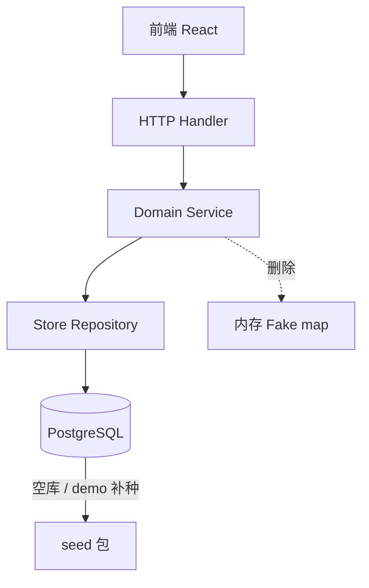

# Fake 数据迁移 Seed 与持久化设计

> 分析日期：2026-07-06  
> 范围：`apps/backend` 运行时 Fake 实现 → Postgres 持久化 + Seed 演示数据  
> 前端：已对接真实 API，本设计以**保持 HTTP 契约不变**为前提

---

## 1. 背景与目标

### 1.1 现状

- **前端**：所有页面通过 `fetch /api/*` 访问 Go 后端，MSW 已移除。
- **后端**：主体数据在 **Postgres**，空库时由 `seed.Load` 写入演示数据。
- **例外**：3 处领域逻辑仍使用**进程内内存 Fake**，重启后数据丢失或与 DB 不一致。

### 1.2 目标

| 目标 | 说明 |
|------|------|
| 消除运行时 Fake | 审批、字段映射、充值展示字段全部落库 |
| 演示数据走 Seed | demo 环境行为与 `key_approvals` 等已持久化模块一致 |
| API 契约稳定 | 前端 `src/api/*` 路径与 JSON 字段尽量不改 |
| 可参照现有模式 | 复用 `key_approvals` / `company_recharge_orders` 的 Repository + Seed 双实现 |

### 1.3 非目标（本阶段不做）

- 成员端预算**申请**接口（当前仅有管理员 List / Resolve）
- 字段映射 Test 对接真实飞书/钉钉/企微 API（可保留 demo 模拟，但配置本身要持久化）
- `member/dashboard` 独立分析服务（已从 `usage_buckets` 聚合，非 Fake 数据问题）
- `billing/service.go` 中 `walletUsageStats` 统计口径统一（独立重构项）

---

## 2. Fake 数据清单

共 **3 个模块、约 16 条硬编码记录**，外加 1 处模拟行为。

### 2.1 汇总表

| # | 模块 | 源文件 | 数据量 | 持久化状态 | 前端 API |
|---|------|--------|--------|------------|----------|
| 1 | 预算审批 | `domain/budget/approvals_fake.go` | **5 条**审批单 | 纯内存 `map[companyID][]` | `GET/PUT /api/budget/approvals` |
| 2 | 数据源字段映射 | `domain/org/remote/field_mappings_fake.go` | **6 条**默认映射 / 平台 | 纯内存 `map[key][]` | `GET/PUT /api/org/data-source/field-mappings` |
| 3 | 充值记录展示字段 | `domain/billing/recharge_records.go` | **5 条** overlay | 订单在 DB，展示字段硬编码 | `GET /api/billing/recharge-records` |
| — | 字段映射测试预览 | 同上 `TestFieldMapping` | 无持久化 | **模拟**返回固定预览 | `GET .../field-mappings/test` |

### 2.2 模块 1：预算审批（5 条）

| ID | 申请人 | 部门 | 金额 | 状态 |
|----|--------|------|------|------|
| `appr-1` | 张三 | 后端组 | 500 | pending |
| `appr-1b` | 张三 | 后端组 | 300 | approved |
| `appr-1c` | 张三 | 后端组 | 200 | approved |
| `appr-2` | 赵六 | 后端组 | 300 | pending |
| `appr-3` | 吴十 | 产品部 | 200 | approved |

- 首次 `ListApprovals` 懒加载 seed，Resolve 仅更新内存。
- **无** `applicant_id` 外键，姓名/部门为 denormalized 字符串。

### 2.3 模块 2：字段映射（6 条 / 平台）

默认映射（飞书等平台首次访问时注入）：

| source_field | target_field | required |
|--------------|--------------|----------|
| user_name | name | true |
| mobile | phone | true |
| user_email | email | false |
| dept_name | departmentName | true |
| dept_id | departmentId | true |
| user_status | status | false |

- 支持 `PUT` 保存到内存，重启恢复默认。
- `TestFieldMapping`：关键词非空即返回模拟预览（与映射配置无关）。

### 2.4 模块 3：充值记录 overlay（5 条）

DB 中已有 `company_recharge_orders`（`seed.ApplyRechargeOrders` 写入 `tu-1`…`tu-5`），但 API 响应中以下字段来自硬编码 overlay：

| order id | display orderId | method | invoiceStatus |
|----------|-----------------|--------|---------------|
| tu-1 | ORD202606190001 | alipay | none |
| tu-2 | ORD202606180002 | wechat | applied |
| tu-3 | ORD202606150003 | alipay | issued |
| tu-4 | ORD202606120004 | wechat | none |
| tu-5 | ORD202606100005 | alipay | issued |

`RechargeOrder` store 类型当前**无** `order_id` / `payment_method` / `invoice_status` 列。

### 2.5 已持久化、可作为参照的模块

| 模块 | 表 | Seed 入口 |
|------|-----|-----------|
| Key 审批 | `key_approvals` | `seed/keys_data.go` → `insertKeys` |
| 充值订单主体 | `company_recharge_orders` | `seed/billing_data.go` → `ApplyRechargeOrders` |
| 组织/预算/模型等 | 多表 | `seed/loader.go` → `ApplyTables` |

---

## 3. 目标架构



**原则**

1. Domain Service 只依赖 `store.*Repository` 接口，不直接读写 map。
2. `store/memory` 与 `store/postgres` **双实现**，测试继续用 memory + seed。
3. Demo 初始数据写入 `seed.Load` 或 `Apply*`（与 `key_approvals` 一致），不再在 domain 层 lazy seed。
4. HTTP 路由与 JSON 字段名保持不变，前端零改动或仅类型注释更新。

---

## 4. 分模块设计

### 4.1 预算审批 → `budget_approvals` 表

#### 4.1.1 Schema

```sql
CREATE TABLE IF NOT EXISTS budget_approvals (
    id              TEXT NOT NULL,
    company_id      BIGINT NOT NULL REFERENCES companies (id) ON DELETE CASCADE,
    applicant_id    TEXT,
    applicant_name  TEXT NOT NULL,
    department_name TEXT NOT NULL,
    amount          NUMERIC(18, 6) NOT NULL,
    reason          TEXT NOT NULL,
    status          TEXT NOT NULL,
    reject_reason   TEXT,
    created_at      TIMESTAMPTZ NOT NULL,
    resolved_at     TIMESTAMPTZ,
    PRIMARY KEY (company_id, id)
);

CREATE INDEX IF NOT EXISTS idx_budget_approvals_status
    ON budget_approvals (company_id, status, created_at DESC);
```

- `applicant_id` 可选，便于后续成员申请流程；demo seed 可填 `m-1` 等已有成员 ID。
- 与 `key_approvals` 对齐：`List` 按 `created_at DESC`，`Resolve` 更新 `status` / `resolved_at` / `reject_reason`。

#### 4.1.2 Repository 接口扩展

在 `store/budget_repo.go` 增加：

```go
BudgetApprovals(ctx context.Context) ([]types.BudgetApproval, error)
UpsertBudgetApproval(ctx context.Context, item types.BudgetApproval) error
UpdateBudgetApproval(ctx context.Context, id string, patch types.BudgetApproval) error
```

或参照 `keys` 的 `Approvals` + `SetApprovals` 批量模式（初始 seed 用 Set，Resolve 用单条 Update）。

#### 4.1.3 Domain 改造

- 删除 `approvals_fake.go`。
- `budget/service.go` 中 `ListApprovals` / `ResolveApproval` 改为调用 `store.Budget()`。
- 保留 `delayer.Wait`（demo 体验），逻辑与现有一致。

#### 4.1.4 Seed

新增 `seed/budget_approvals_data.go`：

```go
func buildBudgetApprovals() []types.BudgetApproval { /* 迁移现有 5 条 */ }
```

在 `seed/budget_insert.go`（或 `insert_all.go`）中插入，与 `budget_groups` 同级。

#### 4.1.5 API

| 方法 | 路径 | 变更 |
|------|------|------|
| GET | `/api/budget/approvals` | 无 |
| PUT | `/api/budget/approvals/{id}` | 无 |

---

### 4.2 字段映射 → `org_field_mappings` 表

#### 4.2.1 Schema

```sql
CREATE TABLE IF NOT EXISTS org_field_mappings (
    company_id    BIGINT NOT NULL REFERENCES companies (id) ON DELETE CASCADE,
    platform      TEXT NOT NULL,
    source_field  TEXT NOT NULL,
    source_label  TEXT NOT NULL DEFAULT '',
    target_field  TEXT NOT NULL,
    required      BOOLEAN NOT NULL DEFAULT FALSE,
    sort_order    INT NOT NULL DEFAULT 0,
    PRIMARY KEY (company_id, platform, source_field)
);

CREATE INDEX IF NOT EXISTS idx_org_field_mappings_platform
    ON org_field_mappings (company_id, platform, sort_order);
```

#### 4.2.2 Repository 接口扩展

在 `store/org_repo.go` 增加：

```go
FieldMappings(ctx context.Context, platform types.Platform) ([]types.FieldMapping, error)
ReplaceFieldMappings(ctx context.Context, platform types.Platform, mappings []types.FieldMapping) error
```

实现位置：`store/postgres/org_repo.go`、`store/memory/org_repo.go`。

#### 4.2.3 Domain 改造

- 删除 `field_mappings_fake.go` 及全局 map。
- `GetFieldMappings`：DB 无记录时返回**空列表**（不再 domain lazy seed）；demo 数据由 `seed` 写入。
- `SaveFieldMappings`：事务内 `DELETE + INSERT`（与 `SetApprovals` 模式一致）。
- `TestFieldMapping`：**Phase 1** 可保留模拟预览；**Phase 2** 接入 `datasource.Factory` 真实探测（独立任务）。

#### 4.2.4 Seed

- 新增 `buildDefaultFieldMappings(platform)`，默认 6 条。
- 在 `insertOrgIntegration` 之后为 `feishu` / `dingtalk` / `wecom` 各写入一套（或仅 demo 主平台 `feishu`）。
- 从 `seed/loader.go` 的 `Snapshot` 可选增加 `FieldMappings map[Platform][]FieldMapping` 字段。

#### 4.2.5 API

| 方法 | 路径 | 变更 |
|------|------|------|
| GET | `/api/org/data-source/field-mappings?platform=` | 无 |
| PUT | `/api/org/data-source/field-mappings` | 无 |
| GET | `/api/org/data-source/field-mappings/test` | 行为可分阶段升级 |

---

### 4.3 充值记录 → 扩展 `company_recharge_orders`

#### 4.3.1 Schema 变更

```sql
ALTER TABLE company_recharge_orders
    ADD COLUMN IF NOT EXISTS display_order_id TEXT,
    ADD COLUMN IF NOT EXISTS payment_method   TEXT,
    ADD COLUMN IF NOT EXISTS invoice_status   TEXT NOT NULL DEFAULT 'none';
```

建议枚举（应用层校验）：

- `payment_method`: `alipay` | `wechat` | NULL（平台充值可为 NULL）
- `invoice_status`: `none` | `applied` | `issued`

#### 4.3.2 Store 类型扩展

`store.RechargeOrder` 增加：

```go
DisplayOrderID *string
PaymentMethod  *string
InvoiceStatus  string
```

`BillingRepository` 的 `CreateRechargeOrder` / `ListRechargeOrders` / `UpdateRechargeStatus` 读写新列。

#### 4.3.3 Domain 改造

- 删除 `recharge_records.go` 中 `seedRechargeOverlays()` 与 `rechargeOverlay`。
- `ListRechargeRecords` 直接从 `RechargeOrder` 映射 API DTO：
  - `orderId` ← `DisplayOrderID`，为空时回退 `ID`
  - `method` ← `PaymentMethod`，为空时默认 `alipay`（仅兼容历史行，新单必须写入）
  - `invoiceStatus` ← `InvoiceStatus`
- `CreateSelfRecharge`：创建时写入 `payment_method`（若前端后续传入；当前可默认 `alipay`）。

#### 4.3.4 Seed

更新 `seed/billing_data.go` 中 `buildSeedRechargeOrders()`，为 `tu-1`…`tu-5` 填入 overlay 对应的三列。

#### 4.3.5 API

| 方法 | 路径 | 变更 |
|------|------|------|
| GET | `/api/billing/recharge-records` | 响应字段不变，数据来源改为 DB |
| POST | `/api/billing/recharge` | 可选：请求体增加 `method`（后续迭代） |

---

## 5. 实施阶段

建议按**依赖少、收益快**排序，每阶段可独立 PR。

| 阶段 | 内容 | 工作量 | 风险 |
|------|------|--------|------|
| **P0** | 充值订单三列 + 删除 overlay | 小 | 低；表已存在 |
| **P1** | `budget_approvals` 全链路 | 中 | 低；可照抄 `key_approvals` |
| **P2** | `org_field_mappings` 全链路 | 中 | 中；需处理「无记录」与 seed 默认 |
| **P3** | `TestFieldMapping` 接真实数据源 | 大 | 高；依赖凭证与外部 API |

### 5.1 P0 任务清单

1. `schema.sql` 增加三列
2. 更新 `postgres/billing_repo.go`、`memory/billing_repo.go`
3. 更新 `seed/billing_data.go`
4. 简化 `recharge_records.go`
5. 调整 `recharge_records_test.go`、`billing_test.go`

### 5.2 P1 任务清单

1. 建表 `budget_approvals`
2. 扩展 `BudgetRepository` + postgres/memory 实现
3. 新增 `seed/buildBudgetApprovals` + insert
4. 重写 `budget/service` 审批方法，删除 `approvals_fake.go`
5. handler / domain / store 测试对齐

### 5.3 P2 任务清单

1. 建表 `org_field_mappings`
2. 扩展 `OrgRepository`
3. seed 默认映射（三平台或仅 feishu）
4. 迁移 `field_mappings_fake.go` 逻辑到 org service + repo
5. 删除 fake 文件与全局变量

---

## 6. 迁移与部署

### 6.1 新环境（空库）

行为不变：`postgres.New` → `seed.ApplyTables` 写入全部演示数据（含新增表）。

### 6.2 已有 demo 库

| 场景 | 策略 |
|------|------|
| 开发库可重建 | `make reset-db` 后重启（推荐） |
| 需保留数据 | 提供一次性 SQL migration + 回填脚本 |
| 预算审批内存中有 Resolve 结果 | 重建后丢失可接受；或 migration 插入 seed 5 条 |
| 字段映射 PUT 过 | 重建后恢复 seed 默认；生产需 migration 插默认行 |

### 6.3 Schema 应用方式

与现有一致：修改 `schema.sql`，启动时 `applySchema`（`CREATE IF NOT EXISTS` / `ADD COLUMN IF NOT EXISTS`）。

---

## 7. 前端影响

| 模块 | 文件 | 变更 |
|------|------|------|
| 预算审批 | `api/budget.ts`、`BudgetApproval` 类型 | **无** |
| 字段映射 | `api/org.ts` | **无** |
| 充值记录 | `api/billing.ts` `TopUpRecord` | **无** |

验收方式：现有 e2e（`e2e/dashboard.spec.ts` 等）与页面手动验证；后端 handler 测试覆盖 JSON 形状。

---

## 8. 测试策略

| 层级 | 要求 |
|------|------|
| Store roundtrip | `tests/store/postgres/*_roundtrip_test.go` 新增审批、映射、充值列 |
| Seed | `tests/store/seed/billing_test.go` 模式扩展 |
| Domain | 迁移 `approvals_test.go`、`field_mappings_test.go`、`recharge_records_test.go` 为 DB 驱动 |
| Handler | 保持 `tests/handler/budget/approvals_test.go` 等 HTTP 测试绿 |
| Memory parity | 所有新 Repository 方法在 memory 实现，单测不依赖 Postgres |

---

## 9. 文件变更一览（完成后）

### 删除

- `internal/domain/budget/approvals_fake.go`
- `internal/domain/org/remote/field_mappings_fake.go`

### 新增

- `internal/store/seed/budget_approvals_data.go`
- `internal/store/postgres/budget_approvals_repo.go`（或并入 `budget_repo.go`）
- `internal/store/postgres/org_field_mappings_repo.go`（或并入 `org_repo.go`）
- 对应 memory 实现与测试

### 修改

- `internal/store/postgres/schema.sql`
- `internal/store/invite.go`（`RechargeOrder` 字段）
- `internal/store/budget_repo.go`、`org_repo.go`
- `internal/domain/budget/service.go`
- `internal/domain/billing/recharge_records.go`
- `internal/domain/org/remote/*.go`（字段映射方法迁出 fake）
- `internal/store/seed/billing_data.go`、`budget_insert.go`、`loader.go`

---

## 10. 验收标准

- [ ] 后端进程重启后，预算审批列表与 Resolve 结果**保持一致**
- [ ] 字段映射 PUT 后重启，配置**仍然存在**
- [ ] 充值记录列表 `orderId` / `method` / `invoiceStatus` 来自 DB，无 overlay 函数
- [ ] `grep -r "approvals_fake\|field_mappings_fake\|seedRechargeOverlays" apps/backend` 无结果
- [ ] `APP_PROFILE=demo` 空库启动后，三模块数据与当前 UI 演示一致
- [ ] 前端无需改代码即可通过现有页面验证

---

## 11. 风险与后续

| 风险 | 缓解 |
|------|------|
| 已有库无新表数据 | 提供 migration 脚本或文档说明重建 demo 库 |
| 预算审批无 Create API | 产品后续补成员申请 + `POST /api/budget/approvals` |
| 字段映射 Test 仍模拟 | P3 单独设计；P2 完成即满足「配置持久化」 |
| `walletUsageStats` TODO | 与本次迁移无关，billing 域内统一统计口径时处理 |

---

## 12. 参考实现

迁移时直接对照以下已有代码路径：

| 能力 | 参考文件 |
|------|----------|
| 审批表 CRUD | `store/postgres/keys_repo.go` → `Approvals` / `SetApprovals` |
| Seed 插入审批 | `store/seed/keys_data.go` → `buildApprovals` |
| 充值订单 CRUD | `store/postgres/billing_repo.go` |
| Demo 补种 | `store/postgres/postgres.go` → `ApplyRechargeOrders` |
| 空库 Seed | `store/seed/insert_all.go` → `ApplyTables` |
