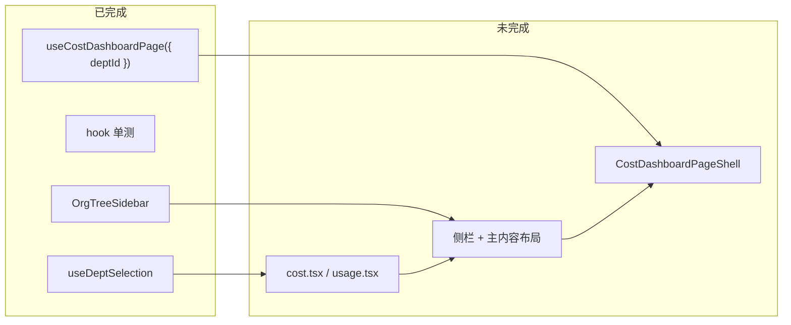

# Frontend Dashboard 与 Budget 修复指南

> 说明当前 `pnpm test:all` / `pnpm build` 失败原因、责任边界与推荐修复方案。  
> 与后端近期改动（budget 统一、P0 安全、auth `companySlug`）**无关**。

---

## 1. 结论（TL;DR）

| 问题 | 结论 |
| --- | --- |
| 谁造成的？ | **100% 前端**，分支上 `31ffea1` 起的 refactor 做了一半 |
| 后端要改吗？ | **否**，`make test-unit` 已通过 |
| 是否必须修？ | **是** — `pnpm build` 失败，无法发版；Dashboard 页面运行时可能崩溃 |
| 怎么修最好？ | **补完** `31ffea1` 的设计（URL 部门 + 侧栏），不要回退 hook、不要 hack |

---

## 2. 现象

```bash
pnpm test:all   # frontend tsc 失败，backend 可通过
pnpm build      # 同上，frontend 无法编译
```

### 2.1 TypeScript 报错清单

**Dashboard**

| 文件 | 错误 |
| --- | --- |
| `routes/dashboard/cost.tsx` | `useCostDashboardPage()` 无参，期望 `{ deptId }` |
| `routes/dashboard/usage.tsx` | `useUsageDashboardPage()` 同上 |
| `components/cost-dashboard-page-shell.tsx` | 解构 `drill` / `memberCosts` / `handleDrillDept` 等，hook 已不再返回 |

**Budget**

| 文件 | 错误 |
| --- | --- |
| `components/budget-allocation-table.tsx` | `reservedDraft` / `error` / `onUpdateReservedDraft` 声明未使用（TS6133） |
| `components/budget-detail-team.tsx` | `departmentMembers` / `membersLoading` 声明未使用 |

`tsconfig.app.json` 开启 `noUnusedLocals` / `noUnusedParameters`，上述均为硬错误。

### 2.2 与本次 backend 改动的关系

本次未提交 frontend 改动仅 4 个 auth 文件：

- `src/api/auth.ts`
- `src/features/auth/hooks/use-login-page.ts`
- `src/features/auth/components/login-form.tsx`
- `tests/features/auth/use-login-page.test.ts`

失败文件均不在其中。

---

## 3. 根因

### 3.1 Dashboard：`31ffea1` 半成品迁移

Commit `31ffea1`（feat(budget): 组织树选人、分配表简化…）同时改了 `use-cost-dashboard-page.ts`：

**已改（hook 层）**

- 签名：`useCostDashboardPage(injectedApis?)` → `useCostDashboardPage({ deptId, injectedApis? })`
- 去掉页内 `drill` state（`DrillState` / `drillIntoDepartment` / `drillBack`）
- 部门数据：`getDepartmentCosts({ parentId: deptId })`，不再在 hook 内切换 members 视图
- 单测已按新 API 编写（`use-cost-dashboard-page.test.ts`）

**未改（UI 层）**

- `routes/dashboard/cost.tsx` 仍无参调用 hook → **运行时对 `undefined` 解构会崩**
- `cost-dashboard-page-shell.tsx` 仍绑定 `CostDrillTable` 的 drill 交互
- `useDeptSelection`（URL `?dept=`）与 `OrgTreeSidebar` 已存在，**未接到 cost/usage 路由**



### 3.2 Budget：产品口径已变，props/hook 未收口

`31ffea1` 产品决策：

- **预留池 = 总额度 − 已分配**（`BudgetDetailTeam` summary 只读展示）
- 分配表只管子部门 / 项目额度，**不再在表格内编辑预留池**

实现状态：

| 层 | 状态 |
| --- | --- |
| `BudgetDetailTeam` | summary card 展示预留池 ✓ |
| `BudgetAllocationTable` | UI 已去掉预留池行，props 仍保留 ✗ |
| `useBudgetAllocationEdit` | 仍校验/保存 `reservedDraft`，用户界面改不到 ✗ |
| `BudgetDetailTeam` | 成员预算交给 `BudgetEditMemberBudget`，旧 props 未删 ✗ |

---

## 4. 是否生产问题

| 场景 | 影响 |
| --- | --- |
| 从当前分支 `pnpm build` / 部署 | ❌ 编译失败，发不了版 |
| 已部署旧 bundle | `/dashboard/cost`、`/dashboard/usage` 打开可能 **运行时崩溃** |
| 预算页 | 可能能跑，但分配编辑与 hook 逻辑不一致（预留池 silent path） |
| Backend / 登录 | 无影响 |

---

## 5. 推荐修复方案（非 hack）

原则：**补完 `31ffea1` 的「URL 部门 + parentId 过滤」模型**，与 Platform Keys 页模式一致。  
不推荐：回退 hook 的 drill state、`@ts-ignore`、把 drill props 改成 optional 糊弄编译。

### 5.1 Dashboard 目标架构

参考 `platform-keys-page-shell.tsx`（左树右内容）：

```
Route (cost.tsx / usage.tsx)
├─ useDeptSelection()           → URL ?dept=
├─ useOrgTree()                 → 侧栏部门树
└─ useCostDashboardPage({ deptId: selectedDeptId })
       │
       ├─ OrgTreeSidebar       onSelect → setSelectedDeptId
       └─ CostDashboardPageShell
```

### 5.2 Dashboard 实施步骤

#### Step 1 — Route 层 compose（消除 crash + TS2554）

`cost.tsx` / `usage.tsx` 不得无参调 hook。可选：

- 在 route 内直接 compose；或
- 新增 `hooks/use-dashboard-cost-page.ts`，封装 `useDeptSelection` + `useOrgTree` + `useCostDashboardPage`（符合 `routes → hook → shell` 约定）

#### Step 2 — 简化 `CostDashboardPageShell`

从 props 移除 hook 不再返回的字段：

- `drill` / `drillTitle` / `canDrillBack`
- `handleDrillDept` / `handleDrillBack`
- `memberCosts`（Phase 2 可选，见下）

#### Step 3 — 改造部门表（建议 rename `CostDrillTable` → `CostDeptTable`）

| 旧行为（页内 drill state） | 新行为（URL 驱动） |
| --- | --- |
| 点击「下钻」→ `setDrill(drillIntoDepartment(...))` | 点击行 → `setSelectedDeptId(dept.departmentId)`，更新 `?dept=` |
| 「返回上级」按钮 | 侧栏选「全公司」或父部门 |
| `memberCosts` 成员明细表 | **Phase 2**（见 §5.3） |

Phase 1 只做 **部门列表 + 侧栏导航** 即可 unblock build。

#### Step 4 — Usage 页

`UsageDashboardPageShell` 已与 hook 字段对齐，**仅需 route 传入 `deptId`**。  
注：`useUsageDashboardPage` 的 `deptId` 目前只进 queryKey，API 未传 — 可后续与 backend 对齐，不阻塞编译。

### 5.3 成员明细（Phase 2，可选）

若产品仍需「某部门成员花费」：

- 在 `useCostDashboardPage` 中：当 `deptId` 指向叶子部门时，调用已有 API  
  `GET /dashboard/cost/departments/{id}/members`
- 或在 shell 增加「子部门 / 成员」切换

Backend API 仍存在（`dashboardApi.getDepartmentMemberCosts`），只是 hook 暂时未调。

### 5.4 Budget 收口（与产品口径一致）

| 文件 | 动作 |
| --- | --- |
| `budget-allocation-table.tsx` | 从 props 删除 `reservedDraft` / `error` / `onUpdateReservedDraft` |
| `budget-edit-allocation.tsx` | 在表上方展示 `allocation.error` |
| `use-budget-allocation-edit.ts` | 删除 reserved 相关 state / validate / save；只保存子部门 budget |
| `budget-detail-team.tsx` | 删除 `departmentMembers` / `membersLoading` props |
| `budget-page-shell.tsx` | 停止传入上述 props |

**不要**在分配表加回预留池编辑行 — summary card 已承担只读展示。

---

## 6. 不推荐方案

| 方案 | 为何不做 |
| --- | --- |
| 恢复 hook 内 `drill` state | 与 `31ffea1`、`useDeptSelection`、现有 hook 单测冲突，undo 一半工作 |
| Route 只写 `{ deptId: null }` 不改 shell | 能过 tsc 一部分，drill 表仍引用 undefined，UX 坏 |
| `@ts-ignore` / `_unused` 前缀 | 掩盖问题，预留池 hook 逻辑仍与用户 UI 不一致 |
| 为编译通过删除 `noUnusedLocals` | 降低全局质量门槛 |

---

## 7. 执行顺序与验证

```
1. Dashboard：route compose + shell 对齐 + CostDeptTable     → pnpm build 应恢复
2. Budget：props / hook 收口                                  → 清除 TS6133
3. pnpm -F @tokenjoy/frontend test
4. pnpm test:all
```

### 涉及文件（预估）

**Dashboard（~4–5 个文件 + 1 表组件改造）**

- `src/routes/dashboard/cost.tsx`
- `src/routes/dashboard/usage.tsx`
- `src/features/dashboard/components/cost-dashboard-page-shell.tsx`
- `src/features/dashboard/components/cost-drill-table.tsx`（或新 `cost-dept-table.tsx`）
- 可选：`src/features/dashboard/hooks/use-dashboard-cost-page.ts`、共享 layout 组件

**Budget（~4 个文件）**

- `src/features/budget/components/budget-allocation-table.tsx`
- `src/features/budget/components/budget-edit-allocation.tsx`
- `src/features/budget/hooks/use-budget-allocation-edit.ts`
- `src/features/budget/components/budget-detail-team.tsx`
- `src/features/budget/components/budget-page-shell.tsx`

### 已有可复用能力（勿重写）

- `hooks/use-dept-selection.ts` + 单测
- `hooks/use-org-tree.ts` + 单测
- `components/org-tree-sidebar.tsx` + 单测
- `tests/features/dashboard/use-cost-dashboard-page.test.ts`（已按新 hook API）

---

## 8. 相关 commit

| Commit | 说明 |
| --- | --- |
| `31ffea1` | 预算分配表简化 + **dashboard hook 改为 deptId 模型**（UI 未跟进） |
| `15f4036` / `1b3a4a7` | 更早 frontend 重构，shell 曾适配 drill 表 |

---

## 9. 参考

- 前端架构约定：[Frontend.md](./Frontend.md)
- Platform Keys 侧栏模式：`features/keys/components/platform-keys-page-shell.tsx`
- 工程待办入口：[plan.md](./plan.md)（修复完成后可将本条从 backlog 勾掉）
