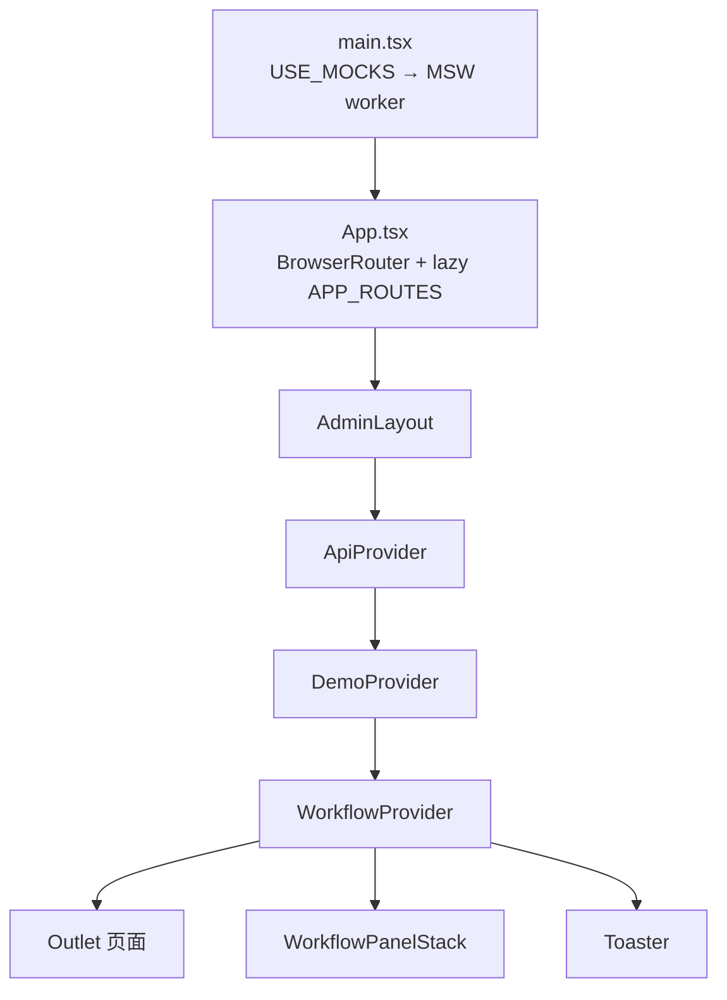
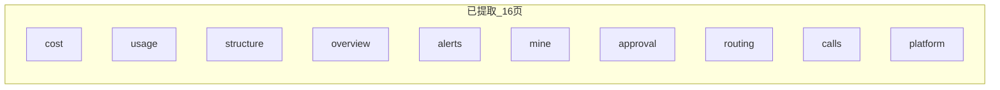
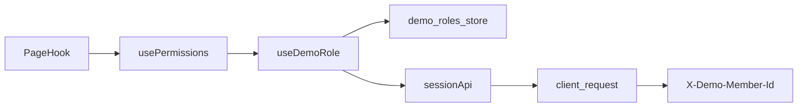

# TokenJoy 前端代码结构优化指南

本文档基于当前 `apps/frontend` 代码库现状，总结已有良好实践，指出结构性问题，并给出可渐进落地的维护规范。可作为前端日常开发与 Code Review 的参考手册。

---

## 0. 相关文档

| 文档             | 路径                                               | 职责                                              |
| ---------------- | -------------------------------------------------- | ------------------------------------------------- |
| API 契约         | [Frontend-API契约.md](./Frontend-API契约.md)       | REST 路径、请求/响应体、分页、错误格式、Mock 切换 |
| Demo 交互设计    | [Demo-交互设计方案.md](./Demo-交互设计方案.md)     | Workflow 侧滑交互、Demo 引导、CTA 高亮规格        |
| 开发速查         | [CLAUDE.md](./CLAUDE.md)                           | 命令、技术栈、目录一览                            |
| 产品需求         | [TokenJoy-PRD.md](./TokenJoy-PRD.md)               | 业务域边界、功能范围                              |
| PRD 与 Demo 差距 | [PRD-vs-Demo差距分析.md](./PRD-vs-Demo差距分析.md) | 重构与补齐优先级参考                              |

**边界说明：**

- 类型定义以 `apps/frontend/src/api/types/` 为准（契约文档中 `api/types.ts` 引用已过时，实际为 `index.ts` + 分域文件）。
- Workflow 交互细节见 Demo 设计文档 §Workflow；本文档只规定代码放哪里、怎么拆。
- Mock handler 路径须与 [Frontend-API契约.md](./Frontend-API契约.md) 保持同步。

---

## 1. 现状概览

### 1.1 目录分层

```
apps/frontend/src/
├── App.tsx / main.tsx          # 应用入口与路由挂载
├── config/                     # 路由、导航、应用级常量（app.ts、routes.ts、nav.ts）
├── routes/                     # 页面入口（按业务域分子目录）
│   ├── dashboard/
│   ├── org/
│   ├── budget/
│   ├── keys/
│   ├── models/
│   └── audit/
├── components/                 # 跨页面复用的 UI 与领域组件
│   ├── ui/                     # 无业务语义的 shadcn 基础组件
│   ├── layout/                 # 布局壳层
│   ├── org/ / keys/ / audit/   # 按领域划分的共享组件
│   └── auth/
├── features/                   # 横切业务能力（workflow、demo）
├── api/                        # HTTP 客户端 + 按域拆分的 types
├── hooks/                      # 全局共享 hooks
├── lib/                        # 纯函数工具、常量、权限逻辑
└── mocks/                      # MSW mock 数据与 handlers
```

技术栈：React 19 + React Router 7 + Vite + Tailwind 4 + Zustand（workflow / demo）+ MSW。

### 1.2 应用启动与 Provider 树



- **Mock 开关**：`config/app.ts` 中 `USE_MOCKS = DEV || VITE_ENABLE_MOCKS === 'true'`
- **API 前缀**：`API_BASE_PATH = {BASE_URL}/api`
- **布局入口**：`components/layout/admin-layout.tsx` 挂载 `ApiProvider`、`DemoProvider`、`Workflow`、侧滑栈与 Toast

### 1.3 已形成的良好模式

| 模式               | 位置示例                                                    | 价值                                                        |
| ------------------ | ----------------------------------------------------------- | ----------------------------------------------------------- |
| 路由集中注册       | `config/routes.ts`                                          | 路径、权限、懒加载一处维护                                  |
| 薄页面 + 页面 Hook | `routes/dashboard/cost.tsx` + `hooks/use-cost-dashboard.ts` | 页面只负责组合 UI，逻辑可测、可复用                         |
| 页面私有组件       | `routes/dashboard/components/`                              | 大页面拆块，不污染全局 `components/`                        |
| 统一页面壳         | `PageShell` + `DataSection`                                 | 布局、空态、加载态一致                                      |
| 异步数据抽象       | `useAsyncResource`                                          | 减少重复的 loading/error 样板                               |
| API 依赖注入       | `api/app-apis.ts` + `api/context.tsx` + `api/use-apis.ts`   | 页面 Hook / workflow / 共享组件统一 `useApis()`，可测可替换 |
| 侧滑工作流         | `features/workflow/`                                        | 表单/审批与主页面解耦                                       |
| API 类型按域拆分   | `api/types/{org,budget,...}.ts`                             | 避免单文件膨胀，边界清晰                                    |
| 权限与路由绑定     | `ROUTE_META` + `PermissionGate`                             | 导航、路由、按钮权限同源                                    |

---

## 2. 主要问题

### 2.1 页面结构不一致（已解决）

16 个 `APP_ROUTES` 页面均已提取专用页面 Hook，符合 Page → Hook → Components 三层。详见 [§10 页面 Hook 迁移对照表](#10-页面-hook-迁移对照表)。

新页面须继续遵循 `use-*-page.ts` 模板，禁止在页面文件内直接编排业务逻辑。

### 2.2 `components/` 与 `routes/*/components/` 边界模糊

当前约定（从已重构页面推断）：

- `components/org/member-table.tsx` — 多个 org 页面会用
- `routes/org/components/structure-toolbar.tsx` — 仅组织架构页使用

但缺少成文规则，容易出现：

- 只用一次的组件被放进 `components/`，全局目录膨胀
- 本应共享的表格/工具栏被锁在 `routes/` 下，其他页面重复实现
- `budget/`、`audit/`、`dashboard/` 已建立 `routes/*/components/`（如 `budget-row.tsx`、`call-logs-table.tsx`、`usage-model-chart.tsx`）

### 2.3 `hooks/` 与 `lib/` 职责交叉（已部分修复）

- ✅ `use-row-highlight.ts`、`use-page-subtitle.ts` 已迁至 `hooks/`
- `lib/` 仍只应保留纯函数；新增 Hook 勿再放入 `lib/`

### 2.4 常量与标签分散（已部分修复）

- ✅ `PLATFORM_LABELS`、`CALL_LOG_STATUS_LABELS`、`OPERATION_ACTION_LABELS` 已收敛至 `lib/labels.ts`
- 新增业务映射表应直接写入 `lib/labels.ts` 或 `lib/{domain}-constants.ts`，禁止在页面内联

### 2.5 错误态处理不完整（已解决）

`useAsyncResource` 返回的 `error` 已在 16/16 页面 Hook 中向上暴露；`ErrorState` 组件与 `DataSection` / `AuditFilteredPage` 已支持 `error` + `onRetry`。操作类错误（如导入、同步）仍用 `sonner` toast。

### 2.6 API 层缺少依赖注入（已解决）

已通过 `ApiProvider` + `useApis()` 完成注入：`api/app-apis.ts` 聚合 14 个 API 命名空间，`AdminLayout` 挂载 Provider。覆盖范围：17 个页面 Hook、17 个 workflow 面板、5 个 `components/org/*`、`use-member-whitelist`、`use-approval-pending-count`；`createDemoRoleStore` 通过构造函数注入 `sessionApi`。运行时业务代码不再直接 `import { xxxApi }`。

### 2.7 `features/` 范围未定义

目前 `features/` 仅有 `workflow` 和 `demo`。其他业务域放在 `routes/` + `components/`。这本身可行，但需要明确升级条件。详见 [§7 features 使用准则](#7-features-使用准则)。

### 2.8 测试与 CI 空白（未解决）

- 已配置 Vitest + Testing Library + jsdom，但 **无任何 `*.test.ts` / `*.spec.ts` 文件**
- `mocks/server.ts` 已就绪，但 `test-setup.ts` 尚未挂载 MSW server
- `test:run` 使用 `--passWithNoTests`，空覆盖不会失败
- CI（`.github/workflows/deploy.yml`）仅执行 `pnpm build`，未跑 `lint` / `test`

详见 [§16 测试策略](#16-测试策略)。

---

## 3. 推荐目标架构

采用 **「路由薄层 + 按域组织 + 共享下沉」** 的混合结构，不引入 Feature-Sliced Design 全套术语，但与现有代码兼容。

```
┌─────────────────────────────────────────────────────────┐
│  config/          路由、导航、权限元数据（单一数据源）      │
├─────────────────────────────────────────────────────────┤
│  routes/{domain}/                                       │
│    {page}.tsx     默认导出，只做 JSX 组合（目标 < 120 行）│
│    hooks/         页面状态、副作用、workflow 编排         │
│    components/    仅本页/本域使用的展示组件               │
├─────────────────────────────────────────────────────────┤
│  components/      跨 2+ 页面复用的 UI / 领域组件        │
│  features/        横切能力（侧滑、Demo、全局引导）        │
├─────────────────────────────────────────────────────────┤
│  api/             请求函数 + types（通过 DI 注入消费）    │
│  hooks/           全局通用 hooks                          │
│  lib/             纯函数、常量、权限计算                    │
└─────────────────────────────────────────────────────────┘
```

### 3.1 各层职责（决策表）

| 我要写的代码                     | 放哪里                                     | 判断条件                           |
| -------------------------------- | ------------------------------------------ | ---------------------------------- |
| 路由页面入口                     | `routes/{domain}/{page}.tsx`               | 每个 `APP_ROUTES` 条目对应一个文件 |
| 页面数据拉取、表单提交、弹窗状态 | `routes/{domain}/hooks/use-{page}-page.ts` | 含 `useState`/`useEffect`/业务编排 |
| 仅单页使用的图表、工具栏、表格列 | `routes/{domain}/components/`              | 无其他 `routes/` 引用              |
| 部门树、成员表、Key 表格         | `components/{domain}/`                     | ≥2 个页面使用                      |
| Button、Dialog、Table            | `components/ui/`                           | 无业务语义                         |
| 侧滑表单、多步审批               | `features/workflow/workflows/`             | 通过 `useWorkflow().open()` 打开   |
| HTTP 请求                        | `api/{domain}.ts`                          | 一一对应后端资源                   |
| DTO / 响应类型                   | `api/types/{domain}.ts`                    | 与 api 文件同域                    |
| 权限判断、树形数据处理           | `lib/`                                     | 无 React 依赖、可单测              |

### 3.2 标准页面模板

**`{page}.tsx`** — 只组合，不写业务：

```tsx
export default function ExamplePage() {
  const vm = useExamplePage()
  return (
    <PageShell actions={...} stats={...}>
      <ExampleToolbar {...vm.toolbar} />
      <DataSection loading={vm.loading} empty={vm.empty}>
        <ExampleTable {...vm.table} />
      </DataSection>
      <ConfirmActionDialog {...vm.confirm} />
    </PageShell>
  )
}
```

**`hooks/use-example-page.ts`** — 状态 + 副作用 + 事件处理：

- 调用 `useAsyncResource` / `useWorkflow` / `usePermissions`
- 返回 UI 需要的扁平 props（view model）
- 不返回 JSX

**`components/example-table.tsx`** — 展示 + 交互回调：

- 通过 props 接收 `data`、`onEdit`、`readOnly`
- 不直接调用 `api/*`（除非是极其通用的容器组件，且已有先例如 `SyncLogTable`）

---

## 4. 配置与路由：保持单一数据源

当前 `config/routes.ts` 已是较好实践，继续强化：

1. **路径**：只在 `ROUTES` 常量中定义，禁止字符串字面量路径（`Link to="/budget/overview"` → `ROUTES.budgetOverview`）
2. **权限**：`ROUTE_META` 为权限唯一来源；`nav.ts` 通过 `routePermissions()` 引用，不再手写权限数组
3. **懒加载**：新页面必须加入 `APP_ROUTES`，保证 code splitting
4. **页面标题**：继续从 `NAV_GROUPS` 派生 `ROUTE_TITLES`，避免重复维护 title map

可选增强（非必须）：将 `nav` 的 label/icon 也收敛进 `ROUTE_META`，进一步减少两处编辑。

---

## 5. API 层与依赖注入

### 5.1 现状（已落地）

`api/{domain}.ts` 仍导出各资源命名空间（如 `memberApi`、`budgetApi`），由 [`api/app-apis.ts`](../apps/frontend/src/api/app-apis.ts) 聚合为 `AppApis` + `defaultApis`。业务代码通过 Context 消费，不再直接 import 单例：

```ts
// 页面 / workflow / 共享组件
const apis = useApis()
await apis.memberApi.list(...)
```

```ts
// 非 React 场景（如 Demo Zustand store）
createDemoRoleStore(memberId, { sessionApi: mockSessionApi })
```

### 5.2 推荐模式

[`api/context.tsx`](../apps/frontend/src/api/context.tsx) 提供 `ApiProvider`；[`api/use-apis.ts`](../apps/frontend/src/api/use-apis.ts) 提供 `useApis()`（与 Provider 分文件，满足 Fast Refresh 规则）。

```ts
// api/context.tsx
export function ApiProvider({ apis, children }: { apis: AppApis; children: ReactNode })

// api/use-apis.ts
export function useApis(): AppApis // 无 Provider 时 throw
```

页面 Hook 支持测试注入（须无条件调用 `useApis()`，再合并注入参数）：

```ts
export function useStructurePage(injectedApis?: AppApis) {
  const ctxApis = useApis()
  const apis = injectedApis ?? ctxApis
  const { data, loading, error, refresh } = useAsyncResource(
    () => apis.memberApi.list({ page: 1, pageSize: 10 }),
    [apis],
  )
}
```

`AdminLayout` 最外层挂载 `<ApiProvider apis={defaultApis}>`。

### 5.3 契约维护清单

新增或修改 API 时同步检查：

- [ ] `api/{domain}.ts` 请求函数
- [ ] `api/types/{domain}.ts` 类型
- [ ] `mocks/handlers/{domain}.ts` handler
- [ ] `mocks/fixtures/{domain}.ts` 初始数据（如需要）
- [ ] [Frontend-API契约.md](./Frontend-API契约.md) 接口表

---

## 6. 数据获取与错误处理规范

### 6.1 统一使用 `useAsyncResource`

- 页面级数据：放在 `use-*-page.ts`
- 依赖变化通过 `deps` 数组声明
- 需要 workflow 关闭后刷新：用 `useWorkflowRefresh(refresh)`
- 带筛选条件的列表：用 `useFilteredResource`（见 [§11](#11-全局-hook-目录)）

### 6.2 错误态（已落地）

[`components/ui/error-state.tsx`](../apps/frontend/src/components/ui/error-state.tsx) 与 `EmptyState` 对称。`DataSection` 渲染优先级：`loading` → `error` → `empty` → `children`。操作类错误可继续用 `sonner` toast（见 [§14.5](#145-反馈与提示)）。

### 6.3 避免在组件内散落 `useEffect` 拉数

除 workflow 子面板、极小的自包含组件外，数据获取应上移到页面 Hook。

---

## 7. `features/` 使用准则

**放入 `features/` 的条件（满足任一）：**

- 跨多个业务域使用（如 workflow 侧滑）
- 有独立的全局状态 / Provider（如 `DemoProvider`、`WorkflowProvider`）
- 可整体开关（Demo 模式、引导系统）

**留在 `routes/` + `components/` 的条件：**

- 与单一业务域强绑定（预算树、组织架构）
- 没有独立生命周期，只是页面 UI 的一部分

`features/workflow/workflows/sync-config.tsx` 包装 `components/org/sync-config.tsx` 是正确示范：**可复用 UI 在 components，workflow 适配层在 features**。

Workflow 新增步骤见 [Demo-交互设计方案.md](./Demo-交互设计方案.md) 技术附录；代码落点：

1. `features/workflow/workflows/{name}.tsx` — 面板组件
2. `features/workflow/workflow-payloads.ts` — payload 类型
3. `features/workflow/workflow-definitions.tsx` — 注册

---

## 8. 组件拆分原则

### 8.1 何时拆分文件

| 信号                                     | 动作                     |
| ---------------------------------------- | ------------------------ |
| 页面文件 > 120 行                        | 抽 `hooks/use-*-page.ts` |
| 页面内有 `function XxxRow/Chart/Toolbar` | 移到 `components/`       |
| 单文件 > 200 行                          | 必须拆分                 |
| 重复出现 2 次以上的 JSX 块               | 下沉到 `components/`     |

### 8.2 组件 API 设计

- 优先 **受控组件**：`value` + `onChange`，状态由 Hook 持有
- 表格类组件：接收 `readOnly`、`rowSelection` 等，不内部判断权限
- 权限：在页面层用 `PermissionGate` 包裹按钮，而非在深层组件里散落 `usePermissions`

### 8.3 已有可复用抽象（继续推广）

**布局与状态**

| 组件                  | 路径                                       | 用途                                |
| --------------------- | ------------------------------------------ | ----------------------------------- |
| `PageShell`           | `components/layout/page-shell.tsx`         | 标题区、stats、split sidebar        |
| `DataSection`         | `components/layout/data-section.tsx`       | loading skeleton / empty / children |
| `AuditFilteredPage`   | `components/audit/audit-filtered-page.tsx` | 审计类列表页骨架                    |
| `ConfirmActionDialog` | `components/ui/confirm-action-dialog.tsx`  | 危险操作确认                        |
| `PermissionGate`      | `components/auth/permission-gate.tsx`      | 读写权限门控                        |
| `EmptyState`          | `components/ui/empty-state.tsx`            | 空数据展示                          |

**组织域 `components/org/`**

| 组件                           | 用途                       |
| ------------------------------ | -------------------------- |
| `DepartmentTree`               | 部门树选择                 |
| `MemberTable`                  | 成员列表（TanStack Table） |
| `RoleList` / `RoleMemberTable` | 角色管理                   |
| `SyncLogTable`                 | 同步记录                   |
| `SyncConfigPanel`              | 同步策略表单               |
| `CredentialForm`               | 数据源凭证                 |
| `ImportResultView`             | 导入结果展示               |
| `DataSourceInitProgress`       | 初始化进度                 |

**Key 域 `components/keys/`**

| 组件               | 用途            |
| ------------------ | --------------- |
| `PlatformKeyTable` | 平台 Key 管理   |
| `ProviderKeyTable` | 供应商 Key 管理 |

**审计域 `components/audit/`**

| 组件           | 用途       |
| -------------- | ---------- |
| `AuditToolbar` | 筛选工具栏 |

新页面应优先组合这些抽象，而不是复制粘贴布局代码。

---

## 9. 常量与类型

### 9.1 常量归属

| 类型         | 位置                                           | 示例                                    |
| ------------ | ---------------------------------------------- | --------------------------------------- |
| 路由路径     | `config/routes.ts`                             | `ROUTES.budgetOverview`                 |
| 权限 key     | `lib/permissions.ts`                           | `PERMISSION.BUDGET_READ`                |
| 业务枚举标签 | `lib/labels.ts` 或 `lib/{domain}-constants.ts` | `COST_PERIOD_LABELS`、`PLATFORM_LABELS` |
| 工作流相关   | `features/workflow/constants.ts`               | `QUOTA_INSUFFICIENT_MESSAGE`            |
| 环境与应用   | `config/app.ts`                                | `API_BASE_PATH`、`USE_MOCKS`            |

**禁止**在页面文件内定义会被多处引用的映射表。

### 9.2 类型

- API 响应 / 请求体 → `api/types/{domain}.ts`
- 仅页面 UI 使用的 view model 类型 → 放在对应 `hooks/use-*.ts` 旁导出
- 跨页面共享的领域类型 → `api/types`（与后端契约对齐）

---

## 10. 页面 Hook 迁移对照表

共 16 个 `APP_ROUTES` 页面，**全部已完成**页面 Hook 迁移：



### 10.1 完整清单

| 状态      | 页面文件                | 行数 | 页面 Hook                             | 页面 components         |
| --------- | ----------------------- | ---- | ------------------------------------- | ----------------------- |
| ✅ 已完成 | `dashboard/cost.tsx`    | 72   | `hooks/use-cost-dashboard.ts`         | `components/cost-*` ×5  |
| ✅ 已完成 | `dashboard/usage.tsx`   | 62   | `hooks/use-usage-dashboard-page.ts`   | `usage-model-chart.tsx` |
| ✅ 已完成 | `org/structure.tsx`     | 126  | `hooks/use-structure-page.ts`         | `structure-*` ×2        |
| ✅ 已完成 | `org/data-source.tsx`   | 150  | `hooks/use-data-source-page.ts`       | —                       |
| ✅ 已完成 | `org/roles.tsx`         | 119  | `hooks/use-roles-page.ts`             | —                       |
| ✅ 已完成 | `budget/overview.tsx`   | 83   | `hooks/use-budget-overview-page.ts`   | `budget-row.tsx`        |
| ✅ 已完成 | `budget/allocation.tsx` | 110  | `hooks/use-budget-allocation-page.ts` | —                       |
| ✅ 已完成 | `budget/alerts.tsx`     | 66   | `hooks/use-budget-alerts-page.ts`     | —                       |
| ✅ 已完成 | `keys/mine.tsx`         | 124  | `hooks/use-my-keys-page.ts`           | `my-keys-table.tsx`     |
| ✅ 已完成 | `keys/approval.tsx`     | 124  | `hooks/use-approval-page.ts`          | —                       |
| ✅ 已完成 | `keys/provider.tsx`     | 44   | `hooks/use-provider-keys-page.ts`     | —                       |
| ✅ 已完成 | `keys/platform.tsx`     | 39   | `hooks/use-platform-keys-page.ts`     | —                       |
| ✅ 已完成 | `models/list.tsx`       | 114  | `hooks/use-model-list-page.ts`        | —                       |
| ✅ 已完成 | `models/routing.tsx`    | 74   | `hooks/use-model-routing-page.ts`     | —                       |
| ✅ 已完成 | `audit/calls.tsx`       | 61   | `hooks/use-audit-calls-page.ts`       | `call-logs-table.tsx`   |
| ✅ 已完成 | `audit/operations.tsx`  | 93   | `hooks/use-audit-operations-page.ts`  | —                       |

### 10.2 命名约定

- **标准**：`use-{page}-page.ts`（如 `use-structure-page.ts`）
- **历史例外**：`use-cost-dashboard.ts` 未使用 `-page` 后缀；重构时可选择保留或统一改名
- **dashboard 域**：可按功能命名 `use-cost-dashboard.ts` / `use-usage-dashboard.ts`，但须保持域内一致

### 10.3 页面 Hook vs 全局 Hook vs 域级 Hook

| 类型      | 放置位置                 | 示例                                       | 判断                              |
| --------- | ------------------------ | ------------------------------------------ | --------------------------------- |
| 页面 Hook | `routes/{domain}/hooks/` | `use-structure-page.ts`                    | 编排单页全部状态与副作用          |
| 域级 Hook | `routes/{domain}/hooks/` | `routes/audit/hooks/use-audit-settings.ts` | 仅 1–2 个页面用，但逻辑独立可复用 |
| 全局 Hook | `hooks/`                 | `use-async-resource.ts`                    | 与业务域无关的通用能力            |

**决策规则：**

- 单页专用 → `routes/{domain}/hooks/use-{page}-page.ts`
- audit 两页共享筛选逻辑 → 考虑 `routes/audit/hooks/use-audit-filter.ts`；`use-audit-settings.ts` 已位于 `routes/audit/hooks/`
- 不要在页面文件内直接使用 3 个以上全局 Hook 而不封装；应合并进页面 Hook

---

## 11. 全局 Hook 目录

`src/hooks/` 存放与具体页面无关、可被多个页面/域复用的 Hook。

| Hook                  | 文件                       | 职责                                        | 典型组合                                           |
| --------------------- | -------------------------- | ------------------------------------------- | -------------------------------------------------- |
| `useAsyncResource`    | `use-async-resource.ts`    | 异步拉取、`loading`/`error`/`refresh`       | 几乎所有页面 Hook 的底层                           |
| `useFilteredResource` | `use-filtered-resource.ts` | 带 `filter` 状态的拉取                      | `audit/calls`、`audit/operations`、`keys/approval` |
| `useWorkflowRefresh`  | `use-workflow-refresh.ts`  | 打开 workflow 并在 `onSuccess` 后 `refresh` | 带侧滑表单的 CRUD 页                               |
| `usePermissions`      | `use-permissions.ts`       | 当前用户权限、`canWrite`、`has()`           | 页面 Hook 内判断读写                               |
| `useRowHighlight`     | `use-row-highlight.ts`     | 行高亮闪烁                                  | Key / 预算组 / 模型列表                            |
| `usePageSubtitle`     | `use-page-subtitle.ts`     | Header 动态副标题                           | 组织架构页                                         |

**推荐组合模式（页面 Hook 内）：**

```ts
export function useExamplePage(injectedApis?: AppApis) {
  const ctxApis = useApis()
  const apis = injectedApis ?? ctxApis
  const { canWrite } = usePermissions()
  const { data, loading, error, refresh } = useAsyncResource(() => apis.exampleApi.list(), [apis])
  const { openWithRefresh } = useWorkflowRefresh(refresh)

  const handleCreate = () => openWithRefresh('example-form')

  return { data, loading, error, refresh, canWrite, handleCreate }
}
```

---

## 12. 状态管理与 Provider 架构

### 12.1 Zustand Store 一览

项目采用 **Zustand vanilla store + React Context 注入** 模式，避免全局单例难以测试。

| Store       | 文件                                  | 用途                                 |
| ----------- | ------------------------------------- | ------------------------------------ |
| Workflow 栈 | `features/workflow/workflow-store.ts` | 侧滑面板 `open`/`push`/`pop`/`dirty` |
| Demo 角色   | `features/demo/roles/store.ts`        | 成员切换、驱动 session               |
| Demo 引导   | `features/demo/guide/store.ts`        | CTA 高亮、引导步骤                   |
| 页副标题    | `hooks/use-page-subtitle.ts`          | Header 动态 subtitle                 |

### 12.2 权限数据流



- `usePermissions` 读取 `useDemoRole` 返回的 `permissions` / `readOnly`
- Demo 角色切换时，`features/demo/roles/store.ts` 调用 `setDemoMemberIdProvider`（`api/client.ts`），后续请求自动附带 `X-Demo-Member-Id`
- 真实后端上线后，可替换 session 来源，页面层 `usePermissions` 接口保持不变

### 12.3 Demo 子模块结构

```
features/demo/
├── demo-provider.tsx       # 聚合 roles + guide + navigation-bridge
├── roles/                  # 角色切换、home-redirect
├── guide/                  # 引导面板、CTA store
├── chrome/                 # Demo banner、toolbar、desktop hint
└── nav/                    # approval pending badge
```

### 12.4 Workflow 使用约定

- 打开面板：`useWorkflow().open(id, payload, title?)`
- 关闭后刷新列表：`useWorkflowRefresh(refresh).openWithRefresh(...)`
- 面板组件注册：`features/workflow/workflow-definitions.tsx`
- 面板 UI 放 `features/workflow/workflows/`，可复用表单 UI 放 `components/{domain}/`

---

## 13. MSW 与 Mock 规范

### 13.1 目录结构

```
apps/frontend/src/mocks/
├── browser.ts              # setupWorker，由 main.tsx 动态 import
├── data.ts                 # 聚合 re-export fixtures
├── handlers/
│   ├── index.ts            # 合并各域 handlers
│   ├── session.ts
│   ├── org.ts / budget.ts / keys.ts / models.ts / dashboard.ts / audit.ts
├── fixtures/               # 静态初始数据
│   └── {org,budget,keys,models,dashboard,audit}.ts
└── lib/                    # 仅 mock 专用工具（paginate、member-factory 等）
```

### 13.2 启动与切换

```ts
// config/app.ts
export const USE_MOCKS = import.meta.env.DEV || import.meta.env.VITE_ENABLE_MOCKS === 'true'
```

```ts
// main.tsx
if (USE_MOCKS) {
  const { worker } = await import('./mocks/browser')
  await worker.start({ onUnhandledRequest: 'bypass' })
}
```

| 场景                      | 配置                                                 |
| ------------------------- | ---------------------------------------------------- |
| 本地开发                  | 默认 `DEV=true`，自动启用 MSW                        |
| 生产 Demo（GitHub Pages） | `VITE_ENABLE_MOCKS=true`（CI deploy 已设置）         |
| 对接真实后端              | 关闭 mock，配置 `VITE_API_PROXY_TARGET` 走 Vite 代理 |

详见 [Frontend-API契约.md](./Frontend-API契约.md) Mock 章节。

### 13.3 Handler 编写约定

- 路径使用 `API_BASE_PATH` 前缀，与 `api/{domain}.ts` 保持一致
- 可变状态在 handler 闭包内维护 fixture 副本，不直接 mutate `fixtures/` 导出对象
- 适当使用 `delay()` 模拟网络延迟
- **禁止**将 mock 专用逻辑放入 `src/lib/`；放在 `mocks/lib/`

### 13.4 测试用 MSW

[`mocks/server.ts`](../apps/frontend/src/mocks/server.ts) 已提供 Node `setupServer`，与 `mocks/browser.ts` 共用 `handlers`。

**待完成**：在 [`test-setup.ts`](../apps/frontend/src/test-setup.ts) 中挂载 server（见 Phase 4）：

```ts
import { server } from '@/mocks/server'

beforeAll(() => server.listen())
afterEach(() => server.resetHandlers())
afterAll(() => server.close())
```

---

## 14. 路径别名与 UI 技术栈

### 14.1 `@/` 路径别名

| 配置       | 路径                                      |
| ---------- | ----------------------------------------- |
| TypeScript | `tsconfig.app.json`：`"@/*": ["./src/*"]` |
| Vite       | `vite.config.ts`：`resolve.alias['@']`    |
| Vitest     | 通过 `mergeConfig(viteConfig)` 继承       |
| shadcn     | `components.json` aliases                 |

**约定：**

- 应用代码统一 `import ... from '@/...'`，避免 `../../` 深相对路径
- `verbatimModuleSyntax: true`：类型须 `import type`
- 路由从 `'react-router'` 导入（非 `react-router-dom`）

### 14.2 Tailwind 4 + shadcn

- 样式入口：`src/index.css`（CSS-first 配置，无独立 `tailwind.config`）
- 新基础组件：`npx shadcn@latest add <component>`（配置见 `components.json`）
- `components/ui/**` 在 ESLint 中关闭了 `react-refresh/only-export-components`（shadcn 常 export variants）

### 14.3 表格：TanStack Table

用于 `MemberTable`、`SyncLogTable`、`ImportResultView` 等。新表格建议：

- 列定义与表格实例放在组件文件内
- 分页、排序、行选择状态由页面 Hook 持有，通过 props 传入
- 复用 `@/components/ui/table` primitives

### 14.4 图表：Recharts

Dashboard 图表模式见 `routes/dashboard/components/`：

- `cost-trend-chart.tsx`、`cost-distribution-chart.tsx` 等
- 数据转换在页面 Hook（`use-cost-dashboard.ts`）完成，图表组件只接收展示用 props
- 加载态用 `Skeleton` 或 `DataSection loading`

### 14.5 表单：react-hook-form

用于 `CredentialForm`、`SyncConfigPanel`、workflow 内 `member-form` 等。

- **页面内嵌表单**：放 `components/{domain}/`
- **侧滑 workflow 表单**：放 `features/workflow/workflows/`，可薄包装 components 层表单

### 14.6 反馈与提示

- **Toast**：`sonner`，在页面 Hook 或 workflow 提交成功后调用 `toast.success` / `toast.error`
- **确认框**：危险操作用 `ConfirmActionDialog`，非阻塞提示用 toast
- **加载**：`DataSection loading` / `TableSkeleton` / `PageLoading`

---

## 15. 工具链与环境

### 15.1 本地命令

| 命令                          | 作用                   |
| ----------------------------- | ---------------------- |
| `pnpm start`                  | Vite 开发服务器        |
| `pnpm build`                  | `tsc -b && vite build` |
| `pnpm build:gh-pages`         | 启用 mock 的生产构建   |
| `pnpm lint`                   | ESLint 检查            |
| `pnpm test` / `pnpm test:run` | Vitest                 |
| `pnpm format`（根目录）       | Prettier 格式化        |

### 15.2 ESLint

- 配置：`eslint.config.js`（Flat config）
- 扩展：ESLint recommended + `typescript-eslint` + `react-hooks` + `react-refresh` + `eslint-config-prettier`
- **当前 CI 未执行 lint**；建议在 CI 中增加 `pnpm lint`

### 15.3 TypeScript

- 工程引用：`tsconfig.json` → `tsconfig.app.json` + `tsconfig.node.json`
- 严格项：`noUnusedLocals`、`noUnusedParameters`、`erasableSyntaxOnly`、`noFallthroughCasesInSwitch`
- 构建绑定类型检查：`build` = `tsc -b && vite build`

### 15.4 环境变量

| 变量                                    | 说明                                |
| --------------------------------------- | ----------------------------------- |
| `VITE_ENABLE_MOCKS`                     | 生产环境启用 MSW（`true` / 未设置） |
| `VITE_API_PROXY_TARGET`                 | 开发时 API 代理目标                 |
| `BASE_URL` / `import.meta.env.BASE_URL` | 子路径部署前缀（GitHub Pages）      |
| `GITHUB_REPOSITORY`                     | 构建时用于计算 base path            |

### 15.5 部署

- GitHub Pages：`.github/workflows/deploy.yml` 在 `main` push 时 `pnpm build`（`VITE_ENABLE_MOCKS=true`）
- MSW worker：`public/mockServiceWorker.js`
- 预览：`pnpm preview:gh-pages`

---

## 16. 测试策略

### 16.1 当前状态

| 项          | 状态                                               |
| ----------- | -------------------------------------------------- |
| Vitest 配置 | `vitest.config.ts`（jsdom、`globals: true`）       |
| Setup       | `src/test-setup.ts`（`@testing-library/jest-dom`） |
| 测试文件    | **0 个**                                           |
| `test:run`  | 带 `--passWithNoTests`，空覆盖不失败               |
| CI          | 仅 `pnpm build`，无 test/lint                      |

### 16.2 文件命名与布局

```
src/lib/budget.test.ts                          # 纯函数单测
src/lib/org.test.ts
src/lib/permissions.test.ts
src/routes/org/hooks/use-structure-page.test.tsx  # Hook 测试（需 ApiProvider mock）
```

### 16.3 推荐测试优先级

1. **纯函数**（无 mock）：`lib/budget.ts`、`lib/org.ts`、`lib/permissions.ts`
2. **全局 Hook**：`use-filtered-resource` 行为（filter 变化触发 loading）
3. **页面 Hook**：`use-structure-page` 等，通过 `injectedApis` + `renderHook` 注入 mock `AppApis`
4. **关键组件**：`PermissionGate` 渲染逻辑

### 16.4 CI 建议

在 `deploy.yml` 或独立 workflow 中增加：

```yaml
- run: pnpm lint
- run: pnpm test
- run: pnpm build
```

首批测试落地后，考虑移除 `--passWithNoTests`，使空覆盖导致 CI 失败。

### 16.5 Hook 测试示例（目标形态）

```tsx
import { renderHook, waitFor } from '@testing-library/react'
import { useStructurePage } from './use-structure-page'

const mockApis = {
  org: { getTree: vi.fn().mockResolvedValue([]) /* ... */ },
  // ...
}

it('loads departments on mount', async () => {
  const { result } = renderHook(() => useStructurePage(mockApis))
  await waitFor(() => expect(result.current.membersLoading).toBe(false))
})
```

---

## 17. 渐进式重构路线图

按投入产出比排序，**不必一次性大改**。

### Phase 1 — 统一规范（低成本）

**代码向任务已完成**（4/4）；以下为持续执行的团队约定：

- [ ] 在团队内采纳本文档的「放哪里」决策表
- [ ] 新页面强制使用 `use-*-page.ts` 模板
- [ ] 新代码禁止硬编码路由字符串
- [x] 将 `lib/use-row-highlight.ts` 迁至 `hooks/`
- [x] 将 `platformLabels` 统一迁入 `lib/labels.ts`（`data-source.tsx` + `credential-form.tsx`）
- [x] 将 `lib/page-subtitle.ts` 迁至 `hooks/use-page-subtitle.ts`
- [x] 将 `use-audit-settings.ts` 迁至 `routes/audit/hooks/`

### Phase 2 — 补齐短板页面（中成本）✅ 已完成

按 [§10](#10-页面-hook-迁移对照表) 优先级：

1. [x] **P0** `budget/overview.tsx` — `BudgetRow` → `routes/budget/components/`，逻辑 → `use-budget-overview-page.ts`
2. [x] **P0** `audit/calls.tsx` — → `use-audit-calls-page.ts` + `call-logs-table.tsx`
3. [x] **P1** `keys/approval.tsx`、`budget/allocation.tsx`、`models/list.tsx`、`audit/operations.tsx`
4. [x] **P2** `dashboard/usage.tsx`、`models/routing.tsx`、`budget/alerts.tsx`、`keys/provider.tsx`、`keys/platform.tsx`

### Phase 3 — 基础设施（中成本）✅ 已完成

- [x] 引入 `ApiProvider` + `useApis()` 依赖注入
- [x] 新增 `ErrorState` 组件，各 Hook 暴露 `error`
- [ ] 可选：`ROUTE_META` 合并 nav label/icon，单一路由元数据（延后）
- [x] 新增 `mocks/server.ts` 供 Vitest 使用

### Phase 3.5 — API DI 补全（中成本）✅ 已完成

- [x] Workflow 面板（17 个）改用 `useApis()`
- [x] 共享 `components/org/*`（5 个）改用 `useApis()`
- [x] `use-member-whitelist`、`use-approval-pending-count` 改用 `useApis()`
- [x] `createDemoRoleStore` 支持 `sessionApi` 构造函数注入

### 剩余待办一览

| 类别     | 项                         | 说明                                                                              |
| -------- | -------------------------- | --------------------------------------------------------------------------------- |
| 可选增强 | `ROUTE_META` 合并 nav      | 将 label/icon 从 `config/nav.ts` 收敛进 `ROUTE_META`，单一路由元数据              |
| 流程规范 | Phase 1 团队约定           | 采纳决策表、新页面强制 Hook 模板、禁止硬编码路由（持续执行，非一次性代码任务）    |
| 文档结构 | §2.2 components 边界       | 成文规则仍偏少，新组件放 `components/` 还是 `routes/*/components/` 需 Review 对照 |
| 质量保障 | Phase 4 全部               | `lib/` 单测、页面 Hook 测试、`test-setup` 挂载 MSW server、CI 加 lint/test        |
| 技术债   | `use-cost-dashboard` 命名  | 未使用 `-page` 后缀（§10.2 历史例外），可选统一为 `use-cost-dashboard-page.ts`    |
| 技术债   | `department-tree` 自拉数据 | 数据获取仍在组件内 `useEffect`，未来可上移到 `use-structure-page` 传 props        |

### Phase 4 — 质量保障（持续）

- [ ] 在 `test-setup.ts` 挂载 `mocks/server.ts`（`beforeAll` / `afterEach` / `afterAll`）
- [ ] 为 `lib/` 纯函数补充 vitest 单测
- [ ] 为关键页面 Hook 补充测试（mock `AppApis` 注入）
- [ ] CI 增加 `pnpm lint` + `pnpm test` + `pnpm build`
- [ ] 测试覆盖稳定后移除 `--passWithNoTests`

---

## 18. 命名约定

| 类别         | 约定                                    | 示例                      |
| ------------ | --------------------------------------- | ------------------------- |
| 页面文件     | `{name}.tsx`，默认导出                  | `structure.tsx`           |
| 页面 Hook    | `use-{name}-page.ts`                    | `use-structure-page.ts`   |
| 页面组件     | `{feature}-{part}.tsx`                  | `cost-trend-chart.tsx`    |
| API 模块     | `{domain}.ts`                           | `api/org.ts`              |
| API 命名空间 | `{resource}Api`                         | `memberApi`、`budgetApi`  |
| 类型文件     | 与 API 同域                             | `api/types/org.ts`        |
| 常量         | `{DOMAIN}_*` 或 `{domain}-constants.ts` | `COST_PERIOD`             |
| Mock handler | `mocks/handlers/{domain}.ts`            | 与 `api/{domain}.ts` 对应 |

---

## 19. 反模式清单（Review 时对照）

| 反模式                             | 问题                 | 正确做法                               |
| ---------------------------------- | -------------------- | -------------------------------------- |
| 页面内 50+ 行 `useState` + handler | 难测、难读           | 抽到 `use-*-page.ts`                   |
| 子组件直接 `import { xxxApi }`     | 耦合、难 mock        | 使用 `useApis()`，或由页面 Hook 传回调 |
| 复制粘贴 `PageShell` 布局          | 不一致               | 用共享 layout 组件                     |
| 在 3 个文件写同一权限判断          | 易漏改               | 用 `PermissionGate` / `usePermissions` |
| `components/ui` 含业务文案         | 污染基础层           | 业务组件放 `components/{domain}`       |
| 新增路由但未更新 `APP_ROUTES`      | 无法懒加载 / 404     | 同时更新 routes + nav                  |
| 忽略 `useAsyncResource` 的 `error` | 静默失败             | 展示 ErrorState 或 toast               |
| Mock handler 与 api 路径不一致     | Demo 与真实 API 漂移 | 对照契约文档同步更新                   |
| 将 mock 工具放入 `src/lib/`        | 污染应用代码         | 放 `mocks/lib/`                        |
| 同一映射表在多处定义               | i18n / 文案难维护    | 收敛到 `lib/labels.ts` 或 constants    |

---

## 20. 总结

当前前端已经具备清晰的分层雏形：**配置集中、路由懒加载、workflow 侧滑、API 类型分域、MSW 按域组织、ApiProvider 依赖注入** 均已落地。**16/16 页面** 完成 Page → Hook → Components 拆分；**Phase 1–3.5 代码向重构** 已完成。后续重点为 **Phase 4**（单测、Hook 测试、CI）及可选的 `ROUTE_META` 合并。

最高杠杆的四件事：

1. **所有页面遵循 Page → Hook → Components 三层**（16/16 已完成）；新页面继续执行同一模板。
2. **路由 / 权限 / 常量单一数据源**，杜绝魔法字符串与内联映射表（`ROUTE_META` 合并 nav 为可选下一步）。
3. **API 依赖注入**（已覆盖页面 Hook、workflow、共享 components、demo store）；新代码继续 `useApis()`。
4. **MSW handler 与 API 契约同步维护**，补齐测试与 CI，避免 Demo 与真实后端漂移。

按此规范演进，可在不推翻现有目录的前提下，让代码风格一致、职责清晰、重构风险可控。
