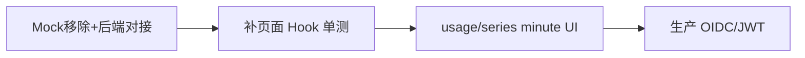

# TokenJoy 前端开发指南

`apps/frontend` 的架构说明、开发规范与演进路线。描述当前代码组织、运行时行为、扩展方式及剩余优化项，供日常开发与 Code Review 参考。

---

## 0. 相关文档

| 文档        | 路径                                                                              | 职责                                            |
| ----------- | --------------------------------------------------------------------------------- | ----------------------------------------------- |
| API 契约    | [Frontend-API契约.md](./Frontend-API契约.md)                                      | REST 路径、请求/响应体、分页、错误格式          |
| Demo        | [Demo.md](./Demo.md)                                                              | Workflow 侧滑、Demo 引导、PRD 差距与走查清单    |
| 开发速查    | [CLAUDE.md](./CLAUDE.md)                                                          | 命令、技术栈、目录一览                          |
| 产品需求    | [TokenJoy-PRD.md](./TokenJoy-PRD.md)                                              | 业务域边界、功能范围、契约对齐附录              |
| 系统架构    | [tokenjoy-architecture.md](./tokenjoy-architecture.md)                            | 双平面、预算消耗闭环、Relay 部署与 New API 集成 |
| Relay 集成  | [tokenjoy-architecture.md](./tokenjoy-architecture.md) §9–§10                     | New API、Webhook、选路、白名单、预算闭环        |
| 后端设计    | [Backend-设计.md](./Backend-设计.md)                                              | Go 服务设计与前后端联调                         |
| Cursor 规范 | [`.cursor/rules/frontend-structure.mdc`](../.cursor/rules/frontend-structure.mdc) | AI / 新人速查摘要                               |

**边界：** 类型以 `api/types/` 为准；Workflow 交互见 Demo 设计文档；API 变更须同步契约与 `api/types/`。

---

## 1. 技术栈

| 类别 | 选型                                             |
| ---- | ------------------------------------------------ |
| 框架 | React 19、React Router 7                         |
| 构建 | Vite 8、TypeScript 6                             |
| 样式 | Tailwind CSS 4、shadcn/ui（`components/ui/`）    |
| 表格 | TanStack Table                                   |
| 图表 | Recharts（数据转换在页面 Hook）                  |
| 表单 | react-hook-form                                  |
| 状态 | Zustand（workflow、page subtitle）               |
| 测试 | Vitest、Testing Library（`createMockApis` 注入） |

路径别名：`@/` → `src/`，`@tests/` → `tests/`。

---

## 2. 运行时架构

### 2.1 启动流程

```
main.tsx → createRoot → App.tsx
```

推荐在仓库根目录执行 `pnpm start`：并发启动 Go 后端（`:8080`）与 Vite 前端。前端通过 [`apps/frontend/.env.development`](../apps/frontend/.env.development) 中的 `VITE_API_PROXY_TARGET=http://localhost:8080` 将 `/api` 代理到后端。

### 2.2 Provider 树

```
App (BrowserRouter + lazy routes)
└─ AdminLayout
   ├─ ApiProvider
   ├─ QueryProvider
   ├─ AuthSessionProvider + AuthUnauthorizedBridge + SessionNavigationBridge
   └─ WorkflowProvider
      ├─ Sidebar / Header / Outlet
      ├─ WorkflowPanelStack
      └─ Toaster
```

首页 `/` 由 [`components/layout/home-redirect.tsx`](../apps/frontend/src/components/layout/home-redirect.tsx) 经 `useSession()` 读取权限，跳转到 `HOME_PATH_CANDIDATES` 中第一个可访问页面。

本地开发在 `/login` 选择 seed 成员并写入 `tokenjoy_session_member` cookie；生产环境由后端网关提供 cookie / JWT 鉴权。

### 2.3 环境与部署

| 配置                    | 来源               | 作用                              |
| ----------------------- | ------------------ | --------------------------------- |
| `BASE_URL`              | Vite `base`        | 路由 basename、静态资源、API 前缀 |
| `API_BASE_PATH`         | `{BASE_URL}/api`   | `api/client.ts` 请求前缀          |
| `VITE_API_PROXY_TARGET` | `.env.development` | 开发时 `/api` 代理到真实后端      |

`vite.config.ts` 在 GitHub Pages 构建时复制 `index.html` → `404.html`，支持 SPA 子路径回退（若需静态托管）。

---

## 3. 目录结构

```
apps/frontend/
├── scripts/
│   └── check-conventions.ts   路由 / 页面 Hook / ui 域名校验
├── tests/                  镜像 src 子路径的 Vitest 用例
└── src/
    ├── main.tsx            启动入口
    ├── App.tsx             路由注册（lazy + Suspense）
    ├── config/
    │   ├── routes.ts       ROUTE_DEFINITIONS → 派生 ROUTES / ROUTE_META / APP_ROUTES / NAV_GROUP_LAYOUT
    │   ├── nav.ts          NAV_GROUPS / ROUTE_TITLES（从 routes 派生）
    │   ├── app.ts          API 路径与 proxy 常量
    │   └── dev-members.ts  本地 dev 登录可选成员
    ├── routes/{domain}/    页面入口 + hooks/ + components/
    ├── components/
    │   ├── ui/             无业务语义的 primitive
    │   ├── layout/         壳层、导航、数据区
    │   ├── auth/           权限门控
    │   └── {domain}/       跨页或 workflow 复用的业务组件
    ├── features/
    │   ├── session/        AppSession、AuthSessionProvider
    │   ├── workflow/       侧滑编排（Zustand + 面板栈 + definitions/ 分域注册）
    │   └── query/          TanStack Query 封装
    ├── api/                HTTP 客户端 + 聚合注入
    ├── hooks/              跨域通用 React Hook
    └── lib/                纯函数、常量、权限工具
```

**分层原则：**

- `routes/` — 与 `APP_ROUTES` 一一对应的页面域
- `components/{domain}/` — 多页面或 workflow 共享的业务 UI
- `features/` — 跨域、独立 Provider、或可整体开关的能力（workflow、demo）
- `api/` + `lib/` — 无 UI 的业务与基础设施

---

## 4. 路由体系

[`config/routes.ts`](../apps/frontend/src/config/routes.ts) 以 **`ROUTE_DEFINITIONS`** 为唯一手写源，派生其余导出。

| 导出                   | 职责                                               |
| ---------------------- | -------------------------------------------------- |
| `ROUTE_DEFINITIONS`    | 单条含 path、label、icon、权限、lazy、`navGroup`   |
| `ROUTES`               | 路径常量（业务代码禁止硬编码 `/org/...` 等字符串） |
| `ROUTE_META`           | 由 definitions 派生                                |
| `APP_ROUTES`           | lazy 页面模块，供 `App.tsx` 注册                   |
| `NAV_GROUP_LAYOUT`     | 侧栏分组，由 definitions 的 `navGroup` 派生        |
| `HOME_PATH_CANDIDATES` | 首页跳转优先级                                     |
| `toRouterPath`         | 去掉 leading `/` 供 React Router `path` 使用       |

[`config/nav.ts`](../apps/frontend/src/config/nav.ts) 从 `NAV_GROUP_LAYOUT` / `ROUTE_META` 派生 `NAV_GROUPS` 与 `ROUTE_TITLES`。

**新增页面清单：** 在 `ROUTE_DEFINITIONS` 增加一条（含 `navGroup`）→ 创建 `{page}.tsx` + `hooks/use-{page}-page.ts`。`pnpm lint` 中的 `check-conventions` 会校验 definitions 与页面 Hook。

当前共 **16** 个业务页面（不含首页重定向）：

| 域        | 页面                               | Hook                                                                                        |
| --------- | ---------------------------------- | ------------------------------------------------------------------------------------------- |
| dashboard | cost、usage                        | `use-cost-dashboard-page`、`use-usage-dashboard-page`                                       |
| org       | data-source、structure、roles      | `use-data-source-page`、`use-structure-page`、`use-roles-page`                              |
| budget    | overview、allocation、alerts       | `use-budget-overview-page`、`use-budget-allocation-page`、`use-budget-alerts-page`          |
| keys      | mine、approval、platform、provider | `use-my-keys-page`、`use-approval-page`、`use-platform-keys-page`、`use-provider-keys-page` |
| models    | list、routing                      | `use-model-list-page`、`use-model-routing-page`                                             |
| audit     | operations、calls                  | `use-audit-operations-page`、`use-audit-calls-page`                                         |

keys 域另有共享 Hook `use-keys-list-page`，供 platform / provider 列表页复用。

---

## 5. API 层

### 5.1 结构

```
api/
├── client.ts           request()、ApiError、buildQuery()
├── app-apis.ts         AppApis 接口 + defaultApis 聚合
├── api-context.ts      React Context
├── context.tsx         ApiProvider
├── use-apis.ts         useApis()
├── {domain}.ts         各资源 HTTP 方法
└── types/{domain}.ts   DTO / 响应类型
```

所有请求经 `request()` 发往 `API_BASE_PATH`，携带 `credentials: 'include'` 以传递 session cookie。

### 5.2 依赖注入

- 生产：`AdminLayout` 注入 `defaultApis`
- 页面 Hook：`const apis = injectedApis ?? useApis()`，测试传入 `createMockApis()`

**改 API 时同步：** `api/{domain}.ts`、`api/types/`、[Frontend-API契约.md](./Frontend-API契约.md)。

---

## 6. 页面架构

标准三层：**薄页面 → 页面 Hook → 展示组件**。

### 6.1 页面（`{page}.tsx`）

只负责组合布局与展示组件，从 Hook 取 view model：

```tsx
export default function ExamplePage() {
  const vm = useExamplePage()
  return (
    <PageShell>
      <DataSection loading={vm.loading} error={vm.error} onRetry={vm.refresh}>
        <ExampleTable {...vm.table} />
      </DataSection>
    </PageShell>
  )
}
```

### 6.2 页面 Hook（`hooks/use-{page}-page.ts`）

- 调用 `useApis()`（支持 `injectedApis`）
- 用 `useInjectedQuery` / `useFilteredQuery` + `queryKeys` 管理异步数据
- 编排 workflow 打开、筛选、分页、行选等
- 返回扁平 view model，**不返回 JSX**

Workflow 关闭后刷新列表：`useWorkflowRefresh(refresh)`，成功时可传 `invalidateKeys`。

### 6.3 展示组件

- props 受控，不直接 `import { xxxApi }`
- 单页专用 → `routes/{domain}/components/`
- 跨页 / workflow → `components/{domain}/`

---

## 7. features

### 7.1 Workflow（`features/workflow/`）

侧滑多步表单的编排层，基于 Zustand `workflow-store`。

| 模块                                  | 职责                                                          |
| ------------------------------------- | ------------------------------------------------------------- |
| `definitions/{domain}.ts`             | 分域 workflow 注册表（org / budget / keys / models / shared） |
| `define-delegate-workflow.tsx`        | 薄包装 `WorkflowDelegatePanel` + 业务表单的工厂               |
| `workflow-payloads.ts`                | 各 workflow 的 open 参数类型（部分 payload 在 `payloads/`）   |
| `workflows/*.tsx`                     | 含业务逻辑的步骤面板                                          |
| `components/workflow-panel-stack.tsx` | 全局侧滑栈渲染                                                |
| `use-workflow.ts`                     | `open` / `push` / `pop` / `closeAll`                          |
| `use-workflow-submit.ts`              | 提交流程封装                                                  |

新增 workflow：`workflows/{name}.tsx`（或 `defineDelegateWorkflow`）+ payload 类型 + `definitions/{domain}.ts` 注册。

### 7.2 本地开发登录

Dev 环境无 MSW / Demo shell。访问 `/login` 选择成员，写入 `tokenjoy_session_member` cookie；`AuthSessionProvider` 调用 `GET /session` 加载权限。成员列表见 [`config/dev-members.ts`](../apps/frontend/src/config/dev-members.ts)。

---

## 8. 共享组件索引

### 8.1 布局与通用

| 组件                                              | 路径                 | 用途                     |
| ------------------------------------------------- | -------------------- | ------------------------ |
| `AdminLayout`、`Sidebar`、`Header`                | `components/layout/` | 应用壳                   |
| `PageShell`、`DataSection`                        | `components/layout/` | 页面容器与异步态         |
| `RouteFallback`                                   | `components/layout/` | lazy 路由加载态          |
| `PermissionGate`                                  | `components/auth/`   | 权限门控                 |
| `EmptyState`、`ErrorState`、`ConfirmActionDialog` | `components/ui/`     | 通用反馈                 |
| `OptionsSelect`                                   | `components/ui/`     | 无业务语义的枚举筛选下拉 |

### 8.2 跨域业务组件

| 组件                                                                       | 路径                                | 消费者                         |
| -------------------------------------------------------------------------- | ----------------------------------- | ------------------------------ |
| `CredentialForm`、`SyncConfigPanel`                                        | `components/org/`                   | workflow                       |
| `BudgetProgressCell`                                                       | `components/budget/`                | budget、usage、platform keys   |
| `AuditFilteredPage`、`AuditToolbar`、`AuditListToolbar`                    | `components/audit/`                 | operations、calls              |
| `AuditMemberSelect`、`AuditDatePresetSelect`、`AuditKeywordInput`          | `components/audit/`                 | operations、calls              |
| `KeyPrefixBadge`、`KeyStatusBadge`、`ProviderBadge`、`ApprovalStatusBadge` | `components/keys/status-badges.tsx` | keys 列表表格                  |
| `OptionsSelect`                                                            | `components/ui/`                    | audit 筛选、可复用于 dashboard |

### 8.3 页面私有组件（按域）

| 域        | 组件                                                                                                           | 页面                               |
| --------- | -------------------------------------------------------------------------------------------------------------- | ---------------------------------- |
| org       | `structure-*`、`department-tree`、`member-table`、`role-*`、`data-source-*`、`import-result`、`sync-log-table` | structure、roles、data-source      |
| keys      | `my-keys-table`、`approval-table`、`platform-key-table`、`provider-key-table`                                  | mine、approval、platform、provider |
| budget    | `budget-row`、`budget-group-table`                                                                             | overview、allocation               |
| dashboard | `cost-*` ×5、`usage-model-chart`                                                                               | cost、usage                        |
| models    | `model-list-table`、`routing-rules-table`                                                                      | list、routing                      |
| audit     | `call-logs-table`、`operations-log-table`                                                                      | calls、operations                  |

---

## 9. hooks 与 lib

### 9.1 全局 Hook（`hooks/`）

| Hook                                    | 职责                                     |
| --------------------------------------- | ---------------------------------------- |
| `useInjectedQuery`（`features/query/`） | DI + TanStack Query 数据获取             |
| `useFilteredQuery`                      | filter state 与 queryKey 联动的列表查询  |
| `useApprovalPendingCountQuery`          | 审批待办角标（structure 页与侧栏共用）   |
| `useRouteRedirect`                      | 无权限 / 角色切换时的路由重定向          |
| `useWorkflowRefresh`                    | workflow 成功后触发 refresh / invalidate |
| `usePermissions`                        | 权限与 `canWrite`                        |
| `useRouteAccess`                        | 当前路径是否可访问                       |
| `useRowHighlight`                       | 表格行高亮                               |
| `usePageSubtitle`                       | Header 副标题（Zustand）                 |
| `useAuditSettings`                      | 审计页共享筛选设置                       |
| `useAuditMemberOptions`                 | 审计成员筛选下拉选项                     |

Audit 列表页共享 Hook：`routes/audit/hooks/use-audit-list-page.ts`（内部 `useFilteredQuery`）。

### 9.2 纯逻辑（`lib/`）

| 模块                                                      | 内容                                        |
| --------------------------------------------------------- | ------------------------------------------- |
| `permission-keys.ts`                                      | 权限 key 常量                               |
| `permissions.ts`                                          | `hasPermission`、`getDefaultHomePath` 等    |
| `labels.ts`                                               | 业务标签映射（无 React）                    |
| `date.ts`                                                 | 本地日期格式化与「近 7 天」计算（生产语义） |
| `audit-constants.ts`、`audit-query.ts`、`audit-export.ts` | 审计日期 preset、query 构建、CSV 导出       |
| `{domain}.ts`                                             | 域内纯函数（org、budget、dashboard）        |
| `utils.ts`                                                | `cn()` 等工具                               |
| `csv-export.ts`                                           | 导出辅助                                    |

常量与环境：`config/routes.ts`、`config/app.ts`、`lib/date.ts`、`features/workflow/constants.ts`、`config/dev-members.ts`。

---

## 10. 测试

单元与集成测试通过 `createMockApis()` / `renderHookWithProviders()` 注入 mock API，不依赖后端进程。

```
tests/
├── setup.ts、utils.tsx       TestSessionProvider + renderHookWithProviders / createMockApis
├── fixtures/、helpers/
├── lib/、hooks/、config/
├── routes/{domain}/
└── components/{domain}/
```

增量测试优先级：`lib/` 纯函数 → 全局 Hook → 页面 Hook（`injectedApis`）→ 关键组件。

---

## 11. 代码放置决策

| 我要写的代码       | 放哪里                                     | 判断条件                          |
| ------------------ | ------------------------------------------ | --------------------------------- |
| 路由页面入口       | `routes/{domain}/{page}.tsx`               | 每个 `APP_ROUTES` 一条            |
| 页面逻辑           | `routes/{domain}/hooks/use-{page}-page.ts` | 状态、副作用、编排                |
| 单页 UI 块         | `routes/{domain}/components/`              | 仅 1 个 route，且无 workflow 复用 |
| 跨页 / workflow UI | `components/{domain}/`                     | ≥2 页面，或页面 + workflow        |
| 布局 / 权限        | `components/layout/`、`auth/`              | 跨业务域                          |
| Primitive          | `components/ui/`                           | 无业务语义                        |
| Workflow 面板      | `features/workflow/workflows/`             | `useWorkflow().open()`            |
| HTTP               | `api/{domain}.ts`                          | 对应后端资源                      |
| DTO                | `api/types/{domain}.ts`                    | 与 api 同域                       |
| 纯逻辑             | `lib/`                                     | 无 React，可单测                  |

**升降级：** 第二页面引用 `routes/*/components/` → 升到 `components/{domain}/`；长期单页且无 workflow → 降到 `routes/*/components/`。

---

## 12. 工具链

| 命令                          | 作用                                |
| ----------------------------- | ----------------------------------- |
| `pnpm start`                  | 并发启动 backend + frontend（推荐） |
| `pnpm lint`                   | ESLint + `check-conventions`        |
| `pnpm test` / `pnpm test:run` | Vitest（含 typecheck:test）         |
| `pnpm build`                  | `tsc -b && vite build`              |

**CI：** [`.github/workflows/ci.yml`](../.github/workflows/ci.yml) 执行 lint、test、build。

---

## 13. 反模式（Review 对照）

| 反模式                                | 正确做法                                                                           |
| ------------------------------------- | ---------------------------------------------------------------------------------- |
| 页面内大量 `useState` + handler       | `use-*-page.ts`                                                                    |
| 子组件直接 `import { xxxApi }`        | `useInjectedApis()` / `useApis()` 或 Hook 传回调                                   |
| `components/ui` 含业务语义            | `components/{domain}/` 或 `routes/.../components/`                                 |
| 单页组件放 `components/{domain}/`     | `routes/{domain}/components/`                                                      |
| 硬编码路由字符串                      | `ROUTES.*`                                                                         |
| 新路由未同步 config                   | 更新 `ROUTE_META` / `APP_ROUTES` / `NAV_GROUP_LAYOUT`                              |
| 忽略 Query 的 `error`                 | `ErrorState` 或 toast                                                              |
| Mock 与 api 路径不一致                | 对照 API 契约                                                                      |
| 映射表多处定义                        | `lib/labels.ts` 或 domain constants                                                |
| 筛选下拉硬编码 label / value          | `lib/labels.ts` + `components/ui/options-select.tsx`                               |
| Audit 列表手写 filter state           | `use-audit-list-page` + `useFilteredQuery`                                         |
| 业务代码硬编码 fixture 成员/部门/周期 | 经 `useApis()` 拉取；周期用 API 字段（如 `BudgetNode.period`）                     |
| `lib/` 含 React 组件                  | 迁至 `components/{domain}/`（如 keys badge → `components/keys/status-badges.tsx`） |

---

## 14. 扩展清单

**新功能：** Page → Hook → Components；路由走 §4 清单；组件按 §8 与 §11 选型。

**新 API：** 契约 + handler + 类型同步；页面 Hook 经 `useApis()` 消费；按需补测试。

**新 Workflow：** `workflows/{name}.tsx` + payload 类型 + `definitions/{domain}.ts` 注册；可复用 UI 放 `components/{domain}/`。

**提 PR 前：** `pnpm lint` 与 `pnpm test` 本地通过。

---

## 15. 架构演进与优化

**评估日期：** 2026-06-29（Mock 移除、真实后端对接后）  
**代码规模：** `src/` 约 240 个 TS/TSX 文件

### 15.1 总体结论

| 维度         | 评价                                                                                                                |
| ------------ | ------------------------------------------------------------------------------------------------------------------- |
| 分层清晰度   | 良好 — `routes` / `components` / `features` / `api` / `lib` 边界明确，`check-conventions` 自动兜底                  |
| 可测试性     | 良好 — `AppApis` DI、`createMockApis()`、`TestSessionProvider`；Query 与 session 已有单测                           |
| 复杂度来源   | 主要为 **Workflow**（~27 个自定义面板 + 分域 registry），非 16 页 CRUD                                              |
| 生产就绪度   | **较好** — Cookie/Bearer Session、`credentials: 'include'`、401 跳转登录、`SessionNavigationBridge`、TanStack Query |
| 是否值得大改 | **否** — 下一步以补页面 Hook 测试、按需演进 workflow 工厂、minute 用量监控 UI 为主                                  |

**一句话：** MSW / Demo shell 已移除；前后端 81 端点已对接；`usage/series` 前端已接。剩余为测试覆盖率提升与 OIDC。

### 15.2 已完成（2026-06-29）

| 项                          | 落地要点                                                                                                                                                                              |
| --------------------------- | ------------------------------------------------------------------------------------------------------------------------------------------------------------------------------------- |
| **Mock 移除**               | 删除 `src/mocks/`、`features/demo/`；`main.tsx` 无 MSW；`admin-layout` 仅用 `AuthSessionProvider`                                                                                     |
| **真实后端**                | `pnpm start` 并发 backend + frontend；Vite proxy + seed 用量桶                                                                                                                        |
| **Session 抽象（P0）**      | [`features/session/`](../apps/frontend/src/features/session/)：`useSession()`、`AuthSessionProvider`                                                                                  |
| **路由单源（P0）**          | [`config/routes.ts`](../apps/frontend/src/config/routes.ts) 的 `ROUTE_DEFINITIONS` 派生路由与导航                                                                                     |
| **Workflow 样板压缩（P0）** | [`define-delegate-workflow.tsx`](../apps/frontend/src/features/workflow/define-delegate-workflow.tsx)；[`definitions/`](../apps/frontend/src/features/workflow/definitions/) 分域注册 |
| **P1 Session/401**          | `credentials: 'include'`；`setUnauthorizedHandler`；[`/login`](../apps/frontend/src/routes/auth/login.tsx)                                                                            |
| **P3 TanStack Query**       | [`features/query/`](../apps/frontend/src/features/query/)；16 页 Hook + 共享 Hook 全量迁移                                                                                            |
| **P4 路由守卫**             | [`lib/route-access.ts`](../apps/frontend/src/lib/route-access.ts)；[`SessionNavigationBridge`](../apps/frontend/src/features/session/session-navigation-bridge.tsx)                   |
| **看板对齐**                | `queryKeys.dashboard.cost` 含 `granularity`；demo profile 用 `DemoToday` 解析 period；客户端不再二次聚合 week/month                                                                   |

### 15.3 体量分布（复审）

```
features/   70+ 文件  (session + workflow + query)
routes/     61 文件
components/ 48 文件
api/        21 文件
lib/        16 文件
hooks/      11 文件
config/      4 文件
```

### 15.4 现状优点（建议保留）

| 模式                                                    | 价值                                |
| ------------------------------------------------------- | ----------------------------------- |
| 薄页面 → `use-*-page` → 展示组件                        | 可读、可测                          |
| `AppApis` + `injectedApis` + `useInjectedQuery`         | 统一 DI + Query                     |
| `ROUTE_DEFINITIONS` 单源 + `validateRouteDefinitions()` | 新页面只改一处                      |
| `useSession` / `usePermissions` / `useRouteAccess`      | 权限与导航一致                      |
| `queryKeys` 分层                                        | workflow 成功后 `invalidateQueries` |
| `components/ui` 零业务语义                              | lint 强制                           |

### 15.5 剩余可优化项

#### P7 — 工具链与测试补强

| 项                   | 说明                                                                        |
| -------------------- | --------------------------------------------------------------------------- |
| **页面 Hook 覆盖率** | 16 页中约半数有单测；优先补 keys / budget / org 核心 Hook                   |
| **workflow 工厂化**  | 第 3 个同类 picker 出现再抽象 `definePickerWorkflow`                        |
| **`usage/series`**   | 已完成 — `/dashboard/usage` 实时监控（minute/hour）；`groupBy` 多系列 defer |

### 15.6 不建议简化的部分

| 想法                                     | 原因                                 |
| ---------------------------------------- | ------------------------------------ |
| 合并 `routes/` 与 `components/{domain}/` | convention + lint 已固化             |
| 删掉 Workflow 改 Modal                   | 与 [Demo.md](./Demo.md) 交互设计冲突 |
| 全局 Zustand 存列表                      | Query 已覆盖缓存需求                 |
| 16 页合并路由                            | 与 PRD 信息架构一致                  |

### 15.7 推荐演进路线



| 阶段                 | 动作                            | 状态       |
| -------------------- | ------------------------------- | ---------- |
| Mock 移除 + 后端对接 | 81 端点、cookie 登录、seed 用量 | **已完成** |
| 页面 Hook 单测补齐   | P7                              | **按需**   |
| `usage/series` 前端  | minute/hour 实时监控 UI         | **已完成** |
| 生产 OIDC            | 替换 dev cookie                 | **未做**   |

### 15.8 PR / 接后端自检清单

- [ ] 新页面只改 `ROUTE_DEFINITIONS` 一条
- [ ] 页面组件只从 `use-*-page` 取数，无内联 `useApis`
- [ ] 业务代码用 `useSession` / `usePermissions`
- [ ] 新数据请求用 `useInjectedQuery` + `queryKeys`，workflow 成功传 `invalidateKeys`
- [ ] 新 API 改 `api/` + 契约 + `queryKeys` + 后端 handler
- [ ] `AuthSessionProvider` 路径有测试或手动验证

**维护说明：** 新 workflow 工厂化按需记入 §15.5 P7。
