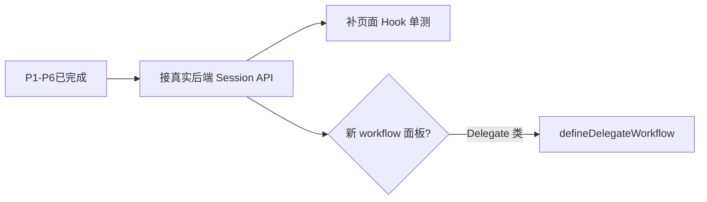

# Frontend 架构优化与简化建议

本文档在 [Frontend-代码结构.md](./Frontend-代码结构.md)（现状说明）基础上，记录**剩余**可优化项与优先级。已完成项见 §2，日常开发以代码结构文档为准。

**评估日期：** 2026-06-25（P1～P6 架构优化落地后）  
**代码规模：** `src/` 约 300 个 TS/TSX 文件

---

## 1. 总体结论

| 维度         | 评价                                                                                                          |
| ------------ | ------------------------------------------------------------------------------------------------------------- |
| 分层清晰度   | 良好 — `routes` / `components` / `features` / `api` / `lib` 边界明确，`check-conventions` 自动兜底            |
| 可测试性     | 良好 — `AppApis` DI、`injectedApis`、MSW 双端一致；`features/session` 与 Query 基础设施已有单测               |
| 复杂度来源   | 仍为 **Demo**（MSW、引导、角色切换）与 **Workflow**（~27 个自定义面板 + 分域 registry），非 16 页 CRUD        |
| 生产就绪度   | **较好** — Session 双轨 Mock、`credentials`、401 跳转登录、`SessionNavigationBridge`、TanStack Query 全量迁移 |
| 是否值得大改 | **否** — 下一步以接真实后端、补页面 Hook 测试、按需演进 workflow 工厂为主                                     |

**一句话：** P1～P6 已落地（Session 闭环、payload 分域、Query、路由守卫、预算树 Hook、Mock 冻结 + Session Zod）。剩余为真实后端对接与测试覆盖率提升。

---

## 2. 已完成（2026-06-25）

| 项                          | 落地要点                                                                                                                                                                                      |
| --------------------------- | --------------------------------------------------------------------------------------------------------------------------------------------------------------------------------------------- |
| **Session 抽象（P0）**      | [`features/session/`](../apps/frontend/src/features/session/)：`useSession()`、`DemoSessionProvider`、`AuthSessionProvider`                                                                   |
| **路由单源（P0）**          | [`config/routes.ts`](../apps/frontend/src/config/routes.ts) 的 `ROUTE_DEFINITIONS` 派生路由与导航                                                                                             |
| **Demo 按需加载（P0）**     | [`admin-layout.tsx`](../apps/frontend/src/components/layout/admin-layout.tsx) 的 `USE_MOCKS` 分支 + lazy `DemoShell`                                                                          |
| **Workflow 样板压缩（P0）** | [`define-delegate-workflow.tsx`](../apps/frontend/src/features/workflow/define-delegate-workflow.tsx)；[`definitions/`](../apps/frontend/src/features/workflow/definitions/) 分域注册         |
| **P1 Session/401**          | MSW 双轨 `GET /session`；`credentials: 'include'`；`setUnauthorizedHandler`；[`/login`](../apps/frontend/src/routes/auth/login.tsx)；`AuthSessionProvider` 单测                               |
| **P2 Workflow payload**     | [`features/workflow/payloads/`](../apps/frontend/src/features/workflow/payloads/)；[`defineAlertWorkflow`](../apps/frontend/src/features/workflow/define-alert-workflow.tsx)（`quota-check`） |
| **P3 TanStack Query**       | [`features/query/`](../apps/frontend/src/features/query/)；16 页 Hook + 共享 Hook 全量迁移；`useWorkflowRefresh` 支持 `invalidateKeys`                                                        |
| **P4 路由守卫**             | [`lib/route-access.ts`](../apps/frontend/src/lib/route-access.ts)；[`SessionNavigationBridge`](../apps/frontend/src/features/session/session-navigation-bridge.tsx)；Demo 桥接瘦身            |
| **P5 预算树 Hook**          | [`use-budget-tree-query.ts`](../apps/frontend/src/routes/budget/hooks/use-budget-tree-query.ts) — overview / allocation 复用                                                                  |
| **P6 Mock + Zod**           | Mock 冻结策略（契约 §6.4）；[`api/schemas/session.ts`](../apps/frontend/src/api/schemas/session.ts)；`check-conventions` 改为 import `ROUTE_DEFINITIONS`                                      |

---

## 3. 体量分布（复审）

```
features/   95+ 文件  (session + workflow + demo + query)
routes/     61 文件
components/ 48 文件
mocks/      36 文件
api/        21 文件
lib/        16 文件
hooks/      12 文件
config/      4 文件
```

---

## 4. 现状优点（建议保留）

| 模式                                                    | 价值                                |
| ------------------------------------------------------- | ----------------------------------- |
| 薄页面 → `use-*-page` → 展示组件                        | 可读、可测                          |
| `AppApis` + `injectedApis` + `useInjectedQuery`         | 统一 DI + Query                     |
| `ROUTE_DEFINITIONS` 单源 + `validateRouteDefinitions()` | 新页面只改一处                      |
| `useSession` / `usePermissions` / `useRouteAccess`      | Demo 与生产可切换                   |
| `queryKeys` 分层                                        | workflow 成功后 `invalidateQueries` |
| `components/ui` 零业务语义                              | lint 强制                           |

---

## 5. 剩余可优化项

### P7 — 工具链与测试补强

| 项                             | 说明                                                              |
| ------------------------------ | ----------------------------------------------------------------- |
| **页面 Hook 覆盖率**           | 16 页中约半数有单测；接后端前优先补 keys / budget / org 核心 Hook |
| **`DemoSessionProvider` 单测** | 与 `createDemoRoleStore` 桥接                                     |
| **workflow 继续工厂化**        | 第 3 个同类 picker 出现再抽象 `definePickerWorkflow`              |

---

### P8 — Bundle 与 Demo 边界（低优先级）

**现状（`pnpm build`）：**

- Demo 相关 chunk 已分离；主入口含 Workflow + Recharts 依赖。
- Recharts 已随 dashboard 路由 lazy，可接受。
- 避免在 `hooks/` 或 `lib/` 静态 import `@/features/demo`（Session handler 兜底常量除外）。

---

## 6. 不建议简化的部分

| 想法                                     | 原因                     |
| ---------------------------------------- | ------------------------ |
| 合并 `routes/` 与 `components/{domain}/` | convention + lint 已固化 |
| 删掉 Workflow 改 Modal                   | 与 Demo 交互设计冲突     |
| 全局 Zustand 存列表                      | Query 已覆盖缓存需求     |
| 16 页合并路由                            | 与 PRD 信息架构一致      |

---

## 7. 推荐演进路线



| 阶段                    | 动作                                   | 状态       |
| ----------------------- | -------------------------------------- | ---------- |
| P1～P6 架构优化         | Session / Query / 路由守卫 / Mock 冻结 | **已完成** |
| 真实后端 `GET /session` | 替换 MSW 双轨默认 member 兜底          | **待做**   |
| 页面 Hook 单测补齐      | P7                                     | **按需**   |

---

## 8. PR / 接后端自检清单

- [ ] 新页面只改 `ROUTE_DEFINITIONS` 一条
- [ ] 页面组件只从 `use-*-page` 取数，无内联 `useApis`
- [ ] 业务代码用 `useSession` / `usePermissions`，不用 `useDemoRole`
- [ ] 新数据请求用 `useInjectedQuery` + `queryKeys`，workflow 成功传 `invalidateKeys`
- [ ] 新 API 改 `api/` + 契约 + `queryKeys`（**不**改冻结的 mock handler）
- [ ] 生产构建不依赖 `VITE_ENABLE_MOCKS`
- [ ] `AuthSessionProvider` 路径有测试或手动验证

---

## 9. 相关文档

| 文档                                                   | 职责                                     |
| ------------------------------------------------------ | ---------------------------------------- |
| [Frontend-代码结构.md](./Frontend-代码结构.md)         | 现状架构、目录、反模式                   |
| [Frontend-API契约.md](./Frontend-API契约.md)           | REST 契约（含 Session 双轨与 Mock 冻结） |
| [Frontend-PRD与API差距.md](./Frontend-PRD与API差距.md) | 产品对齐状态                             |
| [Demo-交互设计方案.md](./Demo-交互设计方案.md)         | Workflow / 引导交互                      |

---

**维护说明：** 接真实后端后更新 §7 路线图；新 workflow 工厂化按需记入 §5 P7。
