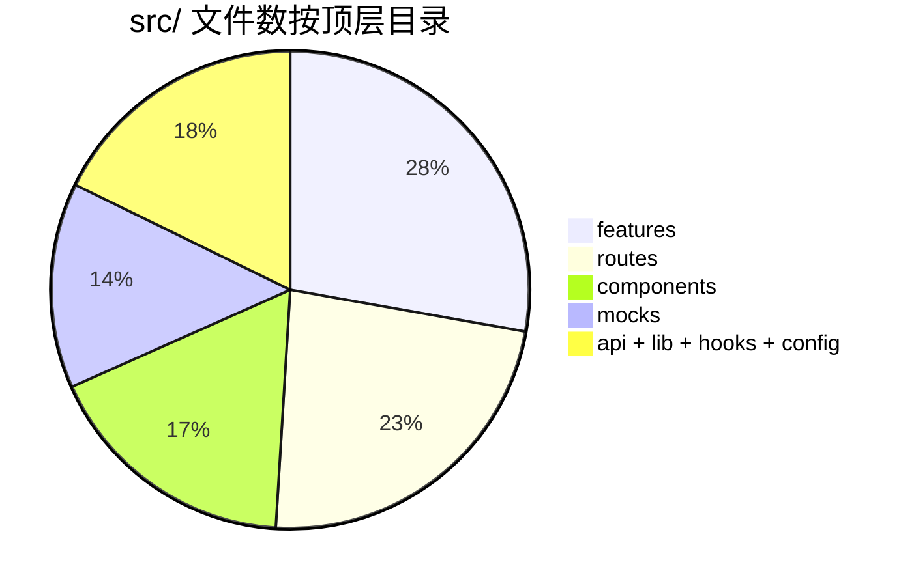
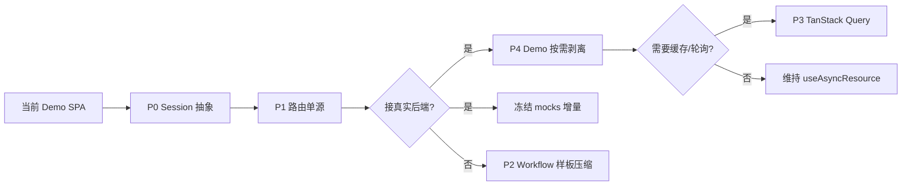

# Frontend 架构优化与简化建议

本文档在 [Frontend-代码结构.md](./Frontend-代码结构.md)（现状说明）基础上，评估 `apps/frontend` 是否可进一步**优化、简化**，并给出分优先级的可执行建议。

**评估日期：** 2026-06-25  
**代码规模：** `src/` 约 262 个 TS/TSX 文件

---

## 1. 总体结论

| 维度 | 评价 |
| ---- | ---- |
| 分层清晰度 | 良好 — `routes` / `components` / `features` / `api` / `lib` 边界明确，`check-conventions` 自动兜底 |
| 可测试性 | 良好 — `AppApis` 依赖注入、`injectedApis` 贯穿页面 Hook，MSW 双端一致 |
| 复杂度来源 | 主要来自 **Demo 能力**（MSW + 角色切换 + 引导）与 **Workflow 侧滑编排**（~29 个面板），而非页面 CRUD 本身 |
| 是否值得大改 | **不建议推倒重来**；宜做「单点合并 + 生产演进抽象」，避免引入过重框架 |

**一句话：** 当前架构对 Demo 管理端是合理且可维护的；简化重点应放在**减少重复配置**、**抽象生产鉴权**、**按需剥离 Demo 包**，而非合并目录或砍掉 Workflow。

---

## 2. 体量分布（何处最「重」）

```
features/   72 文件  (~4.5k 行 workflow 相关)
routes/     60 文件  (16 页面 × 薄页面 + Hook + 私有组件)
components/ 45 文件  (ui + 跨页业务组件)
mocks/      36 文件  (~1k 行 handlers)
api/        20 文件
lib/        15 文件
hooks/       8 文件
config/      3 文件
```



**解读：**

- `features/workflow` 占 `features/` 主体，是交互复杂度中心，不是坏味道。
- `mocks/` 与 `api/` 同域镜像，属 Demo 必要成本；接真实后端后 handlers 可冻结，不必删架构。
- `routes/` 与 `hooks/` 体量与 16 个业务页面对称，**页面三层模式没有过度抽象**。

---

## 3. 现状优点（建议保留）

以下设计经实践验证，优化时不应破坏：

| 模式 | 价值 |
| ---- | ---- |
| **薄页面 → `use-*-page` → 展示组件** | 页面可读、Hook 可单测、组件可复用 |
| **`AppApis` + `ApiProvider` + `injectedApis`** | 统一 DI，测试与 Story 友好 |
| **`ROUTES` 常量 + 禁止硬编码路径** | 重构安全 |
| **`components/ui` 零业务语义** | 有 lint 规则强制 |
| **`routes/*/components` 禁止 `useApis()`** | 防止 UI 层偷偷拉数 |
| **Workflow 与 `components/{domain}` 表单分离** | 如 `CredentialFormWorkflow` 薄包装 `CredentialForm`，复用正确 |
| **共享列表 Hook 先例** | `useKeysListPage`、`useAuditListPage` 已减少重复 |

---

## 4. 可优化项（按优先级）

### P0 — 生产演进：鉴权与 Demo 解耦

**问题：** `usePermissions()` 直接依赖 `useDemoRole()`，生产鉴权无法替换而不改全站调用方。

```ts
// hooks/use-permissions.ts — 当前
const { permissions, readOnly, loading } = useDemoRole()
```

**建议：**

1. 定义 `SessionContext` / `useSession()` 接口：`{ memberId, permissions, readOnly, loading }`。
2. Demo 实现：`DemoSessionProvider`（内部仍用 `sessionApi` + `X-Demo-Member-Id`）。
3. 生产实现：`AuthSessionProvider`（JWT / Cookie，无角色切换 UI）。
4. `usePermissions()` 只读 `useSession()`，不再 import `features/demo`。

**收益：** 生产构建可 tree-shake Demo UI；权限逻辑单点切换。  
**成本：** 中等（Provider 一层抽象 + 测试双实现）。  
**不建议：** 在页面 Hook 里散落 `USE_MOCKS ? ... : ...` 分支。

---

### P1 — 路由配置单源化

**问题：** 新增页面需同步 4 处：`ROUTES` → `ROUTE_META` → `APP_ROUTES` → `NAV_GROUP_LAYOUT`（`check-conventions` 已校验，但仍是人工维护）。

**建议：** 合并为单一 `ROUTE_DEFINITIONS` 数组，每项包含：

```ts
{
  key: 'budgetOverview',
  path: '/budget/overview',
  label, icon, requiredPermissions,
  lazy: () => import('@/routes/budget/overview'),
  navGroup: '预算',
}
```

由该数组**派生** `ROUTES`、`ROUTE_META`、`APP_ROUTES`、`NAV_GROUP_LAYOUT`。`check-conventions` 改为校验派生结果一致性。

**收益：** 新页面只改一处；减少 copy-paste 错误。  
**成本：** 低（纯 config 重构，无业务逻辑变化）。

---

### P2 — Workflow 注册样板压缩

**问题：** 每个 workflow 需 3 处登记：`workflows/*.tsx` + `workflow-payloads.ts` 类型 + `workflow-definitions.tsx` 注册。部分文件极薄（如 `credential-form.tsx` 仅 ~29 行）。

**建议（择一或组合）：**

| 手段 | 说明 |
| ---- | ---- |
| **`defineDelegateWorkflow`** | 对「包一层 `WorkflowDelegatePanel` + 业务表单」的面板，用工厂一次注册 title / layer / 关闭逻辑 |
| **Payload 与 ID 同文件** | `workflows/credential-form.tsx` 内 export `CredentialFormPayload` + 组件，减少 `workflow-payloads.ts` 体积 |
| **按域拆分 registry** | `workflow-definitions/org.ts`、`budget.ts`… 再 merge，避免单文件 100+ 行 import |

**收益：** 新增侧滑步骤时心智负担更低。  
**成本：** 低～中；需保持 `WorkflowId` 联合类型仍可静态检查。  
**不建议：** 去掉 Workflow 层改全页 Modal — 与 [Demo-交互设计方案.md](./Demo-交互设计方案.md) 冲突。

---

### P3 — 异步数据层：维持现状 vs 引入 TanStack Query

**现状：** 自研 `useAsyncResource` + `useFilteredResource`（~75 行），16 个页面 Hook 各自 `refresh`，`useWorkflowRefresh` 桥接侧滑关闭后刷新。

| 方案 | 优点 | 缺点 |
| ---- | ---- | ---- |
| **维持现状** | 零新依赖；行为简单可预测；已有测试 | 无跨页缓存、无请求去重、手写 `deps` |
| **引入 TanStack Query** | 缓存/失效/重试统一；可删部分 refresh 样板 | 新依赖 + 学习成本；Mock 模式要配 `QueryClient`；16 页迁移工作量 |

**建议：** **短期维持现状**；当接真实后端后出现「多 Tab 重复请求」「乐观更新」「后台轮询」需求时，再引入 Query，并以 `queryKeys` + `apis` 封装层迁移，而非页面内直接 `useQuery`。

---

### P4 — Demo 包按需加载

**问题：** `AdminLayout` 始终挂载 `DemoProvider`（角色、引导、Session Gate、桌面提示），生产包也会打进 Demo 相关 chunk（除非构建时条件编译）。

**建议：**

```tsx
// 伪代码
{USE_MOCKS ? <DemoProvider>...</DemoProvider> : <SessionProvider>...</SessionProvider>}
```

- Demo 专属：`DemoToolbar`、`DemoGuidePanel`、`HomeRedirect` 角色逻辑 → 动态 `import()` 或 `USE_MOCKS` 分支。
- `useDemoCta` 在页面 Hook 中的引用（budget、models、keys 等）→ 改为 no-op hook 或从 view model 可选字段读取，避免生产空实现仍打包引导常量。

**收益：** 生产 bundle 更小；边界更清晰。  
**成本：** 低～中。

---

### P5 — 扩展「域级共享 Hook」模式

**已有先例：**

- `routes/keys/hooks/use-keys-list-page.ts` — platform / provider 共用
- `routes/audit/hooks/use-audit-list-page.ts` — operations / calls 共用

**可继续抽取（仅在出现第 3 处重复时）：**

| 域 | 候选 | 触发条件 |
| ---- | ---- | -------- |
| dashboard | `useDashboardQueryPage` | cost / usage 筛选与 `useAsyncResource` 模式趋同 |
| budget | 树形数据 + `openWithRefresh` | allocation / overview 重复编排 |
| org | 部门树 + 成员表 | structure / roles 交叉变多 |

**原则：** 两次重复可接受；三次再抽象（与现有升降级规则一致）。

---

### P6 — API 与 Mock 维护成本

**现状：** `api/{domain}.ts` 与 `mocks/handlers/{domain}.ts` 成对维护，契约文档为第三真相源。

**简化手段（中长期）：**

1. 契约 OpenAPI / Zod schema 为单源 → 生成 TS 类型（可选）。
2. MSW handler 用 `msw` + schema 校验响应，减少手写漂移。
3. 接真实后端后：`mocks/` **冻结**，新 API 只改 `api/` + 集成测试，不再双写 handler。

**不建议：** 把 Mock 逻辑并入 `api/client.ts` — 会破坏 DI 与测试隔离。

---

## 5. 不建议简化的部分

| 想法 | 原因 |
| ---- | ---- |
| 合并 `routes/` 与 `components/{domain}/` | 单页 / 跨页边界已由 convention 与 lint 固化，合并会增加循环依赖风险 |
| 删掉 `features/workflow` 改 Dialog | Demo 核心交互是多步侧滑栈，砍掉需重做产品体验 |
| 用全局 Zustand 存列表数据 | 页面 Hook + `useAsyncResource` 已足够；全局 store 难测且易脏 |
| 合并 `api-context.ts` 与 `context.tsx` | 仅 10 行，拆分利于测试 import `ApiContext` 无 React |
| 16 页合并为更少路由 | 与 PRD / 导航信息架构一致，非技术债 |
| 引入 Redux / MobX | 当前 Zustand 仅 workflow + demo + subtitle，无全局数据泥潭 |

---

## 6. 目录决策速查（简化版）

与 [Frontend-代码结构.md §11](./Frontend-代码结构.md) 一致，此处只保留决策树：

```
新代码放哪？
├─ 有对应 APP_ROUTES 入口？ → routes/{domain}/{page}.tsx
├─ 页面状态/请求/编排？     → routes/{domain}/hooks/use-{page}-page.ts
├─ 仅单页用、无 workflow？  → routes/{domain}/components/
├─ ≥2 页或 workflow 复用？  → components/{domain}/
├─ 侧滑多步？               → features/workflow/workflows/
├─ HTTP？                   → api/{domain}.ts + api/types/
├─ 纯函数？                 → lib/
└─ Mock？                   → mocks/handlers/ + fixtures/
```

**升降级：** 第二处引用 `routes/*/components` → 升到 `components/{domain}/`；长期单页 → 降回 `routes/*/components/`。

---

## 7. 推荐演进路线

**状态（2026-06-25）：** Phase 1～3（P0 Session 抽象、P1 路由单源、P4 Demo 剥离、P2 Workflow 工厂）已落地。Phase 4（P3 Query / P5 域 Hook）按需。



| 阶段 | 动作 | 状态 |
| ---- | ---- | ---- |
| **Phase 1** | P0 Session 抽象 + P1 路由单源 | 已完成 |
| **Phase 2** | P4 Demo 按需加载；生产 `AuthSessionProvider` | 已完成 |
| **Phase 3** | P2 Workflow 工厂 / 分域 registry | 已完成 |
| **Phase 4** | 按业务需要 P3 Query 或 P5 域 Hook | 按需 |

---

## 8. 复杂度健康度自检清单

提 PR 或接后端前可对照：

- [x] 新页面是否只改了一处路由配置（`ROUTE_DEFINITIONS`）
- [ ] 页面组件是否只从 `use-*-page` 取数，无内联 `useApis`
- [ ] Workflow 是否复用 `components/{domain}` 表单而非复制 UI
- [x] 权限是否经 `usePermissions` / `useSession`，未直接读 Demo store
- [ ] Mock 路径是否与 [Frontend-API契约.md](./Frontend-API契约.md) 一致
- [x] 生产构建是否不需要 `VITE_ENABLE_MOCKS`（Demo chunk 已 lazy 分离）

---

## 9. 相关文档

| 文档 | 职责 |
| ---- | ---- |
| [Frontend-代码结构.md](./Frontend-代码结构.md) | 现状架构、目录、反模式 |
| [Frontend-API契约.md](./Frontend-API契约.md) | REST 契约 |
| [Frontend-PRD与API差距.md](./Frontend-PRD与API差距.md) | 产品对齐状态 |
| [Demo-交互设计方案.md](./Demo-交互设计方案.md) | Workflow / 引导交互 |

---

**维护说明：** 架构有重大变更（如引入 Query、鉴权方案落地）后，同步更新本文 Phase 状态与 [Frontend-代码结构.md](./Frontend-代码结构.md)。
