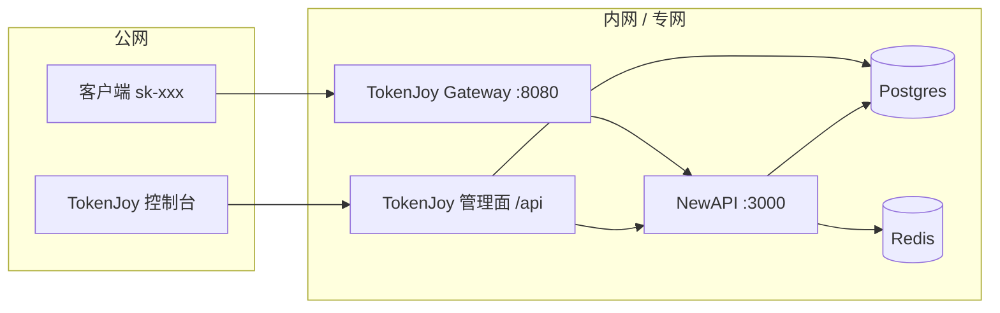
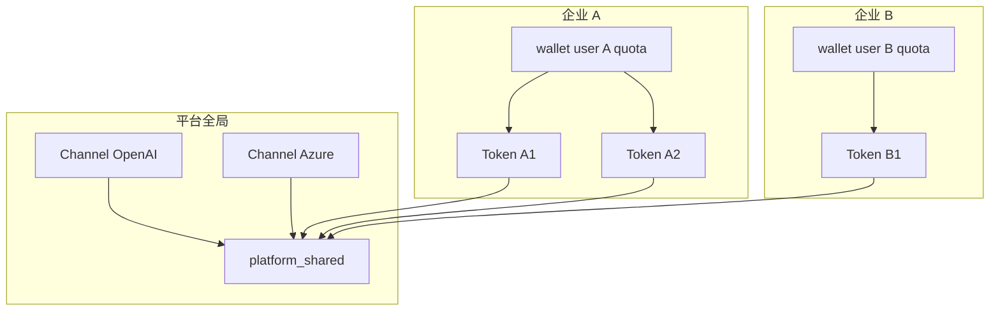

# NewAPI SaaS 多企业配置指南

> **读者**：平台运维 / 后端  
> **前置**：[Backend-SaaS多租户改造.md](./Backend-SaaS多租户改造.md)  
> **约定**：产品称 **企业（Company）**；NewAPI 里的 `users` 在本方案中仅作 **企业服务账户（公司钱包）**，不是企业员工登录账号。

---

## 1. 部署拓扑



| 组件             | 数量            | 说明                                                         |
| ---------------- | --------------- | ------------------------------------------------------------ |
| NewAPI 进程      | **1**（单集群） | 所有企业共用；**逻辑按企业服务账户隔离**                     |
| TokenJoy Backend | 1+              | `MULTI_COMPANY=true`；唯一持有 NewAPI Admin Token            |
| Postgres         | 1 实例，两库    | `tokenjoy` + `newapi`（见 `apps/newapi/docker-compose.yml`） |
| Redis            | 1               | NewAPI 会话与缓存                                            |

**不采用**：每企业一套 NewAPI（运维成本高，与「平台共享 Channel」冲突）。

---

## 2. NewAPI 侧隔离模型

| 对象                    | 多企业 SaaS 配置                                                 | 隔离方式                         |
| ----------------------- | ---------------------------------------------------------------- | -------------------------------- |
| **Channel（上游线路）** | 平台统一维护；`group = platform_shared`                          | 全局共享，无企业 ID              |
| **企业服务账户**        | 每企业 1 个 `users` 行；`quota` = 公司钱包                       | `user_id` 不同                   |
| **Token（sk-）**        | 创建时指定 `user_id` = 该企业服务账户；`group = platform_shared` | 扣费进对应企业钱包               |
| **logs**                | webhook 回传 `token_id`                                          | TokenJoy 映射表反查 `company_id` |



---

## 3. 环境变量（NewAPI 服务）

参考 `apps/newapi/docker-compose.yml` 与 `.env.example`：

| 变量                        | 示例                                                   | 说明                       |
| --------------------------- | ------------------------------------------------------ | -------------------------- |
| `SQL_DSN`                   | `postgresql://…/newapi`                                | NewAPI 专用库              |
| `REDIS_CONN_STRING`         | `redis://redis:6379`                                   | 必填                       |
| `SESSION_SECRET`            | 随机长串                                               | 生产必换                   |
| `SYNC_FREQUENCY`            | `60`                                                   | Channel 余额同步间隔（秒） |
| `MANAGEMENT_WEBHOOK_URL`    | `http://backend:8080/api/internal/webhooks/newapi-log` | 每笔 settle 通知 TokenJoy  |
| `MANAGEMENT_WEBHOOK_SECRET` | 与 Backend `NEW_API_WEBHOOK_SECRET` 一致               | Webhook 鉴权               |

TokenJoy Backend 侧（与现网一致，扩展用于多企业）：

| 变量                           | 说明                                                       |
| ------------------------------ | ---------------------------------------------------------- |
| `NEW_API_ENABLED`              | `true`                                                     |
| `NEW_API_BASE_URL`             | NewAPI 内网地址，如 `http://new-api:3000`                  |
| `NEW_API_ADMIN_TOKEN`          | **平台根管理员** JWT；仅 Backend / Worker 使用，不下发企业 |
| `NEW_API_WEBHOOK_SECRET`       | 与 NewAPI webhook 一致                                     |
| `MULTI_COMPANY`                | `true`                                                     |
| `DEFAULT_COMPANY_ID`           | 私有化默认 `1`                                             |
| `COMPANY_WALLET_CACHE_TTL_SEC` | `30`（钱包预检缓存）                                       |
| `PLATFORM_SHARED_RELAY_GROUP`  | `platform_shared`（与 Channel `group` 一致）               |
| `RELAY_GATEWAY_ENABLED`        | `true`（SaaS 建议：公网只暴露 Gateway）                    |

---

## 4. 首次 bootstrap（平台一次性）

### 4.1 启动栈

```bash
docker compose -f apps/newapi/docker-compose.yml up -d --build
# Backend 另起，DATABASE_URL 指向 tokenjoy 库
```

### 4.2 创建 NewAPI 根管理员

1. 浏览器访问 NewAPI 控制台（仅内网或运维 VPN）：`http://<newapi-host>:3000`
2. 注册**第一个**账号 → 即为系统根用户
3. 在 NewAPI 后台生成 **系统访问令牌（Admin API Token）**
4. 写入 TokenJoy：`NEW_API_ADMIN_TOKEN=<jwt>`

此后 **所有** 企业开户、Channel 同步、Token 创建、TopUp 均由 TokenJoy 用此 Token 代调，企业管理员**不**持有 NewAPI 凭证。

### 4.3 配置平台 Channel 池

在 TokenJoy 平台面维护 `provider_keys`（或运维脚本），同步到 NewAPI 时须满足：

| 字段             | 值                 | 说明                                  |
| ---------------- | ------------------ | ------------------------------------- |
| Channel `group`  | `platform_shared`  | 与 `PLATFORM_SHARED_RELAY_GROUP` 一致 |
| Channel `status` | 启用               |                                       |
| 模型能力         | `RebuildAbilities` | 新增/变更 Channel 后必须重建          |

**本地验证**：`apps/newapi/scripts/gate-verify.sh` 可检查 Relay 栈与 webhook 通路。

### 4.4 Webhook

确认 NewAPI 容器环境：

```text
MANAGEMENT_WEBHOOK_URL=http://<tokenjoy-host>:8080/api/internal/webhooks/newapi-log
MANAGEMENT_WEBHOOK_SECRET=<与 Backend 相同>
```

TokenJoy 已提供 `POST /api/internal/webhooks/newapi-log`；若上游未原生触发，使用 `patches/webhook/settle_webhook.sh` 或 Worker `compensateLogs` 补偿。

---

## 5. 每家企业开户时 NewAPI 操作（TokenJoy 自动）

平台 `POST /api/platform/companies`（或等价）时，Backend 依次：

| 步骤 | NewAPI Admin API（概念）       | 结果                                                                  |
| ---- | ------------------------------ | --------------------------------------------------------------------- |
| 1    | `CreateUser`                   | 企业服务账户；`quota = 0`；`username` 建议 `company-{id}` 或企业 slug |
| 2    | —                              | 将返回的 `user_id` 写入 `companies.newapi_wallet_account_id`          |
| 3    | （可选）`CreateToken` 暂不创建 | 等成员申请 Platform Key 时再建                                        |

**禁止**：为企业员工在 NewAPI 注册可登录的人机账号；员工只登录 TokenJoy 控制台。

---

## 6. 成员 Platform Key 创建时（TokenJoy 自动）

`TokenLifecycle` 调用 NewAPI 创建 Token 时参数约定：

| 参数                                    | SaaS 多企业值                                |
| --------------------------------------- | -------------------------------------------- |
| `user_id`                               | 该企业的 `newapi_wallet_account_id`          |
| `group`                                 | `platform_shared`                            |
| `remain_quota`                          | `min(部门/Key 分配额, 企业钱包剩余可分配额)` |
| `model_limits` / `model_limits_enabled` | 与 TokenJoy 白名单一致                       |
| `unlimited_quota`                       | `false`                                      |

更新 / 撤销 Key 时同样保持 `user_id` 不变，仅改额度与状态。

---

## 7. 充值

| 步骤 | 操作                                                                |
| ---- | ------------------------------------------------------------------- |
| 1    | TokenJoy `TopUp(newapi_wallet_account_id, amount)`                  |
| 2    | 写 `company_recharge_orders`                                        |
| 3    | 触发企业内 `rebalance`，按部门预算把额度分到各 Token `remain_quota` |
| 4    | 约束：`Σ Token remain_quota` ≤ `users.quota`                        |

企业钱包为 **唯一扣费来源**；Token `remain_quota` 仅为分配视图。

---

## 8. 网络与安全

| 规则                | 说明                                                                 |
| ------------------- | -------------------------------------------------------------------- |
| NewAPI **不对公网** | 安全组 / 防火墙仅允许 TokenJoy Gateway、Backend、Worker 访问 `:3000` |
| 公网入口            | 仅 TokenJoy Gateway（Relay + 控制台 `/api`）                         |
| Admin Token         | 仅存 Backend 环境变量；轮换时滚动更新                                |
| 防绕过              | 即使获知 `sk-`，直连内网 NewAPI 也应网络不可达                       |

---

## 9. 计费模式建议（NewAPI 控制台）

在 NewAPI 系统设置中确认（名称因版本略有差异）：

| 项              | 建议                                             |
| --------------- | ------------------------------------------------ |
| 额度计费        | 开启按 `quota` 扣费（与 TokenJoy ingest 一致）   |
| 新用户默认额度  | `0`（配合「须充值才可用」）                      |
| 信任额度 / 预扣 | 与 Gateway 预检策略对齐；生产建议开启 PreConsume |

具体开关以部署的 `calciumion/new-api` 版本后台为准；TokenJoy 以 webhook `quota` 字段入账。

---

## 10. 单企业私有化（`MULTI_COMPANY=false`）

| 项           | 配置                                                                   |
| ------------ | ---------------------------------------------------------------------- |
| NewAPI       | 仍一套；一个企业级 `newapi_wallet_account_id`                          |
| Channel      | 企业管理员可 CRUD `provider_keys`；Token `group = dept-{departmentId}` |
| 企业服务账户 | 1 个；与现网迁移对齐                                                   |
| 公网         | 可选直连 NewAPI 或经 Gateway                                           |

---

## 11. 运维检查清单

- [ ] NewAPI 仅内网可达；`NEW_API_ADMIN_TOKEN` 已配置
- [ ] 所有启用 Channel 的 `group` 含 `platform_shared`
- [ ] `RebuildAbilities` 在 Channel 变更后已执行
- [ ] Webhook secret 两端一致；测试 settle 能 ingest
- [ ] 试开户一家企业：`users.quota=0` → 创建 Key → `remain_quota=0` → Gateway 403
- [ ] TopUp 后 rebalance → 调用成功 → 钱包扣减、部门已用上涨
- [ ] 企业 A 的 Token `user_id` ≠ 企业 B

---

## 12. 相关文档

- [Backend-SaaS多租户改造.md](./Backend-SaaS多租户改造.md) — 架构与 Store
- `apps/newapi/.env.example` — 本地环境变量模板
- `apps/newapi/docker-compose.yml` — 本地 Relay 栈
