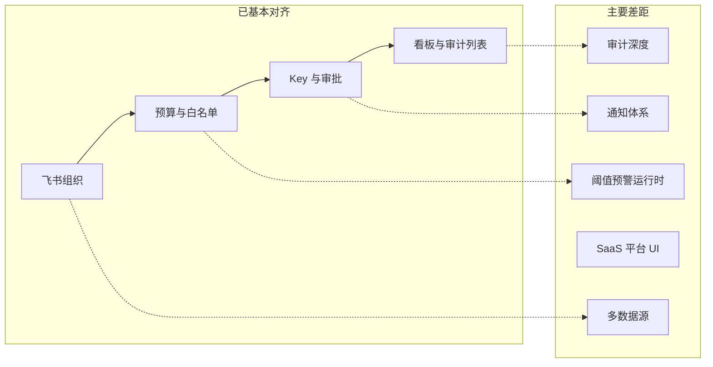

# PRD 与现有项目差距分析

> **对照基准**：[PRD.md](./PRD.md)（产品需求）  
> **现状来源**：[Roadmap.md](./Roadmap.md)、[plan.md](./plan.md)、[Frontend.md](./Frontend.md)、代码库  
> **定位**：产品视角的差距清单；工程 backlog 仍以 [plan.md](./plan.md) 为准。

---

## 1. 总览

PRD 将产品划分为 **P1 平台初始化 → P2 资源管控 → P3 成员接入与调用 → P4 运营与合规** 四阶段。当前实现已覆盖 **管理面主链路**：企业内 16 个控制台页面均已对接后端（PRD 附录称 82 个 REST 端点），核心闭环（组织 → 预算 → 白名单 → Key 审批/自主创建 → Gateway 调用 → 入账 → 看板/审计）在 **飞书 + NewAPI 栈** 下可跑通。

与 PRD 的主要差距集中在三类：

| 类别 | 说明 |
| --- | --- |
| **刻意未做** | US-15 合规审查、敏感词扫描；PRD 附录已标注排除 |
| **半实现** | 预警阈值、通知、邀请激活、超限文案、部分 SaaS 面 |
| **未开始** | 钉钉/企微、IM/邮件通知、审计归档、OIDC、真实支付、平台运营前端 |

---

## 2. 分阶段对照

### 2.1 P1 平台初始化

| US | 需求摘要 | 状态 | 差距说明 |
| --- | --- | --- | --- |
| US-01 | 第三方凭证（飞书/钉钉/企微） | ⚠️ | **飞书**完整：测试连接、保存、字段映射。**钉钉/企微**：前端表单与类型已就绪，后端 `factory.ForPlatform` 返回 `platform not supported` |
| US-02 | 全量导入组织架构 | ✅ | 飞书全量/增量；失败详情与重试链路已有 |
| US-03 | 定时同步策略 | ⚠️ | Worker `org_sync`、删除保护阈值终止同步已实现；**通知**仅 `NOTIFY_WEBHOOK_URL` 出站，无 PRD 要求的手机/邮箱/IM |
| US-04 | 手动管理组织 | ⚠️ | 部门树 CRUD、成员增删改、批量转移、停用联动 Key 失效均已实现；**邀请成员** API 有邀请态，**无真实邮件/短信**发送与独立激活页 |
| US-05 | 角色与权限 | ✅ | 预设角色（含只读审计员、API 调用者）、自定义角色 CRUD、多角色并集、`manifest.json` + PDP 动态下发，超出 PRD 描述的静态权限表 |

**P1 小结**：私有化场景下飞书路径基本达标；多平台数据源与成员邀请激活是最大产品缺口。

---

### 2.2 P2 资源管控配置

| US | 需求摘要 | 状态 | 差距说明 |
| --- | --- | --- | --- |
| US-07 | 逐级预算 + Budget Group | ✅ | 组织树分配、预留池、额度追加审批、虚拟项目组与独立 Key 均已实现 |
| US-08 | 用量预警与超限策略 | ❌/⚠️ | **预警规则** `alert_rules` 仅 CRUD + 前端配置页，**无 Worker 在 80%/90% 触发通知**；运行时封禁为 `consumed >= budget` 硬阻断，**不读百分比阈值**；`overrun_policy.blockMessage` 仅存库，Gateway 错误文案未完全消费该配置 |
| US-09 | 模型白名单 | ✅ | 继承/自定义、父级缩小联动子级、部门粒度、Gateway precheck 校验 model；已完成 `modelId` 化改造 |

**P2 小结**：预算与白名单是强项；US-08 是 PRD 与运行时行为偏差最大的单项之一。

---

### 2.3 P3 成员接入与调用

| US | 需求摘要 | 状态 | 差距说明 |
| --- | --- | --- | --- |
| US-10 | Key/额度审批 | ⚠️ | 审批四 Tab、通过自动建 Key/扣预留池、拒绝理由均已实现；**IM 通知审批人/申请人**未做 |
| US-11 | 自主管理 Platform Key | ✅ | 多 Key、模型绑定、额度分配、toggle/revoke/rotate/delete；Rotate 已 Remote-first + NewAPI regenerate |
| US-12 | API 调用 | ⚠️ | Gateway 精确路径白名单（`/v1/chat/completions` 等）+ precheck + NewAPI 入账；**依赖** `NEW_API_ENABLED` + NewAPI 栈；PRD 要求 **Anthropic `/v1/messages` 原生格式**未单独暴露（经 OpenAI 兼容路径可能可用，但未作为一等契约验收） |

**P3 小结**：管理面 Key 生命周期已对齐 PRD；调用链路与通知、双格式 API 仍有差距。

---

### 2.4 P4 运营与合规

| US | 需求摘要 | 状态 | 差距说明 |
| --- | --- | --- | --- |
| US-13 | 成本看板 | ✅ | 指标卡、趋势、部门占比、下钻、时间范围切换 |
| US-14 | 审计追踪 | ⚠️ | 操作审计 + 调用审计（`usage_ledger`）；前端 **CSV 导出**已有；**热存 7 天 → 对象存储归档**未做；**prompt/response 全文留存**首版不提供；留存周期配置未落地 |
| US-15 | 合规审查（敏感词） | ❌ | PRD 概述提及「敏感词审查」，正文 US-15 与附录均标注 **产品范围已排除** |

**P4 小结**：列表级审计与看板达标；深度合规存储与内容留存是长期差距。

---

## 3. PRD 未单独成 US、但项目已有的能力

这些属于 **实现架构或 Backend 文档** 延伸，PRD 用户故事未逐条描述，但与交付相关：

| 能力 | 现状 | 与 PRD 关系 |
| --- | --- | --- |
| **NewAPI 集成** | Platform Key 必须经 NewAPISync 同步；Gateway 为唯一 LLM 入口；入账 webhook + `usage_ledger` | PRD US-12 只描述行为，未写 NewAPI 拓扑；属 [Backend-架构.md](./Backend-架构.md) 范畴 |
| **供应商 Key（Provider Key）** | `/keys/provider` 管理页 + 上游 Channel | PRD 聚焦成员 Platform Key；供应商侧为运营/技术配置 |
| **企业钱包 / 充值** | `/wallet`、NewAPI 钱包用户、`company_recharge_orders` | SaaS/计费见 Backend 文档；PRD 仅在角色表提及「充值」 |
| **成员工作台** | `/me`、`/me/keys`、`/me/call-logs` | 对应「普通成员」控制台，PRD 隐含未单列页面 |
| **权限体系（Identity JWT + PDP）** | `manifest.json`、`authz_revision`、403 失效策略 | 强于 PRD US-05 的文字描述 |
| **用量分析页** | `/dashboard/usage` | PRD US-13 侧重成本看板；用量分析为扩展 |
| **模型目录 modelId 化** | 已完成 Phase 0–4 | PRD 仍用模型名称表述；契约已 Breaking 迁移 |

---

## 4. PRD 有描述、项目明显缺失或偏弱

### 4.1 通知与 IM

| PRD 要求 | 现状 |
| --- | --- |
| 预警/紧急通知：邮箱 + 手机 + IM（跟随数据源） | 仅 `NOTIFY_WEBHOOK_URL`；失败常静默 |
| 审批通过/拒绝 IM 通知 | 无 |
| 同步删除保护超阈值通知超管 | Webhook 事件有，无多渠道 |

### 4.2 数据源

| PRD 要求 | 现状 |
| --- | --- |
| 钉钉 CorpID + AppKey + AppSecret | 前端可选，后端不支持 |
| 企微 CorpID + Secret + AgentID | 同上 |
| 切换平台确认弹窗 | 前端有；切换后旧映射清理需在实现时验证 |

### 4.3 SaaS 与平台运营

| PRD / Backend 能力 | 后端 | 前端 |
| --- | --- | --- |
| 平台运营：企业 CRUD、代充、全局 Channel | `/api/platform/*` 约 11 端点已实现 | **无** `/platform` 路由与页面 |
| 企业超管邀请激活 | `company_invites` + `POST /auth/accept-invite` | 无独立 accept-invite 页/API 封装 |
| 一人多企业 | 未实现 | — |
| 企业自定义 Channel | 未实现 | — |
| 真实支付渠道 | 充值订单半真；发票/兑换码 UI 占位 disabled | — |

### 4.4 安全与合规

| PRD 要求 | 现状 |
| --- | --- |
| 敏感词审查（概述） | 未实现且 US-15 排除 |
| 审计不可篡改、归档策略 | Postgres 账本；无对象存储归档管线 |
| 调用审计 prompt/response 可配置留存 | 仅元数据；无全文 |
| OIDC / SSO | 未实现（Roadmap §9） |

### 4.5 API 与 Gateway 工程项

| 项 | PRD | 现状（[plan.md](./plan.md) / [NewAPI-集成状态与缺口.md](./NewAPI-集成状态与缺口.md)） |
| --- | --- | --- |
| OpenAI + Anthropic 双格式 | US-12 明确 | Gateway 白名单为 OpenAI 风格 `/v1/*` 精确路径 |
| 调用必须指定 model | 是 | precheck 校验 |
| Gateway 精确路径白名单 | 安全最佳实践 | 已落地（4 条精确 path + body limit） |
| `verify:gate` 含 Backend Gateway | 联调验收 | 已覆盖 |
| `verify:integration` 完整栈 | 联调验收 | 见 plan §1 |
| Key Delete 语义 | 释放额度 | Remote-first Delete（先 revoke Remote 再删 DB） |

---

## 5. 验收标准层面的细项差异

以下为 PRD 验收表中有、实现可能不完整或需人工复验的条目：

| 领域 | PRD 验收点 | 风险 |
| --- | --- | --- |
| US-03 | 同步日志展示「定时/手动」、变更详情 | 需对照同步历史 UI 是否满足全部字段 |
| US-04 | 邀请链接发出、未激活态 | 无真实投递渠道 |
| US-08 | 80%/90% 预警通知 | **运行时未实现** |
| US-08 | 自定义阻断提示文案 | 存库 ≠ Gateway 返回 |
| US-10 | TL 收 IM、申请人收结果 IM | 无 IM |
| US-12 | Anthropic SDK messages 格式 | 未作为契约验收 |
| US-14 | Excel 导出 | 前端 CSV；无 Excel |
| US-14 | 只读审计员无编辑入口 | 权限上有角色；需 UI 回归 |
| 发布门禁 | plan §5 产品模型手工验收 6 项 | 多项仍 `[ ]` 未勾选 |

---

## 6. 架构与产品模型的差异（非功能缺口）

理解这些差异有助于避免「文档写了但代码故意不同」的误判：

1. **计费单位**：PRD 写「人民币（元）」；实现为 **balance_point** + NewAPI 钱包点数，UI 做换算展示（见 [Backend-计费模式.md](./Backend-计费模式.md)）。
2. **Key 存储**：PRD 写 `key_value`；实现为 **hash 不落明文**，`fullKey` 仅 create/rotate 响应一次（[Backend-存储架构.md](./Backend-存储架构.md)）。
3. **超限逻辑**：PRD 描述百分比预警 + 100% 阻断；实现当前以 **额度用尽硬封** 为主，百分比预警层缺失。
4. **审批人**：PRD 写「直属 TL」；实现为具备 `budget:approve` 等权限的管理员审批，未必严格绑定组织树 TL 节点。
5. **契约权威**：API 以 [Frontend.md](./Frontend.md) + `api/types/` 为准，PRD 附录已声明；变更须先改契约再改 Roadmap。

---

## 7. 优先级建议

按 **产品可交付性** 与 PRD 依赖关系排序（与 [Roadmap.md](./Roadmap.md) 一致，供排期参考）：

| 优先级 | 项 | 理由 |
| --- | --- | --- |
| P0 | NewAPI/Gateway 联调 + `pnpm verify:gate` / `verify:integration` | US-12 生产可用前提；见 [plan.md](./plan.md) §1 |
| P0 | US-08 预警 Worker + 运行时阈值 | PRD P2 核心承诺，当前仅 UI 配置 |
| P1 | 审批/预警/同步 **通知**（至少 Webhook 可观测 + 一种可达渠道） | US-08、US-10 验收依赖 |
| P1 | 成员邀请真实激活链路 | US-04 验收缺口 |
| P2 | 钉钉/企微 Provider | US-01 多平台 |
| P2 | SaaS `/platform/*` 前端 | 后端已就绪，PRD SaaS 角色无法用 UI 操作 |
| P3 | 审计归档 + 正文留存 | US-14 深度合规 |
| P3 | OIDC、真实支付、一人多企业 | Roadmap 长期项 |

**明确不做（与 PRD 一致）**：US-15 敏感词合规审查。

---

## 8. 相关文档索引

| 文档 | 用途 |
| --- | --- |
| [PRD.md](./PRD.md) | 产品需求与用户故事 |
| [Roadmap.md](./Roadmap.md) | 差距状态简表（维护实现后更新） |
| [plan.md](./plan.md) | 工程 backlog（NewAPI、测试、发布门禁） |
| [NewAPI-集成状态与缺口.md](./NewAPI-集成状态与缺口.md) | NewAPI/Gateway 未完成项 |
| [Frontend.md](./Frontend.md) | API 与页面契约 |
| [Backend.md](./Backend.md) | 后端索引、NewAPI、钱包 |
| [权限管理.md](./权限管理.md) | 鉴权与角色（强于 PRD 简述） |

---

## 9. 一句话结论

> **控制台主流程（飞书组织 + 预算白名单 + Key 全生命周期 + 看板/审计列表）已对齐 PRD 主体；差距集中在「通知与多渠道触达」「预算百分比预警运行时」「非飞书数据源」「SaaS 平台 UI」「审计深度与合规扩展」以及「NewAPI/Gateway 生产硬化」——后一类见工程 plan，前一类见 Roadmap 产品 backlog。**
