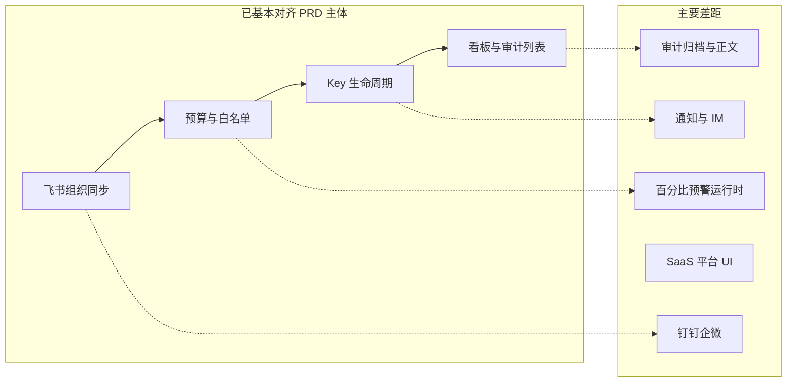

# PRD 与现有项目差距分析

> **对照基准**：[PRD.md](./PRD.md)（产品需求，本文不修改 PRD 原文）  
> **实现快照**：[Frontend.md](./Frontend.md)、[Backend.md](./Backend.md)、[Roadmap.md](./Roadmap.md)、代码库（截至文档修订时）  
> **工程 backlog**：[plan.md](./plan.md) · **架构收口**：[工程收口.md](./工程收口.md)

---

## 1. 本文定位

| 文档 | 写什么 | 读者 |
| --- | --- | --- |
| **PRD.md** | 产品需求与验收标准（权威，只读对照） | 产品 / 全员 |
| **本文** | PRD 与**当前实现**的差距解读、有意差异、排期建议 | 产品 / 研发 / 测试 |
| [Roadmap.md](./Roadmap.md) | 差距**状态简表**（✅⚠️❌） | 全员速查 |
| [plan.md](./plan.md) | 上线前工程任务与发布门禁 | 研发 |

**图例：** ✅ 已对齐 · ⚠️ 部分实现 · ❌ 未实现 · 🚫 PRD 已排除或刻意不做

---

## 2. 实现快照（相对 PRD 附录）

PRD 附录写明企业面 **16** 个控制台页面、**82** 个 REST 端点。与当前代码对照：

| 维度 | PRD 附录 | 当前实现 | 关系 |
| --- | --- | --- | --- |
| 管理台页面 | 16 页 | **16** 条 `ROUTE_DEFINITIONS`（org×3、budget×2、models×2、keys×4、dashboard×2、wallet×1、audit×2） | **一致** |
| 成员工作台 | 未单列 | **3** 条 `MEMBER_ROUTE_DEFINITIONS`（`/me`、`/me/keys`、`/me/call-logs`）+ `meApi` | **超出 PRD 附录** |
| 企业面 API | 82 端点 | §5.4 契约（见 [Frontend.md](./Frontend.md)） | 以契约为准维护 |
| 主链路 | 组织→预算→Key→调用→看板 | 飞书 + NewAPI 栈下可跑通 | 依赖联调签字（[plan.md](./plan.md) §1） |

**核心闭环（私有化 / 飞书路径）：** 凭证与导入 → 组织树 → 逐级预算与项目组 → 模型白名单 → Key 审批或自主创建 → Gateway 预检与反代 → webhook 入账 → 成本/用量看板与审计列表。

---

## 3. 分阶段对照（US 级）

### 3.1 P1 平台初始化

| US | PRD 摘要 | 状态 | 差距说明 |
| --- | --- | --- | --- |
| US-01 | 飞书/钉钉/企微凭证 | ⚠️ | **飞书**完整（测试连接、保存、字段映射）。**钉钉/企微**：前端类型与表单已有，后端 `factory.ForPlatform` → `platform not supported` |
| US-02 | 全量导入组织 | ✅ | 飞书全量/增量；失败详情与重试 |
| US-03 | 定时同步 | ⚠️ | Worker `org_sync`、删除保护阈值终止同步已有；**通知**仅 `NOTIFY_WEBHOOK_URL`，无 PRD 要求的手机/邮箱/IM 多渠道 |
| US-04 | 手动管理组织 | ⚠️ | 部门/成员 CRUD、批量转移、停用联动 Key 失效已实现；**邀请**有 API 与邀请态，**无真实邮件/短信**与独立激活页（`accept-invite` 后端有、前端未封装） |
| US-05 | 角色与权限 | ✅ | 预设 + 自定义角色、`manifest.json` + PDP、`authz_revision` 失效策略；实现强于 PRD 静态权限表描述（见 [权限管理.md](./权限管理.md)） |

**小结：** 私有化 + 飞书路径基本达标；多数据源与邀请激活是 P1 最大产品缺口。

---

### 3.2 P2 资源管控

| US | PRD 摘要 | 状态 | 差距说明 |
| --- | --- | --- | --- |
| US-07 | 逐级预算 + Budget Group | ✅ | 组织树分配、预留池、额度追加审批、虚拟项目组与组 Key；后端预算写路径已加事务与非负校验 |
| US-08 | 预警与超限策略 | ❌/⚠️ | `alert_rules` **仅 CRUD + 配置页**，无 Worker 在 80%/90% 触发通知；运行时封禁为 `consumed >= budget` **硬阻断**，不读百分比阈值；`overrun_policy.blockMessage` 存库，Gateway 403 **未完全消费**该文案 |
| US-09 | 模型白名单 | ✅ | 继承/自定义、部门粒度、Gateway precheck；`modelId` 契约已完成 |

**小结：** 预算与白名单是强项；**US-08 运行时行为**与 PRD 偏差最大。

---

### 3.3 P3 成员接入与调用

| US | PRD 摘要 | 状态 | 差距说明 |
| --- | --- | --- | --- |
| US-10 | Key/额度审批 | ⚠️ | 审批 Tab、通过建 Key/扣预留池、拒绝理由已实现；**IM 通知**审批人/申请人未做 |
| US-11 | 成员自主 Key | ✅ | 多 Key、额度、toggle/revoke/rotate/delete；Rotate Remote-first + NewAPI regenerate |
| US-12 | API 调用 | ⚠️ | Gateway 精确 path 白名单 + precheck + 入账；**依赖** `NEW_API_ENABLED` 与 NewAPI 栈；PRD **Anthropic `/v1/messages` 原生格式**未作一等契约验收 |

**小结：** 管理面 Key 生命周期已对齐；调用链生产硬化与双格式 API 仍有差距。

---

### 3.4 P4 运营与合规

| US | PRD 摘要 | 状态 | 差距说明 |
| --- | --- | --- | --- |
| US-13 | 成本看板 | ✅ | 指标、趋势、部门占比、下钻；另有用量分析页 `/dashboard/usage`（PRD 侧重成本） |
| US-14 | 审计追踪 | ⚠️ | 操作审计 + 调用审计（`usage_ledger`）；前端 **CSV** 导出；**热存→对象存储归档**未做；**prompt/response 全文**首版不提供 |
| US-15 | 敏感词合规 | 🚫 | PRD 正文与附录**产品范围已排除** |

**小结：** 列表级审计与看板达标；深度合规存储为长期差距。

---

## 4. PRD 未单列、但已实现的能力

这些不在 PRD 用户故事逐条描述中，但与交付和运维相关：

| 能力 | 现状 | 说明 |
| --- | --- | --- |
| **NewAPI 拓扑** | `adminport.Port` → NewAPISync；Gateway 数据面；webhook → `usage_ledger`；quota 换算 `pkg/newapiunits` | 见 [Backend-架构.md](./Backend-架构.md) §0、§7 |
| **Provider Key** | `/keys/provider` 管理上游 Channel | PRD 聚焦 Platform Key；属运营/技术配置 |
| **企业钱包** | `/wallet`、`company_recharge_lots`、充值订单半真 | 计费见 [Backend-计费模式.md](./Backend-计费模式.md)；PRD 角色表仅提及「充值」 |
| **成员工作台** | `/me/*` 三页 + `GET /me/dashboard` | 普通成员视角；PRD 隐含未单列 |
| **Identity JWT + PDP** | 无权限入 Token；`authz_revision` + 前端 stale 策略 | 强于 PRD US-05 简述 |
| **权限 grants 倒置** | `domain/grants.Normalizer` ← `infra/permission` | 域层不直接依赖 integration |
| **SaaS 后端** | `/api/platform/*` 约 11 端点 | 前端 **未接入** |
| **用量分析** | `/dashboard/usage` | US-13 扩展 |

---

## 5. PRD 有描述、实现明显缺失或偏弱

### 5.1 通知

| PRD 要求 | 现状 |
| --- | --- |
| 预警/超限：邮箱 + 手机 + IM | 仅 `NOTIFY_WEBHOOK_URL`；失败常静默（[工程收口.md](./工程收口.md) §1.2） |
| 审批结果 IM 通知 | 无 |
| 同步删除保护超阈值通知 | Webhook 事件有，无多渠道 |

### 5.2 数据源

| PRD 要求 | 现状 |
| --- | --- |
| 钉钉 / 企微 | 前端可选，后端不支持 |
| 切换平台后旧映射清理 | 切换 UI 有；清理逻辑需在多平台落地时复验 |

### 5.3 SaaS 与平台运营

| 能力 | 后端 | 前端 |
| --- | --- | --- |
| 平台企业 CRUD、代充、全局 Channel | ✅ `/api/platform/*` | ❌ 无 `/platform` 页面 |
| 企业超管邀请激活 | ✅ `company_invites`、`accept-invite` | ⚠️ 无独立页与 API 封装 |
| 一人多企业 / 企业自定义 Channel | ❌ | — |
| 真实支付 / 发票 | 订单半真；UI 占位 | — |

钱包前端：路由为 `/wallet`（**无** `/billing` 重定向）；`recharge` / `confirm` / `recharge-records` 已接入。

### 5.4 安全与合规（产品向）

| 项 | 现状 |
| --- | --- |
| 敏感词审查 | 🚫 US-15 排除 |
| 审计归档、不可篡改 | Postgres 账本；无对象存储管线 |
| 调用全文留存 | 仅元数据 + input snippet |
| OIDC / SSO | ❌（[Roadmap.md](./Roadmap.md) §9） |

技术安全债（密钥明文存储、Sync Key 鉴权等）见 [reviews/2026-07-07-backend-安全评估.md](./reviews/2026-07-07-backend-安全评估.md)（跨租户充值 C1 已修复）。

### 5.5 Gateway 与联调

| 项 | PRD | 现状 |
| --- | --- | --- |
| OpenAI + Anthropic 双格式 | US-12 | OpenAI 风格 `/v1/*` 精确白名单 |
| 联调签字 | 生产可用前提 | 脚本就绪；须 full-stack 跑通 `verify:gate` / `verify:integration`（[plan.md](./plan.md) §1） |
| Update PlatformKey 一致性 | Remote-first 铁律 | Update 配额/白名单为 DB-first + 回滚（[工程收口.md](./工程收口.md) §1.3，可选改） |

---

## 6. 有意与 PRD 不同（避免误判为 bug）

| 主题 | PRD 表述 | 实现选择 | 文档 |
| --- | --- | --- | --- |
| 计费单位 | 人民币（元） | 内部 **point** + lot 钱包；UI 换算展示 | [Backend-计费模式.md](./Backend-计费模式.md) |
| Key 存储 | `key_value` | `key_hash` 鉴权；`fullKey` 仅 create/rotate 响应一次（list 仍可能返回，见安全评估 H5） | [Backend-存储架构.md](./Backend-存储架构.md) |
| 超限 | 80%/90% 预警 + 100% 阻断 | 当前以 **额度用尽硬封** 为主；百分比预警层缺失 | [Backend-预算.md](./Backend-预算.md) §13 |
| 审批人 | 直属 TL | 具备 `budget:approve` 等权限的管理员，未必绑定组织树 TL | [权限管理.md](./权限管理.md) |
| API 契约 | PRD 附录列举 | **权威**：[Frontend.md](./Frontend.md) §5 + `api/types/`（部分计费类型在 `api/billing.ts`） | PRD 附录已声明 |

---

## 7. 验收与发布门禁（需人工复验）

| 领域 | PRD / plan 验收点 | 风险 |
| --- | --- | --- |
| US-03 | 同步日志「定时/手动」、变更详情 | 对照同步历史 UI 字段完整性 |
| US-04 | 邀请链接发出、未激活态 | 无真实投递渠道 |
| US-08 | 80%/90% 预警通知 | **运行时未实现** |
| US-08 | 自定义阻断文案 | 存库 ≠ Gateway 返回 |
| US-10 | TL/申请人 IM 通知 | 无 IM |
| US-12 | Anthropic messages 格式 | 未作契约验收 |
| US-14 | Excel 导出 | 前端 CSV |
| plan §5 | 产品模型手工验收 6 项 | 发布前须逐项勾选 |

---

## 8. 排期建议（产品视角）

与 [Roadmap.md](./Roadmap.md) 一致，供排期参考；具体任务写入 [plan.md](./plan.md)。

| 优先级 | 项 | 理由 |
| --- | --- | --- |
| **P0** | NewAPI/Gateway 联调签字 | US-12 生产前提 |
| **P0** | US-08 预警 Worker + 运行时阈值 | P2 核心承诺，当前仅 UI |
| **P1** | 通知可观测 + 至少一种可达渠道 | US-08、US-10 验收 |
| **P1** | 成员邀请真实激活链路 | US-04 |
| **P2** | 钉钉/企微 Provider | US-01 多平台 |
| **P2** | SaaS `/platform/*` 前端 | 后端已就绪 |
| **P3** | 审计归档、OIDC、真实支付、一人多企业 | 长期 |

**🚫 明确不做：** US-15 敏感词合规审查（与 PRD 一致）。

---

## 9. 相关文档

| 文档 | 用途 |
| --- | --- |
| [PRD.md](./PRD.md) | 产品需求（对照基准，不随实现改） |
| [Roadmap.md](./Roadmap.md) | 差距状态简表 |
| [plan.md](./plan.md) | 工程 backlog 与发布门禁 |
| [工程收口.md](./工程收口.md) | 架构/联调未完成项 |
| [Frontend.md](./Frontend.md) | 页面路由与 API 契约 |
| [Backend.md](./Backend.md) | 后端索引 |
| [Backend-架构.md](./Backend-架构.md) | 分层、NewAPI、adminport |
| [权限管理.md](./权限管理.md) | 鉴权与 RBAC |
| [reviews/](./reviews/) | 一次性安全评估等 |

---

## 10. 结论

> **PRD 附录所述 16 个管理台页面与当前前端路由一致；在此基础上增加了成员工作台与更完整的工程架构（NewAPI adminport、PDP、双轴计费）。主流程（飞书组织 → 预算白名单 → Key 全生命周期 → 看板/审计列表）已覆盖 PRD 主体。差距集中在：通知与多渠道触达、预算百分比预警运行时、非飞书数据源、SaaS 平台 UI、审计深度，以及 NewAPI/Gateway 生产联调——工程类见 plan / 工程收口，产品类见 Roadmap。**
