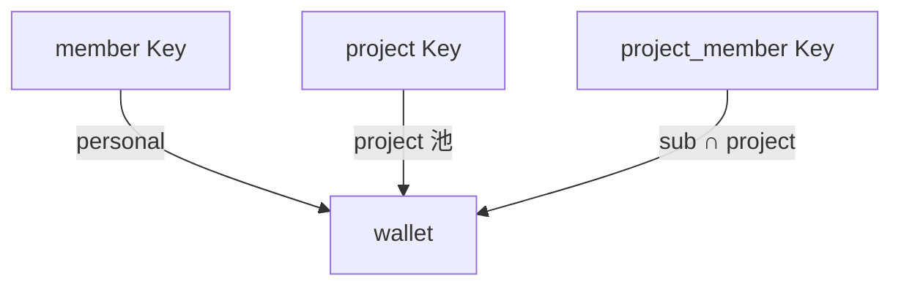

# Platform Key 产品设计

**Platform Key 专项**：`scope`、schema、Gateway 分支、UI、生命周期。

**不在本文：** 部门切蛋糕、personal、预留池、未分配、审批追加 → [预算分配与扣减.md](./预算分配与扣减.md)（PRD US-07 / US-10）。入账三轴、Projector → [Backend-预算.md](./Backend-预算.md)。**代码重构计划** → [Backend-预算执法重构.md](./Backend-预算执法重构.md)。

**实现状态（2026-07）：** 代码近似 **member / project 两 scope**（`scope` enrich 推导、无 `member_budget`）。终态：`scope` 入库、`project_members.member_budget`、三 scope 全量。

---

## 1. scope 模型

一种实体 `platform_keys`，`scope` **显式入库**。

| scope | UI | 必填 | 可选 | 计费链 |
| --- | --- | --- | --- | --- |
| `member` | 个人 Key | `memberId` | — | Key → personal → wallet |
| `project` | 项目 Key | `projectId` | `memberId`（负责人，不计费） | Key → project → wallet |
| `project_member` | 项目成员 Key | `memberId` + `projectId` | — | Key → sub_quota → project → wallet |



personal 用尽 → **阻断**；追加路径见 [预算分配与扣减.md](./预算分配与扣减.md) §7.2（非自动蹭未分配/预留池）。

**非法组合（拒绝创建）：**

| scope | 不允许 |
| --- | --- |
| `member` | 带 `projectId`；缺 `memberId` |
| `project` | 缺 `projectId` |
| `project_member` | 缺 `memberId` / `projectId`；不在 roster；`member_budget = 0` |

---

## 2. schema

```
platform_keys
├── scope              # member | project | project_member
├── member_id?, project_id?, budget, status
└── gateway_soft_*     # 预检热缓存（Key 创建同步写 + Projector 批末刷新）

project_members
├── project_id, member_id
└── member_budget      # 子额度 limit；0 = 仅名单，不可发 Key
```

**消费轴（三轴，无第四轴）：** `platform_key` · `member` · `project`；**不写** `org_node` consumed。部门花费见 `usage_ledger` 聚合。  
`project_member` 子额度已用 = Σ 该人在该项目下 project_member Key 的 `platform_key` consumed。详见 [Backend-预算执法重构.md](./Backend-预算执法重构.md)。

---

## 3. 项目内配置守恒（仅 project / project_member）

```
Σ member_budget + Σ active project-Key.budget ≤ projects.budget
Σ active project_member-Key.budget(人) ≤ 该人 member_budget
Σ active member-Key.budget(人) ≤ personal_budget(人)
```

`member_budget` **切走即锁定**（未用不可转给 project Key）。

**运行时恒等式**（配置合法时）：

```
project剩余 = projects.budget − project轴consumed
sub剩余(人) = member_budget − Σ platform_key.consumed（该人 project_member Key）
sub剩余(人) ≤ project剩余          ← 恒成立；不可能 sub宽、project窄
```

**例：** 项目 budget 5,000；张三 sub 500；李四 300；project Key 1,400 → 还可建 project Key 3,400。张三建 project_member Key 200 + 400 → ❌（600 > 500）。

---

## 4. Gateway BudgetChain

| scope | 预检 | 入账写轴 | Overrun 封禁 | `gateway_soft_*` |
| --- | --- | --- | --- | --- |
| `member` | `min(key, personal, wallet)` | `platform_key` · `member` | `member` 轴 → 该人 member Key | 同预检；创建 Key 时同步写入 |
| `project` | `min(key, project, wallet)` | `platform_key` · `project` | `project` 轴 → 该项目 project + project_member Key | 同预检 |
| `project_member` | `min(key, sub, project, wallet)` | `platform_key` · `project`；**不写** `member` | sub 聚合 ≥ `member_budget` → 该人该项目 Key | 同预检 |

`project` 可选负责人 **永不**写 `member` 轴。部门报表 / 预警读 `usage_ledger`（`department_id`），**不进**预检（见 [预算分配与扣减.md](./预算分配与扣减.md)）。`gateway_soft_remain IS NULL` → 放行。

**拦截文案（limiting 轴）：** `platform_key` Key额度用尽 · `member` 个人额度用尽（可申请追加）· `project` 项目预算用尽 · `project_member` 本项目额度用尽 · 钱包 企业余额不足。

**project_member 预检例：** 张三 sub 480/500（剩 20），project 1,200/5,000（剩 3,800），Key 剩 300 → `min(300,20,3800)=20` 放行 50（子额度卡瓶颈）。

---

## 5. 用法

| 场景 | scope | 规则 |
| --- | --- | --- |
| 日常开发 | `member` | 可多 Key；Σ ≤ personal |
| 项目内按人封顶 | `project_member` | roster + `member_budget > 0`；Σ Key ≤ sub |
| Job / CI | `project` | 一 Job 一 Key；**禁止** member / project_member |

| 时段 | Key | 花谁的钱 |
| --- | --- | --- |
| 上午通用开发 | `日常`（member） | personal |
| 下午项目功能 | `张三-ai`（project_member） | 项目 sub → 项目池 |
| 夜里 cron | `reconcile`（project） | 项目池 |

personal 用尽 **不影响** project / project_member Key。

---

## 6. UI

| 路由 | 内容 |
| --- | --- |
| `/keys/mine` | 本人 member + project_member Key |
| `/keys/platform` | 部门树 + Tab：个人 / 项目 / 项目成员 |
| 预算 · 项目 | 配 `member_budget`；建 project / project_member Key |

---

## 7. 生命周期

| 事件 | 动作 |
| --- | --- |
| 创建 / 启用 / 轮换 | active |
| 禁用 / 离项 / 超限 | disabled |
| 成员停用 | 其 member + project_member Key → disabled |
| 移出项目 | 该项目 project_member Key → disabled |
| 删除 Key | 未用额度释放回 personal / 项目可分配 / 成员 sub |

---

## 附录 · 术语

| 术语 | 含义 |
| --- | --- |
| Platform Key | 统一密钥；`scope` 区分计费链 |
| 成员项目子额度 | `project_members.member_budget` |
| 项目总池 | `projects.budget` |
