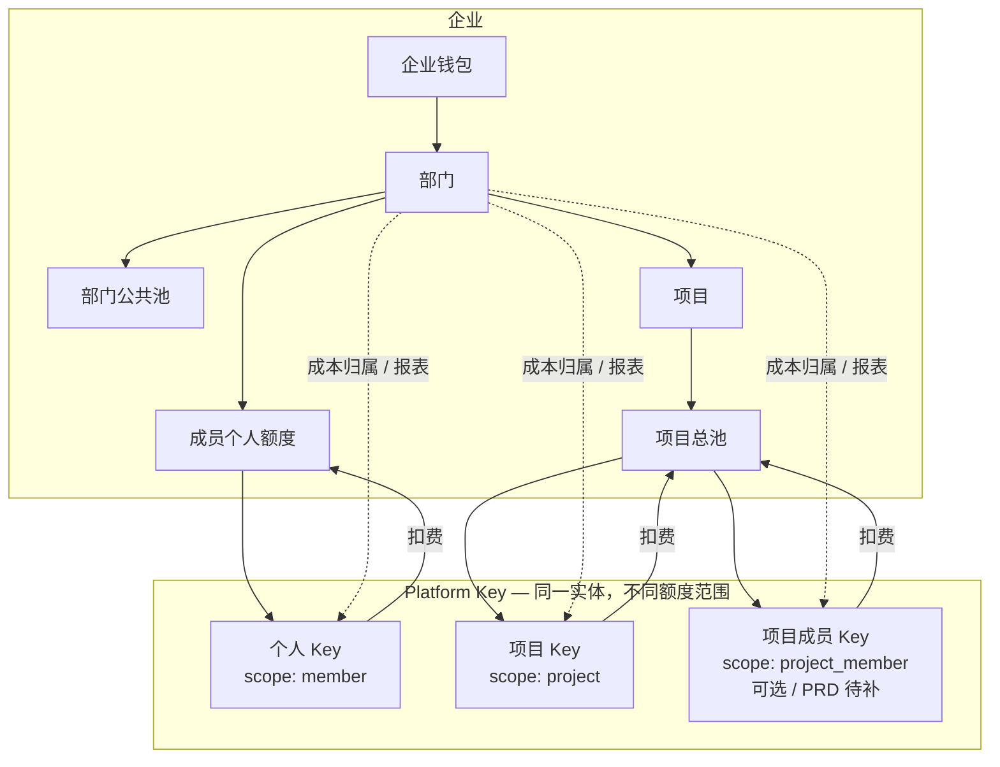
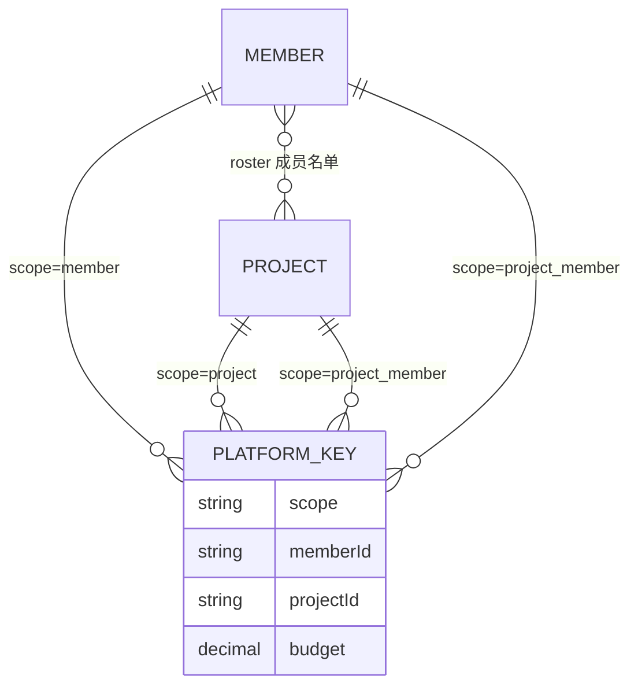
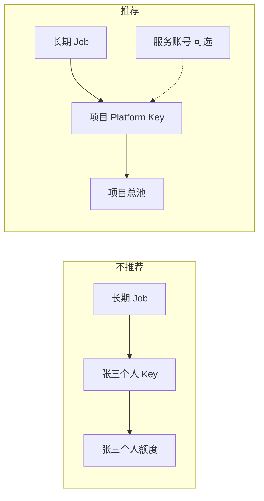
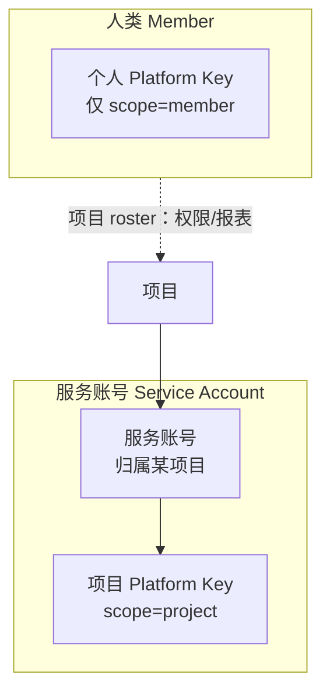
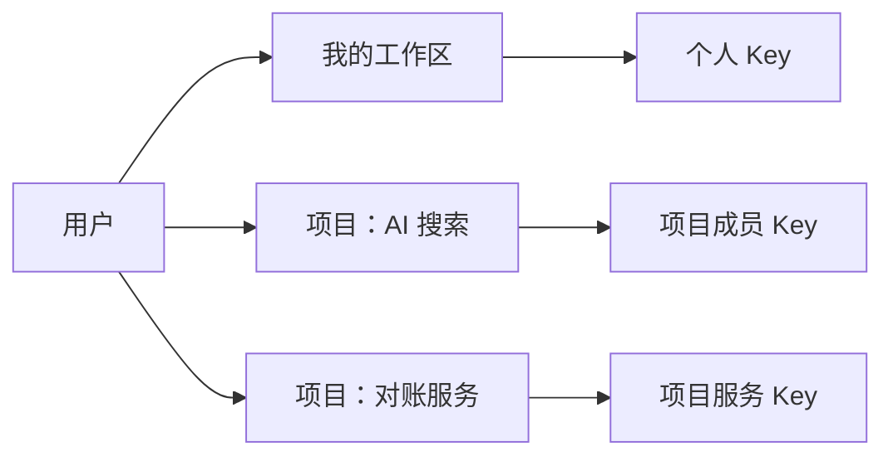
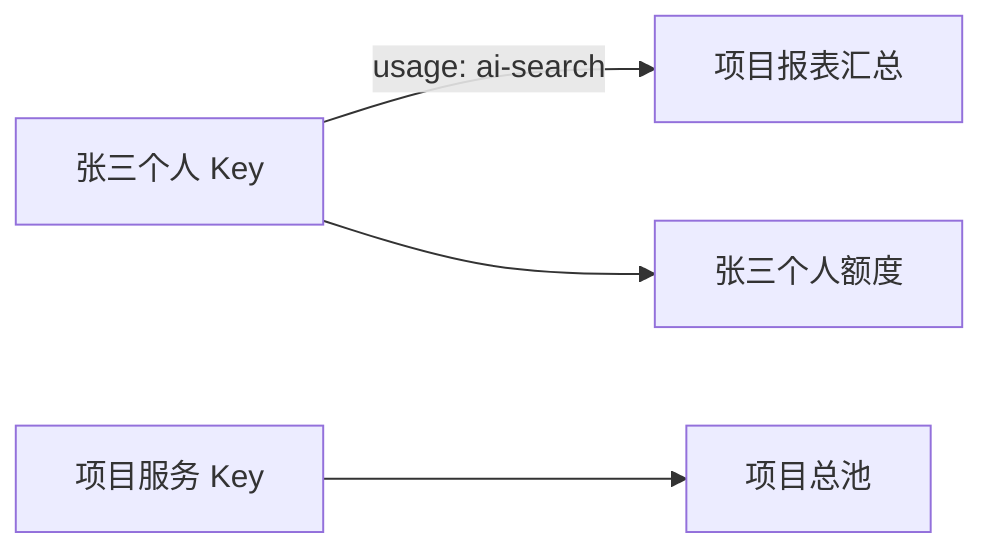
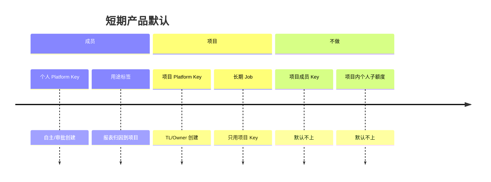
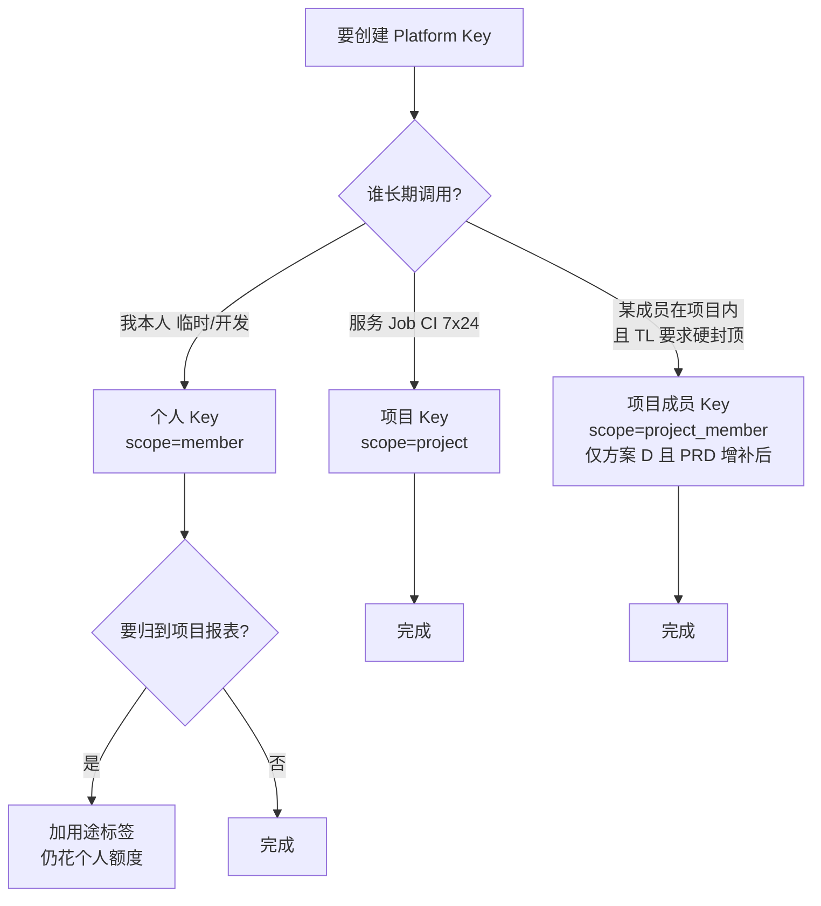

# Platform Key 产品设计

说明 **Platform Key** 的种类划分、命名约定、长期 Job 用法，以及如何避免「一人多把 Key 很混乱」。本文是**产品设计参考**，与 [PRD.md](./PRD.md) 对照使用；实现差距见文末。

**相关：** [PRD.md](./PRD.md) US-07 / US-10 / US-11 · [预算分配与扣减.md](./预算分配与扣减.md) · [Backend-存储架构.md](./Backend-存储架构.md) §8

---

## 1. 核心结论（30 秒）

| 原则 | 说明 |
| --- | --- |
| **统一实体** | 对外只有一种东西：**Platform Key**（平台 Key） |
| **内部分类** | 用 **额度范围（quota scope）** 区分种类，不是三种产品 |
| **默认少种类** | 普通人只应理解 **「个人 Key」** 和 **「项目服务 Key」** 两类 |
| **Job 用服务身份** | 长期运行任务用 **项目 Key**，不要绑在个人 Key 上 |
| **项目内按人硬控** | PRD 未定义；若要做，用 **工作区** 或 **服务账号** 降低混乱，不要平铺两种 Member Key |

---

## 2. 一张图：Platform Key 在系统里的位置



**Platform Key** 共享同一套能力：创建、禁用、轮换、删除、模型白名单、额度上限、调用审计。  
差别只在 **钱从哪个池扣** 以及 **可选归属字段**。

---

## 3. 三种额度范围（推荐命名）

### 3.1 对内（API / 代码）

| quota scope | 含义 | 必填字段 |
| --- | --- | --- |
| `member` | 个人 Key | `memberId` |
| `project` | 项目 Key（服务 / 共享） | `projectId` |
| `project_member` | 项目成员 Key（项目内分到人） | `memberId` + `projectId` |

> 代码 / API 统一 **`Project` / `projectId` / scope `project`**（方案 B，见 [Backend-架构.md](./Backend-架构.md)）。US-11 用途标签只用 **`appName`**，不用 `project` 词根。

### 3.2 对外（界面文案）

| scope | UI 中文 | UI English | PRD 现状 |
| --- | --- | --- | --- |
| `member` | **个人 Key** | Personal Key | ✅ US-11 |
| `project` | **项目 Key** | Project Key | ✅ US-07「组内独立 API Key」 |
| `project_member` | **项目成员 Key** | Project Member Key | ❌ 未定义 |

**不推荐的产品名：**

| 避免 | 原因 |
| --- | --- |
| 「项目共享 Key」 | 「共享」易与预留池、部门公共池混淆；UI 直接叫 **项目 Key** 即可 |
| 「部门 Key」 | 部门是成本归属，不是独立额度池 |
| 三种并列产品名 | 用户只应认识 **Platform Key**，列表用标签区分 |

### 3.3 数据模型（仍是同一张 Key）

```
Platform Key
├── id, name, keyPrefix, status, budget, modelWhitelist, …
├── departmentId          # 成本归属（必有，可 enrich）
├── scope                 # member | project | project_member
├── memberId?             # member / project_member
└── projectId?            # project / project_member
```



---

## 4. 每种 Key 干什么、花谁的钱

### 4.1 个人 Key（`member`）

| 维度 | 说明 |
| --- | --- |
| **谁创建** | 成员自主（US-11）或审批通过（US-10） |
| **谁使用** | 该成员本人 |
| **扣费池** | 成员 **部门个人额度**（+ 可选 Key 自身上限） |
| **典型场景** | 本地调试、脚本、IDE 插件、临时实验 |

**例子：** 张三个人额度 1,000 元，建 Key「日常开发」额度 300 元 → 调用从张三个人池扣，报表记在技术部。

### 4.2 项目 Key（`project`）

| 维度 | 说明 |
| --- | --- |
| **谁创建** | TL 或项目 Owner |
| **谁使用** | 服务、Job、CI、多人共用的集成 |
| **扣费池** | **项目总池**（不走任何成员个人额度） |
| **memberId** | 可选，表示负责人/审计联系人，**不扣其个人额度** |
| **典型场景** | 长期 Worker、定时对账、生产 API 网关 |

**例子：** 项目「AI 搜索」池 2,000 元，Key「search-worker-prod」额度 800 元 → 所有调用从项目池扣；李四维护这把 Key，但不花李四个人额度。

### 4.3 项目成员 Key（`project_member`，可选能力）

| 维度 | 说明 |
| --- | --- |
| **谁创建** | TL 或项目内成员（策略可配） |
| **谁使用** | 指定成员在该项目内的工作 |
| **扣费池** | **该成员在项目内的子额度** + 受 **项目总池** 约束 |
| **典型场景** | 大项目要硬控「张三在本项目最多花 500」 |

**例子：** 「AI 搜索」总池 2,000；张三项目内子额度 500。Key「张三-ai-搜索」花这 500，不花张三个人额度 1,000。

> **注意：** PRD 目前**没有**项目成员 Key 与项目内子额度；实现有 `memberIds` 和消耗报表，但无独立配额 story。见 §9。

---

## 5. 扣费规则对照（与预算文档一致）

| scope | 预检参与 | 不参与 |
| --- | --- | --- |
| `member` | Key、个人额度、部门公共池、钱包 | 项目池 |
| `project` | Key、项目总池、钱包 | 个人额度、部门公共池 |
| `project_member` | Key、成员项目子额度、项目总池、钱包 | 部门个人额度、部门公共池 |

**部门公共池用尽、项目还有余额** → `project` / `project_member` 的 Key **仍可用**（目标产品行为，见 [预算分配与扣减.md](./预算分配与扣减.md)）。

---

## 6. 长期运行的 Job 怎么做

### 6.1 原则



| 做法 | 评价 |
| --- | --- |
| Job 用**个人 Key** | ❌ 人离职 Key 失效、额度语义错误、交接困难 |
| Job 用**项目 Key** | ✅ 符合 US-07；费用归项目、成本记部门 |
| Job 用**项目成员 Key** | ⚠️ 仅当必须按人硬封顶且 Job 绑人时 |

### 6.2 推荐操作步骤

1. TL 创建或选定 **项目**，从部门切出足够月预算。  
2. 创建 **项目 Key**（scope = `project`），命名如 `reconcile-worker-prod`。  
3. 为 Key 设置额度 ≤ 项目可分配额；模型白名单仅含 Job 所需模型。  
4. Key 写入 **K8s Secret / CI 变量**，禁止进代码库。  
5. 配置预警（US-08）；池子到 80%/90% 通知 Owner。  
6. 定期 **轮换 Key** → 更新 Secret → 旧 Key 立即失效。

### 6.3 一个项目多个 Job

| 策略 | 优点 | 缺点 |
| --- | --- | --- |
| **一 Job 一 Key** | 按 Key 看用量、单独限额、单独轮换 | Key 数量多 |
| **多 Job 共用一 Key** | 简单 | 无法区分谁花的、泄露影响面大 |

**推荐：一 Job 一 Key。**

### 6.4 数字例子

| 项 | 数值 |
| --- | --- |
| 项目「对账服务」月预算 | 1,000 |
| Key `cron-daily` 上限 | 400 |
| 项目已用 | 350 |
| Key 已用 | 120 |

本通预估 50 元：

- 项目剩余 = 1,000 − 350 = **650**
- Key 剩余 = 400 − 120 = **280**
- 可花 = min(650, 280) = **280** → ✅ 放行

张三个人额度 2,000、已用 100 → **与本 Key 无关**。

---

## 7. 会不会很混乱？问题在哪

同一人可能同时持有：

| Key | 花谁的钱 |
| --- | --- |
| 个人 Key | 个人额度 |
| 项目成员 Key | 项目内子额度 |
| （维护）项目 Key | 项目总池（人是 Owner，不是「个人 Key」） |

用户不会记 `member` / `project_member`，只会问：

- 哪把是**我的**？
- 哪把是**项目的**？
- 钱花**我账上**还是**项目账上**？

**混乱根源：** 技术枚举平铺 + 两种都挂在人名下的 Key + PRD 未写清第三种。

---

## 8. 行业怎么做

| 产品 | 模型 | 对人是否友好 |
| --- | --- | --- |
| **OpenAI Platform** | Org → Project → 成员 + **项目级 Key**；预算在项目级，偏软限制 | 人少持多 Key；一个环境一把服务 Key |
| **LiteLLM** | Team 池 + **成员在 Team 内子预算**（`max_budget_in_team`）；Key 带 `user_id` + `team_id` | 控制台按 Team 组织；技术上多种 Key |
| **云 IAM** | **人类用户** vs **服务账号（Service Account）** | 心智清晰：人用人、机器用 SA |
| **Helicone** | 少量代理 Key + 请求头标 `User-Id` / 自定义属性 | Key 少，靠**调用上下文**分账 |

**共性：** 尽量不让人理解「两种 Member Key」；用 **工作区 / 身份（人 vs 机器）/ 调用上下文** 组织。

---

## 9. 五种产品方案

### 方案 A：双身份——成员 vs 服务账号（推荐中长期）



| 身份 | 能有什么 Key | 花谁的钱 |
| --- | --- | --- |
| **成员** | 仅 **个人 Key** | 个人额度 |
| **服务账号** | **项目 Key** | 项目池 |
| **长期 Job** | 绑定服务账号的 Key | 项目池 |

- **弱化或取消** `project_member`；人在项目里用 **个人 Key** + 用途标签归因到项目报表。  
- **对标：** GCP Service Account、GitHub App。

| 优点 | 缺点 |
| --- | --- |
| 人永远只有「我的 Key」 | 项目内按人硬控弱，靠报表 + 治理 |
| Job 不会和人的 Key 混 | 需新增服务账号实体 |

---

### 方案 B：工作区（Workspace）

用户不选 scope，先选 **工作区**：

| 工作区 | 建的 Key |
| --- | --- |
| **我的工作区** | `member` |
| **AI 搜索**（项目） | `project_member` 或项目策略 |
| **对账 Worker**（项目·服务） | `project` |



| 优点 | 缺点 |
| --- | --- |
| 类似 Slack/Notion 切换空间 | 需工作区抽象层 |
| 多项目时列表不散 | 仍可能同一工作区多 Key |

---

### 方案 C：少 Key，调用时带上下文

每人 **1～2 把 Key**；项目花费靠请求头 / SDK：

```
X-Project-Id: bg-ai-search
X-Usage-Label: feature-search
```

网关按**本次上下文**路由到个人池或项目池。

| 优点 | 缺点 |
| --- | --- |
| Key 数量少 | 与「每 Key 独立额度」的 PRD 不完全一致 |
| 对标 Helicone | Gateway、SDK 改动大 |

---

### 方案 D：保留三 scope，UI 不暴露枚举

创建向导只有三句话（第三种默认隐藏）：

1. **给我自己用** → 个人 Key  
2. **给项目里的服务 / Job** → 项目 Key  
3. **我在某项目里的配额** → 仅 TL 开启「项目内成员配额」后显示  

列表列显示 **「个人 · 日常」** vs **「AI 搜索 · 张三」**，不显示 `project_member`。

| 优点 | 缺点 |
| --- | --- |
| 能力最全（LiteLLM 式硬控） | 权力用户仍可能迷惑 |
| 贴近现有数据模型 | 要严格控制第三入口 |

---

### 方案 E：最简 PRD 对齐（推荐短期）

严格按 **当前 PRD**：

| 谁 | Key | 花谁的钱 |
| --- | --- | --- |
| **人** | 仅 **个人 Key**（US-11） | 个人额度 |
| **项目** | 仅 **项目 Key**（US-07） | 项目池 |
| **项目内消耗归因** | 个人 Key + **用途标签** | 钱仍算个人；报表汇总到项目 |



- **不会出现** memberKey + budgetMemberKey 双持。  
- 项目 `memberIds` = 名单 + 消耗展示，**不是**第二种 Key。

| 优点 | 缺点 |
| --- | --- |
| 与 PRD 一致，心智最简单 | 无法按人硬封顶项目预算 |
| 实现改动最小 | 大项目需管理规范 |

---

## 10. 方案对比总表

| 方案 | 一人两种「人 Key」？ | 项目按人硬控 | Job | 与现 PRD | 实现量 |
| --- | --- | --- | --- | --- | --- |
| **A 服务账号** | 否 | 弱 | 服务账号 + 项目 Key | 需增补 SA | 中 |
| **B 工作区** | 可分区不显乱 | 可选 | 项目工作区·服务 | 需增补 | 中高 |
| **C 少 Key+上下文** | 否 | 中 | 上下文标项目 | 偏离 PRD | 高 |
| **D 三 scope 藏枚举** | 可能 | 强 | 项目 Key | 需增补成员 Key | 中 |
| **E 最简 PRD** | **否** | 弱 | 项目 Key | **最贴** | 低 |

---

## 11. 推荐路径

### 11.1 短期（默认采用）：**方案 E**



**用户话术：**

- 「我的 Key」→ 个人 Key，花你的额度。  
- 「项目 / 服务 Key」→ 给 Job、流水线、生产集成，花项目预算。  
- 在项目里干活 → 仍用 **我的 Key**，选用途「AI 搜索」方便报表。

### 11.2 中期（企业要强控时）：**方案 A + B**

- 引入 **服务账号**（机器身份），项目 Key 挂在 SA 下，名称如 `对账-worker`，不叫「张三的项目 Key」。  
- 控制台用 **工作区** 切换「我的 / 某项目 / 某服务」。  
- 若必须「项目内每人 500 硬顶」，再开 **方案 D** 的第三入口，且仅在项目设置里出现。

### 11.3 决策树：该用哪种 Key？



---

## 12. 完整场景举例

### 场景 1：张三日常开发（方案 E）

| 项 | 值 |
| --- | --- |
| Key | `张三-日常`（个人 Key） |
| 个人额度 | 1,000，已用 200 |
| 参与项目 | AI 搜索（仅 roster，无第二把 Key） |
| 调用时 | 用途标签 `ai-search` |

- 扣费：张三个人池。  
- 报表：技术部 + 项目「AI 搜索」消耗汇总含张三。  
- **张三只有一把 Key**，不混乱。

### 场景 2：对账 Cron（方案 E）

| 项 | 值 |
| --- | --- |
| Key | `reconcile-cron`（项目 Key） |
| 项目池 | 1,000，已用 100 |
| 维护人 | 李四（memberId 仅审计） |

- 扣费：项目池。  
- 李四个人 Key 不受影响。  
- Job 重启换 Secret 即可轮换。

### 场景 3：大项目要卡每人 500（方案 D，PRD 待补）

| 项 | 值 |
| --- | --- |
| 项目池 | 5,000 |
| 张三项目内子额度 | 500 |
| Key | `张三-ai-搜索`（项目成员 Key） |

- 张三另有个人 Key `日常` 花个人 1,000。  
- 两把 Key **必须在 UI 分区**：「我的工作区」vs「AI 搜索工作区」。  
- 可花 = min(项目子额度剩余, 项目总池剩余, Key 剩余)。

### 场景 4：同一人两把 Key 如何不晕（方案 B UI）

**错误：** 扁平列表

| 名称 | 类型 |
| --- | --- |
| sk-…a1 | member |
| sk-…b2 | project_member |

**正确：** 按工作区分组

```
我的工作区
  └─ 日常开发          sk-…a1    个人额度 剩余 ¥800

项目：AI 搜索
  └─ 张三·本项目       sk-…b2    项目内额度 剩余 ¥320
  └─ search-api-prod   sk-…c3    项目服务   剩余 ¥1,200
```

---

## 13. 界面与文案建议

### 13.1 创建向导

**步骤 1 — 用途（不要写 scope）**

| 选项 | 实际 scope |
| --- | --- |
| 给我自己用 | `member` |
| 给项目里的服务或 Job | `project` |
| 我在某项目里的配额（高级） | `project_member` |

**步骤 2 — 选项目（若适用）**  
**步骤 3 — 额度、模型**

### 13.2 列表与拦截文案

| 事件 | 文案 |
| --- | --- |
| 个人额度用尽 | 「您的个人额度已用完」 |
| 项目池用尽 | 「项目预算已用完」 |
| 项目内子额度用尽 | 「您在本项目的额度已用完」 |
| 创建项目 Key 说明 | 「从项目预算扣除，不占用个人额度」 |
| Job 文档引导 | 「长期运行任务请使用项目 Key，勿使用个人 Key」 |

---

## 14. 与 PRD 对照

| PRD 内容 | 本文对应 |
| --- | --- |
| US-07 Budget Group + 独立 API Key | **项目 Key**（`project`） |
| US-07 组内不走个人额度 | 项目 Key、项目成员 Key 均不走**部门个人额度** |
| US-11 个人多 Key | **个人 Key**（`member`） |
| US-11「按项目/用途管理」 | **用途标签**，不是第二种项目 Key（方案 E） |
| ER：`MEMBER owns` + `PROJECT has` | 无 `project_member` 线 |
| 项目 `memberIds`（实现已有） | 方案 E：名单 + 报表；方案 D：+ 成员子额度 |

**PRD 未写：** 项目成员 Key、服务账号、项目内成员子额度、长期 Job 指引。

---

## 15. 实现现状与差距

| 项 | 现状 | 建议 |
| --- | --- | --- |
| Key 分类字段 | 前端 `type: 'member' \| 'project'` | enrich `type` 与 scope `project` 对齐 |
| 创建 Key | 可同时 `memberId` + `projectId` | 产品先定方案 E 或 D，再收紧校验 |
| 项目成员 UI | 有 roster + 成员消耗 | 方案 E 下仅报表，不配第二把 Key |
| 长期 Job | 无文档 | 引导用项目 Key |
| 服务账号 | 无 | 方案 A 中期引入 |

---

## 16. 阅读建议

| 文档 | 内容 |
| --- | --- |
| [PRD.md](./PRD.md) | 权威需求与验收 |
| [预算分配与扣减.md](./预算分配与扣减.md) | 扣费池、部门 vs 项目独立结算 |
| [Backend-存储架构.md](./Backend-存储架构.md) §8 | **`Project` 实体**与四层计量命名 |
| [plan.md](./plan.md) | 工程排期 |

---

## 附录：术语速查

| 术语 | 含义 |
| --- | --- |
| **Platform Key** | 企业内调用模型的统一密钥实体 |
| **quota scope** | Key 的额度范围分类 |
| **个人 Key** | scope = `member` |
| **项目 Key** | scope = `project`；PRD 组 Key |
| **项目成员 Key** | scope = `project_member`；可选，PRD 待补 |
| **服务账号** | 机器身份；方案 A 中期 |
| **工作区** | UI 组织维度；方案 B |
| **用途标签** | US-11 个人 Key 上的分类，用于报表，不新增扣费池 |
