> **企业级 LLM API 管理平台** — 从 API-KEY 到 Agent 消费的完整链路管控

---

## 目录

- [1. 产品概述](#1-产品概述)
- [2. P1 平台初始化](#2-p1-平台初始化)
- [3. P2 资源管控配置](#3-p2-资源管控配置)
- [4. P3 成员接入与调用](#4-p3-成员接入与调用)
- [5. P4 运营与合规](#5-p4-运营与合规)
- [附录：数据模型关系](#附录数据模型关系)
- [附录：契约对齐状态](#附录契约对齐状态)

---

## 1. 产品概述

### 1.1 定位与核心价值

TokenJoy 面向企业内部 AI 落地场景，解决多团队共用 LLM 资源时的三大核心问题：

| 问题域      | 解决方案                             |
| ----------- | ------------------------------------ |
| 💰 预算管控 | 逐级预算分配 + 超限策略 + 自然月重置 |
| 🔒 安全合规 | 模型白名单 + 审计日志 + 敏感词审查   |
| 📊 可观测性 | 成本看板 + 用量分析 + 调用追踪       |

### 1.2 产品形态

- **SaaS 服务**：平台托管多家 **企业（Company）**；企业内有多名 **成员（User）**；数据按企业行级隔离
- **私有化部署**：同一制品，`SUPPORT_SAAS=false`，隐含一家企业

架构与计费详见 [Backend-架构.md](./Backend-架构.md)、[Backend-预算.md](./Backend-预算.md)。

### 1.3 目标用户

**私有化 / 企业内**（一家公司）：

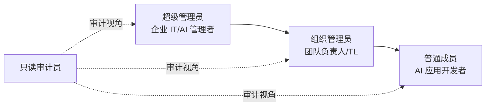

**SaaS** 在之上增加 **平台运营**（企业开户、全局 Channel、代充）；企业内角色与私有化一致。成员登录 TokenJoy 控制台，**不**登录 NewAPI；企业钱包在 NewAPI 侧以 **企业钱包用户**（`newapi_wallet_user_id`）存在（见 [Backend.md](./Backend.md) §2、[Backend-预算.md](./Backend-预算.md)）。

| 角色       | 范围       | 核心诉求                           |
| ---------- | ---------- | ---------------------------------- |
| 平台运营   | 全平台     | 企业 CRUD、代充、上游 Channel      |
| 企业超管   | 本企业     | 充值、企业钱包余额、组织、部门预算 |
| 部门负责人 | 本企业部门 | 审批 Key、本部门用量               |
| 普通成员   | 本企业     | 申请 Key、调用 API                 |

### 1.4 业务阶段与依赖关系

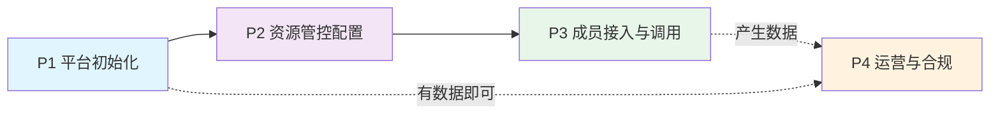

### 1.5 核心主线流程

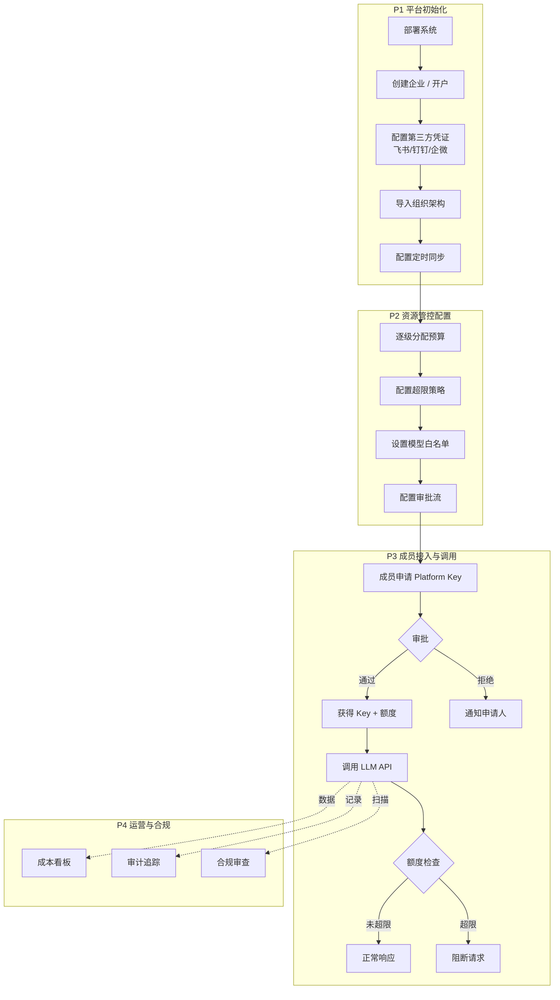

---

## 2. P1 平台初始化

### US-01: 配置第三方平台凭证

> **角色**：超级管理员 | **前置**：企业已创建（SaaS 下由平台开户或企业激活）

**目标**：配置飞书/钉钉/企微的开发者凭证，以便系统连接第三方平台拉取组织数据。

**操作流程**：

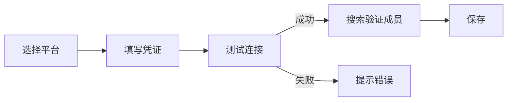

**各平台凭证字段**：

| 平台 | 必填字段                    |
| ---- | --------------------------- |
| 飞书 | App ID + App Secret         |
| 钉钉 | CorpID + AppKey + AppSecret |
| 企微 | CorpID + Secret + AgentID   |

> **实现状态：** 钉钉/企微见 [Roadmap.md](./Roadmap.md)。

**业务规则**：

- 一家企业只能接入一个第三方平台（凭证按 `company_id` 隔离）
- 保存前必须通过「测试连接」验证
- 凭证更换不影响已导入数据，后续同步仅处理新增/变更

**异常处理**：

- 凭证无效 → "凭证验证失败，请检查配置"，保存按钮不可用
- 网络不可达 → "无法连接到 [平台名]，请检查网络"
- 切换平台（已有凭证时）→ 确认弹窗"切换将清除当前凭证配置，是否继续？"
- 覆盖修改凭证 → 二次确认弹窗

**验收标准**：

| #   | GIVEN                                | WHEN                                       | THEN                                                   |
| --- | ------------------------------------ | ------------------------------------------ | ------------------------------------------------------ |
| 1   | 超管进入数据源页面，尚未配置任何平台 | 选择飞书，填写凭证，测试连接成功，点击保存 | 凭证保存成功，展示"当前数据源：飞书，状态：✓ 已连接"   |
| 2   | 超管填写了错误的凭证                 | 点击测试连接                               | 提示"凭证验证失败，请检查配置"，保存按钮不可用         |
| 3   | 已配置飞书凭证                       | 超管选择切换到钉钉                         | 弹出确认"切换将清除当前凭证配置，是否继续？"           |
| 4   | 已有飞书凭证配置                     | 修改 App Secret 并点击保存                 | 弹出二次确认，确认后保存成功，已导入的组织数据不受影响 |

---

### US-02: 全量导入组织架构

> **角色**：超级管理员 | **前置**：US-01 凭证已配置

**目标**：一键从第三方平台全量导入组织架构（部门树 + 成员信息）。

**业务规则**：

- 导入内容：部门树结构 + 成员基本信息 + 可配置扩展字段
- 重复导入：增量合并（新增加入，已有不变）
- 导入后成员默认角色："普通成员"
- 同步任务，需展示明确 loading 状态

**异常处理**：

- 部分成功 → 展示失败详情表格（姓名、工号、原因），支持单条/批量重试
- 网络中断 → 已导入数据保留，未导入标记失败
- 凭证失效 → 终止导入，提示"凭证已失效，请重新配置"

**验收标准**：

| #   | GIVEN                            | WHEN                              | THEN                                                           |
| --- | -------------------------------- | --------------------------------- | -------------------------------------------------------------- |
| 1   | 数据源已连接，系统中尚无组织数据 | 超管点击「执行全量导入」          | 同步拉取完成，展示"成功 X 人 / Y 个部门"，提示跳转组织架构页面 |
| 2   | 第三方平台部分成员数据异常       | 执行全量导入                      | 展示成功数和失败数，失败项展示姓名、工号、原因，提供重试按钮   |
| 3   | 系统已有上次导入的 120 名成员    | 第三方新增 5 人后再次执行全量导入 | 仅新增 5 人，原 120 人数据不变                                 |
| 4   | 导入结果中有失败项               | 超管点击某条失败记录的「重试」    | 重新尝试导入该条记录，成功则从失败列表移除                     |

---

### US-03: 定时同步策略

> **角色**：超级管理员 | **前置**：US-01 凭证已配置

**目标**：配置定时自动同步，组织架构自动与第三方保持一致。

**同步逻辑**：

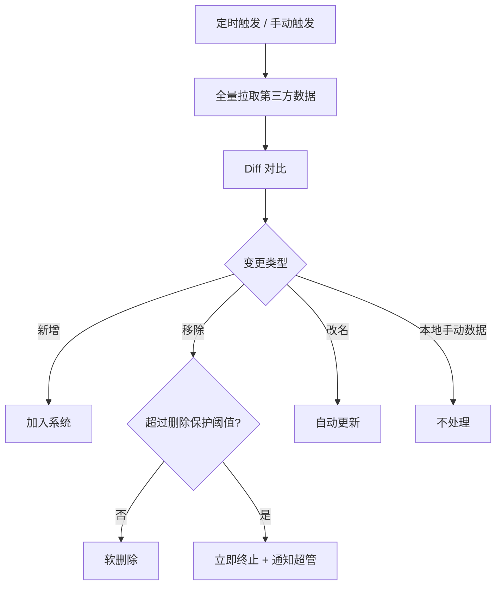

**配置项**：

| 配置             | 选项             | 默认值   |
| ---------------- | ---------------- | -------- |
| 同步频率         | 6 / 12 / 24 小时 | 12 小时  |
| 每日开始时间     | 自定义           | 02:00    |
| 成员删除保护阈值 | 自定义           | 10 人    |
| 部门删除保护阈值 | 自定义           | 5 个     |
| 通知方式         | 手机号 / 邮箱    | 两者均选 |

**业务规则**：

- 第三方导入的数据：以第三方为准（新增加入、移除软删除、改名跟随）
- 本地手动添加的数据：不受同步影响
- 人员移除策略：软删除（保留历史数据，标记停用）
- 同步记录持久化，展示每次同步的时间、类型（定时/手动）、结果、变更详情

**验收标准**：

| #   | GIVEN                                    | WHEN                         | THEN                                       |
| --- | ---------------------------------------- | ---------------------------- | ------------------------------------------ |
| 1   | 超管配置同步开始时间 02:00，频率 12 小时 | 到达 02:00                   | 系统自动执行同步，结果记录到同步日志       |
| 2   | 第三方新增 3 人、1 人离职、1 部门改名    | 定时同步执行                 | 新增 3 人加入，离职 1 人软删除，部门名更新 |
| 3   | 超管手动添加"特别项目组"                 | 定时同步（第三方无此部门）   | "特别项目组"保持不变，不被删除             |
| 4   | 删除保护阈值为 10 人                     | 同步 diff 发现需软删除 15 人 | 同步立即终止，不执行删除，通知超管         |
| 5   | 超管点击「立即同步一次」                 | 系统执行同步                 | 同步完成展示结果，日志标记为"手动"         |

---

### US-04: 手动管理组织架构

> **角色**：超级管理员 / 组织管理员

**目标**：手动创建/编辑/删除部门和成员，灵活调整组织结构。

**成员状态流转**：

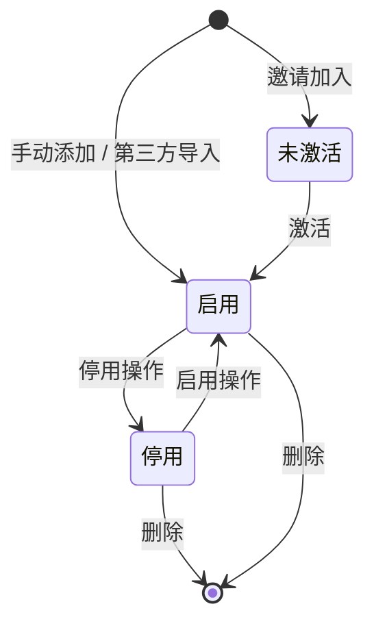

**部门管理**：

- 多级嵌套树结构，支持搜索
- 可添加（指定父节点）/ 编辑（改名）/ 删除（需先清空子部门和成员）

**成员管理**：

- 添加成员：手动填写信息（姓名、手机号等）
- 邀请成员：发送邀请链接，成员自行注册激活
- 编辑 / 停用 / 启用 / 删除

**批量操作**：导入/更新、转移部门、启用、停用、删除

**业务规则**：

- 超管和组织管理员操作权限一致
- 停用成员 → 其 Platform Key 同步失效
- 导入的成员无需激活直接可用；邀请的成员需激活
- 筛选支持：仅查看直属 / 全部成员

**验收标准**：

| #   | GIVEN                | WHEN                                 | THEN                                       |
| --- | -------------------- | ------------------------------------ | ------------------------------------------ |
| 1   | 超管在组织架构页面   | 点击"+ 添加"，输入部门名，选择父节点 | 部门创建成功，出现在树对应位置             |
| 2   | 超管选中某部门       | 点击"添加成员"，填写姓名、手机号     | 成员创建成功，默认角色普通成员             |
| 3   | 超管点击"邀请成员"   | 输入邮箱/手机号发送邀请              | 邀请链接发出，成员状态为"未激活"           |
| 4   | 成员张三当前启用     | 超管点击"更多 > 停用"                | 张三停用，其 Platform Key 同步失效         |
| 5   | 勾选多名成员         | 点击"批量转移部门"，选择目标部门     | 所有勾选成员移到目标部门                   |
| 6   | 部门下有子部门或成员 | 尝试删除该部门                       | 提示"请先移动或删除子部门和成员"，阻止删除 |

---

### US-05: 角色与权限管理

> **角色**：超级管理员 / 组织管理员

**目标**：管理角色并分配给成员，控制系统操作权限。

**预设角色**（不可删除/修改）：

| 角色       | 定位                        |
| ---------- | --------------------------- |
| 超级管理员 | 企业 IT/AI 管理者，全局权限 |
| 组织管理员 | 团队负责人，与超管权限一致  |
| 普通成员   | 默认保底角色，不可移除      |
| 只读审计员 | 平台运维，只读              |
| API 调用者 | 纯调用角色                  |

**自定义角色**：命名 + 勾选权限点，可编辑/删除

**业务规则**：

- 一个成员可拥有多个角色（权限取并集）
- 普通成员为保底角色，所有人默认拥有且不可移除
- 角色变更即时生效，无需重新登录
- 权限集由后端动态下发
- 组织管理员为全局角色，不限定到某个部门节点

**验收标准**：

| #   | GIVEN                         | WHEN                                                 | THEN                                                            |
| --- | ----------------------------- | ---------------------------------------------------- | --------------------------------------------------------------- |
| 1   | 超管进入角色管理页面          | 点击"+ 添加角色"，命名"预算审批员"，勾选权限点，保存 | 新角色出现在"自定义"分组                                        |
| 2   | 选中"超级管理员"角色          | 点击"添加角色成员"，选择张三                         | 张三出现在角色成员列表，权限即时生效                            |
| 3   | 张三拥有"组织管理员"角色      | 在成员列表中点击"删除"                               | 张三失去组织管理员权限，即时生效                                |
| 4   | 张三角色列表含"普通成员"      | 尝试移除                                             | 操作被阻止，提示"普通成员为保底角色，不可移除"                  |
| 5   | "预算审批员"角色下有 3 名成员 | 点击删除该角色                                       | 确认弹窗"该角色下有 3 名成员，删除后将失去对应权限，是否继续？" |

---

## 3. P2 资源管控配置

### US-07: 逐级预算分配

> **角色**：超级管理员 / 组织管理员（TL）

**目标**：在自己的预算额度内，向下级团队和成员分配预算，实现各级自主成本管控。

**预算分配模型**：

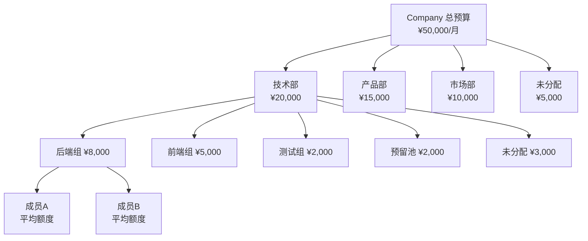

**业务规则**：

- 预算按组织树逐级下发：Company → 部门 → 子部门 → 成员
- 子节点预算之和 + 预留池 ≤ 父节点总额度（不允许超卖）
- 预算单位：人民币（元）
- 预算周期：自然月，月初自动重置（配置不变，已用清零）

**成员级预算**：

- TL 配置"平均额度/人"
- 预留池为共享额度，个人用完后需申请
- TL 审批通过后从预留池追加到成员个人额度

**Budget Group（虚拟项目组）**：

- 独立于组织树的预算分组
- 预算从创建团队额度中扣除
- 组内调用走 Group 独立额度，不走个人额度
- 拥有独立 API Key

**验收标准**：

| #   | GIVEN                                | WHEN                                                | THEN                                             |
| --- | ------------------------------------ | --------------------------------------------------- | ------------------------------------------------ |
| 1   | 技术部总预算 20000 元                | TL 分配后端 8000、前端 5000、测试 2000、预留池 2000 | 分配成功，未分配余额显示 3000 元                 |
| 2   | 技术部剩余可分配 3000 元             | TL 尝试给新子节点分配 5000 元                       | 提示"超出可分配额度，当前剩余 3000 元"，阻止操作 |
| 3   | 张三个人额度用完，预留池余 1500 元   | 张三提交额度申请 500 元，TL 审批通过                | 张三额度 +500，预留池 -500                       |
| 4   | 后端团队预算 8000 元，已分配 5000 元 | TL 创建 Budget Group"AI 搜索项目"并分配 2000        | BG 创建成功，后端剩余可分配变为 1000 元          |
| 5   | 当前为 6 月，各节点有不同使用量      | 进入 7 月 1 日                                      | 所有节点已用额度清零，分配配置保持不变           |

---

### US-08: 用量预警与超限策略

> **角色**：超级管理员

**目标**：全局配置预警阈值和超限阻断行为，成员提前感知额度紧张。

**运行时逻辑**：

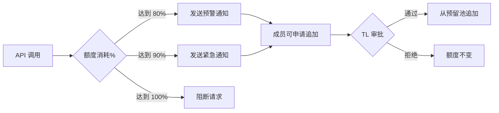

**业务规则**：

- 全局统一配置，所有组织节点和成员生效
- 预警阈值可添加多个
- 超限行为固定为"直接阻断"（无降级路由、无超限放行）
- 通知方式：邮箱 + 手机号 + IM（跟随数据源平台）
- 阻断提示文案可自定义
- 通知发送失败不影响阻断逻辑

**验收标准**：

| #   | GIVEN                          | WHEN                                 | THEN                                 |
| --- | ------------------------------ | ------------------------------------ | ------------------------------------ |
| 1   | 超管进入超限策略页             | 添加阈值 80%、90%，选择邮箱+IM，保存 | 配置保存成功，全局生效               |
| 2   | 预警阈值 80%，张三额度 1000 元 | 张三累计消耗达 800 元                | 系统通过邮箱和 IM 向张三发送预警     |
| 3   | 张三额度 1000 元，未获追加     | 消耗达 1000 元后再次调用             | 请求阻断，返回自定义错误提示         |
| 4   | 成员邮箱不可达                 | 触发预警                             | 记录通知失败日志，不影响后续阻断逻辑 |

---

### US-09: 模型白名单管理

> **角色**：超级管理员 / 组织管理员

**目标**：管理平台可用模型，为各部门配置白名单，控制模型使用范围。

**模型分类**：

- **系统模型**：平台提供的主流模型（OpenAI、Anthropic、DeepSeek 等）
- **企业自定义模型**：需填写 API Key + Base URL + 模型名称 + 价格

**白名单继承逻辑**：

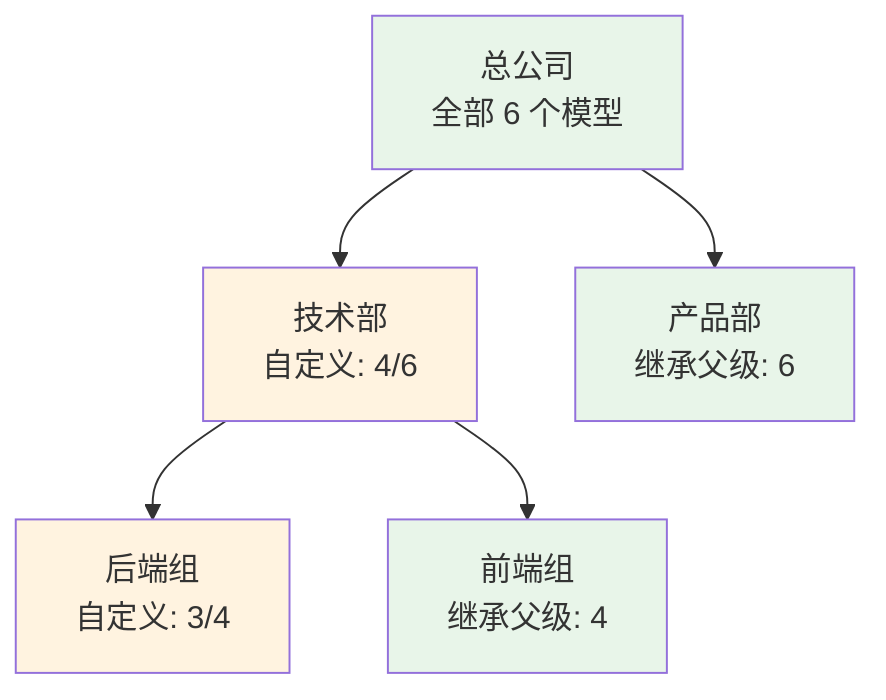

**业务规则**：

- 默认继承父级，可切换为"自定义"
- 自定义时只能从父级白名单中选择（只能缩小，不能扩大）
- 父级缩小白名单 → 子级自动同步缩小
- 控制粒度：部门级别（不到成员级别）
- API 调用必须指定模型，不指定 → 返回错误
- 指定模型不在部门白名单内 → 返回错误

**验收标准**：

| #   | GIVEN                         | WHEN                                | THEN                                       |
| --- | ----------------------------- | ----------------------------------- | ------------------------------------------ |
| 1   | 超管进入可用模型页面          | 点击"+ 添加模型"，填写信息，保存    | 模型出现在企业自定义列表，状态可用         |
| 2   | 总公司白名单 6 个模型         | 选择技术部，切换"自定义"，勾选 4 个 | 技术部白名单生效，显示"4/6 模型"           |
| 3   | 技术部白名单 4 个模型         | 配置后端组白名单                    | 只能从技术部 4 个中选，看不到其余 2 个     |
| 4   | 技术部含 GPT-4o，后端组也选了 | 超管从技术部移除 GPT-4o             | 后端组白名单自动移除 GPT-4o                |
| 5   | 后端组白名单不含 GPT-3.5      | 后端组成员调用 model=GPT-3.5        | 返回错误"该模型不在您所属部门的可用范围内" |
| 6   | 成员发起 API 调用             | 请求中未包含 model 参数             | 返回错误"请指定模型"                       |

---

## 4. P3 成员接入与调用

### US-10: 审批流（Key 申请 & 额度追加）

> **角色**：普通成员（发起） / 组织管理员（审批）

**目标**：通过审批流获取 Platform Key 或追加额度。

**审批流程**：

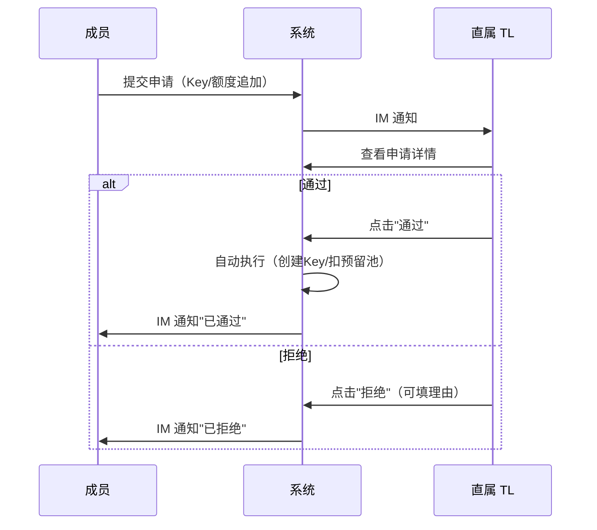

**两种审批场景**：

| 场景     | 申请信息                         | 通过后系统动作               |
| -------- | -------------------------------- | ---------------------------- |
| Key 申请 | 申请人、申请理由、需要访问的模型 | 自动创建 Platform Key 并分配 |
| 额度追加 | 申请人、当前/已用额度、申请金额  | 从预留池扣除并追加到个人额度 |

**业务规则**：

- 单人审批（直属 TL），无多级审批
- 无超时自动处理机制
- 拒绝理由为选填
- 通知方式：IM（跟随数据源平台）
- 审批入口复用组织架构页面"待审批：X 去审批 >"

**验收标准**：

| #   | GIVEN                                   | WHEN                                         | THEN                                              |
| --- | --------------------------------------- | -------------------------------------------- | ------------------------------------------------- |
| 1   | 张三尚无 Platform Key                   | 在个人 Key 页点申请，填理由，选 GPT-4o，提交 | 申请提交成功，TL 收到 IM 通知                     |
| 2   | TL 在审批中心看到张三的 Key 申请        | 点击"通过"                                   | 系统自动创建 Key 分配给张三，张三收到"已通过"通知 |
| 3   | 李四个人额度 1000 已用 900，预留池 1500 | 李四提交追加 500 元申请，TL 通过             | 李四额度 +500，预留池 -500                        |
| 4   | 预留池剩余 200 元，成员申请追加 500     | TL 尝试通过                                  | 提示"预留池剩余 200 元，不足以覆盖"，操作阻止     |
| 5   | TL 收到王五的 Key 申请                  | 点击"拒绝"，填写理由"暂无需要"               | 王五收到 IM"申请被拒绝，理由：暂无需要"           |
| 6   | 后端组白名单不含 GPT-3.5                | 后端组成员申请 Key 选 GPT-3.5                | 提示"该模型不在您部门的可用范围内"，无法提交      |

---

### US-11: 自主管理 Platform Key

> **角色**：普通成员

**目标**：在个人额度内自主创建多个 Key，按项目/用途灵活管理 API 调用。

**Key 生命周期**：

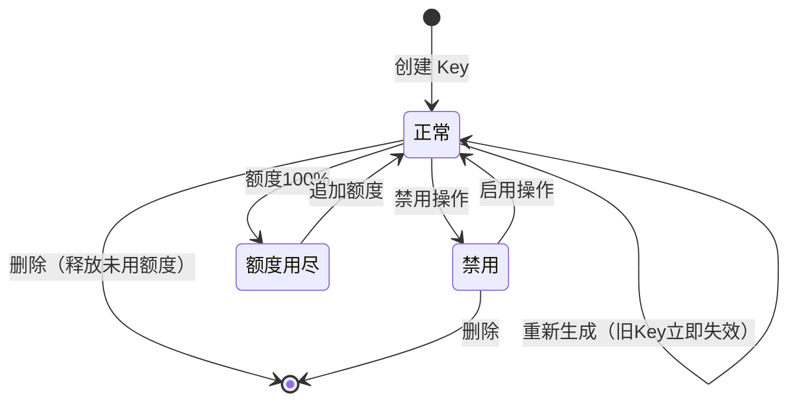

**业务规则**：

- 无需审批，在个人额度范围内自主创建
- 创建时选择绑定模型白名单（`modelWhitelist[]`，不超出部门白名单）+ 分配额度（不超出个人剩余）
- 一个成员可有多个 Key，各 Key 独立计费
- Key 额度用完 → 该 Key 不可用（其他 Key 不受影响）
- Key 额度之和不能超出个人总额度

**管理操作**：

- 查看 Key 值（脱敏展示，支持复制完整值）
- 禁用 / 启用
- 重新生成（旧 Key 立即失效，新 Key 继承配置）
- 删除（释放未用额度回个人池）
- 编辑（调整绑定模型、额度分配）

**验收标准**：

| #   | GIVEN                                          | WHEN                             | THEN                                          |
| --- | ---------------------------------------------- | -------------------------------- | --------------------------------------------- |
| 1   | 个人剩余额度 380 元，白名单含 GPT-4o           | 创建 Key，选 GPT-4o，分配 200 元 | Key 创建成功，个人剩余变为 180 元             |
| 2   | 个人剩余额度为 0                               | 点击"+ 创建 Key"                 | 提示"额度不足，请先申请追加"                  |
| 3   | Key A 额度 200 已用满；Key B 额度 400 已用 100 | 通过 Key A 调用                  | 返回"该 Key 额度已用尽"；Key B 不受影响       |
| 4   | 成员有 Key sk-\*\*\*\*a3f2                     | 点击"重新生成"并确认             | 生成新 Key，旧 Key 立即失效，额度和模型继承   |
| 5   | Key B 额度 400 已用 100，个人剩余可分配 0      | 删除 Key B                       | Key 移除，个人剩余可分配 +300（未用部分释放） |
| 6   | Key A 绑定 GPT-4o，白名单含 DeepSeek-V3        | 编辑 Key A 模型改为 DeepSeek-V3  | 修改成功，后续调用走 DeepSeek-V3              |

---

### US-12: API 调用

> **角色**：普通成员 / API 调用者 | **纯 API 行为，无 UI**

**目标**：使用 Platform Key 通过标准格式调用 LLM 模型。

**系统执行链路**：

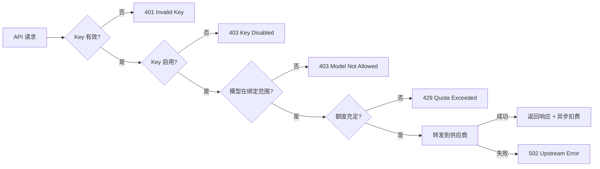

**兼容格式**：

- ✅ OpenAI API 格式（chat completion）
- ✅ Anthropic API 格式（messages）

**业务规则**：

- 调用时必须指定模型（不指定返回错误）
- 按实际 token 消耗计费（异步扣费）
- 调用记录被系统记录（供 P4 可观测性使用）

**验收标准**：

| #   | GIVEN                             | WHEN                            | THEN                                    |
| --- | --------------------------------- | ------------------------------- | --------------------------------------- |
| 1   | 有效 Key，绑定 GPT-4o，额度充足   | OpenAI SDK 格式 chat completion | 返回响应，已用额度增加对应费用          |
| 2   | 有效 Key，绑定 Claude 4，额度充足 | Anthropic SDK 格式 messages     | 返回响应，已用额度增加对应费用          |
| 3   | 使用不存在的 Key                  | 发起调用                        | 401 "Invalid API Key"                   |
| 4   | Key 绑定 GPT-4o                   | 指定 model=DeepSeek-V3          | 403 "Model not allowed for this key"    |
| 5   | Key 额度 600 已用 600             | 发起调用                        | 429 "Quota exceeded"                    |
| 6   | 供应商服务不可用                  | 发起调用                        | 502 "Upstream error"                    |
| 7   | 成功完成一次调用                  | 调用完成                        | 系统记录时间、Key、模型、token 数、费用 |

---

## 5. P4 运营与合规

### US-13: 成本看板

> **角色**：超级管理员

**目标**：全局掌握 LLM 使用成本、趋势和效率指标，支撑预算决策。

**看板结构**：

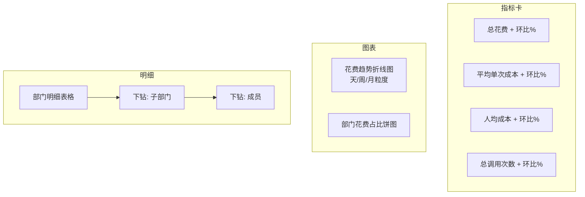

**业务规则**：

- 数据来源为 US-12 中记录的调用数据
- 环比基于同等时间长度对比（本月 vs 上月，本周 vs 上周）
- 下钻层级：部门 → 子部门 → 成员
- 时间维度：本月 / 上月 / 近 7 天 / 自定义范围

**验收标准**：

| #   | GIVEN              | WHEN            | THEN                                               |
| --- | ------------------ | --------------- | -------------------------------------------------- |
| 1   | 管理者进入成本看板 | 默认展示本月    | 指标卡展示总花费、平均单次、人均、调用次数及环比   |
| 2   | 选择"本月"         | 查看趋势图      | 折线图按天展示花费变化                             |
| 3   | 当月多部门有调用   | 查看饼图        | 展示各部门花费占比百分比                           |
| 4   | 明细表格展示技术部 | 点击"下钻"      | 展示子部门（后端/前端/测试）的花费、调用次数、人均 |
| 5   | 当前展示本月       | 切换为"近 7 天" | 所有指标卡、图表、表格刷新为近 7 天数据            |

---

### US-14: 审计追踪

> **角色**：超级管理员 / 只读审计员

**目标**：追踪所有操作记录和 API 调用记录，满足企业审计合规要求。

**两类审计**：

| 维度     | 操作审计                                           | 调用审计                                |
| -------- | -------------------------------------------------- | --------------------------------------- |
| 记录范围 | Key 增删、预算变更、权限变更、组织变动、白名单变更 | 所有 API 调用                           |
| 记录字段 | 时间、操作人、操作类型、内容详情                   | 时间、调用人、Key、模型、Token 数、费用 |
| 内容详情 | 操作快照                                           | prompt + response（可配置关闭）         |

**存储策略**：

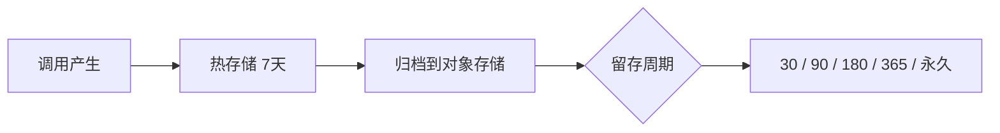

**业务规则**：

- 审计记录不可篡改、不可删除
- 只读审计员只能查看，无修改权限
- 内容留存开关在系统设置中配置
- 筛选：时间范围、操作人/调用人、操作类型/模型、关键词
- 支持导出 CSV/Excel

**验收标准**：

| #   | GIVEN                | WHEN                     | THEN                                                     |
| --- | -------------------- | ------------------------ | -------------------------------------------------------- |
| 1   | 超管进入操作审计 tab | 查看列表                 | 展示所有管理操作记录，可点击查看详情                     |
| 2   | 超管进入调用审计 tab | 查看列表                 | 展示所有 API 调用记录（时间、调用人、模型、Token、费用） |
| 3   | 内容留存开启         | 点击某条调用记录"查看"   | 展示完整的输入 prompt 和输出 response                    |
| 4   | 内容留存关闭         | 点击某条调用记录"查看"   | 只展示元数据，无输入输出内容                             |
| 5   | 操作审计有大量记录   | 筛选：近 7 天 + 预算变更 | 列表只展示近 7 天的预算变更记录                          |
| 6   | 当前列表有筛选结果   | 点击"导出"               | 下载 CSV/Excel，内容与列表一致                           |
| 7   | 只读审计员登录       | 进入审计追踪             | 可查看所有记录，但无编辑/删除入口                        |

---

## 附录：数据模型关系

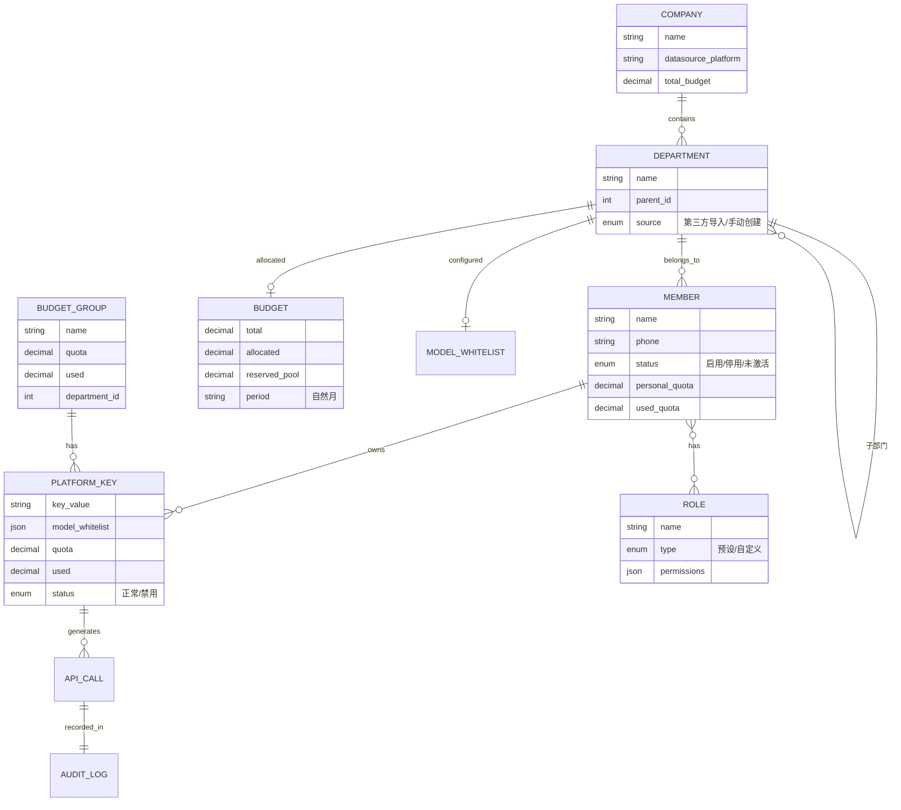

---

## 附录：契约对齐状态

管理面 REST（**82** 端点）以 [Frontend.md](./Frontend.md) 为准；企业面 16 页均已对接。**不含 US-15（合规审查）**；SaaS 后端 11 端点已实现、前端未接入。

| 文档                         | 职责                 |
| ---------------------------- | -------------------- |
| [Frontend.md](./Frontend.md) | 端点与类型权威来源   |
| [Roadmap.md](./Roadmap.md)   | PRD 与实现的剩余差距 |

**契约不覆盖（由其他系统承担）：** IM/邮件通知、审计归档基础设施。企业开户、Relay、企业钱包与 SaaS API 见 [Backend.md](./Backend.md) §2、[Backend-架构.md](./Backend-架构.md)。

PRD 或契约变更时，先更新 [Frontend.md](./Frontend.md) 与 `api/types/`，再同步 [Roadmap.md](./Roadmap.md)。
