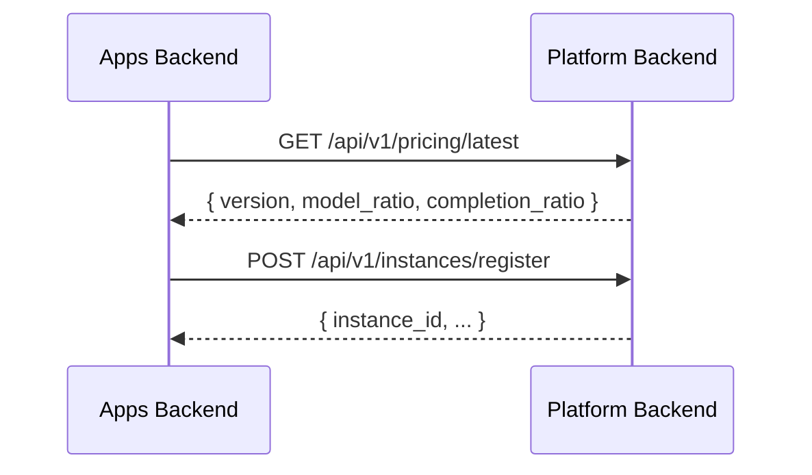

# ADR: 三版本单代码库策略

## 决策

TokenJoy 是两个独立产品，共三个部署形态，放在同一 monorepo：

| 产品 | 部署形态 | 用户 | 核心职责 |
|------|---------|------|---------|
| **TokenJoy** | Local（私有化） | 客户管理员 | Key 管理、预算、组织、审计、自定义模型、Channel |
| **TokenJoy** | SaaS（公有云） | SaaS 客户 | Local 功能子集，无自定义模型/Channel |
| **Platform** | 中心部署 | TJ 运营团队 | 供应商管理、模型目录、合同、采购订单、定价发布、实例管理、计费 |

---

## 仓库结构

```
mytokenjoy/
├── apps/                    ← 客户侧产品（Local + SaaS）
│   ├── frontend/            ← React SPA（Local + SaaS 共用）
│   ├── backend/             ← Go 后端（Local + SaaS，单 binary）
│   ├── newapi/              ← NewAPI 构建（local variant）
│   └── dev-mock-llm/
│
├── platform/                ← 内部管理后台
│   ├── frontend/            ← 管理页面（React SPA）
│   ├── backend/             ← Go 后端（独立 binary，独立 DB）
│   └── newapi/              ← NewAPI 构建（platform variant）
│
├── packages/                ← 跨 app/跨语言共享
│   └── contracts/           ← 共享契约（permission、notification 等）+ codegen
│
├── docs/
└── scripts/
```

---

## 核心规则

1. **两个产品，两个边界** — `apps/` 是客户的，`platform/` 是内部的
2. **Local ↔ SaaS** — 同一前后端，运行时 `SupportSaas` flag 分流
3. **跨产品通信仅 HTTP API** — 不共享 DB、不共享 domain 实现代码
4. **共享层放 packages/** — 任何需要跨 app 或跨语言共享的契约、类型放这里
5. **制品交付** — 客户只拿 `apps/` 的 image，`platform/` 永不出门
6. **独立演进** — platform 不阻塞客户侧发版，反之亦然

---

## 版本分流

### Apps Backend

| 环境变量/机制 | 作用 |
|-------------|------|
| `cfg.SupportSaas` | Local vs SaaS 业务分流 |
| `RequireSelfHostedMode` | Local-only 路由守卫 |
| `RequireSaasMode` | SaaS-only 路由守卫 |
| `integration/platform/` | 调 Platform 定价 API |
| `worker/pricingsync/` | 定时同步定价 |

### Platform Backend

独立 binary，独立 DB schema。暴露：
- `GET /api/v1/pricing/latest` — 给 Local/SaaS 同步定价
- `POST /api/v1/instances/register` — 实例注册
- 其余路由仅 Platform UI 使用

---

## 跨产品通信



接口极少，耦合极低。两边独立开发、独立部署。

---

## 构建产物

| 产物 | 来源 | 交付 |
|------|------|------|
| `tokenjoy/frontend` | `apps/frontend/` | 客户 |
| `tokenjoy/backend` | `apps/backend/` | 客户 |
| `tokenjoy/newapi-local` | `apps/newapi/` | 客户 |
| `tokenjoy/platform-ui` | `platform/frontend/` | 仅内部 |
| `tokenjoy/platform-backend` | `platform/backend/` | 仅内部 |
| `tokenjoy/newapi-platform` | `platform/newapi/` | 仅内部 |

---

## 决策理由

| 决策 | 为什么 |
|------|--------|
| Platform 独立后端 | 领域完全不同（SRM vs Key 管理），放一起零共享却增加认知负担 |
| 同一 monorepo | 原子提交、共享 CI、共享 packages，无独立团队需求 |
| Local/SaaS 不拆 | UI 重叠 90%，一个 flag 足够 |
| HTTP API 通信 | 耦合最低，独立开发/部署/重启 |
| 共享 patch 各自维护 | patch 极轻，不值得抽共享层 |
