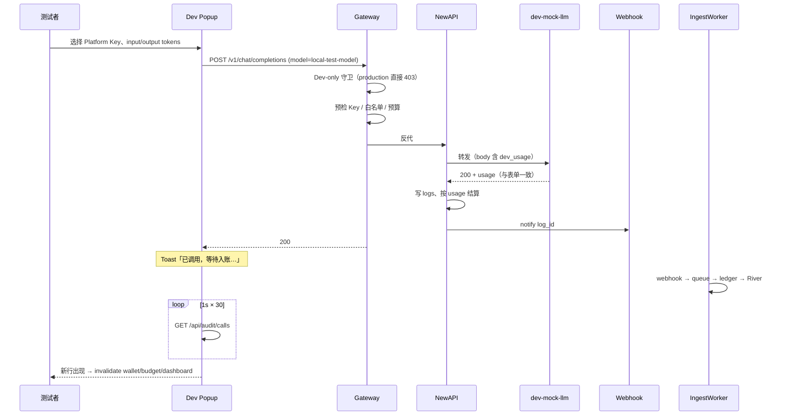

# 本地模式 — 模拟消耗 Popup

> Dev Header「模拟消耗」→ 用 **`local-test-model`** 跑通 **Gateway → NewAPI → Ingest → 投影** 全链路，在 audit / wallet / budget 验收。  
> 唯一「假」的部分是上游 LLM：`dev-mock-llm` 按表单回显 `usage`。  
> Ingest 机制见 [Backend-Ingest架构.md](../Backend-Ingest架构.md)。

---

## 测试在验证什么

| 要验证的能力 | 本方案如何覆盖 |
| --- | --- |
| Gateway 预检（Key、白名单、预算） | Popup 发真 `POST /v1/chat/completions` |
| Gateway 生产守卫 | `local-test-model` 在 `DEPLOY_ENV=production` 硬拦截 403 |
| NewAPI 结算与 logs | mock 返回可控 `usage` |
| Webhook → IngestWorker → ledger | NewAPI 正常 notify |
| River 投影（audit / wallet / budget） | Popup 轮询 `auditApi.getCalls` 后 invalidate |

**不验证**：真实模型推理。  
**不新增**：除 `GET /api/dev/platform-keys/{id}/bearer`（**仅本地开发**：`DEPLOY_ENV=local` + `KeysAdmin`；staging/production 路由不注册）外的 Backend handler。

---

## 测试如何运作（逐步）



### 1. 准备环境

```bash
pnpm start          # postgres + redis + new-api + backend + frontend + dev-mock(:8765)
# reset 后 token 由 pnpm docker:reset / pnpm bootstrap:local 写入 apps/backend/.env
apps/newapi/scripts/setup-dev-mock-channel.sh   # 若 bootstrap 未成功配 channel，可手动再跑
```

| 项 | 说明 |
| --- | --- |
| **mock** | `pnpm start` 已内置 |
| **NewAPI** | `pnpm start` 已内置（Docker `:3000`）；`pnpm docker:reset` / `pnpm bootstrap:local` 自动写 `apps/backend/.env` 的 `NEW_API_ADMIN_TOKEN`；另需 `NEW_API_ENABLED` + `NEW_API_GATEWAY_ENABLED`（`.env.development` 默认已开） |
| **catalog** | demo seed 含 `local-test-model`（ID 1）；生产模型 ID 从 100 起；旧库需 `pnpm docker:reset` 或重建后 reseed |
| **channel** | 模型 `local-test-model`，`base_url` → `http://host.docker.internal:8765/v1`，group 与 Key 部门一致（默认 `dept-dept-3`） |
| **排错** | [本地模式-修复索引.md](./本地模式-修复索引.md) → seed / NewAPI 集成分模块修复项 |
| **Key** | 登录 `admin@example.com` / `demo1234`；Backend 启动时会为未 sync 的 seed Key 入队 NewAPI create（与线上一致）；Worker 跑完后 Popup 选 Key → `GET /api/dev/platform-keys/{id}/bearer` 只读拿 bearer；白名单需含 model **1**（`local-test-model`） |

**生产守卫**（`gateway_service.go`）：`local-test-model` 仅在 `DEPLOY_ENV=local` 时 Gateway 放行；staging / production 一律 **403**（precheck 之前拦截）。

### 2. 发起测试

1. Header 点「模拟消耗」（仅 `import.meta.env.DEV`）
2. 下拉选择 Platform Key（仅 active member Key）
3. 确认 input/output tokens（默认 12M / 8M）
4. 提交

Popup 经 Vite `/v1` 代理打到 Backend Gateway：

```json
{
  "model": "local-test-model",
  "messages": [{ "role": "user", "content": "tokenjoy local-test-model" }],
  "max_tokens": 1,
  "dev_usage": { "prompt_tokens": 12000000, "completion_tokens": 8000000 }
}
```

### 3. 读结果（分阶段）

| 阶段 | 信号 | 含义 |
| --- | --- | --- |
| Gateway | HTTP **200** | 调用已转发；**尚未扣费** |
| Gateway | HTTP **403** | 预检失败、生产守卫、或 Key 禁用 |
| Ingest | audit 出现 `local-test-model` 新行，tokens 与表单一致 | 入账成功 |
| 投影 | `/wallet` 余额降、`/budget` consumed 升 | 约 5–15s lag |

默认 12M+8M、单价对齐 gpt-4o-mini 时，wallet 约降 **¥6.60**。

### 4. 负面用例

| 场景 | 预期 |
| --- | --- |
| 禁用 Platform Key 后再提交 | Gateway **403** |
| `DEPLOY_ENV=production` 调 `local-test-model` | Gateway **403**（不进入 precheck） |

---

## 组件对照

| 组件 | 路径 / 说明 |
| --- | --- |
| `local-test-model` | `seed/snapshot/models.go`；catalog type = NewAPI 路由名 |
| `apps/dev-mock-llm` | 上游；`dev_usage` → 响应 `usage` |
| `features/dev/*` | Popup、`simulate-consume.ts`；bearer 经 `api/dev.ts` |
| Dev bearer 端点 | `GET /api/dev/platform-keys/{id}/bearer`（`config.AllowsDevHTTPRoutes`：`DEPLOY_ENV=local` 才注册；需 `KeysAdmin`；NewAPI `POST /api/token/:id/key`） |
| Vite `/v1` | `vite-api-proxy.ts` → Backend Gateway |
| Gateway 守卫 | `internal/domain/gateway/gateway_service.go`（`DevOnlyModel`） |

---

## 自动化测试

| 范围 | 命令 |
| --- | --- |
| mock 解析 `dev_usage` | `pnpm -F @tokenjoy/dev-mock-llm test` |
| Popup 提交 + audit 轮询 | `pnpm -F @tokenjoy/frontend exec vitest run tests/features/dev/use-simulate-consume-dialog.test.ts` |
| Gateway 生产守卫 | `go test -tags=testhook ./tests/domain/gateway/... -run DevModel` |
| 栈级冒烟 | `pnpm verify:gate`（Gateway + webhook，非 Popup） |

---

## 验收清单

| # | 检查 |
| --- | --- |
| 1 | Gateway **200**（`DEPLOY_ENV=local`） |
| 2 | `logs.newapi.logs` 中 tokens = 表单值 |
| 3 | `/audit/calls` 新行 `local-test-model` |
| 4 | `/wallet` 约降 ¥6.6 |
| 5 | Key 禁用后 **403** |
| 6 | production 部署下 `local-test-model` **403** |
