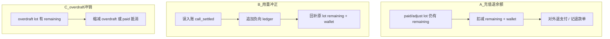
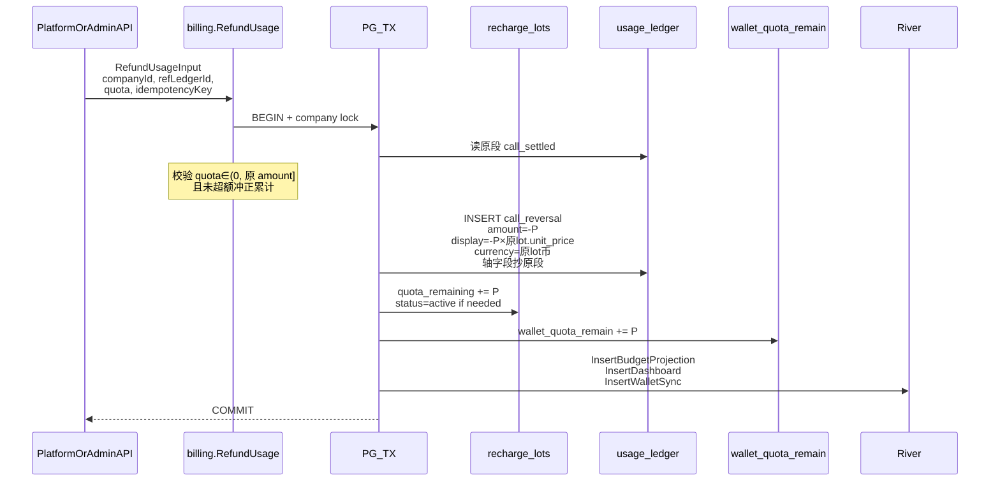
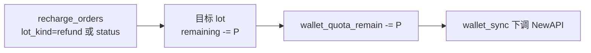

# Backend — 退款 / 冲正实现说明

> **状态：仅设计，未实现。** 实现排期另议。  
> 读者：Backend / 架构。  
> 前置：[Backend-计费模式.md](../Backend-计费模式.md) · [架构终态设计.md](../架构终态设计.md)

---

## 1. 目标与边界

把「钱从公司钱包出去 / 误扣找回」收敛到与消耗入账同一套事实面：

```text
只追加事实（lot + ledger + wallet_quota_remain）→ 异步投影 → 读侧自然跟上
禁止 UPDATE 历史 ledger.display_amount / 用新 PPU 重算旧费用
```

| 在范围内 | 不在范围内（首版） |
| --- | --- |
| 运营发起的用量冲正、充值未用退余额、overdraft 人工冲销 | 用户自助原路退支付通道 |
| 幂等写路径 + 投影兼容 | FX 多币种汇兑退款 |
| CallLog / 钱包 / 看板能看见冲正效果 | Gateway 热路径改动 |

---

## 2. 三种业务（务必分清方向）



| | A 充值退余额 | B 用量冲正 | C overdraft 冲销 |
| --- | --- | --- | --- |
| 触发 | 运营对未用完的 lot 退款 | 误计费 / 对账回退 | 透支后补钱或抹账 |
| `wallet_quota_remain` | **减少** | **增加** | 通常不变或随抵消变 |
| lot | remaining **减少**（或关 lot） | 原 lot remaining **回补** | overdraft remaining **减少** |
| ledger | 建议记 `wallet_refund`（审计） | **必须**负向用量段 | 可选审计段 |
| 展示币 | 用该 lot `unit_price_display` 算退额 | 负 display = `-take × 原单价` | overdraft 单价多为 0 |

**首版建议优先实现 B**（与现有 ingest 对称、闭环校验清晰）；A / C 第二刀。

---

## 3. 架构原则（与现状对齐）

1. **事实 SSOT**：`company_recharge_lots` + `usage_ledger` + `companies.wallet_quota_remain`（同事务）。  
2. **投影可重建**：`budget_consumed` / `usage_buckets` / `gateway_soft_*` 只跟 ledger 走，不单独记「退款余额表」。  
3. **冻结展示**：冲正展示额继承**原 lot 单价与币种**，不用公司当前 `billing_currency` PPU 现算。  
4. **Gateway 不参与**：冲正走管理 API；soft 靠投影追平（可接受短 lag）。  
5. **幂等**：与充值订单类似，`(company_id, idempotency_key)` 级防重。

现状约束（实现时必碰）：

| 现状 | 含义 |
| --- | --- |
| 投影只拉 `event_type = call_settled` | 若冲正用新 event_type，必须改 projector / dashboard 游标查询 |
| Unique `(company_id, idempotency_key, lot_id, occurred_at)` | 冲正 key 需稳定设计，避免假冲突 |
| CallLog 来自 ledger | 负向段要不要进调用列表：产品二选一（见 §6） |

---

## 4. 推荐模型：用量冲正（B）

### 4.1 新事件类型

```text
types.EventTypeCallReversal = "call_reversal"
```

不要复用 `call_settled` 夹带负数（CallLog / 审计语义糊掉）。

`call_detail` / metadata 建议：

```json
{
  "refLedgerId": "原 call_settled 段 id",
  "reason": "ops-manual|reconcile",
  "operatorId": "..."
}
```

schema **可不加列**：首版放 `call_detail` JSONB 足够；若报表常查再加 `ref_ledger_id`。

### 4.2 同事务写路径



### 4.3 域 API 草图（实现时）

```text
domain/billing/refund.go   // 或 domain/usage/refund.go，二选一勿拆两套

RefundUsage(ctx, RefundUsageInput) error

RefundUsageInput:
  RefLedgerID     string   // 原 call_settled 段
  Quota           int64    // >0，冲正绝对值
  IdempotencyKey  string
  Reason          string
  OperatorID      string
```

放置建议：**`domain/billing`**（动 lot + wallet）；由 billing 写 ledger 负向段，或注入 `usage` 的细 ledger builder。**禁止**在 handler 里拼 FIFO。

### 4.4 投影改动（必做）

今日：

```text
ListCallSettledAfterCursor … WHERE event_type = 'call_settled'
```

目标：

```text
ListConsumptionEventsAfterCursor
  WHERE event_type IN ('call_settled', 'call_reversal')
```

`ApplyIncrement` 已按 `entry.Amount` 加减 → 负值自然扣减 `budget_consumed`。  
Dashboard `usage_buckets` 同源：负 `cost` / `display_cost` 进入 Σ。

索引：在现有 partial index 上扩 OR 改为消费类事件 index（实现时与 DBA 定，本地 wipe 改 `schema.sql` 即可）。

### 4.5 超额冲正防护

对同一 `ref_ledger_id`：

```text
Σ |call_reversal.amount|  ≤  原段 amount
```

实现：按 `call_detail.refLedgerId` 查已冲正和，或不做部分冲正、只允许一次全额冲正（首版更简单）。

**首版建议：只允许整段冲正**（`Quota == 原 amount`），少状态机。

---

## 5. 充值退余额（A）— 第二刀

与充值对称，**可不写用量投影**：



规则：

- 可退 quota ≤ `lot.quota_remaining`  
- 退款展示额 = `P × lot.unit_price_display`（冻结单价）  
- gift / overdraft：**不允许走 A**（gift 无应付；overdraft 走 C）  
- 审计：`operation_logs` + 可选 `usage_ledger` event `wallet_refund`（投影**忽略**该 type）

---

## 6. 读侧与产品

| 面 | 行为 |
| --- | --- |
| CallLog | **推荐**：列表仍以 `call_settled` 为主；冲正单独「冲正记录」或详情挂 `reversals[]`。备选：混排负行（实现简单、产品需接受） |
| 看板 Spend | `Σ display_cost` 含 `call_reversal` → 花费下降 |
| 钱包 | A 减少余额；B 增加余额；`balances[]` 按币种闭合 |
| 预算 soft | 投影后 remain 回升；短窗 lag 可接受 |

前端：冲正展示额一律 `formatMoney`（可负），禁止再 ÷PPU。

---

## 7. API / 权限（草图）

```text
POST /api/platform/companies/{id}/refunds/usage     # B，平台运营
POST /api/platform/companies/{id}/refunds/lot         # A，可选二期
```

或企业管理员受限入口（产品定）。权限：新 permission key（实现时进 `permission/manifest.json`）。  
写 `operation_logs`：`billing.refund.usage` / `billing.refund.lot`。

请求示例（B）：

```json
{
  "idempotencyKey": "refund:call:led-xxx",
  "refLedgerId": "led-xxx",
  "reason": "duplicate webhook"
}
```

（整段冲正时不传 quota。）

---

## 8. 测试计划（实现验收）

| 用例 | 期望 |
| --- | --- |
| 整段冲正 | 负向 ledger 1 行；lot remaining 回到扣前；wallet 回升；投影后 consumed/soft/buckets 闭合 |
| 幂等重放 | 第二次 Insert 0 行 / 同结果，无二次加钱包 |
| 禁止超冲 | 二次冲正同一段 → Validation |
| 冻结币种 | 公司改币后冲正，`display_amount` 仍按原 lot 币与单价 |
| A（二期） | remaining 不足不可退；gift 拒绝 |

单测落点：`tests/domain/billing/refund_*` + 投影 `budget_projector` 负向段。

---

## 9. 建议落地切片（以后做）

| 序 | 内容 | 产出 |
| --- | --- | --- |
| R1 | `EventTypeCallReversal` + projector/dashboard 查询扩事件 | 能吃负向段 |
| R2 | `RefundUsage` 同事务 + idempotency + 整段冲正 | 核心写路径 |
| R3 | Platform API + operation_log + FE 冲正可见 | 可用 |
| R4 | `RefundLotBalance`（A） | 充值退余额 |
| R5 | overdraft 冲销（C）+ 可选 metric | 财务收口 |

**明确不做（与量纲文一致）：** Gateway 动态 estimate；ingest 同事务投影；热路径 `SUM(ledger)`。

---

## 10. 决策冻结（开做前确认）

1. B 是否**只允许整段冲正**？（推荐是）  
2. CallLog：**混排负行** vs **独立冲正列表**？  
3. A 是否需要对接真实支付通道，还是只做账本退额？  
4. API 挂 Platform 还是企业 Admin？

确认后再开 PR；在此之前**不写代码**。

---

## 11. 相关

- [Backend-计费模式.md](../Backend-计费模式.md) — 量纲、冻结展示、事实/投影  
- [Backend-预算.md](../Backend-预算.md) — 投影 / soft remain  
- [Backend-离线任务.md](../Backend-离线任务.md) — River 入队  
- [架构终态设计.md](../架构终态设计.md) — 摘要列=投影  
