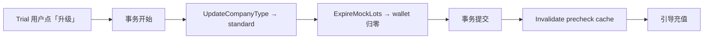

# Mock Lot 与模拟消耗方案设计

**状态：** Draft v3  
**相关：** [Backend-预算.md](../Backend-预算.md) · [预算分配与扣减.md](../预算分配与扣减.md) · [Backend-Ingest架构.md](../Backend-Ingest架构.md)

---

## 1. 产品定位

### 1.1 它是什么

模拟消耗是 demo/trial 账户的 **产品体验工具**。客户注册后，通过它亲手走一遍"调用 → 扣费 → 看板变化"的完整流程，理解 TokenJoy 如何管控 AI 用量。

**不花真钱，不消耗真实算力，但流程完全真实。**

### 1.2 客户视角

```
1. 注册 trial 账户 → 系统赠送 ¥500 试用额度（Mock Lot）
2. 管理员分配预算给部门/成员（正常操作）
3. 成员创建 Platform Key（正常操作）
4. 点击「模拟消耗」→ 选择 Key、填 token 数 → 提交
5. 几秒后看到：
   - 钱包余额减少
   - 审计日志出现调用记录
   - 预算看板更新
   - Key 已用额度增加
6. 客户理解了产品价值 → 升级为正式版 → 试用额度清零，开始充值使用
```

### 1.3 设计原则

| 原则 | 说明 |
| --- | --- |
| 只看账号类型，不看环境 | demo/trial/testing 可用，standard/selfhosted 不可用。`DEPLOY_ENV` 不参与功能门控 |
| 流程真实，资金虚拟 | 走完整的 Gateway → NewAPI → Ingest 链路，但钱和算力都是假的 |
| Trial 不充值 | trial 账户不能充值；想用真实模型必须先升级为 standard |
| 升级即清除 | trial → standard 时过期所有 mock lot，一刀切 |

---

## 2. Lot 隔离规则

### 2.1 设计决策：Trial 期间不允许充值

Trial 账户只有 mock lot，不允许充值。这意味着 **mock 和 real lot 不并存**（testing 类型除外，见 §3.3）。

好处：
- 不需要在 FIFO 消耗时区分 lot kind（trial 阶段所有 active lot 都是 mock）
- 不需要拆分 `wallet_quota_remain`
- 不需要修改 `consumeLotsWithCompany` 的签名
- FIFO head 指针语义不变
- 升级时一刀切过期所有 lot 即可

### 2.2 实现方式：零改动入账

因为 trial 期间只有 mock lot，ingest 的 FIFO 消耗无需任何过滤——所有 active lot 都是 mock，正常消耗即可。

真实模型在 trial 阶段根本到不了 NewAPI：
1. Platform Key 白名单默认只含 `test-model`（创建 Key 时 UI 只显示可用模型，API 层也强制限制可选模型范围）
2. Gateway 预检拦截：trial 账户的 Key 白名单不含真实模型 → `model not allowed`
3. **Gateway 追加守卫**：即使白名单被绕过（用户通过 API 手动添加了真实模型），Gateway 在 precheck 通过后检查：`if !isTestModelAllowed(companyType) → reject` 只针对 test-model。对真实模型，需追加一条规则：`if isTrialOrDemo(companyType) && !modelcatalog.IsTestOnlyCallType(model) → reject`。这确保 trial/demo 账户**只能调用 test-model**，无论白名单配了什么。

**结论：`consumeLotsWithCompany` 无需改动。真实算力被 Gateway 层完全阻断。**

### 2.3 testing 账户的特殊情况

`testing` 类型（内部开发/QA 环境）允许同时拥有 mock + real lot，且可以调用真实模型。此时 test-model 的入账会消耗 mock lot（FIFO 队列中排在前面），真实模型也会消耗 mock lot（如果它排在 FIFO 前面）。

这是可接受的：testing 环境不需要财务精确性，mock lot 只是种子数据用于验证流程。如果 testing 环境需要隔离，可在 P2 给 `consumeLotsWithCompany` 加 `callType` 参数（见 §11 未来扩展）。

### 2.4 wallet_quota_remain

Trial 阶段：`wallet_quota_remain` = mock lot 总和。语义清晰，就是"试用余额"。

升级后：`ExpireMockLots` 将其归零，充值后写入 real lot 额度。

---

## 3. 核心概念

### 3.1 Mock Lot

| 属性 | 值 |
| --- | --- |
| `lot_kind` | `mock` |
| `amount_display` | 0（不对应真实支付） |
| `quota_granted` | 系统配置额度（默认 500,000 point ≈ ¥500） |
| FIFO 行为 | 正常参与 FIFO |
| 过期条件 | 账户升级到 standard 时全部 expire |
| 用途 | 供 test-model 模拟消耗使用 |

### 3.2 test-model

| 属性 | 值 |
| --- | --- |
| 模型 ID | `test-model`（`modelcatalog.TestCallType`） |
| 上游 | `dev-mock-llm`（echo `dev_usage`，不消耗算力） |
| 定价 | 与 gpt-4o-mini 同级（让客户看到合理的金额） |
| 功能 | 客户可自定义 input/output token 数，模拟不同规模调用 |

### 3.3 账户类型矩阵

| 企业类型 | 模拟消耗 | Mock Lot | test-model | 真实模型 | 充值 |
| --- | --- | --- | --- | --- | --- |
| `demo` | 可用 | 种子发放 | 放行 | 不可用（Key 白名单无真实模型） | 不可用 |
| `trial` | 可用 | 注册发放 | 放行 | 不可用（Key 白名单无真实模型） | 不可用 |
| `standard` | 不可用 | 无（已清除） | 403 | 正常 | 可用 |
| `selfhosted` | 不可用 | 无 | 403 | 正常 | 可用 |
| `testing` | 可用 | 可选 | 放行 | 正常 | 可用 |

---

## 4. 架构设计

### 4.1 全链路

```mermaid
sequenceDiagram
  participant U as 用户
  participant FE as 前端
  participant API as Backend
  participant GW as Gateway
  participant NA as NewAPI
  participant MOCK as dev-mock-llm
  participant ING as Ingest

  U->>FE: 点击「模拟消耗」，填写 token 数
  FE->>API: GET /api/keys/platform/{id}/simulate-bearer
  API->>API: 校验 company.type ∈ {demo,trial,testing}
  API-->>FE: { bearer: "sk-..." }
  FE->>GW: POST /v1/chat/completions (bearer, test-model, dev_usage)
  GW->>GW: 预检通过（Key active + 余额充足 + company 允许 test-model）
  GW->>NA: 转发
  NA->>MOCK: 转发到 dev-mock-llm
  MOCK-->>NA: 200（echo dev_usage 作为实际用量）
  NA-->>GW-->>FE: 响应
  NA->>ING: Webhook 结算
  ING->>ING: 正常入账：ledger + lot FIFO + budget_consumed
  Note over ING: trial 阶段只有 mock lot，FIFO 正常消耗
```

### 4.2 变更点

#### A. Gateway：按账号类型放行 test-model

当前代码：

```go
// gateway_service.go — 按环境变量控制
if !g.allowDevModel && modelcatalog.IsTestOnlyCallType(model) { reject }
```

改为：按账号类型判断。移除 `allowDevModel` 环境开关，改用 precheck 返回的 `CompanyType` 做门控：

```go
// gateway_service.go — precheck 前
if modelcatalog.IsTestOnlyCallType(model) {
    opts.SkipModelAllowlist = true // test-model 不走 Key 白名单校验（由后续 companyType 守卫控制）
}

result, err := g.precheck.Run(r.Context(), keyHash, model, opts)
if err != nil { reject(err); return }

// precheck 通过后，按 companyType 做模型准入
if modelcatalog.IsTestOnlyCallType(model) && !isTestModelAllowed(result.CompanyType) {
    reject("test-model not available for this account type")
    return
}
if isTrialOrDemo(result.CompanyType) && !modelcatalog.IsTestOnlyCallType(model) {
    reject("trial/demo accounts can only use test-model")
    return
}
```

```go
func isTestModelAllowed(companyType string) bool {
    switch companyType {
    case store.CompanyTypeDemo, store.CompanyTypeTrial, store.CompanyTypeTesting:
        return true
    default:
        return false
    }
}

func isTrialOrDemo(companyType string) bool {
    return companyType == store.CompanyTypeTrial || companyType == store.CompanyTypeDemo
}
```

优点：
- `PrecheckResult` 已经返回 `CompanyType`（从 `PrecheckContextRow.CompanyType` 来），无需改动 precheck 层
- trial/demo 即使白名单被手动篡改，也无法调用真实模型（Gateway 硬拦截）
- standard/selfhosted 即使白名单含 test-model，也会被 `isTestModelAllowed` 拦截

#### B. Bearer 获取端点

当前 `/api/dev/platform-keys/{id}/bearer` 仅 `DEPLOY_ENV=local` 注册。改为正式路由：

```
GET /api/keys/platform/{id}/simulate-bearer
```

权限：
- 认证：session JWT ✓
- 企业类型：demo/trial/testing ✓（否则 403）
- Key 归属：Key 所属 company = 当前用户 company ✓

返回：`{ bearer: "sk-..." }`

安全分析：bearer 是该用户自己的 Platform Key 在 NewAPI 的 Token。trial 阶段钱包里只有 mock lot，泄露损失为零。

#### C. NewAPI Channel group 修复

当前 bug：test-model channel 的 group 是 `dept-xxx`，但 Platform Key Token 的 group 是 `platform_shared`。

修复：`setup-dev-mock-channel.sh` 中 `GROUP` 默认值改为 `platform_shared`。

生产环境需同样配置一个 test-model channel（group=`platform_shared`，上游指向内网 dev-mock-llm）。

#### D. 前端条件渲染

当前代码：

```typescript
// header-dev-backend-chrome.tsx
if (!import.meta.env.DEV) return null
```

改为：

```typescript
const showSimulateConsume = ['demo', 'trial', 'testing'].includes(session.companyType)
if (!showSimulateConsume) return null
```

同时 `devApi.getPlatformKeyBearer` 移出 `/api/dev.ts`，移入 `/api/platform-keys.ts`（或新建 `/api/simulate.ts`），移除 `import.meta.env.DEV` 守卫。

#### E. 入账层：无修改

Trial 阶段只有 mock lot，FIFO 正常消耗无需过滤。**不改 `consumeLotsWithCompany` 签名。**

#### F. 充值入口限制

充值页面 / 充值 API 需校验 `company.type != trial && company.type != demo`：

```go
func (h *RechargeHandler) Create(ctx context.Context, req RechargeRequest) error {
    if co.Type == store.CompanyTypeTrial || co.Type == store.CompanyTypeDemo {
        return errors.New("trial/demo accounts must upgrade before recharging")
    }
    // ...
}
```

前端充值入口对 trial/demo 不渲染，或渲染为"升级后可充值"引导。

---

## 5. 升级流程



事务内（原子操作）：
1. `UpdateCompanyType(companyID, "standard")` — 先改类型
2. `ExpireMockLots(companyID)` — 过期所有 mock lot，重算 `wallet_quota_remain`（归零）

事务提交后：
3. **主动 invalidate Gateway precheck cache** — 调用 `precheckCache.Evict(companyID)` 或按 key hash 逐出。确保后续 test-model 请求立即被拒。
4. 前端刷新 session → 模拟消耗入口消失

### 5.1 升级竞态处理

升级事务提交后、precheck cache 失效前，可能有 in-flight 的 test-model 请求：

- **已通过 Gateway 预检、尚未到达 ingest**：ingest 执行时 mock lot 已 expired，`ListActiveLotsFIFO` 返回空列表 → 走 overdraft 扩展（金额极小，属于 test-model 的模拟消耗）。
- **影响**：产生一笔 overdraft 记录（金额 ≈ ¥0.01 级别）。

**处理方式**：可接受。升级后首次充值写入 real lot 时，overdraft lot 自然不再扩展。对账时将 test-model 相关的 overdraft 标记为"升级竞态残留"即可（日志中有 model=test-model 可筛选）。

如果需要完全避免（P2）：升级事务中额外插入一条 `company_events` 记录，ingest 在 lock company 后检查是否刚完成升级 + model=test-model → 直接丢弃不入账。

---

## 6. 安全约束

| 层 | 约束 | 实现 |
| --- | --- | --- |
| Gateway | standard/selfhosted 不能调 test-model | `isTestModelAllowed(companyType)` 判断 |
| Gateway | trial/demo 只能调 test-model | `isTrialOrDemo(companyType) && !IsTestOnlyCallType(model) → reject` |
| API | bearer 端点只对 demo/trial/testing 开放 | handler 校验 company.type |
| NewAPI | `dev_usage` 只在 test-model channel 生效 | 仅 test-model channel 开启 `pass_through_body_enabled` |
| 网络 | dev-mock-llm 不对公网暴露 | 内网部署 + NewAPI channel base_url 指向内网 |
| 产品 | trial/demo 不能充值 | 充值 handler + 前端双重校验 |
| 频率 | 模拟消耗不能被高频刷 | Gateway rate limiter（复用现有 per-key 限流） |
| 升级 | 升级后立即失效 precheck cache | 事务提交后调用 cache evict |

---

## 7. 前端体验

### 7.1 入口

顶部导航栏「模拟消耗」按钮，带 **试玩** 标识。仅 `['demo', 'trial', 'testing'].includes(session.companyType)` 时渲染。

### 7.2 Dialog

```
┌─────────────────────────────────────┐
│  模拟消耗                            │
│                                     │
│  模拟一次 API 调用，体验额度扣减与   │
│  用量追踪的完整流程。不消耗真实算力。 │
│                                     │
│  试用额度剩余：¥367.50              │
│                                     │
│  Platform Key: [▼ 选择 Key ]        │
│                                     │
│  Input tokens:  [12,000,000]        │
│  Output tokens: [ 8,000,000]        │
│                                     │
│  预估消耗：¥6.60                    │
│                                     │
│            [取消]  [提交模拟]        │
└─────────────────────────────────────┘
```

- 额度为 0 时禁用提交，提示「试用额度已用完」+ 升级引导
- 成功后 Toast + 自动刷新 wallet/audit/budget 查询

### 7.3 Onboarding 引导（可选 P2）

首次登录 trial 账户时，引导步骤：
1. "欢迎！我们为您准备了 ¥500 试用额度"
2. "先给成员分配预算吧"
3. "创建一把 API Key"
4. "试试模拟消耗，看看费用怎么流转"

---

## 8. 配置

| 变量 | 默认值 | 说明 |
| --- | --- | --- |
| `TRIAL_MOCK_LOT_QUOTA` | `500000` | Trial 注册发放的 mock point |
| `DEMO_MOCK_LOT_QUOTA` | `500000` | Demo 种子 mock point |
| `MOCK_LLM_BASE_URL` | `http://dev-mock-llm:8765` | mock 上游地址（内网） |

功能门控唯一判据：`company.type`。不再依赖 `DEPLOY_ENV` 或 `allowDevModel` flag。

---

## 9. 实现步骤

| # | 任务 | 改动范围 | 复杂度 |
| --- | --- | --- | --- |
| 1 | test-model channel group 改为 `platform_shared` | `setup-dev-mock-channel.sh` | 一行 |
| 2 | Gateway：移除 `allowDevModel` flag，改为 precheck 后按 companyType 判断 test-model 准入 | `gateway_service.go`、config | 小（~20 行） |
| 3 | Gateway：trial/demo 只允许 test-model（拦截真实模型） | `gateway_service.go`（同上代码块） | 含在 #2 中 |
| 4 | 新增 `/api/keys/platform/{id}/simulate-bearer` 正式路由 | handler 层 | 小 |
| 5 | 前端渲染条件改为 `session.companyType` | `header-dev-backend-chrome.tsx` | 一行 |
| 6 | 前端 `devApi.getPlatformKeyBearer` 迁移到正式 API 模块 | `api/` 目录 | 小 |
| 7 | 充值入口限制 trial/demo | billing handler + 前端 | 小 |
| 8 | 升级事务后 invalidate precheck cache | upgrade handler | 小（~5 行） |
| 9 | 部署 dev-mock-llm 到生产内网 | DevOps | 配置 |
| 10 | trial/demo 创建 Key 时白名单默认仅 test-model（UI + API 层限制可选模型） | Key 创建逻辑 / 前端 UI | 小 |

总改动量：~80 行后端代码 + ~30 行前端代码 + 1 个容器部署。

---

## 10. 边界约束与风险

| 场景 | 处理 |
| --- | --- |
| Trial 想充值 | 引导先升级。充值 API + 前端双重拦截 |
| Trial 用户手动添加真实模型到白名单 | Gateway 硬拦截：`isTrialOrDemo && !IsTestOnlyCallType → reject`，无论白名单配了什么 |
| Mock lot 用完了 | 前端显示"试用额度耗尽"+ 升级引导；Gateway 预检 wallet=0 也会拦 |
| 升级后 test-model in-flight | Gateway 拒绝（cache evict 后）；极少数已过预检的请求走 overdraft（金额极小，可筛选清理） |
| 恶意高频打 test-model | Gateway per-key rate limiter；mock lot 额度有限（最多"浪费" ¥500 假钱） |
| bearer 泄露 | trial 阶段只有 mock lot，损失为零；Gateway 预检控额度/Key 状态 |
| dev-mock-llm 挂了 | 模拟消耗失败，不影响任何真实流量；前端显示错误提示 |
| testing 环境 mock+real lot 混合 FIFO | 可接受：testing 不需要财务精确性。P2 可加 callType 过滤 |

---

## 11. 未来可选扩展（当前不做）

- **P2: Lot kind 过滤**：给 `ConsumeLotsLocked` 加 `callType string` 参数，testing 环境可严格隔离 mock/real lot 消耗。接口变更：`LotConsumer.ConsumeLotsLocked(ctx, st, co, amount, callType)` + adapter 适配。
- Mock Lot 续费（平台运营手动追加）
- 模拟消耗支持更多 mock 模型（test-embedding 等）
- 用量看板区分 mock/real 数据标签
- Trial 倒计时（天数 + 额度双触发升级提醒）
- 升级竞态完全防护（ingest 侧检查 company_events）
