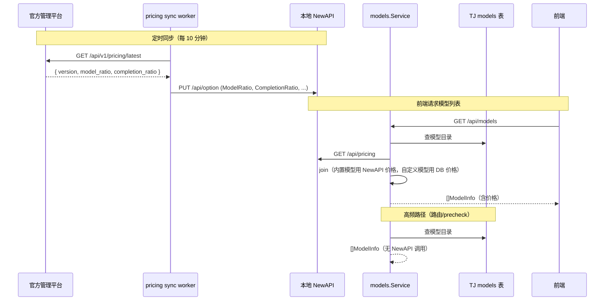

# 定价统一：Local/SaaS 实现方案

## 一句话

TJ 通过 `models.Service` 统一封装模型数据（目录来自 DB，价格来自本地 NewAPI）。本地 NewAPI 的价格由 pricing sync worker 定时从平台同步写入。调用方无需关心价格来源。

---

## 0. 与三端架构的关系

本文档描述的是 **Local/SaaS 版本项目**（即这个 repo）的实现。

```
官方管理平台 (NewAPI 原生 UI 管理定价)
    ↓ 定时同步（pricing sync worker）
Local/SaaS NewAPI (本地，model_ratio 被同步覆盖)
    ↓ GET /api/pricing
TJ models.Service (本文档描述的代码)
    ↓
TJ 前端 (展示价格)
```

- **平台**是全局 SOT（定价的最终来源）
- **本地 NewAPI**是本实例的 SOT（TJ 代码只需问本地 NewAPI 要价格）
- **TJ models.Service**不需要知道价格是平台同步来的还是手动设的
- **本地 NewAPI 不会自动和平台同步定价**，需要 TJ 侧的 worker 主动拉取并写入

---

## 1. 职责划分

| 职责 | 归属 | 理由 |
|------|------|------|
| **模型价格** — 全局发布 | 官方管理平台 | 平台是 SOT |
| **模型价格** — 本地读取 | 本地 NewAPI | worker 已写入，TJ 只管读 |
| **模型目录** — 创建/删除/启停 | TJ | 路由/白名单/外键深度依赖 TJ models 表 UUID |
| **模型路由/白名单** | TJ | TJ 独有业务：部门→模型权限控制 |
| **实际计费** | 平台网关 NewAPI | Gateway 模式，Local 碰不到 |
| **本地 quota 展示** | 本地 NewAPI | 给 TJ 预算系统做展示/预警 |

### 为什么模型目录不放 NewAPI？

TJ models 表承担核心业务职责：
- `org_nodes.default_model_id` / `fallback_model_id` → REFERENCES models(model_id)
- `model_allowlist` 表 → 按 model_id 控制可用范围
- 路由解析 → ResolveDeptAllowedModelIDs 按 UUID 做权限过滤
- precheck 缓存 → 网关预检用 model_id 判断

迁移成本极高，无收益。

---

## 2. Service 层设计

```go
type Service interface {
    // 含价格 — 给 HTTP handler / 前端展示用
    // 内部：DB 查目录 + 本地 NewAPI 查价格 + join
    ListModelsWithPricing(ctx context.Context) ([]types.ModelInfo, error)

    // 不含价格 — 给路由/precheck/ingest 等内部热路径用
    // 内部：纯 DB 查询
    ListModels(ctx context.Context) ([]types.ModelInfo, error)

    // 其他不变
    CreateModel(ctx context.Context, input types.CreateModelInput) (types.ModelInfo, error)
    UpdateModel(ctx context.Context, id uuid.UUID, input types.UpdateModelInput) (types.ModelInfo, error)
    DeleteModel(ctx context.Context, id uuid.UUID) error
    ToggleModel(ctx context.Context, id uuid.UUID, enabled bool) error
    ListRoutingRules(ctx context.Context) ([]types.RoutingRule, error)
    ResolveRouting(ctx context.Context, deptID uuid.UUID) (types.ResolvedWhitelist, error)
    UpdateRoutingRule(ctx context.Context, id uuid.UUID, input types.UpdateRoutingRuleInput) (types.RoutingRule, error)
}
```

### 调用方使用

| 调用方 | 调哪个 | 原因 |
|--------|--------|------|
| HTTP handler（模型列表页） | `ListModelsWithPricing` | 前端需要展示价格 |
| 路由规则解析 | `ListModels` | 只需 ID/type/enabled，不需要价格 |
| precheck / 网关 | `ListModels` | 热路径，纯 DB |
| ingest / entry_build | `ListModels` | 只需 catalog 做 provider 解析 |

### 性能分析

| 路径 | 频率 | 数据源 | 延迟 |
|------|------|--------|------|
| 模型列表页 | 低频（管理员操作） | DB + 本地 NewAPI HTTP | ~15ms |
| 路由/precheck | 高频（每次 API 请求） | 纯 DB | ~5ms |
| ingest | 批量 | 纯 DB（snapshot） | ~5ms |

---

## 3. 数据流



---

## 4. 改动范围

### 4.1 删除

| 文件/逻辑 | 说明 |
|-----------|------|
| `models/service.go` → `SyncPricingFromUpstream` 方法 + interface 签名 | 被 pricing sync worker 替代 |
| `app/app.go` → startup goroutine（调 SyncPricingFromUpstream） | 被 worker 替代 |
| `handler/models/handler.go` → `SyncPricing` handler + `/sync-pricing` 路由 | 不再需要手动触发旧同步 |

### 4.2 新增

| 文件 | 说明 |
|------|------|
| `internal/worker/pricingsync/worker.go` | 定时从平台拉价格 → 写本地 NewAPI option |
| `integration/newapi/option.go` | `UpdateOption` 实现 |
| `integration/platform/pricing.go` | 平台 HTTP client — `GetLatestPricing` |
| `handler/pricing/handler.go` | GET /pricing/sync-status, POST /pricing/sync-now（需 ModelManage 权限） |

### 4.3 修改

| 文件 | 改动 |
|------|------|
| `models/service.go` | 新增 `ListModelsWithPricing`：调 `adminport.ListModelPricing` + join |
| `handler/models/handler.go` → `List` | 改调 `ListModelsWithPricing` |
| `domain/adminport/port.go` | 接口新增 `UpdateOption` |
| `app/app.go` | 注册 pricing sync worker（feature flag 控制，平台 API 就绪前不启动） |
| 前端 `model-list-table.tsx` | 加价格展示列（¥/M tokens） |
| 前端 `model-edit.tsx` | 内置模型：价格字段只读 |

### 4.4 保留不动

| 组件 | 说明 |
|------|------|
| models 表 schema（含 input_price/output_price） | 自定义模型仍用 |
| `ListModels()`（原有纯 DB 版） | 路由/precheck/ingest 继续调 |
| `adminport.Port` → `ListModelPricing` | Service 内部用 |
| `integration/newapi/pricing.go` | Service 内部用 |
| `newapiunits.PriceFromRatio` | Service 内 ratio→价格转换 |
| `usage/entry_build.go` → `Amount: input.Raw.Quota` | 本地 quota 记录不动 |

---

## 5. ListModelsWithPricing 实现

```go
func (s *service) ListModelsWithPricing(ctx context.Context) ([]types.ModelInfo, error) {
    models, err := s.store.Models().Models(ctx)
    if err != nil {
        return nil, err
    }

    // best-effort: NewAPI 不可达时仍返回模型列表，价格保留 DB 值
    pricingCtx, cancel := context.WithTimeout(ctx, 3*time.Second)
    defer cancel()
    pricing, _ := s.client.ListModelPricing(pricingCtx)
    priceMap := make(map[string]adminport.ModelPricing, len(pricing))
    for _, p := range pricing {
        priceMap[p.ModelName] = p
    }

    for i := range models {
        if models[i].Provider == types.ProviderCustom {
            continue // 自定义模型保留 DB 中的价格
        }
        if p, ok := priceMap[models[i].Type]; ok {
            models[i].InputPrice, models[i].OutputPrice = newapiunits.PriceFromRatio(p.ModelRatio, p.CompletionRatio)
        }
        // else: 保留 DB 值（不清零，防止 NewAPI 返回不完整时丢价格）
    }
    return models, nil
}
```

---

## 6. Pricing Sync Worker 实现

位置：`internal/worker/pricingsync/worker.go`

Worker 是 infrastructure 层组件（不是 domain），职责是定时把平台定价搬运到本地 NewAPI。无业务规则，纯数据同步。

**外部依赖：平台 `GET /api/v1/pricing/latest` 尚未实现。Worker 代码可先写好，通过 feature flag `PLATFORM_PRICING_SYNC_ENABLED` 控制是否启动。平台 API 就绪后打开即可。**

```go
// internal/worker/pricingsync/worker.go
package pricingsync

type Worker struct {
    platform    platform.Client  // 拉取平台定价
    adminport   adminport.Port   // 写入本地 NewAPI
    interval    time.Duration
    lastVersion string
}

func New(p platform.Client, a adminport.Port, interval time.Duration) *Worker {
    return &Worker{platform: p, adminport: a, interval: interval}
}

func (w *Worker) Run(ctx context.Context) {
    w.syncOnce(ctx) // 启动立即同步一次
    ticker := time.NewTicker(w.interval)
    defer ticker.Stop()
    for {
        select {
        case <-ctx.Done():
            return
        case <-ticker.C:
            w.syncOnce(ctx)
        }
    }
}

func (w *Worker) syncOnce(ctx context.Context) {
    latest, err := w.platform.GetLatestPricing(ctx)
    if err != nil {
        slog.Warn("pricing sync failed", "error", err)
        return
    }
    if latest.Version == w.lastVersion {
        return
    }

    // 全量替换 — 平台是 SOT
    if err := w.adminport.UpdateOption(ctx, "ModelRatio", latest.ModelRatioJSON); err != nil {
        slog.Error("update ModelRatio failed", "error", err)
        return
    }
    if err := w.adminport.UpdateOption(ctx, "CompletionRatio", latest.CompletionRatioJSON); err != nil {
        slog.Error("update CompletionRatio failed", "error", err)
        return
    }

    w.lastVersion = latest.Version
    slog.Info("pricing synced", "version", latest.Version)
}
```

---

## 7. 平台 API 契约（预定义）

平台 `GET /api/v1/pricing/latest` 预期 response：

```go
// integration/platform/pricing.go
type PricingResponse struct {
    Version            string `json:"version"`              // 语义版本或时间戳，用于幂等判断
    ModelRatioJSON     string `json:"model_ratio"`          // NewAPI option 格式的 JSON string
    CompletionRatioJSON string `json:"completion_ratio"`    // 同上
}
```

认证：`Authorization: Bearer {INSTANCE_API_KEY}`，HTTPS。

**此 API 尚未由平台实现。TJ 侧先按此契约编码，平台实现后联调。**

---

## 8. 自定义模型 vs 内置模型

| | 内置模型 | 自定义模型 |
|---|---------|-----------|
| **价格来源** | 本地 NewAPI（被平台同步覆盖） | TJ models 表 |
| **价格编辑** | 不允许（平台 SOT） | TJ 编辑表单（客户自己管） |
| **模型创建** | TJ 加目录 + 对应平台网关 channel | TJ 创建（含 endpoint/apiKey） |
| **计费归属** | 平台收钱 | 客户自己的成本 |
| **channel 指向** | 平台网关 | 客户自己的 endpoint |
| **区分方式** | `provider != "custom"` | `provider == "custom"` |

---

## 9. 边界情况

| 场景 | 处理 |
|------|------|
| 本地 NewAPI 不可达 | `ListModelsWithPricing` 保留 DB 值，不清零 |
| 平台不可达（worker 失败） | 继续用上次同步的价格，不影响服务 |
| NewAPI 返回慢 | 3s timeout，超时保留 DB 值 |
| 内置模型编辑 | 价格字段只读，其他字段可改 |
| 自定义模型 | 完全独立，不受同步影响 |
| Worker 半写（ModelRatio 写了 CompletionRatio 没写） | 最多影响一个同步周期，下次 syncOnce 全量覆盖 |
| 平台 API 未就绪 | Worker 不启动（feature flag），`ListModelsWithPricing` 正常工作（读已有的本地 NewAPI 数据） |

---

## 10. 实施步骤

### Phase 1：读路径改造（可独立交付，不依赖平台 API）

1. `models/service.go` 新增 `ListModelsWithPricing`（用 `Provider == types.ProviderCustom` 区分）
2. `handler/models/handler.go` List 改调 `ListModelsWithPricing`
3. 前端 `model-list-table.tsx` 加价格展示列
4. 前端 `model-edit.tsx` 内置模型价格只读
5. 删除旧同步链路 — `SyncPricingFromUpstream`、startup goroutine、`/sync-pricing` 路由

### Phase 2：写路径（依赖平台 API 就绪）

6. `integration/platform/pricing.go` — `GetLatestPricing`
7. `integration/newapi/option.go` — `UpdateOption`
8. `domain/adminport/port.go` 接口新增 `UpdateOption`
9. `internal/worker/pricingsync/worker.go` — pricing sync worker
10. `app/app.go` — 注册 worker（`PLATFORM_PRICING_SYNC_ENABLED` flag 控制）
11. `handler/pricing/handler.go` — sync-status + sync-now（挂 `/pricing` 路由，需 ModelManage 权限）

Phase 1 完成后前端已能展示实时价格（来自本地 NewAPI 已有数据）。Phase 2 的 worker 代码可以写好但通过 flag 关闭，等平台 API 就绪后开启。

---

## 11. 安全性

| 关注点 | 措施 |
|--------|------|
| TJ → 本地 NewAPI | `NEW_API_ADMIN_TOKEN` Bearer 认证（内网） |
| TJ → 平台 | `INSTANCE_API_KEY` Bearer 认证（HTTPS） |
| 前端不直连 NewAPI | 通过 TJ Service 代理 |
| Local hack 本地 ratio | 不影响平台计费（Gateway 模式） |
| pricing handler 权限 | 需 `ModelManage` permission，仅管理员可触发 |

---

## 12. 决策记录

| 决策 | 理由 |
|------|------|
| 模型目录留 TJ | 外键/路由/白名单深度依赖 UUID |
| 价格读本地 NewAPI | 已有 `ListModelPricing`，实时读最简单 |
| 旧 SyncPricingFromUpstream 删除 | 被 worker 替代（不再写 models 表，改写 NewAPI option） |
| Service 层封装两个方法 | 热路径不付 HTTP 开销 |
| NewAPI 不可达时不清零 | 保留 DB 值比展示 0 更安全 |
| Worker 放 `internal/worker/pricingsync/` | 纯搬运逻辑，无业务规则，属 infrastructure 层 |
| Worker 通过 feature flag 控制 | 平台 API 未就绪，代码先行不阻塞 Phase 1 |
| 自定义模型用 `Provider == types.ProviderCustom` 判断 | 已有字段，语义明确 |
| 全量替换 option | 平台是 SOT，Local 不应有"额外"的 ratio |
| 分两阶段交付 | Phase 1 不依赖外部，可独立上线验证 |
