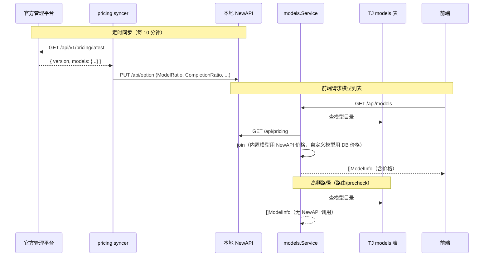

# 定价统一：Local/SaaS 实现方案

## 一句话

TJ 通过 `models.Service` 统一封装模型数据（目录来自 DB，价格来自本地 NewAPI）。本地 NewAPI 的价格由平台定时同步写入。调用方无需关心价格来源。

---

## 0. 与三端架构的关系

本文档描述的是 **Local/SaaS 版本项目**（即这个 repo）的实现。

```
官方管理平台 (NewAPI 原生 UI 管理定价)
    ↓ 定时同步（pricing syncer）
Local/SaaS NewAPI (本地，model_ratio 被同步覆盖)
    ↓ GET /api/pricing
TJ models.Service (本文档描述的代码)
    ↓
TJ 前端 (展示价格)
```

- **平台**是全局 SOT（定价的最终来源）
- **本地 NewAPI**是本实例的 SOT（TJ 代码只需问本地 NewAPI 要价格）
- **TJ models.Service**不需要知道价格是平台同步来的还是手动设的

---

## 1. 职责划分

| 职责 | 归属 | 理由 |
|------|------|------|
| **模型价格** — 全局发布 | 官方管理平台 | 平台是 SOT |
| **模型价格** — 本地读取 | 本地 NewAPI | syncer 已写入，TJ 只管读 |
| **模型目录** — 创建/删除/启停 | TJ | 路由/白名单/外键深度依赖 TJ models 表 UUID |
| **模型路由/白名单** | TJ | TJ 独有业务：部门→模型权限控制 |
| **实际计费** | 平台网关 NewAPI | Gateway 模式，Local 碰不到 |
| **本地 quota 展示** | 本地 NewAPI | 给 TJ 预算系统做展示/预警 |

### 为什么模型目录不放 NewAPI？

TJ models 表承担核心业务职责：
- `org_nodes.default_model_id` / `fallback_model_id` → REFERENCES models(model_id)
- `model_allowlist` 表 → 按 model_id 控制可用范围
- 路由解析 → ResolveDeptAllowedModelIDs 按 UUID 做权限过滤
- precheck 缓存 → 网关预检用 model_id 判断

迁移成本极高，无收益。

---

## 2. Service 层设计

```go
type Service interface {
    // 含价格 — 给 HTTP handler / 前端展示用
    // 内部：DB 查目录 + 本地 NewAPI 查价格 + join
    ListModelsWithPricing(ctx context.Context) ([]types.ModelInfo, error)

    // 不含价格 — 给路由/precheck/ingest 等内部热路径用
    // 内部：纯 DB 查询
    ListModels(ctx context.Context) ([]types.ModelInfo, error)

    // 其他不变
    CreateModel(ctx context.Context, input types.CreateModelInput) (types.ModelInfo, error)
    UpdateModel(ctx context.Context, id uuid.UUID, input types.UpdateModelInput) (types.ModelInfo, error)
    DeleteModel(ctx context.Context, id uuid.UUID) error
    ToggleModel(ctx context.Context, id uuid.UUID, enabled bool) error
    ListRoutingRules(ctx context.Context) ([]types.RoutingRule, error)
    ResolveRouting(ctx context.Context, deptID uuid.UUID) (types.ResolvedWhitelist, error)
    UpdateRoutingRule(ctx context.Context, id uuid.UUID, input types.UpdateRoutingRuleInput) (types.RoutingRule, error)
}
```

### 调用方使用

| 调用方 | 调哪个 | 原因 |
|--------|--------|------|
| HTTP handler（模型列表页） | `ListModelsWithPricing` | 前端需要展示价格 |
| 路由规则解析 | `ListModels` | 只需 ID/type/enabled，不需要价格 |
| precheck / 网关 | `ListModels` | 热路径，纯 DB |
| ingest / entry_build | `ListModels` | 只需 catalog 做 provider 解析 |

### 性能分析

| 路径 | 频率 | 数据源 | 延迟 |
|------|------|--------|------|
| 模型列表页 | 低频（管理员操作） | DB + 本地 NewAPI HTTP | ~15ms |
| 路由/precheck | 高频（每次 API 请求） | 纯 DB | ~5ms |
| ingest | 批量 | 纯 DB（snapshot） | ~5ms |

---

## 3. 数据流



---

## 4. 改动范围

### 4.1 删除

| 文件/逻辑 | 说明 |
|-----------|------|
| `models/service.go` → `SyncPricingFromUpstream` 方法 + interface 签名 | 被 pricing syncer 替代 |
| `app/app.go` → startup goroutine（调 SyncPricingFromUpstream） | 被 pricing syncer 替代 |
| `handler/models/handler.go` → `SyncPricing` handler + `/sync-pricing` 路由 | 不再需要手动触发旧同步 |

### 4.2 新增

| 文件 | 说明 |
|------|------|
| `domain/pricing/syncer.go` | 定时从平台拉价格 → 写本地 NewAPI option |
| `domain/pricing/types.go` | PricingVersion, SyncStatus |
| `integration/newapi/option.go` | `GetOption` / `UpdateOption` 实现 |
| `integration/platform/client.go` | 平台 HTTP client（拉最新定价） |
| `handler/pricing/handler.go` | GET /pricing/sync-status, POST /pricing/sync-now |

### 4.3 修改

| 文件 | 改动 |
|------|------|
| `models/service.go` | 新增 `ListModelsWithPricing`：调 `adminport.ListModelPricing` + join |
| `handler/models/handler.go` → `List` | 改调 `ListModelsWithPricing` |
| `domain/adminport/port.go` | 接口新增 `GetOption` / `UpdateOption` |
| `app/app.go` | 注册 pricing syncer worker |
| 前端 `model-list-table.tsx` | 加价格展示列（¥/M tokens） |
| 前端 `model-edit.tsx` | 内置模型：价格字段只读 |

### 4.4 保留不动

| 组件 | 说明 |
|------|------|
| models 表 schema（含 input_price/output_price） | 自定义模型仍用 |
| `ListModels()`（原有纯 DB 版） | 路由/precheck/ingest 继续调 |
| `adminport.Port` → `ListModelPricing` | Service 内部用 |
| `integration/newapi/pricing.go` | Service 内部用 |
| `newapiunits.PriceFromRatio` | Service 内 ratio→价格转换 |
| `usage/entry_build.go` → `Amount: input.Raw.Quota` | 本地 quota 记录不动 |

---

## 5. ListModelsWithPricing 实现

```go
func (s *service) ListModelsWithPricing(ctx context.Context) ([]types.ModelInfo, error) {
    models, err := s.store.Models().Models(ctx)
    if err != nil {
        return nil, err
    }

    // best-effort: NewAPI 不可达时仍返回模型列表，价格保留 DB 值
    pricingCtx, cancel := context.WithTimeout(ctx, 3*time.Second)
    defer cancel()
    pricing, _ := s.client.ListModelPricing(pricingCtx)
    priceMap := make(map[string]adminport.ModelPricing, len(pricing))
    for _, p := range pricing {
        priceMap[p.ModelName] = p
    }

    for i := range models {
        if models[i].IsCustom() {
            continue // 自定义模型保留 DB 中的价格
        }
        if p, ok := priceMap[models[i].Type]; ok {
            models[i].InputPrice, models[i].OutputPrice = newapiunits.PriceFromRatio(p.ModelRatio, p.CompletionRatio)
        }
        // else: 保留 DB 值（不清零，防止 NewAPI 返回不完整时丢价格）
    }
    return models, nil
}
```

---

## 6. Pricing Syncer 实现

```go
// domain/pricing/syncer.go
type Syncer struct {
    platform    platform.Client  // 拉取平台定价
    adminport   adminport.Port   // 写入本地 NewAPI
    interval    time.Duration
    lastVersion string
}

func (s *Syncer) Run(ctx context.Context) {
    s.syncOnce(ctx) // 启动立即同步一次
    ticker := time.NewTicker(s.interval)
    defer ticker.Stop()
    for {
        select {
        case <-ctx.Done():
            return
        case <-ticker.C:
            s.syncOnce(ctx)
        }
    }
}

func (s *Syncer) syncOnce(ctx context.Context) {
    latest, err := s.platform.GetLatestPricing(ctx)
    if err != nil {
        slog.Warn("pricing sync failed", "error", err)
        return
    }
    if latest.Version == s.lastVersion {
        return
    }

    // 全量替换 — 平台是 SOT
    if err := s.adminport.UpdateOption(ctx, "ModelRatio", marshal(latest.ModelRatio)); err != nil {
        slog.Error("update ModelRatio failed", "error", err)
        return
    }
    if err := s.adminport.UpdateOption(ctx, "CompletionRatio", marshal(latest.CompletionRatio)); err != nil {
        slog.Error("update CompletionRatio failed", "error", err)
        return
    }
    // CacheRatio, ModelPrice 等同理...

    s.lastVersion = latest.Version
    slog.Info("pricing synced", "version", latest.Version)
}
```

---

## 7. 自定义模型 vs 内置模型

| | 内置模型 | 自定义模型 |
|---|---------|-----------|
| **价格来源** | 本地 NewAPI（被平台同步覆盖） | TJ models 表 |
| **价格编辑** | 不允许（平台 SOT） | TJ 编辑表单（客户自己管） |
| **模型创建** | TJ 加目录 + 对应平台网关 channel | TJ 创建（含 endpoint/apiKey） |
| **计费归属** | 平台收钱 | 客户自己的成本 |
| **channel 指向** | 平台网关 | 客户自己的 endpoint |

---

## 8. 边界情况

| 场景 | 处理 |
|------|------|
| 本地 NewAPI 不可达 | `ListModelsWithPricing` 保留 DB 值，不清零 |
| 平台不可达（syncer 失败） | 继续用上次同步的价格，不影响服务 |
| NewAPI 返回慢 | 3s timeout，超时保留 DB 值 |
| 内置模型编辑 | 价格字段只读，其他字段可改 |
| 自定义模型 | 完全独立，不受同步影响 |

---

## 9. 实施步骤

1. **后端：Service 新增 `ListModelsWithPricing`** — 调 `adminport.ListModelPricing` + join
2. **后端：Handler `List` 改调 `ListModelsWithPricing`**
3. **后端：adminport 扩展** — `GetOption` / `UpdateOption`
4. **后端：platform client** — `GetLatestPricing`
5. **后端：pricing syncer** — 定时拉取 → 写本地 NewAPI option
6. **后端：删除旧同步链路** — `SyncPricingFromUpstream`、startup goroutine、`/sync-pricing` 路由
7. **后端：pricing handler** — sync-status + sync-now
8. **前端：模型列表加价格列**
9. **前端：内置模型编辑表单价格只读**
10. **前端：同步状态指示器**（Local 版本）

---

## 10. 安全性

| 关注点 | 措施 |
|--------|------|
| TJ → 本地 NewAPI | `NEW_API_ADMIN_TOKEN` Bearer 认证（内网） |
| TJ → 平台 | `INSTANCE_API_KEY` Bearer 认证（HTTPS） |
| 前端不直连 NewAPI | 通过 TJ Service 代理 |
| Local hack 本地 ratio | 不影响平台计费（Gateway 模式） |

---

## 11. 决策记录

| 决策 | 理由 |
|------|------|
| 模型目录留 TJ | 外键/路由/白名单深度依赖 UUID |
| 价格读本地 NewAPI | syncer 已同步，实时读最简单 |
| 旧 SyncPricingFromUpstream 删除 | 被 pricing syncer 完整替代（更可靠、有版本管理） |
| Service 层封装 | 调用方无需知道价格来源 |
| 两个方法分离 | 热路径不付 HTTP 开销 |
| NewAPI 不可达时不清零 | 保留 DB 值比展示 0 更安全 |
| 自定义模型不受同步影响 | 客户自己的模型，平台不管 |
| 全量替换 option | 平台是 SOT，Local 不应有"额外"的 ratio |
