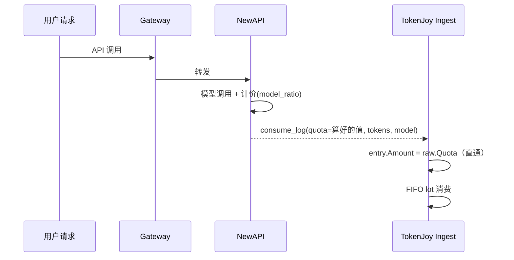
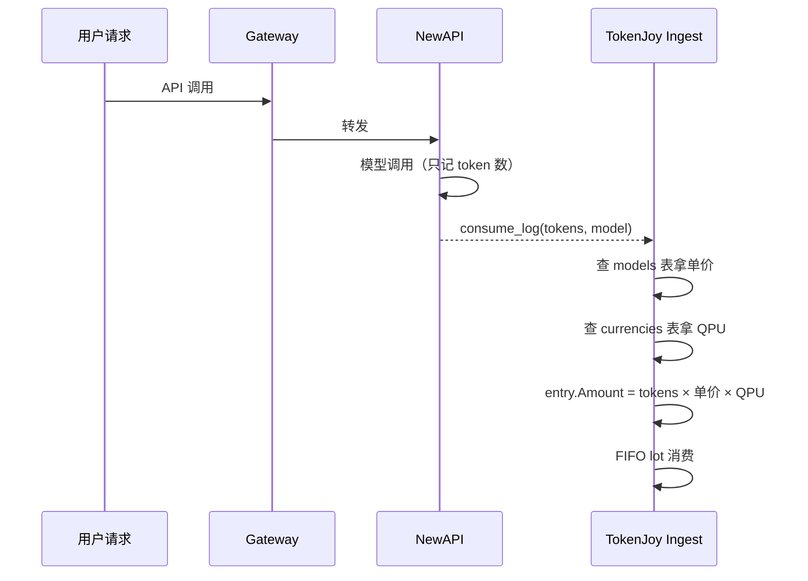
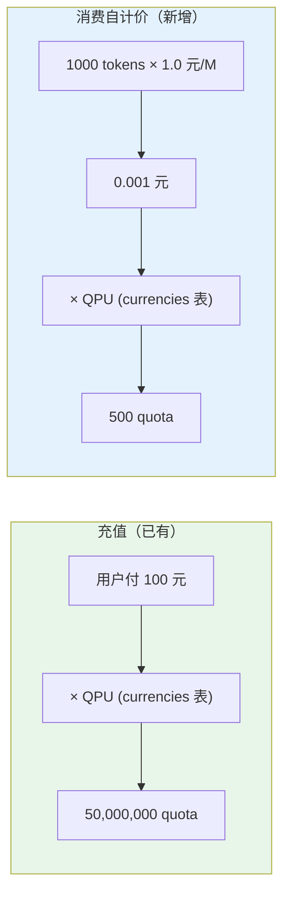
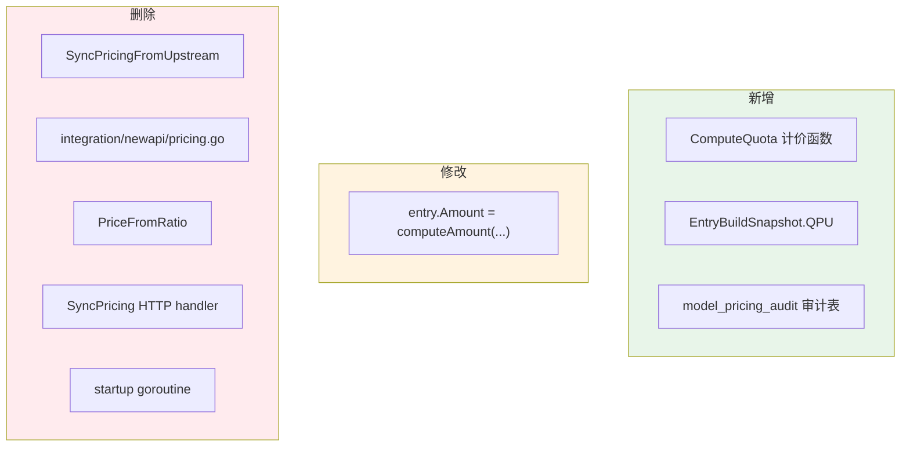
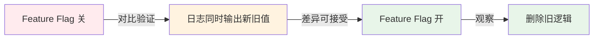

# 定价统一：TJ 自计价

## 一句话

把"tokens → quota"的计算从 NewAPI 搬到 TJ 来做。NewAPI 只报 token 数，TJ 自己用模型单价算钱。

---

## 1. 现状 vs 目标

### 现状：NewAPI 算，TJ 抄



**TJ 不参与计价，只搬运 NewAPI 的结果。**

### 目标：TJ 自己算



**TJ 掌握定价权，NewAPI 退化为纯转发。**

---

## 2. 计价逻辑

### 和充值走同一条路



**同一个 QPU，同一条路径：展示币 × QPU = quota。**

### 公式

```
展示币成本 = prompt_tokens × input_price / 1M + completion_tokens × output_price / 1M
quota      = Round(展示币成本 × QPU)
```

| 参数 | 来源 | 说明 |
|------|------|------|
| `input_price` / `output_price` | models 表 | 展示币/百万 tokens（管理员在 UI 维护） |
| `QPU` | currencies 表 | 每 1 展示币 = 多少 quota（动态可调） |

---

## 3. 优点

| 优点 | 说明 |
|------|------|
| **定价权归 TJ** | 管理员在 TJ 改价即生效，不依赖 NewAPI 后台 |
| **展示=实际** | 前端展示的模型单价就是实际扣费的价格，消除用户困惑 |
| **支持差异化定价** | 未来可按公司/部门/时段设不同价，NewAPI 做不到 |
| **可审计** | 谁改了价、什么时候改的，审计表全记录 |
| **解耦 NewAPI** | NewAPI 只管转发，model_ratio 改不改都不影响 TJ |
| **QPU 一致性** | 计价和充值走同一条换算，不存在两套 QPU 不一致的可能 |

## 4. 缺点 / 代价

| 缺点 | 说明 | 缓解 |
|------|------|------|
| **要维护模型价格** | 以前 NewAPI 维护 ratio，TJ 自动 sync；改后 TJ 必须自己管 | 管理员本来就在 TJ UI 填价格，只是以前是"展示用" |
| **新模型漏配风险** | NewAPI 接了新模型但 TJ 没加 → fallback 到 raw.Quota | 加 metrics 告警，发现 fallback 立即补录 |
| **切换期数据差异** | 新旧逻辑计算结果可能有微小舍入差 | 灰度期对比验证，确认差异在可接受范围 |
| **依赖 token 数准确** | 如果 NewAPI 上报的 token 数有误，TJ 也算错 | 和现状一样——NewAPI token 数是唯一源 |
| **1M 是隐式约定** | `input_price` 的单位（展示币/百万 tokens）是代码约定而非数据库配置 | 前端 UI label 已明确标注"¥/M tokens"，不易误解 |

---

## 5. 改动范围



### 文件清单

| 操作 | 文件 |
|------|------|
| 新增 | `newapiunits/pricing.go` → `ComputeQuota` |
| 修改 | `usage/entry_load.go` → snapshot 加 QPU |
| 修改 | `usage/entry_build.go` → Amount 改为自计价 |
| 删除 | `models/service.go` → `SyncPricingFromUpstream` |
| 删除 | `integration/newapi/pricing.go` → 整个文件 |
| 删除 | `adminport/types.go` → `ModelPricing` struct |
| 删除 | `adminport/port.go` → `ListModelPricing` |
| 删除 | `http/handler/models/handler.go` → `SyncPricing` |
| 删除 | `app/app.go` → startup goroutine |
| 删除 | `newapiunits/pricing.go` → `PriceFromRatio` |
| 新增 | migration → `model_pricing_audit` 表 |

---

## 6. 边界情况

| 场景 | 处理 |
|------|------|
| 模型不在 catalog | fallback `raw.Quota` + 告警 |
| token 数为零 | fallback `raw.Quota` |
| 价格为零（免费模型） | 正常算，amount=0 |
| QPU 被 admin 调整 | 后续 ingest 自动用新值（和充值一样） |
| 管理员调价 | 立即生效 + 审计记录 |

---

## 7. 上线策略



1. **灰度 flag**：`SelfPricingEnabled=false`，上线代码但不生效
2. **对比验证**：日志同时算 `computeAmount()` 和 `raw.Quota`，比较差异
3. **切换**：确认无异常后开启 flag
4. **清理**：删除 flag + 旧 sync 链路

**回滚**：任何阶段关 flag 即回到 `raw.Quota`，零风险。

---

## 8. 决策记录

| 决策 | 理由 |
|------|------|
| 走充值同一条换算路径 | 系统只有一种展示币→quota 的转换逻辑 |
| QPU 从 currencies 表动态查 | 和充值/lot 同源，admin 调整全局生效 |
| QPU 在 snapshot 级别缓存 | batch 内一致，不重复查 DB |
| 模型未找到时 fallback | 防御性，ingest 不中断 |
| 保底 1 quota | 防微请求零成本 |
| 灰度 flag 控制 | 可对比验证，随时回滚 |
| 删除整条 sync 链路 | TJ 为唯一定价源后完全不需要 |
| 加审计表 | 定价变更可追溯 |
