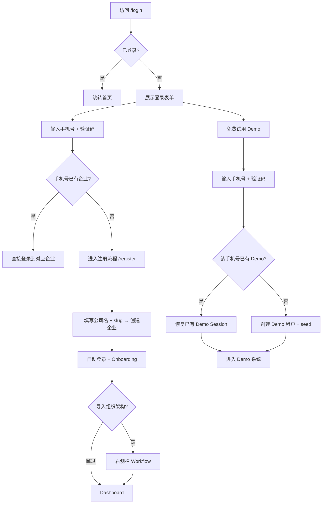
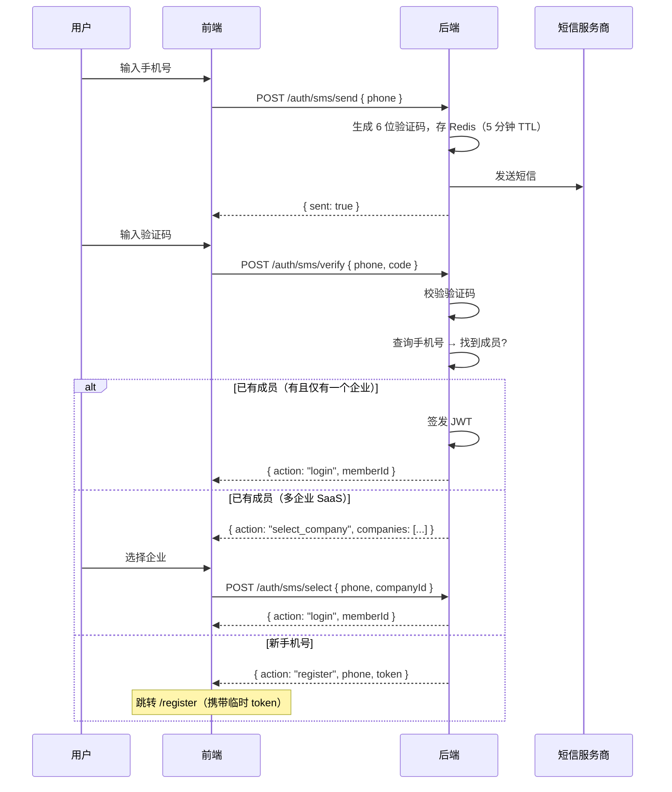
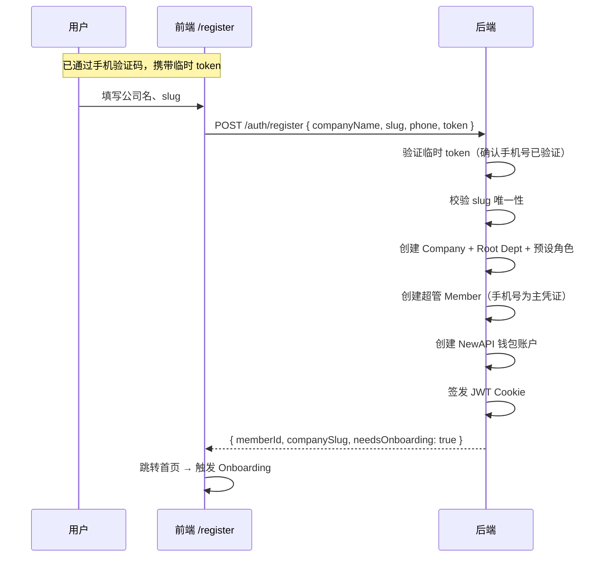
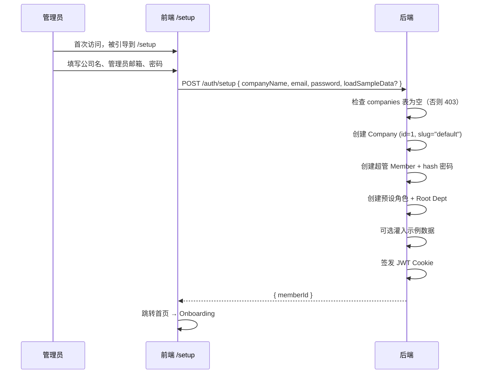

# 登录 / 注册 / Demo 模式方案设计

> **目标**：为 TokenJoy 提供完整的认证入口——公司注册（SaaS 公开）、私有化 Setup、成员导入与密码配置、Demo 沙箱——覆盖私有化与 SaaS 两种部署形态。  
> **市场**：中国，主认证方式为**手机号 + 短信验证码**。

---

## 目录

- [1. 现状分析](#1-现状分析)
- [2. 行业做法参考](#2-行业做法参考)
- [3. 总体设计](#3-总体设计)
- [4. 认证方式：手机号 + 验证码](#4-认证方式手机号--验证码)
- [5. SaaS 注册公司（`/register`）](#5-saas-注册公司register)
- [6. 私有化 Setup（`/setup`）](#6-私有化-setupsetup)
- [7. 成员入驻（导入组织架构 + 密码配置）](#7-成员入驻导入组织架构--密码配置)
- [8. Demo 模式](#8-demo-模式)
- [9. Company ID 段规划](#9-company-id-段规划)
- [10. 前端路由与页面规划](#10-前端路由与页面规划)
- [11. 后端 API](#11-后端-api)
- [12. 数据库变更](#12-数据库变更)
- [13. 安全考量](#13-安全考量)
- [14. 实施步骤](#14-实施步骤)

---

## 1. 现状分析

### 已有能力

| 能力 | 实现位置 | 说明 |
| --- | --- | --- |
| 邮箱 + 密码登录 | `POST /auth/login` + 前端 `/login` | bcrypt 验证 → JWT HttpOnly Cookie |
| SaaS 多企业 slug 路由 | `loginBody.companySlug` | `SUPPORT_SAAS=true` 时生效 |
| 平台开户 | `POST /platform/companies` | 平台运营创建公司 + 发邀请码 |
| 邀请激活 | `POST /auth/accept-invite` | 邀请码 + 设密码 → 创建成员 + JWT |
| Bootstrap / Seed | `BOOTSTRAP_MODE=demo|minimal` | 开发用种子数据 |
| 成员导入 | `POST /org/members/batch-import` | 超管批量导入（无密码设置） |
| 组织架构同步 | 飞书全量导入 + 定时同步 | US-02/03 |

### 缺失

| 缺失点 | 影响 |
| --- | --- |
| 无手机号 + 验证码认证 | 中国市场主流登录方式缺失 |
| SaaS 无公开注册页面 | 企业无法自助开通 |
| 私有化无 Setup Wizard | 首次部署需手动写库 |
| 邀请无真实投递 + 无激活页面 | 成员无法自助入驻 |
| 无 Demo 沙箱 | 公开试用数据互相可见 |
| 批量导入无密码设置 | 导入用户无法登录 |

---

## 2. 行业做法参考

### 2.1 中国 SaaS 登录注册

| 产品 | 做法 |
| --- | --- |
| **飞书** | 手机号 + 验证码登录/注册合一；新手机号自动注册 |
| **钉钉** | 手机号 + 验证码；已有组织直接加入，无组织创建新团队 |
| **企业微信** | 手机号 + 验证码 → 创建企业 |
| **语雀 / 腾讯文档** | 手机号一键登录/注册；首次即创建空间 |
| **Cursor / 国内 AI 工具** | 手机号 + 验证码 → 立即可用 |

**共性**：中国 ToB/ToC 产品几乎全部使用**手机号 + 短信验证码**作为主认证方式，登录与注册合一（同一页面，新号自动注册）。

### 2.2 Demo / 试用

| 产品 | 做法 |
| --- | --- |
| **飞书** | 免费版即试用，绑定手机号 |
| **Notion** | 注册即免费 workspace |
| **腾讯云 / 阿里云** | 试用需手机号注册，绑定后持久化 |

**TokenJoy 方案**：Demo 需手机号验证码注册，绑定手机号后给一个持久 Demo 租户，1 个月无登录才清理。

### 2.3 私有化部署

| 产品 | 做法 |
| --- | --- |
| **GitLab Self-Managed** | 首次访问 `/admin/setup` 设 root 密码 |
| **Metabase** | Setup Wizard（管理员 + 组织信息） |
| **JumpServer** | 首次部署初始化管理员 |

**TokenJoy 方案**：`/setup` 一次性 Wizard，邮箱+密码（私有化无短信依赖）。

---

## 3. 总体设计

### 入口总览

```
┌─────────────────────────────────────────────────────────────┐
│                         /login                              │
│  ┌──────────────────────────────────────────────────────┐   │
│  │  手机号: [___________]                                │   │
│  │  验证码: [______]  [获取验证码]                       │   │
│  │                                                       │   │
│  │  [登录 / 注册]   ← 登录注册合一                       │   │
│  │  ─────────────────────────────────────────────────── │   │
│  │  [免费试用 Demo]                                      │   │
│  │  ─────────────────────────────────────────────────── │   │
│  │  其他方式：[邮箱密码登录]                              │   │
│  └──────────────────────────────────────────────────────┘   │
│                                                             │
│  (私有化 + needsSetup): [首次部署? 设置管理员 →]            │
└─────────────────────────────────────────────────────────────┘
```

### 核心决策

| 决策 | 选择 | 理由 |
| --- | --- | --- |
| 主认证方式 | 手机号 + 短信验证码 | 中国市场标准；无需记密码 |
| 备用方式 | 邮箱 + 密码 | 私有化 / 海外 / 无短信场景 |
| 登录注册合一 | 是 | 降低心智负担；新手机号自动走注册流程 |
| Demo 绑定 | 手机号 → 持久 Demo 租户 | 同一手机号始终回到同一个 Demo |
| Demo 清理 | 1 个月无登录 | 非按创建时间清理，活跃用户不丢数据 |
| `/setup` vs `/register` | 分开 API | 语义不同，安全守卫不同 |

### 生命周期



---

## 4. 认证方式：手机号 + 验证码

### 4.1 登录/注册合一流程



### 4.2 验证码规则

| 配置 | 值 | 说明 |
| --- | --- | --- |
| 验证码长度 | 6 位数字 | |
| 有效期 | 5 分钟 | Redis TTL |
| 发送间隔 | 60 秒 | 防频繁发送 |
| 每日上限 | 10 次/手机号 | 防刷 |
| 验证尝试 | 最多 5 次 | 超过锁定 15 分钟 |
| 短信模板 | "验证码：{code}，5分钟内有效。" | |

### 4.3 邮箱密码作为备用

保留现有 `POST /auth/login`（邮箱+密码），作为：
- 私有化部署（无短信服务）的默认方式
- SaaS 下的备用登录方式（"其他方式 → 邮箱密码登录"）
- 管理员替设密码后成员使用

---

## 5. SaaS 注册公司（`/register`）

### 5.1 流程

用户通过手机验证码确认身份后（新手机号），跳转到注册页完成企业创建。



### 5.2 注册表单

```
┌────────────────────────────────────────┐
│         创建您的企业空间               │
│                                        │
│  手机号: 138****1234 ✓ (已验证，只读)  │
│  公司名称: [________________]          │
│  企业标识: [________________]          │
│    → your-company.tokenjoy.io          │
│                                        │
│  [创建企业]                            │
│                                        │
│  已有企业？[返回登录 →]                │
└────────────────────────────────────────┘
```

**注意**：注册时不需要设置密码——手机号验证码本身就是认证方式。如需密码（邮箱登录），后续在设置中添加。

### 5.3 Slug 实时检查

用户输入 slug 时 debounce 调用：
```
GET /auth/check-slug?slug=xxx → { available: bool }
```

---

## 6. 私有化 Setup（`/setup`）

### 6.1 定位

私有化部署首次启动时的一次性系统初始化。与 SaaS 注册**完全独立的端点和守卫**。

### 6.2 触发条件

`GET /auth/setup-status` → `{ needsSetup: true }` 当且仅当 companies 表为空。

### 6.3 流程



### 6.4 表单

```
┌────────────────────────────────────────┐
│         欢迎使用 TokenJoy              │
│       完成初始设置开始使用              │
│                                        │
│  公司名称: [________________]          │
│  管理员邮箱: [________________]        │
│  密码: [________________]              │
│  确认密码: [________________]          │
│                                        │
│  □ 加载示例数据（推荐首次体验勾选）    │
│                                        │
│  [完成设置]                            │
└────────────────────────────────────────┘
```

### 6.5 与 SaaS 注册的区别

| 维度 | `/auth/setup` | `/auth/register` |
| --- | --- | --- |
| 部署形态 | 私有化 | SaaS |
| 触发条件 | companies 表为空 | 任何时候（`REGISTRATION_ENABLED`） |
| 认证方式 | 邮箱 + 密码 | 手机号验证码 |
| Company ID | 固定 `1` | 从 `100_000+` 分配 |
| Slug | 自动 `default` | 用户自定义 |
| 调用次数 | 一次性（设置后永久 403） | 可多次（多企业注册） |
| 短信依赖 | 无（私有化可能无外网） | 有 |

---

## 7. 成员入驻（导入组织架构 + 密码配置）

### 7.1 Onboarding 导入组织架构

注册/Setup 完成后，触发 **Onboarding Workflow**（右侧滑出栏）。

**通用 Workflow，复用于多个场景**：
- 注册完成后的 Onboarding 引导
- 数据源配置页的 "导入" 按钮
- 组织管理页的 "批量导入" 入口

```
┌─────────────── 右侧滑出栏 ───────────────┐
│                                            │
│  导入组织架构                              │
│  ─────────────────────────────             │
│                                            │
│  选择导入方式：                            │
│                                            │
│  ┌──────────┐ ┌──────────┐ ┌──────────┐   │
│  │  飞书     │ │  CSV     │ │  手动    │   │
│  │  同步     │ │  上传    │ │  添加    │   │
│  └──────────┘ └──────────┘ └──────────┘   │
│                                            │
│  (选择后进入对应子步骤)                    │
│                                            │
│  [跳过，稍后设置]                          │
└────────────────────────────────────────────┘
```

### 7.2 导入后密码配置

导入完成后的最后一步——为成员开通登录能力：

| 方式 | 适用场景 | 实现 |
| --- | --- | --- |
| **发送短信邀请** | SaaS（有短信服务） | 短信含链接，成员打开后手机号自动认证 |
| **发送邮件邀请** | 有邮件服务 | 邮件含 `/invite/accept?code=xxx` |
| **设置统一初始密码** | 内网/无短信无邮件 | `POST /org/members/batch-set-password` |

### 7.3 Onboarding 状态持久化

| 字段 | 表 | 说明 |
| --- | --- | --- |
| `onboarding_status` | `companies` | `pending` / `completed` / `skipped` |

- `GET /session` 响应携带 `onboardingStatus`
- 前端据此决定是否弹出 Onboarding 滑出栏
- 用户跳过后状态设为 `skipped`，不再自动弹出
- 组织管理/数据源页始终提供 "导入" 入口（手动触发同一 Workflow）

### 7.4 邀请激活页（`/invite/accept`）

邮件邀请场景 → 成员点链接 → 设密码加入：

```
┌────────────────────────────────────────┐
│    欢迎加入 [公司名]                    │
│                                        │
│  您的邮箱: xxx@company.com (只读)      │
│  姓名: [________________]             │
│  设置密码: [________________]         │
│  确认密码: [________________]         │
│                                        │
│  [加入并登录]                          │
└────────────────────────────────────────┘
```

---

## 8. Demo 模式

### 8.1 核心设计

**原则**：Demo 通过手机号注册，每个手机号**永远**对应同一个 Demo 租户。1 个月无登录才清理。

```mermaid
flowchart TD
    A[点击 "免费试用"] --> B[输入手机号 + 验证码]
    B --> C{该手机号已有 Demo 租户?}
    C -->|是| D[恢复已有 Demo → 签发 JWT → 进入系统]
    C -->|否| E[创建 Demo Company + 灌 Seed]
    E --> F[绑定手机号 → 签发 JWT → 进入系统]

    G[Cron 每日] --> H{扫描 Demo 租户}
    H -->|最后登录 > 30 天| I[CASCADE DELETE]
    H -->|活跃| J[保留]
```

### 8.2 Demo 与正式注册的关系

| 维度 | Demo 试用 | 正式注册 |
| --- | --- | --- |
| 入口 | "免费试用" 按钮 | "登录/注册" 按钮 |
| 认证 | 手机号 + 验证码 | 手机号 + 验证码 |
| Company ID | 100 ~ 99,999 段 | 100,000+ 段 |
| 数据 | 预灌 seed | 空白 + Onboarding |
| 生命周期 | 30 天无登录清理 | 永久 |
| LLM 调用 | Mock（dev-mock-llm） | 真实供应商 |
| 功能限制 | 全功能可用（展示用） | 全功能 |
| 升级路径 | Banner "注册正式版" → 新建企业 | — |

### 8.3 同一手机号 Demo 持久化

```sql
-- demo_tenants 表（轻量映射）
CREATE TABLE demo_tenants (
    phone TEXT PRIMARY KEY,
    company_id BIGINT NOT NULL UNIQUE,
    created_at TIMESTAMPTZ NOT NULL DEFAULT NOW(),
    last_login_at TIMESTAMPTZ NOT NULL DEFAULT NOW()
);
```

- `POST /auth/demo` 先查 `demo_tenants` 表
- 找到 → 更新 `last_login_at` → 签发 JWT → 直接进入
- 未找到 → 分配新 company_id（Demo 段）→ 创建租户 + seed → 插入映射

### 8.4 Demo 体验

| 约束 | 说明 |
| --- | --- |
| 持久化 | 同一手机号始终回到同一环境 |
| 清理条件 | `last_login_at < NOW() - 30 days` |
| 无真实 LLM | Gateway 走 `dev-mock-llm` |
| Banner | 顶部固定 "试用环境 · [注册正式版]" |
| 限流 | Demo 租户额外限流（防滥用） |
| 最大数量 | `DEMO_MAX_TENANTS`（默认 1000） |
| 钱包 | 显示固定余额，充值按钮禁用 |

### 8.5 Demo Banner CTA

```
┌──────────────────────────────────────────────────────────┐
│ 🎯 您正在使用试用环境，数据将在 30 天无活动后清理        │
│                                [注册正式版 →]             │
└──────────────────────────────────────────────────────────┘
```

点击 "注册正式版" → 跳转 `/register`（手机号已验证，直接填公司信息）。

---

## 9. Company ID 段规划

| ID 范围 | 用途 | 说明 |
| --- | --- | --- |
| `1 ~ 99` | 开发/测试保留 | `BOOTSTRAP_MODE=demo/minimal` seed 使用 company_id=1 |
| `100 ~ 99_999` | **Demo 临时租户** | `POST /auth/demo` 分配；30 天无活动清理 |
| `100_000+` | **正式企业** | SaaS 注册 / 平台开户 |

私有化部署 company_id 固定为 `1`。

### 实现

```go
const (
    DevIDMax            = 99        // 1~99 开发保留
    DemoCompanyIDMin    = 100       // Demo 段
    DemoCompanyIDMax    = 99_999
    ProductionCompanyID = 100_000   // 正式企业起点
)
```

### 好处

- 查询：`WHERE company_id >= 100000` 过滤正式企业
- 清理：只操作 `100~99999` 段 + `last_login_at` 过期
- 监控：按段统计 Demo vs 正式
- 兼容：开发 seed company_id=1 不受影响
- 容量：Demo 段可容纳 ~99,900 个并发 Demo 租户

---

## 10. 前端路由与页面规划

### 10.1 新增路由

| 路由 | 页面 | 条件 | audience |
| --- | --- | --- | --- |
| `/register` | SaaS 企业注册 | `VITE_SUPPORT_SAAS=true` | 公开 |
| `/setup` | 私有化首次安装 | `needsSetup=true` | 公开 |
| `/invite/accept` | 邀请激活 | `?code=xxx` | 公开 |
| `/forgot-password` | 忘记密码（P2） | — | 公开 |
| `/reset-password` | 重置密码（P2） | `?token=xxx` | 公开 |

### 10.2 `/login` 页改造

主表单改为手机号 + 验证码（SaaS），底部保留"其他方式：邮箱密码登录"。

```
┌────────────────────────────────────────┐
│            登录 TokenJoy                │
│                                        │
│  手机号: [+86 ___________]             │
│  验证码: [______]  [获取验证码 60s]    │
│                                        │
│  [登录 / 注册]                         │
│                                        │
│  ──────────── 或 ────────────          │
│  [免费试用 Demo]                       │
│                                        │
│  其他方式：邮箱密码登录                │
└────────────────────────────────────────┘
```

**条件矩阵**：

| 条件 | 显示内容 |
| --- | --- |
| SaaS + DEMO_ENABLED | 手机号登录 + Demo 按钮 + 邮箱备用 |
| SaaS + !DEMO_ENABLED | 手机号登录 + 邮箱备用 |
| 私有化 + needsSetup | 邮箱密码登录 + Setup 链接 |
| 私有化 + !needsSetup | 邮箱密码登录 |

### 10.3 Onboarding Workflow

复用 `features/workflow/`：

```
features/workflow/workflows/onboarding-import.tsx
features/workflow/definitions/onboarding.ts
```

触发条件：`session.onboardingStatus === 'pending'` 时 `workflowStore.open('onboarding-import')`。

---

## 11. 后端 API

### 11.1 短信验证码

| 方法 | 路径 | Body | 响应 | 说明 |
| --- | --- | --- | --- | --- |
| POST | `/auth/sms/send` | `{ phone }` | `{ sent: true }` | 发送验证码；60s 限频 |
| POST | `/auth/sms/verify` | `{ phone, code }` | `SmsVerifyResult` | 验证并决定下一步 |
| POST | `/auth/sms/select` | `{ phone, companyId, sessionToken }` | `{ memberId }` | 多企业时选择公司 |

**`SmsVerifyResult`**：

```typescript
type SmsVerifyResult =
  | { action: "login"; memberId: string }           // 直接登录
  | { action: "select_company"; companies: CompanyBrief[] }  // 多企业选择
  | { action: "register"; phone: string; token: string }     // 新手机号→注册
```

### 11.2 SaaS 注册（独立端点）

| 方法 | 路径 | Body | 响应 | 说明 |
| --- | --- | --- | --- | --- |
| POST | `/auth/register` | `RegisterBody` | `{ memberId, companySlug }` | 需 `REGISTRATION_ENABLED=true` |
| GET | `/auth/check-slug` | query: `slug` | `{ available: bool }` | Slug 实时检查 |

```typescript
interface RegisterBody {
  companyName: string
  companySlug: string
  phone: string        // 已验证的手机号
  token: string        // sms/verify 返回的临时 token
}
```

### 11.3 私有化 Setup（独立端点）

| 方法 | 路径 | Body | 响应 | 说明 |
| --- | --- | --- | --- | --- |
| GET | `/auth/setup-status` | — | `{ needsSetup: bool }` | 公开 |
| POST | `/auth/setup` | `SetupBody` | `{ memberId }` | 一次性；companies 非空时 403 |

```typescript
interface SetupBody {
  companyName: string
  email: string
  password: string
  loadSampleData?: boolean
}
```

### 11.4 Demo

| 方法 | 路径 | Body | 响应 | 说明 |
| --- | --- | --- | --- | --- |
| POST | `/auth/demo` | `{ phone, code }` | `{ memberId, companySlug, isNew }` | 验证码 + 查找/创建 Demo |

### 11.5 邀请与密码

| 方法 | 路径 | Body | 响应 | 说明 |
| --- | --- | --- | --- | --- |
| GET | `/auth/invite-info` | query: `code` | `{ email, companyName, expired }` | 激活页前置信息 |
| POST | `/auth/accept-invite` | （已有） | — | 无变更 |
| POST | `/org/members/:id/set-password` | `{ password }` | `void` | 需 `org:member:write` |
| POST | `/org/members/batch-set-password` | `{ memberIds, password }` | `void` | 需 `org:member:write` |

### 11.6 P2

| 方法 | 路径 | 说明 |
| --- | --- | --- |
| POST | `/auth/forgot-password` | 发重置邮件 |
| POST | `/auth/reset-password` | 验证 token + 重设密码 |

### 11.7 配置

| 环境变量 | 默认值 | 说明 |
| --- | --- | --- |
| `SMS_PROVIDER` | — | 短信服务商（`aliyun` / `tencent`） |
| `SMS_ACCESS_KEY` | — | 短信服务凭证 |
| `SMS_ACCESS_SECRET` | — | |
| `SMS_SIGN_NAME` | — | 短信签名（如 "TokenJoy"） |
| `SMS_TEMPLATE_CODE` | — | 验证码模板 ID |
| `DEMO_ENABLED` | `false` | 开放公开 Demo |
| `DEMO_TTL_DAYS` | `30` | Demo 无活动清理天数 |
| `DEMO_MAX_TENANTS` | `1000` | 最大 Demo 租户数 |
| `REGISTRATION_ENABLED` | `true` | SaaS 允许公开注册 |
| `APP_URL` | — | 邮件/短信链接基地址 |

---

## 12. 数据库变更

```sql
-- 短信验证码（Redis 存储为主，PG 做审计/防刷记录）
CREATE TABLE sms_codes (
    id BIGSERIAL PRIMARY KEY,
    phone TEXT NOT NULL,
    code TEXT NOT NULL,
    purpose TEXT NOT NULL DEFAULT 'login',  -- login / demo / reset
    expires_at TIMESTAMPTZ NOT NULL,
    verified_at TIMESTAMPTZ,
    attempts INT NOT NULL DEFAULT 0,
    created_at TIMESTAMPTZ NOT NULL DEFAULT NOW()
);
CREATE INDEX idx_sms_codes_phone ON sms_codes(phone, created_at DESC);

-- Demo 租户映射（手机号 → company）
CREATE TABLE demo_tenants (
    phone TEXT PRIMARY KEY,
    company_id BIGINT NOT NULL UNIQUE REFERENCES companies(id),
    created_at TIMESTAMPTZ NOT NULL DEFAULT NOW(),
    last_login_at TIMESTAMPTZ NOT NULL DEFAULT NOW()
);
CREATE INDEX idx_demo_tenants_cleanup ON demo_tenants(last_login_at);

-- companies 表扩展
ALTER TABLE companies ADD COLUMN is_demo BOOLEAN NOT NULL DEFAULT FALSE;
ALTER TABLE companies ADD COLUMN onboarding_status TEXT NOT NULL DEFAULT 'pending';
-- onboarding_status: 'pending' | 'completed' | 'skipped'

-- members 表扩展（手机号作为认证凭证）
-- 注：members.phone 列已存在，无需新增
-- 确保有唯一索引用于手机号查找：
CREATE UNIQUE INDEX idx_members_phone_company
    ON members(company_id, phone) WHERE phone IS NOT NULL AND phone != '';

-- 密码重置 token（P2）
CREATE TABLE password_reset_tokens (
    id TEXT PRIMARY KEY,
    company_id BIGINT NOT NULL,
    member_id TEXT NOT NULL,
    token_hash TEXT NOT NULL,
    expires_at TIMESTAMPTZ NOT NULL,
    used_at TIMESTAMPTZ,
    created_at TIMESTAMPTZ NOT NULL DEFAULT NOW()
);
CREATE INDEX idx_prt_hash ON password_reset_tokens(token_hash);
```

---

## 13. 安全考量

| 风险 | 缓解措施 |
| --- | --- |
| 短信验证码被刷 | 60s 发送间隔 + 10 次/天/号 + IP 限流 |
| 验证码暴力破解 | 5 次错误锁定 15 分钟 |
| `/setup` 被外部访问 | 仅 companies 为空时允许；设置后永久 403 |
| `/register` 批量注册 | `REGISTRATION_ENABLED` 开关；IP 限流 |
| Demo 被滥用 | 手机号绑定（防匿名刷）；租户限流；最大数量 |
| Demo 手机号隐私 | phone 字段不在 Demo 响应中暴露；仅做内部映射 |
| slug 抢注 | Demo 公司 slug 加 `demo-` 前缀；正式不允许该前缀 |
| 邀请链接泄露 | 64 字符随机 hex；7 天过期；一次性 |
| 临时 token 劫持 | sms/verify 返回的 token 5 分钟有效 + 一次性使用 |
| 密码强度 | ≥8 字符（P2: 增强策略） |

---

## 14. 实施步骤

### Phase 1 — 短信认证 + 注册 + Setup

1. **短信基础设施**
   - `infra/sms/` — 阿里云/腾讯云 SMS 适配
   - Redis 验证码存储 + 防刷逻辑
   - `POST /auth/sms/send` + `POST /auth/sms/verify`

2. **ID 段常量 + DB Migration**
   - `DemoCompanyIDMin/Max`、`ProductionCompanyID`
   - `is_demo`、`onboarding_status` 列
   - `demo_tenants`、`sms_codes` 表

3. **`POST /auth/setup`（私有化）**
   - 一次性守卫 + `provisionCompany()` 内部函数
   - 前端 `/setup` 页面

4. **`POST /auth/register`（SaaS）**
   - 临时 token 验证 + 创建公司（手机号为主凭证）
   - `GET /auth/check-slug`
   - 前端 `/register` 页面

5. **`/login` 页面改造**
   - 主表单改为手机号 + 验证码
   - 条件矩阵（SaaS / 私有化 / Demo）

### Phase 2 — Demo + Onboarding

6. **`POST /auth/demo`**
   - `demo_tenants` 映射 + seed 灌入
   - 清理 Cron（30 天无活动）
   - 前端 "免费试用" 按钮 + Demo Banner

7. **Onboarding Workflow（导入组织架构）**
   - `onboarding_status` 持久化 + `GET /session` 携带
   - 右侧栏 Workflow（飞书 / CSV / 手动）
   - 密码配置步骤

8. **`/invite/accept` 页面**
   - `GET /auth/invite-info`
   - 前端激活表单

9. **管理员设密码 API**
   - `POST /org/members/:id/set-password`
   - `POST /org/members/batch-set-password`

### Phase 3 — 增强

10. **邀请短信/邮件真实投递**
11. **忘记密码 / 重置密码**
12. **首次登录强制修改密码**
13. **注册防刷加固（图形验证码）**
14. **密码策略增强**

---

## 附录：与现有系统的兼容

| 现有机制 | 处理方式 |
| --- | --- |
| `POST /auth/login`（邮箱密码） | **保留**，作为备用登录方式 |
| `BOOTSTRAP_MODE=demo/minimal` | **保留**，开发环境用 |
| Seed `demo1234` 密码 | 仅 bootstrap 写入 |
| `POST /auth/accept-invite` | 无变更 |
| `POST /platform/companies` | 保留（平台开户）；正式 ID 100000+ |
| `SaaSMinCompanyID = 100` | 调整：Demo 段起点 |
| 前端 DEV 自动填充 | 保留 |
| members.phone 列 | 已存在；新增联合唯一索引 |

---

## 附录：短信服务商选型

| 服务商 | 优势 | 备注 |
| --- | --- | --- |
| **阿里云短信** | 市占率高、稳定、API 简单 | 需企业认证 |
| **腾讯云短信** | 与微信生态打通 | |
| **华为云短信** | 政企场景 | |

建议首选阿里云短信（`dysmsapi`），接口一个 struct 即可适配。后续可加 provider 抽象支持切换。
