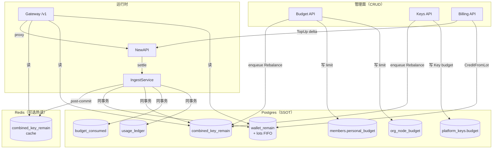
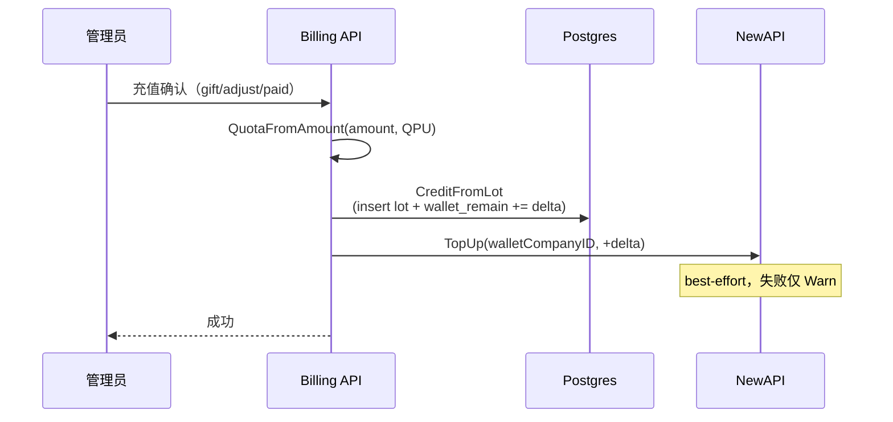
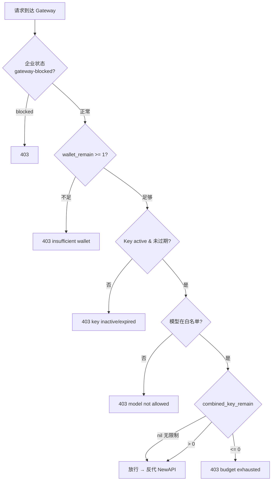
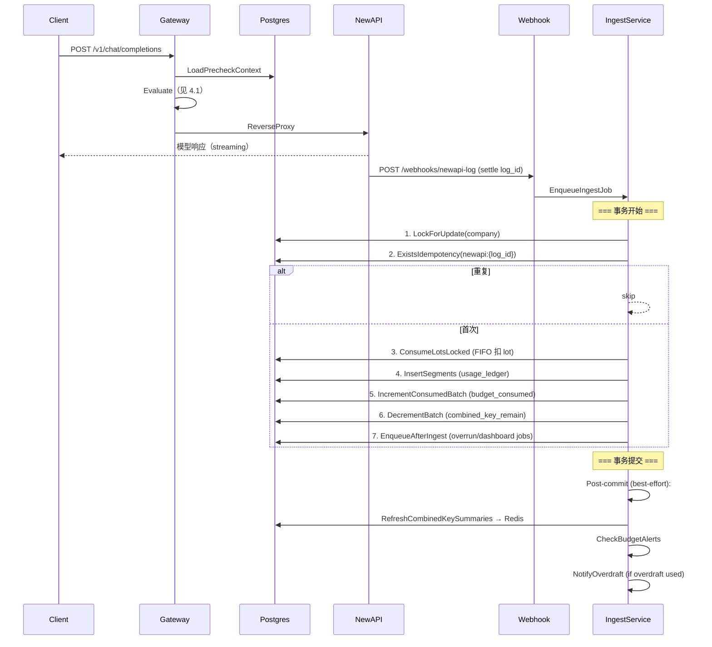
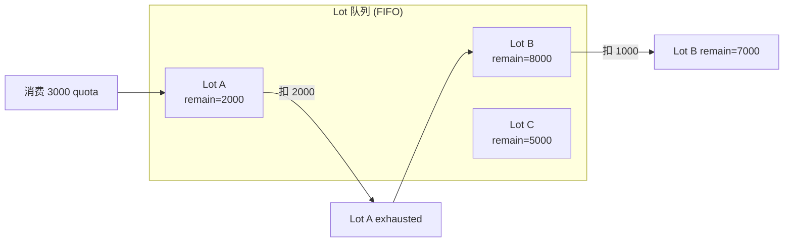
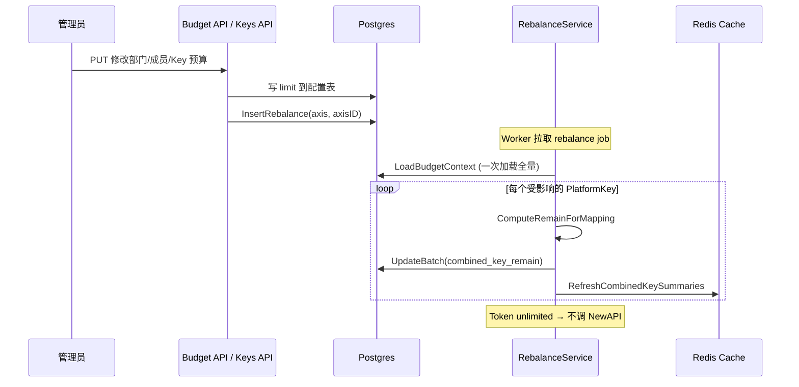
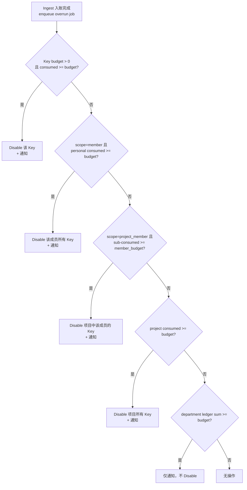
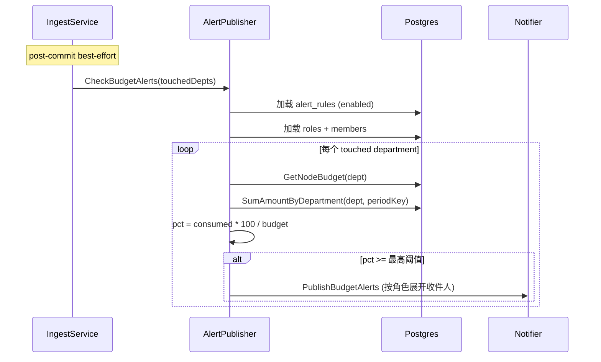
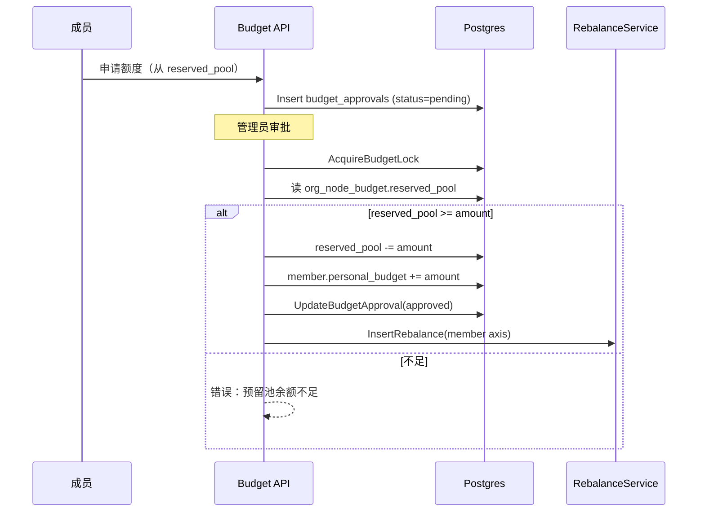
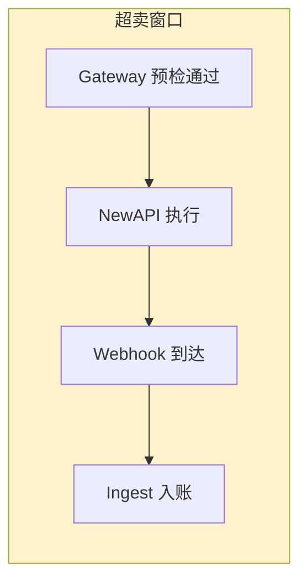

# 预算 · 配额 · 账单架构

> **日期**：2026-07-20（v2 重写）  
> **范围**：企业钱包、组织预算、Gateway 预检、token 消耗入账、账单、充值、超限、预警  
> **代码验证**：所有描述均已与 `apps/backend/internal/` 源码核对

---

## 目录

1. [概念总览](#1-概念总览)
2. [核心数据模型](#2-核心数据模型)
3. [流程一：充值](#3-流程一充值)
4. [流程二：一次 API 调用（预检 → 消费 → 入账）](#4-流程二一次-api-调用预检--消费--入账)
5. [流程三：调整预算 → 配额刷新](#5-流程三调整预算--配额刷新)
6. [流程四：超限处理（Overrun）](#6-流程四超限处理overrun)
7. [流程五：预警通知（Alert）](#7-流程五预警通知alert)
8. [流程六：预算审批（Approval）](#8-流程六预算审批approval)
9. [关键文件索引](#9-关键文件索引)
10. [架构优化建议](#10-架构优化建议)

---

## 1. 概念总览

TokenJoy 的计费体系由两根**独立的轴**控成本：

```text
┌─────────────────────────────────────────────────────────┐
│  轴 1：企业钱包（wallet）— 硬上限，预付模型              │
│    充值 → lot（FIFO） → wallet_remain                   │
│    用完即止，允许 overdraft 扩展                         │
├─────────────────────────────────────────────────────────┤
│  轴 2：组织预算（budget）— 软限额，月度分配              │
│    部门 budget → 成员 personal_budget → Key budget       │
│    consumed 按月累加，新月归零                           │
│    combined_key_remain = min(各级剩余) → Gateway 预检    │
└─────────────────────────────────────────────────────────┘
```

两轴**同时满足**才放行请求；任一不足则 403。

### 1.1 量纲对齐

系统内部只有一个量纲：**point（quota）**。与 NewAPI 的 `logs.quota` 完全对齐，不做二次换算。

| 方向 | 公式 | 代码 |
|------|------|------|
| 展示币 → point | `round(amount × quota_per_unit)` | `common.QuotaFromAmount` |
| point → 展示币 | `quota / quota_per_unit` | `common.QuotaToDisplay` |

默认：**1 CNY = 500,000 point**（`DefaultQuotaPerUnit`）。

### 1.2 与 NewAPI 的关系

| 组件 | 当前状态 | 说明 |
|------|---------|------|
| NewAPI Token | `UnlimitedQuota = true` | 不限额，Gateway 不靠它做拦截 |
| NewAPI User | 充值时 TopUp(+delta) | 镜像钱包金额，仅防直连穿透 |
| NewAPI logs.quota | 真实消费金额 | Ingest 透传入账，不做换算 |

---

## 2. 核心数据模型

### 2.1 整体架构图



### 2.2 预算层级树

```text
企业
 └─ 根部门 (org_node_budget.budget)
      ├─ reserved_pool（预留给审批）
      ├─ 子部门 budget
      ├─ 成员 personal_budget
      │    └─ Key budget (scope=member)
      └─ 项目 budget
           ├─ Key budget (scope=project)
           └─ 项目成员子配额 + Key (scope=project_member)
```

### 2.3 consumed 三轴

`budget_consumed` 只记录三种 axis：

| axis_kind | axis_id | 用途 |
|-----------|---------|------|
| `platform_key` | Key ID | Key 级消耗 |
| `member` | 成员 ID | 成员总消耗 |
| `project` | 项目 ID | 项目总消耗 |

**部门花费**不在 consumed 里——通过 `usage_ledger.department_id` 聚合。

### 2.4 combined_key_remain 公式

`pkg/budget.GatewayChainRemain(scope, inputs)` 按 scope 取各级剩余的 **min**：

| scope | remain = min of |
|-------|-----------------|
| `member` | key_remain, personal_remain |
| `project` | key_remain, project_remain |
| `project_member` | sub_quota_remain, project_remain |

注意：`key_remain` 只在 `KeyBudget > 0` 时参与计算（无预算 = 无限制）。  
钱包不进入此链——在 Evaluate 中独立检查。

---

## 3. 流程一：充值



**关键逻辑（`domain/billing/lot_confirm.go`）：**

1. 计算 `quotaGranted = QuotaFromAmount(amount, ppu)`
2. 构建 `RechargeOrder` + `RechargeLot`
3. `CreditFromLot`：事务内 insert lot + `ApplyWalletDelta(+quotaGranted)`
4. `topUpNewAPIQuota`：best-effort 调 NewAPI Admin TopUp

**FIFO lot 队列（`domain/billing/lot/consume.go`）：**
- 充值产生 lot（paid/gift/adjust/overdraft 四种）
- 消费时从 `FIFOHeadLotID` 开始逐个扣减
- lot 耗尽标记 `exhausted`，指针前移
- 余额不足时自动 `ExpandOverdraftLot`（透支扩展）

---

## 4. 流程二：一次 API 调用（预检 → 消费 → 入账）

这是系统最核心的流程。

### 4.1 Gateway 预检



**重要设计决策：**
- 预检**不做按请求估价**，只判断「还有没有额度」
- Redis 缓存 fail-open：miss 或 Redis 挂了 → 回退到 PG 查询
- `combined_key_remain` 的 version 字段用于防止 stale cache 误拦

### 4.2 完整入账流程



### 4.3 入账金额来源

```text
NewAPI logs.quota ──直接透传──► entry.Amount
                                   │
                    ┌───────────────┼───────────────┐
                    ▼               ▼               ▼
             wallet_remain    budget_consumed   combined_key_remain
              (lot FIFO)        (+= amount)       (-= amount)
```

**没有任何换算**——`entry.Amount = input.Raw.Quota`（`entry_build.go` L80）。

### 4.4 Lot FIFO 消费细节



若所有 lot 不足：`ExpandOverdraftLot` 创建透支 lot → 通知 overdraft expansion。

---

## 5. 流程三：调整预算 → 配额刷新



**关键点：**
- Rebalance 只刷 PG 的 `combined_key_remain`，**不同步 NewAPI Token**
- 代码注释：`"Token is unlimited on NewAPI — no remote quota to sync"`
- 下一个请求到达 Gateway 时即按新限额拦截

### 5.1 Rebalance 轴范围

系统定义三种 Rebalance 轴（`store/rebalance.go`），决定需要刷新哪些 Key 的 `combined_key_remain`：

| 轴 | 值 | 加载范围 | 典型触发场景 |
|---|---|---|---|
| `member` | 成员 ID | 只加载该成员关联的所有 PlatformKeyMapping | 修改成员 personal_budget |
| `project` | 项目 ID | 只加载该项目关联的所有 PlatformKeyMapping | 修改项目 budget |
| `company` | 企业 ID | 加载该企业**所有 active** 的 PlatformKeyMapping | 修改部门 budget、均分额度、月初重置 |

### 5.2 Rebalance 处理流程详解

`RebalanceService.ProcessAxis` 内部：

```text
1. 按 axisKind 查出受影响的 PlatformKeyMapping 列表
2. 过滤：只保留 NewAPIKeyID != nil 且 SyncStatus = "synced" 的（已同步的 active mapping）
3. 一次性 LoadBudgetContext：加载所有成员/项目/Key/consumed 到内存
4. 对每个 mapping：
   a. 定位其 departmentID → 确定当前账期 periodKey
   b. BuildChainInputs → GatewayChainRemain(scope, inputs) → 计算 remain
   c. UpdateBatch 写入 combined_key_remain（PG）
   d. RefreshCombinedKeySummaries → 推送 Redis cache
```

### 5.3 具体场景举例

**例 1：管理员调高成员 A 的 personal_budget 从 10,000 → 20,000**

```text
① UpdateMemberBudget(memberA, 20000)
   → 事务内校验总额不超过部门 budget
   → PG: members.personal_budget = 20000
② 事务提交后 enqueueMemberRebalance(memberA)
③ Worker 拉取 job → ProcessAxis("member", memberA)
④ 查 PlatformKeyMapping → 成员 A 有 2 把 Key（key-1、key-2）
⑤ 对 key-1：
   - KeyBudget=5000, KeyConsumed=3000 → key_remain=2000
   - PersonalCap=20000, PersonalConsumed=8000 → personal_remain=12000
   - GatewayChainRemain("member", ...) = min(2000, 12000) = 2000
⑥ 对 key-2（无 KeyBudget 限制）：
   - PersonalCap=20000, PersonalConsumed=8000 → personal_remain=12000
   - GatewayChainRemain("member", ...) = 12000
⑦ UpdateBatch: key-1.combined_key_remain=2000, key-2.combined_key_remain=12000
```

**例 2：管理员调低部门 budget 从 100,000 → 50,000（已消费 60,000）**

```text
① UpdateNode(deptID, 50000)
   → 事务内 ValidateBudgetNodeUpdate 校验子配置总和不超出
   → PG: org_node_budget.budget = 50000
② enqueueCompanyRebalance → 全公司 Rebalance
③ 该部门下所有 Key 的 combined_key_remain 重算
   → 注意：部门 budget 不直接参与 chain 计算
   → 但成员 personal_budget 不能超过部门 budget（校验时保证）
④ 部门是否超限由 Overrun + Alert 独立检查（通过 ledger 聚合）
```

**例 3：月初自动归零 → Rebalance**

```text
① 每月 1 日 EnsureMonthRebalance 检查 LastRebalancedPeriod ≠ 当前月
② InsertRebalance("company", companyID)
③ Worker 执行全公司 Rebalance
④ 所有 Key 的 consumed 按新 periodKey 查询 → 本月消费=0
⑤ combined_key_remain 回到各级 budget 限额（满额）
⑥ Gateway 下一请求即用新额度放行
```

### 5.4 均分额度（ApplyAverageBudget）

一种批量调整便捷操作——对某部门下所有成员统一设置 personal_budget：

```text
管理员："把研发部所有人额度设为 5000"
① 验证：部门 budget ≥ 子部门总额 + 项目总额 + 人数×5000
② 批量更新所有成员的 personal_budget = 5000
③ 记录 member_avg_budget（用于 recursive 跳过已设置子部门）
④ enqueueCompanyRebalance → 全量刷新
```

### 5.5 操作影响矩阵

| 操作 | PG 影响 | NewAPI Token | NewAPI User |
|------|---------|-------------|-------------|
| 改部门/成员预算 | 写 limit + Rebalance | 不调用 | 不变 |
| 改 Key budget | 写 + RefreshPlatformKeyCombined | UpdateToken 只同步 status/models/group | 不变 |
| 创建 Key | 写 + Refresh | CreateToken(Unlimited=true) | 不变 |
| 充值 | Credit lot + wallet | 不变 | TopUp(+delta) |
| 消费入账 | wallet/consumed/remain 递减 | user quota 由 NewAPI 自扣 | — |
| 月初重置 | consumed 新月自动归零（按 periodKey 查） | 不调用 | 不变 |

### 5.6 设计决策

**为什么 Preload-Once 而非逐 Key 查询？**  
`LoadBudgetContext` 一次加载全部成员、项目、Key 数据到内存，然后对每个 mapping 在内存中计算。对大多数租户（< 1000 个 Key），单次 SQL 查询比 N 次小查询更高效。只有当某租户 Key 数量极大时，才需要考虑按 axis 范围过滤加载。

**为什么 Rebalance 是异步的？**  
管理员修改预算需要立即返回成功。Rebalance 可能涉及几百个 Key 的重算，放在 worker 中避免阻塞 HTTP 响应。时效性影响：admin 操作到 Gateway 生效有几秒延迟（worker 延迟 + Redis 传播），在人工操作场景下完全可接受。

---

## 6. 流程四：超限处理（Overrun）

Overrun 在入账**事务内**构建 payload、事务后 enqueue job，由 `OverrunService` 异步处理。

### 6.1 入队条件（Gate）

并非每次入账都触发 Overrun job。`ShouldEnqueueOverrun` 的判断逻辑：

```text
入账事务内：
  1. absoluteRecompute → 得到最新 combined_key_remain
  2. 取该 Key 的 summary.Remain

                 ┌─────────────────────────────┐
                 │ summaries == nil（Unconstrained）│───→ 不入队（无配额约束）
                 └───────────────┬─────────────┘
                                 │
                 ┌───────────────▼─────────────┐
                 │ Key 在 summaries 中找到       │
                 │   remain <= 0？             │───→ 入队 ✓
                 │   remain > 0？              │───→ 不入队
                 └───────────────┬─────────────┘
                                 │
                 ┌───────────────▼─────────────┐
                 │ Key 不在 summaries 中         │───→ 入队 ✓（Unknown = 安全起见检查）
                 └─────────────────────────────┘
```

**设计原则**：宁可多检查一次（Unknown → enqueue），不可漏掉超限（false negative 比 false positive 后果严重）。

### 6.2 评估流程图



**评估顺序**（由细到粗）：Key → Member → ProjectMember → Project → Department

- Key/Member/Project/ProjectMember 级别：**自动 Disable Key**（通过 `newapisync.DisablePlatformKey`）
- Department 级别：**仅发通知**（不自动禁用）
- 所有 Disable 动作通过 `OverrunKeyControl` 接口，既 Disable PG 记录也更新 NewAPI Token status
- 评估在**事务内**读最新 consumed（带 `AcquireBudgetLock`），确保并发安全

### 6.3 DisablePlatformKey 做了什么

```text
DisablePlatformKey(keyID):
  1. PG: key.Status = "disabled"  → 写入 platform_keys 表
  2. 查 PlatformKeyMapping 找到对应 NewAPIKeyID
  3. 调 NewAPI Admin API: UpdateToken(id, status="disabled")
     → NewAPI 侧也标记 token 为 disabled
```

效果：下一个使用该 Key 的请求在 Gateway 预检阶段就被拦截（检查 Key status ≠ active）。

### 6.4 各级 Disable 范围

| 级别 | 判定条件 | Disable 范围 | 通知 |
|------|---------|-------------|------|
| Key | `keyConsumed >= key.Budget` | 仅该 Key | ✓ |
| Member | `memberConsumed >= personal_budget` | 该成员所有 active Key（`ListActiveMemberKeys`） | ✓ |
| ProjectMember | `subConsumed >= project.memberBudget` | 该项目中该成员的所有 `scope=project_member` Key | ✓ |
| Project | `projectConsumed >= project.budget` | 该项目所有 `scope=project/project_member` Key | ✓ |
| Department | `ledgerSum >= dept.budget` | 无（仅通知） | ✓ |

### 6.5 具体场景举例

**例 1：Key 级超限（最常见）**

```text
场景：Key-A 预算 10,000 point，已消费 9,800。一次请求消耗 300 point。
① Ingest 入账：key consumed → 10,100（已超 10,000）
② combined_key_remain 重算 → 0（或负数）
③ ShouldEnqueueOverrun → remain <= 0 → 入队 ✓
④ OverrunService.evaluateOverrun：
   - key.Budget=10000, keyConsumed=10100 → BudgetExhausted=true
   - action = Disable Key-A
⑤ DisablePlatformKey(Key-A)：PG disabled + NewAPI token disabled
⑥ 通知管理员：{"scope":"platformKey", "consumed":10100, "budget":10000}
⑦ 后续请求用 Key-A → Gateway 预检 Key status=disabled → 403
```

**例 2：成员级超限（跨 Key 累计）**

```text
场景：成员 B personal_budget=50,000。有 3 把 Key（各无 Key budget）。
      Key-1 消费 20,000 + Key-2 消费 20,000 + Key-3 本次消费 12,000 = 52,000

① Ingest 入账 Key-3 的 12,000
② evaluateOverrun：
   - Key-3 无 budget → 跳过 Key 级检查
   - memberConsumed=52,000 >= personal_budget=50,000 → BudgetExhausted=true
   - action = disableMemberKeys(memberB)
③ 遍历 ListActiveMemberKeys(memberB) → [Key-1, Key-2, Key-3]
④ 逐个 DisablePlatformKey → 三把 Key 全部 disabled
⑤ 通知管理员：{"scope":"member", "consumed":52000, "capacity":50000}
```

**例 3：项目成员子配额超限**

```text
场景：项目 P budget=100,000，成员 C 在项目 P 的子配额=15,000。
      成员 C 在项目 P 有 2 把 scope=project_member 的 Key。

① Ingest 入账后 subConsumed（该成员在项目 P 所有 Key 消耗之和）= 15,500
② evaluateOverrun：
   - Key 级无 budget → 跳过
   - scope != member（是 project_member）→ 跳过 Member 级
   - ProjectMember 级：subConsumed=15500 >= memberBudget=15000 → true
   - action = disableProjectMemberKeys(projectP, memberC)
③ 只 Disable 项目 P 中成员 C 的 Key，不影响成员 C 在其他项目的 Key
```

**例 4：部门超限（仅通知）**

```text
场景：研发部 budget=500,000，ledger 累计消费达到 510,000。
① 前面所有级别（Key/Member/Project）都未触发（个体未超）
② Department 级：SumAmountByDepartment=510,000 >= 500,000 → true
③ 仅发通知，不 Disable 任何 Key
   原因：部门是聚合级别，单个请求无法确定应该禁用谁
④ 管理员收到通知后可手动调整各成员额度或加大部门预算
```

### 6.6 Overrun 与 Gateway 的协作

```text
时间线：
  T0: 请求到达 Gateway → 预检通过（combined_key_remain > 0）
  T1: NewAPI 执行完成
  T2: Webhook → Ingest 入账 → combined_key_remain 递减至 0
  T3: ShouldEnqueueOverrun → 入队
  T4: OverrunService 评估 → Disable Key
  
  T0~T4 之间如果有并发请求：
  - T0~T2: 可能多放行（超卖窗口，见 §10.3）
  - T2~T4: Gateway 用 combined_key_remain ≤ 0 自然拦截（无需等 Disable）
  - T4 之后: Key status=disabled，双重保险
```

**核心洞察**：Overrun Disable 不是唯一的止血手段——`combined_key_remain ≤ 0` 在 T2 之后就已经拦截了后续请求。Disable 是**补充保险**，确保即使 cache 异常也不会继续放行。

### 6.7 Overrun Policy 配置

管理员可配置 `OverrunPolicyConfig`：

```json
{
  "thresholds": [80, 90],
  "notifyEmail": true,
  "notifyPhone": true,
  "notifyIm": true,
  "blockMessage": "额度已用尽，请联系管理员申请追加"
}
```

- `thresholds`：预警阈值百分比（用于 Alert 机制，见 §7）
- `notifyEmail/Phone/Im`：通知渠道开关
- `blockMessage`：超限后展示给用户的自定义消息

### 6.8 OverrunKeyControl 的安全门

```go
type OverrunKeyControl interface {
    NewAPIGate              // Enabled() bool — 全局开关
    DisablePlatformKey(ctx context.Context, platformKeyID uuid.UUID) error
}
```

- 如果 `keyControl == nil || !keyControl.Enabled()` → 整个 Overrun 评估直接跳过
- 这是 NewAPI 集成的全局开关——未配置 NewAPI 的环境不执行 Disable
- `Enabled()` 由 `NewAPISync` 实现，检查 `config.NewAPIEnabled`

---

## 7. 流程五：预警通知（Alert）



**机制：**
- 触发时机：Ingest post-commit，对本次入账涉及的 department 检查
- 规则存储：`alert_rules` 表，每个规则绑定一个 `NodeID`（部门）
- 阈值：`rule.Thresholds` 数组，取已突破的最高阈值
- 收件人：通过 `NotifyRoleIDs` → 角色名 → 成员 ID 展开
- 去重：`DedupeKey = budget-alert:{companyID}:{ruleID}:{threshold}:{periodKey}:{memberID}`

---

## 8. 流程六：预算审批（Approval）



**已实现的完整闭环：**
- 审批通过时在同一事务内扣减 `reserved_pool` 并增加成员 `personal_budget`
- 之后触发 member 轴的 Rebalance 刷新 `combined_key_remain`

---

## 9. 关键文件索引

| 职责 | 路径（相对 `apps/backend/internal/`） |
|------|------|
| Gateway 预检 | `domain/gateway/evaluate.go` |
| 预检上下文 | `domain/gateway/precheck_context.go` |
| Remain 链公式 | `pkg/budget/chain.go` |
| 刷 combined remain | `domain/budget/combined_key_summary.go` |
| Rebalance | `domain/budget/rebalance.go` |
| Redis 缓存 | `domain/budget/combined_key_cache.go` |
| 入账 | `domain/usage/ingest.go` |
| 金额构建 | `domain/usage/entry_build.go` |
| Lot FIFO 消费 | `domain/billing/lot/consume.go` |
| 充值确认 | `domain/billing/lot_confirm.go` |
| NewAPI TopUp | `domain/billing/wallet_topup.go` |
| 超限处理 | `domain/budget/overrun.go` |
| 预警检查 | `domain/budget/alert_publisher.go` |
| 预算审批 | `domain/budget/approvals.go` |
| Token 同步 | `integration/newapi/admin_port_adapter.go` |
| 预算树变更 | `domain/budget/tree_mutate.go` |
| QPU 常量 | `pkg/common/constants.go` |

---

## 10. 架构优化建议

### 10.1 可简化项

| 现状 | 问题 | 建议 |
|------|------|------|
| **NewAPI User TopUp** 镜像钱包 | 仅防直连穿透，但增加了充值路径复杂度和 TopUp 失败告警噪音 | 如果所有流量必须经过 Gateway，可评估移除 User quota 依赖，改为网络层封堵直连 |
| **Overrun job 异步 Disable** | 入账与 Disable 之间有时间窗口，期间可能多放行 1-2 个请求 | 若 combined_key_remain 已 ≤ 0，Gateway 下一请求自然拦截；Overrun Disable 是补充保险，当前设计可接受 |
| **tree_mutate.go 过时注释** | L218/L227 仍写 "NewAPI token remain_quota" | 改为 "refresh combined_key_remain"（纯文本修改，零风险） |

### 10.2 可提升效率项

| 现状 | 瓶颈 | 优化方向 |
|------|------|---------|
| **Ingest 按 company LockForUpdate** | 高并发同公司串行化 | 可拆细锁粒度到 platform_key 级别（lot 消费仍需公司锁，但 consumed/remain 可并行）；或接受当前简单方案 |
| **Rebalance 全量加载 BudgetContext** | 大租户 keys 多时 LoadBudgetContext 查询重 | 按 axis 范围只加载受影响的 keys/consumed；但当前 preload-once 策略在大多数租户下性能足够 |
| **CheckBudgetAlerts 每次 post-commit 全查 rules** | 每次入账后都 SELECT alert_rules | 可缓存 rules（TTL 几分钟）；或改为 Ingest 只 enqueue，由独立 worker 批量检查 |
| **部门花费报表靠 ledger 实时聚合** | 数据量增长后 SUM 变慢 | 增加 `budget_consumed` 的 `org_node` 轴作为预聚合；或用 `usage_buckets` 物化视图 |

### 10.3 可收紧的风险窗口



| 风险 | 影响 | 收紧方案 | 成本 |
|------|------|---------|------|
| **Precheck → Ingest 超卖** | 最后一滴额度可能多放 N 个并发请求 | Redis 原子 DECRBY 预扣（粗估费用），Ingest 后 reconcile | Gateway 增加 Redis 写；需处理估价不准时的 reconcile |
| **TopUp best-effort 失败** | PG 已充值，NewAPI user 偏低，直连时被拒 | 已有 bootstrap 补齐；可加「TopUp 失败」告警 + 重试队列 | 低成本 |
| **absoluteRecompute 锁竞争** | 新 Key 首次消费走 LockPlatformKeysForUpdate | 创建 Key 时同步 INSERT combined_key_summaries 初始行 | 极低成本 |

### 10.4 架构层面的简化机会

**当前复杂度根源**：双轴模型 + NewAPI 镜像 + 异步入账。

如果要做更大的架构简化，有两个方向值得评估：

1. **去掉 NewAPI User quota 依赖**  
   前提：所有流量 100% 经 Gateway（网络策略保证）。  
   收益：移除 TopUp 逻辑、bootstrap 补齐、充值路径的 NewAPI 调用；lot_confirm 只写 PG。  
   风险：失去「最后一道」物理止损。

2. **预检引入 Redis 预扣（收紧超卖）**  
   在 Gateway 对 `combined_key_remain` 做 `DECRBY estimated_cost`（用模型价目表粗估）。  
   Ingest 入账后做真实 reconcile（INCRBY 差额或重置）。  
   收益：超卖窗口从「整个请求延迟 + ingest 延迟」缩短到「估价误差」。  
   成本：Gateway 增加 Redis 写 + 估价逻辑；Redis 不可用时回退当前 fail-open。

这两个方向都不是必须的——当前架构在中等规模下运行正常。建议在出现实际超卖投诉或 TopUp 噪音影响运维时再推进。

### 10.5 已无需修改的正确设计

| 设计 | 理由 |
|------|------|
| 双轴模型（钱包 + 组织预算） | 职责清晰，互不干扰 |
| Token Unlimited + User TopUp | 与 ADR 一致 |
| point ≡ NewAPI quota（无换算） | 正确简化 |
| consumed 三轴 + ledger 审计 | SSOT 清晰 |
| 充值不涨部门 budget | 产品约定 |
| Lot FIFO + overdraft 扩展 | 灵活处理余额不足 |
| Overrun 逐级评估（细→粗） | 精确定位超限范围 |

---

## 附录：与旧文档的差异

| 旧文档描述 | 实际代码 | 本文档修正 |
|-----------|---------|-----------|
| "审批通过后不扣减 reserved_pool" | `approvals.go` 同事务扣减 | §8 已正确描述 |
| tree_mutate 注释写"同步 NewAPI token remain_quota" | Rebalance 只刷 PG | §5 明确说明 |
| gateway_soft_* 命名 | 已改名 `combined_key_remain*` | 全文统一使用新名称 |
| Ingest 入队 wallet_sync | 充值后直接 TopUp | §3 描述当前逻辑 |
| Gateway 钱包≥预估 | 仅 `wallet_remain >= 1` | §4.1 流程图明确 |
| pkg/newapiunits 做 point↔quota 换算 | 换算函数已删 | §1.1 说明无换算 |
