# TokenJoy 计费与钱包体系 — 架构分析报告

> **日期**：2026-07-15  
> **范围**：Token 消耗、入账、核算；货币充值、消费、记账；汇率转换  
> **结论**：整体架构设计合理，双轴模型（钱包 + 组织预算）清晰，FIFO lot 消费 + 异步投影的分离是正确的工程权衡。主要风险集中在锁竞争、投影延迟窗口、精度与退款缺失。

---

## 目录

1. [系统全景](#1-系统全景)
2. [三世界量纲体系](#2-三世界量纲体系)
3. [充值入账流程](#3-充值入账流程)
4. [Token 消耗与记账流程](#4-token-消耗与记账流程)
5. [预算分配与扣减](#5-预算分配与扣减)
6. [汇率与币种转换](#6-汇率与币种转换)
7. [数据一致性模型](#7-数据一致性模型)
8. [问题与风险清单](#8-问题与风险清单)
9. [性能优化建议](#9-性能优化建议)
10. [总结与建议优先级](#10-总结与建议优先级)

---

## 1. 系统全景

### 1.1 端到端架构总图

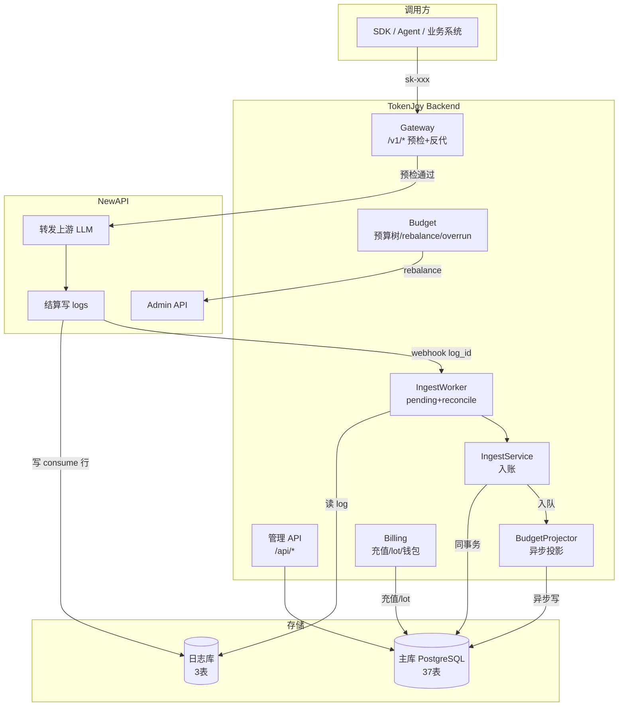

### 1.2 核心角色定位

| 角色 | 类比 | 职责 |
|------|------|------|
| **NewAPI** | 收银台 | 转发 LLM 请求、扣通道额度、写消耗日志 |
| **Gateway** | 门卫 | 预检（钱包+预算+Key状态），通过后反代 |
| **IngestService** | 会计 | 幂等入账、FIFO 扣 lot、写 ledger |
| **BudgetProjector** | 统计员 | 异步累加 consumed、刷新 Gateway 缓存 |
| **Billing** | 出纳 | 充值、lot 管理、钱包余额 |
| **Budget** | 预算管理 | 组织树分配、超限封禁、rebalance |

---

## 2. 三世界量纲体系

TokenJoy 内部存在三套量纲，彼此通过明确公式转换：

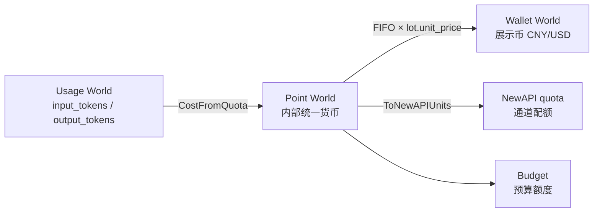

### 2.1 量纲定义

| 世界 | 含义 | 典型字段 | 特征 |
|------|------|----------|------|
| **Usage** | LLM 原始 token 计数 | `input_tokens`, `output_tokens` | 与模型厂商对齐 |
| **Point** | 内部统一货币单位 | `wallet_quota_remain`, `budget_consumed`, `ledger.amount` | 所有业务逻辑的计算基础 |
| **Wallet 展示币** | 用户可见的法币金额 | `display_amount`, `balances[].balance` | 入账时冻结，历史不可改 |

### 2.2 核心转换公式

```text
# Usage → Point
CostFromQuota(quota, price) = quota / QuotaPerUnit × price
  price = InputPrice + OutputPrice

# Point ↔ 展示币
quota = Round(display × quotaPerUnit)       (充值方向)
display = quota / quotaPerUnit        (展示方向)

# 已结算 ledger 展示金额
display_amount = take / lot.quota_per_unit  (FIFO 冻结)

# Point → NewAPI quota
-- 已删除：NewAPI token unlimited_quota=true
```

### 2.3 关键常量

| 常量 | 值 | 说明 |
|------|---|------|
| `DefaultQuotaPerUnit` | 1000 | 默认 1 CNY = 1000 point |
| `QuotaPerUnit` | 500000 | NewAPI 配额单位 |
| `WalletSyncDebounceSecs` | 5 | wallet_sync 去重窗口 |

### 2.4 量纲纪律（红线）

- **禁止**对已是展示币的数据再 ÷PPU（二次换算）
- **禁止**用 NewAPI quota 反算钱包
- **禁止** UPDATE 历史 `display_amount` 用新汇率
- 充值 → 锁定当时币种+PPU；历史 lot 不受改币影响

---

## 3. 充值入账流程

### 3.1 充值全链路

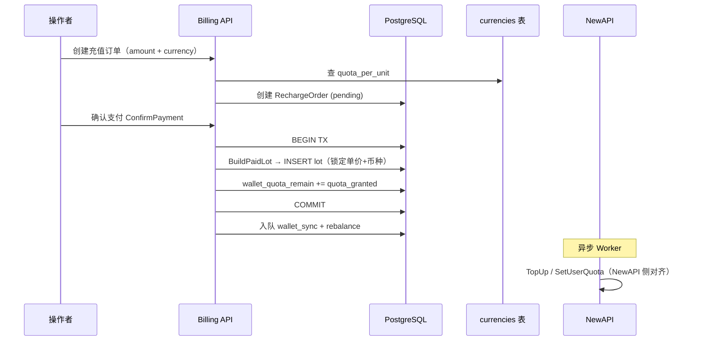

### 3.2 Lot 种类与行为

| lot_kind | 可花 | 计 totalTopup | 消耗 display | 典型场景 |
|----------|------|---------------|-------------|----------|
| `paid` | ✅ | ✅ | `take × unit_price` | 自助/平台充值 |
| `gift` | ✅ | ❌ | 0 | 赠送 |
| `adjust` | ✅ | ✅ | 显式写入 | 调账 |
| `overdraft` | ✅ | ❌ | 0 | lot 不足时自动扩展 |

### 3.3 钱包展示币闭合

```text
unit_price_display = amount_display / quota_granted
balance(currency) = Σ (quota_remaining × unit_price_display)  WHERE kind∈{paid,adjust}
totalTopup − totalConsumed = balance
```

### 3.4 充值不涨部门预算

充值只增加 `wallet_quota_remain`（企业硬顶），不自动增加 `org_nodes.budget`。
这是产品设计约定：钱包是资金层，组织预算是管理层，两者独立。

---

## 4. Token 消耗与记账流程

### 4.1 消耗全链路时序

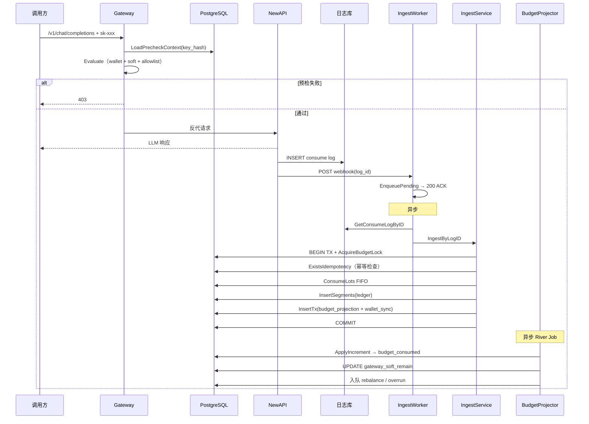

### 4.2 入账核心逻辑（IngestRaw）

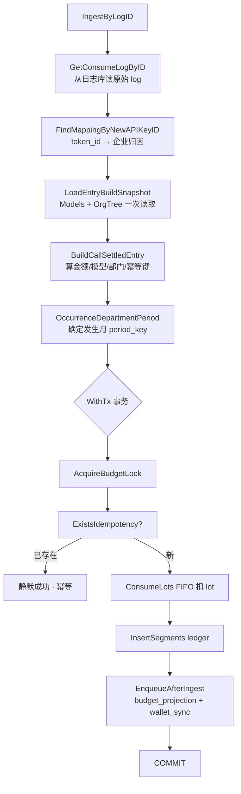

### 4.3 FIFO Lot 消费机制

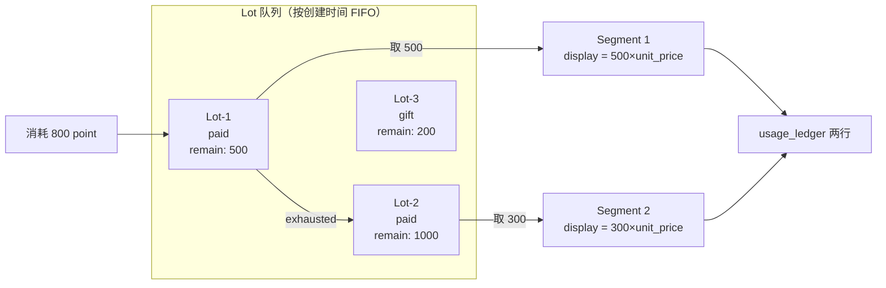

- 跨 lot 消费产生多段 ledger（同一 idempotency_key）
- gift/overdraft 段的 `display_amount = 0`
- lot 不足时自动扩展 overdraft lot（不让 webhook 永久失败）
- `wallet_quota_remain` 在同事务内同步更新（强一致）

### 4.4 双路径可靠性保障

| 路径 | 触发 | 速度 | 兜底 |
|------|------|------|------|
| **快路径** (pending) | Webhook 入队 | ~1s (poll interval) | 指数退避重试，最多20次 → dead |
| **慢路径** (reconcile) | 水位游标扫日志库 | 5min 间隔 | 全局补洞，业务失败仍推进游标 |

两条路径走同一个 `IngestByLogID`，幂等键 `newapi:{log_id}` 保证不重复入账。

---

## 5. 预算分配与扣减

### 5.1 双轴模型

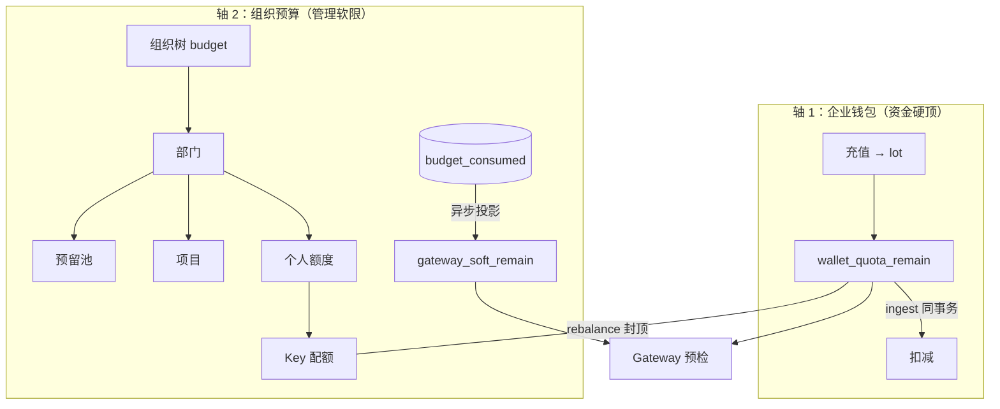

### 5.2 三种计费模式

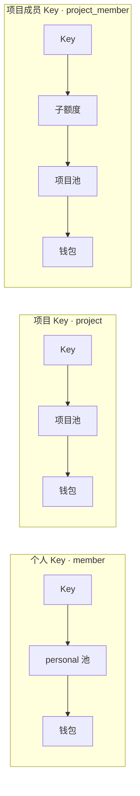

| scope | 预检公式 | 扣费池 | 报表归因 |
|-------|----------|--------|----------|
| `member` | `min(key, personal, wallet)` | Key + personal(member轴) | 部门 |
| `project` | `min(key, project, wallet)` | Key + 项目 | 项目挂靠部门 |
| `project_member` | `min(key, sub, project, wallet)` | Key + 项目 | 项目挂靠部门 |

### 5.3 预算树配置守恒

```text
部门总额 = Σ子部门 + 预留池 + Σ项目额度 + Σ成员个人额度 + 未分配
```

- **未分配** = 配置余量，不参与运行时预检
- **预留池** = 审批追加来源，不可直接调 API
- personal 用尽 → 阻断 → US-10 额度审批（预留池 → personal）

### 5.4 投影写入路径

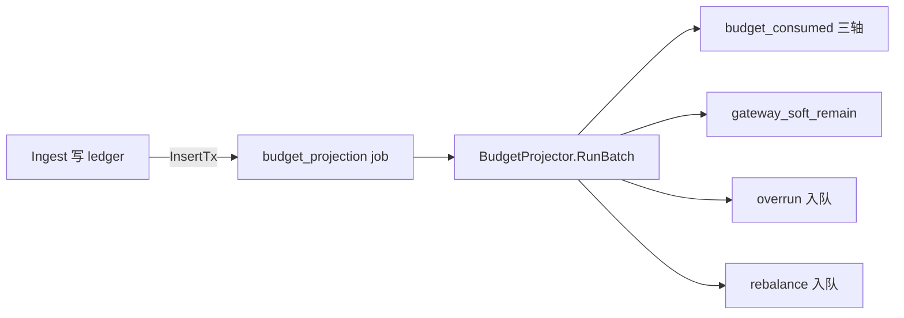

三轴写入规则（按 `platform_key_scope`）：

| scope | platform_key 轴 | member 轴 | project 轴 |
|-------|-----------------|-----------|------------|
| `member` | ✅ | ✅ | ❌ |
| `project` | ✅ | ❌ | ✅ |
| `project_member` | ✅ | ❌ | ✅ |

**部门花费**不写 `budget_consumed`，改为 `usage_ledger` 按 `department_id` 聚合。

---

## 6. 汇率与币种转换

### 6.1 币种架构

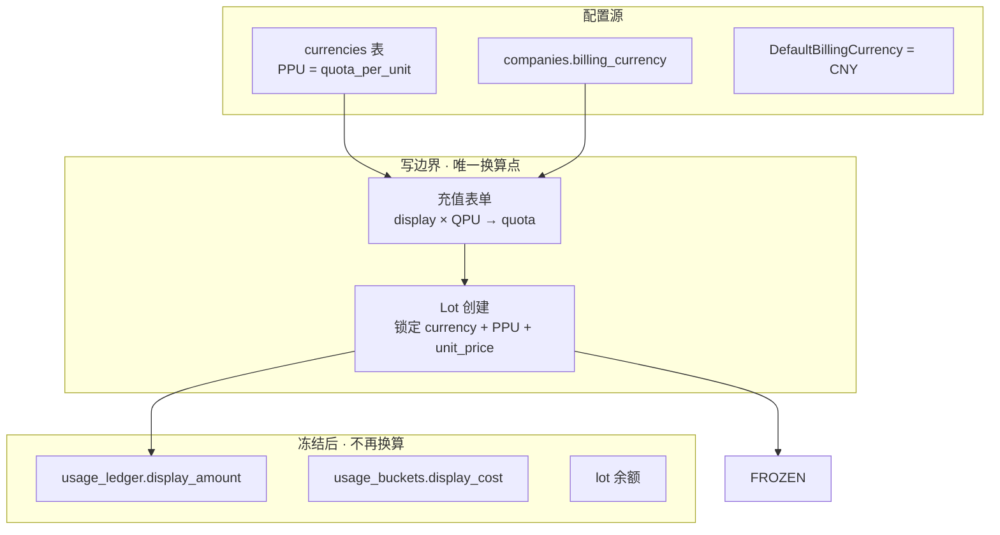

### 6.2 汇率解析流程

```go
// ResolveCompanyChargeRate
1. 读 companies.billing_currency（空则 DefaultBillingCurrency=CNY）
2. 查 currencies 表 → quota_per_unit
3. 返回 (currency, ppu) 供充值/lot 使用
```

### 6.3 冻结规则

| 时机 | 冻结内容 | 意义 |
|------|----------|------|
| 充值订单创建 | `currency` + `quota_per_unit` + `quota_granted` | 订单级锁定 |
| Lot 创建 | `unit_price_display = amount_display / quota_granted` | 消费时按此单价算展示金额 |
| Ingest 消耗 | `display_amount = take × lot.unit_price_display` | ledger 冻结展示金额 |

### 6.4 改币种影响

- 改 `companies.billing_currency` → 仅影响**新**充值/overdraft
- 历史 lot、ledger 的 `display_amount` **不回写**
- 钱包余额展示按 lot 各自币种分别汇总（`balances[]` 数组）

### 6.5 当前限制

- 实质上是**单币种**系统（`currencies` 表只有 CNY 活跃记录）
- 多币种充值的产品流程尚未设计
- `float64` 做金额计算存在精度风险（schema 用 `NUMERIC(18,6)` 落库）

---

## 7. 数据一致性模型

### 7.1 一致性分层

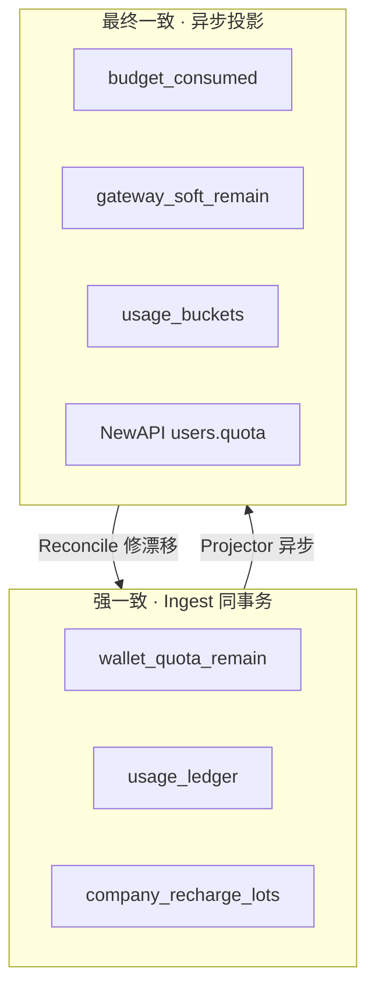

| 数据 | 一致性 | Gateway 能否当事实 | 漂移修复 |
|------|--------|-------------------|----------|
| `wallet_quota_remain` | **Strong** | 是（L0 hard） | 充值/lot |
| `usage_ledger` | **Strong** | 是（SSOT） | 追加不可改 |
| `budget_consumed` | Eventually | 否 | `budget_reconcile` 30min |
| `gateway_soft_remain` | Eventually | 是（带 lag） | Projector + Reconcile |
| `usage_buckets` | Eventually | 否（看板） | `dashboard_reconcile` |
| NewAPI quota | Best effort | 否 | `wallet_sync` debounce |

### 7.2 执法三层

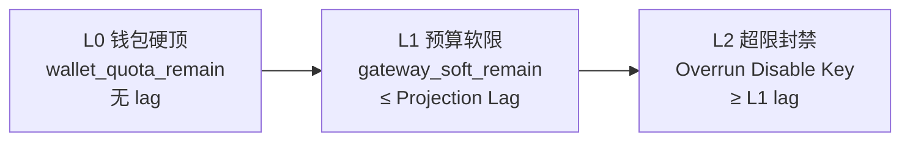

| 层级 | 机制 | 数据 | 超卖窗口 |
|------|------|------|----------|
| L0 | `wallet_quota_remain >= ε` | 强一致 | 无 |
| L1 | `gateway_soft_remain <= 0` → 403 | 最终一致 | ≤ Projection Lag |
| L2 | Overrun → Disable Key | 异步 | ≥ L1 |

### 7.3 超卖窗口公式

```text
超卖窗口 ≈ ingest 排队等待
         + budget_projection River 认领延迟
         + AcquireBudgetLock 等锁
         + Projector RunBatch 耗时
         + gateway_soft_* 写入延迟
```

目标：P99 < 1s（degraded 线）

---

## 8. 问题与风险清单

### 8.1 严重问题（应修复）

| # | 问题 | 现状 | 影响 | 建议 |
|---|------|------|------|------|
| **P1** | Advisory Lock 竞争 | Ingest 和 Projector 共用 `AcquireBudgetLock(company_id)` | 投影跑 500 条时 ingest 被阻塞数百 ms～数 s；高峰吞吐断崖 | 拆锁：ingest 锁 `companies` 行级锁；投影锁 `budget_projection_progress`；或缩小投影批 |
| **P2** | 无退款/冲正流程 | 设计文档存在，代码未实现 | 计费错误无法修正；客户争议无自动化处理 | 优先实现 adjust lot 逆向流程 + ledger 冲正行 |
| **P3** | 预留池未随审批扣减 | 额度审批只校验 `reserved_pool` 上限，审批通过后字段不减少 | 可能批准超出预留池总额的申请（重复透支） | 审批通过时原子扣减 `reserved_pool` 或维护「已批预留」子账 |
| **P4** | Overdraft 无告警 | lot 不足时静默扩展 overdraft | 透支无感知，运营发现时可能已大量欠费 | overdraft 创建/扩展时入队通知 job + 打点 |
| **P5** | float64 精度 | Go 代码全程 `float64` 做金额运算 | 高频小额累计后可能出现尾差（分级差异） | 关键路径改用 `math/big.Rat` 或整数分运算；DB 已用 NUMERIC |

### 8.2 中等问题（应优化）

| # | 问题 | 现状 | 影响 | 建议 |
|---|------|------|------|------|
| **M1** | 投影 lag 窗口 | gateway_soft 异步刷新，lag P99 可达数秒 | 组织预算层超卖窗口 | 缩短 Projector Unique ByPeriod；并行处理多租户 |
| **M2** | 单线程 pending 处理 | Worker claim 一批后串行 IngestByLogID | A 公司慢事务阻塞 B 公司 | 按 company_id 分组并行 + worker pool |
| **M3** | wallet_sync 取整漂移 | point 与 NewAPI quota 有取整差 | NewAPI 侧 remain 与 Postgres 不一致 | 已有 debounce + ε 对账；加 drift 监控指标 |
| **M4** | 百分比预警未运行 | `alert_rules` 仅 CRUD 无 Worker | 预算快用完时不通知 | Projector 批末检查阈值 + 发通知 |
| **M5** | 超限文案统一 | Gateway 返回通用 `403 request rejected` | 用户不知道是哪个池用尽 | 预检拒绝时读取 `overrun_policy.blockMessage` |

### 8.3 低风险问题（可接受/待观察）

| # | 问题 | 说明 |
|---|------|------|
| L1 | 并发双花窗口 | 预检用快照，入账后封禁；极短窗口产品可接受 |
| L2 | Reconcile 单实例 | `scheduler_locks` 限制；主路径靠 pending，reconcile 非常态 |
| L3 | 多币种未实现 | 当前单币种够用；`currencies` 表预留了扩展能力 |
| L4 | ~~两套审批表~~ | ✅ 已合并为统一 `approval_requests` 表 + `/approvals` 引擎 |

---

## 9. 性能优化建议

### 9.1 性能瓶颈全景

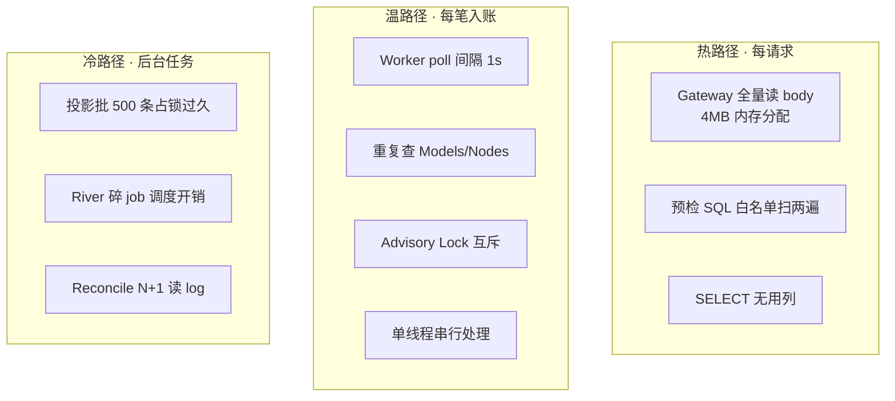

### 9.2 优化优先级排序

#### 第一批：立刻见效，几乎无风险（已部分落地）

| 编号 | 优化项 | 现状 | 预期收益 |
|------|--------|------|----------|
| I1 | `WORKER_POLL_INTERVAL_SEC=1` | ✅ 已改 | 排队 P50 从 ~2.5s → ~0.5s |
| G2 | 预检 SQL CTE 单次扫描 | ✅ 已改 | 预检 SQL 耗时降 10-30% |
| G3 | 去掉无用列 | ✅ 已改 | 微量但免费 |
| I2 | Models/Nodes 只读一次 | ✅ 已改 | 单笔事务外读库降 30-50% |

#### 第二批：提吞吐

| 编号 | 优化项 | 预期收益 | 复杂度 |
|------|--------|----------|--------|
| I3 | 公司级配置缓存（Models/Nodes TTL 30s~5min） | 稳态读 QPS 降 10× | 中 |
| I6 | pending 按 company_id 分组并行 | 多租户吞吐线性扩展 | 中 |
| I7 | 批大小从 20 提到 50-100 | 高 QPS 处理能力↑ | 低 |
| I4 | log 窄列查询（不拉 content） | reconcile 批量收益大 | 低 |

#### 第三批：架构级

| 编号 | 优化项 | 预期收益 | 复杂度 |
|------|--------|----------|--------|
| G1 | 流式读 body 只取 model 字段 | 大 body P99 降 50-90% | 中 |
| P1 | 投影单批减负（别全量 LoadBudgetContext） | 锁持有时间↓ → ingest TPS↑ | 中高 |
| I5 | 评估拆 advisory 锁 | 锁竞争严重时吞吐数倍↑ | 高 |
| P2 | 合并 River 冷链（platform_sync） | 碎 job 减少；投影追平更快 | 中 |

### 9.3 性能目标

| 场景 | 目标 |
|------|------|
| Gateway 预检 P99（无上游 LLM） | < 20ms @ 1k RPS |
| Ingest 单条处理时间 P95（不含 poll） | < 50ms |
| Ingest 端到端 P95 | < 500ms |
| 单实例 ingest 稳态吞吐 | > 200 条/s（多租户并行后） |
| Projection Lag P99 | < 1s |

### 9.4 反模式（不要做）

| 做法 | 为什么不做 |
|------|-----------|
| 预检 JOIN `budget_consumed` 现场聚合 | SQL 变重，RTT 上升 |
| 预检 HTTP 调 NewAPI | 多一跳，毫秒变百毫秒 |
| Ingest 事务内同步写 consumed/soft | 事务时间暴增，吞吐暴跌 |
| 去掉幂等/去掉公司锁 | 可能快一点，但并发错账 |
| 微服务拆 Gateway 和 Ingest | 多一跳，运维成本涨 |

---

## 10. 总结与建议优先级

### 10.1 架构评价

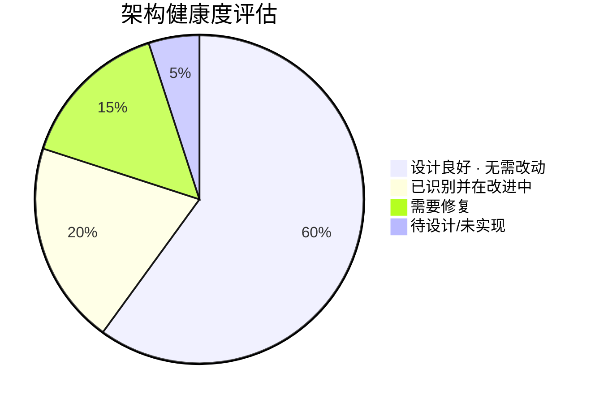

**做对的事情（核心优势）：**

1. **双轴分离** — 资金（钱包）和管理（预算）独立，充值不自动涨预算
2. **事实/投影分离** — ledger 是 SSOT，consumed/soft/buckets 可重建
3. **FIFO lot 冻结单价** — 展示币在入账时锁定，不受后续汇率变更影响
4. **幂等入账** — `newapi:{log_id}` 跨 webhook/reconcile 天然唯一
5. **Gateway 1× PG** — 预检极简，不 JOIN 重表，不调外部 API
6. **三种计费模式** — member/project/project_member 覆盖主要业务场景
7. **Overdraft 兜底** — lot 不足不让 webhook 永久失败

### 10.2 修复优先级

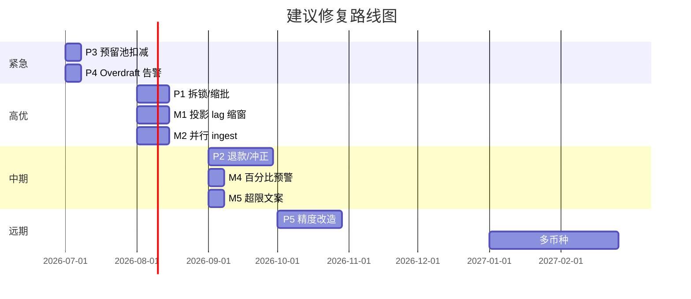

### 10.3 决策建议

| 层面 | 建议 | 理由 |
|------|------|------|
| **立即做** | P3 预留池原子扣减 + P4 overdraft 告警 | 逻辑缺陷，影响财务准确性 |
| **近期做** | P1 锁优化 + M2 并行 ingest | 性能天花板，高负载时必暴露 |
| **中期做** | P2 退款流程 | 产品运营刚需 |
| **不要做** | 微服务拆分、Kafka 引入、CQRS | 当前规模不需要；增加复杂度无收益 |

### 10.4 监控建议（新增指标）

| 指标 | 告警阈值 | 意义 |
|------|----------|------|
| `projection_lag_seconds` | ≥ 1s warning, ≥ 5s critical | 超卖窗口 |
| `overdraft_lots_active` | ≥ 1 | 欠费企业数 |
| `ingest_lock_wait_seconds` | P95 ≥ 200ms | 锁竞争严重度 |
| `wallet_sync_drift_quota` | > ε | NewAPI 漂移 |
| `reserved_pool_approval_overflow` | any | P3 问题触发 |

---

## 附录 A：代码地图

| 模块 | 路径 | 职责 |
|------|------|------|
| 汇率换算 | `pkg/exchange/convert.go` | 已删除（pkg/exchange 已移除） |
| 充值/钱包 | `domain/billing/service.go` | Recharge / Gift / Adjust |
| Lot FIFO | `domain/billing/lot/consume.go` | ConsumeLots / CreditFromLot |
| 币种解析 | `domain/billing/currency.go` | ResolveCompanyChargeRate |
| 入账 | `domain/usage/ingest.go` | IngestByLogID / IngestRaw |
| 投影 | `domain/budget/budget_projector.go` | RunBatch / ApplyIncrement |
| Gateway | `domain/gateway/evaluate.go` | Evaluate 预检逻辑 |
| 预算链 | `pkg/budget/chain.go` | GatewayChainRemain |
| 超限 | `domain/budget/overrun.go` | 封禁 Key |
| Rebalance | `domain/budget/rebalance.go` | NewAPI remain 对齐 |
| Worker | `infra/ingest/worker.go` | pending + reconcile |
| River | `infra/river/` | 异步 job 消费 |

## 附录 B：关键数据表

| 表 | 角色 | 一致性 |
|----|------|--------|
| `usage_ledger` | 消耗 SSOT | Strong |
| `company_recharge_lots` | 充值批次 / FIFO 队列 | Strong |
| `companies.wallet_quota_remain` | 企业钱包余额 | Strong |
| `budget_consumed` | 三轴 consumed | Eventually |
| `platform_keys.gateway_soft_*` | Gateway 预检摘要 | Eventually |
| `usage_buckets` | 看板聚合 | Eventually |
| `currencies` | PPU 配置 | 手动配置 |

---

> **文档作者**：Kiro 自动生成  
> **基于**：`docs/` 全部文档 + `apps/backend/internal/` 源码分析  
> **建议**：定期 review 本文与实际代码的对齐度；架构变更后同步更新
