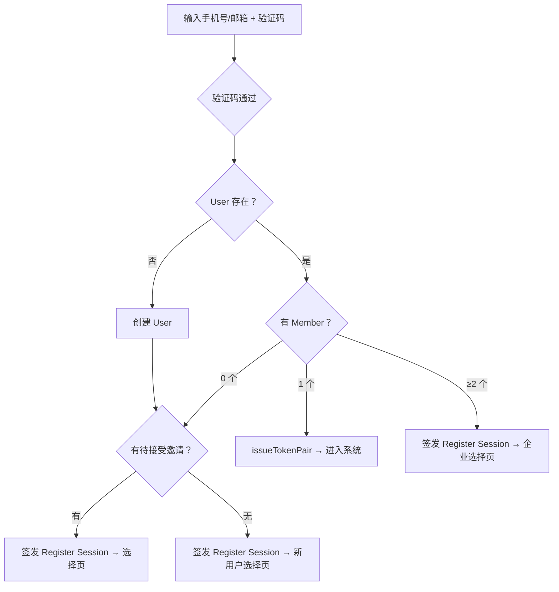

# 认证流程

> 本文定义 TokenJoy 完整认证体系：登录、注册分流、Token 机制、API 端点、安全策略。  
> 数据模型见 [identity-model.md](./identity-model.md)。  
> 邀请/开户细节见 [invite-and-onboarding.md](./invite-and-onboarding.md)。  
> 认证架构（双 Token 机制）详见 `docs/auth-system.md`。

---

## 1. 认证策略

两条对等的主认证路径，由 `AUTH_PRIMARY` 配置切换：

| 策略 | 适用市场 | 登录方式 | 注册方式 |
|------|---------|---------|---------|
| `phone` | 中国 | 手机号 + 短信验证码 | 手机号验证 → 创建企业 |
| `email` | 海外 | 邮箱 + 密码 或 邮箱 + 邮件验证码 | 邮箱验证 → 创建企业 |

**不是主/备关系**——两条路径代码对等、能力对等，通过配置决定默认展示。

---

## 2. 核心原则

| 原则 | 说明 |
|------|------|
| 登录即注册合一 | 中国市场标准，用户零决策——验证码通过后系统按状态引导 |
| 两条路径对等 | phone 和 email 不是主/备，是地区适配 |
| 配置切换不改代码 | `AUTH_PRIMARY` 改一个环境变量即切换 |
| OTP 统一抽象 | 手机和邮箱共用 Send/Verify 接口 |
| 私有化/SaaS 差异最小化 | 唯一 if：`registrationEnabled` |

---

## 3. 登录页

### 3.1 `AUTH_PRIMARY=phone`（中国）

```
┌────────────────────────────────────────┐
│            TokenJoy                    │
│        企业 AI 管理平台                │
│                                        │
│  手机号: [+86 ___________]             │
│  验证码: [______]  [获取验证码 60s]    │
│                                        │
│  [进入]                                │
│                                        │
│  ─────── 其他方式 ───────              │
│  [邮箱登录]                            │
└────────────────────────────────────────┘
```

### 3.2 `AUTH_PRIMARY=email`（海外）

```
┌────────────────────────────────────────┐
│            TokenJoy                    │
│        Enterprise AI Platform          │
│                                        │
│  Email: [________________]             │
│                                        │
│  ┌─────────┐  ┌──────────────────┐    │
│  │ Password │  │ Send me a code  │    │
│  └─────────┘  └──────────────────┘    │
│                                        │
│  [Sign in / Sign up]                   │
│                                        │
│  ─── or sign in with ───              │
│  [Phone login]                         │
└────────────────────────────────────────┘
```

### 3.3 统一结构

同一个 `<LoginPage>` 组件，根据 `AUTH_PRIMARY` 决定：
- 哪个表单在上方（主）
- 哪个折叠到"其他方式"

邮箱登录支持**密码**和 **OTP** 两种方式，用户可选。

---

## 4. 统一 OTP 服务

手机号验证码和邮箱验证码共用一套后端逻辑：

```go
type OTPService interface {
    Send(ctx context.Context, target string, channel Channel) error
    Verify(ctx context.Context, target string, code string) (bool, error)
}

type Channel string
const (
    ChannelSMS   Channel = "sms"
    ChannelEmail Channel = "email"
)
```

### OTP 规则

| 配置 | 值 |
|------|---|
| 验证码长度 | 6 位数字 |
| 有效期 | 5 分钟（Redis TTL） |
| 发送间隔 | 60 秒 |
| 每日上限 | 10 次/target |
| 验证尝试 | 最多 5 次，超过锁定 15 分钟 |

### Redis 存储

```
sms:code:{target}      → code, TTL 5min
sms:lock:{target}      → "1", TTL 60s（发送间隔）
sms:daily:{target}     → counter, TTL 到当日 24:00
sms:attempts:{target}  → counter, TTL 15min（验证失败计数）
```

---

## 5. 分流逻辑（登录即注册）

### 5.1 流程图



### 5.2 分流规则

| Member 数 | 有邀请？ | action | Cookie |
| --- | --- | --- | --- |
| 1 | — | `enter` | issueTokenPair |
| ≥2 | — | `select_company` | Register Session |
| 0 | 是 | `choose` | Register Session |
| 0 | 否 | `onboard` | Register Session |

> 有 member 且有新邀请的用户：直接 `enter` 不阻断登录，进入系统后通过 `GET /auth/invites/pending` + UI 通知提示未接受邀请。

### 5.3 `POST /auth/sms/verify` 响应

```typescript
type SmsVerifyResult =
  | { action: "enter"; memberId: string; companyId: string }
  | { action: "select_company"; companies: CompanyOption[] }
  | { action: "choose"; invites: PendingInvite[] }
  | { action: "onboard" }

interface CompanyOption {
  companyId: string
  companyName: string
  role: string
}

interface PendingInvite {
  inviteCode: string
  companyId: string
  companyName: string
  role: string
  expiresAt: string
}
```

---

## 6. 成员查找逻辑

phone/email 在 `users` 表，需要 JOIN：

```sql
-- 按手机号查找
SELECT m.id, m.company_id, c.name AS company_name, c.type, c.status, m.roles
FROM users u
JOIN members m ON m.user_id = u.id
JOIN companies c ON c.id = m.company_id
WHERE u.phone = $1 AND m.status = 'active' AND c.status = 'active';

-- 按邮箱查找
SELECT m.id, m.company_id, c.name AS company_name, c.type, c.status, m.roles
FROM users u
JOIN members m ON m.user_id = u.id
JOIN companies c ON c.id = m.company_id
WHERE u.email = $1 AND m.status = 'active' AND c.status = 'active';
```

只返回 `status = active` 的企业和成员。被冻结的企业不出现在选择列表中。

---

## 7. 页面流

### 7.1 企业选择页（select_company）

```
┌────────────────────────────────────────┐
│  选择企业                              │
│                                        │
│  🏢 技术部有限公司 — 超级管理员         │
│  🏢 测试项目组 — 普通成员 · 试用中      │
└────────────────────────────────────────┘
```

`POST /auth/sms/select { companyId }` + Register Session → issueTokenPair → 清除 Register Cookie。

### 7.2 新用户选择页（onboard）

```
┌──────────────────────────────────────────────────────┐
│  欢迎使用 TokenJoy                                   │
│                                                      │
│  创建您的企业，立即体验 AI 管理平台                  │
│  （使用模拟资金和模拟模型，升级后接入真实模型）      │
│                                                      │
│  公司名称: [____________]  [创建并开始体验]          │
│                                                      │
└──────────────────────────────────────────────────────┘
```

> **产品语义**："创建公司"创建的是一家**真实企业**（`type=trial`），数据永久保留。试用期间使用模拟资金 + mock 模型体验全部功能，升级后原地切到正式版。不存在独立的"免费试用"入口——创建公司本身就是试用。

### 7.3 有邀请选择页（choose）

```
┌──────────────────────────────────────────────────────┐
│  选择如何继续：                                      │
│                                                      │
│  🏢 Acme Inc. — 普通成员        [接受邀请]           │
│  🏢 Beta Corp. — 超级管理员     [接受邀请]           │
│                                                      │
│  ── 或 ──                                            │
│  公司名称: [____________]  [创建新公司]              │
└──────────────────────────────────────────────────────┘
```

---

## 8. Token 机制

| Cookie | 有效期 | 用途 |
| --- | --- | --- |
| `tokenjoy_session_member` | 15 min | Access Token JWT（Member Session） |
| `tokenjoy_refresh` | 7 天 | Refresh Token（DB-backed，Path=/api/auth/refresh，SameSite=Strict） |
| `tokenjoy_register_session` | 10 min | 注册中间态 JWT（仅含 userID） |

- **Refresh**：Access 过期 → `POST /auth/refresh` → 比对 hash → 签新 Access（Refresh 不变，无 DB 写）
- **Logout**：revoke(sid) → 清双 Cookie，撤销延迟 ≤ 15min
- **升级**：register/* 或 sms/select 成功 → issueTokenPair + 清 Register Cookie

### sessions 表

```sql
CREATE TABLE sessions (
    id          TEXT PRIMARY KEY,
    user_id     UUID NOT NULL REFERENCES users(id) ON DELETE CASCADE,
    member_id   UUID NOT NULL,
    company_id  UUID NOT NULL,
    token_hash  TEXT NOT NULL,
    user_agent  TEXT NOT NULL DEFAULT '',
    ip          TEXT NOT NULL DEFAULT '',
    created_at  TIMESTAMPTZ NOT NULL DEFAULT NOW(),
    expires_at  TIMESTAMPTZ NOT NULL,
    revoked_at  TIMESTAMPTZ
);
```

---

## 9. 邮箱密码登录

`POST /auth/login { email, password, companyId? }`

- SaaS 要求 companyId；私有化从 context 取
- 多企业时验证密码后可能需要选择页

---

## 10. 私有化 Setup

`GET /auth/setup-status` → `{ needsSetup: true }`（companies 为空）  
`POST /auth/setup { companyName, email, password }` → 创建 User + Company('selfhosted') → issueTokenPair

一次性调用，companies 非空后 403。

---

## 11. 前端 Capabilities

前端启动时调用 `GET /auth/capabilities`，决定登录页渲染：

```typescript
interface AuthCapabilities {
  primaryAuth: 'phone' | 'email'
  emailPasswordEnabled: boolean
  emailOtpEnabled: boolean
  phoneOtpEnabled: boolean
  registrationEnabled: boolean
  supportSaas: boolean
}
```

---

## 12. SaaS vs 私有化行为差异

| 维度 | 私有化 | SaaS |
|------|--------|------|
| 主认证 | 由 `AUTH_PRIMARY` 决定 | 由 `AUTH_PRIMARY` 决定 |
| 自助注册 | ❌（"未找到账号，请联系管理员"） | ✅（新用户自动创建 Trial） |
| 登录按钮 | "登录" | "进入"（不区分登录/注册） |
| 企业数量 | 1 家（`LocalCompanyID`） | 多家（JWT `company_id`） |
| Trial | 不适用 | 注册即 Trial |
| 供应商 Key | 企业管理员完全 CRUD | 只读展示（"由平台运营管理"） |
| 充值 | 正常自助充值 | Trial 时自动弹充值引导，充值即升级为正式版 |
| OTP verify 企业定位 | 直接在 LocalCompanyID 的 members 中查找 | 跨所有 active company 查找 |

---

## 13. 切换企业（多企业成员）

### 后端支持

后端数据模型已支持一个 user 属于多个 company（多条 member）。切换企业 = 重新签发一对 Token Pair（目标 company 的 memberID）：

```
POST /auth/switch-company { companyId }
  → 校验 session.userID 在目标 company 有 active member
  → issueTokenPair(targetMember) → 覆盖 Cookie
```

JWT 设计已包含 `company_id` + `member_id`，无需改数据模型。

### 前端（暂不实现）

前端切换企业 UI（侧边栏下拉 / 顶部栏切换器）暂不做。当前阶段大部分用户只有一个企业。

**后续实现时**：
- 调用 `GET /auth/companies`（返回当前 user 关联的所有 active company）
- 选择后调用 `POST /auth/switch-company`
- 成功后刷新页面状态（新 JWT 自动生效）

---

## 14. API 端点

> 含切换企业端点（后端实现，前端暂不接入）。

| 方法 | 路径 | 认证 | 守卫 | 说明 |
| --- | --- | --- | --- | --- |
| GET | `/auth/capabilities` | 无 | — | 前端据此渲染登录页 |
| POST | `/auth/otp/send` | captcha | — | 发送验证码（SMS 或 Email） |
| POST | `/auth/otp/verify` | OTP code | — | 验证 → 登录/注册引导 |
| POST | `/auth/sms/send` | captcha | RequireSaaS | 发送短信验证码 |
| POST | `/auth/sms/verify` | SMS code | RequireSaaS | 验证码校验 → 分流 |
| POST | `/auth/sms/select` | Register Session | RequireSaaS | 多企业选择 → issueTokenPair |
| POST | `/auth/register/accept` | Register Session | RequireSaaS | 接受邀请 → issueTokenPair |
| POST | `/auth/register/company` | Register Session | RequireSaaS | 创建公司 → issueTokenPair |
| POST | `/auth/login` | 无 | — | 邮箱密码 → issueTokenPair |
| POST | `/auth/logout` | Access Token | — | Revoke + 清 Cookie |
| POST | `/auth/refresh` | Refresh Cookie | — | 续签 Access Token |
| POST | `/auth/accept-invite` | Access Token 或 password | — | 邀请激活 → issueTokenPair |
| GET | `/auth/invites/pending` | Access Token | — | 待接受邀请列表 |
| GET | `/auth/setup-status` | 无 | RequireLocal | 私有化检查 |
| POST | `/auth/setup` | 无 | RequireLocal | 私有化初始化 |
| GET | `/auth/companies` | Access Token | — | 当前 user 关联的企业列表 |
| POST | `/auth/switch-company` | Access Token | — | 切换企业 → issueTokenPair |
| POST | `/platform/companies` | Platform Session | RequireSaaS | 平台开户 |

---

## 15. 部署守卫

```go
// RequireSaaS 仅 SaaS 模式可用，Local 返回 404
func RequireSaaS(cfg config.Config) func(http.Handler) http.Handler

// RequireLocal 仅 Local 模式可用，SaaS 返回 404
func RequireLocal(cfg config.Config) func(http.Handler) http.Handler
```

路由注册：

```go
func (reg Registry) RegisterAPIRoutes(r chi.Router) {
    // 两种模式都可用
    reg.auth.RegisterRoutes(r)         // login, logout, accept-invite, invites/pending, capabilities

    // 仅 SaaS
    r.Group(func(r chi.Router) {
        r.Use(middleware.RequireSaaS(reg.config))
        reg.sms.RegisterRoutes(r)      // sms/send, sms/verify, sms/select
        reg.register.RegisterRoutes(r) // register/accept, register/company
    })

    // 仅 Local
    r.Group(func(r chi.Router) {
        r.Use(middleware.RequireLocal(reg.config))
        reg.setup.RegisterRoutes(r)    // setup, setup-status
    })

    // 仅 SaaS (平台运营)
    if reg.config.SupportSaas {
        r.Route("/platform", reg.platform.RegisterRoutes)
    }
}
```

---

## 16. 安全

| 风险 | 措施 |
| --- | --- |
| SMS 轰炸 | **上线阻塞**：sms/send 必须 captcha + IP 限流 |
| 验证码暴力破解 | Redis attempts，5 次锁 15min |
| Token 泄露 | Access 15min 短命 + Refresh Strict + Path 限定 + DB revoke |
| CSRF | Refresh SameSite=Strict；Access SameSite=Lax |
| 邀请泄露 | 7 天过期 + 一次性 |
| 多企业越权 | JWT 绑定 company_id + member_id |
| `/setup` 滥用 | companies 非空 403 + RequireLocal |
| 枚举攻击 | OTP verify 需先通过验证码，不暴露企业信息 |
| 多企业信息泄露 | 选择页只展示公司名和角色 |
| sessionToken 劫持 | Register Session 10 分钟有效 + 一次性升级 |

---

## 17. 前端文件结构

```
routes/login.tsx
routes/login/select.tsx
routes/onboard.tsx
routes/setup.tsx
routes/invite/accept.tsx

features/auth/
├── index.ts
├── components/
│   ├── login-page.tsx              — 统一入口，根据 capabilities 编排
│   ├── phone-otp-form.tsx          — 手机号 + 验证码
│   ├── email-password-form.tsx     — 邮箱 + 密码
│   ├── email-otp-form.tsx          — 邮箱 + 验证码
│   └── company-select.tsx          — 多企业选择（SaaS）
├── hooks/
│   ├── use-login.ts
│   ├── use-otp.ts                  — 统一 OTP hook（phone/email）
│   └── use-auth-capabilities.ts
└── lib/
    └── auth-capabilities.ts

api/auth.ts
```

---

## 18. 配置

### 后端

| 环境变量 | 默认值 | 说明 |
|------|--------|------|
| `AUTH_PRIMARY` | `phone` | 主认证方式：`phone` 或 `email` |
| `SUPPORT_SAAS` | `false` | SaaS 多租户模式 |
| `REGISTRATION_ENABLED` | `true` | 允许自助注册（SaaS） |
| `SESSION_SECRET` | — | JWT 签名密钥 |
| `SESSION_TTL_SEC` | `900` | Access Token 有效期 |
| `REFRESH_TOKEN_TTL_SEC` | `604800` | Refresh Token 有效期 |
| `SECURE_COOKIE` | `false` | 生产 true |
| `SMS_PROVIDER` | — | 短信服务商（`aliyun` / `tencent`） |
| `SMTP_HOST` | — | 邮件服务（用于邮箱 OTP） |
| `ALIYUN_SMS_*` | — | 短信配置 |

### 前端

| 变量 | 说明 |
|------|------|
| `VITE_SUPPORT_SAAS` | 控制登录页 UI（手机号 vs 邮箱、是否显示注册入口、供应商 Key 只读） |
| `VITE_REGISTRATION_ENABLED` | 是否显示「免费试用/注册」按钮 |

---

## 19. 设计决策

| 决策 | 理由 |
| --- | --- |
| 只有单 member 才签 Token Pair | 避免悬空 session |
| Refresh 不 rotate | 幂等无 DB 写，避免并发 race |
| RequireSession 不查 DB | 零 DB 开销；撤销延迟 ≤ 15min 可接受 |
| SMS 用 Redis | 短命数据，TTL 天然适配 |
| sms/send 必须 captcha | 无认证端点，防 SMS 轰炸 |
| sms/verify 不返回 memberId | 减少无认证端点信息暴露 |
| 登录即注册合一 | 中国市场标准 |
| Register Session 独立 | 注册中间态无系统权限 |
| 旧 session 不主动 revoke | Cookie 覆盖即切断客户端，DB 自然过期 |
| 邮箱双模式（密码 + OTP） | 用户可选，兼顾安全和便捷 |
