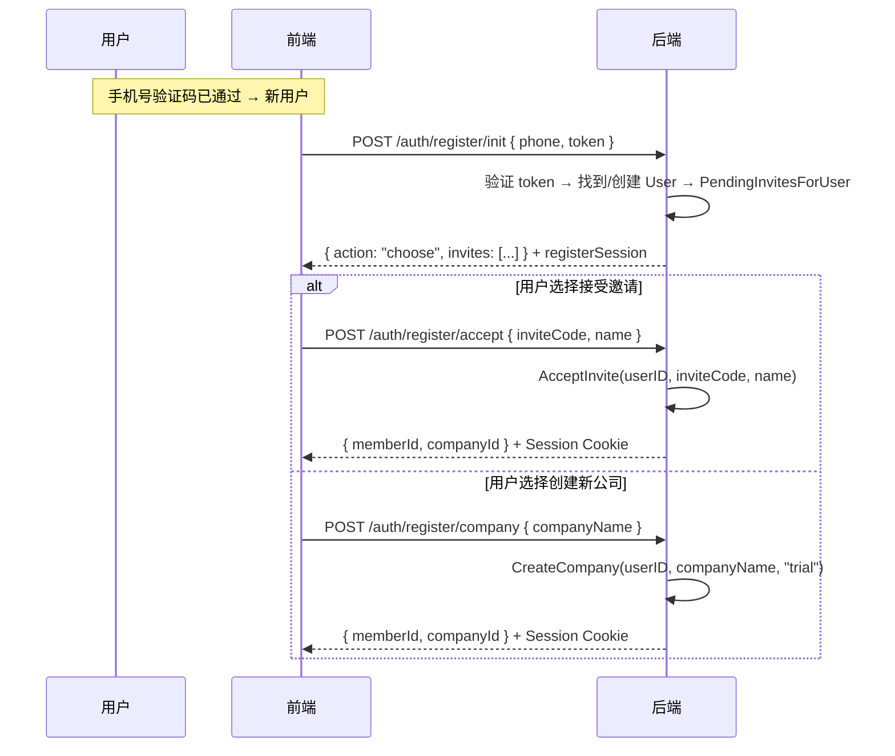

# 开户·邀请·加人

> 本文定义 Company 创建、成员邀请加入、平台开户的 Domain Service 接口与实施计划。  
> 数据模型见 [identity-model.md](./identity-model.md)。  
> 认证流程见 [auth-flow.md](./auth-flow.md)。

---

## 0. 架构符合性

**方向正确，核心租户/NewAPI 链路已对齐；不需要重做开户事务或钥匙模型。**

现状是「平台运营开户 + 超管 accept-invite」，不是完整的「客户自助注册 Company + 企内邀请加人」。差距主要在**产品入口与企业内 Invite 写通**，不在 Postgres↔NewAPI 边界。

| 子系统 | 判定 |
| --- | --- |
| CreateCompany + NewAPI 钱包用户 + 回滚 | ✅ 符合；自助开户应**复用**本 service |
| SaaS `company_id ≥ 1_000_000`、双 Session | ✅ 符合 |
| 超管 invite 写入 + `POST /auth/accept-invite` | ✅ 后端符合；❌ 前端无页/无 API 封装 |
| 企业内 InviteMember | ❌ `501 NotImplemented`；BatchInvite 假计数 |
| 公开自助注册 Company | ❌ 无；仅 `POST /api/platform/companies`（平台 operator） |
| NewAPI 单 Admin 代建 / 客户不碰 Admin | ✅ 符合目标态 |

**要改**：Invite 写通、accept-invite 前端、契约字段统一、（可选）自助开户公开 API + 限流、平台控制台 UI。  
**不必改**：`service_create` 内 CreateUser/钱包语义、一企一钱包、Admin 代建 Token、平台/企业 Session 分离。

---

## 1. 目标语义（SSOT）

```text
开 Company（平台代开 或 客户自助，同一 domain）
  → Postgres company + NewAPI wallet user W
  → InviteEmail 模式: 生成 invite / UserID 模式: 注册人即超管
加人（企内）
  → company_invites → accept-invite(userID) → member + 企业 JWT
发 Key
  → CreateToken(user_id=W)（已有 as-built）
```

### 不变量

| ID | 约束 |
| --- | --- |
| S1 | 企业 API 必须绑定 `company_id`；禁止跨企 |
| S2 | 客户永不持有 `NEW_API_ADMIN_TOKEN` |
| S3 | 客户不登录 NewAPI；钱包密码不入库 |
| S4 | 该企 PlatformKey → Token.`user_id` == wallet |
| S5 | 平台 JWT ≠ 企业 JWT（双 Secret） |
| S6 | 开户 CreateUser 失败必须整单 ROLLBACK |

---

## 2. Domain Service 接口

```go
type Service interface {
    // 创建企业（两种模式：立即加入 或 生成邀请）
    CreateCompany(ctx, CreateCompanyReq) (CreateCompanyResult, error)

    // 通过邀请码加入已有企业
    AcceptInvite(ctx, AcceptInviteReq) (types.Member, error)

    // 查询某 user 待接受的邀请列表
    PendingInvitesForUser(ctx, PendingInvitesForUserReq) ([]PendingInvite, error)

    // --- 不变 ---
    ListCompanies(ctx) ([]store.Company, error)
    UpdateCompany(ctx, id, patch) error
    ResolveCompanyContext(ctx, companyID) (Context, error)
    ResolveFromMember(ctx, memberID) (Context, error)
}
```

---

## 3. 方法定义

### 3.1 `CreateCompany`

**语义**：创建一家新公司。两种模式由入参决定：

```go
type CreateCompanyReq struct {
    UserID      uuid.UUID // 可选：非 Nil 时创建者立即成为超管 Member
    CompanyName string
    CompanyType string    // "standard" | "trial" | "selfhosted"
    InviteEmail string    // 可选：非空时生成 invite（平台开户，defer 加入）
}

type CreateCompanyResult struct {
    Company    store.Company
    Member     *types.Member // UserID 模式时非 nil
    InviteCode string        // InviteEmail 模式时非空
}
```

| 条件 | 模式 | 行为 | 场景 |
| --- | --- | --- | --- |
| `UserID != Nil` | 立即加入 | Company + Member（超管） | 自助注册、Setup |
| `UserID == Nil && InviteEmail != ""` | 生成邀请 | Company + Invite | 平台运营开户 |
| 两者都空 | 错误 | | |

内部（单事务）：
1. `provisionCompany`（Company + 钱包 + 角色 + org tree）
2. 若 UserID 模式 → `addMember`（User 成为超管）
3. 若 InviteEmail 模式 → 创建 invite 记录

### 3.2 `AcceptInvite`

**语义**：一个已确认身份的 User 通过邀请码加入已有公司。

```go
type AcceptInviteReq struct {
    UserID     uuid.UUID
    InviteCode string
    Name       string
}
```

内部：
1. 验证 invite（存在 + 未用 + 未过期）
2. 检查 user 是否已是该 company 的 member → 是则幂等返回现有 member
3. `addMember`（User 成为 invite.Role 的 Member）
4. MarkInviteAccepted

### 3.3 `PendingInvitesForUser`

**语义**：查找某个 user 所有待接受的公司邀请（按 email/phone/userID 任一标识匹配）。

```go
type PendingInvitesForUserReq struct {
    Email  string
    Phone  string
    UserID uuid.UUID
}

type PendingInvite struct {
    InviteCode  string
    CompanyID   uuid.UUID
    CompanyName string
    Role        string
    ExpiresAt   time.Time
}
```

查询逻辑：传入 user 的所有已知标识，动态构建 WHERE 条件（只加非空字段），OR 合并去重返回。

---

## 4. 内部 Helper（unexported）

```go
// provisionCompany 创建企业基础设施
// Company + NewAPI 钱包 + 预设角色 + root org node
func (s *service) provisionCompany(ctx, tx, name, companyType string) (store.Company, error)

// addMember 将 user 加入企业
// 若已是 member → 幂等返回现有 member
// 否则创建 Member + 分配角色 + 挂到 root dept + 设为 manager（超管时）
func (s *service) addMember(ctx, tx, userID, companyID uuid.UUID, name, role string) (types.Member, error)
```

---

## 5. 数据模型

### 5.1 `company_invites` 表

```sql
CREATE TABLE company_invites (
    id           UUID PRIMARY KEY,
    company_id   UUID NOT NULL REFERENCES companies(id),
    email        TEXT,
    phone        TEXT,
    user_id      UUID,
    role         TEXT NOT NULL DEFAULT 'super_admin',
    invite_code  TEXT NOT NULL UNIQUE,
    expires_at   TIMESTAMPTZ NOT NULL,
    accepted_at  TIMESTAMPTZ,
    created_at   TIMESTAMPTZ NOT NULL DEFAULT NOW()
);

CREATE INDEX idx_invites_email_pending ON company_invites(email)
    WHERE accepted_at IS NULL AND email IS NOT NULL AND email != '';
CREATE INDEX idx_invites_phone_pending ON company_invites(phone)
    WHERE accepted_at IS NULL AND phone IS NOT NULL AND phone != '';
CREATE INDEX idx_invites_user_pending ON company_invites(user_id)
    WHERE accepted_at IS NULL AND user_id IS NOT NULL;
```

### 5.2 `InviteRepository`

```go
type CompanyInvite struct {
    ID         uuid.UUID
    CompanyID  uuid.UUID
    Email      string
    Phone      string
    UserID     uuid.UUID
    Role       string
    InviteCode string
    ExpiresAt  time.Time
    AcceptedAt *time.Time
    CreatedAt  time.Time
}

type InviteRepository interface {
    CreateInvite(ctx, invite CompanyInvite) error
    GetInviteByCode(ctx, inviteCode string) (*CompanyInvite, error)
    MarkInviteAccepted(ctx, id uuid.UUID, acceptedAt time.Time) error
    FindPendingInvitesForUser(ctx, email string, phone string, userID uuid.UUID) ([]CompanyInvite, error)
}
```

`FindPendingInvitesForUser` 实现：Go 层根据非空参数动态拼 WHERE 条件，避免 SQL 中的零值比较。

---

## 6. 各场景编排

| 场景 | Handler 编排 |
| --- | --- |
| **SaaS 注册** | sms/verify → register/init → (accept / company) |
| **私有化 Setup** | Create User(email, password) → CreateCompany(UserID, 'selfhosted') |
| **平台运营开户** | CreateCompany(UserID=Nil, InviteEmail=email) → 返回 inviteCode |
| **邮件邀请激活** | GetOrCreate User(email, password) → AcceptInvite(userID) |
| **已登录用户接受邀请** | AcceptInvite(session.userID) |
| **企内 InviteMember** | 校验权限 → 写 company_invites → 返回 inviteCode |

### 注册后完整时序



### `register/init` 幂等性

| phone 对应 User | 该 User 有 member? | 行为 |
| --- | --- | --- |
| 不存在 | — | 创建 User → 继续注册 |
| 存在 | 无 member | 复用 User → 重新签发 registerSession → 继续注册 |
| 存在 | 有 member | 已注册完成 → 返回 `{ action: "login" }`，引导走登录 |

---

## 7. 已登录用户接受邀请

已登录用户（有 session）收到新邀请后，不走 `register/*` 流程：

```
GET /auth/invites/pending → 待接受列表
POST /auth/accept-invite { inviteCode, name } → AcceptInvite(session.userID)
```

**复用 `POST /auth/accept-invite`**：
- 已登录时：handler 从 session 取 userID，body 中不需要 password
- 未登录时（邮件链接）：handler 从 body.password 创建/更新 User，再取 userID

---

## 8. 现状索引

| 能力 | 路径 | 状态 |
| --- | --- | --- |
| 平台开户 | `POST /api/platform/companies` → `company/service_create.go` | ✅（InviteEmail 模式） |
| 钱包用户 | `provisionCompany` 内 `CreateUser` → `newapi_wallet_company_id` | ✅ |
| 超管 invite 行 | CreateCompany InviteEmail 模式写 `company_invites`（7 天） | ✅ |
| accept-invite | `POST /api/auth/accept-invite` → `service_invite.go` | ✅ API + 双路径 |
| 已登录接受邀请 | `GET /api/auth/invites/pending` + `POST /auth/accept-invite` | ✅ |
| 注册流程 | `POST /auth/register/init` + `/accept` + `/company` | ✅ API（SaaS only + RegistrationEnabled） |
| 企内 InviteMember | `org/structure/member_batch.go` → **NotImplemented** | ❌ |
| BatchInvite | 返回假 `sent`，不写 invite | ❌ |
| 手动/导入加人 | `CreateMember` / batch-import，立即 active、无密码 | ✅ 组织面 |
| 前端 platform / invite | Frontend.md：未接入 | ❌ |

---

## 9. Gap → 实施项

| ID | 项 | 优先级 | 说明 |
| --- | --- | --- | --- |
| A | 契约收口：`inviteCode` | P0 | Frontend.md / 类型与后端对齐 |
| B | accept-invite 前端 | P0 | `authApi.acceptInvite` + `/invite/accept` 路由页 |
| C | InviteMember 写通 | P0 | 写 `company_invites`；复用 AcceptInvite；测 domain + handler |
| D | BatchInvite 真实化或降级 | P1 | 真写 invite **或** 明确 501/隐藏 UI；禁止假成功 |
| E | 自助开户 API（可选） | P1 | 新公开端点 → 调用现有 CreateCompany；限流 + slug/email 校验 |
| F | 平台控制台前端 | P2 | platform login + 开户/列企；展示超管 invite 链接 |
| G | 发信 | P2 | invite 邮件可后置；先返回 code/链接 |

---

## 10. PR 切片（按序）

### PR-A — 契约与本文

- 统一 `inviteCode`（Frontend.md § auth）
- 本文为实施 SSOT

### PR-B — accept-invite 前端

| 交付 | |
| --- | --- |
| API | `apps/frontend/src/api/auth.ts`：`acceptInvite({ inviteCode, password, name? })` |
| 路由 | `/invite/accept`（公开）；成功后 `refreshSession` / 进企业面 |
| 不改 | Backend AcceptInvite 行为 |

### PR-C — 企业内 InviteMember（主缺口）

| 交付 | |
| --- | --- |
| Domain | 实现 `InviteMember`：校验权限/邮箱 → 写 `company_invites`（role=member 或请求角色）→ 返回 `inviteCode` |
| HTTP | 现有 org members invite 路由改为成功语义 |
| Accept | **复用** `AcceptInvite`；不新建激活 API |
| 测 | `tests/domain/org` + handler：invite → accept → login |
| 非目标 | 本 PR 可不发邮件 |

### PR-D — BatchInvite

- 对每个目标写 invite **或** UI 去掉批量邀请直至实现
- 禁止「返回 sent>0 但库中无行」

### PR-E — 自助开户（产品确认后）

```text
POST /api/auth/register-company   # 示例路径；限流
  → company.Service.CreateCompany（同今日逻辑）
  → 201 + inviteCode（超管）
```

| 护栏 | |
| --- | --- |
| 鉴权 | 公开或验证码/邮箱验证；**不是**平台 Cookie |
| 滥用 | 限流、slug 唯一、邮箱唯一策略 |
| NewAPI | 仍单 Admin AT；失败 ROLLBACK |
| 平台路径 | `POST /platform/companies` **保留**给运营 |

### PR-F — 平台前端

- `platformApi` + `/platform/login` + 开户表单；展示 invite 链接给超管邮件/复制

---

## 11. 安全（实施约束）

| 做 | 不做 |
| --- | --- |
| 自助开户用独立公开路由 + 限流 | 把 CreateCompany 挂到无鉴权的 `/platform/*` |
| 企业 invite 仅本企 RBAC（`org:members`） | 客户持有 NewAPI Admin |
| accept-invite 一次性 code | 第二套 CreateUser-per-member |
| 保持双 Session Secret | NewAPI Console 对企业开放 |

NewAPI Admin by-id 能力仍仅服务 Backend；SaaS 客户增多时**不要**给多名真人开 NewAPI Admin 账号。

---

## 12. 对比现有实现

| | 之前 | 之后 |
| --- | --- | --- |
| CreateCompany 入参 | Name + SuperAdminEmail | UserID(可选) + Name + Type + InviteEmail(可选) |
| CreateCompany 创建 Invite | 是（强制） | 仅 InviteEmail 模式 |
| CreateCompany 创建 Member | 否 | UserID 模式时创建 |
| AcceptInvite 入参 | InviteCode + Name + Password | UserID + InviteCode + Name |
| AcceptInvite 创建 User | 是 | 否（handler 层负责） |
| AcceptInvite 设密码 | 是 | 否（handler 层负责） |
| PendingInvites 查询 | 不存在 | 新增 |
| 已登录用户接受邀请 | 不支持 | 支持 |

---

## 13. 验收

| # | 条件 |
| --- | --- |
| 1 | 平台开户仍：company + wallet + 超管 invite；CreateUser 失败无脏 company |
| 2 | 企内 InviteMember → DB 有 invite 行 → accept-invite 得 member 可 login |
| 3 | 前端 `/invite/accept` 可用；字段为 `inviteCode` |
| 4 | BatchInvite 无假成功（真写或不可达） |
| 5 | （若做 E）自助开户与平台开户共用 CreateCompany；限流生效 |
| 6 | 无企业 NewAPI 密码/AT 入库 |

---

## 14. 代码索引

```text
开户     domain/company/service_create.go       — CreateCompany (双模式: UserID / InviteEmail)
                                                  provisionCompany (内部 helper)
                                                  addMember (内部 helper, 幂等)
         http/handler/platform/handler.go       — POST /platform/companies (InviteEmail 模式)
邀请激活 domain/company/service_invite.go       — AcceptInvite (接收 UserID)
                                                  PendingInvitesForUser (batch 查)
         http/handler/auth/handler.go           — POST /auth/accept-invite (双路径)
                                                  GET /auth/invites/pending
注册流程 http/handler/register/handler.go       — POST /auth/register/init, /accept, /company
         identity/registertoken/token.go        — 短期注册 session JWT
Mode     http/middleware/mode_guard.go          — RequireSaaS / RequireLocal
企内邀请 domain/org/structure/member_batch.go   ← 待实现
         http/handler/org/member.go
钥匙     docs/Backend-NewAPI-多租户钥匙代建.md
```

---

## 15. 实施顺序

1. `company_invites` 表加 `phone` + `user_id` 列 + pending 索引
2. `InviteRepository.FindPendingInvitesForUser` — 动态 WHERE 构建
3. 提取 `provisionCompany` + `addMember` 内部 helper
4. 重写 `CreateCompany`（新签名，两种模式）
5. 重写 `AcceptInvite`（新签名：UserID）
6. 新增 `PendingInvitesForUser` domain 方法
7. 实现 `RequireSaaS` / `RequireLocal` mode guard middleware
8. 改造 `POST /platform/companies` handler → CreateCompany(InviteEmail 模式)
9. 改造 `POST /auth/accept-invite` handler → User 处理提到 handler 层
10. 实现 `POST /auth/register/*` 三个端点（RequireSaaS 守卫）
11. 实现 `POST /auth/setup`（RequireLocal 守卫）
12. 实现 `GET /auth/invites/pending`
13. 现有测试适配

---

## 16. 决策记录

| 日期 | 决策 |
| --- | --- |
| 2026-07-14 | 现架构方向正确；不重做开户/NewAPI 边界 |
| 2026-07-14 | 主缺口：InviteMember + accept-invite 前端；自助开户为可选新入口复用 CreateCompany |
| 2026-07-14 | 本文升格为实施文档 |
| 2026-07-18 | CreateCompany 重构为双模式（UserID / InviteEmail）；AcceptInvite 接收 UserID（handler 层负责 User 创建）|
| 2026-07-18 | 注册流程实现：register/init + accept + company 三端点；RequireSaaS + RegistrationEnabled 守卫 |
| 2026-07-18 | PendingInvitesForUser 新增（支持 email/phone/userID 多标识匹配）|
