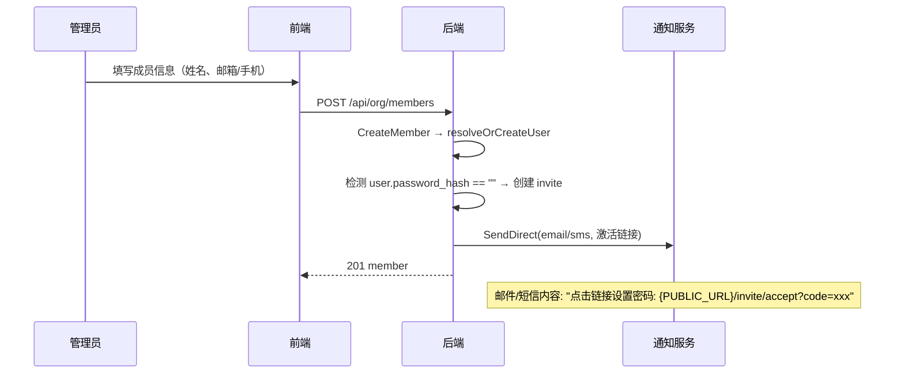
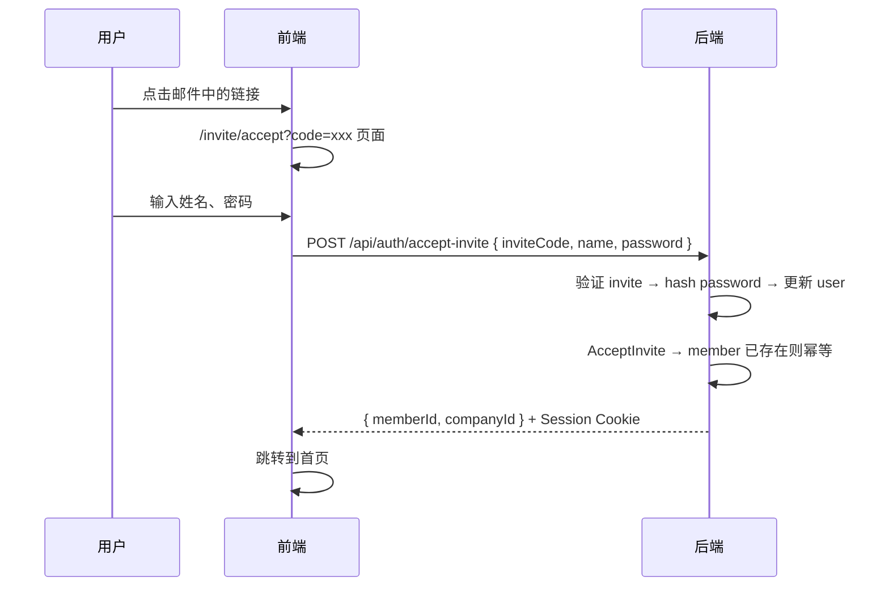
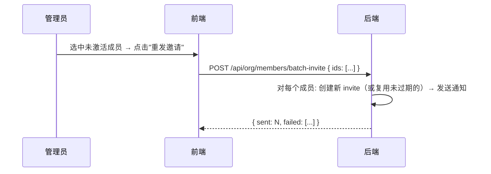

# 开户·邀请·加人

> 本文定义 Company 创建、成员邀请加入、激活链接的完整流程。  
> 数据模型见 [identity-model.md](./identity-model.md)。  
> 认证流程见 [auth-flow.md](./auth-flow.md)。

---

## 1. 现状总结

### 已实现

| 能力 | 路径 | 说明 |
| --- | --- | --- |
| 平台开户 | `POST /api/platform/companies` → `company/service_create.go` | InviteEmail 模式生成 invite code |
| 超管激活 | `POST /api/auth/accept-invite` → `service_invite.go` | 支持双路径：已登录(session) / 未登录(password) |
| 前端激活页 | `/invite/accept?code=xxx` → `invite-accept.tsx` | 输入姓名+密码 → AcceptInvite → 发 session |
| 已登录接受邀请 | `GET /api/auth/invites/pending` + `POST /auth/accept-invite` | session 中取 userID |
| SaaS 注册 | `POST /auth/register/init` + `/accept` + `/company` | 手机验证码 → 选邀请或建公司 |
| 手动加人 | `POST /api/org/members` → `CreateMember` | 立即 active，创建 user 但**无密码** |
| 批量导入 | `POST /api/org/members/batch-import` | 同上，无密码 |
| 邮件/短信发送 | `notification.Service.SendDirect(channel, address, msg)` | SMTP + 阿里云 SMS |

### 未实现（主缺口）

| 能力 | 现状 | 问题 |
| --- | --- | --- |
| 企内 InviteMember | `501 NotImplemented` | 前端有 UI，后端空壳 |
| BatchInvite | 返回假 `{sent: N}`，不写 invite | 欺骗性响应 |
| 创建成员后发激活链接 | 无 | user 无密码无法登录 |

---

## 2. 目标

管理员添加成员后，系统**自动发送激活链接**（邮件或短信），用户点击链接即可设置密码并登录。

```
管理员创建成员（已有）
  → resolveOrCreateUser（已有）
  → 检测 user 无密码 → 创建 invite → 发送激活链接
  → 用户点击 /invite/accept?code=xxx
  → 输入姓名+密码 → AcceptInvite（已有）→ 设密码 → 发 session
```

核心原则：**复用已有的 invite + accept-invite 流程**，补齐发送环节。

---

## 3. 完整流程

### 3.1 创建成员 + 自动邀请



### 3.2 用户激活



### 3.3 手动重发邀请



---

## 4. 改动方案

### 4.1 后端

#### 4.1.1 Config 新增 `PUBLIC_URL`

```go
// config.go — PlatformConfig 内
PublicURL string `env:"PUBLIC_URL" envDefault:"http://localhost:5173"`
```

用于拼接激活链接：`{PUBLIC_URL}/invite/accept?code={inviteCode}`

#### 4.1.2 修改 `InviteMember` 签名与实现

```go
// interfaces.go
type MemberService interface {
    // ...
    InviteMember(ctx context.Context, input InviteMemberInput) (InviteMemberResult, error)
    BatchInvite(ctx context.Context, ids []uuid.UUID) (types.BatchInviteResult, error)
}

// types
type InviteMemberInput struct {
    Email string
    Phone string
}

type InviteMemberResult struct {
    MemberID   uuid.UUID
    InviteCode string
}
```

实现逻辑（`member_invite.go`）：

1. 查找/创建 user（复用 `resolveOrCreateUser`）
2. 创建 member（复用 `CreateMember` 逻辑）
3. 写 `company_invites` 记录（role=member，7天过期）
4. 调用 `notifier.Send` 发送激活通知
5. 返回 memberID + inviteCode

#### 4.1.3 修改 `CreateMember` —— 创建后自动发邀请

在 `member_mutate.go` 的 `CreateMember` 末尾追加：

```go
// 若 user 无密码，自动发送激活邀请
if needsActivation {
    _ = s.sendActivationInvite(ctx, member, userID)
}
```

`sendActivationInvite` 逻辑：
1. 生成 invite code → 写 `company_invites`
2. 拼接链接 `{PublicURL}/invite/accept?code={code}`
3. 有邮箱 → 发邮件；有手机 → 发短信；都没有 → 跳过

#### 4.1.4 修改 `BatchInvite` —— 真实发送

替换假实现：对每个目标成员执行 `sendActivationInvite`，收集结果。

#### 4.1.5 `AcceptInvite` 适配

当前 `AcceptInvite`（company domain）会 `addMember`。但如果成员**已存在**（CreateMember 时就创建了），需要幂等处理：
- 若 member 已存在于该 company → 仅标记 invite accepted，不重复创建

这个逻辑已经在当前 `addMember` helper 中——需要确认幂等行为。

#### 4.1.6 Handler 改造

`org/member.go` — `MembersInvite`：

```go
func (h *Handler) MembersInvite(w http.ResponseWriter, r *http.Request) {
    var body struct {
        Email string `json:"email"`
        Phone string `json:"phone"`
    }
    if err := httputil.DecodeJSON(r, &body); err != nil {
        httputil.WriteError(w, err)
        return
    }
    result, err := h.service.InviteMember(r.Context(), org.InviteMemberInput{
        Email: body.Email,
        Phone: body.Phone,
    })
    httputil.WriteJSON(w, http.StatusOK, result, err)
}
```

### 4.2 Deps 变更

`core/deps.go` 的 `Store` 接口需增加 `Invite()` 方法：

```go
type Store interface {
    // ...existing...
    Invite() store.InviteRepository
}
```

或者将 invite 写入逻辑放到 Notifier/独立 port 中。由于 org domain 不应直接依赖 company domain 的 invite store，推荐通过一个 **InvitePort** 接口解耦：

```go
// org/core/deps.go 或 org/interfaces.go
type InvitePort interface {
    CreateMemberInvite(ctx context.Context, memberID, userID uuid.UUID, email, phone string) (inviteCode string, err error)
}
```

实现方放在 company domain 或 infra 层，org domain 只依赖这个接口。

### 4.3 通知模板

新增邀请邮件模板：

```
主题: 您已被邀请加入 {CompanyName}
正文:
  您好，
  您已被邀请加入 {CompanyName}。
  请点击以下链接设置密码并完成激活：
  {ActivationLink}
  链接有效期 7 天。
```

短信模板（如用阿里云）：
```
【{SignName}】您已被邀请加入{CompanyName}，请点击链接完成激活：{Link}
```

### 4.4 前端

**无需改动**。现有 `/invite/accept?code=xxx` 页面已完整支持：
- 解析 URL 中的 code
- 表单输入姓名 + 密码
- 调用 `authApi.acceptInvite`
- 成功后 refreshSession → 跳转首页

---

## 5. 数据模型

### `company_invites` 表（已存在）

```sql
CREATE TABLE company_invites (
    id           UUID PRIMARY KEY,
    company_id   UUID NOT NULL REFERENCES companies(id),
    email        TEXT,
    phone        TEXT,
    user_id      UUID,
    role         TEXT NOT NULL DEFAULT 'member',
    invite_code  TEXT NOT NULL UNIQUE,
    expires_at   TIMESTAMPTZ NOT NULL,
    accepted_at  TIMESTAMPTZ,
    created_at   TIMESTAMPTZ NOT NULL DEFAULT NOW()
);
```

**新增场景**：管理员 CreateMember 后写入的 invite，role 固定为 `member`。

---

## 6. 不变量

| ID | 约束 |
| --- | --- |
| S1 | invite code 一次性，accept 后标记 accepted_at |
| S2 | invite 7 天过期，过期后需重新发送 |
| S3 | 已有密码的 user 不发激活链接（已可直接登录） |
| S4 | member 创建和 invite 写入在同一事务中 |
| S5 | accept-invite 幂等：member 已存在时不报错 |
| S6 | 通知发送失败不阻塞 member 创建（fire-and-forget） |

---

## 7. 实施文件清单

| 文件 | 改动 |
| --- | --- |
| `internal/config/config.go` | 添加 `PublicURL` 字段 |
| `internal/domain/org/interfaces.go` | 修改 `InviteMember` 签名 |
| `internal/domain/org/structure/member_invite.go` | **新文件**：InviteMember + sendActivationInvite + BatchInvite 实现 |
| `internal/domain/org/structure/member_mutate.go` | CreateMember 末尾追加自动邀请 |
| `internal/domain/org/structure/member_batch.go` | 删除旧的空 InviteMember + 假 BatchInvite |
| `internal/domain/org/core/deps.go` | Store 接口加 `Invite()` 或新增 InvitePort |
| `internal/http/handler/org/member.go` | MembersInvite handler 改为解析 email/phone |
| `internal/domain/company/service_invite.go` | AcceptInvite 增加幂等（member 已存在时） |
| `internal/infra/notification/templates/` | 邀请邮件/短信模板 |

---

## 8. 决策记录

| 日期 | 决策 |
| --- | --- |
| 2025-07-14 | 现架构方向正确；不重做开户/NewAPI 边界 |
| 2025-07-18 | CreateCompany 双模式；AcceptInvite handler 层负责 User 创建 |
| 2025-07-18 | 注册流程：register/init + accept + company；PendingInvitesForUser |
| 2025-07-21 | 确定方向：CreateMember 后自动发激活链接，复用 accept-invite 流程 |
| 2025-07-21 | 通知发送 fire-and-forget，不阻塞创建；前端无需改动 |
| 2025-07-21 | 通过 InvitePort 接口解耦 org domain 对 invite store 的依赖 |

---

## 9. 验收条件

| # | 条件 |
| --- | --- |
| 1 | 管理员创建成员后，若 user 无密码，自动生成 invite 并发送邮件/短信 |
| 2 | 邮件/短信中包含可点击的激活链接 `/invite/accept?code=xxx` |
| 3 | 用户点击链接 → 设置密码 → 成功登录进入系统 |
| 4 | 管理员可对未激活成员手动"重发邀请"（BatchInvite） |
| 5 | 已有密码的 user（如通过 SMS 注册后被加入）不发激活链接 |
| 6 | invite 过期后重发生成新 code |
| 7 | AcceptInvite 幂等：member 已存在时正常完成不报错 |
| 8 | 通知发送失败不阻塞 member 创建 |

---

## 10. 代码索引

```
开户        domain/company/service_create.go       — CreateCompany (双模式)
激活        domain/company/service_invite.go       — AcceptInvite
            http/handler/auth/handler.go           — POST /auth/accept-invite (双路径)
前端激活页  routes/auth/invite-accept.tsx           — /invite/accept?code=xxx
加人        domain/org/structure/member_mutate.go   — CreateMember
            domain/org/structure/member_invite.go   — InviteMember + sendActivationInvite (待实现)
            http/handler/org/member.go             — POST /org/members/invite
批量邀请    domain/org/structure/member_batch.go    — BatchInvite (待改)
注册        http/handler/register/                 — register/init + accept + company
通知        infra/notification/service.go          — SendDirect(channel, address, msg)
配置        config/config.go                       — PUBLIC_URL
```
