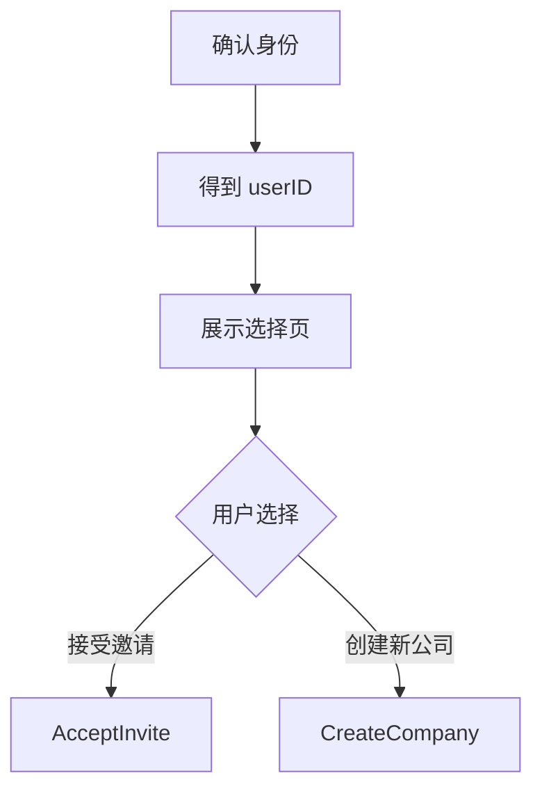
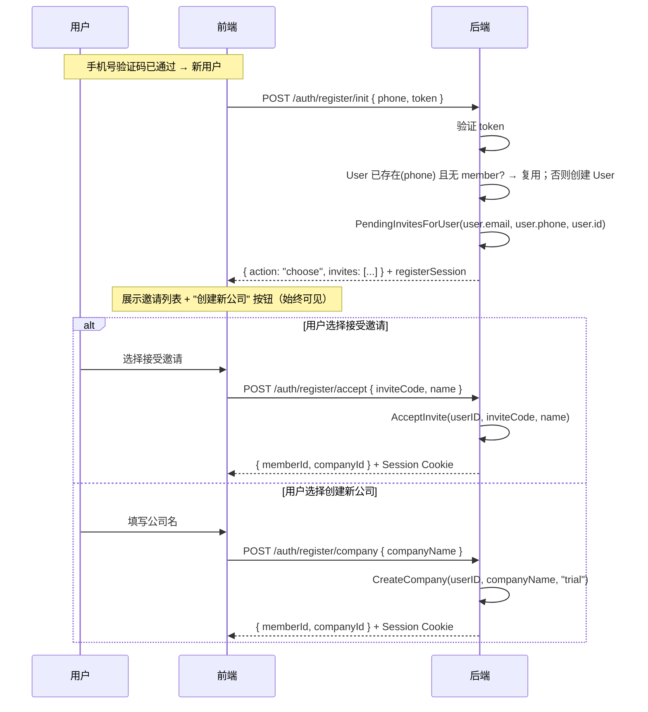
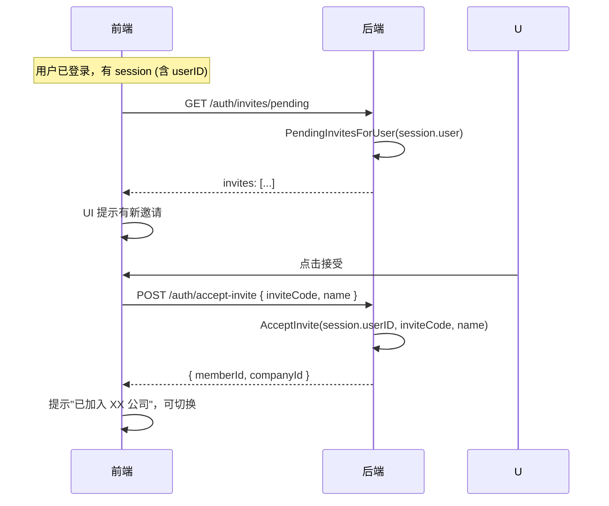

# 用户与公司 Domain Service 设计

---

## 1. 核心洞察

所有场景归结为两步：

1. **确认身份**（得到一个 User）
2. **选择去向**：加入已有公司（有邀请）或 创建新公司



---

## 2. Domain Service 接口

```go
type Service interface {
    // 创建企业（两种模式：立即加入 或 生成邀请）
    CreateCompany(ctx, CreateCompanyReq) (CreateCompanyResult, error)

    // 通过邀请码加入已有企业
    AcceptInvite(ctx, AcceptInviteReq) (types.Member, error)

    // 查询某 user 待接受的邀请列表
    PendingInvitesForUser(ctx, PendingInvitesForUserReq) ([]PendingInvite, error)

    // --- 不变 ---
    ListCompanies(ctx) ([]store.Company, error)
    UpdateCompany(ctx, id, patch) error
    ResolveCompanyContext(ctx, companyID) (Context, error)
    ResolveFromMember(ctx, memberID) (Context, error)
}
```

---

## 3. 方法定义

### 3.1 `CreateCompany`

**语义**：创建一家新公司。两种模式由入参决定：

```go
type CreateCompanyReq struct {
    UserID      uuid.UUID // 可选：非 Nil 时创建者立即成为超管 Member
    CompanyName string
    CompanyType string    // "standard" | "trial" | "selfhosted"
    InviteEmail string    // 可选：非空时生成 invite（平台开户，defer 加入）
}

type CreateCompanyResult struct {
    Company    store.Company
    Member     *types.Member // UserID 模式时非 nil
    InviteCode string        // InviteEmail 模式时非空
}
```

**两种模式**：

| 条件 | 模式 | 行为 | 场景 |
| --- | --- | --- | --- |
| `UserID != Nil` | 立即加入 | Company + Member（超管） | 自助注册、Setup |
| `UserID == Nil && InviteEmail != ""` | 生成邀请 | Company + Invite | 平台运营开户 |
| 两者都空 | 错误 | | |

内部（单事务）：
1. `provisionCompany`（Company + 钱包 + 角色 + org tree）
2. 若 UserID 模式 → `addMember`（User 成为超管）
3. 若 InviteEmail 模式 → 创建 invite 记录

### 3.2 `AcceptInvite`

**语义**：一个已确认身份的 User 通过邀请码加入已有公司。

```go
type AcceptInviteReq struct {
    UserID     uuid.UUID
    InviteCode string
    Name       string
}
```

内部：
1. 验证 invite（存在 + 未用 + 未过期）
2. 检查 user 是否已是该 company 的 member → 是则幂等返回现有 member
3. `addMember`（User 成为 invite.Role 的 Member）
4. MarkInviteAccepted

### 3.3 `PendingInvitesForUser`

**语义**：查找某个 user 所有待接受的公司邀请（按 email/phone/userID 任一标识匹配）。

```go
type PendingInvitesForUserReq struct {
    Email  string    // user 的 email
    Phone  string    // user 的 phone
    UserID uuid.UUID // user 的 ID
}

type PendingInvite struct {
    InviteCode  string
    CompanyID   uuid.UUID
    CompanyName string
    Role        string
    ExpiresAt   time.Time
}
```

查询逻辑：传入 user 的所有已知标识，动态构建 WHERE 条件（只加非空字段），OR 合并去重返回。

---

## 4. 注册后流程

### 4.1 完整时序



### 4.2 `register/init` 幂等性

| phone 对应 User | 该 User 有 member? | 行为 |
| --- | --- | --- |
| 不存在 | — | 创建 User → 继续注册 |
| 存在 | 无 member | 复用 User → 重新签发 registerSession → 继续注册 |
| 存在 | 有 member | 已注册完成 → 返回 `{ action: "login" }`，引导走登录 |

### 4.3 前端 UX

```
┌──────────────────────────────────────────────────────┐
│                                                      │
│  选择如何继续：                                      │
│                                                      │
│  ┌────────────────────────────────────────────┐      │
│  │ + 创建新公司                                │      │
│  │   [填写公司名 →]                            │      │
│  └────────────────────────────────────────────┘      │
│                                                      │
│  ── 或接受已有邀请 ──────────────────                │
│                                                      │
│  ┌────────────────────────────────────────────┐      │
│  │ 🏢 Acme Inc.  — 角色：普通成员              │      │
│  │ [接受]                                      │      │
│  └────────────────────────────────────────────┘      │
│  ┌────────────────────────────────────────────┐      │
│  │ 🏢 Beta Corp. — 角色：超级管理员            │      │
│  │ [接受]                                      │      │
│  └────────────────────────────────────────────┘      │
│                                                      │
└──────────────────────────────────────────────────────┘
```

无邀请时邀请区域隐藏，只显示创建公司表单。有邀请时两个选项并列，用户自由选择。

---

## 5. 已登录用户接受邀请

已登录用户（有 session）收到新邀请后，不走 `register/*` 流程，直接在平台内操作：



**复用 `POST /auth/accept-invite`**：
- 已登录时：handler 从 session 取 userID，body 中不需要 password
- 未登录时（邮件链接）：handler 从 body.password 创建/更新 User，再取 userID

---

## 6. 数据模型变更

### 6.1 `company_invites` 表扩展

```sql
ALTER TABLE company_invites ADD COLUMN IF NOT EXISTS phone TEXT;
ALTER TABLE company_invites ADD COLUMN IF NOT EXISTS user_id UUID;

CREATE INDEX IF NOT EXISTS idx_company_invites_email_pending
    ON company_invites (email) WHERE accepted_at IS NULL AND email IS NOT NULL AND email != '';
CREATE INDEX IF NOT EXISTS idx_company_invites_phone_pending
    ON company_invites (phone) WHERE accepted_at IS NULL AND phone IS NOT NULL AND phone != '';
CREATE INDEX IF NOT EXISTS idx_company_invites_user_pending
    ON company_invites (user_id) WHERE accepted_at IS NULL AND user_id IS NOT NULL;
```

### 6.2 `InviteRepository`

```go
type CompanyInvite struct {
    ID         uuid.UUID
    CompanyID  uuid.UUID
    Email      string     // 可选
    Phone      string     // 可选
    UserID     uuid.UUID  // 可选
    Role       string
    InviteCode string
    ExpiresAt  time.Time
    AcceptedAt *time.Time
    CreatedAt  time.Time
}

type InviteRepository interface {
    CreateInvite(ctx, invite CompanyInvite) error
    GetInviteByCode(ctx, inviteCode string) (*CompanyInvite, error)
    MarkInviteAccepted(ctx, id uuid.UUID, acceptedAt time.Time) error
    // 新增：动态构建 WHERE（只加非空字段），OR 合并
    FindPendingInvitesForUser(ctx, email string, phone string, userID uuid.UUID) ([]CompanyInvite, error)
}
```

`FindPendingInvitesForUser` 实现：Go 层根据非空参数动态拼 WHERE 条件，避免 SQL 中的零值比较。

---

## 7. HTTP API

### 7.1 注册相关（新增）

| 端点 | Body | 响应 | 说明 |
| --- | --- | --- | --- |
| `POST /auth/register/init` | `{ phone, token }` | `RegisterInitResult` | 创建/复用 User + 查邀请 |
| `POST /auth/register/accept` | `{ inviteCode, name }` | `{ memberId, companyId }` | 接受邀请（需 registerSession） |
| `POST /auth/register/company` | `{ companyName }` | `{ memberId, companyId }` | 创建新公司（需 registerSession） |

```typescript
type RegisterInitResult =
  | { action: "choose"; invites: PendingInvite[] }  // 正常流程（含空数组）
  | { action: "login" }                             // 已有 member，引导走登录

// 前端判断：invites.length > 0 → 展示选择页；invites.length === 0 → 直接展示创建表单
```

`register/init` 成功后签发 `registerSession`（JWT，含 userID，10min）。后续 accept/company 通过该 token 识别 user。

### 7.2 已登录用户邀请（新增）

| 端点 | 说明 |
| --- | --- |
| `GET /auth/invites/pending` | 查当前 session user 的 pending invites |

### 7.3 其他端点

| 端点 | 变化 |
| --- | --- |
| `POST /platform/companies` | body: `{ name, type?, email }`；handler 内部 CreateCompany(UserID=Nil, InviteEmail=email) |
| `POST /auth/accept-invite` | body: `{ inviteCode, name, password? }`；已登录 → 从 session 取 userID；未登录 → password 创建 User |
| `POST /auth/setup` (新) | `{ companyName, email, password }`；Create User → CreateCompany(UserID) |
| `POST /auth/login` | 不变 |
| `POST /auth/sms/*` (新) | 纯认证层 |

---

## 8. 各场景编排

| 场景 | Handler 编排 |
| --- | --- |
| **SaaS 注册** | sms/verify → register/init → (accept / company) |
| **私有化 Setup** | Create User(email, password) → CreateCompany(UserID, 'selfhosted') |
| **平台运营开户** | CreateCompany(UserID=Nil, InviteEmail=email) → 返回 inviteCode |
| **邮件邀请激活** | GetOrCreate User(email, password) → AcceptInvite(userID) |
| **已登录用户接受邀请** | AcceptInvite(session.userID) |

---

## 9. 内部 Helper（unexported）

```go
// provisionCompany 创建企业基础设施
// Company + NewAPI 钱包 + 预设角色 + root org node
func (s *service) provisionCompany(ctx, tx, name, companyType string) (store.Company, error)

// addMember 将 user 加入企业
// 若已是 member → 幂等返回现有 member
// 否则创建 Member + 分配角色 + 挂到 root dept + 设为 manager（超管时）
func (s *service) addMember(ctx, tx, userID, companyID uuid.UUID, name, role string) (types.Member, error)
```

---

## 10. 对比现有实现

| | 之前 | 之后 |
| --- | --- | --- |
| CreateCompany 入参 | Name + SuperAdminEmail | UserID(可选) + Name + Type + InviteEmail(可选) |
| CreateCompany 创建 Invite | 是（强制） | 仅 InviteEmail 模式 |
| CreateCompany 创建 Member | 否 | UserID 模式时创建 |
| AcceptInvite 入参 | InviteCode + Name + Password | UserID + InviteCode + Name |
| AcceptInvite 创建 User | 是 | 否（handler 层负责） |
| AcceptInvite 设密码 | 是 | 否（handler 层负责） |
| PendingInvites 查询 | 不存在 | 新增 |
| 已登录用户接受邀请 | 不支持 | 支持 |

---

## 11. 实施顺序

1. `company_invites` 表加 `phone` + `user_id` 列 + pending 索引
2. `InviteRepository.FindPendingInvitesForUser` — 动态 WHERE 构建
3. 提取 `provisionCompany` + `addMember` 内部 helper
4. 重写 `CreateCompany`（新签名，两种模式）
5. 重写 `AcceptInvite`（新签名：UserID）
6. 新增 `PendingInvitesForUser` domain 方法
7. 实现 `RequireSaaS` / `RequireLocal` mode guard middleware
8. 改造 `POST /platform/companies` handler → CreateCompany(InviteEmail 模式)
9. 改造 `POST /auth/accept-invite` handler → User 处理提到 handler 层
10. 实现 `POST /auth/register/*` 三个端点（RequireSaaS 守卫）
11. 实现 `POST /auth/setup`（RequireLocal 守卫）
12. 实现 `GET /auth/invites/pending`
13. 现有测试适配

---

## 12. SaaS vs Local 部署模式

### 12.1 API 可用性矩阵

| 端点 | SaaS (`SUPPORT_SAAS=true`) | Local (`SUPPORT_SAAS=false`) | 说明 |
| --- | --- | --- | --- |
| `POST /auth/sms/send` | ✅ | ❌ | Local 无短信依赖 |
| `POST /auth/sms/verify` | ✅ | ❌ | |
| `POST /auth/sms/select` | ✅ | ❌ | |
| `POST /auth/register/*` | ✅ (需 `REGISTRATION_ENABLED`) | ❌ | Local 走 Setup |
| `POST /auth/setup` | ❌ | ✅ (一次性) | SaaS 不走 Setup |
| `GET /auth/setup-status` | ❌ | ✅ | |
| `GET /auth/invites/pending` | ✅ | ✅ | 两种模式都支持邀请 |
| `POST /auth/accept-invite` | ✅ | ✅ | |
| `POST /auth/login` | ✅ | ✅ | SaaS: 多企业；Local: 单企业 |
| `POST /platform/*` | ✅ | ❌ | 平台运营面板仅 SaaS |

### 12.2 行为差异

| 行为 | SaaS | Local |
| --- | --- | --- |
| `CreateCompany` 可多次调用 | ✅ 多租户 | ❌ 仅 Setup 时一次 |
| `/auth/login` 需要 companyId | 是（多企业） | 否（隐式 LocalCompanyID） |
| 手机号登录多企业选择 | 可能出现 | 不出现（单企业） |
| `CompanyResolve` middleware | 从 JWT 取 companyID | fallback 到 `LocalCompanyID` |
| Provider Key 管理 | 平台统一管，企业不可操作 | 企业自管 |

### 12.3 Mode Guard Middleware

统一 middleware 在路由注册时封禁不适用的端点，handler 内部不需要关心部署模式：

```go
// middleware/mode_guard.go

// RequireSaaS 仅 SaaS 模式可用，Local 返回 404
func RequireSaaS(cfg config.Config) func(http.Handler) http.Handler

// RequireLocal 仅 Local 模式可用，SaaS 返回 404
func RequireLocal(cfg config.Config) func(http.Handler) http.Handler
```

路由注册：

```go
func (reg Registry) RegisterAPIRoutes(r chi.Router) {
    // 两种模式都可用
    reg.auth.RegisterRoutes(r)         // login, logout, accept-invite, invites/pending

    // 仅 SaaS
    r.Group(func(r chi.Router) {
        r.Use(middleware.RequireSaaS(reg.config))
        reg.sms.RegisterRoutes(r)      // sms/send, sms/verify, sms/select
        reg.register.RegisterRoutes(r) // register/init, register/accept, register/company
    })

    // 仅 Local
    r.Group(func(r chi.Router) {
        r.Use(middleware.RequireLocal(reg.config))
        reg.setup.RegisterRoutes(r)    // setup, setup-status
    })

    // 仅 SaaS (平台运营)
    if reg.config.SupportSaas {
        r.Route("/platform", reg.platform.RegisterRoutes)
    }
}
```

**优点**：
- handler 内部不关心部署模式（职责分离）
- 不支持的端点返回 404（对攻击者隐藏入口）
- 路由注册处一眼看清哪些端点在哪种模式下可用

### 12.4 前端条件

| 变量 | 用途 |
| --- | --- |
| `VITE_SUPPORT_SAAS` | 控制登录页 UI（手机号 vs 邮箱、是否显示注册入口） |
| `VITE_REGISTRATION_ENABLED` | 是否显示「免费试用/注册」按钮 |

前端路由：
- **SaaS**：`/login`（手机号主）、`/register/*`、`/invite/accept`
- **Local**：`/login`（邮箱密码）、`/setup`、`/invite/accept`
