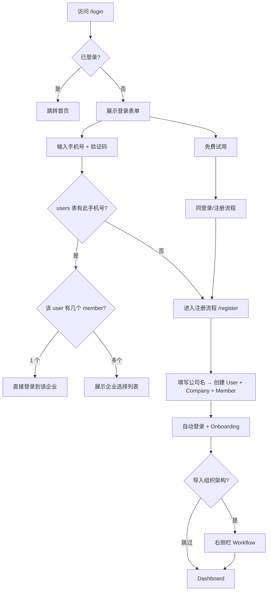
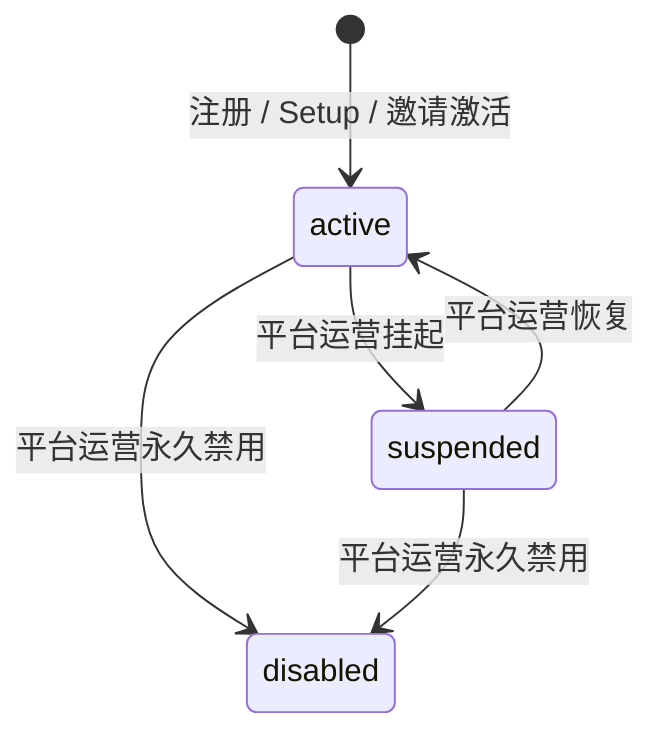
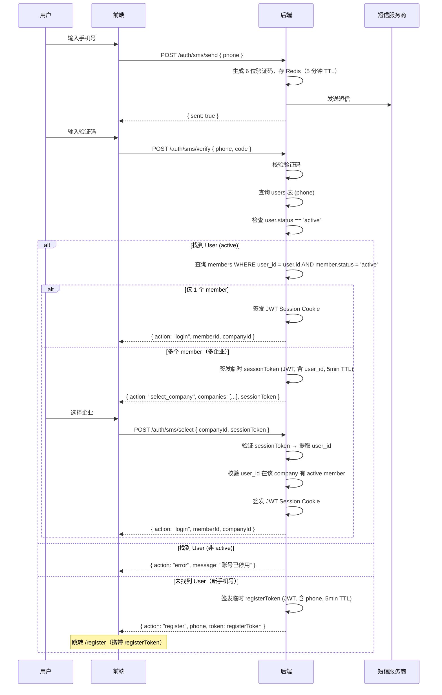
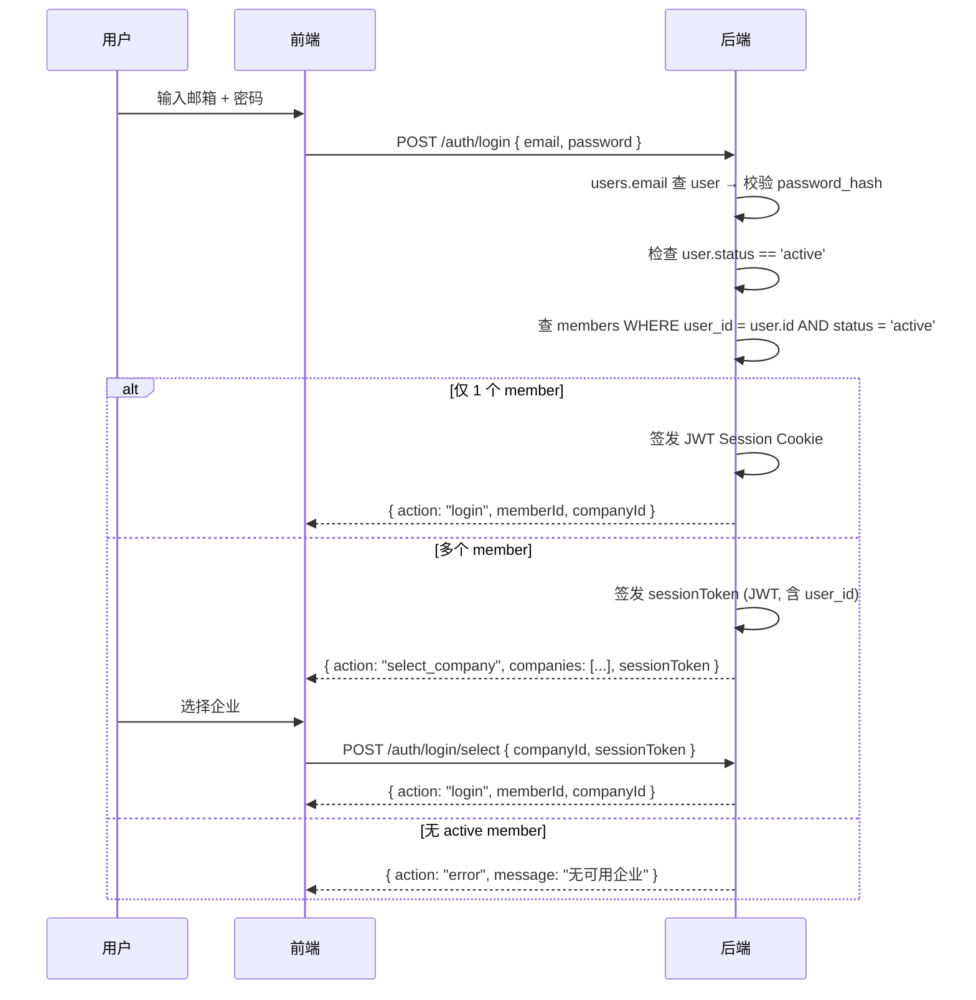
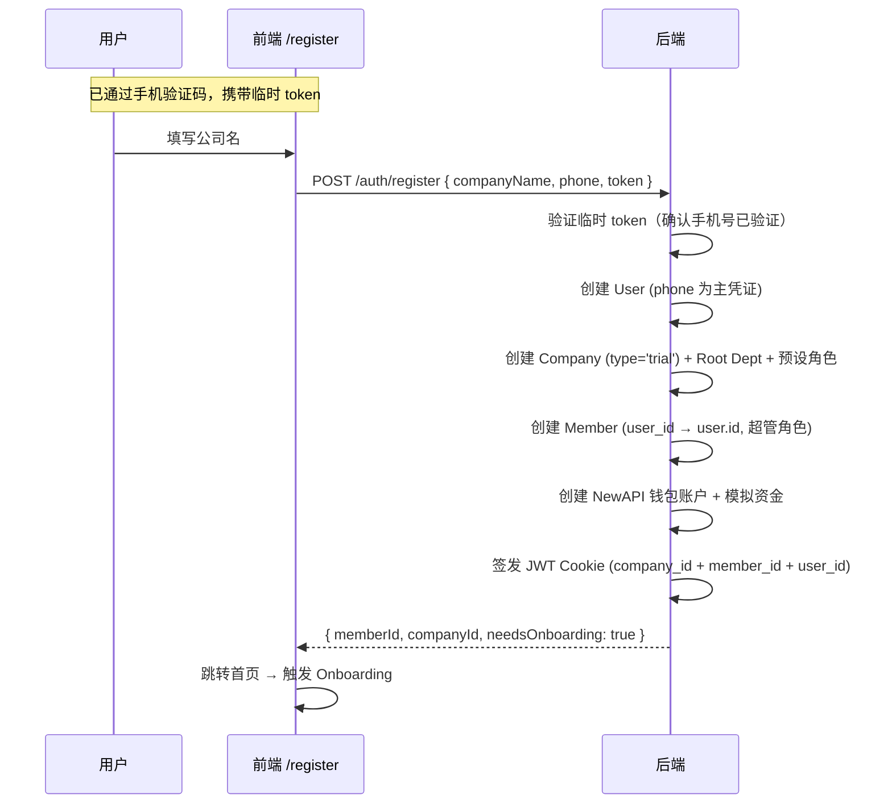
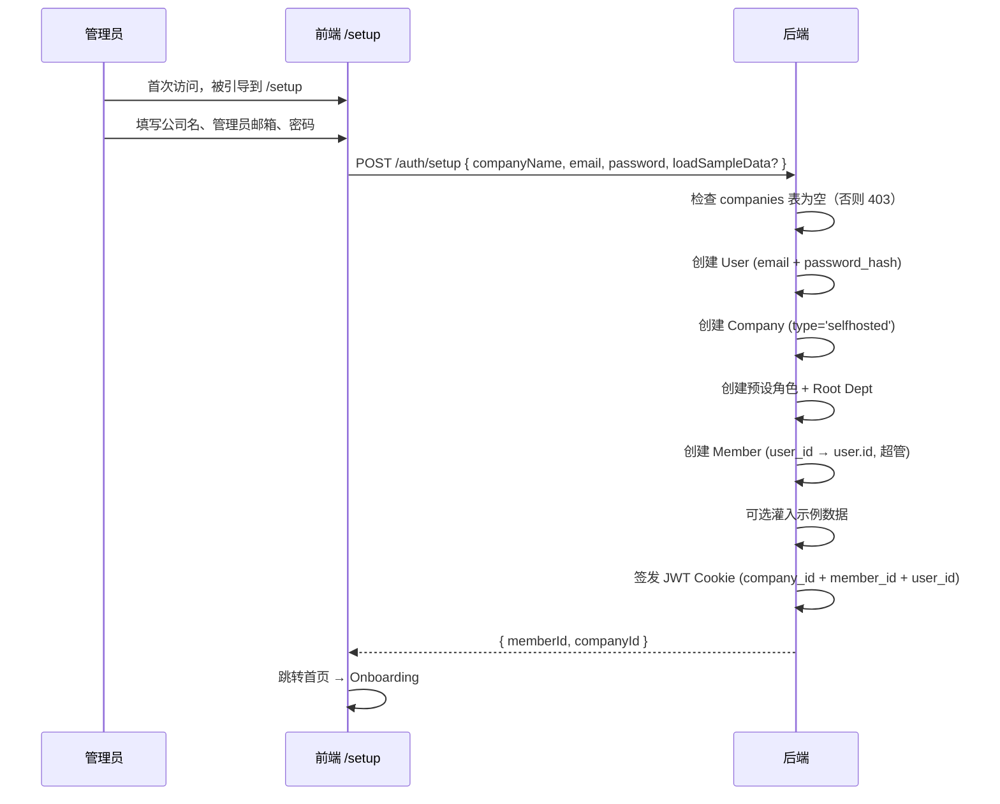

# 登录 / 注册 / Trial 方案设计

> **目标**：为 TokenJoy 提供完整的认证入口——公司注册（SaaS 公开试用）、私有化 Setup、成员导入与密码配置——覆盖私有化与 SaaS 两种部署形态。  
> **市场**：中国，主认证方式为**手机号 + 短信验证码**。

---

## 目录

- [1. 现状分析](#1-现状分析)
- [2. 行业做法参考](#2-行业做法参考)
- [3. 总体设计](#3-总体设计)
- [4. 认证模型：User / Member 两层架构](#4-认证模型user--member-两层架构)
- [5. 认证方式：手机号 + 验证码](#5-认证方式手机号--验证码)
- [6. SaaS 注册公司（`/register`）](#6-saas-注册公司register)
- [7. 私有化 Setup（`/setup`）](#7-私有化-setupsetup)
- [8. 成员入驻（导入组织架构 + 密码配置）](#8-成员入驻导入组织架构--密码配置)
- [9. Trial 试用模式](#9-trial-试用模式)
- [10. 租户模型](#10-租户模型)
- [11. 前端路由与页面规划](#11-前端路由与页面规划)
- [12. 后端 API](#12-后端-api)
- [13. 数据库变更](#13-数据库变更)
- [14. 安全考量](#14-安全考量)
- [15. 实施步骤](#15-实施步骤)

---

## 1. 现状分析

### 已有能力

| 能力 | 实现位置 | 说明 |
| --- | --- | --- |
| User/Member 两层模型 | `users` 表 + `members` 表 | User 持有认证凭证（phone/email/password），Member 是企业内角色 |
| 邮箱 + 密码登录 | `POST /auth/login` + 前端 `/login` | 通过 `users.email` 查 user → 校验密码 → 签发 JWT |
| SaaS 多企业路由 | `loginBody.companyId` | `SUPPORT_SAAS=true` 时需指定企业 |
| 平台开户 | `POST /platform/companies` | 平台运营创建公司 + 发邀请码 |
| 邀请激活 | `POST /auth/accept-invite` | 邀请码 → 创建/更新 User + 创建 Member → JWT |
| Bootstrap / Seed | `BOOTSTRAP_MODE=demo|minimal` | 开发用种子数据 |
| 成员导入 | `POST /org/members/batch-import` | 超管批量导入（同时创建 user + member） |
| 组织架构同步 | 飞书全量导入 + 定时同步 | US-02/03 |
| UUID v7 主键 | 所有表 ID 均为 UUID v7 | 单调递增 + 无顺序信息泄漏 |

### 缺失

| 缺失点 | 影响 |
| --- | --- |
| 无手机号 + 验证码认证 | 中国市场主流登录方式缺失 |
| SaaS 无公开注册页面 | 企业无法自助开通 |
| 私有化无 Setup Wizard | 首次部署需手动写库 |
| 邀请无真实投递 + 无激活页面 | 成员无法自助入驻 |
| 无公开试用入口 | 企业无法自助体验产品 |
| 批量导入无密码设置 | 导入的 user 无 password_hash，无法邮箱密码登录 |

---

## 2. 行业做法参考

### 2.1 中国 SaaS 登录注册

| 产品 | 做法 |
| --- | --- |
| **飞书** | 手机号 + 验证码登录/注册合一；新手机号自动注册 |
| **钉钉** | 手机号 + 验证码；已有组织直接加入，无组织创建新团队 |
| **企业微信** | 手机号 + 验证码 → 创建企业 |
| **语雀 / 腾讯文档** | 手机号一键登录/注册；首次即创建空间 |
| **Cursor / 国内 AI 工具** | 手机号 + 验证码 → 立即可用 |

**共性**：中国 ToB/ToC 产品几乎全部使用**手机号 + 短信验证码**作为主认证方式，登录与注册合一（同一页面，新号自动注册）。

### 2.2 试用

| 产品 | 做法 |
| --- | --- |
| **飞书** | 免费版即试用，绑定手机号 |
| **Notion** | 注册即免费 workspace |
| **腾讯云 / 阿里云** | 试用需手机号注册，绑定后持久化 |
| **Helicone / LangSmith** | 注册即 trial，接入自己数据后才有价值 |

**TokenJoy 方案**：注册即 Trial（`type='trial'`），手机号绑定，给予模拟资金体验完整功能（Mock LLM），升级为正式版时数据原地保留。

### 2.3 私有化部署

| 产品 | 做法 |
| --- | --- |
| **GitLab Self-Managed** | 首次访问 `/admin/setup` 设 root 密码 |
| **Metabase** | Setup Wizard（管理员 + 组织信息） |
| **JumpServer** | 首次部署初始化管理员 |

**TokenJoy 方案**：`/setup` 一次性 Wizard，邮箱+密码（私有化无短信依赖）。

---

## 3. 总体设计

### 入口总览

```
┌─────────────────────────────────────────────────────────────┐
│                         /login                              │
│  ┌──────────────────────────────────────────────────────┐   │
│  │  手机号: [___________]                                │   │
│  │  验证码: [______]  [获取验证码]                       │   │
│  │                                                       │   │
│  │  [登录 / 注册]   ← 登录注册合一                       │   │
│  │  ─────────────────────────────────────────────────── │   │
│  │  [免费试用]                                           │   │
│  │  ─────────────────────────────────────────────────── │   │
│  │  其他方式：[邮箱密码登录]                              │   │
│  └──────────────────────────────────────────────────────┘   │
│                                                             │
│  (私有化 + needsSetup): [首次部署? 设置管理员 →]            │
└─────────────────────────────────────────────────────────────┘
```

### 核心决策

| 决策 | 选择 | 理由 |
| --- | --- | --- |
| 主认证方式 | 手机号 + 短信验证码 | 中国市场标准；无需记密码 |
| 备用方式 | 邮箱 + 密码 | 私有化 / 海外 / 无短信场景 |
| 登录注册合一 | 是 | 降低心智负担；新手机号自动走注册流程 |
| 注册即 Trial | 所有新注册企业默认 trial | 付费后升级为 standard，数据原地保留 |
| `/setup` vs `/register` | 分开 API | 语义不同，安全守卫不同 |
| 认证主体 | User（全局身份） | Member 是企业内角色，不是认证入口 |
| ID 类型 | UUID v7 | 全部表主键统一使用 UUID v7 |

### 生命周期



---

## 4. 认证模型：User / Member 两层架构

### 4.1 核心概念

| 实体 | 表 | 职责 | 唯一性 |
| --- | --- | --- | --- |
| **User** | `users` | 认证身份（全局唯一自然人） | phone 全局唯一、email 全局唯一 |
| **Member** | `members` | 组织内角色（每企业一个身份） | (user_id, company_id) 唯一 |

### 4.2 关系

```
┌──────────────┐         ┌──────────────────────────┐
│    users     │         │        members           │
│──────────────│         │──────────────────────────│
│ id (UUID)    │◄────────│ user_id (UUID, 逻辑引用)  │
│ phone        │   1:N   │ company_id (UUID, FK)     │
│ email        │         │ id (UUID)                 │
│ password_hash│         │ name                      │
│ status       │         │ department_id             │
└──────────────┘         │ status                    │
                         │ roles (via member_roles)  │
                         └──────────────────────────┘
```

- 一个 User 可以有多个 Member（跨企业场景：同一人加入多家公司）
- `members.user_id` 是逻辑引用，无 FK 约束（user/member 解耦）
- 认证凭证（phone、email、password）全部在 `users` 表，`members` 表不存储认证信息

### 4.3 JWT Claims

```go
type Claims struct {
    CompanyID int64  `json:"company_id"`   // 当前所属企业
    UserID    string `json:"user_id"`      // 全局用户身份
    Sid       string `json:"sid"`          // 会话 ID
    jwt.RegisteredClaims                   // Subject = memberID
}
```

- `Subject`（标准 JWT sub）= member.id（当前企业的角色 ID）
- `UserID` = user.id（全局身份，跨企业复用）
- `CompanyID` = member.company_id（当前企业）

### 4.4 认证查询路径

**手机号登录**：
```
users.phone → user.id → members WHERE user_id = user.id → 确定 member + company
```

**邮箱密码登录**：
```
users.email → user → 校验 password_hash → members WHERE user_id = user.id AND company_id = X
```

**关键原则**：认证入口是 `users` 表，不是 `members` 表。

### 4.5 User 状态与认证拦截

#### 状态定义

| user.status | 含义 | 认证行为 |
| --- | --- | --- |
| `active` | 正常 | 允许登录 |
| `suspended` | 平台运营挂起（违规/欠费） | 拒绝登录，提示"账号已暂停，请联系管理员" |
| `disabled` | 永久禁用 | 拒绝登录，提示"账号已停用" |

#### 状态流转



#### 认证拦截点

所有认证流程在确认 user 存在后，**必须**校验 `user.status == 'active'`：

1. **手机号验证码登录**：`sms/verify` 查到 user 后 → 检查 status → 非 active 返回 403
2. **邮箱密码登录**：`/auth/login` 查到 user 后 → 检查 status → 非 active 返回 401
3. **邀请激活**：若 user 已存在且非 active → 拒绝激活，返回"账号已停用"

#### 权限边界

| 操作 | 谁能执行 | 说明 |
| --- | --- | --- |
| 修改 `user.status` | 平台运营（`/platform` API） | 企业管理员**不能**操作 user.status |
| 修改 `member.status` | 企业管理员（`/org` API） | 只控制该成员在本企业内的状态 |
| 冻结某人在本企业的访问 | 企业管理员设 `member.status = 'disabled'` | 不影响该 user 在其他企业的 member |

`member.status` 与 `user.status` 独立：user 级别停用影响所有企业；member 级别停用只影响单个企业。认证时两者都需校验（user.status AND member.status 都为 active 才放行）。

---

## 5. 认证方式：手机号 + 验证码

### 5.1 登录/注册合一流程



### 5.1.1 临时 Token 机制

认证流程中涉及两种短期 token（均为服务端签发的 JWT，无状态验证）：

| Token | 用途 | Claims | 有效期 | 一次性 |
| --- | --- | --- | --- | --- |
| `sessionToken` | 多企业选择（sms/select） | `{ user_id, purpose: "select" }` | 5 分钟 | 否（选择期间可能切换） |
| `registerToken` | 新用户注册（/auth/register） | `{ phone, purpose: "register" }` | 5 分钟 | 是（注册后失效） |

**安全设计**：
- 两种 token 均为 JWT，使用与 session token 相同的 HMAC secret 签名
- `purpose` 字段防止 token 跨用途伪造（register token 不能用于 select，反之亦然）
- `registerToken` 一次性：注册成功后将 token JTI 写入 Redis blacklist（TTL=5min）
- `sessionToken` 内含 `user_id`，后端验证该 user 确实拥有请求的 companyId 对应 member

### 5.2 验证码规则

| 配置 | 值 | 说明 |
| --- | --- | --- |
| 验证码长度 | 6 位数字 | |
| 有效期 | 5 分钟 | Redis TTL |
| 发送间隔 | 60 秒 | 防频繁发送 |
| 每日上限 | 10 次/手机号 | 防刷 |
| 验证尝试 | 最多 5 次 | 超过锁定 15 分钟 |
| 短信模板 | "验证码：{code}，5分钟内有效。" | |

### 5.3 邮箱密码作为备用

保留现有 `POST /auth/login`（邮箱+密码），作为：
- 私有化部署（无短信服务）的默认方式
- SaaS 下的备用登录方式（"其他方式 → 邮箱密码登录"）
- 管理员替设密码后成员使用

邮箱密码登录路径：`users.email` → 校验 `users.password_hash` → 查 `members WHERE user_id AND company_id` → 签发 JWT。

#### SaaS 多企业下邮箱密码登录

邮箱密码登录与手机号验证码走相同的多企业分支逻辑：



**改造说明**：
- 现有 `/auth/login` 的响应格式从 `{ memberId }` 扩展为与 `SmsVerifyResult` 一致的 union type
- 不再要求前端传 `companyId`（去掉 `loginBody.companyId` 字段）
- 新增 `POST /auth/login/select` 端点（复用 sms/select 相同逻辑，验证 sessionToken + companyId）
- 私有化模式下（单企业）永远只有 1 个 member，不会进入选择分支

---

## 6. SaaS 注册公司（`/register`）

### 6.1 流程

用户通过手机验证码确认身份后（新手机号），跳转到注册页完成企业创建。



### 6.2 注册表单

```
┌────────────────────────────────────────┐
│         创建您的企业空间               │
│                                        │
│  手机号: 138****1234 ✓ (已验证，只读)  │
│  公司名称: [________________]          │
│                                        │
│  [创建企业]                            │
│                                        │
│  已有企业？[返回登录 →]                │
└────────────────────────────────────────┘
```

**注意**：注册时不需要设置密码——手机号验证码本身就是认证方式。如需密码（邮箱登录），后续在设置中添加。

### 6.3 已有 User 注册新企业

如果用户手机号已在 `users` 表中（例如已加入企业 A，现在想创建企业 B），流程变为：
1. `POST /auth/sms/verify` 返回 `action: "login"`（因为找到了 user）
2. 用户登录后在平台内创建新企业（P2 功能，暂不实现）

首版不支持一个 user 同时创建多家企业。多企业场景通过「被邀请加入」实现。

---

## 7. 私有化 Setup（`/setup`）

### 7.1 定位

私有化部署首次启动时的一次性系统初始化。与 SaaS 注册**完全独立的端点和守卫**。

### 7.2 触发条件

`GET /auth/setup-status` → `{ needsSetup: true }` 当且仅当 companies 表为空。

### 7.3 流程



### 7.4 表单

```
┌────────────────────────────────────────┐
│         欢迎使用 TokenJoy              │
│       完成初始设置开始使用              │
│                                        │
│  公司名称: [________________]          │
│  管理员邮箱: [________________]        │
│  密码: [________________]              │
│  确认密码: [________________]          │
│                                        │
│  □ 加载示例数据（推荐首次体验勾选）    │
│                                        │
│  [完成设置]                            │
└────────────────────────────────────────┘
```

### 7.5 与 SaaS 注册的区别

| 维度 | `/auth/setup` | `/auth/register` |
| --- | --- | --- |
| 部署形态 | 私有化 | SaaS |
| 触发条件 | companies 表为空 | 任何时候（`REGISTRATION_ENABLED`） |
| 认证方式 | 邮箱 + 密码 | 手机号验证码 |
| Company type | `selfhosted` | `trial` |
| 调用次数 | 一次性（设置后永久 403） | 可多次（多企业注册） |
| 短信依赖 | 无（私有化可能无外网） | 有 |
| 创建顺序 | User → Company → Member | User → Company → Member |

---

## 8. 成员入驻（导入组织架构 + 密码配置）

### 8.1 Onboarding 导入组织架构

注册/Setup 完成后，触发 **Onboarding Workflow**（右侧滑出栏）。

**通用 Workflow，复用于多个场景**：
- 注册完成后的 Onboarding 引导
- 数据源配置页的 "导入" 按钮
- 组织管理页的 "批量导入" 入口

```
┌─────────────── 右侧滑出栏 ───────────────┐
│                                            │
│  导入组织架构                              │
│  ─────────────────────────────             │
│                                            │
│  选择导入方式：                            │
│                                            │
│  ┌──────────┐ ┌──────────┐ ┌──────────┐   │
│  │  飞书     │ │  CSV     │ │  手动    │   │
│  │  同步     │ │  上传    │ │  添加    │   │
│  └──────────┘ └──────────┘ └──────────┘   │
│                                            │
│  (选择后进入对应子步骤)                    │
│                                            │
│  [跳过，稍后设置]                          │
└────────────────────────────────────────────┘
```

### 8.2 导入时的 User/Member 创建

批量导入成员时，每个人需要创建两个实体：

1. **User**：以 phone 或 email 为唯一标识查找；已存在则复用，不存在则创建
2. **Member**：在目标 company 下创建，关联 user_id

```
对于每个导入行:
  1. 确定查找标识（优先级：phone > email）
  2. 查 users WHERE phone = row.phone
     - 若找到 → 复用该 user（跳到步骤 4）
  3. 若 phone 未命中，查 users WHERE email = row.email
     - 若找到 → 复用该 user（跳到步骤 4）
     - 若也未找到 → 创建 User (id=uuid_v7, phone, email, password_hash=空)
  4. 检查 members WHERE user_id = user.id AND company_id = 当前企业
     - 若已存在 → 跳过（或更新部门/角色，视配置）
     - 若不存在 → 创建 Member
```

#### 冲突处理策略

| 场景 | 处理方式 | 说明 |
| --- | --- | --- |
| phone 匹配到已有 user | 复用该 user，为其创建本企业 member | 允许跨企业（同一人可同时属于多家公司） |
| email 匹配到已有 user | 复用该 user，为其创建本企业 member | 同上 |
| phone 和 email 匹配到**不同 user** | 以 phone 优先，忽略 email 匹配 | phone 是主认证标识，权重更高 |
| 导入行无 phone 也无 email | 报错跳过该行 | 至少需要一个认证标识才能创建 user |
| 匹配到的 user 已在本企业有 member | 跳过创建，记录为"已存在" | 不重复创建；可选更新部门/角色 |
| 匹配到的 user.status 为 suspended/disabled | 正常创建 member（member 独立于 user status） | 该 user 暂时无法登录，但组织结构先建好 |

**导入结果汇总**（返回给前端）：

```typescript
interface ImportResult {
  total: number          // 总行数
  created: number        // 新建成功
  skipped: number        // 已存在跳过
  failed: number         // 失败行数
  failures: { row: number; reason: string }[]  // 失败详情
}
```

### 8.3 导入后密码配置

导入完成后的最后一步——为成员开通登录能力：

| 方式 | 适用场景 | 实现 |
| --- | --- | --- |
| **发送短信邀请** | SaaS（有短信服务） | 短信含链接，成员打开后手机号自动认证（无需密码） |
| **发送邮件邀请** | 有邮件服务 | 邮件含 `/invite/accept?code=xxx`，设置密码 |
| **设置统一初始密码** | 内网/无短信无邮件 | `POST /org/members/batch-set-password`（实际更新 `users.password_hash`） |

**注意**：`batch-set-password` 操作的是 user 的密码，不是 member 的。如果多个 member 共享同一 user（同人多企业），设一次密码即可跨企业使用。

### 8.4 Onboarding 状态持久化

| 字段 | 表 | 说明 |
| --- | --- | --- |
| `onboarding_status` | `companies`（新增） | `pending` / `completed` / `skipped` |

- `GET /session` 响应携带 `onboardingStatus`
- 前端据此决定是否弹出 Onboarding 滑出栏
- 用户跳过后状态设为 `skipped`，不再自动弹出
- 组织管理/数据源页始终提供 "导入" 入口（手动触发同一 Workflow）

### 8.5 邀请激活页（`/invite/accept`）

邮件邀请场景 → 成员点链接 → 设密码加入：

```
┌────────────────────────────────────────┐
│    欢迎加入 [公司名]                    │
│                                        │
│  您的邮箱: xxx@company.com (只读)      │
│  姓名: [________________]             │
│  设置密码: [________________]         │
│  确认密码: [________________]         │
│                                        │
│  [加入并登录]                          │
└────────────────────────────────────────┘
```

**激活流程中的 User/Member 处理**（已实现）：
1. 查 `users WHERE email = invite.email`
2. 若无 → 创建 User (email + password_hash)
3. 若有 → 更新 User 的 password_hash
4. 创建 Member (user_id = user.id, company_id = invite.company_id)
5. 签发 JWT (company_id + member_id + user_id)

---

## 9. Trial 试用模式

> Trial 试用的完整技术方案（Gateway Mock LLM、模拟资金、功能限制等）将在独立文档中补充。以下仅做概要。

### 9.1 核心设计

所有新注册企业默认为 Trial（`type='trial'`），手机号绑定到 User，给予模拟资金。用户导入自己的组织架构后体验完整功能（Gateway 走 Mock LLM，模拟 token 消费）。付费后原地升级为 `standard`。

### 9.2 Trial 与正式版的关系

| 维度 | Trial 试用 | Standard 正式版 |
| --- | --- | --- |
| 入口 | "免费试用" / "登录/注册" | 付费升级 |
| 认证 | 手机号 + 验证码（User 层） | 同 |
| Company type | `trial` | `standard` |
| 数据 | 用户自己的组织 + Onboarding | 同（原地保留） |
| 生命周期 | 永久（模拟资金用完可重置） | 永久 |
| LLM 调用 | Mock LLM | 真实供应商 |
| 功能限制 | 充值禁用、Mock LLM、成员上限 50 | 全功能 |
| 升级路径 | 原地升级为 standard（数据保留） | — |

---

## 10. 租户模型

> 详见 [Company 租户模型设计](./Company租户模型设计.md)。

通过 `companies.type` 列（枚举）区分租户类型，Company ID 为 UUID v7，不承载类型语义。

| type | 含义 | 部署形态 |
| --- | --- | --- |
| `standard` | SaaS 正式客户 | SaaS |
| `trial` | SaaS 免费试用 | SaaS |
| `demo` | 匿名体验沙箱（见 Demo 方案） | SaaS |
| `selfhosted` | 私有化部署 | 非 SaaS |
| `testing` | 开发/CI 测试 | 开发环境 |

---

## 11. 前端路由与页面规划

### 11.1 新增路由

| 路由 | 页面 | 条件 | audience |
| --- | --- | --- | --- |
| `/register` | SaaS 企业注册 | `VITE_SUPPORT_SAAS=true` | 公开 |
| `/setup` | 私有化首次安装 | `needsSetup=true` | 公开 |
| `/invite/accept` | 邀请激活 | `?code=xxx` | 公开 |
| `/forgot-password` | 忘记密码（P2） | — | 公开 |
| `/reset-password` | 重置密码（P2） | `?token=xxx` | 公开 |

### 11.2 `/login` 页改造

主表单改为手机号 + 验证码（SaaS），底部保留"其他方式：邮箱密码登录"。

```
┌────────────────────────────────────────┐
│            登录 TokenJoy                │
│                                        │
│  手机号: [+86 ___________]             │
│  验证码: [______]  [获取验证码 60s]    │
│                                        │
│  [登录 / 注册]                         │
│                                        │
│  ──────────── 或 ────────────          │
│  [免费试用]                            │
│                                        │
│  其他方式：邮箱密码登录                │
└────────────────────────────────────────┘
```

**条件矩阵**：

| 条件 | 显示内容 |
| --- | --- |
| SaaS + REGISTRATION_ENABLED | 手机号登录/注册 + "免费试用" 按钮 + 邮箱备用 |
| SaaS + !REGISTRATION_ENABLED | 手机号登录 + 邮箱备用（无注册入口） |
| 私有化 + needsSetup | 邮箱密码登录 + Setup 链接 |
| 私有化 + !needsSetup | 邮箱密码登录 |

### 11.3 Onboarding Workflow

复用 `features/workflow/`：

```
features/workflow/workflows/onboarding-import.tsx
features/workflow/definitions/onboarding.ts
```

触发条件：`session.onboardingStatus === 'pending'` 时 `workflowStore.open('onboarding-import')`。

---

## 12. 后端 API

### 12.1 短信验证码

| 方法 | 路径 | Body | 响应 | 说明 |
| --- | --- | --- | --- | --- |
| POST | `/auth/sms/send` | `{ phone }` | `{ sent: true }` | 发送验证码；60s 限频 |
| POST | `/auth/sms/verify` | `{ phone, code }` | `SmsVerifyResult` | 验证并决定下一步 |
| POST | `/auth/sms/select` | `{ companyId, sessionToken }` | `{ memberId, companyId }` | 多企业时选择公司 |

**`SmsVerifyResult`**：

```typescript
type SmsVerifyResult =
  | { action: "login"; memberId: string; companyId: string }                          // 单企业，直接登录（Cookie 已 Set）
  | { action: "select_company"; companies: CompanyBrief[]; sessionToken: string }     // 多企业选择
  | { action: "register"; phone: string; token: string }                              // 新 user → 注册
  | { action: "error"; message: string }                                              // user 已停用等

interface CompanyBrief {
  id: string       // UUID
  name: string
  type: string     // 'standard' | 'trial' | ...
}
```

**`POST /auth/sms/select` Body**：

```typescript
interface SmsSelectBody {
  companyId: string       // 用户选择的企业 UUID
  sessionToken: string    // sms/verify 返回的 sessionToken（JWT，含 user_id + purpose:"select"）
}
```

后端验证：解析 sessionToken → 提取 user_id → 校验该 user 在 companyId 下有 active member → 签发 Session Cookie。

**实现逻辑**：
1. 校验验证码（Redis）
2. `UserRepo.GetByPhone(phone)` → 查 `users` 表
3. 校验 `user.status == 'active'`（非 active → 返回 error）
4. 若找到 user → `OrgRepo.MembersByUserID(user.id)` → 列出 active member
5. 1 个 member → 签发 JWT Session Cookie → 返回 login
6. 多个 member → 签发 sessionToken（JWT, 5min）→ 返回 select_company
7. 若未找到 user → 签发 registerToken（JWT, 5min, 一次性）→ 返回 register

### 12.2 SaaS 注册（独立端点）

| 方法 | 路径 | Body | 响应 | 说明 |
| --- | --- | --- | --- | --- |
| POST | `/auth/register` | `RegisterBody` | `{ memberId, companyId }` | 需 `REGISTRATION_ENABLED=true` |

```typescript
interface RegisterBody {
  companyName: string
  phone: string        // 已验证的手机号
  token: string        // sms/verify 返回的临时 token
}
```

**实现逻辑**：
1. 验证临时 token（一次性，5 分钟有效）
2. 创建 User (id=uuid_v7, phone=phone, password_hash=空)
3. 创建 Company (id=uuid_v7, type='trial') + Root Dept + 预设角色
4. 创建 Member (id=uuid_v7, user_id=user.id, company_id, 超管角色)
5. 灌入模拟资金（wallet）
6. 签发 JWT Cookie (company_id + member_id + user_id)

### 12.3 私有化 Setup（独立端点）

| 方法 | 路径 | Body | 响应 | 说明 |
| --- | --- | --- | --- | --- |
| GET | `/auth/setup-status` | — | `{ needsSetup: bool }` | 公开 |
| POST | `/auth/setup` | `SetupBody` | `{ memberId, companyId }` | 一次性；companies 非空时 403 |

```typescript
interface SetupBody {
  companyName: string
  email: string
  password: string
  loadSampleData?: boolean
}
```

**实现逻辑**：
1. 检查 companies 表为空（否则 403）
2. 创建 User (id=uuid_v7, email, password_hash=bcrypt(password))
3. 创建 Company (id=uuid_v7, type='selfhosted')
4. 创建预设角色 + Root Dept
5. 创建 Member (user_id=user.id, 超管)
6. 可选灌入示例数据
7. 签发 JWT Cookie

### 12.4 邀请与密码

| 方法 | 路径 | Body | 响应 | 说明 |
| --- | --- | --- | --- | --- |
| GET | `/auth/invite-info` | query: `code` | `{ email, companyName, expired }` | 激活页前置信息 |
| POST | `/auth/accept-invite` | （已实现） | — | 创建/更新 User + 创建 Member |
| POST | `/org/members/:id/set-password` | `{ password }` | `void` | 需 `org:member:write`；实际更新 `users.password_hash` |
| POST | `/org/members/batch-set-password` | `{ memberIds, password }` | `void` | 需 `org:member:write`；按 user_id 去重后批量更新 |

**`batch-set-password` 注意事项**：
- 实际 SQL：`UPDATE users SET password_hash = $2 WHERE id = (SELECT user_id FROM members WHERE company_id = $1 AND id = $3)`
- 如果多个 member 指向同一 user（不太可能但理论可行），密码只需设一次

### 12.5 P2

| 方法 | 路径 | 说明 |
| --- | --- | --- |
| POST | `/auth/forgot-password` | 发重置邮件/短信 |
| POST | `/auth/reset-password` | 验证 token + 重设 `users.password_hash` |

### 12.6 配置

| 环境变量 | 默认值 | 说明 |
| --- | --- | --- |
| `SMS_PROVIDER` | — | 短信服务商（`aliyun` / `tencent`） |
| `SMS_ACCESS_KEY` | — | 短信服务凭证 |
| `SMS_ACCESS_SECRET` | — | |
| `SMS_SIGN_NAME` | — | 短信签名（如 "TokenJoy"） |
| `SMS_TEMPLATE_CODE` | — | 验证码模板 ID |
| `REGISTRATION_ENABLED` | `true` | SaaS 允许公开注册（含试用） |
| `TRIAL_DURATION_DAYS` | `30` | 试用期天数 |
| `TRIAL_MEMBER_LIMIT` | `50` | 试用期成员上限 |
| `TRIAL_MOCK_LLM_URL` | `http://127.0.0.1:8765` | Trial Gateway 代理目标 |
| `APP_URL` | — | 邮件/短信链接基地址 |

---

## 13. 数据库变更

### 13.1 已有表（无需修改）

```sql
-- users 表（认证身份，已存在）
CREATE TABLE IF NOT EXISTS users (
    id            UUID PRIMARY KEY,          -- UUID v7
    phone         TEXT,                      -- 手机号（全局唯一，nullable）
    email         TEXT,                      -- 邮箱（全局唯一，nullable）
    password_hash TEXT,                      -- bcrypt hash（nullable，手机号注册时为空）
    status        TEXT NOT NULL DEFAULT 'active',
    created_at    TIMESTAMPTZ NOT NULL DEFAULT NOW(),
    updated_at    TIMESTAMPTZ NOT NULL DEFAULT NOW()
);
CREATE UNIQUE INDEX IF NOT EXISTS idx_users_phone ON users(phone) WHERE phone IS NOT NULL AND phone != '';
CREATE UNIQUE INDEX IF NOT EXISTS idx_users_email ON users(email) WHERE email IS NOT NULL AND email != '';

-- members 表（组织角色，已存在）
CREATE TABLE IF NOT EXISTS members (
    id              UUID NOT NULL,            -- UUID v7
    company_id      UUID NOT NULL REFERENCES companies (id) ON DELETE CASCADE,
    user_id         UUID NOT NULL,            -- 逻辑引用 users.id，无 FK
    name            TEXT NOT NULL,
    department_id   UUID NOT NULL,
    status          TEXT NOT NULL,
    source          TEXT NOT NULL DEFAULT '',
    -- ... 其余列
    PRIMARY KEY (company_id, id),
    UNIQUE (user_id, company_id)             -- 同一 user 在同一 company 只有一个 member
);
CREATE INDEX IF NOT EXISTS idx_members_user ON members (user_id);  -- 按 user 反查所有 member
```

### 13.2 新增

```sql
-- 短信验证码审计/防刷记录（主存储在 Redis，PG 做审计）
CREATE TABLE IF NOT EXISTS sms_codes (
    id         UUID PRIMARY KEY,
    phone      TEXT NOT NULL,
    code       TEXT NOT NULL,
    purpose    TEXT NOT NULL DEFAULT 'login',  -- login / reset / bind
    expires_at TIMESTAMPTZ NOT NULL,
    verified_at TIMESTAMPTZ,
    attempts   INT NOT NULL DEFAULT 0,
    created_at TIMESTAMPTZ NOT NULL DEFAULT NOW()
);
CREATE INDEX IF NOT EXISTS idx_sms_codes_phone ON sms_codes(phone, created_at DESC);

-- companies 表扩展
ALTER TABLE companies ADD COLUMN IF NOT EXISTS onboarding_status TEXT NOT NULL DEFAULT 'pending';
-- onboarding_status: 'pending' | 'completed' | 'skipped'

-- 密码重置 token（P2）
CREATE TABLE IF NOT EXISTS password_reset_tokens (
    id          UUID PRIMARY KEY,
    user_id     UUID NOT NULL,              -- 关联 users.id（密码属于 user）
    token_hash  TEXT NOT NULL,
    expires_at  TIMESTAMPTZ NOT NULL,
    used_at     TIMESTAMPTZ,
    created_at  TIMESTAMPTZ NOT NULL DEFAULT NOW()
);
CREATE INDEX IF NOT EXISTS idx_prt_hash ON password_reset_tokens(token_hash);
CREATE INDEX IF NOT EXISTS idx_prt_user ON password_reset_tokens(user_id);
```

### 13.3 关键设计说明

| 问题 | 说明 |
| --- | --- |
| 手机号唯一性 | 由 `users` 表的 `idx_users_phone` 保证全局唯一，无需在 members 表加索引 |
| 密码存储 | 在 `users.password_hash`，不在 members 表 |
| 密码重置 | `password_reset_tokens.user_id` 关联 user，因为密码属于 user 而非 member |
| 多企业 member 查询 | 通过 `idx_members_user` 索引快速查出某 user 的所有 member |
| UUID v7 | 所有新增表的 ID 均使用 `id.New()` 生成 UUID v7 |

---

## 14. 安全考量

| 风险 | 缓解措施 |
| --- | --- |
| 短信验证码被刷 | 60s 发送间隔 + 10 次/天/号 + IP 限流 |
| 验证码暴力破解 | 5 次错误锁定 15 分钟 |
| `/setup` 被外部访问 | 仅 companies 为空时允许；设置后永久 403 |
| `/register` 批量注册 | `REGISTRATION_ENABLED` 开关；IP 限流 |
| Trial 被滥用 | 手机号实名（一号一 user）+ 成员上限 50 + Mock LLM（无真实费用） |
| 邀请链接泄露 | 64 字符随机 hex；7 天过期；一次性 |
| 临时 token 劫持 | sms/verify 返回的 token 5 分钟有效 + 一次性使用 |
| 密码强度 | ≥8 字符（P2: 增强策略） |
| User 信息泄露 | `users` 表不对外暴露 password_hash；API 只返回脱敏手机号 |
| 多企业越权 | JWT 明确绑定 company_id + member_id，无法跨企业访问 |

---

## 15. 实施步骤

### Phase 1 — 短信认证 + 注册 + Setup

1. **短信基础设施**
   - `infra/sms/` — 阿里云/腾讯云 SMS 适配
   - Redis 验证码存储 + 防刷逻辑
   - `POST /auth/sms/send` + `POST /auth/sms/verify`
   - 查询路径：`UserRepo.GetByPhone()` → `OrgRepo.MembersByUserID()`

2. **DB 变更**
   - `companies.onboarding_status` 列
   - `sms_codes` 表

3. **新增 Store 方法**
   - `OrgRepo.MembersByUserID(ctx, userID uuid.UUID) ([]types.Member, error)` — 跨企业查询
   - `UserRepo` 已完整，无需新增

4. **`POST /auth/setup`（私有化）**
   - 一次性守卫 + User → Company → Member 创建
   - 前端 `/setup` 页面

5. **`POST /auth/register`（SaaS）**
   - 临时 token 验证 + User → Company → Member 创建
   - 前端 `/register` 页面

6. **`/login` 页面改造**
   - 主表单改为手机号 + 验证码
   - 条件矩阵（SaaS / 私有化）
   - "免费试用"按钮指向 `/register`

### Phase 2 — Trial + Onboarding

7. **Trial 流程**
   - 注册时创建 `type='trial'` 企业 + 灌入模拟资金
   - 前端 Trial Banner
   - Gateway Trial guard（Mock LLM）

8. **Onboarding Workflow（导入组织架构）**
   - `onboarding_status` 持久化 + `GET /session` 携带
   - 右侧栏 Workflow（飞书 / CSV / 手动）
   - 批量导入时创建 User + Member 对

9. **`/invite/accept` 页面**
   - `GET /auth/invite-info`
   - 前端激活表单（已有后端实现，补前端）

10. **管理员设密码 API**
    - `POST /org/members/:id/set-password` — 实际更新 `users.password_hash`
    - `POST /org/members/batch-set-password` — 按 user_id 去重批量更新

### Phase 3 — 增强

11. **邀请短信/邮件真实投递**
12. **忘记密码 / 重置密码**（`password_reset_tokens` 关联 `user_id`）
13. **首次登录强制修改密码**
14. **注册防刷加固（图形验证码）**
15. **密码策略增强**
16. **多企业切换 UI**（已登录用户切换到另一个 member/company）

---

## 附录：与现有系统的兼容

| 现有机制 | 处理方式 |
| --- | --- |
| `POST /auth/login`（邮箱密码） | **保留**，通过 `users.email` + `users.password_hash` 校验 |
| `BOOTSTRAP_MODE=demo/minimal` | **保留**，开发环境用 |
| Seed `demo1234` 密码 | 仅 bootstrap 写入 `users.password_hash` |
| `POST /auth/accept-invite` | 无变更；已适配 User/Member 两层（创建/更新 User + 创建 Member） |
| `POST /platform/companies` | 保留（平台开户）；创建时 `type='standard'` |
| `companies.type` 列 | 已实现，区分 selfhosted/testing/standard/trial/demo |
| 前端 DEV 自动填充 | 保留 |
| `users` 表全局唯一索引 | 手机号/邮箱由 `idx_users_phone` / `idx_users_email` 保证唯一 |
| JWT Claims | `company_id` + `user_id` + `subject`(member_id)；`IssueWithUser()` |

---

## 附录：短信服务商选型

| 服务商 | 优势 | 备注 |
| --- | --- | --- |
| **阿里云短信** | 市占率高、稳定、API 简单 | 需企业认证 |
| **腾讯云短信** | 与微信生态打通 | |
| **华为云短信** | 政企场景 | |

建议首选阿里云短信（`dysmsapi`），接口一个 struct 即可适配。后续可加 provider 抽象支持切换。

---

## 附录：User/Member 模型总结

```
认证层 (users)                    组织层 (members)
┌────────────────┐               ┌──────────────────────┐
│ id: UUID v7    │               │ id: UUID v7          │
│ phone: unique  │  1        N   │ company_id: UUID (FK)│
│ email: unique  │──────────────▶│ user_id: UUID        │
│ password_hash  │               │ name                 │
│ status         │               │ department_id        │
└────────────────┘               │ status               │
                                 │ roles (via join)     │
                                 └──────────────────────┘

认证入口: users 表 (phone / email)
企业角色: members 表 (按 company 隔离)
JWT: company_id + member_id (sub) + user_id
```
