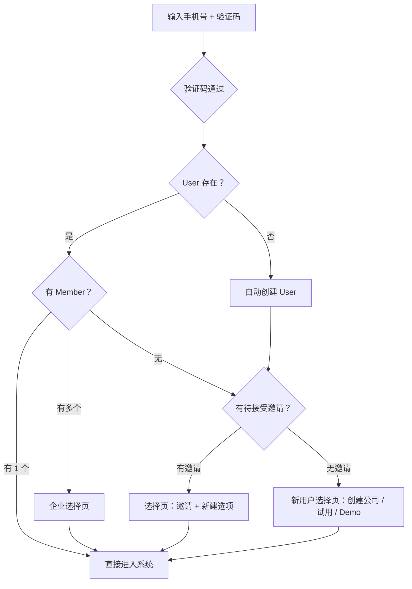
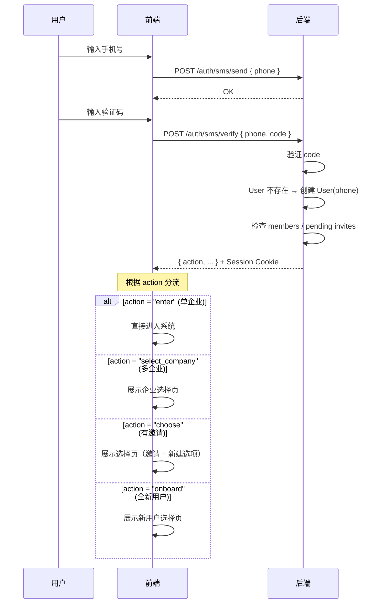
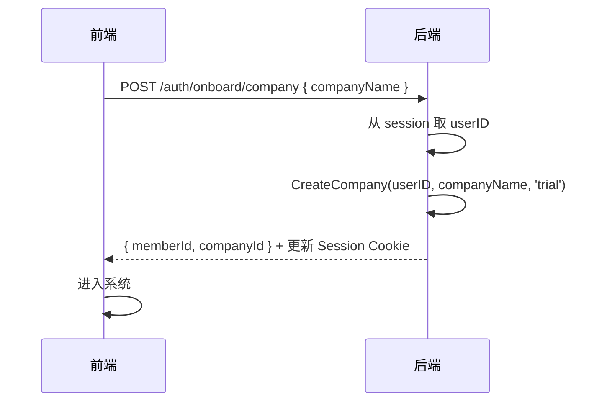
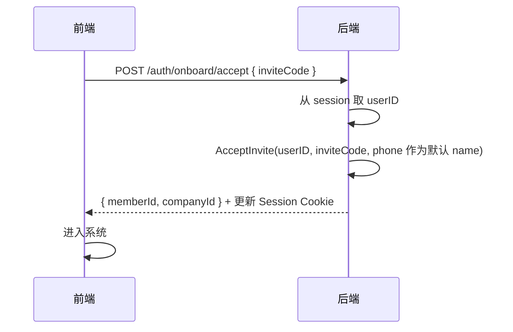
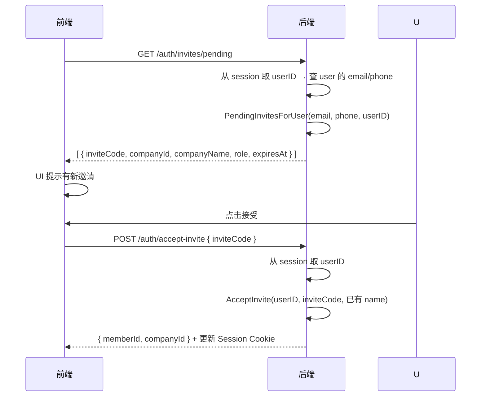
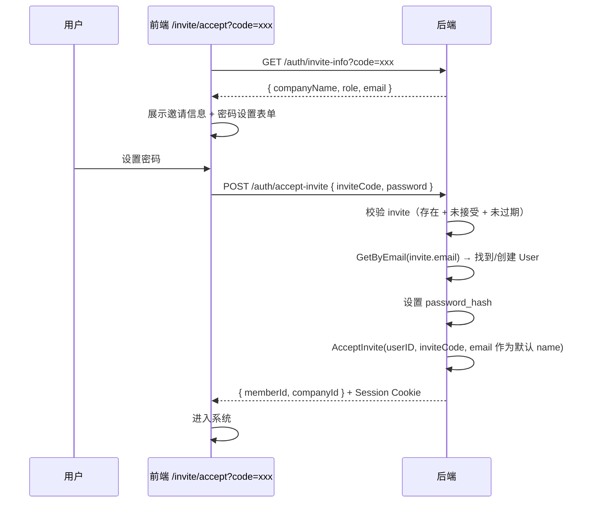
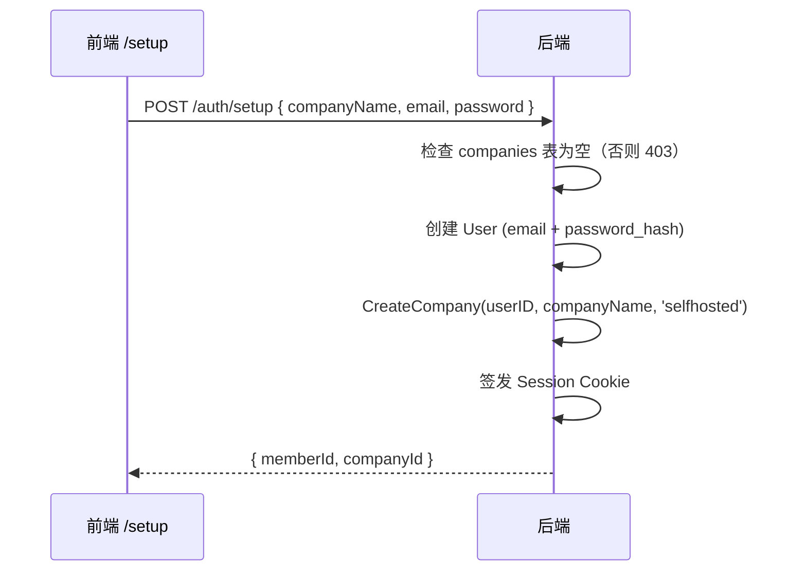
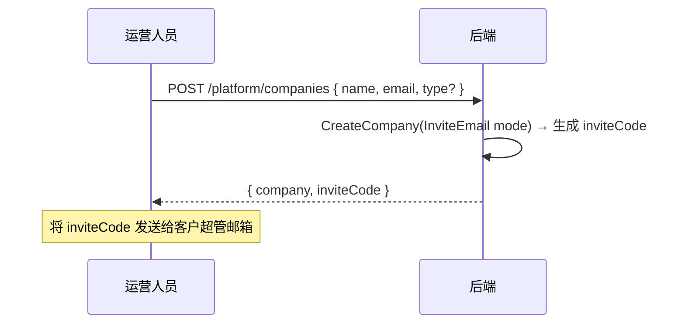

# 登录 / 注册 / 邀请 方案设计

> **目标**：TokenJoy 的完整认证入口——登录即注册，一个手机号入口按状态自动分流。  
> **市场**：中国，主认证方式为**手机号 + 短信验证码**。  
> **核心原则**：用户零决策——不区分登录和注册，验证码通过后系统按状态引导。

---

## 1. 用户模型

### 1.1 两层架构

| 实体 | 表 | 职责 | 唯一性 |
| --- | --- | --- | --- |
| **User** | `users` | 认证身份（全局唯一自然人） | phone 全局唯一、email 全局唯一 |
| **Member** | `members` | 企业内角色 | (user_id, company_id) 唯一 |

一个 User 可加入多家公司（多条 Member）。认证凭证（phone、email、password_hash）全部在 `users` 表。

### 1.2 Session JWT

```json
{
  "sub": "<memberID>",
  "company_id": "<companyID>",
  "user_id": "<userID>",
  "sid": "<sessionID>",
  "exp": 1710086400
}
```

签发后 Set-Cookie：`tokenjoy_session_member`，HttpOnly，24h 有效。

---

## 2. 核心流程：登录即注册

### 2.1 设计理念

**一个入口、一次验证、按状态分流**——用户只需输入手机号和验证码，系统根据账号状态自动引导：



### 2.2 用户旅程（按状态）

| 用户状态 | 验证码通过后行为 | 步骤数 |
| --- | --- | --- |
| 老用户（单企业） | 直接进入系统 | 2 步（手机号→验证码→进入） |
| 老用户（多企业） | 企业选择页 → 进入 | 3 步 |
| 新用户 + 有邀请 | 选择页（邀请列表 + 新建选项）→ 进入 | 3 步 |
| 全新用户 | 新用户选择页 → 进入 | 3 步 |

---

## 3. 登录页（唯一入口）

### 3.1 交互

```
┌────────────────────────────────────────┐
│            TokenJoy                    │
│                                        │
│  手机号: [+86 ___________]             │
│  验证码: [______]  [获取验证码]        │
│                                        │
│  [进入]                                │
│                                        │
│  ─────── 或 ───────                    │
│  [邮箱密码登录 →]                      │
└────────────────────────────────────────┘
```

- 不再区分"登录"和"注册"，只有一个"进入"按钮
- 邮箱密码作为辅助入口（折叠/次级展示），主要服务私有化场景
- SaaS 模式下默认只展示手机号验证码

### 3.2 验证码按钮状态

| 状态 | 按钮文案 | 可点击 |
| --- | --- | --- |
| 初始 | "获取验证码" | 是（手机号非空时） |
| 已发送 | "重新获取 (59s)" | 否 |
| 倒计时结束 | "重新获取" | 是 |
| 发送失败 | "重新获取" | 是（Toast 报错） |

### 3.3 验证码规则

| 配置 | 值 |
| --- | --- |
| 长度 | 6 位数字 |
| 有效期 | 5 分钟 |
| 发送间隔 | 60 秒 |
| 每日上限 | 10 次/手机号 |
| 验证尝试 | 最多 5 次，超过锁 15 分钟 |

---

## 4. 分流逻辑

### 4.1 API 时序



### 4.2 `POST /auth/sms/verify` 响应类型

```typescript
type SmsVerifyResult =
  | { action: "enter"; memberId: string; companyId: string }
  | { action: "select_company"; companies: CompanyOption[] }
  | { action: "choose"; invites: PendingInvite[] }
  | { action: "onboard" }

interface CompanyOption {
  memberId: string
  companyId: string
  companyName: string
  role: string
}

interface PendingInvite {
  inviteCode: string
  companyId: string
  companyName: string
  role: string
  expiresAt: string  // ISO 8601
}
```

### 4.3 分流判定规则

| User 状态 | Member 数 | 有邀请？ | action |
| --- | --- | --- | --- |
| 已有 User | 1 | — | `enter`（直接进入） |
| 已有 User | ≥2 | — | `select_company` |
| 已有 User | 0 | 是 | `choose` |
| 已有/新建 | 0 | 否 | `onboard` |

---

## 5. 新用户选择页（action = "onboard"）

全新用户（无 member、无邀请）验证码通过后看到此页面：

### 5.1 交互

```
┌──────────────────────────────────────────────────────┐
│                                                      │
│  欢迎使用 TokenJoy，选择如何开始：                    │
│                                                      │
│  ┌────────────────────────────────────────────┐      │
│  │ 🏢 创建公司                                 │      │
│  │    为您的团队创建一个全新的工作空间           │      │
│  │    公司名称: [____________]  [创建]          │      │
│  └────────────────────────────────────────────┘      │
│                                                      │
│  ┌────────────────────────────────────────────┐      │
│  │ 🎯 免费试用                        即将推出  │      │
│  │    使用预置数据体验完整功能                   │      │
│  └────────────────────────────────────────────┘      │
│                                                      │
│  ┌────────────────────────────────────────────┐      │
│  │ 👀 Demo 演示                       即将推出  │      │
│  │    只读模式浏览产品                          │      │
│  └────────────────────────────────────────────┘      │
│                                                      │
└──────────────────────────────────────────────────────┘
```

### 5.2 三种选项说明

| 选项 | 状态 | 行为 | Company type |
| --- | --- | --- | --- |
| **创建公司** | ✅ 可用 | 填写公司名 → 创建 Company + Member → 进入系统 | `trial` |
| **免费试用** | 🔲 Placeholder | 自动创建带预置数据的试用环境（暂不实现） | `trial_with_seed` |
| **Demo 演示** | 🔲 Placeholder | 进入只读 Demo 环境（暂不实现） | `demo` |

### 5.3 "创建公司"API



---

## 6. 有邀请的选择页（action = "choose"）

用户有 pending invite 但无 member 时展示：

```
┌──────────────────────────────────────────────────────┐
│                                                      │
│  选择如何继续：                                      │
│                                                      │
│  ── 接受已有邀请 ──────────────────                  │
│                                                      │
│  ┌────────────────────────────────────────────┐      │
│  │ 🏢 Acme Inc.  — 角色：普通成员              │      │
│  │ [接受邀请]                                  │      │
│  └────────────────────────────────────────────┘      │
│  ┌────────────────────────────────────────────┐      │
│  │ 🏢 Beta Corp. — 角色：超级管理员            │      │
│  │ [接受邀请]                                  │      │
│  └────────────────────────────────────────────┘      │
│                                                      │
│  ── 或创建新的 ──────────────────                    │
│                                                      │
│  [创建新公司 →]                                      │
│                                                      │
└──────────────────────────────────────────────────────┘
```

- 接受邀请：直接接受，姓名默认用手机号，后续在设置页补全
- "创建新公司"跳转到新用户选择页（§5）

### 6.1 接受邀请 API



---

## 7. 企业选择页（action = "select_company"）

老用户有多个企业时：

```
┌────────────────────────────────────────┐
│                                        │
│  选择企业                              │
│                                        │
│  ┌──────────────────────────────────┐  │
│  │  🏢 技术部有限公司                │  │
│  │     超级管理员 · 正式版           │  │
│  └──────────────────────────────────┘  │
│                                        │
│  ┌──────────────────────────────────┐  │
│  │  🏢 测试项目组                    │  │
│  │     普通成员 · 试用中             │  │
│  └──────────────────────────────────┘  │
│                                        │
└────────────────────────────────────────┘
```

点击即切换到对应企业，签发新 Session Cookie。

---

## 8. 已登录用户接受邀请

已登录用户（有 session）收到新邀请后，在平台内操作：



无需填写姓名——已有用户信息。

---

## 9. 邮件邀请激活（未登录）

管理员邀请 → 邮件发送链接 → 收件人点击：



`POST /auth/accept-invite` 自动判断路径：
- 有 session cookie → 从 session 取 userID（不需要 password）
- 无 session → 需要 password（≥8字符），用于创建/更新 User

---

## 10. 私有化 Setup

### 10.1 触发条件

`GET /auth/setup-status` → `{ needsSetup: true }` 当且仅当 companies 表为空。

### 10.2 流程



### 10.3 与 SaaS 对比

| 维度 | 私有化 Setup | SaaS |
| --- | --- | --- |
| 认证方式 | 邮箱 + 密码 | 手机号验证码 |
| Company type | `selfhosted` | `trial` |
| 调用次数 | 一次性 | 可多次 |
| 短信依赖 | 无 | 有 |
| Mode guard | `RequireLocal` | `RequireSaaS` |

---

## 11. 平台运营开户

运营人员通过管理后台为客户创建企业：



客户收到邮件 → 走 §9 邮件邀请激活流程。

---

## 12. API 完整索引

### 12.1 已实现

| 方法 | 路径 | 认证 | Mode | 说明 |
| --- | --- | --- | --- | --- |
| POST | `/auth/login` | 无 | 两者 | 邮箱密码登录 |
| POST | `/auth/logout` | session | 两者 | 清除 cookie |
| POST | `/auth/accept-invite` | session 或 password | 两者 | 邀请激活（双路径） |
| GET | `/auth/invites/pending` | session | 两者 | 当前用户的待接受邀请 |
| POST | `/auth/register/init` | SMS token | SaaS | 旧注册入口（待迁移） |
| POST | `/auth/register/accept` | registerSession | SaaS | 旧：接受邀请（待迁移） |
| POST | `/auth/register/company` | registerSession | SaaS | 旧：创建新公司（待迁移） |
| POST | `/platform/companies` | platform session | SaaS | 平台开户 |

### 12.2 待实现（新方案）

| 方法 | 路径 | 认证 | 说明 |
| --- | --- | --- | --- |
| POST | `/auth/sms/send` | 无 | 发送短信验证码 |
| POST | `/auth/sms/verify` | 无 | 验证码校验 → 分流（核心入口） |
| POST | `/auth/sms/select` | session | 多企业选择 |
| POST | `/auth/onboard/company` | session | 新用户创建公司 |
| POST | `/auth/onboard/accept` | session | 新用户接受邀请 |
| GET | `/auth/setup-status` | 无 | 私有化是否需要初始化 |
| POST | `/auth/setup` | 无 | 私有化首次初始化 |

### 12.3 迁移计划

旧 `register/*` 三端点保留至前端迁移完成后废弃。新方案中：
- `register/init` → 由 `sms/verify` 替代（分流逻辑内置）
- `register/accept` → 由 `onboard/accept` 替代
- `register/company` → 由 `onboard/company` 替代

---

## 13. Session 机制

| 名称 | 载体 | 有效期 | 用途 |
| --- | --- | --- | --- |
| Member Session | Cookie `tokenjoy_session_member` | 24h | 正式登录态（含 memberId） |
| User Session | Cookie `tokenjoy_session_user` | 10min | 验证码通过但未选择企业时（含 userID） |
| Platform Session | Cookie `tokenjoy_platform_session` | 24h | 运营管理后台 |

`sms/verify` 成功后：
- 有单一 member → 直接签发 Member Session
- 其他情况 → 签发 User Session → onboard/select 后升级为 Member Session

---

## 14. 部署模式守卫

| Middleware | 效果 | 应用范围 |
| --- | --- | --- |
| `RequireSaaS` | 非 SaaS 模式返回 404 | `sms/*`、`onboard/*` 路由组 |
| `RequireLocal` | SaaS 模式返回 404 | `setup`、`setup-status` |

对攻击者隐藏不支持的端点入口（返回 404 而非 403）。

---

## 15. 错误态

| 场景 | 后端返回 | 前端表现 |
| --- | --- | --- |
| 手机号格式错误 | 400 | 表单行内校验 |
| 验证码发送过于频繁 | 429 | Toast："请 60 秒后重试" |
| 验证码错误 | 400 | Toast："验证码错误，请重新输入" |
| 验证码过期 | 400 | Toast："验证码已过期，请重新获取" |
| 验证次数超限（锁定） | 429 | Toast："验证次数过多，15 分钟后再试" |
| User Session 过期（10min） | 401 | Toast："操作超时" → 返回登录页 |
| 邀请码已被接受 | 400 | 选择页中该邀请标灰 + 提示"已被接受" |
| 邀请码已过期 | 400 | 选择页中该邀请标灰 + 提示"已过期" |
| 公司名为空 | 400 | 表单行内校验 |

---

## 16. 数据模型

### 16.1 `company_invites` 表

```sql
CREATE TABLE company_invites (
    id           UUID PRIMARY KEY,
    company_id   UUID NOT NULL REFERENCES companies(id),
    email        TEXT,
    phone        TEXT,
    user_id      UUID,
    role         TEXT NOT NULL DEFAULT 'super_admin',
    invite_code  TEXT NOT NULL UNIQUE,
    expires_at   TIMESTAMPTZ NOT NULL,
    accepted_at  TIMESTAMPTZ,
    created_at   TIMESTAMPTZ NOT NULL DEFAULT NOW()
);

CREATE INDEX idx_company_invites_email_pending ON company_invites(email)
    WHERE accepted_at IS NULL AND email IS NOT NULL AND email != '';
CREATE INDEX idx_company_invites_phone_pending ON company_invites(phone)
    WHERE accepted_at IS NULL AND phone IS NOT NULL AND phone != '';
CREATE INDEX idx_company_invites_user_pending ON company_invites(user_id)
    WHERE accepted_at IS NULL AND user_id IS NOT NULL;
```

### 16.2 SMS 验证码（待实现）

```sql
CREATE TABLE sms_codes (
    id          UUID PRIMARY KEY,
    phone       TEXT NOT NULL,
    code        TEXT NOT NULL,
    expires_at  TIMESTAMPTZ NOT NULL,
    verified_at TIMESTAMPTZ,
    attempts    INT NOT NULL DEFAULT 0,
    created_at  TIMESTAMPTZ NOT NULL DEFAULT NOW()
);
```

---

## 17. 安全设计

| 风险 | 缓解措施 |
| --- | --- |
| 短信被刷 | 60s 间隔 + 10 次/天/号 + IP 限流 |
| 验证码暴力破解 | 5 次错误锁 15 分钟 |
| `/setup` 被外部访问 | companies 非空时 403 + `RequireLocal` |
| 批量注册 | `RequireSaaS` + 限流 |
| 邀请链接泄露 | invite 7 天过期 + 一次性（accepted_at 标记） |
| 多企业越权 | JWT 绑定 company_id + member_id |

---

## 18. 前端路由

| 路由 | 页面 | 条件 |
| --- | --- | --- |
| `/login` | 统一入口（手机号验证码） | 默认 |
| `/login/select` | 企业选择页 | 多企业时 |
| `/onboard` | 新用户选择页 | 全新用户 / 有邀请 |
| `/setup` | 私有化初始化 | `needsSetup=true` |
| `/invite/accept` | 邮件邀请激活 | `?code=xxx` |

### 登录页条件渲染

| 条件 | 展示 |
| --- | --- |
| SaaS 模式 | 手机号验证码（主）+ 邮箱密码（辅助链接） |
| 私有化 + 未初始化 | 跳转 `/setup` |
| 私有化 + 已初始化 | 邮箱密码登录 |

---

## 19. 配置

| 变量 | 默认值 | 层 | 说明 |
| --- | --- | --- | --- |
| `SUPPORT_SAAS` | `false` | 后端 | SaaS 模式开关 |
| `SESSION_SECRET` | — | 后端 | JWT 签名 |
| `SESSION_TTL_SEC` | `86400` | 后端 | Member Session 过期秒数 |
| `TRIAL_MEMBER_LIMIT` | `50` | 后端 | 试用成员上限 |
| `TRIAL_CREDIT_AMOUNT` | `10000` | 后端 | 试用初始资金 |
| `ALIYUN_SMS_*` | — | 后端 | 阿里云短信配置 |
| `VITE_SUPPORT_SAAS` | — | 前端 | 控制登录页 UI 模式 |

> 移除了 `REGISTRATION_ENABLED` 开关——SaaS 模式下注册（通过验证码自动触发）不再需要单独控制。如需暂停新用户注册，关闭 SMS 发送即可。

---

## 20. 实施状态

### ✅ 已完成（可复用）

- [x] `company.Service` 双模式 `CreateCompany`
- [x] `AcceptInvite` 核心逻辑
- [x] `PendingInvitesForUser` 多标识匹配
- [x] `POST /auth/accept-invite` 双路径
- [x] `GET /auth/invites/pending`
- [x] `POST /platform/companies` InviteEmail 模式
- [x] `RequireSaaS` / `RequireLocal` middleware
- [x] `company_invites` 表 + 索引
- [x] `HasAnyMember`、`GetByIDs` store 方法

### 🔲 待实现

- [ ] `infra/sms/` — 阿里云 SMS 适配 + Redis 验证码存储
- [ ] `POST /auth/sms/send` + `/sms/verify` + `/sms/select`
- [ ] `POST /auth/onboard/company` + `/onboard/accept`
- [ ] `POST /auth/setup` + `GET /auth/setup-status`
- [ ] Trial 资金灌入（onboard/company 后自动执行）
- [ ] 前端 `/login` 统一入口页
- [ ] 前端 `/onboard` 新用户选择页（含 placeholder）
- [ ] 前端 `/login/select` 企业选择页
- [ ] 旧 `register/*` 端点废弃迁移

---

## 21. 设计决策记录

| 决策 | 理由 |
| --- | --- |
| 合并登录注册为同一入口 | 中国市场标准做法（飞书/钉钉模式），用户零决策 |
| 验证码通过后按状态分流 | 减少用户操作步骤，系统自动判断 |
| 新用户选择页三选项 | 创建公司（当前可用）+ 试用/Demo（未来扩展点） |
| 接受邀请不再必填姓名 | 降低操作门槛，默认用手机号，后续补全 |
| 移除 REGISTRATION_ENABLED | SaaS 下无需单独控制注册，关 SMS 即关注册 |
| User Session 替代 registerSession | 语义更清晰：已确认身份但未选择企业 |
| 邮箱密码仅作辅助 | SaaS 下手机号为主，减少认证路径复杂度 |
