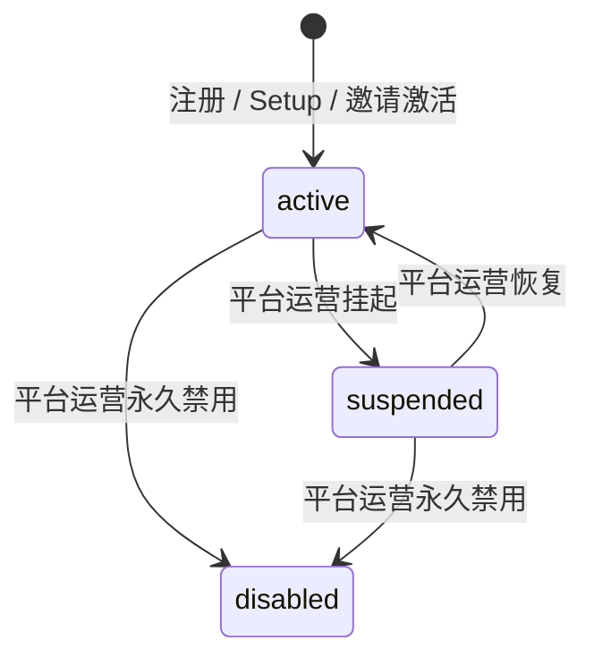
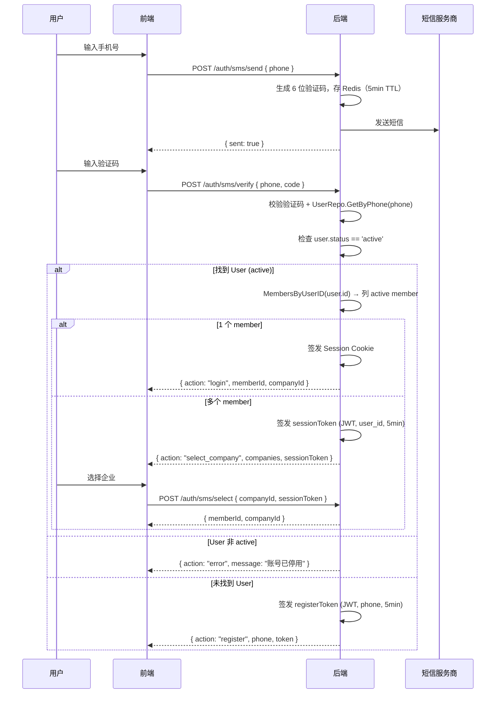
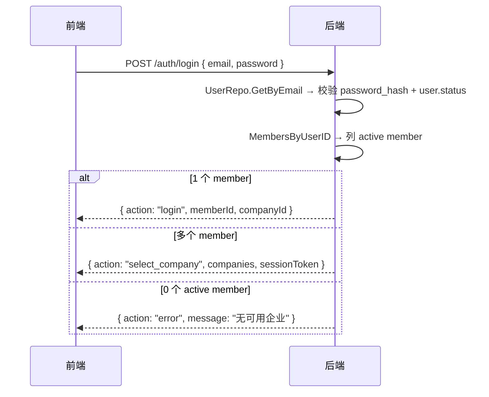
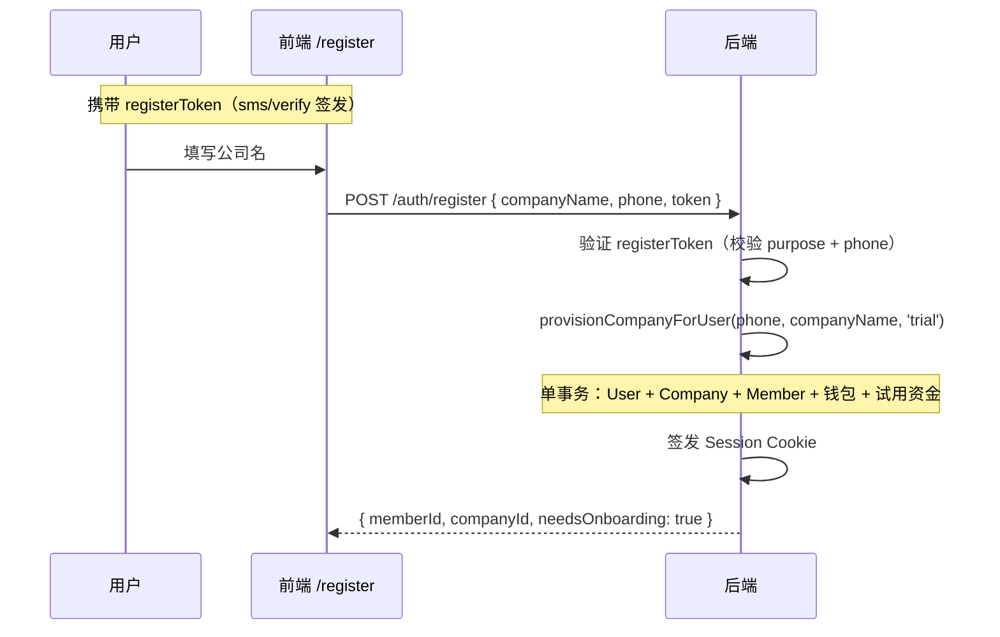
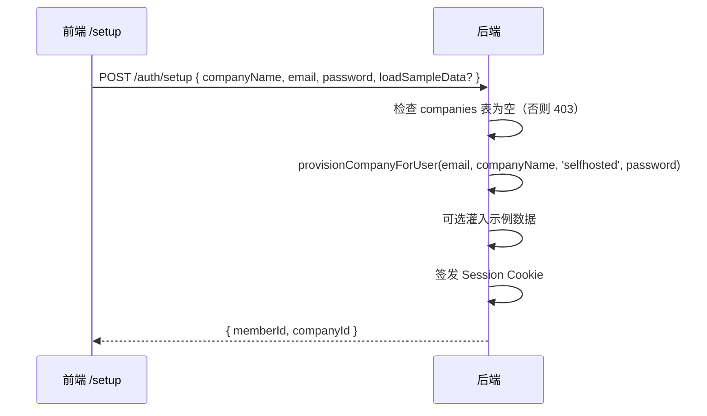

# 登录 / 注册 / Trial 实施方案

> **目标**：为 TokenJoy 提供完整的认证入口——公司注册（SaaS 公开试用）、私有化 Setup、成员导入与密码配置——覆盖私有化与 SaaS 两种部署形态。  
> **市场**：中国，主认证方式为**手机号 + 短信验证码**。

---

## 1. 认证模型：User / Member 两层架构

### 1.1 核心概念

| 实体 | 表 | 职责 | 唯一性 |
| --- | --- | --- | --- |
| **User** | `users` | 认证身份（全局唯一自然人） | phone 全局唯一、email 全局唯一 |
| **Member** | `members` | 组织内角色（每企业一个身份） | (user_id, company_id) 唯一 |

### 1.2 关系

```
┌──────────────┐         ┌──────────────────────────┐
│    users     │         │        members           │
│──────────────│         │──────────────────────────│
│ id (UUID v7) │◄────────│ user_id (UUID, 逻辑引用)  │
│ phone        │   1:N   │ company_id (UUID, FK)     │
│ email        │         │ id (UUID v7)              │
│ password_hash│         │ name                      │
│ status       │         │ department_id             │
└──────────────┘         │ status                    │
                         │ roles (via member_roles)  │
                         └──────────────────────────┘
```

- 一个 User 可以有多个 Member（同一人加入多家公司）
- `members.user_id` 是逻辑引用，无 FK 约束
- 认证凭证（phone、email、password）全部在 `users` 表

### 1.3 JWT Claims（已实现）

```go
type Claims struct {
    CompanyID uuid.UUID `json:"company_id"`
    UserID    uuid.UUID `json:"user_id,omitempty"`
    Sid       string    `json:"sid"`
    jwt.RegisteredClaims  // Subject = memberID.String()
}
```

签发方法：`sessiontoken.Issuer.IssueWithUser(companyID, memberID, userID)`

### 1.4 认证查询路径

**现有邮箱密码登录**（`credentials.AuthenticateMember`）：
```
members JOIN users ON user_id WHERE company_id = X AND users.email = Y → 校验 password_hash
```
注意：现有实现需要 companyID，因为 `MemberByEmail` 在 members 表 scope 内联查 users。

**新增手机号登录**（需实现）：
```
users.phone → user → members WHERE user_id = user.id → 列出所有 active member
```

### 1.5 User 状态与认证拦截

| user.status | 含义 | 认证行为 |
| --- | --- | --- |
| `active` | 正常 | 允许登录 |
| `suspended` | 平台运营挂起 | 拒绝登录 |
| `disabled` | 永久禁用 | 拒绝登录 |



**拦截点**：所有认证流程在确认 user 存在后必须校验 `user.status == 'active'`。

**权限边界**：
- `user.status` 仅平台运营可修改（`/platform` API）
- `member.status` 仅企业管理员可修改（`/org` API）
- 认证时两者都需为 active 才放行

---

## 2. 手机号 + 验证码登录

### 2.1 流程



### 2.2 验证码规则

| 配置 | 值 |
| --- | --- |
| 长度 | 6 位数字 |
| 有效期 | 5 分钟（Redis TTL） |
| 发送间隔 | 60 秒 |
| 每日上限 | 10 次/手机号 |
| 验证尝试 | 最多 5 次，超过锁 15 分钟 |

### 2.3 临时 Token 机制

| Token | 用途 | Claims | 有效期 | 一次性 |
| --- | --- | --- | --- | --- |
| `sessionToken` | 多企业选择 | `{ user_id, purpose: "select" }` | 5 分钟 | 否 |
| `registerToken` | 新用户注册 | `{ phone, purpose: "register" }` | 5 分钟 | 是（自然幂等：User 创建后 phone 唯一索引阻止重放） |

均为 JWT，复用 `SESSION_SECRET` 签名，`purpose` 字段防跨用途伪造。

### 2.4 邮箱密码登录改造

现有 `/auth/login` 需改为与手机号登录一致的多企业逻辑：



**分阶段实施**：
- Phase 1：保持现有 `/auth/login`（需 companyId）不动，仅新增 SMS 路由
- Phase 2：新增 `POST /auth/login/v2`（无需 companyId），旧接口标 deprecated
- 私有化模式永远单企业，不进入选择分支

---

## 3. SaaS 注册（`/register`）

### 3.1 流程



### 3.2 注册表单

```
┌────────────────────────────────────────┐
│         创建您的企业空间               │
│                                        │
│  手机号: 138****1234 ✓ (已验证，只读)  │
│  公司名称: [________________]          │
│                                        │
│  [创建企业]                            │
│                                        │
│  已有企业？[返回登录 →]                │
└────────────────────────────────────────┘
```

---

## 4. 私有化 Setup（`/setup`）

### 4.1 触发条件

`GET /auth/setup-status` → `{ needsSetup: true }` 当且仅当 companies 表为空。

### 4.2 流程



### 4.3 `provisionCompanyForUser` — 核心内部函数

注册和 Setup 都调用同一个内部函数，**不走 invite 流程**：

```go
// domain/company/provision.go
type ProvisionRequest struct {
    Phone        string    // 手机号注册时有值
    Email        string    // Setup / 邮箱注册时有值
    Password     string    // Setup 时有值；手机号注册时为空
    CompanyName  string
    CompanyType  string    // "trial" | "selfhosted"
    AdminName    string    // 可选，默认取 phone/email
}

type ProvisionResult struct {
    User     store.User
    Company  store.Company
    Member   types.Member
}

func (s *service) ProvisionCompanyForUser(ctx context.Context, req ProvisionRequest) (ProvisionResult, error) {
    // 单事务内完成：
    // 1. 创建 User (phone/email/password_hash)
    // 2. 创建 Company (复用 CreateCompany 的子步骤：钱包、角色、org tree)
    // 3. 直接创建 Member (user_id, 超管角色) — 跳过 invite
    // 4. Trial 时灌入 TRIAL_CREDIT_AMOUNT
}
```

**为什么不复用 CreateCompany + AcceptInvite**：
- `CreateCompany` 生成 invite 码 → `AcceptInvite` 用 email 查 user → 注册场景 user 只有 phone 无 email → 查找路径不匹配
- `AcceptInvite` 强制要求 password（≥8 字符）→ 手机号注册不需要密码
- `AcceptInvite` 会覆写 password_hash → 注册时产生一个用户不知道的随机密码

**复用策略**：`provisionCompanyForUser` 内部复用 CreateCompany 的**子步骤**（钱包开通、预设角色、org tree 初始化），但跳过 invite 创建，直接在事务中创建 Member。

### 4.4 与现有 AcceptInvite 的关系

| 场景 | 调用路径 | 说明 |
| --- | --- | --- |
| 平台运营开户 | `CreateCompany` → 生成 invite | 保持不变 |
| 邮件邀请激活 | `AcceptInvite(code, name, password)` | 保持不变 |
| SaaS 手机号注册 | `ProvisionCompanyForUser(phone)` | **新增** |
| 私有化 Setup | `ProvisionCompanyForUser(email, password)` | **新增** |

### 4.5 与 SaaS 注册对比

| 维度 | `/auth/setup` | `/auth/register` |
| --- | --- | --- |
| 部署形态 | 私有化 | SaaS |
| 认证方式 | 邮箱 + 密码 | 手机号验证码 |
| Company type | `selfhosted` | `trial` |
| 调用次数 | 一次性 | 可多次 |
| 短信依赖 | 无 | 有 |
| password_hash | bcrypt(用户输入) | 空（手机号即认证） |

---

## 5. 成员入驻

### 5.1 导入时的 User/Member 创建

```
对于每个导入行:
  1. 查 users WHERE phone = row.phone（优先）
  2. 若未命中 → 查 users WHERE email = row.email
  3. 若均未命中 → 创建 User (phone, email, password_hash=空)
  4. 检查 members WHERE user_id AND company_id
     - 已存在 → 跳过
     - 不存在 → 创建 Member
```

**冲突处理**：

| 场景 | 处理 |
| --- | --- |
| phone 和 email 匹配到不同 user | 以 phone 优先 |
| 无 phone 也无 email | 报错跳过 |
| user 已在本企业有 member | 跳过 |
| user.status 为 suspended | 正常创建 member（组织结构先建好） |

### 5.2 邀请激活（已实现）

`POST /auth/accept-invite` 现有逻辑：
1. 查 `users WHERE email = invite.email`
2. 若无 → 创建 User (email + password_hash)
3. 若有 → 更新 password_hash
4. 创建 Member → 签发 JWT

### 5.3 密码配置

| 方式 | 实现 |
| --- | --- |
| 发送短信邀请 | 成员打开后手机号自动认证 |
| 发送邮件邀请 | `/invite/accept?code=xxx` |
| 统一初始密码 | `POST /org/members/batch-set-password`（更新 `users.password_hash`） |

---

## 6. Trial 试用

所有新注册企业默认 `type='trial'`。

| 维度 | Trial | Standard |
| --- | --- | --- |
| LLM 调用 | Mock LLM | 真实供应商 |
| 功能限制 | 充值禁用、成员上限 `TRIAL_MEMBER_LIMIT`(50) | 全功能 |
| 初始资金 | `TRIAL_CREDIT_AMOUNT`(10000 points) | 充值 |
| 升级路径 | 原地改 type='standard'，数据保留 | — |

---

## 7. 后端 API

### 7.1 新增路由

| 方法 | 路径 | Body | 说明 |
| --- | --- | --- | --- |
| POST | `/auth/sms/send` | `{ phone }` | 发送验证码 |
| POST | `/auth/sms/verify` | `{ phone, code }` | 验证 → login/select/register/error |
| POST | `/auth/sms/select` | `{ companyId, sessionToken }` | 多企业选择 |
| POST | `/auth/register` | `{ companyName, phone, token }` | SaaS 注册 |
| GET | `/auth/setup-status` | — | `{ needsSetup }` |
| POST | `/auth/setup` | `{ companyName, email, password, loadSampleData? }` | 私有化初始化 |
| GET | `/auth/invite-info?code=xxx` | — | 邀请详情 |

### 7.2 响应类型

```typescript
type AuthResult =
  | { action: "login"; memberId: string; companyId: string }
  | { action: "select_company"; companies: CompanyBrief[]; sessionToken: string }
  | { action: "register"; phone: string; token: string }
  | { action: "error"; message: string }

interface CompanyBrief { id: string; name: string; type: CompanyType }
```

### 7.3 路由注册位置

新增路由全部放在 `/api` 路由组内（与现有 `/auth/login` 同级），无需绕过任何 middleware —— `CompanyResolve` 在无 JWT 时已自动放行，`RequireSession` 仅在需要鉴权的 handler 上挂载。

**需更新现有配置**：`RateLimitLoginPaths` 列表需加入新路由：

```go
[]string{
    "/api/auth/login",
    "/api/auth/accept-invite",
    "/api/auth/sms/send",      // 新增
    "/api/auth/sms/verify",    // 新增
    "/api/auth/register",      // 新增
    "/api/auth/setup",         // 新增
    "/api/platform/auth/login",
}
```

### 7.4 新增 Store 方法

```go
// UserRepository 新增（User 维度天然跨 company，放这里符合现有设计）
MembersByUserID(ctx context.Context, userID uuid.UUID) ([]types.Member, error)
```

**为什么不放 OrgRepository**：现有 OrgRepo 所有方法都通过 company context 隐式限定在单个 company 内。`MembersByUserID` 是跨 company 的全局查询，放在 UserRepo 更符合其「全局身份」的语义。

现有 `UserRepo.GetByPhone` / `UserRepo.GetByEmail` 已满足验证码登录的 user 查找需求。

---

## 8. 前端

### 8.1 类型修正

UUID 迁移后前端 `companyId` 应为 `string`：

```typescript
// api/types/common.ts
export interface SessionContext {
  companyId: string      // UUID string
  companyType: CompanyType
  // ...
}

// features/session/types.ts
export interface AppSession {
  companyId: string      // UUID string
  // ...
}
```

### 8.2 新增路由

| 路由 | 页面 | 条件 |
| --- | --- | --- |
| `/register` | SaaS 企业注册 | `VITE_SUPPORT_SAAS=true` |
| `/setup` | 私有化首次安装 | `needsSetup=true` |
| `/invite/accept` | 邀请激活 | `?code=xxx` |

### 8.3 `/login` 页改造

| 条件 | 显示 |
| --- | --- |
| SaaS + REGISTRATION_ENABLED | 手机号登录/注册 + "免费试用" + 邮箱备用 |
| SaaS + !REGISTRATION_ENABLED | 手机号登录 + 邮箱备用 |
| 私有化 + needsSetup | 邮箱密码 + Setup 链接 |
| 私有化 + !needsSetup | 邮箱密码 |

### 8.4 文件结构

```
features/auth/
├── index.ts
├── hooks/
│   ├── use-login-page.ts         — 现有
│   ├── use-sms-login.ts          — 手机号验证码逻辑
│   └── use-register-page.ts      — 注册页逻辑
├── components/
│   ├── login-form.tsx            — 现有
│   ├── sms-login-form.tsx        — 手机号表单
│   ├── company-select-dialog.tsx — 多企业选择
│   └── register-form.tsx         — 注册表单
└── lib/
    └── sms-timer.ts              — 60s 倒计时

api/auth.ts                        — sms/send, sms/verify, register 等
```

---

## 9. 数据库变更

### 9.1 已有（无需修改）

- `users` 表：id UUID, phone, email, password_hash, status
- `members` 表：(company_id, id) PK, user_id UUID, UNIQUE(user_id, company_id)
- `idx_users_phone`、`idx_users_email` 唯一索引
- `idx_members_user` 索引

### 9.2 新增

```sql
CREATE TABLE IF NOT EXISTS sms_codes (
    id          UUID PRIMARY KEY,
    phone       TEXT NOT NULL,
    code        TEXT NOT NULL,
    purpose     TEXT NOT NULL DEFAULT 'login',
    expires_at  TIMESTAMPTZ NOT NULL,
    verified_at TIMESTAMPTZ,
    attempts    INT NOT NULL DEFAULT 0,
    created_at  TIMESTAMPTZ NOT NULL DEFAULT NOW()
);
CREATE INDEX IF NOT EXISTS idx_sms_codes_phone ON sms_codes(phone, created_at DESC);

ALTER TABLE companies ADD COLUMN IF NOT EXISTS onboarding_status TEXT NOT NULL DEFAULT 'pending';
```

---

## 10. 配置

### 10.1 已有

| 变量 | 默认值 | 说明 |
| --- | --- | --- |
| `SUPPORT_SAAS` | `false` | SaaS 多租户模式 |
| `REGISTRATION_ENABLED` | `true` | 允许公开注册 |
| `TRIAL_MEMBER_LIMIT` | `50` | 试用成员上限 |
| `TRIAL_CREDIT_AMOUNT` | `10000` | 试用初始资金（points） |
| `SESSION_SECRET` | — | JWT 签名密钥 |
| `SESSION_TTL_SEC` | `86400` | Session JWT 过期时间 |

### 10.2 新增

| 变量 | 默认值 | 说明 |
| --- | --- | --- |
| `SMS_PROVIDER` | — | `aliyun` / `tencent` |
| `SMS_ACCESS_KEY` | — | 短信服务凭证 |
| `SMS_ACCESS_SECRET` | — | |
| `SMS_SIGN_NAME` | — | 短信签名 |
| `SMS_TEMPLATE_CODE` | — | 验证码模板 ID |
| `APP_URL` | — | 邮件/短信链接基地址 |

前端：`VITE_SUPPORT_SAAS`（控制登录页 UI 模式）

---

## 11. 安全

| 风险 | 缓解 |
| --- | --- |
| 短信被刷 | 60s 间隔 + 10 次/天/号 + IP 限流 |
| 验证码暴力破解 | 5 次错误锁 15 分钟 |
| `/setup` 被外部访问 | companies 非空时 403 |
| `/register` 批量注册 | `REGISTRATION_ENABLED` 开关 + IP 限流 |
| Trial 滥用 | 手机号实名 + 成员上限 + Mock LLM |
| 临时 token 重放 | phone 唯一索引天然幂等；sessionToken 含 user_id 校验 |
| 多企业越权 | JWT 绑定 company_id + member_id |

---

## 12. 实施步骤

### Phase 1 — 短信登录 + Setup + 注册

1. `infra/sms/` — 阿里云 SMS 适配 + Redis 验证码存储
2. `UserRepo.MembersByUserID()` — 跨 company 全局查询（SQL: `SELECT ... FROM members WHERE user_id = $1`）
3. `domain/company/provision.go` — `ProvisionCompanyForUser` 内部函数
4. `POST /auth/sms/send` + `POST /auth/sms/verify` + `POST /auth/sms/select`
5. `POST /auth/setup` — 调用 ProvisionCompanyForUser(email, password, 'selfhosted')
6. `POST /auth/register` — 调用 ProvisionCompanyForUser(phone, 'trial')
7. 更新 `RateLimitLoginPaths` 列表（加入新路由）
8. 前端 `/login` 改造 + `/setup` + `/register` 页面
9. 前端 `companyId: number` → `string` 全量修正
   - 影响范围：`api/types/common.ts`、`api/types/org.ts`、`features/session/types.ts`、所有 `session.companyId === 0` 判断
   - 方法：先改类型定义，跑 `tsc --noEmit` 收集所有报错逐一修正

### Phase 2 — 邮箱登录改造 + Onboarding

10. `POST /auth/login/v2`（无需 companyId）→ 复用 UserRepo.GetByEmail + MembersByUserID
11. `companies.onboarding_status` + `GET /session` 携带
12. Onboarding Workflow（飞书 / CSV / 手动导入）
13. `/invite/accept` 前端页面

### Phase 3 — 增强

14. 邀请真实投递（短信/邮件）
15. 忘记密码 / 重置密码
16. 注册图形验证码
17. 多企业切换 UI
