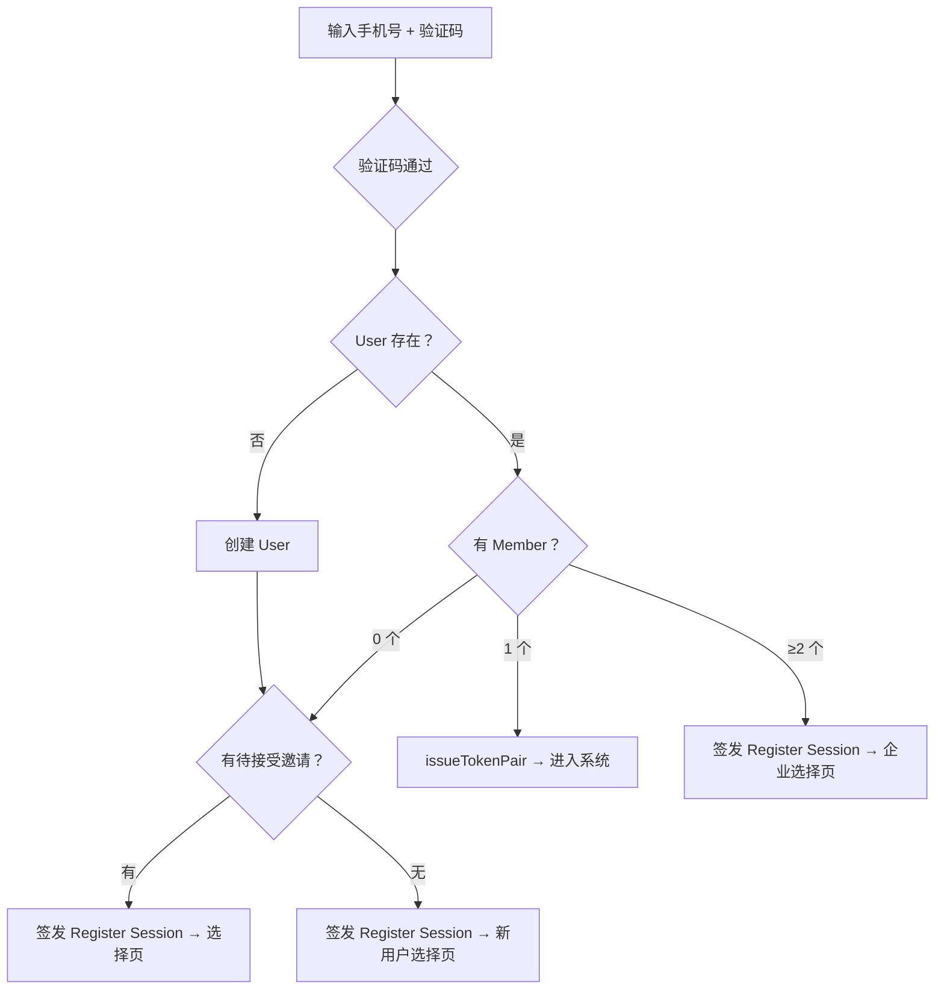
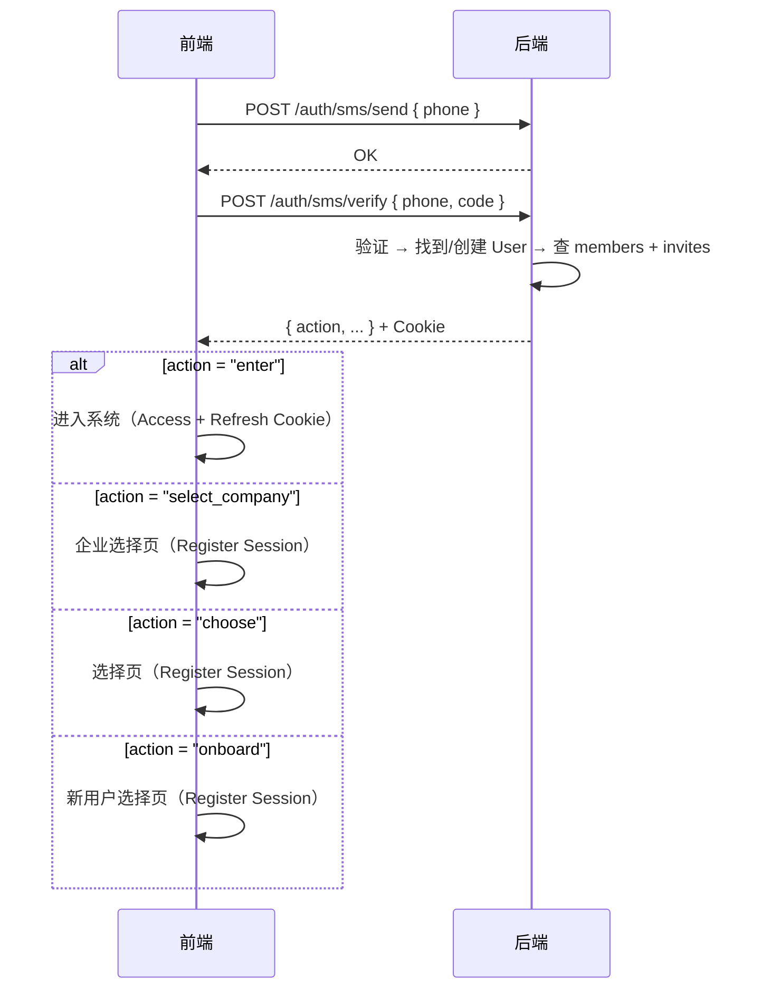

# 登录 / 注册 / 邀请 方案设计

> **目标**：TokenJoy 完整认证入口——登录即注册，一个手机号入口按状态自动分流。  
> **市场**：中国，主认证方式为**手机号 + 短信验证码**。  
> **核心原则**：用户零决策——不区分登录和注册，验证码通过后系统按状态引导。  
> **认证架构**：Access Token (15min JWT) + Refresh Token (7天, DB-backed)，详见 `docs/auth-system.md`。

---

## 1. 认证架构概要

基于 `docs/auth-system.md` 的双 Token 机制：

| Token | 载体 | 有效期 | 存储 |
| --- | --- | --- | --- |
| Access Token | Cookie `tokenjoy_session_member`，SameSite=Lax | 15 min | 无状态 JWT |
| Refresh Token | Cookie `tokenjoy_refresh`，Path=/api/auth/refresh，SameSite=Strict | 7 天 | DB `sessions` 表（SHA-256 hash） |

JWT Claims：`{ "sub": "<memberID>", "company_id", "user_id", "sid", "exp" }`

所有登录成功均调用 `issueTokenPair`：写入 sessions 表 + 签发双 Cookie。  
前端 401 处理：自动 refresh → 成功重试 → 失败跳登录页。

---

## 2. 用户模型

| 实体 | 表 | 职责 | 唯一性 |
| --- | --- | --- | --- |
| **User** | `users` | 认证身份 | phone 全局唯一、email 全局唯一 |
| **Member** | `members` | 企业内角色 | (user_id, company_id) 唯一 |

一个 User 可加入多家公司。认证凭证（phone、email、password_hash）在 `users` 表。

---

## 3. 核心流程：登录即注册



**规则**：只有目标 member 明确（单企业）才签发 Member Session。其余场景一律签发 Register Session（仅含 userID，10min），选择完毕后再升级。

| 用户状态 | 行为 | 步骤 |
| --- | --- | --- |
| 老用户（单企业） | 直接进入 | 2 步 |
| 老用户（多企业） | 企业选择页 → 进入 | 3 步 |
| 新用户 + 有邀请 | 选择页 → 进入 | 3 步 |
| 全新用户 | 新用户选择页 → 进入 | 3 步 |

---

## 4. 登录页

```
┌────────────────────────────────────────┐
│            TokenJoy                    │
│                                        │
│  手机号: [+86 ___________]             │
│  验证码: [______]  [获取验证码]        │
│                                        │
│  [进入]                                │
│                                        │
│  ─────── 或 ───────                    │
│  [邮箱密码登录 →]                      │
└────────────────────────────────────────┘
```

- 不区分"登录"和"注册"
- 邮箱密码为辅助入口（私有化主入口 / SaaS 次级链接）

### 验证码规则

| 项 | 值 |
| --- | --- |
| 长度 | 6 位数字 |
| 有效期 | 5 分钟 |
| 发送间隔 | 60 秒 |
| 每日上限 | 10 次/手机号 |
| 验证尝试 | 5 次后锁 15 分钟 |

---

## 5. 分流逻辑

### API 时序



### `POST /auth/sms/verify` 响应

```typescript
type SmsVerifyResult =
  | { action: "enter"; memberId: string; companyId: string }
  | { action: "select_company"; companies: CompanyOption[] }
  | { action: "choose"; invites: PendingInvite[] }
  | { action: "onboard" }

interface CompanyOption {
  companyId: string
  companyName: string
  role: string
}

interface PendingInvite {
  inviteCode: string
  companyId: string
  companyName: string
  role: string
  expiresAt: string
}
```

### 分流规则

| Member 数 | 有邀请？ | action | Cookie |
| --- | --- | --- | --- |
| 1 | — | `enter` | issueTokenPair |
| ≥2 | — | `select_company` | Register Session |
| 0 | 是 | `choose` | Register Session |
| 0 | 否 | `onboard` | Register Session |

> 有 member 且有新邀请的用户：直接 `enter` 不阻断登录，进入系统后通过 `GET /auth/invites/pending` + UI 通知提示未接受邀请。

---

## 6. 新用户选择页（onboard）

```
┌──────────────────────────────────────────────────────┐
│  欢迎使用 TokenJoy，选择如何开始：                    │
│                                                      │
│  ┌────────────────────────────────────────────┐      │
│  │ 🏢 创建公司                                 │      │
│  │    公司名称: [____________]  [创建]          │      │
│  └────────────────────────────────────────────┘      │
│  ┌────────────────────────────────────────────┐      │
│  │ 🎯 免费试用                        即将推出  │      │
│  └────────────────────────────────────────────┘      │
│  ┌────────────────────────────────────────────┐      │
│  │ 👀 Demo 演示                       即将推出  │      │
│  └────────────────────────────────────────────┘      │
└──────────────────────────────────────────────────────┘
```

| 选项 | 状态 | API | Company type |
| --- | --- | --- | --- |
| 创建公司 | ✅ | `POST /auth/register/company { companyName }` | `trial` |
| 免费试用 | 🔲 Placeholder | — | `trial_with_seed` |
| Demo 演示 | 🔲 Placeholder | — | `demo` |

---

## 7. 有邀请选择页（choose）

```
┌──────────────────────────────────────────────────────┐
│  选择如何继续：                                      │
│                                                      │
│  🏢 Acme Inc. — 普通成员        [接受邀请]           │
│  🏢 Beta Corp. — 超级管理员     [接受邀请]           │
│                                                      │
│  ── 或 ──                                            │
│  公司名称: [____________]  [创建新公司]              │
└──────────────────────────────────────────────────────┘
```

- 接受邀请 → `POST /auth/register/accept { inviteCode, name }`
- 创建公司 → `POST /auth/register/company { companyName }`

两个端点均读 Register Session → issueTokenPair → 清除 Register Cookie。

---

## 8. 企业选择页（select_company）

```
┌────────────────────────────────────────┐
│  选择企业                              │
│  🏢 技术部有限公司 — 超级管理员         │
│  🏢 测试项目组 — 普通成员 · 试用中      │
└────────────────────────────────────────┘
```

`POST /auth/sms/select { companyId }` + Register Session → issueTokenPair → 清除 Register Cookie。

---

## 9. 已登录用户接受邀请

```
GET /auth/invites/pending → 待接受列表
POST /auth/accept-invite { inviteCode, name } → issueTokenPair(新 member)
```

新 Cookie 覆盖旧 Cookie。旧 session 自然过期。

---

## 10. 邮件邀请激活（未登录）

`/invite/accept?code=xxx` → `POST /auth/accept-invite { inviteCode, name, password }`

无 cookie 时需 password（≥8 字符）→ 找到/创建 User → AcceptInvite → issueTokenPair。

---

## 11. 邮箱密码登录

`POST /auth/login { email, password, companyId? }` → issueTokenPair

SaaS 要求 companyId；私有化从 context 取。

---

## 12. 私有化 Setup

`GET /auth/setup-status` → `{ needsSetup: true }`（companies 为空）  
`POST /auth/setup { companyName, email, password }` → 创建 User + Company('selfhosted') → issueTokenPair

一次性调用，companies 非空后 403。

---

## 13. 平台运营开户

`POST /platform/companies { name, email }` → CreateCompany + 生成 inviteCode → 邮件发送 → 客户走 §10 激活。

---

## 14. Token 机制

| Cookie | 有效期 | 用途 |
| --- | --- | --- |
| `tokenjoy_session_member` | 15 min | Member Session JWT |
| `tokenjoy_refresh` | 7 天 | Refresh（DB-backed） |
| `tokenjoy_register_session` | 10 min | 注册中间态（仅 userID） |

- **Refresh**：Access 过期 → `POST /auth/refresh` → 比对 hash → 签新 Access（Refresh 不变，无 DB 写）
- **Logout**：revoke(sid) → 清双 Cookie，撤销延迟 ≤ 15min
- **升级**：register/* 或 sms/select 成功 → issueTokenPair + 清 Register Cookie

---

## 15. 数据库

### sessions

```sql
CREATE TABLE sessions (
    id          TEXT PRIMARY KEY,
    user_id     UUID NOT NULL REFERENCES users(id) ON DELETE CASCADE,
    member_id   UUID NOT NULL,
    company_id  UUID NOT NULL,
    token_hash  TEXT NOT NULL,
    user_agent  TEXT NOT NULL DEFAULT '',
    ip          TEXT NOT NULL DEFAULT '',
    created_at  TIMESTAMPTZ NOT NULL DEFAULT NOW(),
    expires_at  TIMESTAMPTZ NOT NULL,
    revoked_at  TIMESTAMPTZ
);
```

### company_invites

```sql
CREATE TABLE company_invites (
    id           UUID PRIMARY KEY,
    company_id   UUID NOT NULL REFERENCES companies(id),
    email        TEXT,
    phone        TEXT,
    user_id      UUID,
    role         TEXT NOT NULL DEFAULT 'super_admin',
    invite_code  TEXT NOT NULL UNIQUE,
    expires_at   TIMESTAMPTZ NOT NULL,
    accepted_at  TIMESTAMPTZ,
    created_at   TIMESTAMPTZ NOT NULL DEFAULT NOW()
);

CREATE INDEX idx_invites_email_pending ON company_invites(email)
    WHERE accepted_at IS NULL AND email IS NOT NULL AND email != '';
CREATE INDEX idx_invites_phone_pending ON company_invites(phone)
    WHERE accepted_at IS NULL AND phone IS NOT NULL AND phone != '';
CREATE INDEX idx_invites_user_pending ON company_invites(user_id)
    WHERE accepted_at IS NULL AND user_id IS NOT NULL;
```

### SMS 验证码（Redis）

```
sms:code:{phone}       → code, TTL 5min
sms:lock:{phone}       → "1", TTL 60s（发送间隔）
sms:daily:{phone}      → counter, TTL 到当日 24:00
sms:attempts:{phone}   → counter, TTL 15min（验证失败计数）
```

---

## 16. API

| 方法 | 路径 | 认证 | 说明 |
| --- | --- | --- | --- |
| POST | `/auth/sms/send` | captcha | 发送验证码 |
| POST | `/auth/sms/verify` | SMS code | 验证码校验 → 分流 |
| POST | `/auth/sms/select` | Register Session | 多企业选择 → issueTokenPair |
| POST | `/auth/register/accept` | Register Session | 接受邀请 → issueTokenPair |
| POST | `/auth/register/company` | Register Session | 创建公司 → issueTokenPair |
| POST | `/auth/login` | 无 | 邮箱密码 → issueTokenPair |
| POST | `/auth/logout` | Access Token | Revoke + 清 Cookie |
| POST | `/auth/refresh` | Refresh Cookie | 续签 Access Token |
| POST | `/auth/accept-invite` | Access Token 或 password | 邀请激活 → issueTokenPair |
| GET | `/auth/invites/pending` | Access Token | 待接受邀请列表 |
| GET | `/auth/setup-status` | 无 | 私有化检查 |
| POST | `/auth/setup` | 无 | 私有化初始化 |
| POST | `/platform/companies` | Platform Session | 平台开户 |

---

## 17. 安全

| 风险 | 措施 |
| --- | --- |
| SMS 轰炸 | **上线阻塞**：sms/send 必须 captcha + IP 限流 |
| 验证码暴力破解 | Redis attempts，5 次锁 15min |
| Token 泄露 | Access 15min 短命 + Refresh Strict + Path 限定 + DB revoke |
| CSRF | Refresh SameSite=Strict；Access SameSite=Lax |
| 邀请泄露 | 7 天过期 + 一次性 |
| 多企业越权 | JWT 绑定 company_id + member_id |
| `/setup` 滥用 | companies 非空 403 + RequireLocal |

---

## 18. 部署守卫

| Middleware | 效果 | 范围 |
| --- | --- | --- |
| `RequireSaaS` | 非 SaaS → 404 | sms/*、register/* |
| `RequireLocal` | SaaS → 404 | setup* |

---

## 19. 前端路由

| 路由 | 页面 |
| --- | --- |
| `/login` | 统一入口 |
| `/login/select` | 企业选择页 |
| `/onboard` | 新用户 / 邀请选择页 |
| `/setup` | 私有化初始化 |
| `/invite/accept` | 邮件邀请激活 |

前端 Session 架构：`AuthSessionProvider → SessionGate → App Routes`

---

## 20. 配置

| 变量 | 默认值 | 说明 |
| --- | --- | --- |
| `SESSION_SECRET` | — | JWT 签名密钥 |
| `SESSION_TTL_SEC` | `900` | Access Token 有效期 |
| `REFRESH_TOKEN_TTL_SEC` | `604800` | Refresh Token 有效期 |
| `SECURE_COOKIE` | `false` | 生产 true |
| `SUPPORT_SAAS` | `false` | SaaS 模式 |
| `ALIYUN_SMS_*` | — | 短信配置 |
| `VITE_SUPPORT_SAAS` | — | 前端模式 |

---

## 21. 设计决策

| 决策 | 理由 |
| --- | --- |
| 只有单 member 才签 Token Pair | 避免悬空 session |
| Refresh 不 rotate | 幂等无 DB 写，避免并发 race |
| RequireSession 不查 DB | 零 DB 开销；撤销延迟 ≤ 15min 可接受 |
| SMS 用 Redis | 短命数据，TTL 天然适配 |
| sms/send 必须 captcha | 无认证端点，防 SMS 轰炸 |
| sms/verify 不返回 memberId | 减少无认证端点信息暴露 |
| 登录即注册合一 | 中国市场标准 |
| Register Session 独立 | 注册中间态无系统权限 |
| 旧 session 不主动 revoke | Cookie 覆盖即切断客户端，DB 自然过期 |
