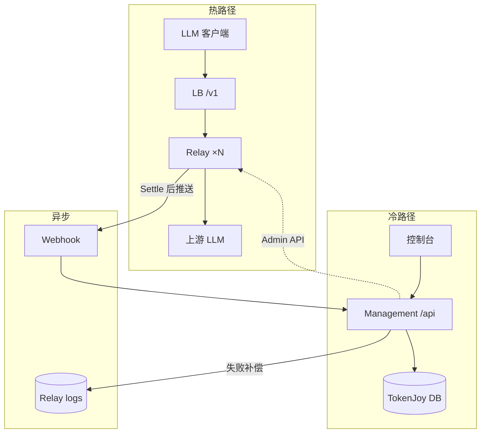
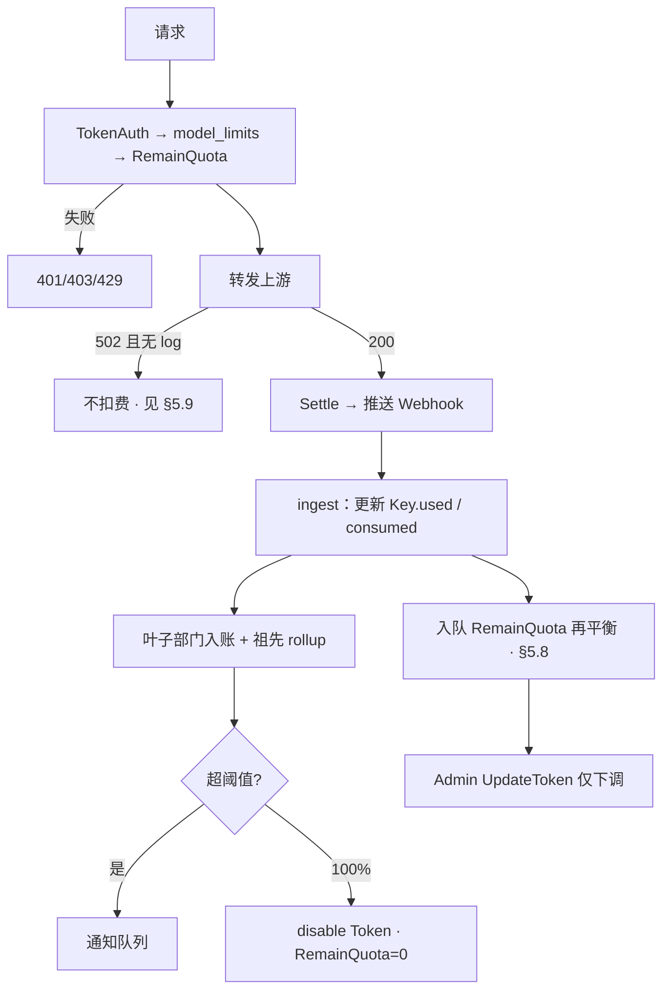
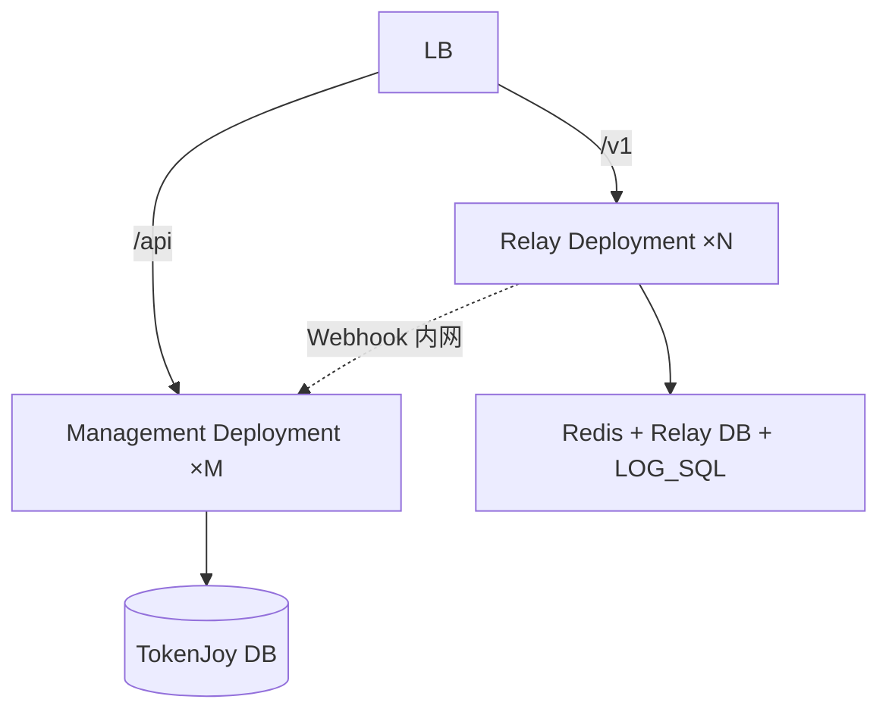

# TokenJoy 后端架构

> **定位**：企业管控面 + New API Relay 双进程；本文是后端与 Relay 集成的**唯一架构真相源**  
> **契约**：[Frontend-API契约.md](./Frontend-API契约.md)（81 个 `/api/*` 端点）  
> **业务**：[TokenJoy-PRD.md](./TokenJoy-PRD.md)  
> **更新日期**：2026-06-27

---

## 目录

- [1. 设计原则](#1-设计原则)
- [2. 双平面拓扑](#2-双平面拓扑)
- [3. Monorepo 目录](#3-monorepo-目录)
- [4. 职责边界](#4-职责边界)
- [5. 预算管控闭环](#5-预算管控闭环)
- [6. 热路径与冷路径](#6-热路径与冷路径)
- [7. 客户端协议](#7-客户端协议)
- [8. 性能与部署](#8-性能与部署)
- [9. New API 集成](#9-new-api-集成)
- [10. 映射、选路、白名单](#10-映射选路白名单)
- [11. 计费](#11-计费)
- [12. 可观测](#12-可观测)
- [13. 演进与代码差距](#13-演进与代码差距)
- [14. 相关文档](#14-相关文档)

---

## 1. 设计原则

**性能优先、结构简单**——用最少 moving parts 达成预算闭环：

| 原则 | 做法 |
|------|------|
| 热路径零 RPC | LLM 请求只经 Relay；Management 永不参与单次推理 |
| 阻断在 Relay | Key 额度 → `RemainQuota` → **429**（毫秒级） |
| 企业 cap 走异步 | 部门/成员/BG 超支 → Webhook 入账 → **disable Token**（秒级） |
| 签发 + 入账后再收紧 | 冷路径设 `RemainQuota`；Webhook 入账后异步再平衡（§5.8），不靠热路径查库 |
| 冷路径可重试 | Admin API 同步失败 → 本地 outbox 重试，不阻塞用户 UI |
| 计费以 logs 为准 | Relay `logs` 为真相源；Management `used`/`consumed` 为投影（§5.9） |
| 最小侵入 Relay | 官方镜像 + 1～2 个 L1 补丁（Webhook、拒绝文案）；**不 import New API 源码**（AGPL） |

**底线：** 无 Relay 不得发可用于生产的 Platform Key（US-12）。`NEW_API_ENABLED=false` 仅 Demo Key（`tj-*-demo-*`）。

---

## 2. 双平面拓扑



**硬规则：**

1. `/v1/*` 不进 Management。
2. 扣费、403/429 只在 Relay；Management 不同步预检预算。
3. 不改写请求 `model`；选路靠 `Token.group` + `Ability`。
4. 客户端 Base URL = **Relay 域名**（如 `https://llm-api.example.com/v1`），与控制台 `/api` 分离。

---

## 3. Monorepo 目录

```
apps/
├── frontend/
├── backend/              # 现实现；目标语义 = management
│   └── internal/
│       ├── integration/newapi/   # Admin API Client
│       ├── domain/budget/        # ingest、rollup、OverrunEvaluator、rebalance
│       ├── domain/keys/          # TokenLifecycle
│       └── http/handler/webhook.go
└── newapi/                 # New API 部署壳：compose + env + patches
```

---

## 4. 职责边界

| 能力 | Relay | Management |
|------|-------|------------|
| `/v1/*` OpenAI + Anthropic | ✅ | — |
| Key 级扣费、`UsedQuota` | ✅ `BillingSession` | — |
| Key 级 `used`（CNY 投影） | logs | ✅ Webhook ingest |
| Key 用尽 → 429 | ✅ `RemainQuota` | 签发/变更/再平衡时设额度 |
| 模型校验 → 403 | ✅ `model_limits` | 冷路径写入 |
| 分配超配 → 422 | — | ✅（见 §5.2） |
| consumed / 预警 / disable | logs | ✅ Webhook 后 |
| RemainQuota 再平衡 | 接收 `UpdateToken` | ✅ ingest 后异步（§5.8） |
| Channel / Ability | ✅ | ProviderKey、RoutingRule |
| 看板 / 审计 | logs | 聚合 |

---

## 5. 预算管控闭环

关联 PRD：US-07、08、09、10、12、14。

### 5.1 四轴模型

| 轴 | 实体 | 100% 阻断 |
|----|------|-----------|
| 部门 | `BudgetNode` | disable 该部门全部 Token |
| 成员 | `MemberBudgetQuota`（`used` = Σ 个人 Key.used） | disable 该成员全部 Token |
| Key | `PlatformKey` | Relay **429** |
| 项目 | `BudgetGroup`（Key 可无 `memberId`） | disable 该 BG 的 Token；**不走**成员 personalQuota |

PRD：BG Key「走 Group 额度，不走个人额度」。

### 5.2 分配期 vs 消耗期

| 阶段 | 负责方 | 现状 | 目标 |
|------|--------|------|------|
| **分配期** | Management | 部分 ✅ | 补齐后保持 |
| **消耗期** | Relay + Webhook | ❌ | **P0** |

**分配期校验（诚实状态）：**

| 校验 | 现状 |
|------|------|
| 开 Key ≤ 成员剩余 | ✅ |
| BG Key ≤ BG 剩余 | ✅ |
| Key 模型 ⊆ 部门白名单 | ✅ |
| 调 `personalQuota` 不超部门池 | ✅ |
| **部门树 PUT：子级之和+预留池 ≤ 父级**（US-07） | ❌ 待实现 |

**消耗期：** 无 Relay 时 `used`/`consumed` 为静态 seed，US-08/US-12 运行时不生效。

### 5.3 RemainQuota 不变式

**两层用量（勿混）：**

| 层 | 字段 | 权威方 | 用途 |
|----|------|--------|------|
| Relay | `UsedQuota` / `RemainQuota` | Relay `BillingSession` | Key 级 429 |
| Management | `PlatformKey.used`（CNY） | Webhook 投影 | 成员/部门/BG `consumed`、看板 |

签发或变更 Key 时，在 **冷路径** 一次算清：

```text
effectiveWhitelist = Key.modelWhitelist ∩ dept.RoutingRule.allowedModels
RemainQuota        = toNewAPIUnits(min(
                       Key.quota - Key.used,
                       memberRemaining,    // 个人 Key；BG Key 跳过
                       deptRemaining,
                       bgRemaining         // 仅 BG Key
                     ), effectiveWhitelist)
```

- `CreatePlatformKey` 422 保证 Σ Key.quota ≤ personalQuota（分配期）。
- **运行期**：多 Key 的 Σ `RemainQuota` 可能暂时大于轴剩余（各 Key 独立签发）；靠 §5.8 入账后再平衡收敛，不靠热路径 RPC。
- 预算/审批变更后：冷路径批量 `UpdateToken` 重算 RemainQuota（异步 job）。

### 5.4 消耗链路



**consumed rollup（简单）：** Webhook 只写入成员所属**叶子部门**；祖先节点 `consumed` = Σ 子孙 `consumed`（同一次 ingest 事务内更新，读树时无需递归聚合）。

### 5.5 预警与阻断

| 机制 | 范围 | 作用 |
|------|------|------|
| **OverrunPolicy** | 全局；成员 personalQuota + 各部门 budget | US-08：阈值通知、100% disable |
| **AlertRule** | 指定 `nodeId` | 额外通知 TL；**不**单独阻断 |

评估：Webhook 入账后；100% 只 disable 一次。通知走**异步队列**，失败记审计，不阻塞 ingest（PRD US-08 #4）。

**透支窗口（诚实）：**

| 机制 | 窗口 |
|------|------|
| Key 级 429 | 无（Relay 实时） |
| 企业轴 100% disable | Webhook 延迟 + 再平衡 job 延迟；目标 ≤ 数秒 |
| 多 Key 叠加 | §5.8 再平衡将 Σ `RemainQuota` 压回轴剩余；disable 前最多再平衡周期内的新请求 |

**阻断与文案：**

| 情况 | HTTP | 文案 |
|------|------|------|
| Key RemainQuota 用尽 | 429 | `blockMessage`（L1 补丁，**P1**） |
| 超支 disable 后 | 403 | 同 `blockMessage`（同一 L1 补丁） |

### 5.6 映射表 `relay_mappings`

| 列 | 说明 |
|----|------|
| `platform_key_id`, `newapi_token_id` | 主映射 |
| `member_id`, `department_id`, `budget_group_id?` | 归因 |
| `relay_group` | `dept-{departmentId}` |
| `sync_status`, `synced_at` | 冷路径同步状态 |

Rotate/Revoke 时同步更新映射；ingest 按 `token_id` 查映射，映射缺失则拒收并告警（防错账）。

### 5.7 Webhook（内部 API，不进 81 端点契约）

| 项 | 约定 |
|----|------|
| `POST /api/internal/webhooks/newapi-log` | 内网 + `X-Webhook-Secret` |
| payload | `id`, `token_id`, `quota`, `model`, `created_at` |
| 幂等 | `log.id` 唯一约束；重复投递直接 200 跳过 |
| 失败 | **DB outbox** 持久化 + 指数退避重试 |
| 补偿 | 定时 `ListLogs`（游标 `last_log_id`）；与 Webhook 共用 ingest（同 `log.id` 幂等） |

ingest 与补偿**同一路径**，不维护两套入账逻辑。

### 5.8 RemainQuota 再平衡（P0）

入账后收紧企业轴 cap，**仍不走热路径**：

```text
触发：ingest 更新了 member / dept / bg 的 consumed 后
范围：该轴下所有活跃 PlatformKey（经 relay_mappings）
计算：对每个 Key 用 §5.3 公式得 newRemain
动作：仅当 newRemain < Relay 当前 RemainQuota 时 Admin UpdateToken（只下调、不抬高）
合并：同一 ingest 批次内按 member_id / dept_id / bg_id 去重，每轴每批最多 1 次 job
```

- Worker 与 Relay outbox 共用后台池；失败入 outbox 重试。
- **禁止**在 ingest 热路径同步调 Admin API（保持 Webhook 响应快）。
- 再平衡 + disable 双保险：100% 时 disable 优先；再平衡防止 disable 到达前的多 Key 叠加。

### 5.9 对账与真相源（P0）

| 项 | 约定 |
|----|------|
| **计费真相源** | Relay `logs`（含 `ListLogs` 补偿） |
| **Management 投影** | `PlatformKey.used`、`consumed`；允许秒级滞后 |
| **Key 级 429** | 以 Relay `RemainQuota` 为准，不回写 Management |
| **502** | P0 spike：**无 log 则不扣费、不入账**；若 spike 证明 502 仍产 log，则按 log 入账（结论记入下表） |
| **定时对账** | 每日 `ListLogs` 全量核对 `ingested_log_ids`；缺漏补 ingest；差异记审计 |

**P0 spike 结论（Gate 前填写）：**

| 场景 | 是否产 log | 是否扣 RemainQuota |
|------|------------|-------------------|
| 上游 502 | _待测_ | _待测_ |
| 上游超时 | _待测_ | _待测_ |

### 5.10 生产 Gate

**P0（全部满足方可发生产 Key）：**

- [ ] `apps/newapi` 部署，`/v1` 可达
- [ ] `relay_mappings` + Channel/Ability 同步
- [ ] 冷路径 outbox（Management → Relay）
- [ ] Webhook ingest + DB outbox + `ListLogs` 补偿
- [ ] RemainQuota 再平衡 worker（§5.8）
- [ ] Key 用尽 → 429
- [ ] 部门树 PUT 超卖校验（US-07）
- [ ] §5.9 spike 结论已填写且 ingest 逻辑对齐

**P1：** OverrunPolicy 通知/disable · 看板/audit calls 来自 logs · `blockMessage` 补丁 · 每日对账 job

---

## 6. 热路径与冷路径

### 6.1 热路径

```
Client → Relay → Upstream
```

不出现 Management、同步 Webhook、预算 RPC。

### 6.2 冷路径同步

| 操作 | Relay |
|------|-------|
| Create/Update/Toggle/Rotate/Revoke PlatformKey | Token CRUD + 映射 |
| ProviderKey CRUD/rotate | Channel |
| RoutingRule PUT | 同步 `RebuildAbilities`；`model_limits` **异步**批量更新（§10.2） |
| 审批追加额度 | `UpdateToken` RemainQuota |
| 超支 100% | disable + RemainQuota=0 |
| ingest 后再平衡 | `UpdateToken` 仅下调（§5.8） |

**同步失败（简单 outbox）：** 先写 TokenJoy DB + `sync_status=pending`，后台 worker 调 Admin API 重试；Create 失败则不返回 `fullKey` 给前端。不做分布式事务。

`NEW_API_ENABLED=false`：跳过 Relay 同步。

### 6.3 异步路径

```
Relay Settle → 推送 Webhook → ingest（幂等）→ rollup → 预警/disable → 再平衡入队
                                    ↓ 失败
                              DB outbox → 重试
                                    ↓ 长期失败
                              ListLogs 游标补偿（同 ingest）
```

---

## 7. 客户端协议

| 格式 | 路径 |
|------|------|
| OpenAI | `POST /v1/chat/completions` |
| Anthropic | `POST /v1/messages` |

必须带 `model`；否则 403。模型不在 `model_limits` → 403。

| 码 | 场景 |
|----|------|
| 401 | Key 无效 |
| 403 | 禁用 / 模型不允许 / 超支 disable |
| 429 | RemainQuota 用尽 |
| 502 | 上游失败；**无 log 则不扣费**（§5.9 spike） |

---

## 8. 性能与部署

### 8.1 性能要点

| 做 | 不做 |
|----|------|
| Relay 水平扩展、无状态 | 热路径经 Management |
| Redis / Relay DB 与 Relay 同 AZ | 多层 Nginx 叠在 Relay 前 |
| `LOG_SQL_DSN` 独立库 | logs 写 TokenJoy 主库 |
| Webhook 异步入账 + 再平衡入队 | ingest 内同步 Admin API |
| 再平衡只下调、按轴去重 | 每笔 log 逐 Key 同步 RPC |
| Webhook DB outbox | 仅内存重试队列 |

Docker vs 裸进程：延迟差异可忽略；瓶颈在上游 LLM。

### 8.2 生产拓扑



Relay 与 Management **分 Deployment**；Webhook 不对公网。

### 8.3 开发

`apps/newapi` compose + `apps/backend` `go run`；`NEW_API_BASE_URL` 指 New API Admin。

---

## 9. New API 集成

### 9.1 侵入级别

L0 镜像 → L1 补丁（推荐上限）→ **禁止**源码并入 `backend`。

### 9.2 环境变量

| 变量 | 用途 |
|------|------|
| `NEW_API_ENABLED` | `false` = Demo |
| `NEW_API_BASE_URL` | Admin API |
| `NEW_API_ADMIN_TOKEN` | 鉴权 |
| `NEW_API_WEBHOOK_SECRET` | Webhook |
| `NEW_API_PUBLIC_URL` | 成员可见 Endpoint |

### 9.3 Admin 封装

`UpsertChannel` · `Create/Update/RevokeToken` · `RebuildAbilities` · `ListLogs`

### 9.4 L1 补丁

| 优先级 | 内容 |
|--------|------|
| **P0** | 日志 Webhook（Settle 后推送） |
| **P1** | 429/403 自定义拒绝文案（`blockMessage`） |
| P2 | `X-Channel-Id` 响应头 |

### 9.5 Relay 热路径（摘要）

`TokenAuth` → `RateLimit` → `Distribute(group, model)` → Channel → `BillingSession` → `logs` → Webhook

---

## 10. 映射、选路、白名单

### 10.1 Token 映射

| TokenJoy | New API |
|----------|---------|
| `fullKey` | `Key` |
| `quota`/`used`（CNY） | `RemainQuota`/`UsedQuota`（quota 单位） |
| `modelWhitelist` ∩ 部门 allowed | `ModelLimits` |
| 成员部门 | `Token.group` = `dept-{departmentId}` |

### 10.2 RoutingRule

- 契约字段 `defaultModel`/`fallbackModel`：**Relay 忽略**；调用方必须显式传 `model`（US-09）。
- `RoutingRule` PUT：**同步** `RebuildAbilities`（保证选路立刻生效）；`model_limits` 由异步 job 批量 `UpdateToken`。
- **可接受窗口**：`model_limits` 更新完成前，旧白名单仍生效；目标 job 周期 ≤ 30s。不做热路径补丁。

### 10.3 ProviderKey → Channel

`provider`→`Type`；密钥→`Key`；状态同步启用/禁用。

---

## 11. 计费

| 层 | 扣费 | 超支 |
|----|------|------|
| Key | Relay `BillingSession` | 429 |
| 企业四轴 | Webhook 累计 CNY | disable + 再平衡 |

**单位：** Management 用**元**；`cost_cny = log.quota / QuotaPerUnit × model_price`。

**多模型 Key（简单规则）：**

- **签发 / 再平衡**：按 whitelist 中**最高价**模型换算 `RemainQuota`（保守预留）。
- **调用后**：按 logs 中**实际 model** 扣 CNY；Webhook 更新 `used`。
- 换算集中在 `integration/newapi/quota.go`。

---

## 12. 可观测

```
log.token_id → relay_mappings → member / dept / BG → consumed → dashboard & audit/calls
```

`/api/audit/operations` = Management 本地。调用审计（US-14）依赖 P1 logs 接入。

---

## 13. 演进与代码差距

### 13.1 阶段

| 阶段 | 交付 |
|------|------|
| **现状** | 81 端点；开 Key 422；无 `apps/newapi` |
| **P0** | `apps/newapi`、映射、双向 outbox、Webhook ingest、`ListLogs` 补偿、再平衡 worker、429、部门树 PUT 校验、502 spike |
| **P1** | OverrunPolicy/disable、看板/audit、blockMessage 补丁、每日对账 |
| **P2** | 分池、LOG 独立库、HPA |
| **P3** | 自然月重置 |

### 13.2 代码差距

| 项 | 现状 |
|----|------|
| `apps/newapi/` | 无 |
| `integration/newapi/` | 无 |
| Webhook / `relay_mappings` / ingest outbox | 无 |
| RemainQuota 再平衡 worker | 无 |
| `NEW_API_*` config | 无 |
| PlatformKey | 本地 demo 串 |
| 部门树 PUT 超卖校验 | 无 |
| `used`/`consumed` | 静态 seed |
| §5.9 502 spike | 未做 |

---

## 14. 相关文档

| 文档 | 职责 |
|------|------|
| [TokenJoy-PRD.md](./TokenJoy-PRD.md) | 业务规则 |
| [Frontend-API契约.md](./Frontend-API契约.md) | `/api/*` 81 端点 |
| [Backend-设计.md](./Backend-设计.md) | 当前 backend 实现 |

---

**维护：** P0 Gate（§5.10）完成后更新 §13.2 与 §5.9 spike 表；New API 升级核对 §9.4。
