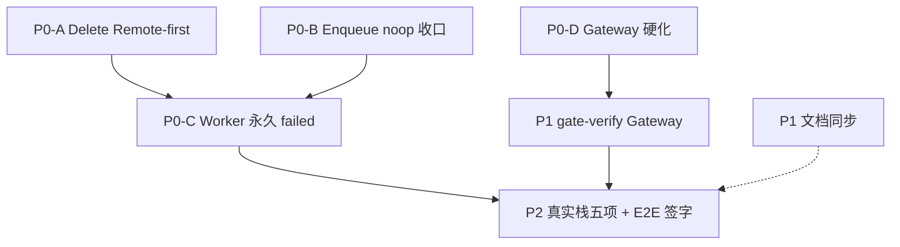

# Relay / Gateway 待办

> **对齐**：2026-07-09  
> **定位**：P0 硬化与发布签字剩余项；日常 backlog 见 [plan.md](./plan.md)。  
> **前提**：绿库 wipe + seed；Platform Key 与 LLM 调用必须走 Relay。

---

## 优先级总览

| 级别 | 含义 | 何时做 |
| --- | --- | --- |
| **P0** | 资金/安全/一致性风险，发布前必须 | 立即 |
| **P1** | 硬化与可观测，不阻断但应尽快 | P0 后 |
| **P2** | 联调签字与文档 | 代码改完后 |



**建议顺序：** P0-A ∥ P0-B ∥ P0-D（可并行）→ P0-C → P1 → P2。

---

## P0 — 发布前必须

### P0-A · `DeletePlatformKey` Remote-first

**问题：** 仍可绕过 Relay，只删 Postgres 行；NewAPI token 可能残留。

**改法（二选一，推荐 A）：**

- **A（推荐）：** Delete 前先 `requireRelay()` → 有 synced mapping 则 `SyncRevokePlatformKey` → 再删 key + mapping
- **B：** 产品定为 Delete = Revoke，硬删仅 admin 且必须先 revoked

**文件：** `domain/keys/platform_key_actions.go`

**验收：** Relay 关 → 503 且 DB 不变；Relay 开 → NewAPI token 同步消失

---

### P0-B · `EnqueueUpdatePlatformKey` 禁 noop

**问题：** `!Enabled()` 时 `return nil`；`UpdatePlatformKey`（配额/白名单）先写 DB 再 async outbox，与 Remote-first 铁律不一致。

**改法（二选一）：**

- **A（小改）：** `EnqueueUpdatePlatformKey` 在 `!Enabled()` 时返回 503（与同步方法一致）
- **B（终态）：** `UpdatePlatformKey` 改同步 `SyncUpdatePlatformKey`，去掉该路径的 outbox

**文件：** `domain/relay/lifecycle_update.go` · `domain/keys/platform_key_update.go`

**验收：** Relay 关 + 改配额 → 503，DB 不变；Relay 开 + NewAPI 失败 → 5xx，DB 不变

---

### P0-C · Worker outbox 永久 failed

**问题：** relay disabled / 不可恢复配置错误时，outbox 无限 backoff，掩盖误配。

**改法：** `processRelayOutbox` 识别 `ServiceUnavailable("relay not enabled")` 及同类永久错误 → `mark failed`，不再重试。

**文件：** `infra/worker/relay_processor.go`

**验收：** Relay 关时积压 outbox → status=failed，非 pending 循环

---

### P0-D · Gateway 硬化

**问题：** 每请求新建 `ReverseProxy`；路径 `HasPrefix` 可误放行子路径；无 body 上限。

| 子项 | 目标 | 文件 |
| --- | --- | --- |
| singleton proxy | `NewGatewayService` 时创建一次，复用 `http.Transport` | `gateway_service.go` |
| 精确路径白名单 | 仅 4 条：`/v1/chat/completions`、`/v1/completions`、`/v1/embeddings`、`/v1/models` | 同上 |
| body limit | `http.MaxBytesReader`，默认 4MB（可配置常量） | 同上 |

**验收：** 单测补精确路径拒绝（如 `/v1/chat/completions/evil` → 404）；超限 body → 413

---

## P1 — 硬化与门禁

### P1-A · `gate-verify` 增加 Backend Gateway 步

**问题：** 脚本只测 Relay 直连 `/v1`，不测 Backend Gateway 预检链。

**改法：** `gate-verify.sh` 增加：seed Key → `POST ${API_URL}/v1/chat/completions`（Bearer sk-）→ 期望 200 或业务 4xx（非 502）。

**文件：** `apps/newapi/scripts/gate-verify.sh`

---

### P1-B · 其余 Relay 误配项（见 plan §1 P1）

非本文件主链，但建议 P0 后顺手排：

| 项 | 风险 |
| --- | --- |
| demo 只开 Gateway 不开 NewAPI | 路由半挂载，仅 log |
| Rebalance/Overrun Relay 关时空转 | Worker 静默跳过 |
| `noopWalletService` 预检恒 0 | Gateway 预算误拒 |
| `NOTIFY_WEBHOOK_URL` 失败静默 | 告警丢失 |

---

## P2 — 联调签字

真实栈 `pnpm start:relay` + 生产契约 env（`DEPLOY_ENV=production` + §8.2），五项手工 + E2E：

- [ ] Gateway `/v1/chat/completions` → 200 + ledger 入账
- [ ] Toggle off → 立刻 403；on → 恢复
- [ ] Revoke → 403；DB revoked + NewAPI token gone
- [ ] Rotate → 旧 sk- 403，新 sk- 200，`newapi_token_id` 不变
- [ ] E2E `keys-self-service.spec.ts` · `rotates an existing Key` 稳定通过

```bash
cd apps/backend && go test -tags=testhook \
  ./tests/handler/gateway/... \
  ./tests/domain/relay/... \
  ./tests/domain/keys/... -count=1

pnpm -F @tokenjoy/frontend test:e2e -- keys-self-service
```

---

## P2 — 文档（完成后勾选）

| 文档 | 内容 |
| --- | --- |
| [plan.md](./plan.md) §1 | Enqueue/Delete/Worker/Gateway 硬化 |
| [NewAPI-集成状态与缺口.md](./NewAPI-集成状态与缺口.md) | Gateway 步骤、联调签字 |
| [Backend-架构.md](./Backend-架构.md) | Relay 终态接口 + pkg 边界 |

---

## 文件改动一览（仅待改）

| 优先级 | 文件 |
| --- | --- |
| P0-A | `domain/keys/platform_key_actions.go` |
| P0-B | `domain/relay/lifecycle_update.go` · `domain/keys/platform_key_update.go` |
| P0-C | `infra/worker/relay_processor.go` |
| P0-D | `domain/relay/gateway_service.go` |
| P1-A | `apps/newapi/scripts/gate-verify.sh` |

---

## 明确不做

| 项 | 原因 |
| --- | --- |
| delete+create 式 Rotate | 破坏 ingest `token_id` 连续性 |
| Toggle 改回 async outbox | 用户操作应同步 |
| 兼容「无 Relay 的 Platform Key」 | Demo 统一 503 |
| Gateway 终态保留 HasPrefix | 精确匹配为安全目标 |
