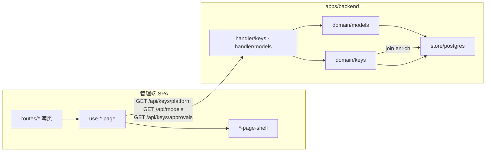
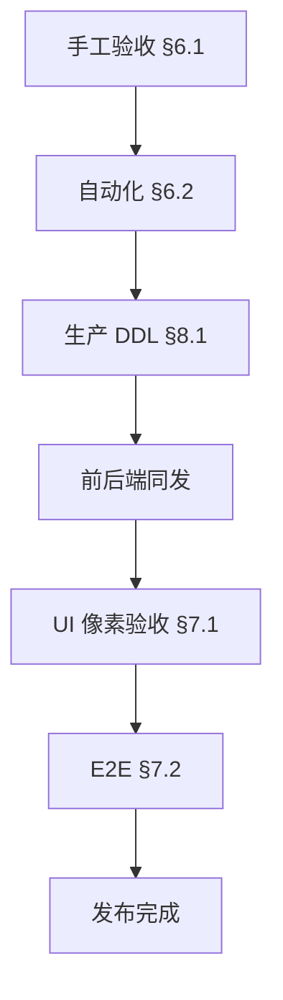

# 产品模型与 UI 演进架构

> **文档日期**：2026-07-07  
> **读者**：架构 / 前后端 / QA / 发布  
> **范围**：产品模型 P0–P2（已落地）、新 UI 视觉对齐 P0–P2（已完成）、发布门禁与 Phase 3 演进  
> **关联**：[Frontend.md](./Frontend.md) · [Backend-存储.md](./Backend-存储.md) · [前端架构优化与模块化建议.md](./前端架构优化与模块化建议.md) · [Roadmap.md](./Roadmap.md)

---

## 1. 执行摘要

本轮交付完成两条并行主线：

| 主线         | 目标                                                                                       | 状态                   |
| ------------ | ------------------------------------------------------------------------------------------ | ---------------------- |
| **产品模型** | Models 四元数据、Platform Key 运行时 enrich、审批 `tab × memberId`、model-edit 工作流      | 代码与自动化测试已完成 |
| **新 UI**    | 以 `716eeec` 为视觉基准，Layout 与核心页 P0–P2 对齐，保留 Workflow / 筛选 / 下钻等后端能力 | 代码已完成             |

**当前阶段**：从「实现完成」转入「验收与发布」。Phase 3（性能与权限深化）**不在本阶段范围**，按量化触发条件或独立业务需求立项。

**建议发布顺序**：产品模型手工验收 → 生产迁移与同发 → UI 像素验收 → E2E 绿灯 → Phase 3（按需）。

---

## 2. 问题域与边界

### 2.1 本阶段解决的问题

1. **模型目录语义不完整**：缺少 `type` / `description` / `visibility` / `endpoint`，无法区分内置与自定义部署。
2. **平台 Key 列表展示名陈旧**：`member_name`、`budget_group_name` 等快照列与源表脱节，改名后列表不更新。
3. **审批视角单一**：管理员四 Tab 与「我的申请」需共用 API，但筛选维度不同。
4. **前端视觉漂移**：多轮迭代后 Card / Table / PageShell 与基准 commit 不一致。

### 2.2 本阶段刻意不做

| 非目标                       | 原因                                                       |
| ---------------------------- | ---------------------------------------------------------- |
| 平行 `/enriched` API         | 扩展现有端点即可，避免契约分裂                             |
| `platform_keys` 推导字段入库 | 源表为真相，enrich 在 domain 层 join                       |
| `visibility` 运行时强制      | P2 仅可编辑与展示；与 `model_allowlist` 合并校验属 Phase 3 |
| SQL 级分页 / 后端搜索        | 数据量未达触发阈值，前端全量筛选可接受                     |
| 恢复 MSW 或 mock 路由数据    | 与「真 API + DI」架构方向冲突                              |

### 2.3 系统上下文



---

## 3. 架构决策（已定案，实施时勿推翻）

| #   | 议题                     | 决策                                                         | 理由                                                              |
| --- | ------------------------ | ------------------------------------------------------------ | ----------------------------------------------------------------- |
| D1  | 列表 enrich 方式         | 扩展现有 `GET /keys/platform`、`GET /models`，不新增平行端点 | 契约单一、前端改动最小                                            |
| D2  | `platform_keys` 推导字段 | **不入库**；`platform_key_enrich.go` 在 domain 层 join       | 避免双写与改名不同步                                              |
| D3  | 审批「我的申请」         | `memberId` 查询参数，不用 `tab=mine`                         | Tab 语义保留给状态维度                                            |
| D4  | `visibility`             | P2 可编辑、**仅展示**；运行时校验 Phase 3                    | 先完成数据面，再收紧访问面                                        |
| D5  | 前端工程                 | `features/` + `use-*-page` + API 注入 + 真 API               | 与 [前端架构优化与模块化建议](./前端架构优化与模块化建议.md) 一致 |
| D6  | 发布策略                 | 前后端**同发**；DB 迁移 **additive only**                    | 新前端依赖 enrich 字段，不兼容旧后端                              |

---

## 4. 数据与 API 契约

### 4.1 `platform_keys` 字段分层

| 层级            | 字段                                                                       | 说明                                       |
| --------------- | -------------------------------------------------------------------------- | ------------------------------------------ |
| **持久化**      | `member_id`、`budget_group_id`、`app_name`                                 | 外键与业务主键，入库                       |
| **响应 enrich** | `type`、`department_*`、`member_name`、`budget_group_name`、`project_name` | domain join 推导，仅 JSON                  |
| **运行面快照**  | `relay_mappings.department_id`                                             | Relay 路由用，与管理面 enrich **分层独立** |

改名同步路径：`members.name` / `budget_groups.name` 更新 → 下次 `GET /keys/platform` enrich 自动反映，**不读** `platform_keys` 快照列。

### 4.2 API 边界

```
GET /api/models
  → ModelInfo[]（type / description / visibility / endpoint）

GET /api/keys/platform
  → PageResult<PlatformKey>（departmentId、type 筛选 + enrich）

GET /api/keys/approvals
  → KeyApproval[]（status tab × 可选 memberId）
```

权威类型来源：[Frontend.md](./Frontend.md) §5 · `apps/frontend/src/api/types/` · `apps/backend/internal/domain/types/`。

### 4.3 `models` 表扩展（P2）

新增四列（additive，可安全前向迁移）：

| 列            | 类型 | 默认        | 语义                      |
| ------------- | ---- | ----------- | ------------------------- |
| `model_type`  | TEXT | `'builtin'` | `builtin` / `custom`      |
| `description` | TEXT | `''`        | 展示描述                  |
| `visibility`  | TEXT | `'all'`     | P2 展示用，运行时 Phase 3 |
| `endpoint`    | TEXT | NULL        | custom 模型部署地址       |

---

## 5. 发布架构

### 5.1 发布门禁



| 门禁                                           | 级别     | 未通过后果                 |
| ---------------------------------------------- | -------- | -------------------------- |
| 产品模型手工验收（6 项）                       | **阻断** | 数据/enrich 逻辑可能有回归 |
| Handler / Feature 单测                         | **阻断** | CI 已覆盖，发布前复跑      |
| `models` 四列迁移                              | **阻断** | 新字段缺失导致读写异常     |
| 前后端同发                                     | **阻断** | 旧后端 + 新前端字段不匹配  |
| UI 像素验收                                    | **建议** | 视觉漂移，不阻塞功能       |
| E2E（keys / models / audit / wallet / member） | **建议** | 主路径回归保障             |

### 5.2 回滚策略

- **数据库**：仅 additive 列，**不回滚** DDL；应用层可独立回滚。
- **应用**：前后端须成对回滚；单独回滚前端至依赖 enrich 之前的版本不可行。
- **数据**：`model_type` 回填脚本幂等，可重复执行。

### 5.3 生产迁移

见 [§8.1](#81-models-四列迁移脚本)。

---

## 6. 产品模型验收标准

### 6.1 手工验收（阻断发布）

| #   | 场景                      | 预期                                                                   |
| --- | ------------------------- | ---------------------------------------------------------------------- |
| 1   | 平台 Key：部门树点击      | 列表与后端 `departmentId` 筛选一致                                     |
| 2   | 平台 Key：成员 / 项目 Tab | 切换正确，数据不串                                                     |
| 3   | 审批四 Tab                | pending / approved / rejected / all 数据正确；角标**仅** pending       |
| 4   | 模型列表                  | 内置 / 自定义 Tab；custom 显示 `endpoint`                              |
| 5   | Postgres 重启             | custom 模型 `endpoint` 持久化仍在                                      |
| 6   | 改名同步                  | 改成员名 / 预算组名后，平台 Key 列表展示名即时更新（enrich，非快照列） |

### 6.2 自动化（发布前复跑）

```bash
cd apps/backend && go test ./tests/handler/keys/... ./tests/handler/models/... -count=1
cd apps/frontend && npm test -- --run tests/features/keys tests/features/models
```

### 6.3 可选补强（非阻断）

| 项                      | 价值                                   |
| ----------------------- | -------------------------------------- |
| 改名同步集成测试        | 防 enrich join 回归                    |
| 重启持久化集成测试      | 防 `endpoint` 落库回归                 |
| 成员视角审批 `memberId` | API 已支持，`use-approval-page` 可接入 |

---

## 7. UI 对齐架构

### 7.1 基准与范围

- **视觉基准**：`716eeec`（zhouqiao058，2026-07-06）
- **已完成**：P0–P2 页面与 Layout；Workflow、筛选、下钻等后端能力保留
- **例外**：`/keys/mine` 无 716eeec 基准，需单独约定布局（卡片 vs 表格）

### 7.2 像素验收

```bash
git show 716eeec:apps/frontend/src/routes/<domain>/<page>.tsx
git diff 716eeec HEAD -- apps/frontend/src/features/<domain>/components/
```

| 检查项                  | 预期                                  |
| ----------------------- | ------------------------------------- |
| `PageShell` `fill` 布局 | Admin 主滚动链下高度正确              |
| Card / Table 样式       | 全站 `shadow-xs border-border` 无遗漏 |
| `/keys/mine`            | 按团队约定单独验收                    |

### 7.3 自动化

```bash
pnpm --filter frontend exec tsc --noEmit
pnpm --filter frontend test
pnpm --filter frontend test:e2e -- keys models audit wallet member
```

### 7.4 变更边界（后续改动须遵守）

| 允许改                           | 禁止改                       |
| -------------------------------- | ---------------------------- |
| `className`、DOM 层级、栅格      | `use-*-page` 数据编排        |
| Card / Table 外壳、表头 / 斑马行 | 真 API 调用与 Session / 权限 |
| 纯视觉间距与排版                 | 恢复 MSW 或 mock 数据        |

### 7.5 可选抛光（Phase 4，不阻断发布）

| 项                                              | 文件                        |
| ----------------------------------------------- | --------------------------- |
| Workflow 面板 header/footer 间距                | `workflow-panel-chrome.tsx` |
| 表单 Label 统一 `text-xs text-muted-foreground` | `workflow-form-field.tsx`   |

---

## 8. Phase 3 演进路线

**当前不必立项。** 满足以下**任一**量化条件时启动：

- `platform_keys` 行数 > **500**
- `GET /keys/platform` P99 > **300ms**

### 8.1 演进任务

| #   | 任务                | 技术方向                                                                                      |
| --- | ------------------- | --------------------------------------------------------------------------------------------- |
| 1   | 删冗余列            | `DROP member_name, budget_group_name`；repo 停读写                                            |
| 2   | SQL 筛选            | `keys_repo.ListPlatformKeysFiltered`，JOIN members / budget_groups / budget_group_departments |
| 3   | 真分页              | `page` / `pageSize` / `total` 与 SQL `LIMIT/OFFSET`                                           |
| 4   | 列表 RBAC           | 非管理员默认 `departmentId=会话部门`                                                          |
| 5   | 后端搜索 `q`        | 名称/前缀模糊，替代前端全量 `search`                                                          |
| 6   | `visibility` 运行时 | 与 `model_allowlist`、部门路由合并校验                                                        |
| 7   | Models `type` query | 仅当模型数 > 500                                                                              |

### 8.2 可提前立项的独立项

不依赖性能触发，由业务需求驱动：

| 需求                             | 对应任务      |
| -------------------------------- | ------------- |
| 上线前部门管理员仅能看本部门 Key | #4 列表 RBAC  |
| `visibility` 须真正限制模型访问  | #6 运行时校验 |

### 8.3 Phase 3 架构约束

- 延续 D1–D2：**不**引入平行 enrich API；推导字段仍不入库。
- SQL 筛选与 enrich 在 **同一查询路径** 完成，避免 N+1。
- RBAC 默认部门过滤在 **后端** 强制，前端仅作 UX 辅助。

---

## 9. 实施索引

| 域                | 路径                                                              |
| ----------------- | ----------------------------------------------------------------- |
| Platform enrich   | `apps/backend/internal/domain/keys/platform_key_enrich.go`        |
| Platform 列表     | `apps/backend/internal/domain/keys/platform_key_list.go`          |
| Keys handler      | `apps/backend/internal/http/handler/keys/handler.go`              |
| Models service    | `apps/backend/internal/domain/models/service.go`                  |
| Models DDL        | `apps/backend/internal/store/postgres/schema.sql`                 |
| 模型编辑 workflow | `apps/frontend/src/features/workflow/workflows/model-edit.tsx`    |
| 平台 Key 页       | `apps/frontend/src/features/keys/hooks/use-platform-keys-page.ts` |
| 审批页            | `apps/frontend/src/features/keys/hooks/use-approval-page.ts`      |

### 9.1 UI 路由 ↔ Shell 对照

| 路由              | Shell 组件                                        |
| ----------------- | ------------------------------------------------- |
| `/keys/platform`  | `platform-keys-page-shell.tsx`                    |
| `/keys/approval`  | `approval-page-shell.tsx`                         |
| `/models/list`    | `model-list-page-shell.tsx`                       |
| `/dashboard/cost` | `cost-dashboard-page-shell.tsx`                   |
| `/wallet`         | `wallet-page-shell.tsx`                           |
| `/me/keys`        | `member-keys-page-shell.tsx`                      |
| `/keys/mine`      | `my-keys-admin-page-shell.tsx`（无 716eeec 基准） |

---

## 10. 附录

### 10.1 `models` 四列迁移脚本

```sql
ALTER TABLE models
  ADD COLUMN IF NOT EXISTS model_type   TEXT NOT NULL DEFAULT 'builtin',
  ADD COLUMN IF NOT EXISTS description  TEXT NOT NULL DEFAULT '',
  ADD COLUMN IF NOT EXISTS visibility   TEXT NOT NULL DEFAULT 'all',
  ADD COLUMN IF NOT EXISTS endpoint     TEXT;

UPDATE models SET model_type = 'custom' WHERE provider = 'custom' AND model_type = 'builtin';
UPDATE models SET model_type = 'builtin' WHERE provider <> 'custom' AND model_type = 'builtin';
UPDATE models SET visibility = 'all' WHERE visibility = '' OR visibility IS NULL;
```

本地开发：`docker compose down -v` 重建（见 [Backend-存储.md](./Backend-存储.md)）。

### 10.2 Issue 拆解参考

```
[阻断] §6.1 产品模型手工验收（6 项）
[阻断] §5.3 生产 models 迁移 + 前后端同发
[建议] §7.2 UI 像素验收 + §7.3 E2E
[可选] 改名同步 / 重启持久化集成测试
[可选] 成员视角审批 memberId
[可选] §7.5 Workflow 抛光
[按需] §8 Phase 3
```
