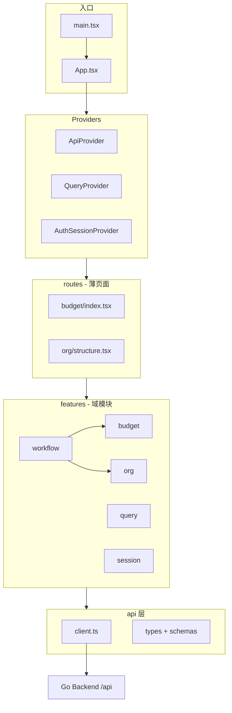

# 前端架构优化与模块化建议

> 分析对象：`apps/frontend`  
> 分析日期：2026-07-06（2026-07-07 对齐实现）  
> 工程待办：[plan.md](./plan.md) §4

## 结论摘要

当前前端 **技术选型合理、分层意识清晰**，已具备可维护的中型管理后台骨架，**不建议整体换框架**（如迁 Next.js、引入 Redux 等）。

优先方向应是：

1. **巩固既有约定**（`routes` + `use-*-page` + `features` + API 注入），把零散实现收敛到统一模式
2. **按业务域纵向切片**（`features/budget`、`features/org` 等），减少 `components/` 与 `routes/*/components/` 的职责重叠
3. **补齐契约与表单层**（Zod 校验、可选 OpenAPI 代码生成），与 Go 后端长期对齐
4. **收尾迁移债务**（`routes/*/hooks` 副本、`components/{domain}/` 遗留）— 见 [plan.md](./plan.md) §4

---

## 1. 现状概览

### 1.1 技术栈

| 类别      | 选型                                             | 评价                          |
| --------- | ------------------------------------------------ | ----------------------------- |
| 运行时    | React 19 + Vite 8 + TypeScript 5.x               | 现代、构建快，适合 SPA 管理端 |
| 路由      | React Router 7 + 路由级 `lazy()`                 | 已做代码分割                  |
| 数据      | TanStack Query 5 + 自研 `useInjectedQuery`       | 测试友好，符合依赖注入要求    |
| 局部状态  | Zustand（Workflow 栈）                           | 范围克制，无需全局 Redux      |
| UI        | Radix + Tailwind 4 + shadcn 风格 `components/ui` | 组件库成熟                    |
| 表单      | react-hook-form（部分页面）                      | 使用不统一                    |
| 校验      | Zod（仅 `api/schemas/session`）                  | 覆盖面窄                      |
| 表格/图表 | TanStack Table、Recharts                         | 已配置 `manualChunks` 拆包    |
| 测试      | Vitest + Testing Library + Playwright            | 单测偏基础设施，E2E 刚起步    |
| 监控      | Sentry                                           | 已接入                        |

约 **284** 个 `src` 下 TS/TSX 文件；`features/workflow` 单独占 **77** 个文件，是最大子系统。

### 1.2 目录分层（当前，双轨迁移中）

```text
src/
├── api/              # HTTP 客户端、AppApis 聚合、类型
├── config/           # 路由、导航、权限、应用常量
├── components/
│   ├── ui/           # 无业务语义的通用组件（受 lint 约束）
│   ├── layout/       # 壳层、AppProviders
│   ├── auth/
│   └── {budget,org,keys}/  # 遗留，待迁入 features（plan §4）
├── features/
│   ├── {domain}/     # budget、org、keys、audit、dashboard、models、wallet、member…
│   │   ├── hooks/use-*-page.ts   # canonical 页面逻辑
│   │   ├── components/*-page-shell.tsx
│   │   ├── lib/
│   │   └── index.ts
│   ├── session/      # 登录态、权限同步、路由门禁
│   ├── query/        # QueryClient、queryKeys、注入式 query/mutation
│   └── workflow/     # 多步面板工作流
├── routes/
│   ├── {domain}/*.tsx    # 薄入口：从 @/features/* 导入
│   └── */hooks/          # 遗留副本，待删除（plan §4）
├── hooks/            # 跨域通用 hooks
└── lib/              # 跨域纯函数、常量
```

**目标态**：注册路由仅从 `features/{domain}` 拉 hook 与 shell；`components/{domain}/` 与 `routes/*/hooks/` 清零。MSW 已移除，测试用 `createMockApis()`，E2E/dev 用真 backend。

### 1.3 已落地的架构约定（亮点）

`scripts/check-conventions.ts` 在 CI/lint 中强制执行：

- 页面逻辑在 `features/{domain}/hooks/use-*-page.ts`；**禁止**在 `components/{domain}/` 里直接 `useApis()`
- `components/ui` 不得出现领域名（budget、org 等）
- `components/` 不得反向依赖 `@/routes/`
- 禁止 `../../` 及更深的相对路径，统一 `@/` 别名
- 路由 `lazy` 目标文件必须存在

此外还有：

- **API 依赖注入**：`ApiProvider` + `useInjectedApis` + page hook 可选 `injectedApis`，单测可注入 mock
- **路由元数据单源**：`config/routes.ts` 同时驱动导航、权限、`App.tsx` 懒加载
- **Workflow 注册表**：`WORKFLOW_REGISTRY` 按域拆分 definitions，类似插件化工作流

整体上已接近 **Feature-Sliced / 垂直切片** 的轻量变体，基础扎实。

---

## 2. 主要问题与优化空间

### 2.1 分层边界（迁移中）

| 项 | 状态 |
| --- | --- |
| `routes` 注册页薄入口 | 已完成：注册页均 `import from '@/features/...'` |
| `features/{domain}/hooks` | canonical 页面逻辑已就位 |
| `routes/*/hooks` 副本 | **遗留**，待删除（[plan.md](./plan.md) §4） |
| `components/{budget,org,keys}/` | **遗留**，待迁入 `features/` |
| `tests/routes/` | **遗留** 6 个文件，待迁至 `tests/features/` |
| PageShell / DataSection | 持续维护；新页遵循 `*-page-shell.tsx` |

**新增代码规则**：业务逻辑与 UI 只进 `features/{domain}/`；跨域类型经 barrel 引用。

### 2.2 业务域模块化（主迁移已完成）

**budget、org、keys、audit、dashboard、models、wallet、member** 均已具备 `features/{domain}/` 骨架（hooks、shell、lib）。剩余工作为删除 `routes/*/hooks` 副本、迁移 `components/{domain}/` 组件。

后续可选：大 hook 拆分（`use-structure-page`、`use-budget-page` 等）。

### 2.3 契约层薄弱

- API 类型手写于 `api/types/*`，与 Go 后端无自动生成链路
- Zod 仅校验 session；其余接口响应 **运行时无校验**，后端字段变更易静默出错
- 契约对齐以 [Frontend.md](./Frontend.md) §5 + `api/types/` 为权威；漂移项记入 [plan.md](./plan.md)

### 2.4 演示/硬编码日期

- `lib/demo-clock.ts` 固定 `DEMO_TODAY = '2026-06-19'`
- `use-budget-page.ts` 默认 `period = '2026-06'`

对接真实后端后应改为「当前账期」或从 API 返回的 `period` 初始化，避免演示数据渗入生产逻辑。

### 2.5 小问题

1. ~~`SessionNavigationBridge` 重复挂载~~ — 已修，仅 `app-providers.tsx`
2. ~~`@base-ui/react`~~ — 已移除
3. **单测覆盖不均**：`tests/routes/` 遗留；`components/{domain}/` 覆盖不足
4. **E2E** 待扩展 — 见 [plan.md](./plan.md) §4

### 2.6 构建与性能（已做 + 可加强）

**已有：**

- 路由级 `lazy()`
- `manualChunks` 拆分 recharts、react-table、react-query

**可加强：**

- 将 `features/workflow` 下各域 workflow 改为 **动态 import**（按 `WorkflowId` 加载），减小首屏 AdminLayout 包体
- 大表格页统一虚拟滚动（`@tanstack/react-virtual`）——仅在行数 >500 的页面按需引入
- 审计/调用日志导出沿用 `lib/csv-export`，避免在页面内重复拼装

---

## 3. 模块化目标结构

### 3.1 推荐：按业务域纵向切片（渐进迁移）

不必一次大重构；新代码按下列结构，旧代码随改动迁移。

```text
src/features/
├── session/          # 已有
├── query/            # 已有
├── workflow/         # 已有；内部再按域分子目录
├── budget/
│   ├── api.ts        # 对 budgetApi 的薄封装（可选）
│   ├── query-keys.ts # 或从 query-keys 再导出
│   ├── components/   # 仅 budget 使用的 UI
│   ├── hooks/
│   ├── lib/          # mapGroupsToProjectViews 等
│   └── index.ts      # 对外公共 API
├── org/
├── keys/
├── models/
├── dashboard/
├── audit/
└── billing/
```

`routes/budget/index.tsx` 变薄：只组合 `features/budget` 导出的容器组件 + `useBudgetPage`。

**原则：**

- `features/{domain}`：该域可复用的 UI、hooks、映射、常量
- `routes/{domain}`：路由入口、页面级布局编排、仅本页使用的小组件
- `components/ui` + `components/layout`：全局无域组件
- `api/`：保留统一 `request`、`AppApis`；各域 API 函数可逐步迁入 `features/*/api.ts` 再聚合

### 3.2 组件归属判定表

| 问题                                   | 放置位置                                                                |
| -------------------------------------- | ----------------------------------------------------------------------- |
| 多个路由都会用（如 `BudgetTreePanel`） | `features/budget/components`（目标）；当前可能在 `components/budget`（遗留） |
| 仅预算页用的表格行                     | `routes/budget/components`                                              |
| 无业务含义的 Button、Dialog            | `components/ui`                                                         |
| 工作流步骤表单                         | `features/workflow/workflows/*`（保持现状）                             |

同步更新 `check-conventions.ts`：允许 `features/*/components` 引用同 feature 的 hooks，仍禁止 `components/` → `routes/`。

### 3.3 页面标准模板

建议所有列表/详情页统一：

```text
PageShell（layout、actions）
  └─ DataSection（loading / error / empty）
       └─ 领域内容
```

- Loading：`PageLoading` 或 `TableSkeleton`
- Error：`ErrorState` + `onRetry` → page hook 的 `refresh`
- Empty：`EmptyState`

将 `routes/budget/index.tsx` 等手写 error UI 逐步替换，可减少约 30% 页面样板代码。

---

## 4. 框架与库：建议增删

### 4.1 建议保留（勿换）

| 库                  | 理由                             |
| ------------------- | -------------------------------- |
| React + Vite        | 团队已投入约定与工具链           |
| TanStack Query      | 服务端状态事实标准；已与 DI 封装 |
| React Router        | 路由元数据已深度集成             |
| Zustand             | 仅 workflow 栈，足够             |
| Radix + Tailwind    | 与 shadcn 生态一致               |
| Playwright + Vitest | 测试栈完整                       |

**不建议引入：** Redux / MobX、Next.js（无 SSR 刚需）、重型微前端（qiankun 等）。

### 4.2 建议补充

| 库/工具                                     | 用途                                                                 | 优先级                      |
| ------------------------------------------- | -------------------------------------------------------------------- | --------------------------- |
| `@hookform/resolvers` + **扩大 Zod 使用面** | 表单与 API 响应统一校验 | 高 |
| **openapi-typescript** 或 **orval** | 从 Go OpenAPI 生成类型 | 高 |
| **@tanstack/react-virtual** | 审计/调用日志大列表 | 中（按需） |
| **Storybook 8** | `components/ui` 文档化 | 低 |
| **eslint-plugin-boundaries** | 将 `check-conventions.ts` 部分迁入 ESLint | 中 |

**不引入 MSW**：已一次性移除；Vitest 用 DI mock，E2E 用真 backend（见 [plan.md](./plan.md) §4）。

### 4.3 建议移除或暂缓

| 项 | 说明 |
| --- | --- |
| MSW | 已移除，勿恢复 |
| 第二套 UI 基座（MUI 等） | 与 Radix/shadcn 重复 |

### 4.4 不必新增的「框架」

当前 **Workflow 子系统**（Zustand 栈 + `WORKFLOW_REGISTRY` + 面板层）已是适合本产品的「多步表单框架」，继续演进即可，无需再套 XState 等状态机，除非流程出现复杂并行/取消语义。

可选增强（仍在 workflow 内完成）：

- 为每个 workflow 增加 `onSubmit` 统一错误与 toast
- 步骤级 Zod schema 与 `react-hook-form` 绑定
- 按域 `import()` 懒加载 workflow 组件

---

## 5. API 与类型层优化

### 5.1 短期：手写 + Zod 双轨

```text
api/
├── client.ts
├── app-apis.ts
├── types/           # TS 类型（逐步与 Zod 对齐）
└── schemas/         # 每模块 response schema
    ├── session.ts   # 已有
    ├── budget.ts
    └── org.ts
```

在 `useInjectedQuery` 的 `queryFn` 内对关键响应 `schema.parse()`，联调阶段即可快速发现契约问题。

### 5.2 中期：OpenAPI 代码生成

若后端能提供 OpenAPI（可由 `swaggo` 或手写 YAML 导出）：

1. `orval` 生成 `generated/api`
2. `AppApis` 实现改为调用生成 client 或薄包装
3. CI 增加 `openapi diff` 检查

类型单源后，不兼容变更会编译期暴露。

### 5.3 测试策略

| 层级      | 工具                    | 覆盖目标                              |
| --------- | ----------------------- | ------------------------------------- |
| 纯函数    | Vitest                  | `lib/*`、`features/*/lib`             |
| Page hook | Vitest + mock `AppApis` | 每个 `use-*-page.ts` 至少 smoke       |
| 组件      | Testing Library         | `PermissionGate`、表格筛选等          |
| 流程      | Playwright              | 登录 → 预算审批 → Key 申请 → 组织同步 |

---

## 6. 分阶段落地路线

工程待办 checklist 已迁入 **[plan.md](./plan.md) §4**，包括：

- 删除 `routes/*/hooks` 副本与 orphan 页
- 迁移 `components/{domain}/` → `features/`
- 预算账期去硬编码、Workflow 懒加载、Zod/OpenAPI、E2E 扩展

---

## 7. 架构关系图（目标态）



---

## 8. 总结

| 维度 | 现状 | 建议 |
| --- | --- | --- |
| 整体框架 | React SPA 技术栈成熟 | **不更换** |
| 模块化 | features 主迁移完成，components 遗留 | 收尾迁入 `features/{domain}` |
| 数据层 | Query + DI 良好 | 保持，补 Zod / OpenAPI |
| UI 层 | Radix/shadcn + workflow | 统一页面壳，懒加载 workflow |
| 工程化 | `check-conventions.ts` | 叠加 ESLint boundaries + E2E |
| Mock | MSW 已移除 | DI mock（单测）+ 真 API（E2E/dev） |

**一句话：** 前端不需要「再加一个大框架」，需要的是在现有骨架上 **纵向切片、统一页面模式、强化 API 契约**；Workflow 与 Query 注入已是差异化优势，应继续投资而非推倒重来。
