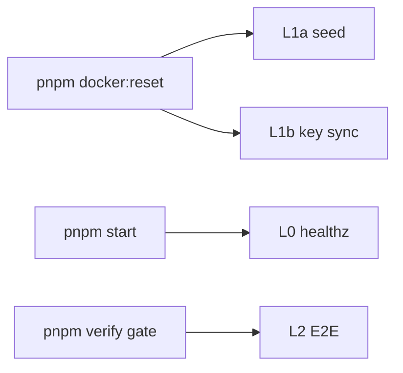

# 本地开发 · 启动契约（SSOT）

> **本文是本地命令与就绪层级的唯一权威说明。**  
> 手工修复步骤：[manual-testing/本地模式-修复索引.md](./manual-testing/本地模式-修复索引.md) · River 后台任务：[Backend-离线任务.md](./Backend-离线任务.md) · 后端装配命名：[Backend-模块化设计.md](./Backend-模块化设计.md) §4.2

**原则**：重初始化在 **`pnpm docker:reset`**；日常 **`pnpm start` 只保证 L0**（进程 + 轻量 attach infra）。  
**假设**：`pnpm start`（full）要求 NewAPI 镜像已存在；首次 clone 须先 `pnpm docker:reset` 或 `pnpm infra`。

---

## 1. 就绪层级

| 层级 | 含义 | 谁保证 | 怎么验 |
| --- | --- | --- | --- |
| **L0** | Backend / Frontend 进程可响应 | `pnpm start` / `start:lite` | `GET /healthz`（start 唯一等待项） |
| **L1a** | Demo 业务数据在 PG | `pnpm docker:reset` 末步 `dev-bootstrap` | 空库时 `openStore` → `seed.Apply`（`BOOTSTRAP_MODE=demo`） |
| **L1b** | Demo Platform Key 已 sync 到 NewAPI | 同上 `dev-bootstrap` | `GET /api/dev/readiness`（**诊断**，不挡 start） |
| **L2** | Gateway + webhook + 消耗 E2E | `pnpm verify gate` | verify 脚本（含 readiness + 自建 Key + Gateway） |



`readiness` 只表示 **L1b**，不代表 L1a 或 L2。

---

## 2. 命令契约（一张表）

| 命令 | 就绪目标 | 主要阶段 | 日常频率 |
| --- | --- | --- | --- |
| **`pnpm docker:reset`** | L1a + L1b | 清卷 → infra **重** → token → channel → redis flush → **dev-bootstrap** | 首次 / 改 seed / 清库 |
| **`pnpm bootstrap`** | infra + token（可选 channel） | `start-infra` + mint token；**不**自动 key sync | NewAPI 卷丢、PG 还在 |
| **`pnpm start`** | L0（full 另 attach NewAPI + mock） | `ensure-infra` **轻** → backend + frontend + mock | 测 Gateway / 模拟消耗 |
| **`pnpm start:lite`** | L0 | 仅 Postgres → backend + frontend | **默认推荐**（改 UI/API） |
| **`pnpm infra`** | 容器 up | `start-infra`（可 build） | 修 infra、无清库 |
| **`pnpm verify gate`** | L2 | healthz + readiness + 冒烟 | 发 PR / 通路验收 |

### 2.1 `pnpm docker:reset` 阶段链

| # | 阶段 | 脚本 | 产出 |
| --- | --- | --- | --- |
| 1 | 清 PG 卷 | `scripts/dev/reset.sh` | 空 `tokenjoy` DB |
| 2 | PG 就绪 | 同上 | `postgres-init`：`newapi`/`logs` DB + `logs.newapi` schema |
| 3 | Infra 重 | `start-infra.sh` | Postgres + Redis + NewAPI（**build/wait**） |
| 4 | Token | `bootstrap-local-after-reset.sh` | `NEW_API_ADMIN_TOKEN` → `apps/backend/.env` |
| 5 | Channel | `setup-dev-mock-channel.sh` | `local-test-model`（best-effort） |
| 6 | Redis flush | `reset.sh` | 清 NewAPI 缓存态 |
| 7 | Keys + seed | `dev-bootstrap` | **L1a**（空库 seed）+ **L1b**（`provision.Bootstrap`） |

### 2.2 `pnpm start` 阶段链

| # | 阶段 | 脚本 | 说明 |
| --- | --- | --- | --- |
| 1 | Infra 轻 | `ensure-infra.sh` | `up -d --wait --no-build` |
| 2 | Apps | `start-full.sh` | backend + frontend（`wait-on /healthz`）+ dev-mock |

**不做**：readiness wait、进程内 Bootstrap、River drain、build image、mint token、channel。

### 2.3 `dev-bootstrap` 里发生了什么

`cmd/dev-bootstrap` → `RunDevBootstrap`（`skipWorker=true`）：

1. `openStore`：若 PG 空且 `BOOTSTRAP_MODE=demo` → **L1a** `seed.Apply`
2. `provision.Bootstrap`：同步全部 active demo Platform Key → **L1b**

与 River `newapi_sync` job 无关；seed key 走同步路径。

---

## 3. 脚本入口（实现地图）

| 入口 | 分发 | 组合脚本 |
| --- | --- | --- |
| `scripts/dev.sh` | `start` \| `lite` \| `reset` \| `infra` \| `test` | `scripts/dev/*.sh` |
| `package.json` | `docker:reset` / `reset` → `dev.sh reset` | 同左 |
| Infra 重 / 轻 | — | `apps/newapi/scripts/start-infra.sh` / `ensure-infra.sh` |

```text
scripts/dev.sh → scripts/dev/start-full.sh   → ensure-infra + concurrently
              → scripts/dev/reset.sh         → bootstrap-local + dev-bootstrap
              → scripts/dev/start-lite.sh    → postgres only + apps
scripts/verify.sh → gate | integration | ci
```

---

## 4. 决策树

```text
刚 clone / 改了 seed JSON / 要清库？
  └─ 是 → pnpm docker:reset → pnpm start 或 start:lite

只改前端 / 大部分 API？
  └─ pnpm start:lite

要测 Gateway / 模拟消耗 Popup？
  └─ 先确保做过 docker:reset → pnpm start

ensure-infra 报 no image？
  └─ pnpm docker:reset  或  pnpm infra

readiness 503，但不想清 PG？
  └─ pnpm bootstrap && pnpm -F @tokenjoy/backend dev-bootstrap

要验收全链路？
  └─ pnpm verify gate

UI 白屏 / API 不通？
  └─ curl /healthz；查 DATABASE_URL、backend 日志

River producer 日志很多？
  └─ 正常后台；看 num_jobs_stuck；与 start 无关
```

---

## 5. 速查命令

```bash
pnpm install
pnpm docker:reset          # 首次 / 改 seed / 清库（L1a + L1b）
pnpm start:lite            # 日常 UI（L0）
pnpm start                 # Gateway / 模拟消耗（L0 + infra 轻 attach）
curl -s localhost:8080/api/dev/readiness   # 可选：查 L1b
pnpm verify && pnpm verify gate            # PR 前
```

---

## 6. Backlog

| 优先级 | 项 | 说明 |
| --- | --- | --- |
| P1 | 模拟消耗 Popup 未 sync 提示 | UI 内提示 `pnpm docker:reset`，不挡 frontend |
| P1 | `bootstrap --sync-keys` | 合并 `dev-bootstrap`，修 L1b 不清库 |
| P2 | `scripts/dev/phases/*.sh` | reset/start/bootstrap 组合共享阶段 |
| P2 | `package.json` `"reset"` alias | ✅ 指向 `docker:reset` |
| P2 | CI compose profile | lite / full 分离 |
