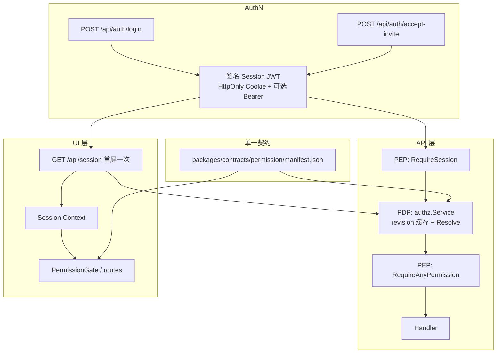

# 权限管理实现文档（目标架构）

> **架构选型**：方案 B —— **Identity Token + 应用内 PDP 请求时刻求值**。  
> **文档范围**：下文描述 **当前已实现** 的行为与契约。实现索引见 §14.4。

**读者**：后端 / 前端 / 架构 / QA。  
**关联**：[Backend-架构.md](./Backend-架构.md) §4、[Frontend.md](./Frontend.md) §5.4、[Roadmap.md](./Roadmap.md) §7。

---

## 1. 目标架构总览



### 1.1 核心原则

| #   | 原则                                                                                                                              |
| --- | --------------------------------------------------------------------------------------------------------------------------------- |
| P1  | Token **仅 identity**：`sub`、`company_id`、`sid`、`iat`、`exp` — **禁止** `permissions` / `roles`                                |
| P2  | 授权 **仅在服务端 PDP** 求值；UI **禁止**本地展开角色算权限                                                                       |
| P3  | Capability 以 **`manifest.json` 为唯一真相**；前后端禁止各维护一份漂移映射                                                        |
| P4  | 业务 `/api/*` 路由需 Session + 对应 capability；**例外**见 §4.4                                                                   |
| P5  | `authz_revision` 驱动 PDP 缓存失效与 UI stale 检测                                                                                |
| P6  | UI 鉴权：**首屏一次** `GET /api/session` → Context 内存判断；失效时允许 `refreshSession()`，**禁止** per-component 调 session API |
| P7  | 管理台 Session 与 Gateway `sk-xxx` **永久分离**（不同 AuthN 体系）                                                                  |

### 1.2 非目标

- 独立 AuthZ 微服务（OPA / SpiceDB）— 保持应用内 PDP
- 用户级直接挂 permission — 维持 RBAC
- Token 内嵌 permission list（方案 A）
- 部门级 ABAC / ReBAC — 另立文档，不在本次破坏性切换范围
- MVP 会话吊销列表（`sid` blocklist）— 依赖短 TTL + 清 Cookie；见 §3.2

---

## 2. 与现实现的破坏性差异

切换日 **删除或替换** 下列行为，**不保留** demo 例外或双路径。

| 现实现（删除）                                       | 目标架构（替换）                                      |
| ---------------------------------------------------- | ----------------------------------------------------- |
| Cookie / Bearer 值为裸 `member_id`                   | 仅接受 **签名 Session JWT**                           |
| `APP_PROFILE=demo` 下多数 GET 免 Session             | **删除 profile 鉴权分叉**；统一 Session + capability  |
| `prod` 下 `UsedBearerAuth` → 401                     | Cookie 与 `Authorization: Bearer <jwt>` **等价**      |
| 前端 `/login` 选成员 `setSessionMemberCookie(id)`    | `POST /api/auth/login` 由后端 `Set-Cookie`            |
| 前端 `permissions.ts` 生产路径推导权限               | UI **仅**消费 `GET /api/session` 的 `permissions[]`   |
| 前后端各自维护 capability 列表                       | **仅** `manifest.json` + 生成/测试校验                |
| 每次 PDP 全量 `Members()` + `Roles()`                | `GetMemberAuthz(memberID)` 单查询 + revision 缓存     |
| `SessionContext` 无版本字段                          | 必含 `authzRevision`                                  |
| `CompanyResolve` 从裸 member ID 反查租户             | **仅**信任 JWT `company_id`（§3.5）                   |
| 仅角色页 `refreshSession`                            | 凡 PAP 变更 + focus/broadcast/403/revision 头统一策略 |
| `tokenjoy_platform_session` 裸 operator ID（若存在） | 平台面同样签名 JWT（独立 issuer/secret）              |

---

## 3. Identity（AuthN）

### 3.1 Session JWT

**Cookie 名**（不变）：`tokenjoy_session_member`  
**值**：紧凑 JWT（HMAC-SHA256 或 RS256），HttpOnly、`SameSite=Lax`、`Secure`（HTTPS）。

**Claims（固定集合，扩展需改 manifest + 本文）**

```json
{
  "sub": "m-admin",
  "company_id": 1,
  "sid": "550e8400-e29b-41d4-a716-446655440000",
  "iat": 1710000000,
  "exp": 1710086400
}
```

| Claim         | 说明                                                 |
| ------------- | ---------------------------------------------------- |
| `sub`         | `members.id`                                         |
| `company_id`  | 租户；**必须**与 DB 中该 member 的 `company_id` 一致 |
| `sid`         | 会话 ID；MVP 仅写入 claim，不做吊销                  |
| `iat` / `exp` | 由 `SESSION_TTL_SEC` 控制                            |

**明确禁止的 claims**：`permissions`、`roles`、`read_only`。

### 3.2 登录与签发

| 端点                           | 行为                                                                           |
| ------------------------------ | ------------------------------------------------------------------------------ |
| `POST /api/auth/login`         | `{ email, password }` → 校验 `members.password_hash` → 签发 JWT → `Set-Cookie` |
| `POST /api/auth/logout`        | 清 Cookie；MVP **不**维护 `sid` 吊销集                                         |
| `POST /api/auth/accept-invite` | 激活成员 → 签发 JWT（**不再**写裸 ID）                                         |

**删除**：任何接受客户端自行写入 `member_id` 作为会话凭证的路径。

**种子账号（WP-2.6）**：demo / 测试环境须为种子成员写入 `password_hash`；默认测试账号 **`admin@example.com` / `demo1234`**，供 E2E 与本地 dev 使用。

### 3.3 Bearer

- `Authorization: Bearer <jwt>` 与 Cookie **同一 JWT、同一 Parse 逻辑**。
- 自动化测试、CLI 使用 test helper **签发 JWT**，禁止 `Bearer m-admin`。

### 3.4 平台面（SaaS）

| Cookie                      | 说明                                      |
| --------------------------- | ----------------------------------------- |
| `tokenjoy_platform_session` | 独立 JWT：`sub` = `platform_operators.id` |

企业面与平台面密钥分离：`SESSION_SECRET` / `PLATFORM_SESSION_SECRET`。

平台面 **不走** 企业 RBAC PDP；平台 PEP 与 operator 能力见 [Frontend.md](./Frontend.md) §5.2.5 与平台 Handler 注册（`POST /api/platform/auth/login` 等为公开路由）。

### 3.5 租户绑定（SaaS 必做）

`RequireSession` / `CompanyResolve` 改造后须满足：

| 步骤         | 规则                                                                          |
| ------------ | ----------------------------------------------------------------------------- |
| Parse JWT    | 提取 `sub`、`company_id`                                                      |
| 校验 member  | `GetMemberAuthz(company_id, sub)`；member 不存在或 `status != active` → `401` |
| 校验租户一致 | JWT `company_id` **必须等于** member 行 `company_id`；否则 `401`              |
| 注入上下文   | `ctxcompany` **仅**来自 JWT `company_id`；**忽略** `X-Company-Id`             |

签发 JWT 时，`company_id` 取自 member 所属租户，禁止客户端指定。

### 3.6 `internal/identity/` 模块（已实现）

身份/鉴权已收口至单一顶层包，HTTP 与 domain 通过下列子包消费：

| 子包           | 路径                              | 职责                                                                          |
| -------------- | --------------------------------- | ----------------------------------------------------------------------------- |
| `sessiontoken` | `internal/identity/sessiontoken/` | JWT `Issue` / `Parse`（HS256）                                                |
| `credentials`  | `internal/identity/credentials/`  | 成员/平台密码校验、`BootstrapPlatformIfNeeded`                                |
| `authz`        | `internal/identity/authz/`        | PDP：`GetSessionContext`、LRU 缓存、`ResolveMemberPermissions`、`HasAny`      |
| `httpx`        | `internal/identity/httpx/`        | Cookie/Bearer 提取、`ParseMemberToken`、Context 读写、`X-Authz-Revision` 常量 |

**契约层**（非运行时 PDP）：`packages/contracts/permission/manifest.json` → 生成 `keys.go` / `permission-keys.ts`。

**DI**：`app/wire_identity.go` 装配；`ServiceRegistry` 嵌入 `httpdeps.Deps`（见 §14.4）。

---

## 4. PDP / PEP（AuthZ）

### 4.1 组件职责

| 组件            | 包 / 路径                                      | 职责                                                                      |
| --------------- | ---------------------------------------------- | ------------------------------------------------------------------------- |
| **PIP**         | `store/org`                                    | `GetMemberAuthz(companyID, memberID)` → member + role names + role grants |
| **PDP**         | `identity/authz` + `infra/permission` manifest | `ResolveMemberPermissions` → `[]capability` + `readOnly`                  |
| **PEP-Session** | `middleware/session`                           | Parse JWT → 租户绑定（§3.5）→ `GetSessionContext`                         |
| **PEP-Authz**   | `middleware/authz`                             | `HasAny(permissions, required...)` — **OR** 语义                          |
| **PAP**         | `domain/org/role`                              | 角色 CRUD；授权变更时 `authz_revision++`                                  |

**Grants 依赖倒置**（domain 不直接 import `infra/permission`）：

```
domain/grants.Normalizer（接口）
  ← infra/permission.NewGrantNormalizer()
  → org/structure/role.go（NormalizeGrantIDs）
  → company/service_create.go（RoleGrantIDs 展开 preset）
```

- 预设角色名常量：`domain/grants/roles.go`；`infra/permission/roles.go` re-export。
- RBAC 数据模型不变：`members` ↔ `member_roles` ↔ `roles` ↔ `role_permission_grants` ↔ `permissions`。

> `RequireAnyPermission(a, b)` 表示拥有 **a 或 b 任一** 即可通过。不存在 `RequireAll`；若未来需要 AND，须新增中间件，**不得**误用 variadic 参数表达 AND。

### 4.2 `authz_revision`

**Schema 变更（破坏性）**

```sql
ALTER TABLE companies ADD COLUMN authz_revision BIGINT NOT NULL DEFAULT 0;
```

新库须在 `schema.sql` 基线中直接包含该列，不仅依赖 ALTER。

**Bump 触发点（事务内与写操作同一 commit）**

| 触发                                 | 说明                                           |
| ------------------------------------ | ---------------------------------------------- |
| `UpdateRole` / `DeleteRole`          | 角色权限定义变化                               |
| `AddRoleMember` / `RemoveRoleMember` | 成员-角色绑定变化                              |
| `CreateMember`                       | 新增成员（默认角色）                           |
| `UpdateMember` 当 `roles` 变化       | 成员角色直接修改                               |
| `UpdateMemberStatus` 禁用成员        | 权限即时失效                                   |
| `SetMembers` 当 `roles` 字段变化     | 批量改角色                                     |
| `BatchImport`                        | CSV 批量导入新成员成功后                       |
| 飞书 `importFromProvider`            | **仅新增** import 成员时（换部门/更名不 bump） |
| `applySyncDiff`                      | 同步软删除（成员设为 `inactive`）时            |

**不 bump（依赖 request-time PDP 即可）**

| 场景           | 说明                                                                                     |
| -------------- | ---------------------------------------------------------------------------------------- |
| 成员换部门     | 不改变 capability；dashboard **数据范围**由 domain `SessionScope` 按 `departmentId` 过滤 |
| 只读查询类变更 | 不影响授权图                                                                             |

### 4.3 PDP 缓存

```
key   = (company_id, member_id, authz_revision)
value = { permissions: []string, readOnly: bool }
```

- 进程内 LRU，`AUTHZ_CACHE_SIZE` 默认 `4096`。
- `authz_revision` 为 **租户级**：任一成员授权变更会使该租户 **所有成员** 缓存 entry 因 revision 变化而 miss（可接受；实现简单）。
- **无**按 member 逐 key 失效 API。
- `GetMemberAuthz` 替代全量 `Members()` + `Roles()`。

### 4.4 路由策略（统一，无 demo 例外）

**公开路由（无 Session）**

| 路由                            | 鉴权               |
| ------------------------------- | ------------------ |
| `POST /api/auth/login`          | 无                 |
| `POST /api/auth/logout`         | 无                 |
| `POST /api/auth/accept-invite`  | 邀请 token（body） |
| `GET /healthz` 等               | 无                 |
| `POST /api/internal/webhooks/*` | Webhook 密钥       |
| `POST /api/platform/auth/login` | 无（平台面）       |

**仅需 Session、不要求 capability**

| 路由               | 说明                                  |
| ------------------ | ------------------------------------- |
| `GET /api/session` | 返回 `SessionContext`；未登录 → `401` |

**业务路由**

| 路由辅助                    | 行为                                                                               |
| --------------------------- | ---------------------------------------------------------------------------------- |
| `ReadRoutes`                | `RequireSession` + 可选 `RequireAnyPermission(read...)`                            |
| 写路由                      | 同样以 `ReadRoutes` 建立 Session 链，再在子路由挂 `RequireAnyPermission(write...)` |
| `AllowSyncTrigger`          | `POST /api/org/sync/trigger` 特例；保留专用中间件                                  |
| `CompanyReadOnlyMiddleware` | 企业 `suspended` 时禁止非 GET（与 `SessionContext.readOnly` 无关）                 |

读 capability 前缀默认值见 §14.2；写 capability 按端点见 §14.3。Dashboard、Keys 等有 **子路径差异**，不可仅用前缀统一 middleware。

**删除**：`PublicOrReadRoutes` 的 demo 免 Session 分支、`middleware` 内 `IsDemoProfile()` 鉴权判断。

### 4.5 `SessionContext` 响应（权威）

`GET /api/session` 与 request context **同一结构**：

```json
{
  "companyId": 1,
  "authzRevision": 7,
  "member": {
    "id": "m-admin",
    "name": "管理员",
    "roles": ["组织管理员"],
    "departmentId": "dept-1",
    "status": "active"
  },
  "permissions": ["org:read", "budget:allocate"],
  "readOnly": false
}
```

| 字段            | 说明                                                                         |
| --------------- | ---------------------------------------------------------------------------- |
| `authzRevision` | 与 `companies.authz_revision` 一致；UI 用于 stale 检测                       |
| `permissions`   | PDP 输出；**UI 唯一权限来源**                                                |
| `readOnly`      | 无 manifest `writeCapabilities` 中任一项时为 `true`（含 `billing:recharge`） |

### 4.6 `authzRevision` 同步（响应头）

凡已通过 `RequireSession` 的 API 响应，附带：

```
X-Authz-Revision: <companies.authz_revision>
```

前端 axios/fetch 拦截器：若响应头 revision **大于** Context 中 `authzRevision`，触发 `refreshSession()`（与 §7.3 并用）。这样无需额外轮询即可感知他 Tab / 他用户的 PAP 变更。

---

## 5. RBAC 数据模型（保留，微调）

模型不变：`members` ↔ `member_roles` ↔ `roles` ↔ `role_permission_grants` ↔ `permissions`。

**Preset 角色**：权限映射 **迁入 `manifest.json` 的 `presetRoles`**；PDP 按角色 **名称** 查表展开，**不**解析 DB 中 `org:*` / `self:*` 等遗留 permission 串（DB 字段可保留，仅供 UI 展示）。

**Custom 角色**：存 `p-*` 或 `*`；展开规则以 manifest 的 `permissionIdMap` 为准。

**隐式规则（写入 manifest `rules`，由 PDP 统一执行）**

| 规则                     | 行为                                                                             |
| ------------------------ | -------------------------------------------------------------------------------- |
| `budgetWriteImpliesRead` | 任一 `budget:allocate` / `budget:approve` / `budget:policy` → 附加 `budget:read` |
| `readOnly`               | 无 `writeCapabilities` 中任一项 → `readOnly: true`                               |

---

## 6. 单一契约：`manifest.json`

**路径**：`packages/contracts/permission/manifest.json`（生成物：`keys.go`、`permission-keys.ts`；backend `manifest.json` 为 `go:embed` 副本）

```json
{
  "version": 1,
  "capabilities": [
    "org:read",
    "org:datasource",
    "org:structure",
    "org:roles",
    "org:members",
    "budget:read",
    "budget:allocate",
    "budget:approve",
    "budget:policy",
    "model:read",
    "model:manage",
    "model:whitelist",
    "keys:read",
    "keys:admin",
    "keys:provider",
    "self:keys",
    "self:approval",
    "dashboard:cost",
    "dashboard:usage",
    "audit:read",
    "api:call",
    "billing:read",
    "billing:recharge"
  ],
  "permissionIdMap": {
    "p-1": "org:structure",
    "p-2": "org:members",
    "p-19": "org:read"
  },
  "presetRoles": {
    "超级管理员": ["*"],
    "组织管理员": ["*"],
    "普通成员": ["self:keys", "self:approval"],
    "只读审计员": [
      "org:read",
      "budget:read",
      "keys:read",
      "model:read",
      "audit:read",
      "dashboard:cost",
      "dashboard:usage",
      "self:approval"
    ],
    "API 调用者": ["api:call"]
  },
  "writeCapabilities": [
    "org:datasource",
    "org:structure",
    "org:roles",
    "org:members",
    "budget:allocate",
    "budget:approve",
    "budget:policy",
    "model:manage",
    "model:whitelist",
    "keys:admin",
    "keys:provider",
    "billing:recharge"
  ],
  "budgetWriteCapabilities": ["budget:allocate", "budget:approve", "budget:policy"],
  "rules": {
    "budgetWriteImpliesRead": true
  }
}
```

> `permissionIdMap` 须覆盖 §14.1 全部 `p-*`；上例省略号处由生成器补全。  
> 「预算审批员」等为 **custom** 角色，不进 `presetRoles`，权限存 DB `p-*` 引用。

### 6.1 前后端消费规则

| 侧       | 规则                                                                        |
| -------- | --------------------------------------------------------------------------- |
| **后端** | `keys.go` 常量 **由 manifest 生成**；PDP 逻辑在 `identity/authz/resolve.go` |
| **前端** | `permission-keys.ts` **由 manifest 生成**；**删除**手写 `PERMISSION` 对象   |
| **测试** | CI：`manifest` ↔ 后端 ↔ 前端 三方一致                                       |

### 6.2 删除的前端模块职责

| 删除 / 降级                          | 说明                                           |
| ------------------------------------ | ---------------------------------------------- |
| `resolveMemberPermissions` 用于生产  | 仅保留 **manifest 契约单测**；运行时禁止调用   |
| `PRESET_ROLE_CAPABILITIES` 手写      | 改读 manifest 或删除                           |
| `setSessionMemberCookie`             | 删除；登录一律 API 写 Cookie                   |
| `DEV_SWITCHABLE_MEMBERS` 直写 cookie | 改为 dev `POST /api/auth/login` 用种子账号密码 |

---

## 7. UI 层（一次 Session）

### 7.1 加载

```
App mount
  → AuthSessionProvider
  → GET /api/session（带 JWT Cookie）
  → Zod SessionContextSchema（含 authzRevision）
  → SessionReactContext
```

**禁止**：`localStorage` 存 `permissions`；禁止 SSR 信任客户端算出的权限。

### 7.2 判断

| 用途     | API                                    |
| -------- | -------------------------------------- |
| 组件显隐 | `usePermissions().has(cap)`            |
| 写操作   | `canWrite` 或 `<PermissionGate write>` |
| 路由     | `canAccessRoute(path, permissions)`    |

每个 `PermissionGate`：**零 HTTP**（首屏加载除外）。

### 7.3 失效与刷新

| 事件                                                | 动作                                                                      |
| --------------------------------------------------- | ------------------------------------------------------------------------- |
| PAP mutation 成功（角色/成员角色）                  | `refreshSession()`                                                        |
| 响应头 `X-Authz-Revision` > Context `authzRevision` | `refreshSession()`                                                        |
| `window.focus` 且距上次 session > 60s               | `refreshSession()`                                                        |
| 任意 Tab `BroadcastChannel('tokenjoy-authz')`       | 收到后 `refreshSession()`                                                 |
| 业务 API `403`                                      | `refreshSession()` **一次** → 仍 403 则 toast（视为真实无权限，不再重试） |

**删除**：仅 `use-roles-page` 局部 refresh 的特例；统一 mutation hook 或 event bus。

---

## 8. Billing 与 Capability 全集

目标态 **前后端同步**，`manifest` 必含：

| Capability         | ID   | 路由 / API                               |
| ------------------ | ---- | ---------------------------------------- |
| `billing:read`     | p-22 | `GET /api/billing/wallet`；`/billing` 页 |
| `billing:recharge` | p-23 | `POST /api/billing/recharge`             |

前端目标态：

- `routes.ts`：`/billing` → `requiredPermissions: [billing:read]`
- `AppApis.billingApi` 接入
- 充值按钮：`billing:recharge`（且 `readOnly === false`）

---

## 9. Gateway（不变）

| 体系          | 凭证            | 授权                    |
| ------------- | --------------- | ----------------------- |
| 管理台        | Session JWT     | RBAC PDP                |
| Gateway | `Bearer sk-xxx` | `platform_key_mappings` + 预检 |

`api:call` capability 仍约束成员侧 Key 申请；Gateway **不**解析 Session JWT。

---

## 10. 配置

| 变量                      | 必填       | 说明            |
| ------------------------- | ---------- | --------------- |
| `SESSION_SECRET`          | ✅         | 企业面 JWT 签名 |
| `SESSION_TTL_SEC`         | —          | 默认 `86400`    |
| `PLATFORM_SESSION_SECRET` | SaaS 时 ✅ | 平台面 JWT      |
| `AUTHZ_CACHE_SIZE`        | —          | 默认 `4096`     |

鉴权不依赖 profile：无 demo GET 免 Session 分叉；统一 Session JWT + capability。  
部署 / 空库 / Cookie / Clock 等非鉴权配置见 [Backend-配置架构.md](./Backend-配置架构.md)。

---

## 11. 实现状态（WP-1–6）

> 原工作包清单；**✅ 已实现 · ⚠️ 部分 · ❌ 未实现**

### WP-1 契约与 Schema — ✅

| #   | 任务                                          | 状态 |
| --- | --------------------------------------------- | ---- |
| 1.1 | `manifest.json` + `pnpm generate:permissions` | ✅   |
| 1.2 | `companies.authz_revision` schema             | ✅   |
| 1.3 | `SessionContext` + `authzRevision`            | ✅   |
| 1.4 | 删除重复 capability 硬编码                    | ✅   |

### WP-2 Identity — ✅

| #   | 任务                                     | 状态 |
| --- | ---------------------------------------- | ---- |
| 2.1 | `identity/sessiontoken` Issue/Parse/测试 | ✅   |
| 2.2 | `POST /api/auth/login`、`logout`         | ✅   |
| 2.3 | `accept-invite` 签发 JWT                 | ✅   |
| 2.4 | 裸 ID 分支删除                           | ✅   |
| 2.5 | `CompanyResolve` 信任 JWT `company_id`   | ✅   |
| 2.6 | 平台面独立 JWT                           | ✅   |
| 2.7 | 种子 `password_hash` + 测试账号          | ✅   |

### WP-3 PDP — ✅

| #    | 任务                                                         | 状态 |
| ---- | ------------------------------------------------------------ | ---- |
| 3.1  | `GetMemberAuthz` 单查询                                      | ✅   |
| 3.2  | PAP bump（角色/成员/CreateMember/UpdateMember roles/Status） | ✅   |
| 3.2b | import / BatchImport / sync 软删除 bump                      | ✅   |
| 3.3  | PDP LRU cache（`identity/authz/cache.go`）                   | ✅   |
| 3.4  | preset 从 manifest 加载                                      | ✅   |

### WP-4 PEP 统一 — ✅

| #   | 任务                               | 状态 |
| --- | ---------------------------------- | ---- |
| 4.1 | 业务路由 `ReadRoutes` + capability | ✅   |
| 4.2 | 删 demo 免 Session 分支            | ✅   |
| 4.3 | Bearer = Cookie 同 JWT             | ✅   |
| 4.4 | `X-Authz-Revision` 响应头          | ✅   |
| 4.5 | Keys self 域端点拆分               | ✅   |
| 4.6 | `authz_cases_test` 覆盖            | ✅   |

### WP-5 前端 — ⚠️

| #   | 任务                                                     | 状态                                                        |
| --- | -------------------------------------------------------- | ----------------------------------------------------------- |
| 5.1 | 删裸 cookie 登录                                         | ✅                                                          |
| 5.2 | `/login` → `POST /api/auth/login`                        | ✅                                                          |
| 5.3 | `SessionContextSchema` + `authzRevision`                 | ✅                                                          |
| 5.4 | `refreshSession` + revision 头 / focus / broadcast / 403 | ✅                                                          |
| 5.5 | manifest 生成 `permission-keys.ts`                       | ✅                                                          |
| 5.6 | Billing 路由 + API + Gate                                | ⚠️ `/billing` 已接入；缺 `confirm` 与 `WalletView` 字段对齐 |
| 5.7 | E2E 走 login API                                         | ⚠️ helper 已实现；spec 仅覆盖未登录重定向                   |

### WP-6 测试与工具 — ✅

| #   | 任务                           | 状态 |
| --- | ------------------------------ | ---- |
| 6.1 | `testutil.IssueSessionJWT`     | ✅   |
| 6.2 | `manifest_test` 前后端         | ✅   |
| 6.3 | Playwright `auth.ts` login API | ✅   |
| 6.4 | 删裸 member cookie fixture     | ✅   |

---

## 12. 验收标准（切换日 Gate）

### 12.1 安全

- [x] 伪造 / 篡改 JWT → 任意 API `401`（`authz_security_test.go`）
- [x] 裸 `Cookie: tokenjoy_session_member=m-admin` → `401`（`authz_security_test.go`）
- [x] 裸 `Bearer m-admin` → `401`（`authz_security_test.go`）
- [x] JWT `company_id` 与 member 实际租户不一致 → `401`（`authz_security_test.go`）
- [x] JWT claims 无 `permissions` 字段（`identity/sessiontoken` issuer 单测）
- [x] 种子测试账号 `POST /api/auth/login` 成功并写入 JWT Cookie（`authz_security_test.go`、E2E）

### 12.2 Authz

- [x] 未登录访问任意 `GET /api/org/departments` → `401`（`handler_test.go`）
- [x] 登录无 `org:read` → `403`（`authz_test.go` `TestProdGetReadForbiddenForMember`）
- [x] 仅有 `dashboard:cost` 可访问 `/api/dashboard/cost/*`，不可访问 `/api/dashboard/usage/*`（`authz_security_test.go`）
- [x] 仅有 `self:approval` 可 `POST /api/keys/approvals`，不可 `GET /api/keys/platform`（`authz_security_test.go`）
- [x] 改角色后 **下一请求** API 权限变；`authzRevision` +1；`X-Authz-Revision` 同步（`authz_revision_test.go`）
- [x] PDP 缓存：同 revision 不重复 `GetMemberAuthz`（`tests/identity/authz/session_cache_test.go`）
- [x] 禁用成员后下一请求 `401`（`authz_security_test.go`）

### 12.3 UI

手工 QA 待办见 [plan.md](./plan.md) §5。

- [ ] **首屏**仅 **1 次** `GET /api/session`（Network 面板）；focus / broadcast / revision 头触发的 refresh **不计入**失败（需手工 QA）
- [x] `PermissionGate` 不触发额外 session 请求（`permission-gate.test.tsx`）
- [x] `AuthSessionProvider`：revision 头 / focus(60s) / broadcast / 403 触发 `refreshSession`（`auth-session-provider.tsx`）
- [x] PAP mutation 后 `broadcastAuthzChange`（roles / structure / datasource 页）
- [ ] 角色变更后 nav 更新（无需 F5）（需手工 QA）
- [ ] Tab B 在 Tab A 改权后 revision 头或 broadcast 同步（需手工 QA）

### 12.4 契约

- [x] `pnpm generate:permissions && pnpm test` 通过
- [x] `go test ./...` 通过
- [x] manifest 增删 capability 时 CI 失败直至两端同步（`verify` 含 `check:permissions`）

---

## 13. 测试命令

```bash
# 契约（根目录 verify 含 check:permissions）
pnpm check:permissions && pnpm test
cd packages/contracts && pnpm generate && cd ../.. && pnpm test

# E2E（登录 API，非写 cookie）
pnpm test:e2e
```

---

## 14. 附录

### 14.1 Capability 表（manifest 须完整包含）

| Key                | ID   |
| ------------------ | ---- |
| `org:read`         | p-19 |
| `org:datasource`   | p-4  |
| `org:structure`    | p-1  |
| `org:roles`        | p-3  |
| `org:members`      | p-2  |
| `budget:read`      | p-12 |
| `budget:allocate`  | p-5  |
| `budget:approve`   | p-6  |
| `budget:policy`    | p-13 |
| `model:read`       | p-21 |
| `model:manage`     | p-14 |
| `model:whitelist`  | p-7  |
| `keys:read`        | p-20 |
| `keys:admin`       | p-15 |
| `keys:provider`    | p-16 |
| `self:keys`        | p-17 |
| `self:approval`    | p-18 |
| `dashboard:cost`   | p-8  |
| `dashboard:usage`  | p-9  |
| `audit:read`       | p-10 |
| `api:call`         | p-11 |
| `billing:read`     | p-22 |
| `billing:recharge` | p-23 |

### 14.2 GET 读权限映射（前缀默认）

> PEP 使用 `RequireAnyPermission`（**OR**）。下表为路由注册 **默认** 读 capability；子路径有更细要求时以 §14.3 为准。

| API 前缀                                                     | 读 capability（OR）                 |
| ------------------------------------------------------------ | ----------------------------------- |
| `/api/org/*`                                                 | `org:read`                          |
| `/api/budget/*`                                              | `budget:read`                       |
| `/api/models/*`                                              | `model:read`                        |
| `/api/audit/*`                                               | `audit:read`                        |
| `/api/billing/*`                                             | `billing:read`                      |
| `/api/dashboard/cost/*`                                      | `dashboard:cost`                    |
| `/api/dashboard/usage/*`                                     | `dashboard:usage`                   |
| `/api/keys/provider`、`/platform`、`/platform/quota-summary` | `keys:read`                         |
| `/api/keys/approvals`（列表）                                | `keys:read` **或** `budget:approve` |

### 14.3 写权限与 Keys 特例（按端点）

**Org / Budget / Models** — `ReadRoutes` + 子链 `RequireAnyPermission`：

| 端点模式                                 | 写 capability                      |
| ---------------------------------------- | ---------------------------------- |
| `/api/org/data-source/*`、`/sync/config` | `org:datasource`                   |
| `/api/org/departments/*`                 | `org:structure`                    |
| `/api/org/members/*`（含 invite）        | `org:members`                      |
| `/api/org/roles/*`                       | `org:roles`                        |
| `/api/org/sync/trigger`                  | `AllowSyncTrigger`（专用）         |
| `/api/budget/*` POST/PUT/DELETE          | 各 handler 已有细粒度 cap          |
| `/api/models/*` 写                       | `model:manage` / `model:whitelist` |
| `/api/billing/recharge`                  | `billing:recharge`                 |

**Keys — self 域与 admin 域分离**

| 端点                                          | 方法 | capability       |
| --------------------------------------------- | ---- | ---------------- |
| `/api/keys/approvals`                         | POST | `self:approval`  |
| `/api/keys/approvals/{id}/approve`、`/reject` | PUT  | `budget:approve` |
| `/api/keys/provider/*` 写                     | \*   | `keys:provider`  |
| `/api/keys/platform/*` 写                     | \*   | `keys:admin`     |

> 目标态须调整现有「全部读路由统一 `keys:read`」的注册方式，使 self 能力可访问审批相关端点，与前端 `/keys/mine`、`/keys/approval` 路由一致。

### 14.4 源码索引（目标态）

| 模块               | 路径                                                                                                                                                      |
| ------------------ | --------------------------------------------------------------------------------------------------------------------------------------------------------- |
| Manifest           | `packages/contracts/permission/manifest.json`                                                                                                             |
| JWT                | `internal/identity/sessiontoken/`                                                                                                                         |
| 凭证校验           | `internal/identity/credentials/`                                                                                                                          |
| HTTP Token/Context | `internal/identity/httpx/`                                                                                                                                |
| PDP                | `internal/identity/authz/service.go`、`resolve.go`、`cache.go`                                                                                            |
| PEP                | `internal/http/middleware/session.go`、`authz.go`、`authz_revision.go`                                                                                    |
| PAP                | `internal/domain/org/structure/role.go`、`member.go`；`internal/domain/org/authz_bump.go` |
| Grants 契约        | `internal/domain/grants/`（角色常量 + `Normalizer`）；`internal/infra/permission/normalizer.go` |
| HTTP DI            | `internal/http/deps/deps.go`、`public.go`、`protected.go`；`ServiceRegistry` 嵌入 `Deps`                                                                  |
| Handler 基类       | `internal/http/handler/shared/base.go`（`ProtectedHandlerBase` 嵌入 `deps.Protected`）；公开路由 `auth` / `platform` 使用 `deps.Public` / `deps.Platform` |
| PEP 路由链         | `middleware.ReadRoutes(r, p deps.Protected, perms...)`、`AllowSyncTrigger(p)`                                                                             |
| 组合根             | `internal/app/wire_identity.go`、`wire_domain_services.go`、`wire_gateway.go`、`registry.go`                                                                |
| 前端 Session       | `features/session/auth-session-provider.tsx`、`authz-sync.ts`                                                                                             |
| 前端权限           | `hooks/use-permissions.ts`（只读 Context）                                                                                                                |

### 14.5 FAQ

**Q：还需要 migration 脚本迁会话吗？**  
A：不需要。切换后旧 Cookie 自然 401，用户重新登录。

**Q：E2E 怎么登录？**  
A：`POST /api/auth/login` 用种子账号；test helper 签发 JWT，禁止写裸 ID。

**Q：为何删掉 `APP_PROFILE` 鉴权分叉？**  
A：demo/prod 双轨导致测试环境与生产行为不一致；统一后 CI 即生产行为。

**Q：Dashboard 为何拆 cost / usage？**  
A：能力与前端路由一致；API 前缀级 PEP 用 OR 会放行整棵 `/api/dashboard/*`，故按子路径分别挂载。

**Q：OIDC 怎么办？**  
A：IdP 回调后仍只签发 **同一形状** identity JWT；PDP 不变。另开 SSO 文档。
